# 第五章：使用 VPC 进行网络和 EC2 安全性

亚马逊 **虚拟私有云**（**VPC**）是 AWS 云中的基础组件，允许在 AWS 云内创建与广泛的 AWS 公共云隔离的私有网络。它使我们能够将 AWS 资源部署到我们在 AWS 账户内定义的**虚拟专用网络**（**VPN**）中。这个虚拟网络类似于我们可能在自己的数据中心运行的传统网络，但具有 AWS 可扩展基础设施的额外优势。

用户对其虚拟网络环境拥有完全控制权。这意味着他们可以选择 IP 地址范围，设置公共和私有子网，并自定义路由表和网络网关，以满足自己的需求。这种灵活性使得可以在公共子网中部署可以访问互联网的实例（例如 Web 服务器），同时将仅限内部使用的实例（例如数据库服务器）放置在私有子网中。

此外，Amazon VPC 提供了一套强大的安全功能，如**安全组**、**网络访问控制列表**（**NACLs**）、**流日志**、VPN 连接、与 AWS **身份与访问管理**（**IAM**）的集成、**PrivateLink**、**终端节点服务**和**网关终端节点**。这些安全特性共同增强了 VPC 内的安全措施，为 AWS 资源的部署和管理创造了一个安全、强大且受控的网络环境。

本章包括以下操作：

+   轻松设置 VPC 及 VPC 资源

+   创建一个裸 VPC 并设置公共和私有子网

+   使用用户数据启动带有 Web 服务器的 EC2 实例

+   创建和配置安全组

+   使用 NACL（网络访问控制列表）

+   使用 VPC 网关终端节点连接到 S3

+   配置和使用 VPC 流日志

+   设置和配置 NAT 网关

# 技术要求

在深入了解本章的操作之前，我们需要确保具备以下知识和要求：

+   我们需要一个有效的 AWS 账户才能完成本章的操作。我们可以使用一个属于 AWS 组织的账户或一个独立账户。我将使用我们在*第一章*中创建的**awsseccb-sandbox-1**账户，该账户来自于*多账户管理与 AWS 组织*的操作实例。但是，我不会使用任何 AWS 组织功能，这意味着你也可以使用独立账户按照这些步骤进行操作。

+   对于管理操作，我们需要一个具有**AdministratorAccess** 权限的用户来访问我们正在使用的 AWS 账户。这个用户可以是 IAM 身份中心用户，也可以是 IAM 用户。我将使用我们在*第一章*中创建的**awsseccbadmin1** IAM 身份中心用户。但是，我不会使用任何 IAM 身份中心的功能，因此，如果用户在账户中具有**AdministratorAccess**权限，你也可以使用 IAM 用户跟随这些步骤。你可以通过遵循*第一章*中的*设置 IAM、账户别名和账单警报*方法来创建 IAM 用户。

+   对计算机网络的基本概念有一定的基础理解会很有帮助。你可以在[`www.secdops.com/blog/essential-computer-networking-concepts-for-the-cloud`](https://www.secdops.com/blog/essential-computer-networking-concepts-for-the-cloud) 学习本章所需的计算机网络概念。

本书的代码文件可以在[`github.com/PacktPublishing/AWS-Security-Cookbook-Second-Edition`](https://github.com/PacktPublishing/AWS-Security-Cookbook-Second-Edition)找到。本章的代码文件可以在[`github.com/PacktPublishing/AWS-Security-Cookbook-Second-Edition/tree/main/Chapter05`](https://github.com/PacktPublishing/AWS-Security-Cookbook-Second-Edition/tree/main/Chapter05)找到。

# 设置 VPC 及 VPC 资源，轻松完成

在本方法中，我们将创建一个 VPC，并包括一些网络资源，如**公有子网**、**私有子网**、**路由表**、**Internet 网关**（**IGW**）、**网络地址转换**（**NAT**）**网关**以及**VPC 终端节点**（**S3 网关**）。如果需要，我们也可以单独创建这些组件，正如在本章后续的其他方法中所看到的那样。为了探索所有可能性，我将在此方法中选择所有可供选择的网络资源组件。其中一些组件，如 NAT 网关，可能会产生费用。根据需要选择组件及其数量。

## 准备工作

要遵循这个方法，我们需要一个有效的**awsseccb-sandbox-1** AWS 账户，以及一个**awsseccbadmin1** 用户，正如在*技术* *要求* 部分所描述的那样。

## 如何操作...

请注意，这里展示的默认选项可能会随时间变化，因此在创建 VPC 之前，请检查预览，确保仅创建你所需要的资源。让我们开始吧：

1.  登录 AWS 管理控制台并进入**VPC** 服务。

1.  在左侧边栏，点击**虚拟私有云**下的**您的 VPC**。我们将进入**您的 VPC**页面，在那里可以看到我们的 VPC。如果这是我们第一次使用 VPC，我们将只看到默认的 VPC。

1.  在**Your VPCs**页面，点击**Create VPC**。在**Create VPC**屏幕中，选择**VPC and more**，然后选择**Auto-generate**。之后，提供**awsseccb**项目前缀，如下图所示：

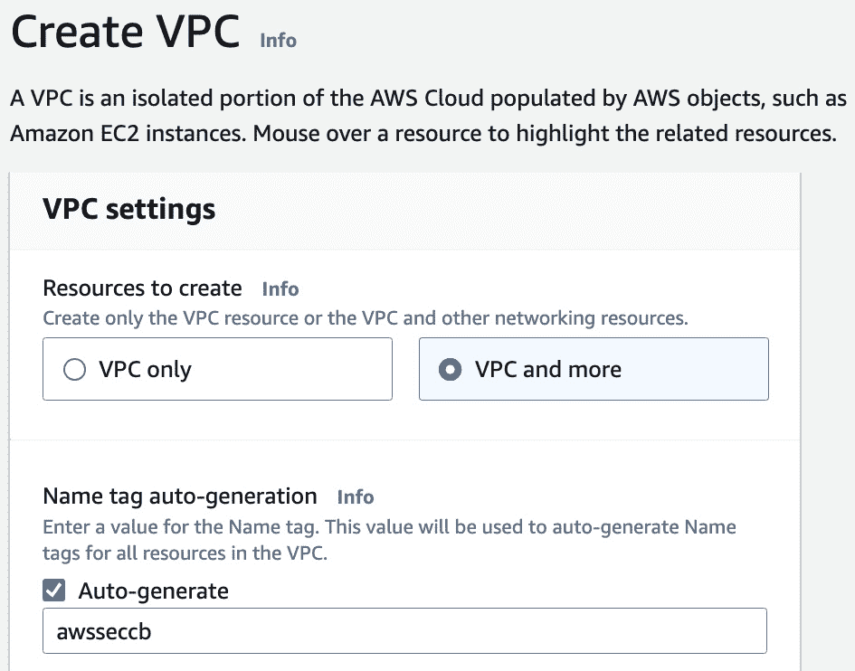

图 5.1 – 创建带有网络资源的 VPC

1.  在**IPv4** **CIDR 块**下提供**10.0.0.0/16**值。

1.  对于**IPv6 CIDR 块**，我们有两个选项：**No IPv6 CIDR block**和**Amazon-provided IPv6 CIDR block**。选择**No IPv6** **CIDR block**。

1.  对于**Tenancy**，有两个选项：**Default**和**Dedicated**。选择**Default**。

1.  对于**可用区（AZ）数量**，选择**2**；对于**公共子网数量**，选择**2**；对于**私有子网数量**，选择**2**，如下面的图所示：

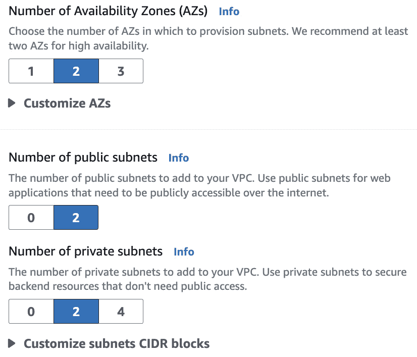

图 5.2 – 配置可用区（AZ）数量和子网

可选地，在展开**Customize AZs**后，我们可以为子网选择 AZ，并使用**Customize subnets CIDR** **blocks**选项来自定义 CIDR 块。

1.  对于**NAT 网关 ($)**，选择**1 in 1 AZ**；对于**VPC 端点**，选择**S3 Gateway**；对于**DNS 选项**，选择**Enable DNS hostnames**和**Enable** **DNS resolution**。

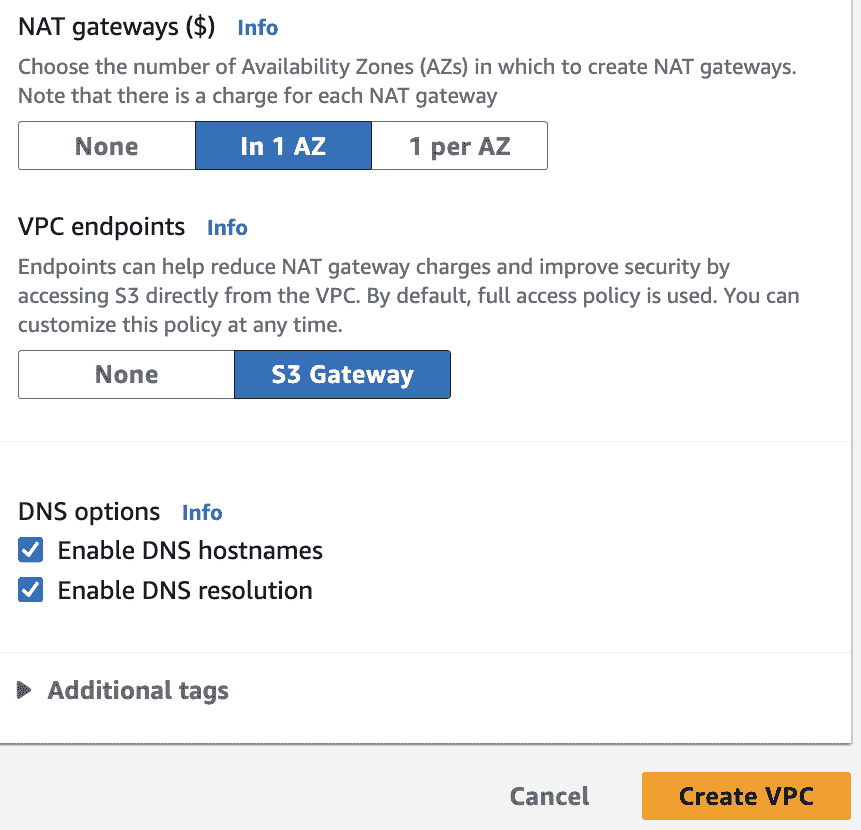

图 5.3 – 配置 NAT 网关、VPC 端点和 DNS 选项

AWS 将在页面的右侧窗格中显示 VPC 预览以及它将创建的网络资源，如下所示：

+   名为**awsseccb-vpc**的 VPC

+   子网名为**awsseccb-subnet-public1-us-east-1a**、**awsseccb-subnet-private1-us-east-1a**、**us-east-1b, awsseccb-subnet-public2-us-east-1b**和**awsseccb-subnet-private2-us-east-1b**

+   路由表名为**awsseccb-rtb-public**、**awsseccb-rtb-private1-us-east-1a**和**awsseccb-rtb-private2-us-east-1b**

+   网络连接名为**awsseccb-igw**、**awsseccb-nat-public1-us-east-1a**和**awsseccb-vpce-s3**

重要提示

所有公共子网共享一个路由表，而每个私有子网都有一个路由表。尽管预览中没有显示，但也会创建一个主路由表，用于规定未与任何路由表关联的子网的默认规则。选择公共子网时，必须创建一个 IGW，并将其连接到这些公共子网，从而实现互联网访问。此外，NAT 网关提供对私有子网实例的互联网访问，同时防止直接的入站互联网流量，必须部署在公共子网中，因此也依赖于 IGW 来处理外向互联网流量。

1.  点击**Create VPC**以创建包含预览中显示的网络资源的 VPC。

1.  验证预览中列出的所有资源是否已经创建。

在这个示例中，我们创建了一个 VPC 及其 VPC 资源。要仅创建 VPC 而不添加其他资源，我们可以选择**仅 VPC**选项，而不是如*图 5* *1*中所示的**VPC 及更多**选项。

## 它是如何工作的……

在这个示例中，我们成功配置了一个 VPC 及其相关的网络资源。让我们更深入了解这些组件。VPC 是专属于我们 AWS 账户的虚拟网络。它与 AWS 云中的其他虚拟网络隔离。它允许我们将 AWS 资源（如 EC2 实例）部署到我们定义的网络中。

**IPv4 CIDR 块**定义了分配给我们 VPC 的一系列私有 IPv4 地址，便于 VPC 内部的通信，同时保持与外部网络的隔离。在这个示例中，我们为 VPC 选择了一个**10.0.0.0/16** **无类域间路由**（**CIDR**）块，它代表了 AWS 为 VPC 允许的最广泛的地址范围。CIDR 是一种分配 IP 地址和路由 IP 数据包的方法。它允许将多个 IP 地址表示为一个单一的表达式，从而大大简化了网络配置和管理。对于初学者来说，CIDR 是一个稍微复杂的话题。你可以通过[`www.secdops.com/blog/understanding-ip-addresses-and-subnetting`](https://www.secdops.com/blog/understanding-ip-addresses-and-subnetting)了解更多有关 CIDR 的信息。

**IPv6 CIDR 块**是我们 VPC 的可选 IPv6 地址范围。选择**无 IPv6 CIDR 块**意味着我们的 VPC 将只使用 IPv4 地址。IPv6 地址提供了更大的地址空间，并且在未来的技术发展和全球范围扩展中变得越来越重要。

**租用模式**选项让我们可以选择为 VPC 选择共享或专用的硬件主机。**默认**选项允许 AWS 将我们的实例部署在任何共享硬件上，这对于大多数使用场景已足够。**专用**选项通常用于合规或监管要求。

**可用区**（**AZs**）是区域内的不同位置，旨在与其他 AZ 中的故障隔离。通过选择多个 AZ，我们可以实现高可用性。每个子网与特定的 AZ 绑定，以确保容错和低延迟。在这个示例中，我们创建了两个 AZ。

子网是 IP 网络的逻辑子划分。在 AWS 等云环境中，子网通过细分网络并在资源之间引导流量来帮助组织 VPC。这种细分允许创建**公共子网**，为如 Web 服务器等资源提供直接的互联网访问，以及**私有子网**。私有子网专为需要受限访问的资源（如数据库服务器）设计，通常只允许从网络内部或特定子网（如 Web 服务器子网）访问。

使用**VPC 及更多**选项创建 VPC 时，子网会在可用区（AZs）之间平均分配。因此，我们可以选择多个子网，数量是我们选择的 AZs 数量的倍数。如果我们选择**1 个 AZ**，则公共子网有**0**和**1**选项，私有子网有**0**、**1**和**2**选项。类似地，如果我们选择 3 个 AZs，则公共子网有**0**和**2**选项，私有子网有**0**、**3**和**6**选项。在这个配方中，我们创建了四个子网——两个公共子网和两个私有子网。

IGW 是一种资源，允许我们 VPC 中的实例与互联网进行通信。任何需要直接访问互联网的子网都必须使用 IGW。由于我们选择在配方中创建公共子网，AWS 创建了一个 IGW，并将我们的公共子网与该 IGW 关联。对于公共子网，我们还需要将所有互联网流量路由到 IGW。这是通过使用**路由表**来完成的。

路由表包含一组规则，称为路由，这些规则决定了来自我们子网或 VPC 路由器的网络流量的去向。以下是 AWS 在与我们公共子网关联的路由表中创建的路由：

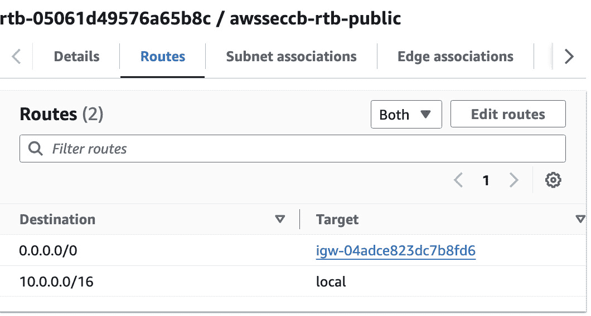

图 5.4 – 包含 IGW 路由的路由表

当我们选择**VPC 及更多**选项时，所有公共子网共享一个路由表，而每个私有子网都与一个独立的路由表关联。除此之外，每个 VPC 都会创建一个**主路由表**，无论我们是选择**仅 VPC**还是**VPC 及更多**选项。主路由表规定了未与任何路由表关联的子网的默认规则。默认情况下，任何子网都不会显式地与主路由表关联。

所有没有在 VPC 内显式关联任何路由表的子网，都会隐式地与主路由表关联。这意味着主路由表的路由行为适用于所有未与其他路由表关联的子网。在这个配方中，所有子网都与路由表关联，因此主路由表不会有任何关联。我们可以通过移除某个子网与路由表的关联来进行实验，届时我们会看到它将隐式地与默认路由表关联。如果需要，我们可以设置不同的路由表作为主路由表。

因此，配置了两个公共子网和两个私有子网时，将会有四个路由表：一个用于公共子网，一个用于每个私有子网，以及一个主路由表。如果配置包含两个公共子网和四个私有子网，则总共有六个路由表：一个用于公共子网，一个用于每个私有子网，以及一个主路由表。

NAT 网关允许私有子网中的实例发起出站互联网流量，但阻止来自互联网的无请求入站流量。这对于更新、修补或下载不需要直接从外部访问的实例的依赖项至关重要。NAT 是一种使私有子网资源能够访问互联网或其他网络服务，而不暴露其私有 IP 地址的方法。通过将这些私有 IP 地址转换为公共 IP 地址，NAT 网关为私有子网内的服务提供了安全的互联网访问，从而确保私有网络的内部结构不会受到外部流量和威胁的影响。NAT 网关部署在公共子网中，因此，如果我们选择不使用**VPC 和更多**选项创建任何公共子网，并尝试选择 NAT 网关选项，则会收到错误消息。

VPC 端点使我们的 VPC 与 AWS 服务之间可以进行私密连接，无需流量经过互联网。选择**S3 网关**端点允许我们的实例安全地访问 S3 存储桶，而无需使用 IGW 或 NAT 网关，从而提高安全性并可能降低成本。最后，在 VPC 中启用**DNS 主机名**和**DNS 解析**等 DNS 选项，可以使我们的 AWS 资源通过主机名而不是 IP 地址进行通信，从而简化网络管理和配置。

尽管在创建 VPC 时未在预览中显示，但也创建了一个 NACL。NACL 充当防火墙，用于控制子网级别的流量。NACL 会检查并过滤进入和离开我们 VPC 内每个子网的流量。当我们使用**VPC 和更多**选项或**仅 VPC**选项创建 VPC 时，系统会创建一个默认的 NACL，该 NACL 允许所有入站和出站流量。创建的子网会自动与默认 NACL 关联。然而，我们可以将其关联更改为其他 NACL。以下是默认 NACL 的入站规则：


图 5.5 – 默认 NACL 的入站规则

当我们创建 VPC 时，AWS 会在我们的 VPC 内创建一个名为**default**的安全组。在 AWS 中，安全组充当虚拟防火墙，管理 EC2 实例的入站和出站流量。它在实例级别操作，而 NACL 控制子网级别的流量。安全组和 NACL 相辅相成，在 AWS 环境中提供分层安全性。我们可以使用安全组对单个实例进行细粒度的、有状态的控制，而 NACL 提供额外的无状态、子网级别的安全性，在流量到达实例之前允许或阻止某些类型的流量。

## 还有更多内容...

每个 AWS 区域都有一个由 AWS 提供的默认 VPC，其中包括每个 AZ 中的公共子网、一个 IGW 以及配置的 DNS 解析。默认 VPC 使得可以立即启动 Amazon EC2 实例，而无需创建 VPC。以下是默认 VPC 的一些重要设置：

+   默认 VPC 中的子网通过 IGW 具有外向互联网路由。

+   每个 AZ 都会创建一个子网。

+   **DHCP 选项集**已更新。我的默认 VPC 具有以下选项：**domain-name = ec2.internal** 和 **domain-name-servers =** **AmazonProvidedDNS**。

让我们快速回顾一下与 AWS VPC 相关的更多重要概念：

+   AWS VPC 由子资源组成，如 IGW、路由表、NACL、安全组和子网。

+   AWS 在每个区域都创建了一个默认 VPC 供我们使用。以下是它的一些重要特性：

    +   默认 VPC 中的子网可以路由到互联网。

    +   每个 AZ 都会创建一个子网。

    +   **DHCP 选项集**已更新。

+   VPC 对等连接可以通过使用私有 IP 地址的直接路由将一个 VPC 连接到另一个 VPC，使关联的实例表现得像是处于同一个网络中。

+   VPC 对等连接可以在同一区域内进行，也可以跨区域，甚至跨 AWS 账户进行。

+   当前不支持 VPC 的传递对等连接。每个 VPC 必须与每个所需的 VPC 通过类似星形拓扑的结构进行对等连接。

+   为了避免管理多个 VPC 对等连接的开销，我们可以使用 AWS Transit Gateway 将所有 VPC 甚至本地网络连接到一个网关。

+   除了标准的网络地址和广播地址的保留 IP 地址外，AWS 还保留了三个额外的 IP 地址。因此，VPC 中总共保留了五个地址。

让我们快速回顾一下与 AWS 子网相关的一些重要概念：

+   子网的第一个 IP 地址代表子网 ID，而最后一个 IP 地址代表子网的定向广播地址。因此，我们不能将子网的第一个和最后一个 IP 地址分配给主机。AWS 会保留额外的 IP 地址。

+   网络中第一个子网的第一个 IP 地址表示子网 ID，同时也表示网络 ID。同样，网络中最后一个子网的最后一个 IP 地址表示子网和网络的定向广播地址。当从网络外部使用这些 IP 地址时，它们将被视为网络的 IP 地址，而在网络内部使用时，它们将被视为子网的 IP 地址。

+   AWS VPC 中的子网始终与一个 AZ 关联。虽然我们不能将一个子网与多个 AZ 同时关联，但我们可以将多个子网与一个 AZ 关联。

+   AWS 允许我们选择没有连续 IP 地址的子网，如下图所示。然而，使用连续 IP 地址范围是一种良好的实践，就像我们在本示例中使用的**10.0.1.0/24**和**10.0.2.0/24**一样。


图 5.6 – 没有连续 IP 地址的子网

我们将在本章后续的配方中学习网络 ACL、安全组和 IGW。

## 另请参见

+   我们可以在[`www.cloudericks.com/blog/understanding-aws-default-vpc`](https://www.cloudericks.com/blog/understanding-aws-default-vpc) 上阅读更多关于默认 VPC 的信息。

+   阅读更多关于主路由表的信息，访问[`www.cloudericks.com/blog/understanding-the-main-route-table-in-aws-vpc`](https://www.cloudericks.com/blog/understanding-the-main-route-table-in-aws-vpc)。

+   虽然我们已经扩展了对 VPC 及其相关网络资源的理解，但需要记住，本书的主要焦点是安全性，而不是网络。牢固掌握网络原理无疑对开发有效的安全措施至关重要；然而，深入探讨网络的复杂性可能会将我们的注意力从我们旨在探讨的广泛安全主题上转移开。希望深入了解网络知识的读者可以在[`www.cloudericks.com/blog/beginners-roadmap-to-mastering-aws-networking`](https://www.cloudericks.com/blog/beginners-roadmap-to-mastering-aws-networking) 上进一步学习。

# 创建裸 VPC 并设置公有和私有子网

公有子网专门设计用于使其中的实例能够从互联网访问。这是通过通过配置路由表将互联网流量路由到 IGW 来实现的。在本章中的*最小化努力设置 VPC 及其资源*配方中，我们在创建 VPC 时选择了**VPC 及更多**选项，如*图 5.1*所示，这会自动设置公有和私有子网，并配置一个预设的 IGW 和路由表。在这个配方中，我们将选择**仅 VPC**选项，创建一个没有额外网络资源的 VPC，并设置 IGW 和路由表，以便为我们子网中的实例提供互联网访问。

## 准备就绪

要跟随这个配方，我们需要一个有效的**awsseccb-sandbox-1** AWS 账户和一个**awsseccbadmin1**用户，正如*技术要求*部分所述。

## 如何操作...

首先，我们将创建一个裸 VPC 和一个子网，然后设置 IGW 和路由表。

### 创建裸 VPC

我们可以按如下方式仅创建 VPC，而不添加其他资源：

1.  登录 AWS 管理控制台，进入控制台中的**VPC**服务。

1.  在左侧边栏中，点击**虚拟私有云**标题下的**您的 VPC**。我们将被带到**您的 VPC**页面，在那里可以看到我们的 VPC。如果是第一次使用 VPC，我们应该会看到默认 VPC。

1.  在**您的 VPC**页面，点击**创建 VPC**，在**创建 VPC**屏幕上，选择**仅 VPC**选项。为**awsseccb-vpc2**命名。对于**IPv4 CIDR 块**，选择**IPv4 CIDR 手动输入**并将值设置为**10.0.0.0/24**。对于**IPv6 CIDR 块**，选择**没有 IPv6** **CIDR 块**。

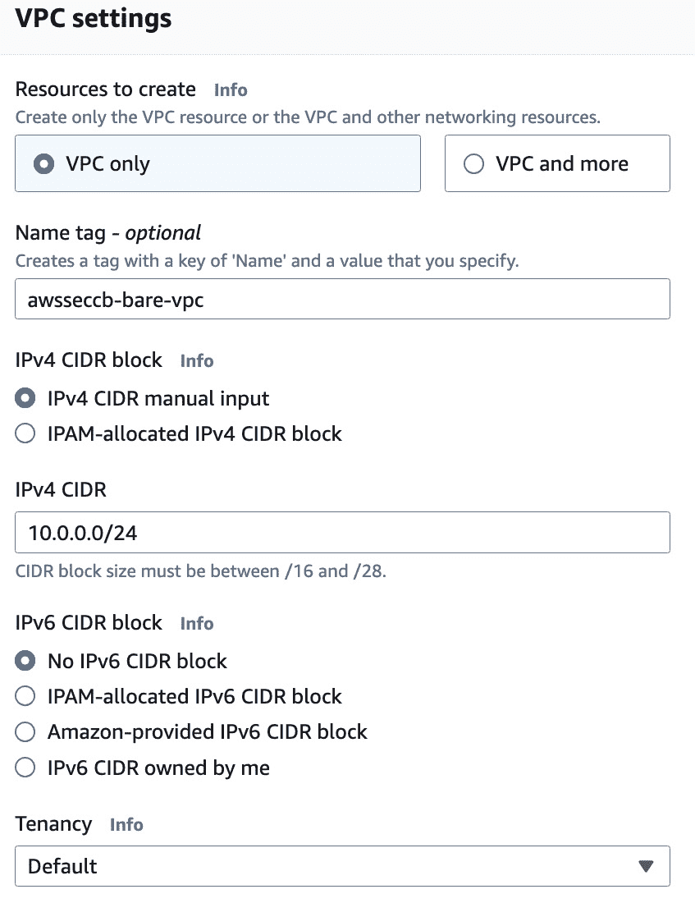

图 5.7 – 仅创建 VPC

1.  向下滚动，保持自动生成的标签（**键**为**名称**，**值**为**awsseccb-vpc2**）不变，可选择性地添加新标签，然后点击**创建 VPC**。

我们的 VPC 现在已经创建好了。接下来，我们将在 VPC 中创建一个子网。

### 在 VPC 中创建子网

我们在上一节中创建了一个 CIDR 块范围为**10.0.0.0/24**的 VPC。接下来我们将添加一个子网，子网的子网掩码为**/25**。我们需要在 VPC 的 IP 地址范围内创建子网，并确保与其他子网没有重叠。让我们开始吧。

1.  进入控制台中的**VPC**服务。

1.  在左侧边栏点击**子网**。

1.  点击**创建子网**。

1.  在**创建子网**页面下，选择我们在上一节中创建的 VPC，使用下拉框选择**VPC ID**。

1.  在**子网设置**下，将**子网名称**字段设置为**awsseccb-vpc2-public-subnet**。如果我们计划创建一个私有子网，请将其命名为**awsseccb-vpc2-private-subnet**。完成本节的剩余步骤，但跳过本章的剩余部分。

1.  在**可用区**下选择**无偏好**。

1.  对于**IPv4 VPC CIDR 块**，保持默认值。

1.  对于**IPv4 子网 CIDR 块**，提供一个 IP 地址范围，该范围应为我们 VPC 的 IP 地址范围的一个子集。我将使用**10.0.0.0/25**。

1.  向下滚动并点击**创建子网**来创建子网。

1.  从侧边栏进入**子网**页面，我们应该能够看到新的子网。

我们已经在这个操作步骤中创建了一个子网，但目前没有互联网连接。如果你打算创建一个私有子网，那么你已经完成了。如果你想将子网设置为公共子网，请继续按照本食谱中的其余部分进行操作。

### 启用自动分配公共 IPv4 地址

为了将子网设置为公共子网，建议启用自动分配公共 IPv4 地址功能，操作如下：

1.  选择我们创建的子网，点击**操作**下拉菜单，点击**编辑** **子网设置**。

1.  选择**启用自动分配公共 IPv4 地址**并点击**保存**。

1.  从侧边栏进入**子网**页面。我们应该能够看到我们的第一个子网的**自动分配公共 IPv4 地址**已设置为**是**。

接下来，我们将创建一个 IGW。

### 创建并配置 IGW

我们可以为设置公共子网创建并附加一个 IGW，步骤如下：

1.  进入控制台中的**VPC**服务。

1.  从左侧边栏点击**互联网网关**。

1.  点击**创建** **互联网网关**。

1.  为 **名称标签** 给予一个描述性名称，例如 **awsseccb-vpc2-igw**。保持自动生成的标签（**键**是**Name**，**值**是**awsseccb-vpc2-igw**），可以选择添加其他标签，然后点击 **创建互联网网关**。我们应该看到一条成功消息，表明 IGW 已经创建。如果我们进入 **互联网网关** 页面，我们会看到我们创建的 IGW 的 **状态** 当前是 **未连接**。

1.  选择我们创建的 IGW，点击 **操作** 下拉菜单，然后点击 **附加到 VPC**。

1.  在 **附加到 VPC** 页面，选择我们在本教程中创建的 VPC，并点击 **附加互联网网关**。如果我们进入 **互联网网关** 页面，我们会看到我们创建的 IGW 的 **状态** 现在是 **已附加**。

接下来，我们将创建和配置路由表。

### 创建和配置路由表

我们可以按照以下方式创建和配置路由表，以设置公共子网：

1.  点击左侧边栏中的 **路由表**。

1.  点击 **创建路由表**。

1.  提供 **awsseccb-vpc2-rtb-public** 名称并选择我们在本教程中创建的 VPC。

1.  保持自动生成的标签（**键**是**Name**，**值**是**awsseccb-vpc2-rtb-public**），可以选择添加其他标签，然后点击 **创建路由表**。

1.  点击左侧边栏中的 **路由表**，选择我们创建的路由表，点击 **操作** 下拉菜单或进入 **路由** 标签，然后点击 **编辑路由**。

1.  在 **编辑路由** 页面，点击 **添加路由**。

1.  在 **目标** 中选择 **0.0.0.0/0**，在 **目标** 中选择 **互联网网关**，然后选择我们在本教程中创建的 IGW，点击 **保存更改**。如果我们想要为 IPv6 地址添加路由，可以添加类似的条目，将目标设置为 **::/0**。

1.  进入我们的路由表并选择 **子网关联** 标签。

1.  点击 **编辑子网关联**，选择我们在本教程中创建的子网，然后点击 **保存关联**。

我们现在可以将 EC2 实例启动到我们的公共子网，并设置适当的安全组规则来验证这些更改。

## 它是如何工作的...

我们首先创建了一个裸 VPC。当我们使用 **仅 VPC** 选项创建裸 VPC 时，VPC 还会创建一个主路由表、一个默认 NACL 和一个默认安全组。主路由表决定了未与任何路由表关联的子网的默认规则。在我们的例子中，主路由表仅包括一个本地路由，允许 VPC 内部的通信。这对于允许同一 VPC 内的实例彼此通信而不需要通过互联网或其他外部网络非常重要。

网络 ACL 充当子网级别的防火墙，用于控制流量。在我们的情况下，创建了一个默认的 NACL，允许所有流量。AWS 中的安全组就像虚拟防火墙一样，用于控制 EC2 实例的入站和出站流量。在我们的情况下，创建了一个默认的安全组，允许所有流量。我们将在本章的后续配方中再次看到 NACL 和安全组的使用。

我们选择了**启用自动分配公共 IPv4 地址**选项，这使得它在创建 EC2 实例时成为该子网的默认选项。如果我们在实例创建时需要，我们可以覆盖这一设置。我们还可以稍后为我们的 EC2 实例创建并附加一个弹性 IP 地址。

我们创建并附加了一个 IGW（互联网网关）。我们还创建并配置了一个路由表以实现互联网访问。如果需要，我们可以通过编辑路由来将主路由表设置为公共路由。然而，如果我们将主路由表设置为公共路由，它将隐式地使所有新子网成为公共子网，直到我们将其与私有路由表关联。因此，最好为公共访问创建一个单独的路由表，然后将需要公共访问的子网附加到该 VPC。接下来，我们将执行这一操作。

## 还有更多...

在本章前面的配方中，*以最小的努力设置 VPC 及 VPC 资源*，我们详细讨论了 VPC 和 VPC 资源。因此，我不会再重复。即使您不想实践*如何操作*部分，请参考该配方的*工作原理*、*更多内容...*和*另见*部分。

## 另见

+   阅读更多关于 IGW 的信息，见[`www.cloudericks.com/blog/understanding-internet-gateway-in-aws`](https://www.cloudericks.com/blog/understanding-internet-gateway-in-aws)。

+   阅读更多关于 AWS VPC 路由表的信息，见[`www.cloudericks.com/blog/understanding-aws-vpc-route-tables`](https://www.cloudericks.com/blog/understanding-aws-vpc-route-tables)。

# 使用用户数据启动带有 Web 服务器的 EC2 实例

在这个配方中，我们将使用 EC2 用户数据功能，在启动 EC2 实例时设置一个简单的 Web 服务器。我们将使用这个实例来测试在前面配方中创建的 VPC 和公共子网。我们还将在未来的配方中使用这个实例，任何需要启动 EC2 实例的地方都将用到它。EC2 用户数据功能还通过启用自动安全补丁，确保实例在启动时更新到最新的保护措施，从而显著提高了安全性，并减少了漏洞。此外，它保证了所有实例的安全配置一致，防止配置漂移，并从一开始就严格遵循既定的安全标准。

## 准备工作

我们需要以下内容来成功完成此配方：

+   一个有效的**awsseccb-sandbox-1** AWS 账户，以及一个**awsseccbadmin1**用户，如*技术要求*部分所述。

+   一个名为**awsseccb-vpc**的 VPC，按照本章中的*通过最小努力设置 VPC 及其资源*步骤创建。

## 如何操作...

我们将首先使用 EC2 用户数据设置一个作为 Web 服务器的 EC2 实例，并通过浏览器验证它。然后我们将看到如何使用**安全外壳（SSH）**登录到该实例。

### 使用 EC2 用户数据设置 Web 服务器

我们可以通过以下方式使用用户数据启动一个带有 Web 服务器的 EC2 实例：

1.  登录到 AWS 管理控制台并转到**EC2**仪表板。

1.  从左侧边栏点击**实例**。

1.  点击页面右上角的**启动实例**。

1.  对于**名称**，输入**Cloudericks Web Server**。

1.  在**应用程序和操作系统镜像（Amazon 机器镜像）**部分，选择**Amazon Linux**，在**Amazon 机器镜像（AMI）**中选择**Amazon Linux 2023 AMI**。

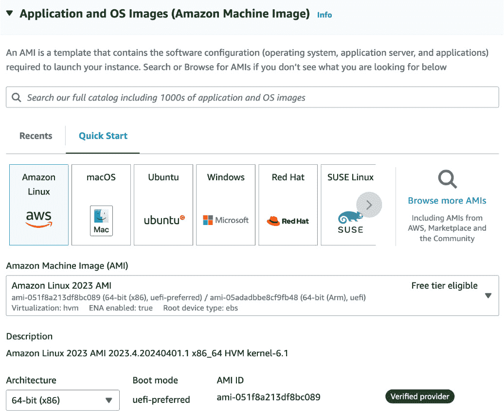

图 5.8 – 选择 Amazon Linux

1.  对于**实例类型**，选择**t2.micro**。

1.  对于**密钥对（登录）**，请选择我们已经生成并且可以访问的密钥对名称，或者，如果没有密钥对，请点击**创建新的密钥对**链接并完成以下步骤：

    1.  输入一个密钥对名称。

    1.  设置**密钥对类型**为**RSA**。

    1.  设置**私钥文件格式**为**.pem**。

    1.  点击**创建密钥对**。

重要说明

我们应当妥善保存密钥。如果使用的是 Unix 或 Mac 系统，则需要使用**chmod 400**命令将文件权限更改为只读访问。

1.  在**网络设置**部分，点击**编辑**并执行以下操作：

    1.  对于**VPC**，选择我们命名为**awsseccb-vpc**的 VPC。

    1.  对于**子网**，选择**us-east-1a** 可用区中的公共子网。如果您已按照*准备工作*部分中的说明创建了子网，则这些信息已包含在子网名称中。

    1.  设置**自动分配公共 IP**为**启用**。

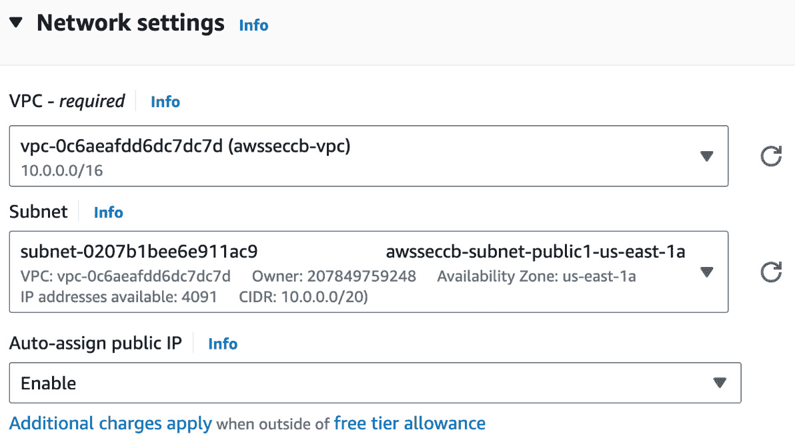

图 5.9 – 启动实例的网络设置

1.  在**防火墙（安全组）**部分的**网络**设置中，选择**创建安全组**。对于**安全组名称**，输入**cloudericks-web-server**。对于**描述**，在**描述**字段中将默认的安全组名称替换为**cloudericks-web-server**。

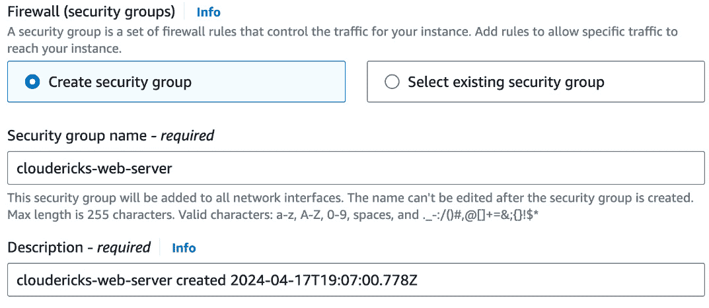

图 5.10 创建安全组

1.  在**网络设置**部分的**入站安全组规则**中，添加**HTTP**和**HTTPS**的规则，**源类型**选择**任何地方**。添加**SSH**规则，**源类型**选择**我的 IP**，只允许来自我们 IP 的 SSH。

重要说明

我们允许了来自自己 IP 地址的 SSH 流量。在生产环境中，SSH 访问通常会被限制为跳板主机或堡垒主机，这是一台专门配置的服务器，用于从外部来源安全且受控地访问内部网络。通过堡垒主机设置，我们首先登录到堡垒主机，然后从那里安全地登录到我们的 Web 服务器。我们还可以使用如 *图 5.13* 所示的选项之一，如 EC2 实例连接、会话管理器和 EC2 串行控制台。

1.  在 **高级详情** 部分，将以下脚本代码复制并粘贴到 **用户数据** 字段中：

    ```
     #!/bin/bash
    sudo su
    yum update -y
    yum install -y httpd
    cd /var/www/html
    echo "<html><h1>Cloudericks Web Server</h1></html>" > index.html
    systemctl start httpd.service
    systemctl enable httpd.service
    ```

1.  保持其他值和选择不变，点击 **启动实例**。实例启动成功后，转到 **实例** 页面，选择我们的新 EC2 实例，并查看其参数。

1.  复制 **Public IPv4 DNS** 或 **Public IPv4** 地址，在浏览器标签页中打开，并使用 **http** 而不是 **https**。我们应该能够看到 Web 服务器的 index.html 页面。


图 5.11 – 从浏览器访问 Web 服务器的 index.html 页面

在本节中，我们创建了一个简单的 Web 服务器，并通过 HTTP 从互联网访问网页。由于我们使用的是 HTTP 而不是 HTTPS，因此它被列为 **不安全**。如果我们尝试使用 HTTPS 运行该 URL，它将返回类似于以下的响应：

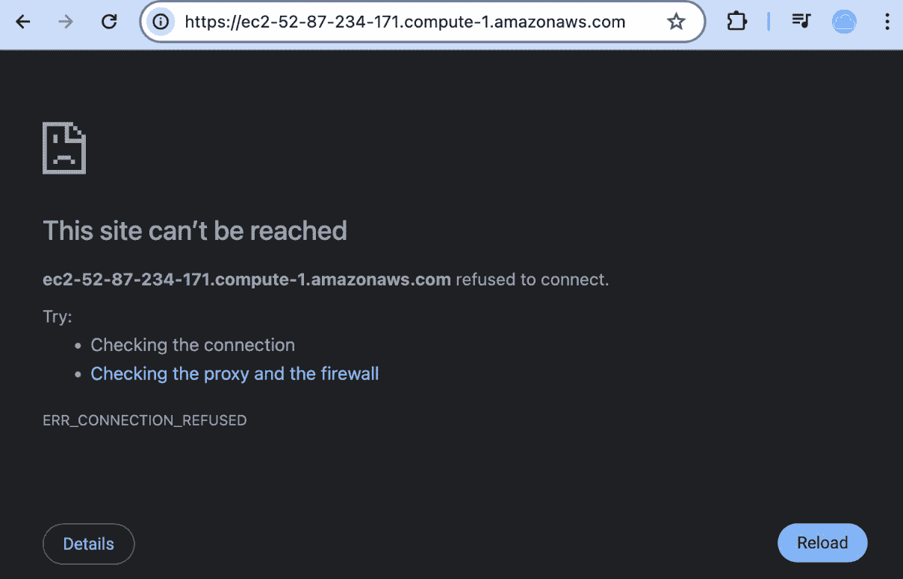

图 5.12 – 无 HTTPS 网站

在下一节中，我们将使用 SSH 连接到实例，并在 *第六章* 中启用该机器的 HTTPS。

### 使用 SSH 连接到 EC2 实例

我们可以按如下方式通过 SSH 连接到 EC2 实例：

1.  转到 **EC2** 仪表盘中的 **实例** 页面。

1.  选择我们的实例，并从 **操作** 下拉菜单中点击 **连接**。这将为我们提供连接 EC2 实例的方式，如 **EC2 实例连接**、**会话管理器**、**SSH 客户端** 和 **EC2 串行控制台**。

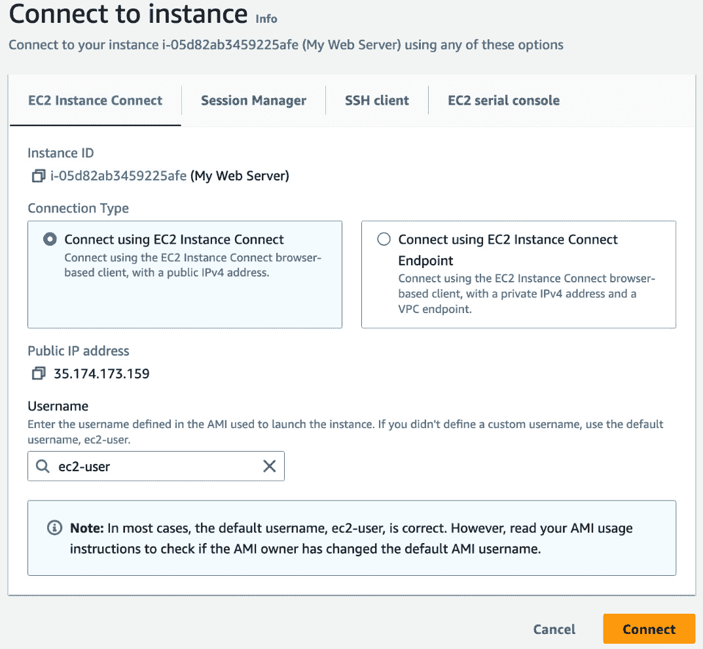

图 5.13 – 连接实例选项

1.  转到 **SSH 客户端** 标签页。我们应该能看到通过 SSH 连接到实例的步骤，如下图所示：

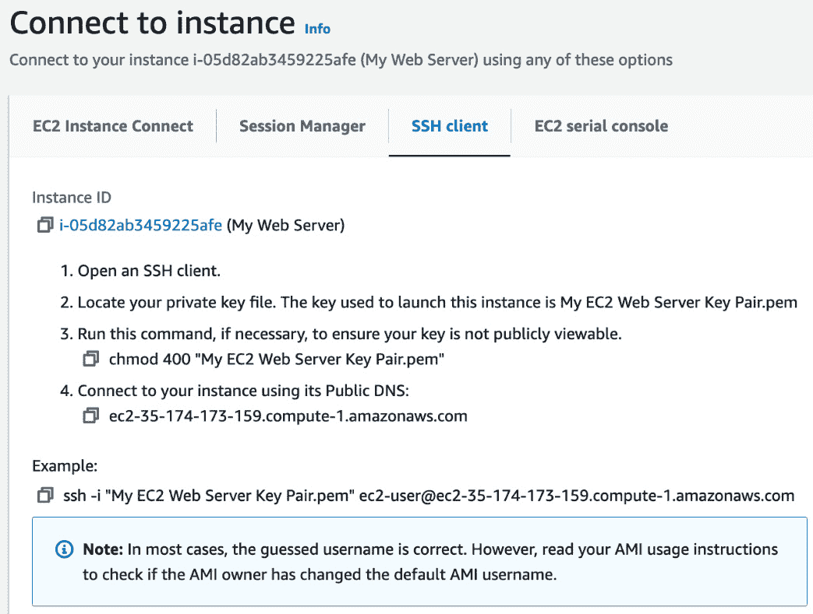

图 5.14 – 使用 SSH 客户端连接到实例

1.  我们可以按照给定步骤连接到 EC2 实例。如果是第一次连接实例，我们会收到确认消息，要求信任该站点并继续连接。输入 **yes** 以继续：

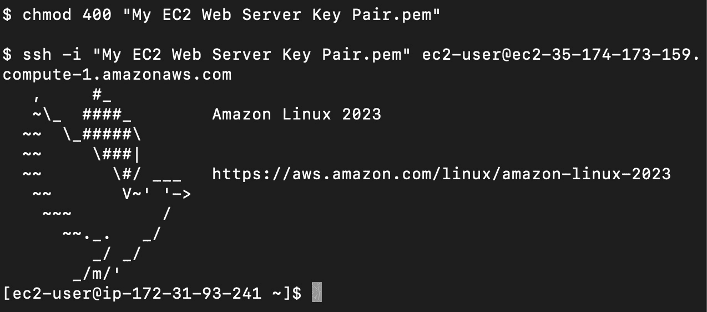

图 5.15 – 使用 SSH 连接到实例

我们使用 SSH 连接到我们的实例。值得注意的是，除了传统的 SSH 连接外，还有一些其他的选项，例如 EC2 实例连接、会话管理器和 EC2 串行控制台，正如我们在 *图 5* *.13* 中所看到的那样。

## 工作原理...

首先，我们使用 EC2 用户数据设置了一个 Web 服务器。EC2 用户数据功能允许我们配置一组脚本或命令，这些脚本或命令在实例首次启动时仅运行一次。此功能对于安装软件、更新系统、下载文件或配置符合特定要求的设置非常有用。用户数据脚本在实例启动之前就会注入到实例中，因此它是一种高效的启动方式，能够在实例变为可用的瞬间就为其配置所需的所有设置和软件。这有助于确保实例从投入使用之初就已经为其角色做好了充分准备，无论是 Web 服务器、数据库还是其他任何服务。此功能显著简化了部署过程，避免了手动设置，并使得云架构设计更加灵活且具有可扩展性。

我们也使用 SSH 连接到我们的实例。SSH 是一种加密网络协议，用于在不安全的网络上实现客户端与服务器之间的安全通信。它广泛应用于多种网络服务，其中最常见的是远程命令行登录和执行。SSH 提供了一个安全的通道，即使在不安全的网络上也能加密交换的数据，以防止未经授权的访问、窃听和劫持。除了其主要的远程安全管理功能外，SSH 还支持隧道、转发 **传输控制协议**（**TCP**）端口，并使用相关协议（如 SFTP 或 SCP）传输文件。由于其多功能性和安全特性，SSH 成为管理服务器、配置网络和通过互联网安全传输数据的必备工具。

## 还有更多...

我们使用 SSH 连接到我们的实例。AWS 还提供了一些连接实例的其他选项，正如我们在 *图 5* *.14* 中所看到的那样。让我们快速探索一下它们。

EC2 实例连接提供了一种简单且安全的方式，让你可以直接从 AWS 管理控制台使用 SSH 连接到你的实例。与传统的 SSH 不同，传统 SSH 需要你管理 SSH 密钥，而实例连接会为每个连接会话生成一次性使用的 SSH 密钥，自动处理密钥管理。这种方法通过避免手动共享和管理 SSH 密钥来增强安全性，并通过 AWS IAM 策略提供了一个简单的访问控制方式。

**AWS Systems Manager 会话管理器**是 AWS Systems Manager 的一项功能，允许你通过交互式 Shell 或自动化脚本管理 EC2 实例，而无需打开入站端口、设置堡垒主机或管理 SSH 密钥。它提供了安全的、可审计的实例管理，而不需要传统访问方法的复杂性。会话管理器的会话是加密的，并且可以被记录和审计，是企业在关注安全性和合规性时的理想选择。它还与 AWS IAM 集成，用于访问控制。

EC2 串行控制台允许你通过提供安全的串行访问来排查启动和网络连接问题。这在无法通过 SSH 或 RDP 连接实例时特别有用。访问串行控制台不需要网络连接，因此它是解决防止实例正确启动问题的宝贵工具。对 EC2 串行控制台的访问通过 IAM 策略进行控制，确保只有授权用户可以使用此功能。

这些连接方式各自适用于不同的使用场景，从通过 EC2 实例连接简化 SSH 密钥管理、通过会话管理器提供安全且可审计的访问，到通过 EC2 串行控制台提供最后的故障排除工具。根据我们的安全需求、操作实践和故障排除需求，我们可以选择最适合我们场景的方法。

## 另见

+   阅读更多关于不同方式连接到 EC2 实例的内容，请访问[`www.cloudericks.com/blog/different-ways-to-connect-to-ec2-instances-in-aws`](https://www.cloudericks.com/blog/different-ways-to-connect-to-ec2-instances-in-aws)。

+   我们可以通过加密 EBS 实例来进一步提高 EC2 的安全性，具体步骤请参考[`www.cloudericks.com/blog/steps-to-encrypt-ebs-data-with-aws-kms`](https://www.cloudericks.com/blog/steps-to-encrypt-ebs-data-with-aws-kms)。

# 创建和配置安全组

在本食谱中，我们将学习如何通过 VPC 仪表板创建安全组。也可以按照类似的步骤从 EC2 仪表板创建安全组。我们还可以在启动 EC2 实例时创建安全组。

## 准备工作

要完成本食谱中的步骤，我们需要以下配置：

+   一个有效的 AWS 账户是必需的。我将使用在 *第一章* 中创建的**awsseccb-sandbox-1**账户。但我不会使用 AWS Organizations 或 IAM 身份中心的任何功能。

+   我们需要创建一个 VPC 并在其下创建一个公有子网。可以按照本章中的*创建一个裸 VPC 并设置公有和私有子网*的食谱来创建 VPC 和子网。

## 如何操作...

我们可以按如下方式从 VPC 仪表板创建安全组：

1.  转到 VPC 仪表板。

1.  在左侧边栏的**安全性**下，点击**安全组**。

1.  在**安全组**页面，点击**创建** **安全组**。

1.  提供**安全组名称**和**描述**的值；选择我们的 VPC。

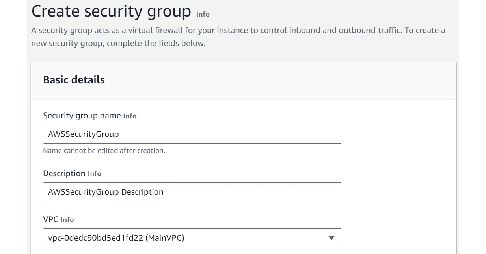

图 5.16 – 创建安全组

1.  在同一页面的**入站规则**下，我们需要添加以下规则：

    1.  点击**添加规则**。将**类型**设置为**HTTP**，将**源类型**设置为**Anywhere-IPv4**，并将**源**设置为**0.0.0.0/0**。

    1.  点击**添加规则**。将**类型**设置为**HTTPS**，将**源类型**设置为**Anywhere-IPv4**，并将**源**设置为**0.0.0.0/0**。

    1.  点击**添加规则**。将**类型**设置为**SSH**，将**源类型**设置为**我的 IP**。我们的 IP 地址应自动填充在**源**下。

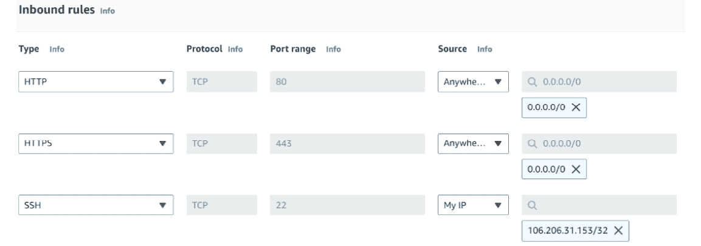

图 5.17 – 设置安全组的入站规则

提示

如果需要 IPv6 流量，我们还可以在规则中将**Source**下的 CIDR 范围设置为**::/0**。

1.  在**出站规则**下，我们可以看到已经创建了一个默认规则，如下所示：

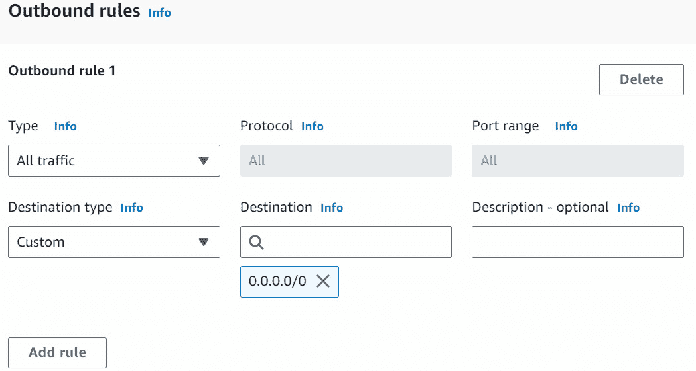

图 5.18 – 默认出站规则

重要提示

默认的安全组出站规则允许所有出站流量。为了增强安全性，我们可以只为所需的协议提供出站访问，如 HTTP 和 HTTPS。

如果我们需要更改出站规则，以便仅允许 HTTP 和 HTTPS 流量，可以在同一页面编辑默认规则，如下所示：

1.  将**类型**设置为**HTTP**，将**目标类型**设置为**Anywhere-IPv4**，并将**目标**设置为**0.0.0.0/0**。

1.  点击**添加规则**。将**类型**设置为**HTTPS**，将**目标类型**设置为**Anywhere-IPv4**，并将**目标**设置为**0.0.0.0/0**。


图 5.19 – 安全组的出站规则

提示

如果需要 IPv6 流量，我们还可以在规则中将**Destination**下的 CIDR 范围设置为**::/0**。

1.  向下滚动并点击**创建** **安全组**。

    我们应该会看到一条成功消息，表示安全组已创建。

重要提示

确切的规则对于每个方案会有所不同。前述规则可能适用于托管 Web 服务器的公共子网实例。我们还为本地 IP 提供了 SSH 访问；然而，在大多数项目中，我们通常会为专用机器提供 SSH 访问，这些机器被称为跳跃主机或堡垒主机。

## 它是如何工作的...

在这个方案中，我们创建并配置了一个包含入站和出站规则的安全组，适用于在公共子网中运行 Web 服务器的 EC2 实例。我们将使用这些步骤在其他方案中创建安全组。具体规则可能会根据使用案例有所不同。我们也可以指定另一个安全组，而不是提供 CIDR 范围，以表明只有具有该安全组的实例才应该被允许。

在本章节后面的*使用 NACL*食谱中，我们将显式允许**1024** – **65535** **临时端口**范围的出站请求。由于安全组是有状态的，这在安全组中不需要。如果打开了一个出站端口，则通过该端口发送的请求的响应也会被允许，而不受入站规则的限制。同样，如果打开了一个入站端口，则通过该端口发送的请求的响应也会被允许，而不受出站规则的限制。

## 还有更多...

我们通过 VPC 仪表板创建了安全组。我们也可以通过 EC2 仪表板创建安全组。有关更多详细信息，请参阅本食谱中*另请参阅*部分的链接。

让我们快速浏览一些与安全组相关的重要概念：

+   安全组不能跨 VPC 使用。

+   我们可以通过 EC2 启动向导、EC2 仪表板或 VPC 仪表板来创建安全组。

+   安全组是有状态的，不像 NACL 那样无状态。

+   基于使用情况，最好创建多个安全组。例如，我们可以创建单独的安全组：一个用于 SSH，另一个用于应用程序特定的端口。我们可以配置安全组规则，允许来自另一个安全组的实例，而不是提供 CIDR。我们还可以指定自己的安全组，只允许同一安全组中的实例相互通信。

## 另请参阅

+   阅读有关 AWS 中安全组的更多信息，请访问[`www.cloudericks.com/blog/understanding-security-groups-in-aws`](https://www.cloudericks.com/blog/understanding-security-groups-in-aws)。

+   有关安全组规则的参考资料，请访问[`docs.aws.amazon.com/AWSEC2/latest/UserGuide/security-group-rules-reference.html`](https://docs.aws.amazon.com/AWSEC2/latest/UserGuide/security-group-rules-reference.html)。

# 使用 NACL

在本食谱中，我们将创建一个新的 NACL，且不支持 SSH，并将我们的一个子网与该 NACL 关联。通过这样做，我们将看到无法通过 SSH 连接到该子网中的 EC2 实例。之后，我们将为 NACL 添加 SSH 支持，并再次尝试 SSH。

## 准备工作

要完成本食谱中的步骤，我们需要以下内容：

+   我们需要创建一个 VPC 并在其下创建一个公共子网。我们可以通过参考本章节中的*创建一个裸 VPC 并设置公共和私有子网*食谱来创建 VPC 和子网。

+   我们需要为我们的实例创建一个安全组；该安全组应允许 SSH 的入站流量。我们可以通过参考本章节中的*创建和配置安全组*食谱来完成此操作。

+   我们需要一个启动到公共子网中的 EC2 实例；我们可以通过参考本章节中的*使用用户数据启动带有 Web 服务器的 EC2 实例*食谱来完成此操作。

## 如何操作...

我们可以创建一个没有 SSH 权限的 NACL，如下所示：

1.  进入控制台中的**VPC**服务。

1.  点击左侧边栏中的**网络 ACL**。

1.  点击页面顶部的**创建网络 ACL**。

1.  在 **创建网络 ACL** 的 **网络 ACL 设置** 中，提供一个名称并从下拉列表中选择我们在上一节中创建的 VPC 作为 **VPC** 字段。

1.  点击 **创建网络 ACL** 来创建网络 ACL。

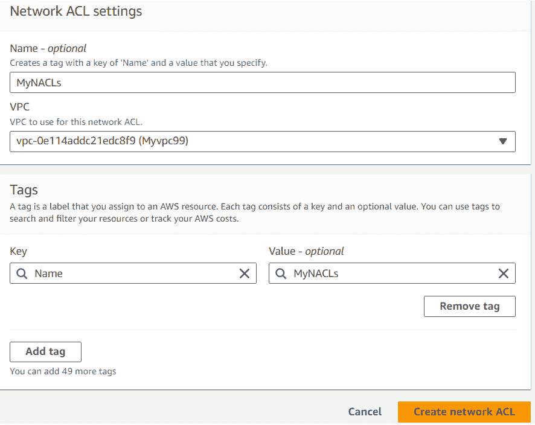

图 5.20 – 创建网络 ACL

如果我们进入 NACL 列表，我们会看到新创建的 NACL 没有任何关联的子网。


图 5.21 – 没有任何关联子网的新 NACL

1.  选择我们的新 NACL，向下滚动，并分别从其 **入站规则** 和 **出站规则** 标签中验证新 NACL 的入站和出站规则。

    入站规则应如下所示：


图 5.22 – 新创建的 NACL 的入站规则

出站规则应如下所示：


图 5.23 – 新创建的 NACL 的出站规则

1.  点击 **子网** **关联** 标签。

1.  点击 **编辑** **子网关联**。

1.  选择我们创建的子网（**AWSPublicSubnet**），然后点击 **保存更改**。

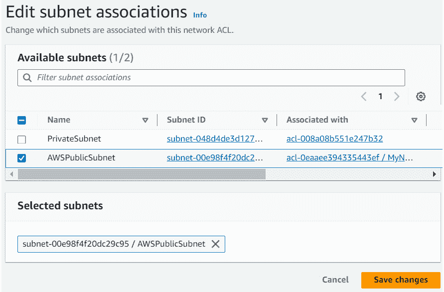

图 5.24 – 关联子网

选择我们的新网络 ACL 并检查其子网关联。我们的公共子网现在应该已经与其关联。


图 5.25 – 关联子网的 NACL

1.  尝试 SSH 连接到我们的公共 EC2 实例。在 CLI 中运行以下命令：

    ```
    ssh -i "<key path>" <EC2 user name@the public ip>
    ```

    **<key path>** 路径是你下载的密钥对路径，它是 *通过用户数据启动带有 Web 服务器的 EC2 实例* 配方中提到的 *准备工作* 部分的一部分。对于 **<EC2 用户名@公共 IP>**，请进入 **实例**，选择我们创建的 EC2 实例，然后点击 **连接**。点击 **SSH 客户端** 标签。复制 **示例** 命令的第二部分，如 **ec2-user@54.198.244.252**。它将类似于以下内容：

    ```
    ssh -i "C:\Users\DELL\Downloads\awsdemo.pem" ec2-user@35.174.184.142
    ```

提示

如果我们使用 AWS CloudShell，我们可以直接使用 **SSH 客户端** 标签中的 **示例** 命令，而无需任何修改。它看起来类似于 **ssh -i "awsdemo.pem" ec2-user@35.174.184.142**。确保在运行命令之前上传密钥对文件。

具体的命令或步骤可能因操作系统而异。在 Windows、macOS 和大多数 Linux 系统上，我们可以使用 SSH 命令。

操作应该会超时，如下图所示：


图 5.26 – 没有 SSL 的连接超时响应

1.  现在，我们可以按照以下方式为我们的 NACL 添加 SSH 支持：

    1.  返回到 VPC 控制台，点击左侧边栏中的 **网络 ACLs**，然后选择我们的 NACL。

    1.  点击 **入站规则**。

    1.  点击 **编辑** **入站规则**。

    1.  点击 **添加** **新规则**。

    1.  在 **规则编号** 下输入 **100**，在 **类型** 下选择 **SSH (22)**，将源设置为 **0.0.0.0/0**，将 **允许/拒绝** 设置为 **允许**，然后点击 **保存更改**。

重要提示

如果我们现在尝试 SSH 连接到 EC2 实例，SSH 将会失败，因为我们没有启用出站流量的临时端口。

1.  点击 **出站规则**。

1.  点击 **编辑** **出站规则**。

1.  点击 **添加** **新规则**。

1.  在 **规则编号** 下输入 **100**，在 **类型** 下选择 **自定义 TCP**，将 **端口范围** 设置为 **1024 - 65535**，将 **允许/拒绝** 设置为 **允许**，将 **目标** 设置为 **0.0.0.0/0**，然后点击 **保存更改**。

1.  尝试 SSH 连接到我们的公共 EC2 实例。不同操作系统间的具体命令或步骤可能有所不同。在 Windows、macOS 和大多数 Linux 系统上，我们可以使用以下 SSH 命令：

    ```
    ssh -i "C:\Users\DELL\Downloads\awsdemo.pem" ec2-user@35.174.184.142
    ```

    现在，我们应该能够成功 SSH 连接了。


图 5.27 – 成功的 SSH 响应

在本教程中，我们只添加了一个入站规则和一个出站规则。根据需要，我们可以添加更多规则。

## 它是如何工作的…

NACL 允许我们为 VPC 的子网定义入站和出站规则。我们可以明确地允许或拒绝通过某个端口或端口范围的流量。AWS 创建的默认 NACL 允许所有入站和出站流量。然而，默认情况下，自定义 NACL 会拒绝所有入站和出站流量。首先，我们创建了一个新的 NACL。然后，我们将公共子网与该 NACL 关联，并验证我们无法从本地机器 SSH 连接。新的 NACL 默认会拒绝所有入站和出站流量。为了允许 SSH，我们在 NACL 中添加了一个入站规则用于 SSH，并添加了一个出站规则以允许 **1024** – **65535** 的临时端口范围。

重要提示

临时端口是用于 IP 通信的短暂端口，适用于 TCP、**用户数据报协议**（**UDP**）、**流控制传输协议**（**SCTP**）等传输协议。它通常用于返回流量，即我们连接的实例或服务的返回流量。例如，服务器在端口 **22** 接收 SSH 流量，然后通过某个临时端口与客户端通信。在本教程中，我们添加了允许临时端口范围的出站规则，这是 AWS 针对面向公众的实例建议的端口范围，适用于不同类型的客户端。

## 还有更多内容...

让我们快速回顾一下与网络 ACL 相关的一些重要概念：

+   当我们创建一个 VPC 时，AWS 会创建一个默认的 NACL。在 VPC 的 NACL 列表中，**默认** 列的值会显示为 **是**，表示这是默认的 NACL。

+   默认的 NACL 允许所有入站和出站流量。然而，当我们创建一个新的自定义 NACL 时，默认情况下所有的入站和出站流量都会被拒绝。

+   每个子网只能与一个 NACL 关联。默认情况下，一个子网会与默认的 NACL 关联。

+   一个子网一次只能与一个 NACL 关联。当我们将其与新的 NACL 关联时，当前的关联将被移除。

+   一个 NACL 可以与多个子网关联。

+   NACL 包含一组编号的规则，这些规则按规则编号的顺序进行评估。如果我们在**Deny**规则之前有**Allow**规则，且规则针对相同端口，那么该端口的访问将被允许。类似地，如果我们在**Allow**规则之前有**Deny**规则，且规则针对相同端口，那么该端口的访问将被拒绝。AWS 建议最初使用 100 的倍数作为规则编号，这样如果需要添加新规则，就能在其间添加。

+   我们可以使用 NACL 阻止特定 IP 地址，但使用安全组无法做到这一点。

+   NACL 在安全组之前进行评估。

+   安全组被视为有状态的，而 NACL 被视为无状态的。使用安全组时，如果我们从实例发送请求，响应会被允许，无论入站规则如何。类似地，如果我们允许入站请求，相应的出站响应也会被允许，无论出站规则如何。使用 NACL 时，我们需要显式地为任何端口允许入站和出站流量。

## 另见

阅读更多关于 NACL 的信息，请访问[`www.cloudericks.com/blog/understanding-network-acls-in-aws-vpc`](https://www.cloudericks.com/blog/understanding-network-acls-in-aws-vpc)。

# 使用 VPC 网关端点连接到 S3

在此配方中，我们将为 S3 创建一个**VPC 网关端点**，并从我们的私有子网连接到 S3，而不使用互联网访问。

## 准备工作

为了完成此配方中的步骤，我们需要准备以下内容：

+   我们需要一个 VPC 以及关联的子网。我们可以参考本章中的*创建一个裸 VPC 并设置公共和私有子网*配方来创建。

+   我们需要配置一个网关和路由表以实现互联网访问。我们可以参考本章中的*创建一个裸 VPC 并设置公共和私有子网*配方。

+   子网应与默认的 NACL 关联。否则，我们应定义适当的入站和出站规则，以便可以通过公共 EC2 实例登录到私有 EC2 实例。我们可以参考本章中的*使用 NACL*配方。

+   我们需要在任何区域中创建一个 S3 存储桶。我将使用**us-east-1**区域。

+   我们应该确保私有子网没有互联网访问权限。通过在私有子网中运行**aws s3 ls --region us-east-1**来验证这一点。我们的请求应该会因超时而失败。如果已配置了 NAT 网关或 NAT 实例，请从主路由表中删除其路由。

+   将具有 S3 访问权限的 IAM 角色与私有 EC2 实例关联。

提示

如果没有正确配置 IAM 角色，可能会遇到**无法定位凭证**的错误。你可以通过运行**aws configure**来配置凭证。解决问题后，请再次测试，然后再继续操作。

## 如何操作...

我们可以按如下方式为 S3 创建一个 VPC 端点网关：

1.  在控制台中进入**VPC**服务。

1.  从左侧边栏点击**终端节点**。

1.  点击**创建终端节点**。

1.  在**创建终端节点**面板中，在**终端节点设置**下，输入**VPCEndpoint**作为**名称标签**的值。

1.  在**服务类别**下，选择**AWS 服务**。

1.  在**服务名称**下，选择**com.amazonaws.us-east-1.s3**


图 5.28 – 为终端节点创建选择服务名称

1.  对于**VPC**，选择我们在*准备工作*部分创建的 VPC。

1.  对于**路由表**，选择我们在*准备工作*部分创建的路由表。

1.  保持**策略**字段设置为**完全访问**。

1.  点击**创建终端节点**。我们应该看到成功消息。

1.  连接到我们的 EC2 实例，并尝试从私有子网运行以下 S3 命令：

    ```
     aws s3 ls --region us-east-1
    ```

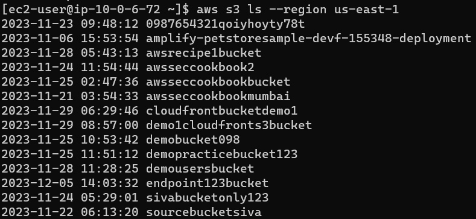

图 5.29 – S3 列表操作的成功响应

这应该能够成功列出 S3 项目。

## 它是如何工作的...

VPC 终端节点允许我们从 VPC 私密地连接到支持的 AWS 服务。通过 VPC 终端节点，VPC 中的实例不需要公共 IP 地址就可以与支持的 AWS 服务通信。VPC 与支持的 AWS 服务之间的流量不会离开 AWS。VPC 终端节点可以视为高可用的虚拟设备。

在本教程中，我们配置了一个网关类型的 VPC 终端节点，以便从子网访问 S3。我们从子网中删除了所有公共路由，但仍然能够连接到 S3。VPC 网关终端节点也支持**DynamoDB**，并且与 VPC 网关类似工作。对于大多数其他服务，VPC 终端节点通过接口终端节点进行支持。

## 还有更多...

让我们快速回顾一些与 VPC 终端节点相关的重要概念。有两种类型的 VPC 终端节点：

+   **接口终端节点**：这是一种具有私有地址的**弹性网络接口**（**ENI**），允许流量进入支持的服务。大约有 20 种支持的服务。这些服务的例子包括 Amazon API Gateway、Amazon CloudWatch、AWS Config、AWS KMS 等。

+   **网关终端节点**：像 NAT 网关一样，它们没有私有 IP 地址。仅支持有限的服务，如 S3 和 DynamoDB。

## 另请参见

阅读更多关于 VPC 网关终端节点的内容，请访问 [`www.cloudericks.com/blog/understanding-aws-vpc-gateway-endpoint`](https://www.cloudericks.com/blog/understanding-aws-vpc-gateway-endpoint)。

# 配置和使用 VPC 流日志

在本教程中，我们将在 VPC 级别启用流日志。

## 准备工作

我们需要以下资源来完成本教程中的步骤：

+   需要一个**CloudWatch 日志组**。详细步骤将在本节后续提供。

+   我们需要设置一个 VPC。如果之前没有创建 VPC，请参考*创建一个裸 VPC 并设置公有和私有* *子网* 的食谱。

+   还需要一个具有发布权限的 IAM 角色，该角色能够完全访问 CloudWatch 日志组。

我们可以执行以下步骤来创建 CloudWatch 日志组：

1.  转到 AWS 控制台中的 CloudWatch 服务。

1.  从左侧边栏点击**日志**。

1.  点击**日志组**，然后点击**创建** **日志组**。

1.  给日志组命名，以描述其目的，保持其他值为默认值，然后点击**创建**。

## 如何操作...

我们可以通过控制台按以下步骤配置 VPC 流日志：

1.  转到控制台中的**VPC**服务。

1.  点击**您的 VPC**。

1.  选择我们的 VPC。

1.  点击**流** **日志**选项卡。

1.  点击**操作**下拉菜单，然后选择**创建** **流日志**。

1.  在**流日志设置**下，提供名称，并在**过滤器**中选择**全部**。

1.  对于**最大聚合间隔**，根据个人偏好选择时间。

1.  将**目标**设置为**发送到** **CloudWatch 日志**。

1.  从**目标日志组**下拉菜单中选择我们在*准备工作*部分创建的日志组。

1.  从下拉列表中选择我们在*准备工作*部分创建的**IAM 角色**选项。

1.  对于**日志记录格式**，选择**AWS** **默认格式**。

1.  点击**创建流日志**。我们应该看到一个成功的消息。我们应该能够在流日志中查看所有后续的 IP 流量日志。以下是来自 VPC 日志日志组的日志记录示例：

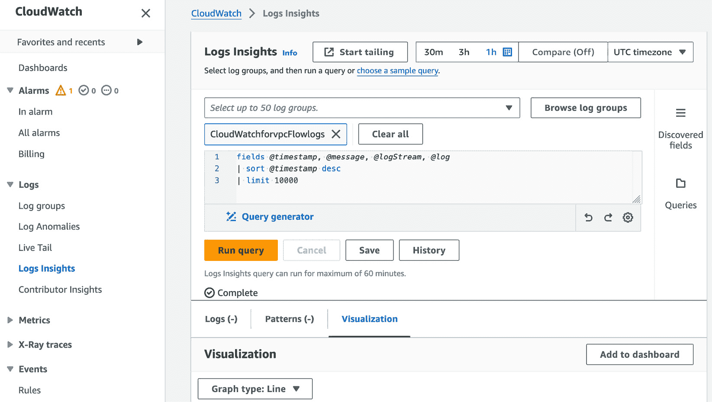

图 5.30 – 一个示例日志记录

## 它是如何工作的...

VPC 流日志帮助我们捕获到达和离开 VPC 的 IP 流量。VPC 流日志的数据可以发布到 CloudWatch 日志或 S3 存储桶。我们可以选择仅记录接受的流量、拒绝的流量或两者。VPC 流日志可以在不同级别创建，例如 VPC 级别、子网级别和网络接口级别。

在本食谱中，在**过滤器**下拉菜单中，我们选择了**全部**，以记录所有进出 VPC 的 IP 流量。我们可以选择**接受**来记录仅接受的流量，选择**拒绝**来记录仅拒绝的流量，选择**全部**来记录接受和拒绝的流量。我们需要一个 CloudWatch 日志组和一个具有权限的 IAM 角色，以便记录到该日志组。

## 还有更多...

让我们快速了解一些与流日志相关的重要概念：

+   目前，一旦流日志配置创建完成，我们无法更改其配置，例如更改关联的 IAM 角色。

+   以下是一些流量类型，包括此处列出的流量，不会被流日志监控：

    +   流量到达默认 VPC 路由器的保留 IP 地址

    +   **动态主机配置协议**（**DHCP**）流量

    +   流量设置为**169.254.169.254**以查询实例元数据

    +   与 Amazon DNS 服务器通信时的流量；但是，指向我们自己 DNS 服务器的流量会被记录。

    +   Windows 许可证激活流量

## 另见

+   在[`www.cloudericks.com/blog/understanding-aws-vpc-flow-logs`](https://www.cloudericks.com/blog/understanding-aws-vpc-flow-logs)了解更多关于 VPC 流日志的信息。

+   在[`docs.aws.amazon.com/vpc/latest/userguide/flow-logs-records-examples.html`](https://docs.aws.amazon.com/vpc/latest/userguide/flow-logs-records-examples.html)查找日志记录的示例。

# 设置和配置 NAT 网关

在本教程中，我们将学习如何创建和配置 NAT 网关，这是 AWS 中最新和首选的 NAT 选项。

## 准备工作

要完成本教程中的步骤，我们需要以下内容：

+   一个有效的 AWS 账户是必需的。我将使用我们在*第一章*中创建的**awsseccb-sandbox-1**账户。

+   通过遵循本章中的*创建裸 VPC 并设置公共和私有子网*教程，创建一个 VPC、子网、IGW 和路由表。

+   按照*创建和配置安全组*教程和*与 NACLs 一起使用*教程的*准备工作*部分，在公共和私有子网中启动具有适当安全组配置的实例。

## 如何操作…

我们可以按如下方式创建 NAT 网关：

1.  转到**VPC 仪表板**。

1.  点击左侧面板中的**NAT 网关**。

1.  点击**创建** **NAT 网关**。

1.  在**NAT 网关设置**下，输入**NAT-Gateway**作为**名称**。

1.  对于**子网**，在下拉列表中选择我们的公共子网。

1.  对于**连接类型**，选择**公共**。

1.  点击**分配弹性 IP**，填充弹性 IP 的分配 ID 并选择它作为**弹性 IP 分配 ID**，或者如果我们已经创建了弹性 IP，我们可以选择其中一个。填写后的页面应如下所示：

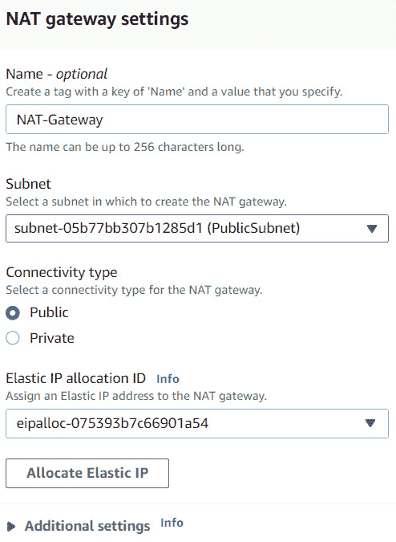

图 5.31 – NAT 网关设置

1.  点击**创建 NAT 网关**。我们会看到一条消息，提示 NAT 网关已成功创建。

1.  点击**路由表**，选择我们的公共路由表，转到**路由**标签页。点击**编辑路由**，然后点击**添加路由**。选择**0.0.0.0/8**作为**目标**。在**目标**的下拉菜单中，选择**NAT 网关**，然后选择我们在*步骤 8*中创建的 NAT 网关。点击**保存更改**。

1.  返回到 EC2 实例，选择我们的实例，点击**连接**，然后在**连接到实例**页面上，再次点击**连接**。

1.  尝试从终端运行任何需要互联网访问的命令，示例如下：

    ```
    ping google.com
    ```

    如果有通向互联网的路由，我们应该收到成功的响应；否则，连接会超时：

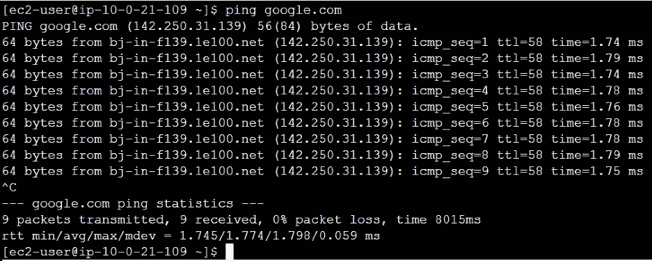

图 5.32 – ping 命令的成功响应

我们也可以运行如下的 yum 更新命令：

```
sudo yum update
```

按照剩余提示操作。如果有通往互联网的路由，更新将会成功；否则，操作将超时。

## 它是如何工作的……

私有子网中的实例可能需要访问互联网，进行补丁管理、软件下载等操作。NAT 允许 VPC 中的私有子网与互联网进行通信。NAT 是通过修改数据包的 IP 头部，在传输过程中重新映射 IP 地址的过程。AWS 为我们提供了两种在 VPC 中实现 NAT 的方式：NAT 网关和 NAT 实例。在本示例中，我们创建并配置了一个 NAT 网关。与 NAT 实例不同，NAT 网关不与任何安全组关联，因此我们没有创建或配置任何安全组。

在创建 NAT 网关后，我们需要在与私有子网关联的路由表中为其添加一条路由。由于我们的私有子网与主路由表关联，因此我们在主路由表中添加了该路由。如果某个子网没有明确与任何路由表关联，它将隐式地与主路由表关联。如果我们的架构中私有子网使用了不同的路由表，我们需要在该路由表中为 NAT 网关添加路由。

## 还有更多……

让我们快速浏览一些与 NAT 网关相关的重要概念：

+   NAT 网关由 AWS 维护，AWS 负责补丁管理、可用性和扩展。

+   NAT 网关不与任何安全组关联。NAT 网关在一个可用区内是冗余的，但不能跨可用区使用。因此，为了更好的可用性，我们可能需要为每个区域创建一个 NAT 网关。

+   当前，NAT 不支持 IPv6 流量。我们需要使用仅出口的 IGW 而不是 NAT 来处理 IPv6 流量。我们可以从 VPC 控制台创建一个仅出口的 IGW。

## 另见

+   了解更多关于 NAT 网关的信息，请访问[`www.cloudericks.com/blog/understanding-nat-gateways-in-aws`](https://www.cloudericks.com/blog/understanding-nat-gateways-in-aws)。

+   了解如何使用 PrivateLink 安全地将我们的 VPC 连接到支持的 AWS 服务、其他 VPC 和本地应用程序，而无需将流量暴露到公共互联网，请访问[`www.cloudericks.com/blog/understanding-aws-privatelink`](https://www.cloudericks.com/blog/understanding-aws-privatelink)。
