# 第二章：准备我们的第一个脆弱云实验环境

在*第一章*《云端渗透测试实验室入门》中，我们讨论了几个在云端构建有意漏洞实验环境的关键主题。此时，你可能已经迫不及待想要动手实践，并非常期待开始进行一些动手练习。好消息是，我们无需再等太久，因为本章将带领我们开始第一个渗透测试云实验环境的构建。

我们将从本章的动手部分开始，通过创建一个空的 Amazon **Simple Storage Service**（**S3**）桶，并将其配置为静态网站托管。接着，我们将通过修改其访问控制设置使该桶配置错误。然后，我们将上传一些示例文件到 S3 桶中，使该环境更加真实。当然，设置脆弱的云实验环境只是第一步！第二步是通过模拟攻击者的攻击过程来测试实验环境的安全配置。测试完成后，我们将进行清理操作，删除桶以及其中存储的文件。

也就是说，我们将涵盖以下主题：

+   设计我们的第一个云渗透测试实验室环境

+   准备我们的第一个脆弱环境

+   测试和黑客攻击我们的第一个脆弱环境

+   清理工作

在本章的动手解决方案中，我们将介绍与安全相关的概念和机制，这些概念和机制可用于管理 S3 桶的访问控制。深入理解这些安全机制的工作原理，将帮助你为更复杂的渗透测试实验环境准备不同的配置错误的 S3 桶变种。

既然如此，让我们开始吧！

# 技术要求

在开始之前，我们必须准备好以下内容：

+   一个 AWS 账户，将作为*目标账户*，包含脆弱的环境和资源

+   第二个 AWS 账户，将作为*攻击者账户*

你可以通过访问[`aws.amazon.com/free/`](https://aws.amazon.com/free/)来创建这些 AWS 账户。账户创建好后，你就可以继续进行下一步操作。

注意

本章主要聚焦于在 AWS 上构建一个样本脆弱实验环境。当然，一旦进入后续章节的动手部分，我们还需要准备好**Microsoft Azure**和**Google Cloud Platform**（**GCP**）账户。在此之前，设置两个 AWS 账户已经足够了。

# 设计我们的第一个云渗透测试实验室环境

在*第一章*《在云中入门渗透测试实验室》中，我们讨论了现代云应用程序是如何设计、开发和部署的。我们仔细研究了分布式多层架构和水平扩展策略如何使得可以独立地扩展特定层次，以应对增加的用户流量：

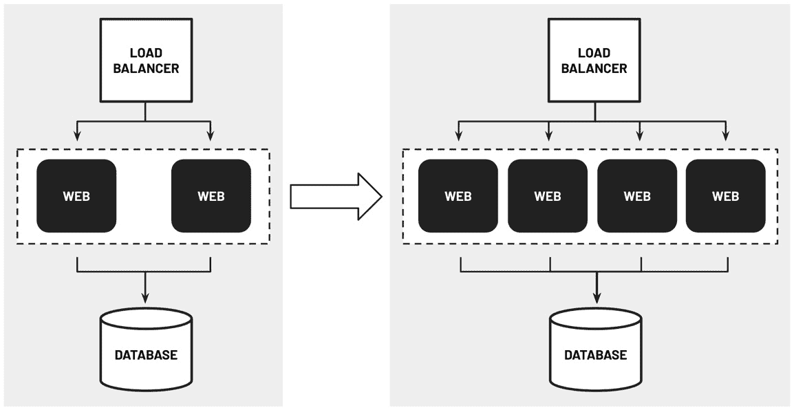

图 2.1 – 第一章中的通用多层架构图

在这里，我们设计的系统具有单独的层次结构来区分 Web 服务器、应用程序服务器和数据库。鉴于这是云架构实现中的一种常见模式，你可能会想知道，*当在像 AWS 这样的云平台上实现时，它会是什么样的？* 这个问题的答案很简单！在 AWS 上实现时，它看起来几乎是一样的！首先，*图 2.1*中的资源将简单地有自己对应的 AWS 资源和服务（类似于*图 2.2*中展示的内容）：

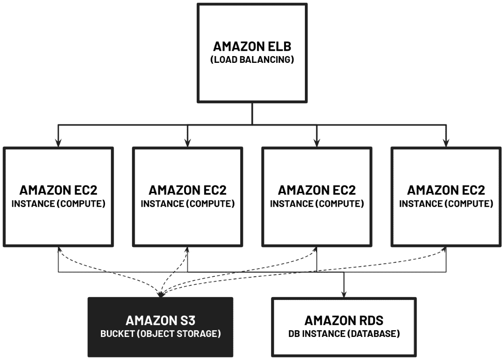

图 2.2 – 如何在 AWS 上实现分布式多层架构

在*图 2.2*中，我们可以看到来自*图 2.1*的通用负载均衡器资源将被**Amazon Elastic Load Balancing**（**ELB**）云资源替换。同样，Web 服务器将被多个**Amazon Elastic Compute Cloud**（**EC2**）实例替换。通用数据库服务器资源随后将被托管的**Amazon Relational Database Service**（**RDS**）数据库资源替换。

到目前为止，你可能会想知道为什么在*图 2.2*中我们有一个额外的资源框（也就是表示 Amazon S3 存储桶的框）！其实，即使 Amazon EC2 实例已经附加了存储卷，云工程师通常会通过将文件和对象存储在**Amazon S3** 存储桶中以及将数据库记录存储在**Amazon RDS**数据库实例中，进一步解耦应用程序架构。这使得部署在 EC2 实例（虚拟机）集群中的应用程序能够保持无状态（从而更容易实现自动扩展），因为*状态*被存储在 S3 存储桶和 RDS 数据库实例中。

什么是 Amazon S3？

**Amazon S3** 是一个对象存储服务，旨在存储和检索各种文件。我们可以把 Amazon S3 看作是一个在线服务，我们可以创建*文件存储容器*（也叫 S3 存储桶），这些容器可以存储通过 Web 界面、CLI 工具、SDK 或 API 上传的任意数量的文件。当然，我们也可以使用类似的选项从这些存储桶中下载文件。

**Amazon S3** 在现代部署在 AWS 上的应用程序中扮演着重要角色。许多运行在 AWS 上的云应用程序和系统利用 S3 存储桶来存储各种类型和格式的文件。这包括数据工程和机器学习系统，类似于我们在*图 2.3*中看到的内容：

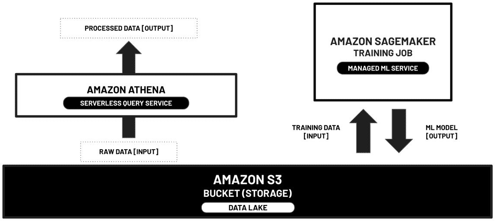

图 2.3 – 机器学习和数据工程系统存储数据的位置

在这里，我们有一个机器学习工程系统，利用**Amazon SageMaker**（托管的机器学习服务）和**Amazon Athena**（无服务器的交互式分析服务）等托管机器学习和数据工程服务来处理存储在 Amazon S3 桶中的数据。*在数据处理操作之前和之后，云数据存储在哪里？* 在大多数情况下，数据会存储在 Amazon S3 桶中，特别是在处理数据工程和机器学习工程工作负载时。如我们所见，Amazon S3 是 AWS 上使用最广泛的服务之一。部署在 AWS 上的应用程序最有可能将文件存储在 S3 桶中（或多个 S3 桶中）。其多功能性和可扩展性使其成为在云中存储各种类型的文件和数据的首选。部署应用程序时，利用 S3 桶进行高效和安全的文件存储是一种常见做法，无论是托管静态网站资源、存储用户上传的内容，还是作为大规模分析的数据湖。

在某些情况下，存储在 Amazon S3 中的文件可能包含**个人可识别信息**（**PII**）以及其他必须加以保护的敏感信息。这些信息可能包括姓名、地址、社会安全号码或财务信息，如果被未经授权的人访问，可能会造成重大风险。保护这些信息对于维护隐私和遵守数据保护法规至关重要。需要注意的是，S3 桶可能会直接遭到恶意攻击者的攻击，而无需经过负载均衡器和网页应用层，如*图 2.2*所示。这意味着，如果 S3 桶配置错误（例如，存储在桶中的敏感文件可以公开访问），无论负载均衡器和网页应用层如何安全，攻击者都可以窃取 S3 桶中的文件和数据。

在过去几年中，错误配置的 S3 桶导致了大量数据泄露事件，泄露了包含 PII、敏感企业信息甚至凭证的数百万条记录。以下是过去几年的一些重要事件：

+   在 2017 年，发现大量 S3 桶配置错误，导致敏感信息的泄露，包括 PII、信用报告，甚至是政府和军事数据。

+   在 2018 年，一家 IT 公司泄露了多家财富 100 强公司的数据，导致各种类型的敏感信息和专有数据被曝光。

+   在 2019 年，一家为半数财富 100 强公司提供服务的供应商不小心暴露了 1TB 的备份数据，而一家医疗服务提供商错误配置的 S3 桶暴露了医疗记录和患者与医生的记录。

+   2020 年，一个消费者评分和评论网站的 S3 存储桶配置错误，暴露了老年人的数据，而一家全球科技公司也经历了一次事件，未经授权的人员闯入了其未加固的 AWS S3 存储空间。

+   2022 年，一个配置错误的 S3 存储桶泄露了约 3 TB（太字节！）的敏感机场数据，暴露了航空公司员工的个人身份信息（PII）。

这些事件以及过去几年报告的其他泄露事件，突显了 S3 存储桶配置错误的普遍性及其可能带来的风险。

注意

想了解更多关于这个话题的信息，欢迎查看以下链接：[`github.com/nagwww/s3-leaks`](https://github.com/nagwww/s3-leaks)。

为什么攻击 S3 存储桶如此普遍？

云工程师和开发人员通常对不同的访问控制机制如何协同工作以保护 S3 存储桶的理解较差。除此之外，在 S3 存储桶内管理访问控制策略和权限的复杂性增加了另一层挑战。可用的众多选项和设置可能会让经验不足的用户感到不知所措，增加配置错误和敏感信息意外暴露的可能性。这可能导致配置错误的 S3 存储桶泄露并将私密和敏感信息暴露给未经授权的用户。

话虽如此，了解可用的安全措施将有助于我们更好地保护 S3 存储桶中的文件。同时，这也将使我们能够设计和构建涉及 S3 的实际渗透测试实验室。如果你想知道有哪些安全机制可以保护存储在这些 S3 存储桶中的文件，这里有一个快速的列表：

+   **身份与访问管理（IAM）策略**：通过配置 IAM 策略，组织可以为其 AWS 账户中的用户、组和角色定义精细的权限和访问控制。这可以更精确地控制谁可以对 S3 存储桶执行操作，如读取、写入或删除操作。

+   **存储桶策略**：存储桶策略在存储桶级别提供了额外的访问控制层。通过存储桶策略，组织可以定义管理对特定 S3 存储桶访问的规则和条件。这包括基于各种因素（如 IP 地址、用户代理或特定 AWS 账户）允许或拒绝访问。

+   **访问控制列表（ACLs）**：ACL 提供了另一种管理对 S3 存储桶和对象访问的机制。ACL 允许组织为存储桶中的单个对象指定权限，从而提供更精细的文件级访问控制。通过设置适当的 ACL，组织可以授予特定用户或组读取或写入权限，同时限制其他人的访问。

+   **虚拟私有云 (VPC) 终端节点策略**：VPC 终端节点策略允许组织控制其 VPC 环境内对 S3 存储桶的访问。通过定义终端节点策略，组织可以指定哪些 VPC 或子网可以访问特定的 S3 存储桶。这有助于防止来自 VPC 外部的未经授权访问，并通过限制对受信任网络环境的访问，增强存储在 S3 存储桶中的文件的安全性。

+   **AWS 组织服务控制策略 (SCPs)**：SCPs 是 AWS 组织的一部分，允许组织在多个 AWS 账户之间设置精细的权限。通过定义 SCPs，组织可以强制执行适用于所有成员账户的集中式安全策略。这包括控制对 S3 存储桶的访问，并确保在整个组织内应用一致的安全措施。通过利用 SCPs，组织可以增强其 S3 存储桶的整体安全态势，确保文件在整个企业中得到统一保护。

重要提示

虽然 2023 年 4 月之后创建的新 S3 存储桶在创建过程中默认禁用 ACL，但仍然可以通过配置更改在 S3 存储桶配置和创建时启用 ACL。同时，禁用 ACL 的 S3 存储桶可以在存储桶创建后被修改并启用恢复 ACL。尽管采取了强制安全默认设置，但在 2023 年 4 月之前创建的相当一部分 S3 存储桶仍依赖于 ACL，并与其他讨论的 S3 安全机制一起使用。因此，全面理解这些安全机制对于设置基于云的渗透测试实验环境以及确保 S3 安全设置的正确配置至关重要。

即使云平台发布了安全机制和安全升级的防护措施，仍有相当一部分现有的 S3 存储桶存在错误配置。除此之外，无论云架构的其他组件多么安全，错误配置的 S3 存储桶仍然会导致数据泄露，因为在许多情况下，存储在 S3 存储桶中的文件可以直接访问。

在本章中，我们将专注于在我们的 AWS 账户中准备一个错误配置的 S3 存储桶。在构建我们的第一个云渗透测试实验环境（即单个错误配置的 S3 存储桶）之前，我们必须清楚了解最常见的 S3 存储桶错误配置是什么：

+   **访客/匿名用户可以对存储在存储桶中的对象执行操作**：此错误配置使得攻击者或未经授权的个人能够访问和操作存储在存储桶中的文件和文件夹。未经授权的用户可以列出存储桶中的内容，从中检索对象，甚至上传自己的文件，这可能导致未经授权的数据暴露、修改或删除。

+   **“已认证用户”（任何拥有 AWS 账户的人）可以列出文件并读取和写入 S3 存储桶中的对象**：此配置错误允许*任何拥有 AWS 账户的用户*列出、读取和写入存储桶中的对象。这意味着任何拥有 AWS 凭证的个人或用户都可以访问并修改存储桶的内容。

+   **S3 存储桶的 ACL 配置可以被外部用户读取**：此配置错误帮助攻击者获取有关存储桶安全配置的更多信息。

+   **S3 存储桶访问日志记录在 CloudTrail 中已禁用**：此配置错误阻止 AWS 用户审核 S3 存储桶的事件历史记录（包括实体或资源在 S3 存储桶上执行的操作）。

注意

如果这是您第一次遇到**CloudTrail**，它是一个 AWS 服务，帮助监控和记录 AWS 账户活动。此服务在帮助启用治理、合规性、操作审计和风险审计方面发挥着重要作用。在 CloudTrail 中禁用 S3 存储桶的访问日志记录意味着不会生成日志来追踪和记录存储桶的访问活动。这可能会限制检测未经授权的访问尝试、排除故障并为合规性和安全目的保持完整的存储桶活动记录的能力。

通过更加清晰地理解 S3 存储桶可能出现的典型配置错误，我们现在可以继续前进，设计并建立我们的第一个云渗透测试实验室环境。具体而言，我们的重点将是设计一个实验室环境，其中包含一个故意配置错误的 S3 存储桶，用于模拟现实世界中的漏洞。我们的配置错误的 S3 存储桶将存储一些示例文件，类似于*图 2.4*中所示的内容：

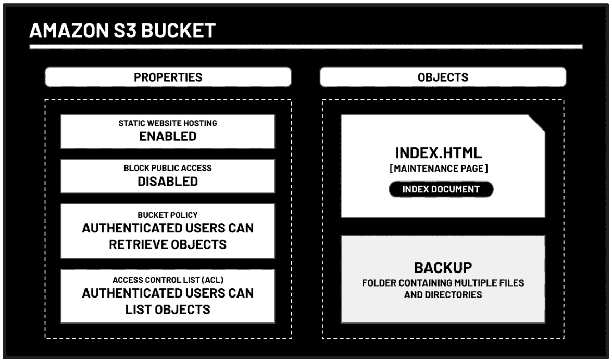

图 2.4 – 我们的 S3 存储桶将如何配置

如*图 2.4*所示，我们将配置 S3 存储桶，使其具备以下属性和配置设置：

+   **静态网站托管** – **已启用**：此配置启用指定 S3 存储桶的静态网站托管，使其能够直接从存储桶提供静态网页和资产。

+   **阻止公共访问** – **已禁用**：此配置（启用时）通过强制限制公共访问来帮助防止敏感数据的意外暴露。然而，当此配置设置被禁用时，匿名用户和未经授权的实体可能能够访问存储桶及其中的对象（特别是当 S3 存储桶配置错误时）。

+   **存储桶策略** – **已认证用户可以检索对象**：此配置允许已认证用户（即*任何*拥有 AWS 账户的人）从 S3 存储桶中检索对象，从而允许他们访问存储的数据。

+   **访问控制列表（ACL）** – **认证用户可以列出对象**：这允许认证用户列出 S3 存储桶中的对象。

除了这些，我们还将上传一些在典型 S3 存储桶中可能看到的示例文件。现在我们已经讨论了脆弱实验环境的（误）配置，接下来可以进行本章的动手实践部分！

重要提示

需要注意的是，虽然我们在本章中专注于 Amazon S3，但类似的问题和事件也影响了使用 Azure Blob Storage 和 Google Cloud Storage 的公司。这些服务与 Amazon S3 类似，也面临着类似的安全挑战和漏洞。

# 准备我们的第一个脆弱环境

正如前一部分所讨论的，我们的第一个脆弱环境将由一个配置错误的 Amazon S3 存储桶和一些示例文件组成。创建空 S3 存储桶有多种方式。本章中，我们将使用 AWS 管理控制台来创建存储桶。

本部分包含四个子部分：

+   创建一个空的 S3 存储桶

+   配置 S3 存储桶以托管静态网站

+   更新 S3 存储桶的配置设置

+   上传文件到 S3 存储桶

重要提示

由于我们将准备一个故意脆弱的 S3 存储桶，请确保*不要*使用此 S3 存储桶来存储生产数据（或包含敏感信息的文件）。

## 创建一个空的 S3 存储桶

我们将从创建一个空的 S3 存储桶开始。请确保你使用“目标账户”（第一个 AWS 账户）登录。

重要提示

你也可以选择将 **N. Virginia** 作为 S3 存储桶创建的区域。在继续操作之前，随时可以使用页面左上角的下拉菜单更新当前区域。

牢记这一点，让我们开始使用 AWS 管理控制台创建空的 S3 存储桶：

1.  在搜索栏中输入 **s3**：

    图 2.5 – 导航到 S3 控制台

    从结果列表中选择 **S3**（如*图 2.5*所示）。

1.  接下来，点击 **创建存储桶** 按钮，如*图 2.6*所示：

    图 2.6 – 定位创建存储桶按钮

    你应该能在页面右上角附近看到 **创建存储桶** 按钮。

注意

需要注意的是，用户界面可能会每隔几年发生一次变化。然而，这不应妨碍我们继续创建所需资源，因为需要配置的属性和设置基本保持不变（除了少数新增的属性和选项）。

1.  在 **存储桶名称** 下，指定一个全球唯一的存储桶名称：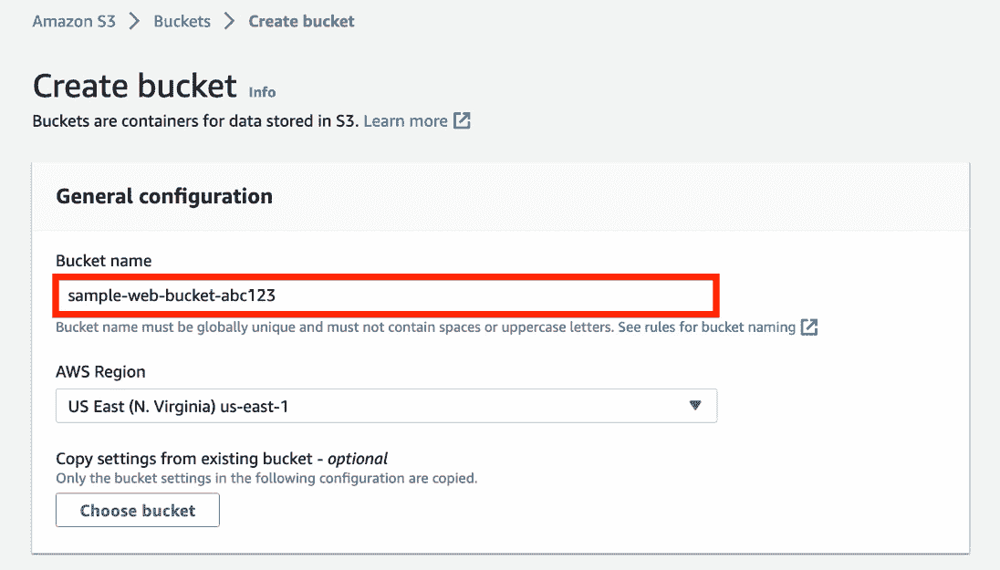

    图 2.7 – 创建 S3 存储桶

    如果你在命名 S3 存储桶时遇到困难，可以将 S3 存储桶命名为**sample-web-bucket-<6-8 位随机字母数字字符>**。可能需要尝试几次才能得出一个有效且全球唯一的 S3 存储桶名称。

注意

有关如何命名 S3 存储桶的指南，请查看以下链接：[`docs.aws.amazon.com/AmazonS3/latest/userguide/bucketnamingrules.html`](https://docs.aws.amazon.com/AmazonS3/latest/userguide/bucketnamingrules.html)。

此外，请从**AWS 区域**选择框的选项列表中选择**美国东部（弗吉尼亚北部）us-east-1**。

1.  选择**启用 ACL**选项，类似于*图 2.8*中所示的那样：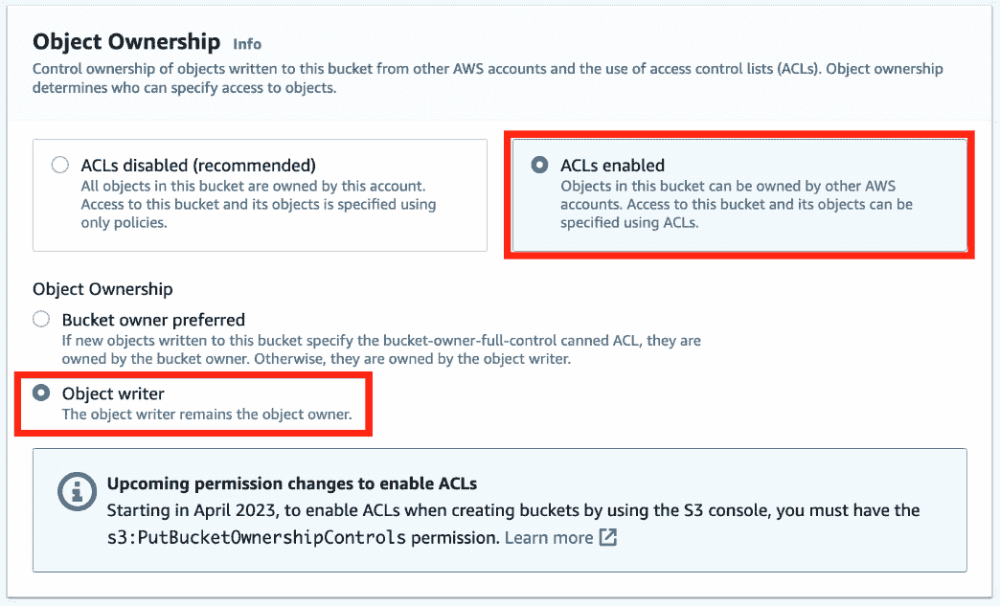

    图 2.8 – 配置对象所有权设置

    将**对象所有权**配置值设置为**对象写入者**将使对象成为上传它们的 AWS 账户的所有物。这意味着拥有对象的 AWS 账户可以使用 ACL 来授予其他用户访问权限（即使上传对象的 AWS 账户并不是存储桶的所有者）。

重要说明

请注意，AWS 定期更新并改善 AWS 管理控制台的用户体验。在某些情况下，创建资源时的默认配置设置可能会发生变化，尤其是在某些日期之后。例如，从 2023 年 4 月开始，AWS 为 S3 存储桶的公共访问阻止（S3 Block Public Access）和 S3 对象所有权（S3 Object Ownership）设置了一组新的默认设置。因此，到你阅读这本书时，使用 AWS 管理控制台时可能需要点击几个额外的按钮，并且会看到一些差异。有关此主题的更多信息，请查看以下链接：[`docs.aws.amazon.com/AmazonS3/latest/userguide/create-bucket-faq.html`](https://docs.aws.amazon.com/AmazonS3/latest/userguide/create-bucket-faq.html)。

1.  取消选中**阻止所有公共访问**复选框，类似于*图 2.9*中所示的那样：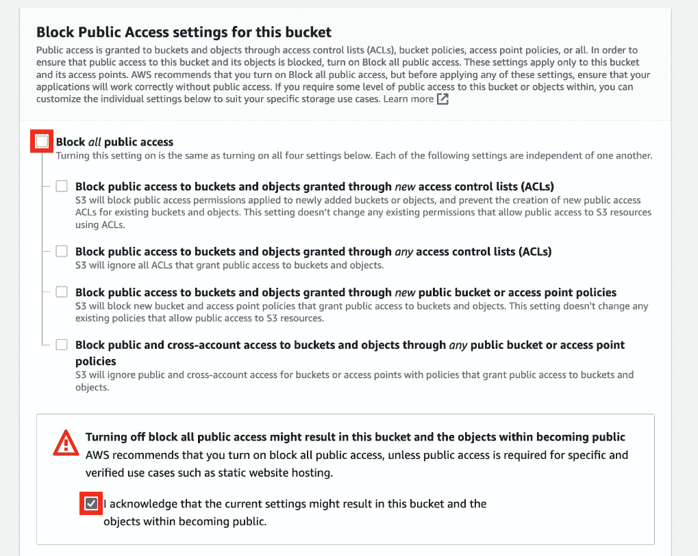

    图 2.9 – 关闭阻止所有公共访问

    除此之外，确保你将**我知道当前设置可能导致此存储桶及其中的对象变为公开**的复选框设置为*ON*。这将允许你指定一个存储桶或访问点策略，以授予公共访问权限。

1.  你应该会看到一个成功通知，类似于*图 2.10*中所示的那样：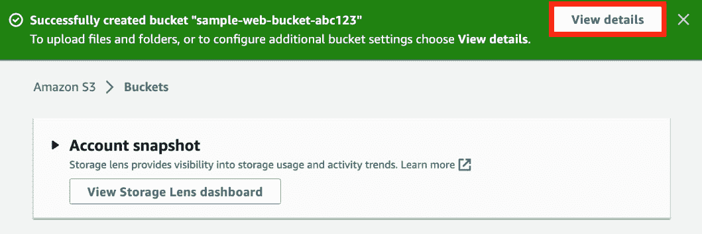

    图 2.10 – 定位查看详细信息按钮

    点击**查看详细信息**按钮，跳转到我们刚刚创建的 S3 存储桶的具体页面。

    这不是很简单吗？当然，我们才刚刚开始——接下来的几节内容中，我们将继续配置这个 S3 存储桶！

## 配置 S3 存储桶以托管静态网站

接着我们在上一节的内容，继续配置我们的 S3 存储桶以进行静态网站托管。你会惊讶于这项配置是多么简单！话不多说，让我们继续：

1.  点击**属性**以导航到**属性**标签，如*图 2.11*中所示：

    图 2.11 – 导航到属性标签

    我们应该在**属性**标签下看到以下内容：（1）**桶概览**，（2）**桶版本控制**，（3）**标签**，（4）**默认加密**，（5）**智能分层归档配置**，（6）**服务器访问日志**，（7）**AWS CloudTrail 数据事件**，（8）**事件通知**，（9）**Amazon EventBridge**，（10）**传输加速**，（11）**对象锁**，（12）**请求者付费**，和（13）**静态** **网站托管**。

1.  向下滚动到页面底部，直到看到**静态网站****托管**面板：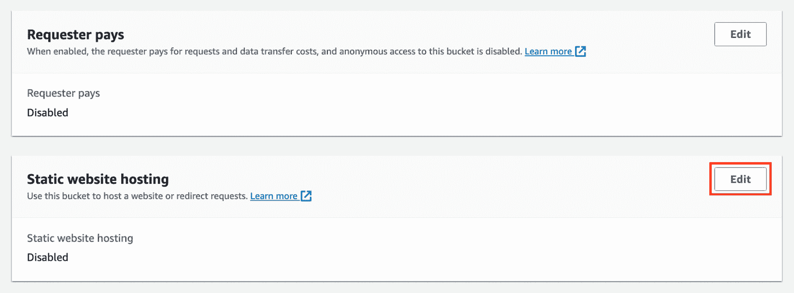

    图 2.12 – 编辑静态网站托管设置

    点击**编辑**按钮，如*图 2.12*中所示。

1.  通过选择**启用**选项来启用静态网站托管（参见*图 2.13*）：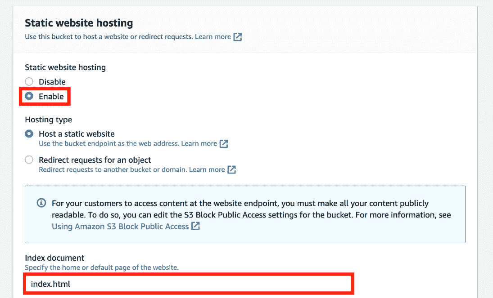

    图 2.13 – 为 S3 桶启用静态网站托管

    之后，确保在**索引** **文档**字段中指定**index.html**。

1.  向下滚动到页面底部并点击**保存** **更改**按钮。

此时，桶仍然为空，因此点击提供的**Bucket 网站端点**链接（点击**保存更改**按钮后）将会返回一个**404 未找到**的错误响应。请不要担心——我们将在下一部分更新桶的访问控制设置后上传自定义的**index.html**文件。

## 更新 S3 桶配置设置

现在我们已经为 S3 桶配置了静态网站托管，下一部分涉及配置桶以允许任何拥有 AWS 账户的用户列出和访问存储在桶中的对象。也就是说，我们将在接下来的步骤中更新桶策略和 ACL 配置设置：

1.  点击**权限**标签（位于**属性**标签旁边）。我们应该在**权限**标签下看到以下内容：（1）**权限概览**，（2）**阻止公共访问（桶设置）**，（3）**桶策略**，（4）**对象所有权**，（5）**访问控制列表（ACL）**，和（6）**跨源资源** **共享（CORS）**。

1.  接下来，点击**编辑**按钮（如*图 2.14*中所示），以指定新的桶策略：

    图 2.14 – 编辑桶策略

    在*图 2.14*中，我们可以看到当前没有指定桶策略。

1.  点击**编辑**按钮后，在文本框中指定以下桶策略：

    ```
     {
        "Version": "2012-10-17",
        "Id": "n",
        "Statement": [
            {
                "Sid": "SampleStatement",
                "Effect": "Allow",
                "Principal": {
                    "AWS": "*"
                },
                "Action": "s3:GetObject",
                "Resource": "arn:aws:s3:::<BUCKET NAME>/*"
            }
        ]
    }
    ```

    确保将**<BUCKET NAME>**替换为你创建的 S3 桶的桶名。这样你应该能得到一个类似于*图 2.15*中的桶策略：

    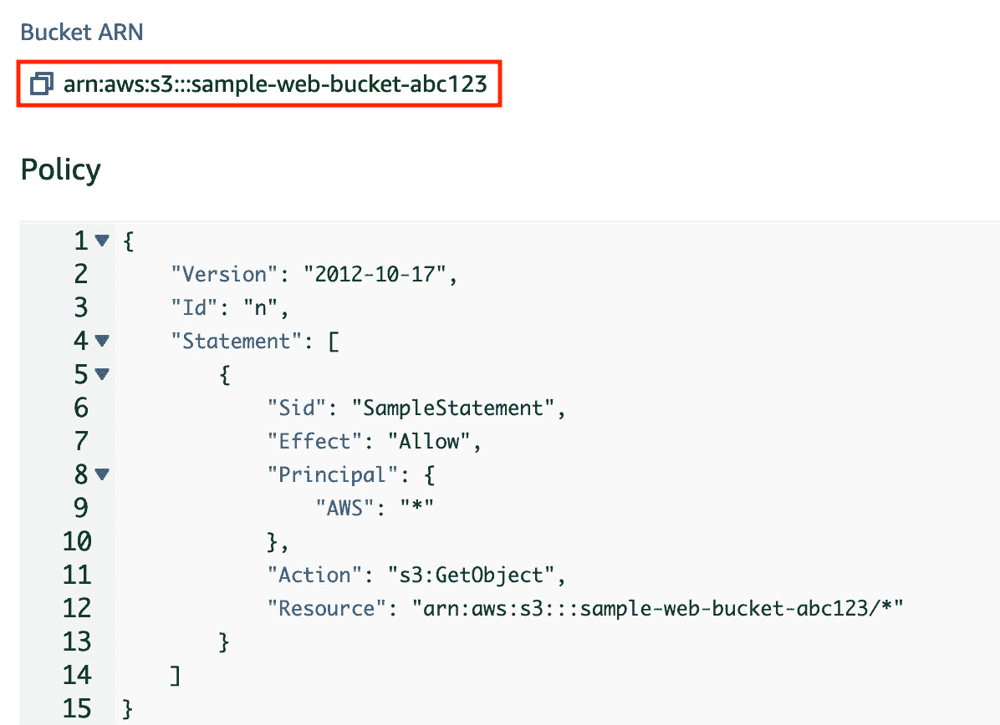

    图 2.15 – 指定桶策略

    该 S3 存储桶策略使*任何* AWS 账户都可以从**sample-web-bucket-abc123** S3 存储桶中检索对象。你可能会惊讶地发现，我们在*图 2.15*中看到的配置，实际上是全球范围内 S3 存储桶中常见的配置错误！

重要说明

需要注意的是，将**"Action"**参数值从**"s3:GetObject"**更改为**"*"**将允许*任何* AWS 账户执行不必要的操作（例如，上传文件）到我们的 S3 存储桶中。我们不希望其他用户拥有写入访问权限到我们的存储桶！为什么呢？首先，恶意的已认证用户将能够向我们的 S3 存储桶上传多个大型文件（这会影响我们的 AWS 账单）。也就是说，在处理策略时，应该尽量避免使用通配符或星号（**"*"**），即使我们设计的是一个故意脆弱的 S3 存储桶。

1.  向下滚动到页面底部，点击**保存** **更改**按钮。

1.  现在，让我们修改**访问控制列表（ACL）**配置设置。点击**编辑**按钮，如*图 2.16*所示：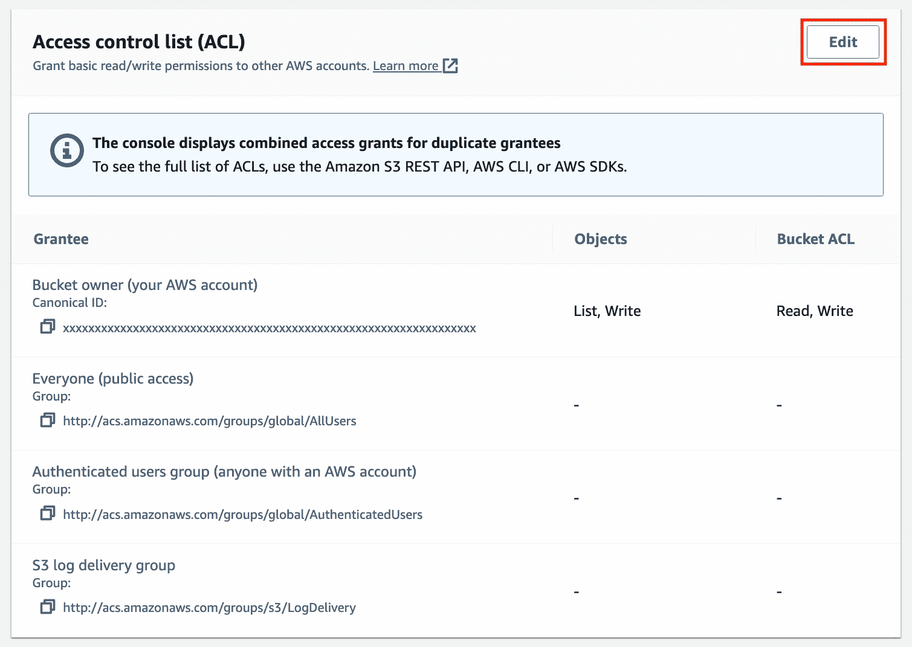

    图 2.16 – 编辑 ACL 配置

    在这里，我们可以看到当前的 S3 存储桶 ACL 配置。默认情况下，只有存储桶的所有者（你）才能在存储桶上执行操作。

1.  在**编辑访问控制列表（ACL）** | **访问控制列表（ACL）**下，点击**对象**列中**已认证用户组**授权方的**列出**复选框，并将其设置为*开启*，类似于我们在*图 2.17*中看到的：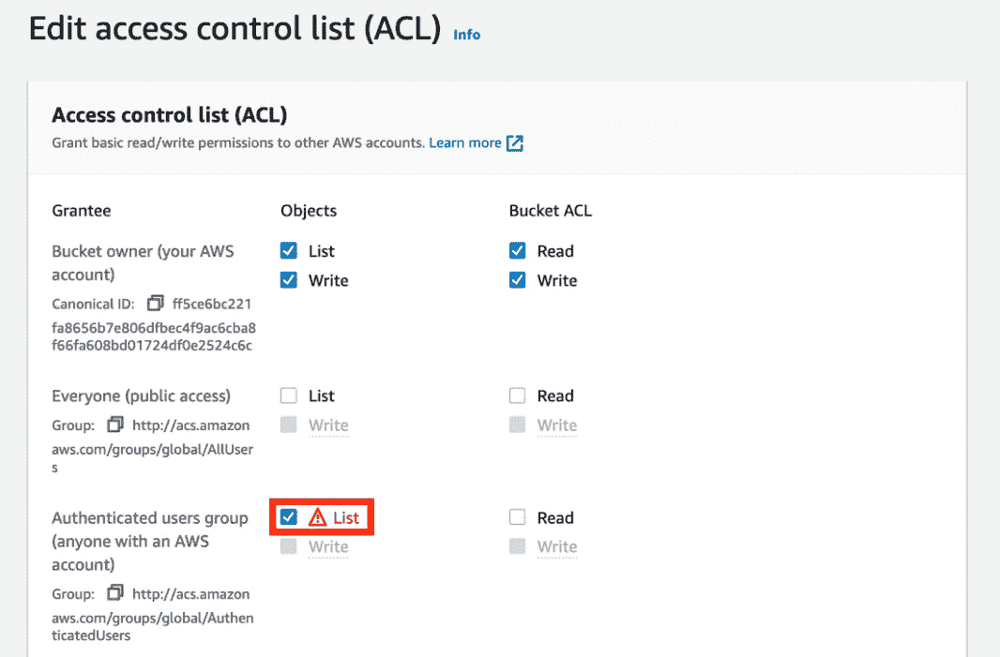

    图 2.17 – 允许认证用户组列出存储桶中的对象

    这应该允许任何拥有 AWS 账户的人列出我们 S3 存储桶中的对象。

注释

欢迎查看[`aws.amazon.com/blogs/security/iam-policies-and-bucket-policies-and-acls-oh-my-controlling-access-to-s3-resources/`](https://aws.amazon.com/blogs/security/iam-policies-and-bucket-policies-and-acls-oh-my-controlling-access-to-s3-resources/)了解更多关于在多种访问控制机制存在时，权限控制是如何工作的。

1.  确保将**我理解这些更改对我的对象和存储桶的影响**复选框设置为*开启*：

    图 2.18 – 确认将应用的 ACL 修改

    鉴于此配置更改可能带来意想不到的后果（从安全角度来看），AWS 要求我们审查并确认所应用的更改。

重要说明

AWS 建议禁用 ACL，因为在大多数场景和用例中，我们可以依赖 S3 存储桶策略、IAM 策略、VPC 端点策略以及 AWS 组织的 SCP 来管理 S3 的访问控制。然而，尽管存在警告和防护措施，许多现有的 S3 存储桶仍然配置错误并存在漏洞，因为只有新创建的 S3 存储桶才会受到 AWS 强制执行的最新防护措施的保护。

现在我们已经修改了存储桶策略和 ACL 配置设置，接下来将在下一节中继续上传文件到我们的 S3 存储桶。

## 将文件上传到 S3 存储桶

如果没有存放在我们的易受攻击的 S3 存储桶中的文件，设置就不完整了。也就是说，我们将上传一些我们可能在典型的 S3 存储桶中看到的示例文件。有多种方法可以将文件上传到 S3 存储桶。一种选择是使用 AWS 管理控制台上传文件。另一种选择是使用 **AWS CLI** 通过命令行上传文件。

在接下来的步骤中，我们将使用 AWS CLI 将文件上传到我们的 S3 存储桶：

1.  打开一个新的浏览器标签页，导航到 AWS 控制台。在搜索栏中输入 **shell**，从结果列表中选择 **CloudShell**，就像我们在 *图 2.19* 中看到的那样：

    图 2.19 – 导航到 CloudShell 控制台

    如果你之前没有使用过 **AWS CloudShell**，它其实是一个基于浏览器的命令行终端，我们可以在其中运行不同的命令来管理我们的资源。在接下来的步骤中，你会惊讶于使用 CloudShell 的便利性！

注意

需要注意的是，AWS CloudShell 可能不支持其他 AWS 区域。如需更多信息，请随时查看以下链接：[`docs.aws.amazon.com/cloudshell/latest/userguide/supported-aws-regions.html`](https://docs.aws.amazon.com/cloudshell/latest/userguide/supported-aws-regions.html)。

1.  当你看到 **欢迎使用 AWS CloudShell** 弹出窗口时，点击 **关闭** 按钮：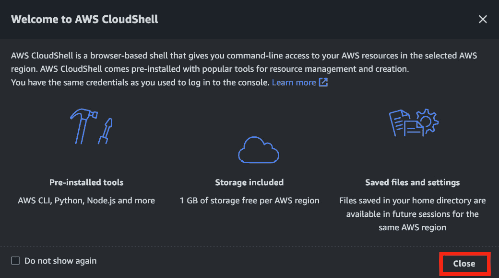

    图 2.20 – 关闭欢迎弹窗

    在 *图 2.20* 中，我们可以看到 **AWS CloudShell** 已预安装 AWS CLI、Python 和 Node.js 以及其他工具。此外，我们还可以使用 1 GB 的免费存储（按 AWS 区域划分），在其中管理、上传和下载用于资源管理和创建的文件。

    关闭弹出窗口后，你应该能看到一个终端，在终端中可以输入并运行 bash 命令。

1.  在我们的 CloudShell 环境的终端（**$** 符号后面），运行以下 bash 命令：

    ```
    mkdir files
    cd files
    ```

    **mkdir** 命令用于创建一个名为 **files** 的新目录。之后，使用 **cd** 命令进入新创建的目录。

1.  接下来，让我们运行以下命令，将 **sample_website.zip** 文件下载到我们刚创建的 **files** 目录中：

    ```
    SOURCE=**https://github.com/PacktPublishing/Building-and-Automating-Penetration-Testing-Labs-in-the-Cloud/raw/main/ch02/sample_website.zip**
    wget $SOURCE -O sample_website.zip
    ```

    这将生成一组日志，类似于我们在 *图 2.21* 中看到的内容：

    

    图 2.21 – 在 AWS CloudShell 中运行命令

    我们刚刚下载的 **sample_website.zip** 文件里面有什么？正如我们在接下来的步骤中看到的，**sample_website.zip** 文件包含一个 **index.html** 文件，以及一个目录，里面有应用程序的后端代码备份副本。

1.  使用 **ls** 命令列出当前目录中的所有文件：

    ```
    ls
    ```

    此时，我们的当前目录中应该只剩下**sample_website.zip**文件。

1.  让我们使用**unzip**命令提取**sample_website.zip**文件的内容：

    ```
    unzip sample_website.zip
    ```

    这应该会给我们一组日志，类似于以下代码块中的内容：

    ```
    Archive:  sample_website.zip
       creating: backup/
       creating: backup/backend/
       creating: backup/backend/node_modules/
       creating: backup/backend/node_modules/dotenv/
    ... (and so on)
    ```

1.  在执行上传命令之前，让我们从**files**目录删除**sample_website.zip**文件：

    ```
    rm sample_website.zip
    ```

1.  现在，让我们使用**aws s3 cp**命令将文件上传到 S3 存储桶（这大约需要 10 到 15 秒的时间完成）：

    ```
    aws s3 cp --recursive . s3://<INSERT S3 BUCKET NAME>
    ```

    确保将**<INSERT S3 BUCKET NAME>**替换为你的 S3 存储桶名称。

注意

在这一步中，我们使用**AWS CLI**从 AWS CloudShell 环境中的一个目录将文件上传到我们的 S3 存储桶。如果这是你第一次使用 AWS CLI，它只是一个用于管理 AWS 资源的命令行工具，包括创建和配置资源、部署应用程序和管理安全设置。有关 AWS CLI 的更多信息，请查看以下视频：[`www.youtube.com/watch?v=EAFRKMe6j08`](https://www.youtube.com/watch?v=EAFRKMe6j08)。

1.  返回 S3 控制台，并在**属性**选项卡下找到**静态网站托管**配置设置。点击**存储桶网站端点**链接（如*图 2.22*所示）：

    图 2.22 – 定位存储桶网站端点链接

    我们应该看到一个维护页面，类似于*图 2.23*中所示：

    

    图 2.23 – 验证文件是否已上传至 S3

    请注意，我们上传到 S3 存储桶的**index.html**页面在发出请求时会被返回并渲染，因为它是静态网站的配置索引文档。

这样，我们的设置就完成了！在下一部分，我们将测试我们的脆弱环境，并检查当前设置是否正常工作，并按预期配置。

# 测试并攻击我们的第一个脆弱环境

在本节中，我们将尝试模拟攻击者在试图攻击我们脆弱的 S3 存储桶时可能的行为。攻击者可能会使用一套专门的自动化工具，但在本章节中，我们即使没有这些工具，也应该能顺利进行。

## 检查并验证 S3 存储桶的安全性

我们将通过一系列手动检查来验证我们创建的 S3 存储桶的安全配置。

重要提示

攻击属于其他用户或公司拥有的云资源是违反道德且非法的。在我们开始之前，请确保阅读*《构建渗透测试实验室环境时需要考虑的事项》*部分，位于*《云中的渗透测试实验室入门》*的*第一章*中，因为我们将模拟攻击过程来验证配置错误和漏洞是否存在并且可被利用。

这样一来，我们可以继续测试和攻击我们脆弱的云实验室设置：

1.  在上一节中继续未完的操作，右键单击维护页面的中心位置，并从可用选项列表中选择**查看页面源代码**。这将让我们看到与*图 2.24*所示类似的维护页面前端 HTML 代码：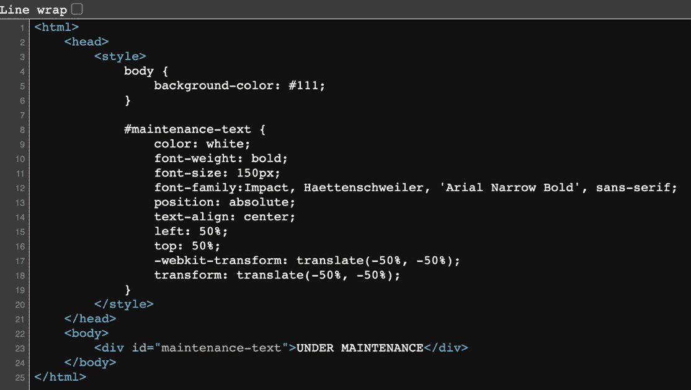

    图 2.24 – 查看页面源代码

    由于这是一个静态页面，我们应该无法找到其他链接或资源引用以进一步检查。

1.  接下来，访问**http://<S3 BUCKET URL>.s3-website-us-east-1.amazonaws.com/.git**来检查（1）是否存在**.git**目录，（2）**.git**目录是否为公共的。确保将**<S3 BUCKET URL>**替换为你创建的存储桶名称。你应该看到类似于*图 2.25*所示的错误信息：

    图 2.25 – 404 未找到

    如*图 2.25*所示，存储桶内不存在此类文件或目录。你可以检查其他文件，例如**README.md**，但由于我们已经对存储桶中的内容有了大致了解，因此目前可以跳过这些附加步骤。

1.  我们还可以通过访问**https://<S3 BUCKET URL>.s3.amazonaws.com/**来检查 S3 存储桶内的文件和目录是否会被列出。确保将**<S3 BUCKET URL>**替换为你的 S3 存储桶名称：

    图 2.26 – 检查我们是否能列出存储桶内容

    这应该会给我们一个**访问被拒绝**的错误信息，类似于*图 2.26*所示。 这是否意味着我们无法作为访客用户（公共访问）访问存储桶内的文件？不一定！我们将在下一步中看到这种情况。

注意

在使用 S3 存储桶时，确保你熟悉可用的不同 URL。除了我们在上一步中检查过的 URL，你还可以检查**https://s3.amazonaws.com/<S3 BUCKET URL>/**（在此处将**<S3 BUCKET URL>**替换为 S3 存储桶的名称）。

1.  接下来，让我们检查是否可以访问存储桶中的一些已知文件。由于 S3 存储桶配置为托管静态网站，它可能包含**index.html**文件（除非存储桶配置为使用其他索引文件）。因此，让我们访问**https://<S3 BUCKET URL>.s3.amazonaws.com/index.html**。与上一步相同，确保将**<S3 BUCKET URL>**替换为你的 S3 存储桶名称：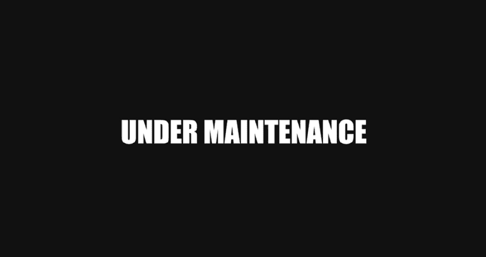

    图 2.27 – 检查我们是否能访问 index.html 文件

    这应该呈现维护页面，类似于我们在*图 2.27*中的内容。请注意，我们应该能够访问存储在此存储桶中的其他文件，因为 S3 存储桶很可能被配置为允许未经身份验证的用户读取。然而，由于我们无法从访客用户的角度得知某些文件的存在，因此我们暂时跳过任何类似或相关的步骤。当然，使用自动化脚本通过暴力破解方法检查存储桶中的所有可能密钥也是一种选择（但不推荐）。

1.  打开一个私密浏览窗口。访问[`aws.amazon.com/console/`](https://aws.amazon.com/console/)并登录到你的第二个 AWS 账户：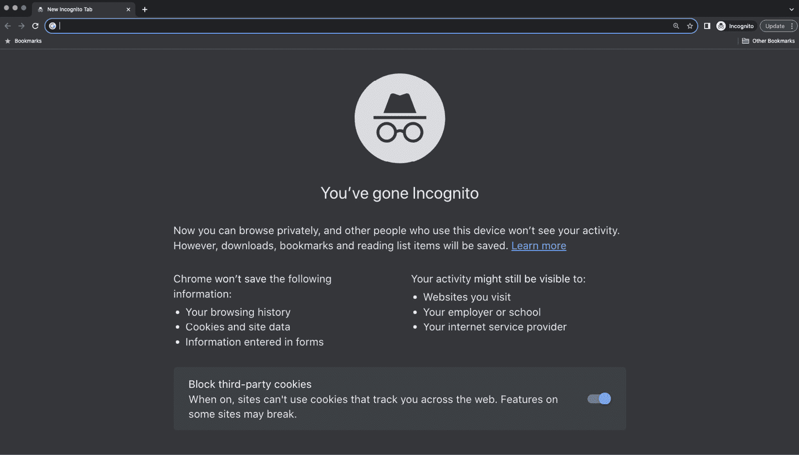

    图 2.28 – 打开私密浏览窗口

    当登录到第二个 AWS 账户时，你可能会决定完全使用不同的浏览器。请注意，我们正在模拟从攻击者的角度体验这一过程。

1.  在搜索框中输入**shell**。从结果列表中选择**CloudShell**，如*图 2.29*所示：

    图 2.29 – 导航到 CloudShell 控制台

    如果看到**欢迎使用 AWS CloudShell**的弹出窗口，请点击**关闭**按钮。

1.  将**S3_BUCKET**变量值设置为我们之前创建的 S3 存储桶的名称：

    ```
    S3_BUCKET=<INSERT S3 BUCKET NAME>
    ```

    确保将**<INSERT S3 BUCKET NAME>**的值替换为我们之前创建的 S3 存储桶的名称。

1.  使用启用**--no-sign-request**标志的**aws s3 ls**命令列出 S3 存储桶的内容：

    ```
    aws s3 ls s3://$S3_BUCKET --no-sign-request
    ```

    这应该产生一个错误消息，内容为**调用 ListObjectsV2 操作时发生错误：** **访问被拒绝**。

注意

使用带有**--no-sign-request**标志的**aws s3 ls**命令会禁用 AWS 请求签名的要求。默认情况下，AWS CLI 请求会使用 AWS 凭证进行签名，以确保身份验证和授权。然而，当使用**--no-sign-request**时，命令会跳过签名过程，允许未经身份验证和未签名的请求列出指定 S3 存储桶中的对象或文件。

1.  使用**aws s3 ls**命令列出 S3 存储桶的内容，这次不使用**--no-sign-request**标志：

    ```
    aws s3 ls s3://$S3_BUCKET
    ```

    这应该成功返回存储桶的内容（即**index.html**文件以及**backup**文件夹）。

1.  让我们检查一下能否从 S3 存储桶下载**index.html**文件到 CloudShell 环境：

    ```
    aws s3 cp s3://$S3_BUCKET/index.html .
    ```

    这应该记录一条类似以下的消息：

    ```
    download: s3://<S3 BUCKET>/index.html to ./index.html
    ```

    这意味着我们可以作为经过身份验证的用户列出和下载文件！

重要提示

请注意，这与我们用来创建存储桶的账户*不同*。当然，由于我们故意配置了 S3 存储桶以具有此行为，因此这不应令人惊讶。

1.  接下来，让我们检查一下能否从 CloudShell 环境向 S3 存储桶上传一个示例文件：

    ```
     touch test.txt aws s3 cp test.txt s3://$S3_BUCKET/test.txt
    ```

    这应该返回类似以下的消息：

    ```
    upload failed: ./test.txt to s3://<S3 BUCKET>/test.txt An error occurred (AccessDenied) when calling the PutObject operation: Access Denied
    ```

    这意味着我们无法作为认证用户向 S3 桶上传文件。

注意

请注意，攻击者也可以检查他们是否能够通过使用**aws s3api get-bucket-acl**和**aws s3api put-bucket-acl**命令来检索和设置桶的 ACL。有关此主题的更多信息，请随时查看[`bit.ly/3mbwlb5`](https://bit.ly/3mbwlb5)和[`bit.ly/3SAPq2o`](https://bit.ly/3SAPq2o)。

需要注意的是，我们故意配置了 S3 桶以允许认证用户只读访问，因为我们不希望其他认证用户向我们的 S3 桶上传文件。

## 下载并检查存储在 S3 桶中的文件

在上一节中，我们确认了可以使用**aws s3 cp**命令作为认证用户从 S3 桶下载文件。在本节中，我们将继续下载并检查存储在漏洞 S3 桶中的所有文件：

1.  让我们先使用**mkdir**命令创建**downloaded**目录：

    ```
    mkdir downloaded
    ```

1.  接下来，使用**cd**命令进入**downloaded**目录：

    ```
    cd downloaded
    ```

1.  使用**aws s3 cp**命令将目标 S3 桶中存储的所有文件下载到 CloudShell 本地目录：

    ```
    aws s3 cp --recursive s3://$S3_BUCKET .
    ```

    在这里，我们使用了**--recursive**标志来递归下载存储在 S3 桶中的所有文件：

    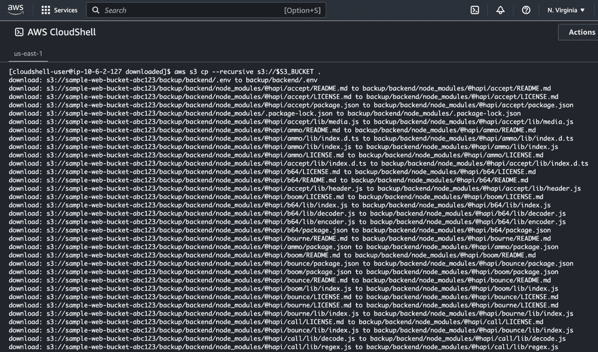

    图 2.30 – 执行 aws s3 cp 命令后生成的日志

    在这里，我们使用不同的 AWS 账户从 S3 桶中下载存储的文件。*吓人吧？*

注意

这意味着*任何*拥有 AWS 账户的用户，假设包括未授权用户，都有可能访问并下载存储在 S3 桶中的文件。在这里，我们展示了使用一个不同且完全无关的 AWS 账户，只需几个命令就能下载配置错误的桶中的内容。

1.  现在，让我们使用以下命令安装**tree**命令：

    ```
    sudo yum install tree -y
    ```

1.  安装了**tree**命令后，让我们使用它来生成当前目录的文件树：

    ```
    tree
    ```

    这应该生成并打印一个类似于*图 2.31*的文件树：

    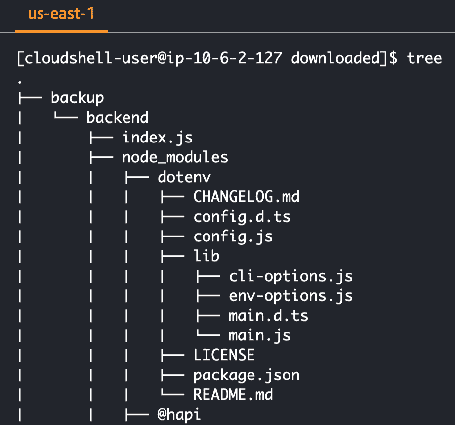

    图 2.31 – 使用 tree 命令生成的文件树

    使用没有**参数/标志**的**tree**命令会递归列出所有文件，并给我们一个非常长的文件和目录列表。

1.  现在，让我们运行以下命令来限制结果（树的深度）并显示隐藏文件：

    ```
    tree -aL 4
    ```

    这应该返回一个类似于*图 2.32*的文件树：

    

    图 2.32 – 运行 tree 命令后的结果

    从*图 2**.32*中显示的树结果中，我们可以推断出正在使用的后端 Web 框架是**Hapi.js**（[`hapi.dev/`](https://hapi.dev/)）。除此之外，**dotenv** **npm**软件包用于管理和加载环境变量。*图 2**.23*还显示，在**/****backup/backend**目录中存储了一个**.env**文件。

注意

为了避免在应用程序代码中硬编码秘密、变量和配置设置，开发团队可以利用**dotenv**等软件包从**.env**文件中加载凭据和环境变量。另外，开发和工程团队也可以使用 YAML 或 JSON 文件。开发人员常犯的一个常见错误是忘记在代码存储库中排除这些文件。这意味着任何能访问存储库（或存储库备份）的人都可以获得包含应用程序中使用的凭据和变量的文件的副本。

1.  让我们运行以下命令查看**.****env**文件中的内容：

    ```
    cat backup/backend/.env
    ```

    这将为我们提供**AWS_ACCESS_KEY_ID**和**AWS_SECRET_ACCESS_KEY**的占位值，类似于我们在以下配置块中的内容：

    ```
    AWS_ACCESS_KEY_ID=XXXXXXXXXX AWS_SECRET_ACCESS_KEY=YYYYYYYYYY
    ```

    注意，在更现实的情况下，我们可能会在这里找到其他凭据和密钥。值得注意的是，凭据可能会在存储库的代码库中找到硬编码。

注意

*一旦攻击者获得这些凭据，他们会做什么？* 攻击者现在可以使用与这些凭据相关联的帐户执行恶意操作。例如，攻击者可能使用电子邮件服务（例如，**SendGrid**）的凭据发送钓鱼邮件来攻击其他个人或组织。在获取*.env*、*YAML*或*JSON*文件后，攻击者还可能能够访问数据库，因为这些文件很可能也包含数据库凭据。

到目前为止，我们应该对如何准备和测试一个相对简单的易受攻击的云资源有一个很好的想法。当然，生产环境很可能在同一账户中部署了其他资源。不用担心 - 随着我们在接下来的章节中进行实践示例的工作，我们将看到我们易受攻击的云环境的复杂性增长。

# 清理

清理我们创建或部署的云资源是处理易受攻击的云应用程序和环境时的关键步骤。如果我们不立即清理创建的资源，我们可能会发现我们的资源受到恶意用户的攻击。因此，让我们继续删除本章中创建的资源：

1.  让我们开始使用我们用来创建 S3 存储桶的帐户登录到 AWS 管理控制台。请记住，我们有两个帐户 - “目标”AWS 帐户和“攻击者”AWS 帐户。我们将继续登录到“目标”AWS 帐户，因为我们使用该帐户创建了 S3 存储桶。

1.  在搜索栏中输入**shell**并从搜索结果中选择**CloudShell**，如*图 2**.33*所示：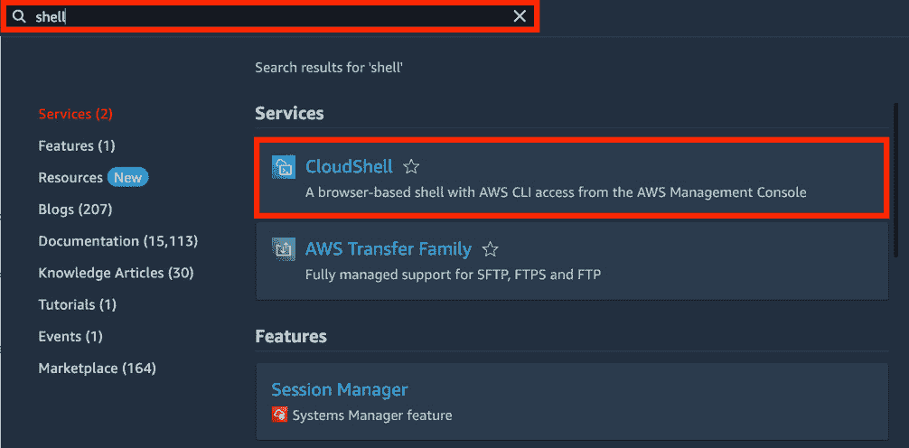

    图 2.33 – 导航到 CloudShell 控制台

    当您看到**欢迎使用 AWS CloudShell**的弹出窗口时，点击**关闭**按钮。

1.  在我们的 CloudShell 环境的终端中（在**$**符号后），运行以下 bash 命令：

    ```
    S3_BUCKET=<INSERT S3 BUCKET NAME>
    ```

    这里，我们正在设置**S3_BUCKET**变量的值，该值为我们之前创建的 S3 存储桶的名称。确保将**<INSERT S3 BUCKET NAME>**的值替换为您自己的 S3 存储桶名称。

1.  现在，让我们使用**aws s3 rb**（删除存储桶）命令来删除该存储桶以及其中的所有对象：

    ```
    aws s3 rb s3://$S3_BUCKET --force
    ```

    这将生成一组日志，类似于*图 2**.34*中展示的内容：

    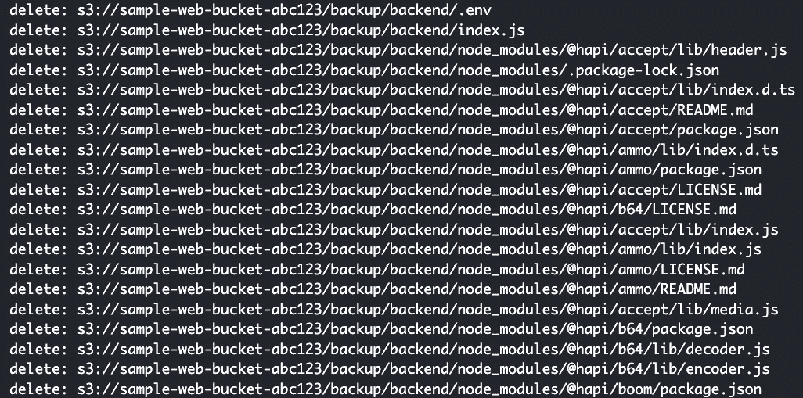

    图 2.34 – 执行 aws s3 rb 命令后生成的日志

    我们执行的命令将删除存储桶中的所有对象，然后在存储桶为空时删除该 S3 存储桶。

注意

请注意，在生产环境中使用**aws s3 rb**命令时需要小心，因为在禁用对象版本控制的情况下，我们将丢失存储桶中的所有文件。在运行此命令之前，必须先备份存储桶中的文件。欲了解更多详情，请访问以下链接：[`docs.aws.amazon.com/AmazonS3/latest/userguide/delete-bucket.html`](https://docs.aws.amazon.com/AmazonS3/latest/userguide/delete-bucket.html)。

就是这样！由于我们只处理相对简单的设置，因此清理过程预计会很简单。

# 总结

在本章中，我们设计并准备了第一个故意存在漏洞的云实验室环境。我们首先通过 AWS 管理控制台创建了一个空的 S3 存储桶。之后，我们配置了该存储桶用于静态网站托管。我们还修改了 S3 存储桶的访问控制设置，允许其他经过身份验证的 AWS 用户列出并检索我们存储桶中的对象。为了完成设置，我们将示例文件上传到 S3 存储桶中。

我们通过一系列步骤测试了我们的设置，包括一些终端命令，检查并验证了 S3 存储桶的安全配置。在确认可以使用第二个 AWS 帐户（未用于创建存储桶）从 S3 存储桶下载文件后，我们继续下载并检查了存储桶中所有的文件。最后，我们通过清理并删除本章中创建的资源来结束操作。

在下一章中，我们将重点介绍如何使用**基础设施即代码**（**IaC**）工具和策略，帮助我们在云中构建和管理复杂的易受攻击的实验室环境。如果您在想我们是否可以自动化本章中执行的步骤，那么下一章将为您解答！

# 深入阅读

若想了解本章涉及的更多信息，可以查看以下资源：

+   *IAM 策略和存储桶策略以及* *ACL* ([`aws.amazon.com/blogs/security/iam-policies-and-bucket-policies-and-acls-oh-my-controlling-access-to-s3-resources/`](https://aws.amazon.com/blogs/security/iam-policies-and-bucket-policies-and-acls-oh-my-controlling-access-to-s3-resources/))

+   *S3 - 使用* *ACL* 管理访问权限 ([`docs.aws.amazon.com/AmazonS3/latest/userguide/acls.html`](https://docs.aws.amazon.com/AmazonS3/latest/userguide/acls.html))

+   *提醒：亚马逊 S3 安全性变更将于* *2023 年 4 月* 到来 ([`aws.amazon.com/blogs/aws/heads-up-amazon-s3-security-changes-are-coming-in-april-of-2023/`](https://aws.amazon.com/blogs/aws/heads-up-amazon-s3-security-changes-are-coming-in-april-of-2023/))

+   *控制对象所有权并禁用存储桶的 ACL* ([`docs.aws.amazon.com/AmazonS3/latest/userguide/about-object-ownership.html`](https://docs.aws.amazon.com/AmazonS3/latest/userguide/about-object-ownership.html))

+   *新 S3 存储桶的默认设置* *常见问题* ([`docs.aws.amazon.com/AmazonS3/latest/userguide/create-bucket-faq.html`](https://docs.aws.amazon.com/AmazonS3/latest/userguide/create-bucket-faq.html))
