# 3

# 成功使用基础设施即代码工具和策略

在上一章中，我们使用 **AWS 管理控制台** 手动创建了第一个易受攻击的实验环境。整个设置过程大约花了我们一个半小时。完成实验环境设置后，我们可能又花了 30 分钟来测试是否一切（误）配置正确。如果我们希望为一个安全培训课程设置 10 个与*第二章*中相似的实验环境怎么办？*我们真的需要大约 20 小时才能完成这些设置吗？*此外，请记住，我们只完成了整个云渗透测试实验环境的一个小部分！完整的实验环境一般比我们在*第二章*中准备的要多出 5 到 10 倍的资源。假设完整环境至少是我们最初准备的五倍大，并且考虑到每次都需要创建和删除整个环境以管理成本，那么是否手动设置这些实验环境（通常每个大约需要 10 小时）真的必要呢？话虽如此，是否有更好的方法来创建和管理我们的渗透测试实验环境的云基础设施资源？

本章将通过深入分析 **基础设施即代码**（**IaC**）如何解决这些挑战和需求，来回答这些问题！因此，我们将涵盖以下主题：

+   深入探讨 IaC 工具和策略

+   在 AWS CloudShell 中设置 Terraform

+   使用 Terraform 起步

+   理解 Terraform 配置语言

+   使用 Terraform 构建我们的易受攻击的实验环境

+   配置带有状态锁定的 Terraform 后端

+   验证状态锁定设置

本章的实践解决方案将为你提供将现有云基础设施资源转换为 IaC 配置文件所需的技能和信心。通过这些配置文件，我们应该能够使用自动化工具和服务在几分钟内快速设置多个渗透测试实验环境！

# 技术要求

在开始之前，我们必须准备以下内容：

+   **必需**：在*第二章*中使用的“目标”AWS 账户，将包含易受攻击的环境和资源

+   **可选**：第二个 AWS 账户（同样在*第二章*中使用），将作为“攻击者的账户”

如果你跳过了*第二章*，*准备我们的第一个易受攻击的云实验环境*，可以通过以下链接创建 AWS 账户：[`aws.amazon.com/free/`](https://aws.amazon.com/free/)。账户创建好后，便可继续进行后续步骤。

注意

本章主要关注使用 Terraform 在 AWS 上构建一个示例易受攻击的实验室环境。当然，一旦进入本书后续章节的动手部分（*第四章*及之后章节），我们需要准备好**Microsoft Azure**和**Google Cloud Platform**（**GCP**）账户。与此同时，当前设置两个 AWS 账户应该足够了。

本书每章使用的源代码和其他文件可以在本书的 GitHub 仓库中找到：

[`github.com/PacktPublishing/Building-and-Automating-Penetration-Testing-Labs-in-the-Cloud`](https://github.com/PacktPublishing/Building-and-Automating-Penetration-Testing-Labs-in-the-Cloud)

# 深入探索 IaC 工具和策略

在我们深入本章的实际练习之前，我们将首先在本节中明确理解 IaC，并讨论如何利用它来构建复杂的渗透测试实验室。

## 揭开 IaC 的神秘面纱

IaC 是通过代码来配置和管理基础设施资源的实践和过程。这些代码的工作原理类似于房屋蓝图在建造实际房屋时的参考作用。处理 IaC 代码的酷炫之处在于，实际的基础设施资源是根据表示所需最终状态的代码自动创建和配置的。在后台，IaC 自动化工具实际上只是使用我们在尝试自动化特定流程时会使用的相同 API 集。这个过程在下图中进行了说明：


图 3.1 – 使用 IaC 工具和服务创建和管理云资源

在*图 3.1*中，我们可以看到相同的配置文件集（表示所需的状态）可以用于生成和配置多个具有相同资源和属性的环境。例如，我们可以在配置和确保开发、预生产和生产环境的一致性时使用 IaC 配置文件，这些环境供开发人员和工程师使用。

此时，你可能会好奇配置文件是如何用来生成实际的云基础设施资源的。让我们从定义单个资源的配置文件开始。这个配置文件随后作为输入传递给 IaC 工具，IaC 工具根据指定的代码（**命令式方法**）执行，或者通过“魔法”将配置代码转换为实际的基础设施资源（**声明式方法**）。

以下图表展示了 IaC 工具和服务如何管理变更：

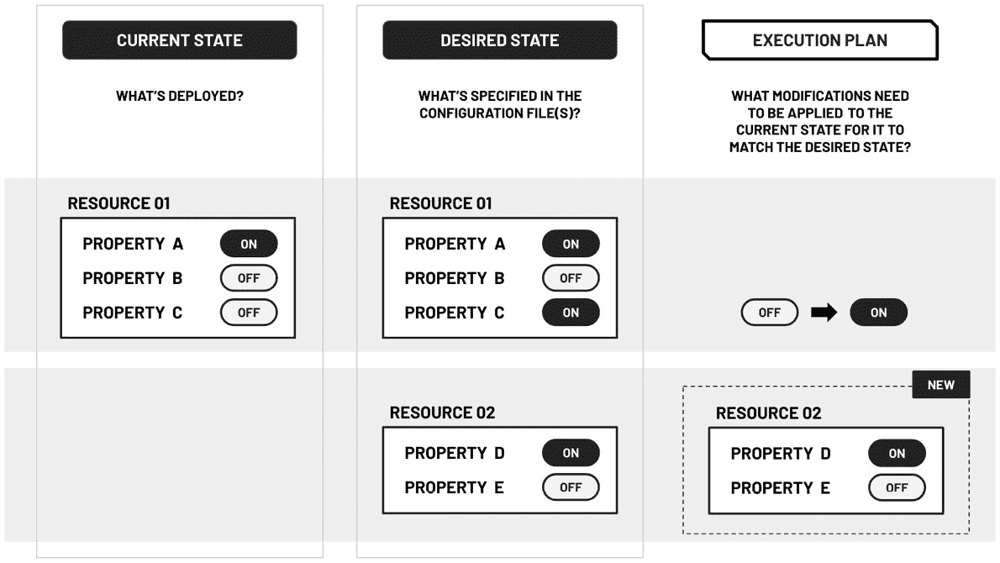

图 3.2 – IaC 工具和服务如何管理变更

*假设我们使用声明性方法来配置初始的云资源集，我们能否修改配置代码并再次使用 IaC 工具来更新现有的基础设施资源集？* 正如我们在*图 3.2*中所看到的那样，某些 IaC 工具可以自动管理这些更改，并生成一个**执行计划**，该计划会修改基础设施，使其达到 IaC 配置模板中指定的期望状态。这些更改随后会应用于现有的基础设施资源。

注意

需要注意的是，IaC 工具可能会（1）在基础设施中执行就地修改，或者（2）替换整个基础设施资源。这取决于所使用的 IaC 工具以及所进行的更改类型。在处理部署在渗透测试实验室环境中的资源时，我们通常希望替换整个资源，因为旧的基础设施资源可能由于先前的利用尝试和活动已经处于不稳定或配置错误的状态。

## 利用 IaC 进行渗透测试实验室管理

现在，让我们来讨论为什么 IaC 与云端渗透测试实验室的准备和管理相得益彰。创建和管理云端专用渗透测试实验室环境可能是复杂且耗时的。使用 IaC 可以简化这一过程，并带来许多好处。

以下是使用 IaC 构建云端渗透测试实验室的一些优势：

+   **更快的部署**：由于配置代码包含了要创建的资源的属性和期望状态，我们可以通过自动化流程在几秒钟内（最多几分钟）快速创建和销毁各种实验室资源。这帮助我们在渗透测试实验室活动或实验后，轻松地重建需要“刷新”的特定云基础设施资源（因为这些活动可能会故意或无意中将某些服务或资源置于不稳定或配置错误的状态）。

+   **协作**：我们可以轻松地与其他工程师共享实验室环境的配置和设置代码。这使得在排查部署在渗透测试实验室环境中的资源的安全配置时，可以更轻松地进行协作和讨论（也就是说，无需分享整个云账户）。

+   **一致性**：如果从单个 IaC 配置代码实例设置了多个易受攻击的实验室环境，我们只需修改 IaC 代码一次，并将更改自动应用于这些实验室环境。我们可以保证基础设施管理过程的重复性，并确保每次构建渗透测试实验室环境时，资源配置和版本保持一致。需要注意的是，某些漏洞和错误配置的可利用性取决于所使用的应用程序和资源的版本。

+   **透明性**：由于我们可以使用表示基础设施的代码检查当前配置，审计基础设施配置错误变得更加容易。

+   **优化**：基础设施成本管理变得更加容易，因为我们可以在没有人使用渗透测试实验室环境时关闭（或删除）云资源。一旦需要创建资源，从现有的基础设施配置代码准备资源只需几分钟。

如我们所见，IaC 通过自动化过程实现更快速的实验室资源部署，允许在几秒钟到几分钟内快速创建和销毁资源。协作变得更加简单，因为工程师可以轻松地以代码形式共享实验室环境配置和设置，从而促进了安全设置的故障排除，而无需共享整个云账户。此外，IaC 通过修改代码一次并自动将更改应用于多个实验室环境，确保一致性，保证了重复性，并保持一致的资源配置和版本。

牢记这些要点后，我们可以继续讨论在使用 IaC 解决方案时的最佳实践和策略。

## 接纳 IaC 最佳实践和策略

过去几年里，开发人员和工程师使用了多种 IaC 工具来创建和管理基础设施。其中一些最流行的工具包括**Chef**、**Puppet**、**Vagrant**、**(R)?ex**、**SaltStack**、**Pulumi**、**Ansible**、**AWS Cloud Development Kit**（**AWS CDK**）、**AWS CloudFormation**、**GCP Deployment Manager**和**Azure Resource Manager**。其中一些工具（如 AWS CDK、AWS CloudFormation、GCP Deployment Manager 和 Azure Resource Manager）是为特定云提供商自动化资源的创建、配置和管理而构建的。其余的则是云中立的——即这些工具应该能跨多个云平台（如**AWS**、**Microsoft Azure**和**GCP**）工作。在这个列表中，某些工具（如 Ansible、Chef 和 Puppet）主要集中在设置应用程序和配置*虚拟机内部的内容*，而其他工具（如 Terraform）主要专注于从代码中部署和提供云基础设施资源。

注意事项

我们可以在部署、配置和管理基础设施时同时使用多个工具。例如，我们可以将 Terraform 与 Ansible 结合使用，自动化部署云基础设施资源以及运行在虚拟机中的应用程序。

在我们进入下一部分之前，让我们讨论一下使用 IaC 工具和服务时可以采取的一些策略：

+   我们可以使用**版本控制系统**（例如 Git）来跟踪和管理用于管理和部署渗透测试实验室环境的 IaC 配置代码的变化。除此之外，我们还可以通过**持续集成/持续部署**（**CI/CD**）管道，在代码更改推送到代码仓库后，自动部署 IaC 文件中指定的资源。

+   我们可以通过将代码正确地拆分为多个文件，轻松模块化并管理实验室环境中使用的不同资源组。一旦渗透测试实验室的组件被模块化，我们就可以轻松地使用现有模块生成不同变种的漏洞实验环境。

+   成本在渗透测试实验室环境设计中起着重要作用。基础设施即代码（IaC）允许环境或云账户的拥有者在需要时再启用（或根本没有）云资源。*为什么？* 因为 IaC 工具使得从配置文件（通常是几秒钟或几分钟内）创建和恢复资源变得非常简单。当我们在云中设计和构建渗透测试实验室环境时，我们还可以选择是否允许多个用户共享同一个环境，或者让每个用户拥有自己的专用环境（这可能会更昂贵）。使用 IaC 时，我们可以轻松地让第二个选项在成本上更具可行性，因为我们只需在用户需要时根据模板创建并配置基础设施。*第一个选项的缺点是什么？* 由于实验室由多个用户共享，某些用户在渗透测试过程中可能会遇到意外问题，因为涉及的资源可能已经由于其他用户的某个操作（或多个操作）而配置错误。如果其中一个用户决定刷新或重置系统，那么另一个用户的任何正在进行的工作也会被重置。

到此为止，我们应该已经对 IaC 的概念和如何利用它有效管理渗透测试实验室环境有了充分的理解。在下一部分中，我们将首次介绍全球专业人士广泛使用的最流行的 IaC 工具之一。

# 在 AWS CloudShell 中设置 Terraform

在本章中，我们将重点介绍如何使用**Terraform**来配置和管理我们的云基础设施。Terraform 是一个由**HashiCorp**创建的开源基础设施即代码（IaC）工具。目前，它是最强大且最常用的 IaC 工具之一。它使用户能够使用高级配置语言来定义和配置基础设施资源。通过采用简单、声明性和直观的语法，这个 IaC 工具简化了创建、更新和版本控制基础设施的过程，为自动化基础设施管理提供了强大的方法。

下面是 Terraform 代码的一个示例：

```
 resource "google_compute_firewall" "allow-ssh-from-my-ip" {  name    = "allow-ssh-from-my-ip"
  network = local.net_02
  allow {
    protocol = "tcp"
    ports    = ["22"]
  }source_ranges = ["${var.my_ip}/32"]
}
```

在这里，我们只是定义了一个防火墙规则（在 GCP 中），它将允许我们从本地机器通过端口**22**发起 SSH 连接到指定的**虚拟私有云**（**VPC**）网络中的资源。

注意

如果目前示例中的 Terraform 代码看起来不完全理解，也不用担心！在本书的后续章节中，我们将深入探讨如何使用 Terraform 管理云平台（如 AWS、Azure 和 GCP）上的渗透测试实验室环境资源。我们将探讨这些云提供商的概念、语法和实际示例，帮助我们更清楚地理解 Terraform 在实际场景中的应用。

如我们在提供的示例代码中看到的，构建易受攻击云基础设施的 Terraform 代码是**声明式**的，并且具有自文档化功能。我们无需关注这些基础设施资源是如何准备的，而只需要指定期望的状态，Terraform 会处理细节，将当前状态转换为期望状态。其他工具则采用**命令式**方法进行自动化，工程师需要定义一系列命令来达到期望状态。命令式方法的优势在于可以精细控制命令和操作执行的顺序，以达到期望状态。这在需要特定脚本或程序逻辑的复杂场景中非常有用。这与**声明式**方法形成对比，声明式方法只需指定基础设施的期望状态是什么样的。我们将在本书中尽可能使用声明式方法。如果你刚刚开始接触基础设施即代码（IaC）和自动化的概念，使用 Terraform 中的声明式方法可以提供一种更直观、更简洁的方式来理解和管理基础设施资源。也就是说，声明式方法提供了一个清晰简明的期望状态表示，使学习和使用变得更加容易。

注意

请注意，使用**CDK for Terraform**（**CDKTF**）时，可以采用命令式方法来使用 Terraform。有关 CDKTF 的更多信息，请随时访问以下链接：[`developer.hashicorp.com/terraform/cdktf`](https://developer.hashicorp.com/terraform/cdktf)。

当然，在使用 Terraform 之前，我们必须确保它已经在我们的环境中正确安装和配置！有多种方式可以安装 Terraform，其中一种方式是使用**tfenv**（**Terraform 版本管理器**）来帮助我们轻松管理和使用不同版本的 Terraform。

在接下来的步骤中，我们将使用 Terraform 版本管理器在 AWS CloudShell 环境中设置和安装 Terraform：

1.  打开一个新的浏览器标签页，然后导航到 AWS 控制台。在搜索框中输入**shell**，然后从搜索结果中选择**CloudShell**。或者，你也可以直接在 AWS 管理控制台的左上角找到并点击**CloudShell**按钮（靠近区域选择下拉菜单）。

注意

等待约一到两分钟，直到 AWS CloudShell 环境准备就绪。考虑到 CloudShell 环境每个 AWS 区域提供最大 1 GB 的磁盘空间，因此有必要定期使用**df -h**（磁盘可用空间）和**du -sh**（磁盘使用量）等命令监控磁盘使用情况。这些命令可以提供磁盘空间使用的详细信息，帮助我们判断是否接近 1 GB 的限制。通过积极监控磁盘空间，我们可以避免 CloudShell 环境中出现存储限制。欲了解更多信息，请访问以下链接：[`docs.aws.amazon.com/cloudshell/latest/userguide/limits.html`](https://docs.aws.amazon.com/cloudshell/latest/userguide/limits.html)。

1.  在 AWS CloudShell 终端（在**$**符号后）运行以下**git clone**命令，将**tfutils/tfenv**仓库克隆到我们的 CloudShell 环境中：

    ```
    git clone **https://github.com/tfutils/tfenv.git** ~/.tfenv
    ```

1.  使用**mkdir**命令创建一个**bin**目录（位于用户主目录下）：

    ```
    mkdir ~/bin
    ```

1.  使用**ls**命令列出存储在**~/.tfenv/bin/**中的文件：

    ```
    ls -hF ~/.tfenv/bin/
    ```

    这应该会产生类似以下的结果列表：

    ```
    terraform*  tfenv*
    ```

1.  接下来，我们使用**ln -s**命令为存储在**~/.tfenv/bin/**中的可执行文件创建一个软符号链接：

    ```
    ln -s ~/.tfenv/bin/* ~/bin/
    ```

什么是软符号链接？

**软符号链接**，也称为**symlinks**，是文件系统中的特殊文件，充当指向其他文件或目录的指针。它们通过路径引用目标，实际上创建了一个指向目标文件或目录的快捷方式。

1.  使用**readlink**命令验证之前的命令是否按预期工作：

    ```
    readlink -f ~/bin/*
    ```

    这应该会产生以下输出：

    ```
    /home/cloudshell-user/.tfenv/bin/terraform /home/cloudshell-user/.tfenv/bin/tfenv
    ```

    在这里，我们使用**readlink**命令通过解析符号链接并提供每个文件的绝对路径，获取**~/bin**目录中文件的完整路径。

注意

由于**~/bin**已经添加到**$PATH**中，因此在执行前一步中的**ln -s**命令后，我们应该能够使用**terraform**和**tfenv**。

1.  我们使用**tfenv install**命令安装特定版本（**1.3.9**）的 Terraform：

    ```
    tfenv install 1.3.9
    ```

    通过运行 **tfenv install 1.3.9**，我们指示 **tfenv** 在我们的系统上下载并安装 Terraform 版本 **1.3.9**。这个特定版本将会安装在一个单独的目录中，确保它与其他已安装的 Terraform 版本隔离开来。

1.  接下来，让我们使用 **tfenv use** 命令切换并使用 Terraform 版本 **1.3.9**：

    ```
    tfenv use 1.3.9
    ```

    当我们运行这个命令时，**tfenv** 将会配置我们的系统，在当前 shell 会话或目录中使用 Terraform 版本 **1.3.9** 来执行随后的任何 Terraform 命令。这使我们能够使用特定版本的功能和特性。

1.  最后，让我们使用以下命令检查 Terraform 是否已成功安装：

    ```
    terraform --version
    ```

    这应该会生成以下输出：

    ```
    Terraform v1.3.9 on linux_amd64
    ```

    这确认了已经安装了 Terraform 版本 **1.3.9**，并且可以开始使用！

重要提示

到你阅读这本书时，可能会有更新版本的 Terraform 可用。然而，仍然建议使用本章中使用的版本，以避免在运行实际操作的解决方案和示例时遇到问题。如果需要，你可以使用 **tfenv** 命令进行“时间旅行”，切换到旧版本的 Terraform。这将确保本章中的所有示例继续正常工作。如果有更新版本的 Terraform 可用，你也可以使用 **tfenv** 命令安装并切换到该版本。这种灵活性使你能够跟上最新的功能和改进。然而，值得注意的是，使用书中指定的版本可以确保一致性，避免潜在的兼容性问题。

在我们的 AWS CloudShell 环境中设置好 Terraform 后，让我们继续进入下一节！

# 初探 Terraform

在这一节中，我们将简要概述基本的 Terraform 工作流，然后进行一个 “*Hello World*” 示例，来测试我们的设置。

## 了解核心的 Terraform 工作流

对大多数人来说，学习一个新工具、平台或框架可能需要大约 2 到 4 周的时间。然而，学习 Terraform 可能只需要几个小时（最多几天），因为它的使用非常直接且简单。在使用 Terraform 时，工程师通常遵循一个类似于我们在 *图 3.3* 中看到的流程：

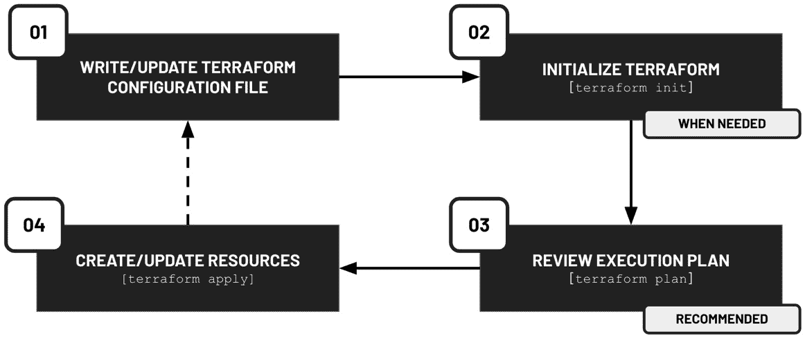

图 3.3 – 使用 Terraform 创建和更新资源时的常见工作流

一旦我们准备好了配置文件（或多个文件），我们只需运行 **terraform init** 来初始化 Terraform 环境。**terraform init** 命令通常在我们的环境尚未初始化时，或者需要下载额外的文件或插件时执行。接下来的步骤是使用 **terraform plan** 来处理配置代码并生成执行计划供我们审核。请注意，运行 **terraform plan** 命令不是必需的，但 *推荐* 执行。最后，我们可以使用 **terraform apply** 来实施执行计划中描述的更改。

注意

运行 **terraform init** 和 **terraform plan** 通常是 *安全* 的命令，因为（1）它们涉及 **幂等** 操作，（2）它们不会创建或修改任何基础设施资源。在这种情况下，幂等意味着多次执行这些命令将会有 *相同* 的结果，而不会产生意外的副作用。这使得它们非常适合用于安全地初始化和规划基础设施配置。

我们还可以使用其他命令来帮助我们执行特定任务（例如，**terraform show**），但除了这三个主要命令外，另一个我们需要了解的命令是 **terraform destroy**。运行此命令将删除通过 Terraform 创建和管理的资源。

## 使用 Hello World 示例测试我们的 Terraform 设置

现在我们已经对如何使用 Terraform 有了基本了解，接下来我们来做一个非常简单的 Terraform 示例，如下所示：

1.  使用 **mkdir** 命令创建一个 **hello_terraform** 目录。然后使用 **cd** 命令进入创建的目录：

    ```
    mkdir hello_terraform
    cd hello_terraform
    ```

1.  使用 **touch** 命令创建一个空的 **main.tf** 文件：

    ```
    touch main.tf
    ```

1.  运行以下命令使用 Vim 打开空的 **main.tf** 文件：

    ```
    vim main.tf
    ```

    学习如何使用命令行文本编辑器，如 Vim，起初可能会有些令人畏惧。然而，一旦你熟悉了它，你会发现 Vim 相对容易使用且富有乐趣！

注意

你可以输入 **:set nu** 然后按下 *Enter* 键来显示行号。

1.  接下来，按 *i* 切换到 **插入模式**，这样我们就可以编辑文件了。

注意

Vim 中的 **插入模式** 允许我们像在常规文本编辑器中一样输入和修改文本。在这个模式下，我们可以自由地添加、删除或修改字符，而不会影响周围的文本。

1.  将以下代码块输入或粘贴到我们的 **main.tf** 文件中：

    ```
     resource "null_resource" "hello" {
      provisioner "local-exec" {
        command = "touch hello.txt"
      }
    }
    ```

    在这里，我们声明了一个 **null_resource** 资源，它对于不涉及资源创建的操作和任务非常有用。在这个案例中，我们用它来运行一个脚本或命令。

1.  按下 *Esc* 键切换到 **正常模式**。输入 **:wq!**，然后按 *Enter*。这将保存对 **main.tf** 所做的更改，并退出 Vim。

注意

之前，我们描述了 Vim 中插入模式的工作原理。现在，让我们简要谈谈普通模式。**普通模式**允许我们在文本中导航、执行命令并对文件执行各种操作。在此模式下，可以使用特定的按键组合（如**:wq!**）来移动光标、搜索文本、复制和粘贴，并执行编辑操作，如删除、替换和撤销更改。例如，“**w**”表示*写入*命令（用于保存文件的更改），而“**q**”表示*退出*命令（用于退出编辑器）。感叹号（**!**）有什么用？“**!**”仅仅是一个可选修饰符，它强制命令执行，即使存在未保存的更改或其他警告。

1.  现在我们的**main.tf**文件已经准备好，让我们使用**terraform init**命令来初始化 Terraform 工作目录：

    ```
    terraform init
    ```

1.  为了更好地了解**terraform init**为我们初始化并设置了什么，让我们使用以下命令安装**tree**工具：

    ```
    sudo yum install tree -y
    ```

    安装了**tree**工具后，让我们使用**tree**命令帮助我们检查并可视化当前目录中的目录和文件：

    ```
    tree -a
    ```

    这应该生成一棵树，类似于我们在*图 3.4*中看到的内容：

    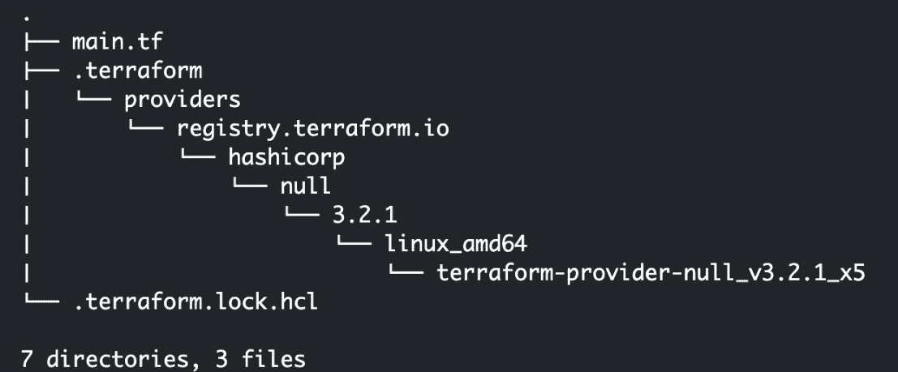

    图 3.4 – 运行 tree 命令后的结果

    在这里，我们可以看到在运行**terraform init**后，突然出现了一个**.terraform**目录，并且包含一个目录和文件的树状结构。

1.  接下来，让我们运行**terraform plan**，以预览 Terraform 将执行的更改：

    ```
    terraform plan
    ```

    这应该生成一组日志，类似于我们在下面的日志信息块中看到的内容：

    ```
    Terraform used the selected providers to generate the following execution plan. Resource actions are indicated with the following symbols:
      + create
    Terraform will perform the following actions:
      # null_resource.hello will be created
      + resource "null_resource" "hello" {
          + id = (known after apply)
        }
    Plan: 1 to add, 0 to change, 0 to destroy.
    ```

    在这里，我们有一个**执行计划**，它指示了在稍后的步骤中运行**terraform apply**命令后，将创建（**1**）、修改（**0**）或销毁（**0**）哪些资源。

注意

Terraform 的执行计划就像是一个蓝图，概述了它将执行的步骤和操作，以实现所需的基础设施状态（如 Terraform 配置代码中所定义的）。它类似于 SQL **EXPLAIN** 命令提供的详细分解，说明数据库管理系统如何执行特定查询。也就是说，考虑到 Terraform 通过其声明式语法抽象了幕后发生的事情，执行计划作为预览即将对基础设施进行的更改的有价值机制。

1.  一切准备就绪后，让我们使用**terraform apply**命令来实现通过运行**terraform plan**返回的执行计划中指定的更改：

    ```
    terraform apply
    ```

    这应该生成一组日志，类似于我们在*图 3.5*中看到的内容：

    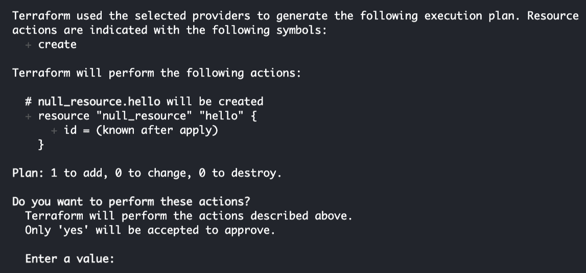

    图 3.5 – 运行 terraform apply 命令后的验证步骤

    在验证步骤中（即，当您看到**Enter a value:**提示时），输入**yes**以继续创建**hello.txt**文件。按下*Enter*键后，我们应该看到以下一组日志：

    ```
     null_resource.hello: Creating...null_resource.hello: Provisioning with 'local-exec'... null_resource.hello (local-exec): Executing: ["/bin/sh" "-c" "touch hello.txt"]
    null_resource.hello: Creation complete after 0s [id=2409621687302957875]
    ```

    在这里，我们可以看到我们的 **terraform apply** 命令已成功执行！

提示

运行 **terraform apply** 命令应执行 **touch hello.txt** 并创建一个空的 **hello.txt** 文件。

1.  在庆祝之前，让我们使用 **ls** 命令检查我们的 **hello.txt** 文件是否已经创建：

    ```
    ls
    ```

    这应该产生以下输出：

    ```
    hello.txt  main.tf  terraform.tfstate
    ```

1.  现在，让我们使用 **cat** 命令检查 **terraform.tfstate** 文件：

    ```
    cat terraform.tfstate
    ```

    这应该给我们一个类似于下面代码块的嵌套 JSON 结构：

    ```
    {
      "version": 4,
      "terraform_version": "1.3.9",
      "serial": 1,
      "lineage": "6e0599fb-00c6-e724-2dd1-e600ea7726a0",
      "outputs": {},
      "resources": [
        {
          "mode": "managed",
          "type": "null_resource",
          "name": "hello",
           ...     }
      ],
      "check_results": null
    }
    ```

    在这里，我们已经确认 Terraform 将表示当前基础设施资源集（由 Terraform 管理）的信息存储在 **terraform.tfstate** 文件中。

重要提示

Terraform 使用 **terraform.tfstate** 文件来跟踪基础设施的当前状态。该文件存储关键信息，例如资源 ID、依赖关系和元数据。在创建或修改基础设施资源之前，Terraform 会使用此文件进行差异检查。确保*不要*编辑或删除工作目录中的 **terraform.tfstate** 文件，因为这可能导致不一致和潜在的错误。万一你不小心删除了 **terraform.tfstate** 文件，不必惊慌，因为有多种方法可以从这种情况中恢复！此外，我们还可以使用 **远程状态后端** 来安全地存储状态文件，并使协作和灾难恢复更容易。我们将在本章的 *配置具有状态锁定的 Terraform 后端* 部分详细讨论这个内容。

1.  使用 **cd** 命令导航到用户的主目录：

    ```
    cd ..
    ```

1.  最后，让我们使用 **rm -rf** 命令删除 **hello_terraform** 目录（及其内部的所有内容）：

    ```
    rm -rf hello_terraform
    ```

    这将帮助释放一些空间，因为我们在 CloudShell 环境中总共有 1 GB 的存储空间（每个 AWS 区域）。请注意，建议在执行这些删除或清理步骤之前，先在 **hello_terraform** 目录中运行 **terraform destroy**（因为我们可能会不小心删除状态文件）。鉴于我们创建的唯一“基础设施资源”是一个 **.txt** 文件，因此不需要运行 **terraform destroy**。

重要提示

如果您需要一个专门的环境来创建和管理基础设施资源中使用 Terraform，您可以探索**AWS Cloud9**并设置开发环境。与 CloudShell（目前每个 AWS 地区仅为 1 GB）相比，这种环境提供更多的磁盘空间。此外，Cloud9 允许您使用代码编辑器编写和修改代码，提供了增强的灵活性和便利性。需要注意的是，虽然 AWS CloudShell 是 AWS 提供的免费服务，但 AWS Cloud9 可能会根据您的使用情况产生额外费用。虽然 CloudShell 提供了仅限于 1 GB 的有限磁盘空间，并且不收取额外费用。另一方面，AWS Cloud9 可能根据环境选择的使用情况和实例类型而产生相关费用。在选择 AWS Cloud9 之前，建议查看定价详细信息，并确保其符合您的要求和预算。

*这不是很简单吗？* 当学习 Terraform（或任何其他新工具）时，建议从类似于本节中我们所使用的简单和小型示例开始。在下一节中，我们将在这个简单示例的基础上继续工作，并处理一个相对较长的 Terraform 配置文件。

# 理解 Terraform 配置语言

在本节中，我们将深入探讨 Terraform 配置语言的核心方面，然后继续使用相对简单的配置代码，为我们提供管理 Terraform 的 IaC 所需的基础知识。

## 揭秘常用的 Terraform 配置块

理解如何编写和解释 Terraform 配置代码对于有效的基础设施管理至关重要。这些知识使我们能够自定义和修改使用 Terraform 创建和管理的现有基础设施资源。它还使我们能够在使用 IaC 工具时更有效地解决问题和节省时间。

*那么，我们从哪里开始呢？* 首先，简单和复杂的 Terraform 配置代码通常使用相同的元素和构建模块。这个共同的基础使我们能够通过从简单配置开始逐步向更复杂的场景发展来逐步建立我们的理解。通过掌握基本元素，我们可以自信地导航和解释简单和复杂的 Terraform 配置代码，从而有效地解决各种基础设施管理挑战。

在我们进行下一个实际操作示例之前，让我们快速查看一下在 Terraform 配置文件中通常会看到的一些元素：

+   **资源** — 这些是用来定义如何配置和配置基础设施资源的代码块。这些块具有以下结构：

    ```
    resource "<type>" "<name>" {
      <argument 01> = <value 01>
      <argument 02> = <value 02>
    }
    ```

    资源是通过一个或多个参数进行配置的，每个参数由一个键值对表示。根据正在创建的具体资源，参数可能包括区域、实例类型、子网 ID、安全组等内容。

    让我们快速看一个如何使用 Terraform 定义 Azure 公共 IP 地址资源块的例子：

    ```
    resource "azurerm_public_ip" "public_ip_03" {name= "public-ip-03"
      ...   resource_group_name = local.rg_02.nameallocation_method   = "Dynamic"
    }
    ```

    在这里，我们指定了各种属性，如从本地变量获取的资源组名称，以及分配方法设置为 **"动态"**。

+   **提供程序**—这些是插件，使得云平台和 SaaS API 交互成为可能。它们的结构如下：

    ```
    provider "<name>" {
      <argument 01> = <value 01>
      <argument 02> = <value 02>
    }
    ```

    提供程序可以包括 **云服务提供商**（**CSPs**），如 AWS、Azure 和 GCP，以及其他第三方提供商。根据使用的具体提供程序，参数可能包括访问密钥、区域和端点等内容。

    让我们快速看一个如何定义提供程序的例子：

    ```
    provider "aws" {
      alias  = "default"
      region = "us-east-1"
    }
    ```

    通过使用适当区域配置此提供程序，Terraform 将能够在指定区域内与 AWS 服务进行交互，用于资源的配置和管理。

+   **数据源**—这些是允许我们在运行时查询数据的元素。它们的结构如下：

    ```
    data "<type>" "<name>" {
      ... }
    ```

    数据源的配置取决于使用的具体数据源，可以包括查询、筛选条件和身份验证信息等内容。

    让我们快速看一个如何定义数据源的例子：

    ```
    data "aws_ip_ranges" "ec2_instance_connect" {
      regions  = ["us-east-1"]
      services = ["EC2_INSTANCE_CONNECT"]
    }
    ```

    通过这个数据块，我们可以获取指定区域内 AWS EC2 实例连接服务使用的 IP 范围的信息。

+   **本地值**—这些是代码块，允许我们分配和存储静态值以备后用。它们的结构如下：

    ```
    locals {
      <name 01> = <expression 01>
      <name 02> = <expression 02>
    }
    ```

    表达式可以是任何有效的 Terraform 表达式，包括其他变量或函数。通过这个代码块，我们可以轻松地在 Terraform 配置中定义本地变量，使我们的代码更加可读、易于维护和可重用。

    让我们看一个如何定义一些本地变量的例子：

    ```
    locals {
      net_01 = google_compute_network.vpc_01.self_linknet_02 = google_compute_network.vpc_02.self_link
    }
    ```

    在这里，我们简单地定义了两个本地变量（**net_01** 和 **net_02**），它们的值等于相应 **google_compute_network** 资源的 **self_link** 属性值。

+   **输入变量**—这些是代码块，允许用户指定动态值。它们的结构如下：

    ```
    variable "<name>" {
      type = <type>
      default = <value>
    }
    ```

    Terraform 中的变量用于参数化配置，使得代码可以在不同的场景或环境中重用。

    让我们快速看一个如何定义变量的例子：

    ```
    variable "instance_name" {
        type = string
        default = "kali"
    }
    ```

    这个变量可以在 Terraform 配置中使用，根据特定需求动态定制实例名称。

+   **输出值**—这些帮助返回和打印值，并在模块之间共享值。它们的结构如下：

    ```
    output "<name>" {
      value = <expression>
    }
    ```

    Terraform 中的输出用于定义在**terraform apply**操作完成后暴露给用户的值。该输出可以在配置的其他部分或使用当前模块作为依赖项的其他配置中引用。

    让我们快速看一个实际示例：

    ```
    output "vm_kali_public_ip" {
      value = local.vm_kali.public_ip_address
    }
    ```

    在这里，我们简单地定义一个输出块，以检索虚拟机（在 Azure 中）的公共 IP 地址。

虽然 Terraform 中确实有更多要考虑的元素，但我们讨论的这些元素应该足够了。随着你继续深入 Terraform，你可以探索更多的元素，扩展管理基础设施的能力。在我们已经建立的基础上，这些元素将进一步增强我们使用 Terraform 在云中创建各种渗透测试实验室的能力。

## 使用简单的 Terraform 配置

现在我们已经大致了解了在 Terraform 配置文件中会遇到哪些代码块，让我们继续看下一个示例：

1.  使用**mkdir**命令创建一个**basics**目录。然后使用**cd**命令进入创建的目录：

    ```
    mkdir basics && cd basics
    ```

1.  使用**touch**命令在**basics**目录中创建一个空的**main.tf**文件：

    ```
    touch main.tf
    ```

1.  运行以下命令以使用 Vim 打开空的**main.tf**文件：

    ```
    vim main.tf
    ```

注意

输入**:set nu**，然后按*Enter*键显示行号。

1.  接下来，按* i *键切换到**插入模式**，以便我们编辑文件。

注意

到此为止，你应该对如何使用 Vim 有了更好的了解。要切换到插入模式（假设我们当前处于普通模式），只需按* i *键。然后，要切换回普通模式，按*Esc*键。

1.  我们首先通过输入（或粘贴）以下代码块到我们的**main.tf**文件中来声明和配置 AWS 提供程序：

    ```
     terraform {
      required_providers {
        aws = {
          source  = "hashicorp/aws"
          version = "~> 4.0"
        }
      }
    }
    provider "aws" {
      alias  = "default"
      region = "us-east-1"
    }
    ```

    通过这段代码，Terraform 能够定位并使用指定版本和来源的 AWS 提供程序，以在指定区域（**us-east-1**）中配置和管理 AWS 资源。

注意

请注意，Terraform 会自动使用在 CloudShell 环境中配置的凭证。

1.  接下来，还需要添加以下代码：

    ```
    data "aws_canonical_user_id" "current" {}
    ```

    这将使我们能够访问运行 Terraform 的账户的 AWS 标准用户 ID（这是一个字母数字值，用于授予对 S3 存储桶和对象的访问权限）。

注意

**AWS 规范用户 ID**（即 AWS 账户 ID 的“混淆形式”）主要用于 Amazon S3 中与对象级访问控制相关的操作。当授予 S3 对象或存储桶的访问权限时，此 ID 用于指定谁拥有必要的权限。请注意，AWS 规范用户 ID 与 AWS 账户 ID 不同，后者是与每个 AWS 账户相关联的 12 位数字。有关更多信息，请查看以下链接：[`docs.aws.amazon.com/AmazonS3/latest/userguide/finding-canonical-user-id.html`](https://docs.aws.amazon.com/AmazonS3/latest/userguide/finding-canonical-user-id.html)。

1.  让我们也声明几个本地变量，如下所示：

    ```
     locals {
      user = data.aws_canonical_user_id.current
      name = local.user.display_name
    }
    ```

1.  最后，让我们添加以下代码，它将打印出我们正在使用的 AWS 账户的规范用户 ID 的 **display_name** 值：

    ```
     resource "null_resource" "debug" {
      provisioner "local-exec" {
        command = "echo NAME=${local.name}"
      }
    }
    ```

1.  按 *Esc* 键切换回正常模式。输入 **:wq!** 然后按 *Enter*。这将保存对 **main.tf** 文件所做的更改，并退出 Vim。

1.  现在，我们的 **main.tf** 文件已经准备好，让我们使用 **terraform init** 命令来初始化 Terraform 工作目录：

    ```
    terraform init
    ```

    这应该会产生类似于以下日志消息的日志输出：

    ```
    Initializing the backend... Initializing provider plugins... - Finding hashicorp/aws versions matching "~> 4.0"... - Finding latest version of hashicorp/null... - Installing hashicorp/null v3.2.1... - Installed hashicorp/null v3.2.1 (signed by HashiCorp)
    - Installing hashicorp/aws v4.57.0... - Installed hashicorp/aws v4.57.0 (signed by HashiCorp)
    ```

    在这里，我们可以看到相关的文件和二进制文件已经从 Terraform Registry 下载。

1.  让我们运行 **terraform plan** 来预览 Terraform 将执行的更改：

    ```
    terraform plan
    ```

1.  使用 **terraform apply** 命令来实施在运行 **terraform plan** 后返回的执行计划中的更改：

    ```
    terraform apply -auto-approve
    ```

    请注意，这次我们使用了 **-auto-approve** 标志来跳过验证步骤，类似于上一节中遇到的情况。运行该命令应产生以下输出：

    ```
    Plan: 1 to add, 0 to change, 0 to destroy. null_resource.debug: Creating... null_resource.debug: Provisioning with 'local-exec'... null_resource.debug (local-exec): Executing: ["/bin/sh" "-c" "echo NAME=john.doe"]
    null_resource.debug (local-exec): NAME=john.doe null_resource.debug: Creation complete after 0s [id=6076855428035859265]
    ```

    *这里发生了什么？* 代码只是执行了一个命令，打印出 **name** 本地值（即规范用户的显示名称）的值。

重要注意事项

我们可以看到，当使用 **terraform apply -auto-approve** 命令时，**-auto-approve** 标志允许在没有用户确认的情况下自动批准并执行计划的更改。**-auto-approve** 标志在非交互或自动化场景中非常有用，因为它消除了手动干预的需要。然而，使用 **-auto-approve** 标志时必须谨慎，因为它跳过了确认提示，且更改会立即应用。因此，在使用 **-auto-approve** 执行 **terraform apply** 之前，务必仔细审核 Terraform 代码和更改，以避免对基础设施进行不必要的修改。

1.  现在，让我们对 **main.tf** 文件进行小幅修改。再次运行以下命令，使用 Vim 打开空的 **main.tf** 文件：

    ```
    vim main.tf
    ```

注意

您可以输入 **:set nu** 然后按 *Enter* 键来显示行号。

1.  接下来，按 *i* 切换到 **插入模式**，以便我们可以编辑文件。

1.  使用箭头键定位以下行：

    ```
     command = "echo NAME=${local.name}"
    ```

    一旦找到前面的代码块中的这一行，替换为以下内容：

    ```
    command = "echo ID=${local.user.id}"
    ```

    在这里，我们计划在后续步骤中运行**terraform apply**命令时，打印并记录 ID（而不是**display_name**值）。

1.  按下*Esc*键以切换回正常模式。输入**:wq!**然后按*Enter*键。这将保存对**main.tf**所做的更改，并退出 Vim。

1.  在运行**terraform plan**命令之前，我们先运行**terraform fmt**来格式化我们的 Terraform 代码：

    ```
    terraform fmt
    ```

    在这里，我们使用**terraform fmt**来确保所有 Terraform 配置文件遵循一致的编码风格。此命令会扫描 Terraform 配置文件，调整缩进、间距和换行符，以符合官方的 Terraform 风格指南。

注意

**terraform fmt**命令会自动调整代码块、语句和表达式的缩进，以确保对齐一致。它通常为每一级缩进使用两个空格。除此之外，命令还会添加或删除空格，以保持操作符、冒号、逗号及其他元素周围的间距一致。例如，它会确保在变量赋值的等号前后都有空格。类似地，它会插入或删除换行符，通过在资源块或变量声明之间插入换行符来提高可读性，使代码更加结构化。**terraform fmt** 还会进行一些其他格式调整，但这些调整应该足够了。

1.  现在，让我们运行**terraform plan**以预览 Terraform 将要执行的更改：

    ```
    terraform plan
    ```

    这应该会生成以下输出：

    ```
    No changes. Your infrastructure matches the configuration. Terraform has compared your real infrastructure against your configuration and found no differences, so no changes are needed.
    ```

    似乎在更改提供程序命令时未能检测到变化！

注意

在这里，Terraform 应该在修改资源块中的提供程序命令时检测到变化。然而，在某些情况下，修改提供程序命令可能不会被基础设施即代码（IaC）工具识别为修改。因此，Terraform 可能不会执行更新后的提供程序命令，可能导致部署的基础设施出现不一致。有关此主题的更多信息，请随时查看以下链接：[`github.com/hashicorp/terraform/issues/14405`](https://github.com/hashicorp/terraform/issues/14405)。

1.  要强制替换已创建的资源，我们可以在运行**terraform** **apply**命令时使用**-replace**标志：

    ```
    terraform apply -auto-approve \
    -replace=null_resource.debug
    ```

    这应该会生成以下日志：

    ```
    null_resource.debug: Destroying... [id=6076855428035859265]
    null_resource.debug: Destruction complete after 0s
    null_resource.debug: Creating... null_resource.debug: Provisioning with 'local-exec'... null_resource.debug (local-exec): Executing: ["/bin/sh" "-c" "echo ID=abcdefghabcdefghabcdefghabcdefghabcdefghabcdefgh"]
    null_resource.debug (local-exec): ID=abcdefghabcdefghabcdefghabcdefghabcdefghabcdefgh null_resource.debug: Creation complete after 0s [id=9009508010716198837]
    ```

    在这里，我们可以看到 ID 值在运行**terraform** **apply**命令后被记录了下来。

注意

*这里发生了什么？* 在这里，我们指示 Terraform 自动应用更改，而无需用户确认，特别是替换**null_resource.debug**资源。**-replace=null_resource.debug**参数专门定位**null_resource.debug**资源，表示它应在**apply**操作期间被替换。

1.  使用**cd**命令导航到用户的主目录：

    ```
    cd ..
    ```

1.  最后，使用 **rm -rf** 命令删除 **basics** 目录（以及其中的所有内容）：

    ```
    rm -rf basics
    ```

    这样可以腾出一些空间，因为我们需要管理 CloudShell 环境中的可用空间。

恭喜完成我们的第二个 Terraform 示例！此时，我们应该已经具备了处理更复杂 Terraform 代码所需的信心。

# 使用 Terraform 构建我们的易受攻击实验室环境

本章的前几节帮助我们更好地理解了 Terraform 的工作原理。我们通过了相对简单的示例，现在是时候开始处理一个更完整、现实的示例了！也就是说，我们将使用 Terraform 自动创建和配置我们在 *第二章* 中手动准备的易受攻击的实验室环境，*准备我们的第一个易受攻击的云实验室环境*。通过利用 Terraform，我们应该能够简化设置我们之前手动准备的易受攻击实验室环境的过程。

注意

*在* *第二章**发生了什么？* 在 *第二章* 中，我们通过 AWS 管理控制台手动创建了一个空的 S3 存储桶，并将其配置为静态网站托管。然后，我们修改了存储桶的访问控制设置，允许经过身份验证的 AWS 用户列出并检索对象。为了完成设置，我们将示例文件上传到 S3 存储桶。

也就是说，本节由四个子部分组成，如下所示：

+   *使用 Terraform 创建 S3 存储桶*

+   *更新 S3 存储桶的安全配置*

+   *上传文件到* *S3 存储桶*

+   *清理并删除* *S3 存储桶*

事不宜迟，让我们开始吧！

## 第一部分 / 共 4 部分 – 使用 Terraform 创建 S3 存储桶

继续前一节的内容，让我们使用 **mkdir** 命令创建一个 **basics** 目录，然后按以下步骤操作：

1.  使用 **cd** 命令导航到已创建的目录：

    ```
    mkdir vulnerable_s3_lab
    cd vulnerable_s3_lab
    ```

1.  使用 **touch** 命令在 **vulnerable_s3_lab** 目录中创建一个空的 **main.tf** 文件：

    ```
    touch main.tf
    ```

1.  运行以下命令使用 Vim 打开空的 **main.tf** 文件：

    ```
    vim main.tf
    ```

注意

你可以输入 **:set nu** 然后按 *Enter* 键来显示行号。

1.  接下来，按 *i* 切换到 **插入模式**，这样我们就可以编辑文件了。

1.  在我们的 **main.tf** 文件中键入或粘贴以下代码块：

    ```
     terraform {
      required_providers {
        aws = {
          source  = "hashicorp/aws"
          version = "~> 4.0"
        }
      }
    }
    provider "aws" {
      alias  = "default"
      region = "us-east-1"
    }
    ```

1.  接下来，让我们通过添加以下代码块来声明一个 **aws_s3_bucket** 资源：

    ```
     resource "aws_s3_bucket" "bucket" {
      bucket = "<INSERT BUCKET NAME>"
      force_destroy = true
    }
    ```

    确保将 **<INSERT BUCKET NAME>** 替换为一个全球唯一的存储桶名称。如果你想知道 **force_destroy** 的作用，它只是允许我们在后续步骤中删除 S3 存储桶及其所有对象，而不会遇到问题。

注意

如需了解如何命名 S3 存储桶的指南和规则，欢迎查看以下链接：[`docs.aws.amazon.com/AmazonS3/latest/userguide/bucketnamingrules.html`](https://docs.aws.amazon.com/AmazonS3/latest/userguide/bucketnamingrules.html)。

1.  按*Esc*键切换回正常模式。输入**:wq!**，然后按*Enter*键。这将保存对**main.tf**文件所做的更改，并退出 Vim。

1.  现在我们的**main.tf**文件已准备好，让我们使用**terraform init**命令初始化 Terraform 工作目录：

    ```
    terraform init
    ```

1.  接下来，让我们运行**terraform plan**来预览 Terraform 将执行的更改：

    ```
    terraform plan
    ```

    这应该会生成一组日志，类似于我们在*图 3.6*中看到的内容：

    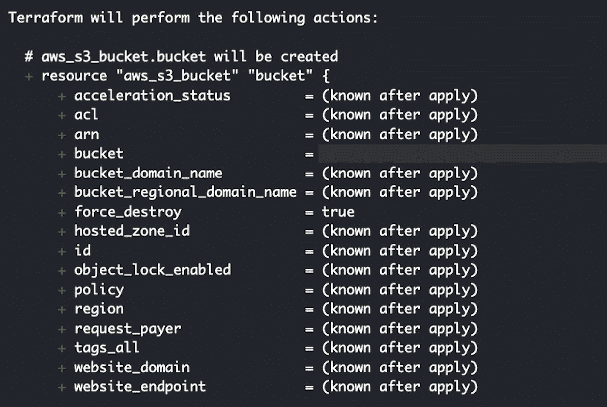

    图 3.6 - 运行 terraform plan 命令后生成的日志

    在这里，我们可以看到某些属性的值只有在执行**terraform apply**命令后才会知道（也就是说，当资源被创建时）。

注意

了解某些属性值只有在执行**terraform apply**命令后才会确定，这是至关重要的。属性值的这种动态特性使得 Terraform 能够准确反映资源创建后的状态。

1.  使用**terraform apply**命令来实现执行计划中指定的更改，该计划在运行**terraform plan**后返回：

    ```
    terraform apply -auto-approve
    ```

    这应该会生成一组日志，显示我们已成功创建 S3 桶。

注意

随时使用**terraform show**检查我们 S3 桶的当前配置设置。

1.  在我们庆祝之前，让我们运行以下命令，验证 S3 桶是否已成功创建：

    ```
     aws s3 ls | grep <INSERT BUCKET NAME>
    ```

    确保将**<INSERT BUCKET NAME>**替换为在**main.tf**文件中指定的桶名称（来自本节前面的步骤）。这应该会生成一个格式如下的输出：

    ```
    <DATE> <TIME> <INSERT BUCKET NAME>
    ```

    如果你指定的桶名称是**vuln-s3-abcdef-12345**，我们应该得到一个类似于**2023-10-01** **12:00:00 vuln-s3-abcdef-12345**格式的输出。

## 第二部分，共 4 部分 - 更新 S3 桶的安全配置

我们才刚刚开始！在接下来的步骤中，我们将学习如何更新安全配置：

1.  现在，让我们运行以下命令，再次使用 Vim 打开**main.tf**文件：

    ```
    vim main.tf
    ```

注意

你可以输入**:set nu**，然后按*Enter*键以显示行号。

1.  接下来，按住*Shift*键，然后按*g*键跳转到最后一行。之后按*o*键。这应该会在当前行之后插入新的一行（并切换到**插入模式**）。

1.  现在我们处于插入模式，接下来添加以下代码块，以指定 S3 桶的公共访问阻止配置：

    ```
     resource "aws_s3_bucket_public_access_block" "bucket" {
      bucket = aws_s3_bucket.bucket.id
      block_public_acls       = false
      block_public_policy     = false
      ignore_public_acls      = false
      restrict_public_buckets = false
    }
    ```

    在这里，**block_public_acls**、**block_public_policy**、**ignore_public_acls**和**restrict_public_buckets**属性被设置为**false**。这意味着 S3 桶不会阻止公共**访问控制列表**（**ACLs**）或公共策略，不会忽略公共 ACLs，并且不会限制公共桶。

1.  我们还可以添加以下内容，以指定 S3 桶的所有权控制：

    ```
     resource "aws_s3_bucket_ownership_controls" "bucket" {
      bucket = aws_s3_bucket.bucket.id
      rule {
        object_ownership = "ObjectWriter"
      }
    }
    ```

    所有权控制设置为**ObjectWriter**。这确保了只有上传对象的**身份与访问管理**（**IAM**）用户或角色才能修改存储桶中的对象。

1.  接下来，让我们通过添加以下代码块来配置 S3 存储桶以进行**静态网站托管**：

    ```
     resource "aws_s3_bucket_website_configuration" "bucket" {
      bucket = aws_s3_bucket.bucket.bucket
      index_document {
        suffix = "index.html"
      }
    }
    ```

1.  让我们也定义一个**aws_iam_policy_document**数据源块：

    ```
     data "aws_iam_policy_document" "policy" {
      statement {
        sid = "SampleStatement"
        principals {
          type        = "AWS"
          identifiers = ["*"]
        }
        actions = [
          "s3:GetObject"
        ]
        resources = [
          "${aws_s3_bucket.bucket.arn}/*"
        ]
      }
    }
    ```

    代码块中描述的策略授予 AWS 主体（即*任何*AWS 账户或 IAM 用户）执行**s3:GetObject**操作的权限，作用于 S3 存储桶中的对象。**resources**属性指定了 S3 存储桶的**Amazon 资源名称**（**ARN**），后跟一个通配符字符（*****），以允许访问存储桶中的所有对象。

注意

如果你在想数据源块是什么，它只是一个我们可以读取数据的资源。它允许我们从现有资源或外部系统中检索信息。此外，它充当一个*只读*参考，提供可用于配置的有价值数据。我们将在接下来的步骤中看到数据源块的使用。

1.  让我们还定义**s3_policy**和**au_uri**本地变量，这些变量将在随后的配置块中使用：

    ```
     locals {s3_policy = data.aws_iam_policy_document.policyau_uri = "http://acs.amazonaws.com/groups/global/AuthenticatedUsers"
    }
    ```

1.  接下来，使用以下代码块定义一个**aws_s3_bucket_policy**资源：

    ```
     resource "aws_s3_bucket_policy" "allow_access_policy" {
      bucket = aws_s3_bucket.bucket.id
      policy = local.s3_policy.json
    }
    ```

1.  让我们再定义另一个数据源块，如下所示：

    ```
     data "aws_canonical_user_id" "current" {}
    ```

注意

这是本章前一部分中使用的相同数据源块。如果你不记得这个是用来做什么的，这个数据源块将让我们访问运行 Terraform 时使用的账户的 AWS 规范用户 ID。

1.  让我们还定义一个**aws_s3_bucket_acl**资源，用于设置 S3 存储桶的 ACL 配置设置：

    ```
     resource "aws_s3_bucket_acl" "bucket_acl" {
      bucket = aws_s3_bucket.bucket.id
      access_control_policy {grant {grantee {
            id   = data.aws_canonical_user_id.current.id
            type = "CanonicalUser"
          }permission = "FULL_CONTROL" }grant {grantee {
            type = "Group"
            uri  = local.au_uri
          }permission = "READ" }
        owner {
          id = data.aws_canonical_user_id.current.id
        }
      }
    }
    ```

    这个代码块配置了 S3 存储桶的 ACL。**aws_s3_bucket_acl**资源为两个授权设置了权限：一个是授予具有**FULL_CONTROL**权限的规范用户，另一个是授予具有**READ**权限的组。这里，**data.aws_canonical_user_id**数据源返回第一个授权人的规范用户 ID。而**local.au_uri**本地值则返回第二个授权人的 URI（指向一个名为**AuthenticatedUsers**的 AWS 预定义组）。

注意

你可能已经注意到，我们的**main.tf**文件变长了。需要注意的是，我们可以将资源划分到不同的文件中并进行分组。当工作目录中有多个**.tf**文件时，Terraform 会将这些文件简单地连接起来并继续执行它的常规基础设施管理操作。我们在本章中不会深入讨论这些策略和最佳实践，因为我们将在本书接下来的章节中介绍这些内容，同时构建多个 AWS、Azure 和 GCP 中的渗透测试实验室环境。

1.  按下*Esc*键切换回正常模式。键入**:wq!**，然后按*Enter*。这将保存对**main.tf**所做的更改，并退出 Vim。

1.  在运行**terraform plan**命令之前，让我们运行**terraform fmt**来格式化我们的 Terraform 代码：

    ```
    terraform fmt
    ```

    在这里，我们使用**terraform fmt**来确保我们的 Terraform 配置文件采用一致的编码风格。通过分析文件，此命令调整缩进、间距和换行符，以符合指定的 Terraform 风格指南。

1.  现在，让我们运行**terraform plan**预览 Terraform 将执行的更改：

    ```
    terraform plan
    ```

    这应该生成类似于*图 3**.7*中的执行计划：

    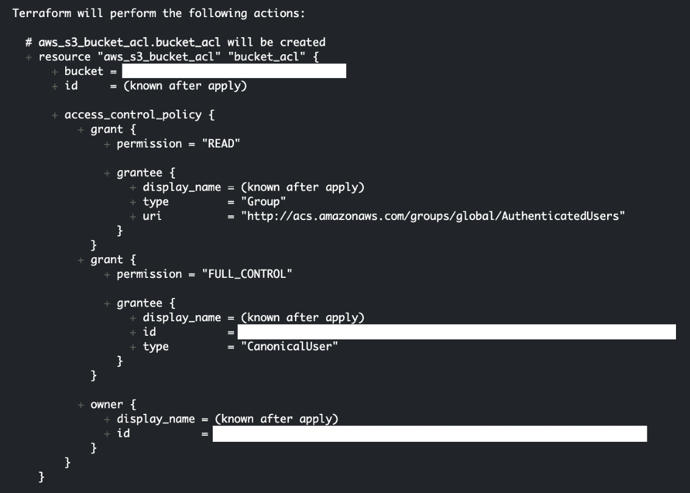

    图 3.7 – 运行 terraform plan 命令后的结果

    在这里，我们可以看到执行计划现在包括了我们的 S3 存储桶安全配置设置的更新。

1.  一切准备就绪，让我们运行**terraform** **apply**命令：

    ```
    terraform apply -auto-approve
    ```

注意

如果您遇到运行**terraform apply -auto-approve**时出现问题，请随时重新运行相同的命令，这可能会自动解决这些问题，而无需修改 Terraform 代码。例如，如果遇到“**Error putting S3 policy: AccessDenied: Access Denied**”错误消息，请简单地再次运行**terraform apply -auto-approve**。请注意，解决问题的另一种方法是首先使用**terraform destroy -auto-approve**删除资源，然后再使用**terraform apply -auto-approve**创建资源。

1.  现在，让我们验证是否已应用桶的 ACL 配置，使用以下命令：

    ```
     aws s3api get-bucket-acl --bucket=<INSERT BUCKET NAME>
    ```

    确保用您的 S3 存储桶的名称替换**<INSERT BUCKET NAME>**。

    运行命令后，我们应该会得到一个类似于*图 3**.8*的 JSON 响应：

    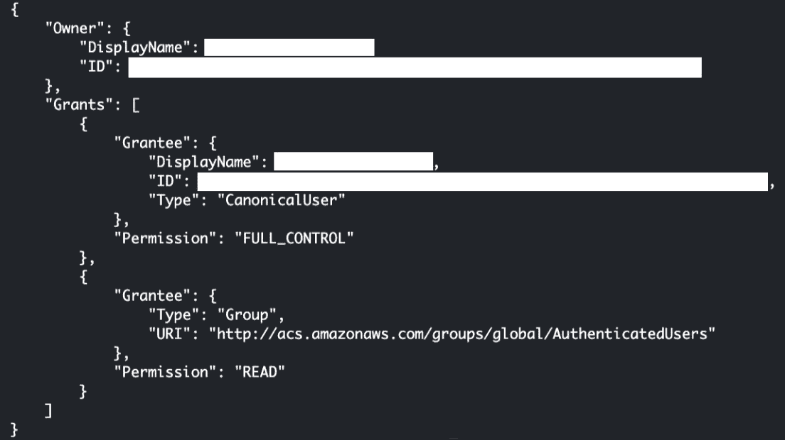

    图 3.8 – 运行 aws s3api get-bucket-acl 命令后返回的结果

    在这里，我们可以看到新的 ACL 配置设置已应用到我们的 S3 存储桶。

## 第三部分共 4 部分 – 向 S3 存储桶上传文件

接下来，让我们按以下方式向之前创建的 S3 存储桶添加文件：

1.  使用**touch**命令创建空的**upload.sh**文件：

    ```
    touch upload.sh
    ```

1.  要使**upload.sh 脚本**文件可执行，请运行以下命令：

    ```
    chmod +x upload.sh
    ```

1.  运行以下命令打开空的**upload.sh**文件，使用 Vim：

    ```
    vim upload.sh
    ```

注意

输入**：set nu**然后按*Enter*键显示行号。

1.  按*i*切换到**插入模式**，以便我们可以编辑**upload.sh**文件。

1.  现在我们处于插入模式中，让我们继续添加以下代码块：

    ```
     mkdir files
    cd files
    SOURCE=https://github.com/PacktPublishing/Building-and-Automating-Penetration-Testing-Labs-in-the-Cloud/raw/main/ch03/sample_website.zip wget $SOURCE -O sample_website.zip
    unzip sample_website.zip
    rm sample_website.zip
    aws s3 cp --recursive . s3://$1
    ```

    此一组命令简单地 (1) 从 GitHub 存储库下载一个 ZIP 文件，其中包含一个示例网站，并且 (2) 将其内容上传到 Amazon S3 存储桶。确保**SOURCE**变量值正确，通过删除任何额外的空格并检查是否可以直接通过浏览器访问下载链接来验证。

注意

这是在*第二章*中使用的相同一组终端命令，*准备我们的第一个易受攻击的云实验室环境*，用于将文件上传到我们的 S3 存储桶。

1.  按*Esc*键切换回正常模式。输入**:wq!**并按*Enter*键。这将保存对**upload.sh**所做的更改并退出 Vim。

1.  运行以下命令使用 Vim 打开**main.tf**文件：

    ```
    vim main.tf
    ```

1.  按住*Shift*键，然后按*g*键跳转到最后一行。之后按*o*键。这将会在当前行之后插入一个新行（并切换到**插入模式**）。

1.  在上一步插入的新行之后，添加以下代码块：

    ```
     resource "null_resource" "s3_upload" {
      provisioner "local-exec" {
        command = "./upload.sh ${aws_s3_bucket.bucket.id}"
      }
    }
    ```

    在这里，**provisioner**块指定将使用**local-exec**提供者，**command**属性指定要执行的 shell 命令，在此情况下为名为**upload.sh**的 shell 脚本。

注意

请注意，在前面的代码块中，提供者代码也可以放在**aws_s3_bucket**资源块内，或者放在其他资源块中（只需做一些小修改即可使其工作）。有关**local-exec**提供者的更多信息，请随时查看以下链接：[`developer.hashicorp.com/terraform/language/resources/provisioners/local-exec`](https://developer.hashicorp.com/terraform/language/resources/provisioners/local-exec)。

1.  按*Esc*键切换回正常模式。输入**:wq!**并按*Enter*键。这将保存对**main.tf**所做的更改并退出 Vim。

1.  现在，让我们运行**terraform plan**来预览 Terraform 将要执行的变更：

    ```
    terraform plan
    ```

    这应该会给我们类似于*图 3.9*中所示的错误消息：

    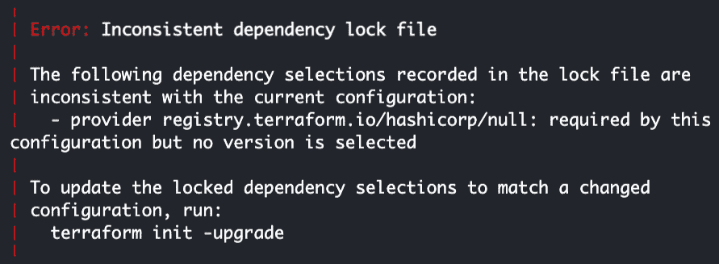

    图 3.9 – 不一致的依赖锁定文件错误

    Terraform 中的**Inconsistent dependency lock file**错误通常发生在依赖关系锁定文件与配置文件不匹配时。这种不一致可能是由于对配置做了更改，但没有相应地更新锁定文件所导致的。因此，为了解决**Inconsistent dependency lock file**错误，我们可以再次使用以下命令：

    ```
    terraform init
    ```

    这将同步锁定文件与配置，解决任何不一致之处，并确保 Terraform 部署的依赖关系一致。

1.  接下来，让我们运行**terraform plan**来预览 Terraform 将要执行的变更：

    ```
    terraform plan
    ```

    这次你应该看到命令执行成功。

1.  一切准备好后，让我们使用**terraform apply**命令来实现运行**terraform plan**后返回的执行计划中指定的更改：

    ```
    terraform apply -auto-approve
    ```

    这应该会运行**upload.sh**脚本中编码的命令。

1.  让我们通过运行**aws s3 ls**命令进行一些快速检查，如下所示：

    ```
     aws s3 ls s3://<INSERT BUCKET NAME>
    ```

    这应该会列出我们 S3 桶中存储的对象。

注意

在运行命令之前，请确保将**<INSERT BUCKET NAME>**替换为你的 S3 桶名称。

1.  现在，让我们使用**aws s3api get-bucket-website**命令来检查静态网站托管配置：

    ```
     aws s3api get-bucket-website --bucket <INSERT BUCKET NAME>
    ```

    确保将**<INSERT BUCKET NAME>**替换为**main.tf**文件中指定的桶名称（来自本节前面的步骤）。这应该返回以下输出：

    ```
    {
        "IndexDocument": {
            "Suffix": "index.html"
        }
    }
    ```

    这确认了为指定 S3 桶正确设置了静态网站托管配置。

1.  我们还可以通过访问以下链接来检查我们的静态网站托管设置是否有效：

    ```
     http://<BUCKET NAME>.s3-website.<REGION>.amazonaws.com
    ```

    确保将**<BUCKET NAME>**替换为我们创建的 S3 桶的名称。别忘了将**<REGION>**替换为 S3 桶创建所在的区域（例如，**us-east-1**）。

    如果一切顺利，我们应该能看到类似*图 3.10*所示的维护页面：


图 3.10 – 验证静态网站托管设置是否生效

注意

此时，类似于我们在*第二章*中准备的易受攻击实验环境（*准备我们的第一个易受攻击云实验环境*），已经准备就绪！可以随意按照*第二章*中*测试和黑客攻击我们的第一个易受攻击环境*部分的步骤测试我们实验环境的安全配置（在这里我们需要第二个 AWS 账户）。

## 第四部分 共 4 部分 – 清理并删除 S3 桶

在结束本节之前，让我们进行清理！请按照以下步骤操作：

1.  使用**terraform destroy**来清理我们之前创建的资源：

    ```
    terraform destroy
    ```

    在验证步骤（即，当你看到**Enter a value:**提示时），输入**yes**继续删除资源。资源删除后，会在同一目录中生成一个包含状态文件属性副本的备份文件（**terraform.tfstate.backup**）。

1.  你可以使用**less**或**cat**命令来检查存储在**terraform.tfstate.backup**文件中的属性。或者，我们可以使用**terraform show**命令读取**terraform.tfstate.backup**文件的内容：

    ```
    terraform show terraform.tfstate.backup
    ```

    这应该会产生类似于*图 3.11*的输出：

    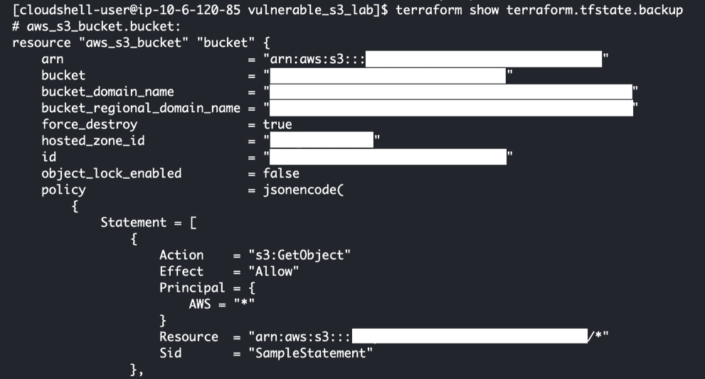

    图 3.11 – 运行 terraform show 后的输出

    如果你有冲动使用**terraform show**将状态文件转换为配置文件（类似于我们在**main.tf**文件中编写的内容），那么需要注意的是，我们在*图 3.11*中的输出并不是为了直接程序化使用（它主要是供我们人类排查故障和检查存储在文件中的状态）。

注意

如果使用**terraform show**（不带任何额外参数），我们应该得到一个空响应，因为资源已经在此时通过**terraform destroy**被删除。

哇！我们成功地将*【第二章】(B19755_02.xhtml)*中的手动步骤转换成了一个配置文件。此时，如果我们想要创建 10 个 S3 桶的克隆（所有资源具有相同的属性和配置设置，除了桶名称），我们只需对现有配置进行少许修改，然后使用 Terraform 自动创建和配置 S3 资源。

# 配置带状态锁定的 Terraform 后端

本节将探讨 Terraform 远程后端的工作原理，并了解状态锁定如何确保在管理基础设施部署时，基础设施状态的完整性和一致性。接着，我们将深入研究配置远程后端以启用状态锁定的逐步过程。

## 理解 Terraform 远程后端

到目前为止，我们一直在使用默认的**本地后端**，它将状态存储为本地文件（即**terraform.tfstate**文件）。当只有一个工程师参与时，这种配置应该是可以的。一旦另一位工程师希望使用 Terraform 对相同的资源集应用配置更改，使用**远程后端**将更加合理，因为第二位工程师需要访问现有的状态文件（由第一位工程师使用）。此外，我们需要确保同一资源集的配置更改不会同时应用，以防止**竞争条件**，这可能导致状态损坏。

使用 Terraform 时的最佳实践之一是使用外部远程后端来存储和锁定状态（类似于*图 3.12*所示）：

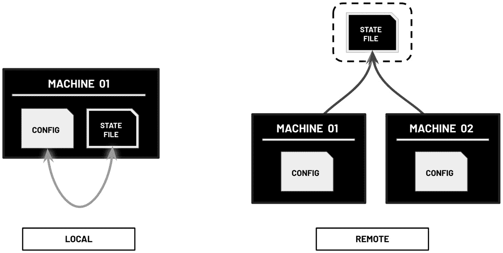

图 3.12 – 本地后端与远程后端

这允许多位工程师在同一资源集上工作，而无需担心破坏设置。配置正确的后端至关重要，因为 Terraform 后端决定了状态的加载方式，这反过来会影响资源的创建和修改过程。

注意

精心选择和配置后端可以确保安全协作、版本控制和整个基础设施生命周期中的正确状态管理。这增强了 Terraform 工作流的可靠性和可扩展性，特别是对于在相同资源集上工作的团队。欲了解更多信息，请随时查看以下链接：[`developer.hashicorp.com/terraform/language/settings/backends/configuration`](https://developer.hashicorp.com/terraform/language/settings/backends/configuration)。

话虽如此，为了解决协作中的挑战并防止潜在的冲突，建议将 Terraform 的默认本地后端切换到远程后端。通过使用远程后端，如 S3 存储桶，多个工程师可以安全地访问和修改同一个状态文件。这有助于协调，并确保在对共享资源进行配置更改时的一致性。此外，使用远程后端有助于缓解竞争条件的风险，因为它提供了一个集中式的机制来管理和锁定状态，从而降低了遇到损坏状态的可能性。

## 配置 Terraform 远程后端

**状态锁定** 在避免冲突和竞争条件方面起着至关重要的作用。通过允许每次只有一个用户或进程修改状态，它确保了 Terraform 部署中的完整性和同步性。此机制对于维护数据一致性和防止在协作的基础设施管理过程中发生不必要的更改至关重要。

在 AWS 云环境中配置 Terraform 后端的状态锁定时，通常会使用 S3 存储桶和 DynamoDB 表。S3 存储桶作为 Terraform 状态文件的安全存储，而 DynamoDB 表则充当分布式锁机制。通过状态锁定，只有一个 Terraform 命令能够在任何时刻持有锁，其他命令则等待直到锁被释放。此设置确保一致性，并防止在协作或自动化的 Terraform 环境中发生冲突。我们将把 S3 存储桶标记为 **BACKEND_S3**，DynamoDB 表标记为 **BACKEND_TABLE**，因为我们将在本章中多次引用这些资源。请注意，**BACKEND_S3** 和 **BACKEND_TABLE** 只是我们在本章中使用的任意标签，目的是方便我们引用将在接下来的步骤中创建的资源。也就是说，这些标签与云基础设施资源的实际名称不同。

注意

如果你在想 DynamoDB 是什么，它是 AWS 中完全托管的 NoSQL 数据库服务。在 DynamoDB 中，表由项目和属性组成。每个项目代表一条独立的数据，类似于传统数据库中的一行。项目由属性组成，属性是存储实际数据的键值对。需要注意的是，DynamoDB 表不要求固定的模式，这意味着每个项目可以有不同的属性集合。为了实现分布式锁机制，Terraform 通过创建一个唯一的项目或记录作为锁指示符，利用 DynamoDB 表。当 Terraform 命令尝试获取锁时，它会检查指定的项目是否存在。如果项目不存在，该命令会将项目添加到 DynamoDB 表中，表示它已获取锁。这可以防止其他 Terraform 命令同时获取锁。

在接下来的步骤中，我们将通过配置 Terraform 后端来存储和锁定状态，从而升级我们的设置：

1.  使用 **cd** 命令导航到主目录，如下所示：

    ```
    cd ~
    ```

1.  让我们使用 **mkdir** 命令创建一个 **backend** 目录。创建好 **backend** 目录后，使用 **cd** 命令导航到该目录：

    ```
    mkdir backend && cd backend
    ```

1.  接下来，使用 **touch** 命令在 **backend** 目录中创建一个空的 **main.tf** 文件：

    ```
    touch main.tf
    ```

1.  运行以下命令使用 Vim 打开空的 **main.tf** 文件：

    ```
    vim main.tf
    ```

注意

你可以输入 **:set nu**，然后按 *Enter* 键来显示行号。

1.  接下来，按 *i* 键切换到 **插入模式**，这样我们就可以编辑文件了。

1.  将以下代码块添加到我们的 **main.tf** 文件中：

    ```
     terraform {
      required_providers {
        aws = {
          source  = "hashicorp/aws"
          version = "~> 4.0"
        }
      }
    }
    provider "aws" {
      alias  = "default"
      region = "us-east-1"
    }
    ```

1.  接下来，让我们定义一个 *新的* **aws_s3_bucket** 资源（用于后端）。请注意，这个 S3 存储桶资源与我们在脆弱实验环境中使用的配置错误的 S3 存储桶不同：

    ```
     resource "aws_s3_bucket" "remote_state" {
      bucket = "<INSERT S3 BACKEND BUCKET NAME>"
      lifecycle {
        prevent_destroy = true
      }
    }
    ```

    在这里，**lifecycle** 块包括一个将 **prevent_destroy** 属性设置为 **true** 的配置，确保存储桶不会被意外销毁。这意味着存储在该存储桶中的 Terraform 状态文件被保护，不会被意外删除。

重要说明

确保将 **<INSERT S3 BACKEND BUCKET NAME>** 替换为一个唯一的 S3 存储桶名称（例如，**tf-remote-backend-abcdef-<random string>**）。请注意，此时该存储桶应当 *还不存在*，因为我们还没有执行 **terraform** **apply** 命令。

1.  现在，让我们添加以下代码块，以启用 **存储桶版本控制** 并为我们的 S3 存储桶配置 **服务器端加密**：

    ```
     resource "aws_s3_bucket_versioning" "versioning" {
      bucket = aws_s3_bucket.remote_state.id
      versioning_configuration {
        status = "Enabled"
      }
    }
    resource "aws_s3_bucket_server_side_encryption_configuration" "encryption" {
      bucket = aws_s3_bucket.remote_state.id
      rule {
        apply_server_side_encryption_by_default {
          sse_algorithm     = "aws:kms"
        }
      }
    }
    ```

    在这里，为 S3 存储桶启用了存储桶版本控制和服务器端加密，这将用于存储 Terraform 的远程状态。版本控制确保保留远程状态的先前版本，从而在意外删除或损坏的情况下可以轻松恢复。另一方面，服务器端加密确保远程状态中的敏感数据在静态时被加密，以增加额外的安全层。

1.  接下来，让我们使用以下代码块定义一个 **aws_dynamodb_table** 资源（使用我们的 S3 存储桶名称作为 DynamoDB 表的名称）：

    ```
     resource "aws_dynamodb_table" "state_lock" {
      hash_key = "LockID"
      name = "${aws_s3_bucket.remote_state.id}"
      attribute {
        name = "LockID"
        type = "S"
      }
      billing_mode = "PAY_PER_REQUEST"
    }
    ```

    在这里，**billing_mode** 设置为 **"PAY_PER_REQUEST"**，这意味着 (1) 我们只为对表的读写请求付费，(2) 没有预付费用或最低费用。

1.  按 *Esc* 键切换回普通模式。输入 **:wq!**，然后按 *Enter* 键。这将保存对 **main.tf** 所做的更改，并退出 Vim。

注意

到此为止，我们应该已经有两个 **main.tf** 文件：(1) **~/vulnerable_s3_lab/main.tf** 和 (2) **~/backend/main.tf**。

1.  现在我们的 **~/backend/main.tf** 文件已经准备好，接下来让我们使用 **terraform init** 命令初始化 Terraform 工作目录：

    ```
    terraform init
    ```

1.  接下来，让我们运行 **terraform plan** 来预览 Terraform 要执行的更改：

    ```
    terraform plan
    ```

1.  一切准备好后，让我们使用 **terraform apply** 命令来实施在运行 **terraform plan** 后返回的执行计划中的更改：

    ```
    terraform apply -auto-approve
    ```

注意

等待几分钟让这一步完成。成功运行**terraform apply**命令后，我们应该有一个新的 S3 存储桶和一个新的 DynamoDB 表。让我们分别标记这些资源为**BACKEND_S3**和**BACKEND_TABLE**，因为我们将在本章中多次引用这些资源。请注意，这个 S3 存储桶将用于 Terraform 远程后端，与用于易受攻击实验环境的故意配置错误的 S3 存储桶（我们将标记为**VULNERABLE_S3**）不同。有了 Terraform 远程后端准备好后，我们现在可以继续配置我们现有的 Terraform 代码以使用这个远程后端。在继续之前，请确保在运行**terraform apply**命令后记下 AWS S3 存储桶（**BACKEND_S3**）和 DynamoDB 表（**BACKEND_TABLE**）资源的名称。您可以使用**terraform show**命令检查 Terraform 管理的现有基础设施资源。

1.  使用**cd**命令返回到**vulnerable_s3_lab**目录：

    ```
    cd ~/vulnerable_s3_lab
    ```

1.  运行以下命令使用 Vim 打开**main.tf**文件：

    ```
    vim main.tf
    ```

1.  接下来，按下*i*切换到**插入模式**，以便我们可以编辑文件。

1.  使用箭头键定位以下代码块：

    ```
     terraform {
      required_providers {
        aws = {
          source  = "hashicorp/aws"
          version = "~> 4.0"
        }
      }
    }
    ```

1.  一旦找到之前的代码块，请用以下代码块更新它：

    ```
     terraform {
      required_providers {
        aws = {
          source  = "hashicorp/aws"
          version = "~> 4.0"
        }
      }
      backend "s3" {
        bucket         = "<INSERT BUCKET NAME>"
        key            = "terraform/terraform.tfstate"
        region         = "us-east-1"
        dynamodb_table = "<INSERT TABLE NAME>"
        encrypt        = true
      }
    }
    ```

    确保用 S3 存储桶（**BACKEND_S3**）和 DynamoDB 表（**BACKEND_TABLE**）的名称替换**<INSERT BUCKET NAME>**和**<INSERT TABLE NAME>**。

重要提示

在这里，我们将指定在早期步骤中创建的现有 S3 存储桶（标记为**BACKEND_S3**）和 DynamoDB 表（标记为**BACKEND_TABLE**）资源的资源名称，用于 Terraform 远程后端设置。请注意，**BACKEND_S3**和**BACKEND_TABLE**只是我们在本章中使用的任意标签，以便我们更容易地引用我们在早期步骤中创建的资源。也就是说，这些并不是将在代码块中替换**<INSERT BUCKET NAME>**和**<INSERT TABLE NAME>**的资源名称。随时在**~/backend**目录中再次运行**terraform show**命令以获取资源名称。

1.  现在我们的**~/vulnerable_s3_lab/main.tf**文件已经更新，让我们运行**terraform fmt**来格式化我们的 Terraform 代码：

    ```
    terraform fmt
    ```

    在这里，我们使用**terraform fmt**来确保所有 Terraform 配置文件都具有一致的编码风格。

1.  让我们使用**terraform init**命令重新初始化 Terraform 工作目录：

    ```
    terraform init
    ```

1.  接下来，让我们运行**terraform plan**来预览 Terraform 将执行的更改：

    ```
    terraform plan
    ```

1.  现在，让我们使用**terraform apply**命令：

    ```
    terraform apply -auto-approve
    ```

    这将为我们的易受攻击实验环境创建一个配置错误的 S3 存储桶（标记为**VULNERABLE_S3**）。

重要提示

如果在运行**terraform apply -auto-approve**时遇到问题，请随时重新运行相同命令，这可能会自动解决这些问题，而无需修改 Terraform 代码。请注意，解决问题的另一种方法是首先使用**terraform destroy -auto-approve**删除资源，然后再使用**terraform apply -auto-approve**创建资源。

1.  在我们庆祝之前，让我们验证一下用于后端（**BACKEND_S3**）的 S3 存储桶是否有**terraform.tfstate**文件：

    ```
     aws s3 ls s3://<S3 BACKEND BUCKET NAME> --recursive
    ```

    请确保用我们**~/****backend/main.tf**文件中指定的 Terraform 后端使用的 S3 存储桶（标记为**BACKEND_S3**）的名称替换**<S3 BACKEND BUCKET NAME>**。

    运行**aws s3 ls**命令后，我们应该得到以下输出：

    ```
    ... terraform/terraform.tfstate
    ```

    这意味着我们已成功重新配置了我们的 Terraform 代码，将状态文件存储在 S3 存储桶中（而不是本地目录）。

1.  接下来，让我们打开一个新的浏览器选项卡，导航到 AWS 管理控制台的主页。

注意

不要关闭我们在 AWS CloudShell 终端内运行命令的浏览器选项卡。

1.  在搜索栏中键入**dynamodb**，然后从结果列表中选择**DynamoDB**，以进入 DynamoDB 控制台。在 DynamoDB 控制台左侧的导航窗格中，选择**PartiQL 编辑器**。

注意

如果你想知道**PartiQL**是什么，它只是 DynamoDB 的一个与 SQL 兼容的查询语言。使用 PartiQL，我们可以类似于查询 SQL 数据库表的方式查询 DynamoDB 表。这使我们能够在处理 DynamoDB 时利用我们现有的 SQL 知识和技能，更容易地编写和执行复杂的 NoSQL 数据查询。

1.  在 PartiQL 编辑器（文本区域）中指定以下查询：

    ```
     SELECT * FROM "<INSERT TABLE NAME>";
    ```

    请确保用我们在本节中早期步骤中使用 Terraform 创建的 DynamoDB 表的名称（标记为**BACKEND_TABLE**）替换**<INSERT TABLE NAME>**。

注意

随时可以在**~/backend**目录内再次运行**terraform show**命令，以获取我们标记为**BACKEND_TABLE**的 DynamoDB 表的资源名称。

1.  点击**运行**按钮执行查询。

    我们的查询应返回一个项目，其中**LockID**值为**<BACKEND_S3 BUCKET NAME>/terraform/terraform.tfstate-md5**。该项目还应具有类似于**51f8a19d543d54b0481f1823b1784896**的随机生成的字母数字**Digest**值。这个**digest**值是 Terraform 状态文件内容的表示。它用于检测状态文件的更改，并确保在**plan**、**apply**和**destroy**等操作期间保持一致性。当我们修改基础架构时，Terraform 将对状态文件进行更改，但除非状态文件的内容发生更改，否则摘要本身不会更改。也就是说，这个值充当状态文件内容的校验和或哈希，这使得 Terraform 能够确定状态文件是否已被外部修改（或是否存在可能导致冲突的并发修改）。

1.  最后，返回 CloudShell 浏览器选项卡，然后使用**terraform destroy**命令清理我们之前创建的资源：

    ```
    terraform destroy
    ```

    在验证步骤（即看到**输入一个值：**时），输入**yes**以继续删除资源。

注意

上一步中删除的资源不包括 Terraform 后端资源（即**BACKEND_S3**和**BACKEND_TABLE**），因为这些资源是在**~/backend/main.tf**中定义的。

我们还没有完成！在下一节中，我们将验证我们的状态锁定设置是否有效。

# 验证状态锁定设置

验证 Terraform 状态锁定设置对于确保我们的基础架构管理过程的完整性至关重要。通过验证状态锁定设置，我们可以确认使用上一节中的 S3 和 DynamoDB 的分布式锁定机制是否正常运行。也就是说，当两个用户几乎同时运行**terraform apply**时会发生什么？我们将在接下来的步骤中看到发生了什么！

注意

并发**terraform apply**命令的这种情况突出了状态锁定的重要性，以防止冲突并确保数据一致性。在本节中，我们将探讨 Terraform 如何管理状态锁定并处理并发操作。这将帮助我们更好地理解 Terraform 在这种情况下实施的行为和保障措施。

## 第一部分 - 向上传脚本添加 60 秒延迟

1.  继续从上一节结束的地方，让我们使用**cd**命令导航到**vulnerable_s3_lab**目录：

    ```
    cd ~/vulnerable_s3_lab
    ```

1.  运行以下命令以使用 Vim 打开**upload.sh**文件：

    ```
    vim upload.sh
    ```

注意

输入**：set nu**，然后按下*Enter*键以显示行号。

1.  使用箭头键将光标放在第一行的第一个字符之前。之后，按下*i*切换到插入模式，以便我们可以编辑文件。

1.  在**upload.sh**脚本的开头添加以下代码行：

    ```
     echo "Sleeping for 60 seconds"
    sleep 60
    ```

    在脚本开头添加的 2 行应使**upload.sh**脚本运行时间延长 60 秒。这应该给我们额外的几秒钟来运行所需的命令，以验证状态锁定设置是否正常工作。

1.  按下*Esc*键切换到正常模式。输入**：wq!**。然后按*Enter*。这将保存对**upload.sh**所做的更改，然后退出 Vim。

1.  使用**cat**命令（**cat upload.sh**）验证我们更新的**upload.sh**文件看起来是否与以下代码块中的内容类似：

    ```
    echo "Sleeping for 60 seconds"
    sleep 60 mkdir files
    cd files
    SOURCE=https://github.com/PacktPublishing/Building-and-Automating-Penetration-Testing-Labs-in-the-Cloud/raw/main/ch03/sample_website.zip wget $SOURCE -O sample_website.zip
    unzip sample_website.zip
    rm sample_website.zip
    aws s3 cp --recursive . s3://$1
    ```

    在这里，我们基本上有相同的**upload.sh**文件，只是在运行脚本时添加了前 2 行以增加 60 秒的延迟。

## 第二部分 4 – 获取状态锁

1.  现在，让我们在 CloudShell 终端屏幕上垂直分割。按住*Ctrl*键同时按下*b*键。释放两个键，然后在大约半秒后按下*%*（或*Shift* + *5*）。这应该创建一个类似于*图 3**.13*中的垂直分割：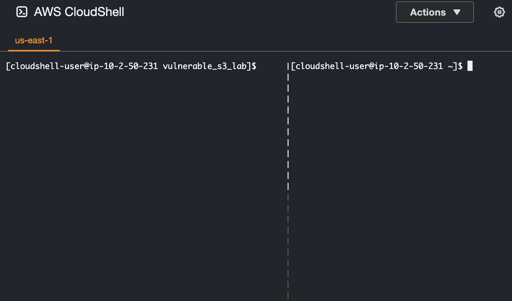

    图 3.13 – **tmux**中的垂直分割

    由于 AWS CloudShell 预先安装了**tmux**，我们应该能够直接使用**tmux**命令，而无需单独安装该实用程序。

注意

如果这是你第一次使用**tmux**，不要担心，可能需要几次尝试才能掌握正确的按键组合！随时观看这个教程视频以获取有关如何使用**tmux**的更多信息：[`www.youtube.com/watch?v=Yl7NFenTgIo`](https://www.youtube.com/watch?v=Yl7NFenTgIo)。

1.  让我们跳到左窗格。按住*Ctrl*键同时按下*b*键。释放两个键，然后在大约半秒后按下*左箭头*键。

1.  现在，在左窗格上运行以下命令：

    ```
    cd ~/vulnerable_s3_lab && terraform apply -auto-approve
    ```

    这应该产生一组类似于在本章*使用 Terraform 构建我们的易受攻击实验环境*部分运行**terraform apply**命令后生成的日志。您可以忽略任何**AccessDenied**错误消息，因为这些可以通过在左窗格中重试命令轻松解决（在这一点上我们不需要这样做）。

重要提示

运行**terraform apply**命令将获取状态锁，以确保并发操作不会同时修改基础设施状态。这个锁对于保持一致性并防止协作或自动化环境中的冲突至关重要。通过在进行任何修改之前获取锁，我们确保多个**terraform apply**命令在继续之前等待锁被释放。也就是说，*不要*等待**terraform apply**命令完成！在在左窗格上运行命令后立即继续下一组步骤。

## 第三部分 4 – 测试我们的状态锁设置

1.  为了测试我们的状态锁设置，我们将在第一个**terraform apply**命令仍在运行时运行另一个**terraform apply**命令。也就是说，让我们跳到右窗格。按住*Ctrl*键同时按下*b*键。释放这两个键，然后在大约半秒后按下*右箭头*键。

1.  当左窗格上运行**terraform apply**命令时，在右窗格上运行以下命令：

    ```
    cd ~/vulnerable_s3_lab && terraform apply -auto-approve
    ```

    这将给我们一个类似于*图 3**.14*所示的错误：

    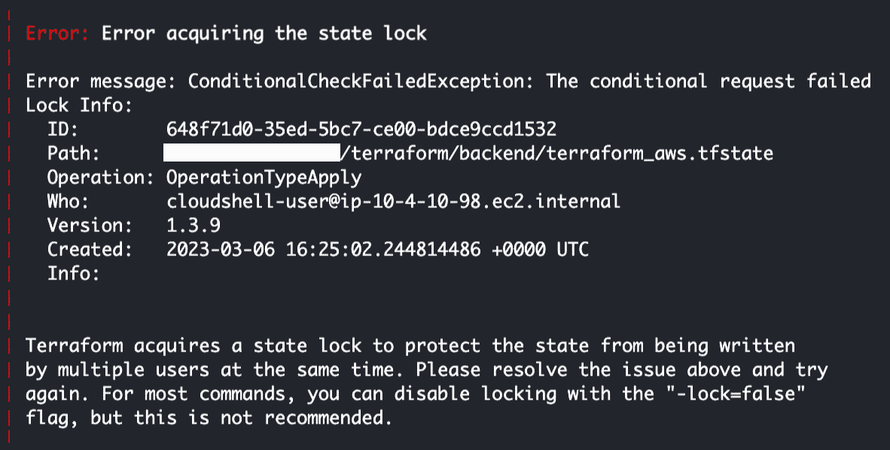

    图 3.14 – 获取状态锁时出错

    这意味着我们在第一个**terraform apply**命令仍在运行时（在左窗格中）无法获取状态锁。一旦左窗格中的命令成功（或由于错误而失败），状态锁将被释放。*这是预期的行为吗？是的！*通过在较早的步骤中获取状态锁，我们确保只有一个**terraform apply**命令可以一次修改状态。这种顺序方法确保一致性并防止竞争条件。因此，正常情况下，后续的**terraform apply**命令会等待初始命令完成并释放状态锁，然后再继续。

    当然，会有一些情况下状态锁不会自动释放（很可能是由于意外问题）。要解决这个问题，你可以使用**terraform force-unlock -force <ID>**手动解锁状态。你可以在错误消息的**Lock Info**部分找到**ID**值（类似于我们在*图 3**.14*中看到的）。

重要提示

如果你错过了时机（也就是说，在你能够在右窗格运行**terraform apply**命令之前，左窗格中的命令已经执行完毕），请随时在**~/vulnerable_s3_lab**目录内运行**terraform destroy -auto-approve**来销毁创建的资源，这样你就可以尝试重复上一组步骤。你也可以通过修改**upload.sh**文件，将 60 秒的延迟替换为 120 秒的延迟，以便给你更多时间在**tmux**窗格之间切换。

## 第四部分 4 – 清理工作

1.  随着我们的状态锁验证实验完成，让我们使用**exit**命令退出右窗格上的**tmux**会话：

    ```
    exit
    ```

    这将使我们只留下一个窗格（移除垂直分割）。

1.  在结束本节之前，让我们使用**terraform destroy**清理之前创建的资源：

    ```
    terraform destroy
    ```

    在验证步骤中（也就是当你看到**输入一个值:**时），输入**yes**以继续删除资源。这将删除**vulnerable_s3_lab**目录内**main.tf**文件中指定的资源（主要是标记为**VULNERABLE_S3**的 S3 存储桶）。

注意

随意删除剩余的 S3 存储桶（用作我们标记为**BACKEND_S3**的远程状态后端）以及 DynamoDB 表（标记为**BACKEND_TABLE**）。我们将把这留给你作为练习。

哇！这一章真是充满了生产力和行动！到目前为止，我们应该已经很好地掌握了如何利用 Terraform（结合 IaC 概念和策略）来创建和配置云资源。在接下来的章节中，我们将更深入地探讨在本章中学到的内容如何在构建云端渗透测试实验室中发挥关键作用。

# 摘要

在这一章中，我们讨论了 IaC 如何帮助我们在云端自动准备、配置和管理渗透测试实验室环境。然后，我们使用了 Terraform，这个最强大和最常用的 IaC 工具之一，来创建、修改和删除云基础设施资源。在我们的环境中设置好 Terraform 后，我们进行了几个实践示例，演示了该工具的不同功能。此外，我们还使用 Terraform（这次是自动化的）重建了在 *第二章* 中准备的脆弱实验室环境。最后，我们简要回顾了如何配置带有状态锁定的 Terraform 后端，以帮助防止多个工程师在使用 Terraform 修改基础设施资源时发生冲突。

在下一章中，我们将深入探讨在云端隔离账户和环境的不同策略。结合下一章的实践解决方案，这些信息将帮助我们妥善地保护和管理我们的云端渗透测试实验室环境。

# 深入阅读

如果您想了解更多本章涉及的内容，请随时查阅以下资源：

+   *查找 AWS* *账户的规范用户 ID* ([`docs.aws.amazon.com/AmazonS3/latest/userguide/finding-canonical-user-id.html`](https://docs.aws.amazon.com/AmazonS3/latest/userguide/finding-canonical-user-id.html))

+   *Terraform 语言* *文档* ([`developer.hashicorp.com/terraform/language`](https://developer.hashicorp.com/terraform/language))

+   *Terraform—远程* *状态* ([`developer.hashicorp.com/terraform/language/state/remote`](https://developer.hashicorp.com/terraform/language/state/remote))

+   *Terraform—状态* *锁定* ([`developer.hashicorp.com/terraform/language/state/locking`](https://developer.hashicorp.com/terraform/language/state/locking))

+   *Terraform—从状态* *灾难中恢复* ([`developer.hashicorp.com/terraform/cli/state/recover`](https://developer.hashicorp.com/terraform/cli/state/recover))

+   *一张超实用的 Vim 快捷键* *参考表* ([`vimsheet.com/`](https://vimsheet.com/))

+   *Tmux 快捷键表 & 快速* *参考* ([`tmuxcheatsheet.com/`](https://tmuxcheatsheet.com/))

# 第二部分：在云端搭建隔离渗透测试实验室环境

在本部分中，您将学习如何在 AWS、Azure 和 GCP 上构建和自动化隔离的渗透测试实验室环境。

本部分包含以下章节：

+   *第四章*，*在 GCP 上搭建隔离的渗透测试实验室环境*

+   *第五章*，*在 Azure 上设置隔离的渗透测试实验环境*

+   *第六章*，*在 AWS 上设置隔离的渗透测试实验环境*
