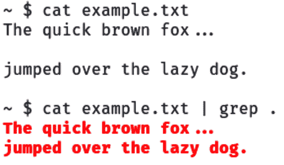
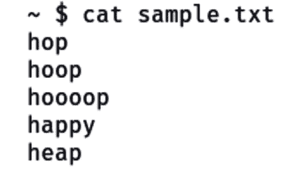
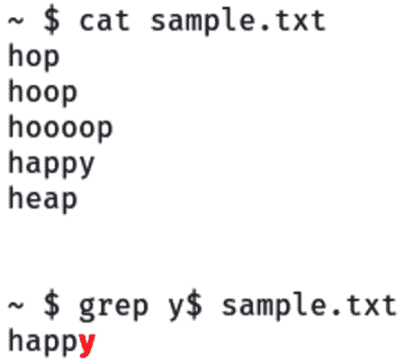
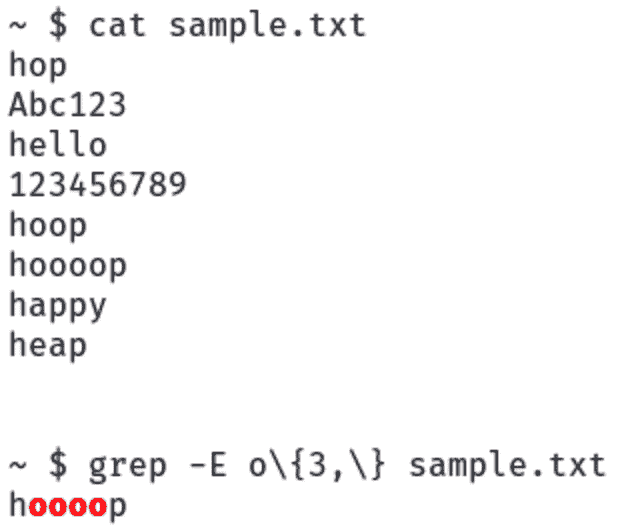
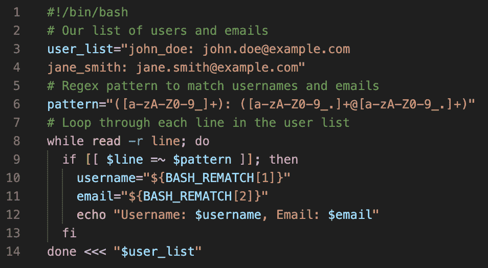
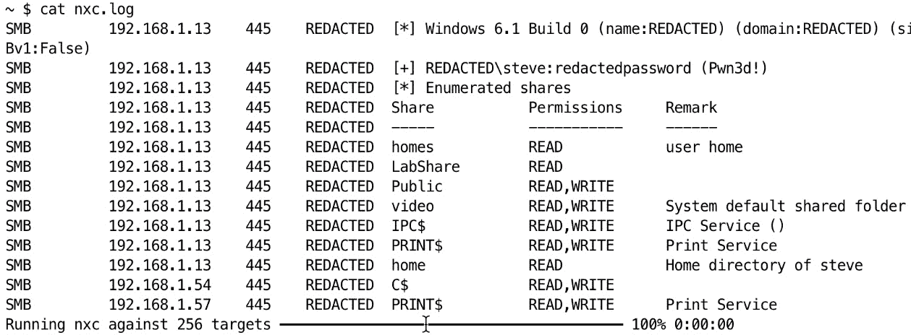

# 4

# 正则表达式

**正则表达式**，或称**regex**，刚开始可能看起来让人望而生畏，但它们对于任何处理文本的人来说，尤其是在 Bash 脚本中，是一个非常强大的工具。本章旨在帮助你逐步掌握正则表达式的世界，从基础知识开始，逐步深入到更复杂的模式和技术。无论你是想验证电子邮件地址、搜索日志文件中的特定模式，还是自动化文本处理任务，理解正则表达式将大大改变你的工作方式。我们将探索如何构建正则表达式模式，理解其结构，并将其应用于实际场景。到本章结束时，你不仅能熟练使用正则表达式，还能体会到它们如何使你的脚本任务更加高效和灵活。

本章内容建立在上一章学习的基础上。正则表达式常常与变量和条件语句一起使用。例如，你可能会使用一个**while**循环从**stdin**或文件中读取一行数据，并将读取的数据赋值给一个变量。然后，你将对该变量数据执行正则表达式，最后使用条件语句作出决策。

本章我们将讨论以下主要主题：

+   正则表达式基础

+   高级正则表达式模式和技巧

+   演示实际应用

+   正则表达式技巧和最佳实践

# 技术要求

如*第一章*所述，能够安装 Kali 虚拟机是有帮助的，但不是必须的。

本章的代码可以在 [`github.com/PacktPublishing/Bash-Shell-Scripting-for-Pentesters/tree/main/Chapter04`](https://github.com/PacktPublishing/Bash-Shell-Scripting-for-Pentesters/tree/main/Chapter04) 找到。

# 正则表达式基础

本质上，正则表达式（regex）是一种搜索、匹配和操作文本的方法。可以把它们看作是一个复杂的搜索工具，超越了你在文本编辑器或文字处理软件中标准搜索功能的能力。正则表达式允许你在文本中定义模式，使得进行复杂的搜索和编辑变得相对简单。

正则表达式极其灵活。以下是它们可以用来做的几个例子：

+   **数据验证**：确保用户输入符合特定格式，例如电子邮件地址或电话号码

+   **数据提取**：从更大的数据集提取特定的信息，例如从网页中提取所有 URL

+   **搜索和替换**：基于模式而非精确匹配在文档中查找和替换文本

正则表达式字母表由**字符**和**元字符**组成。字符就是你想要在文本中查找的字母、数字和符号。另一方面，元字符是正则表达式的特殊“魔法”。它们是具有特殊含义的符号，帮助定义模式。一些常见的元字符包括**.**、*****、**+**、**?**、**^**、**$**、**[]**、**{n}**、**{n,m}**、**{n,}**、**(a|b)**和**=~**。

在这一节中，我将展示使用**grep**命令的示例。**grep**命令用于在文件或管道输入中搜索模式。你可以通过输入**man grep**命令来了解更多关于**grep**的信息。

句点（**.**）元字符匹配除了换行符以外的任何单个字符，换行符表示为**\n**。我在正则表达式中常用**.**的一个例子是，当解析程序的输出并且想要去除空白行时。正如**.**匹配任何字符，当它单独使用时，它会移除所有空白行，因为没有任何内容可以匹配。下图展示了**.**匹配任何字符的情况，匹配的文本以红色字体突出显示：



图 4.1 – 使用句点元字符匹配非空行

如您所见，**.** 元字符不仅匹配任何字符（以红色高亮显示），它还帮助我们仅匹配非空行。

星号（*****）元字符匹配前一个元素出现零次或多次。假设你有一个名为**sample.txt**的文本文件，里面包含多行文本，你想要查找匹配**ho*p**模式的行。这个模式应该匹配**hop**、**hoop**、**hooooop**等行。**sample.txt**文件的内容如下所示：



图 4.2 – sample.txt 文件的内容

小贴士

你必须使用带有**-E**选项的**grep**命令来进行扩展正则表达式，这样你才能使用*****元字符。

此命令告诉**grep**在**sample.txt**中搜索匹配**ho*p**模式的行：**grep -E 'ho*p' sample.txt**。**-E**选项用于启用扩展正则表达式，支持包括*****元字符在内的多种功能。否则，外部正则表达式中，*****被称为**glob**字符，正如在*第二章*中讨论的那样。

加号（**+**）元字符匹配前一个元素出现一次或多次。例如，如果你正在分析日志文件中的错误，可以使用**Error: +**模式帮助你找到**Error:**后跟一个或多个空格的行，表示错误信息的开始。如果没有**+**元字符，你就会错过多个空格的情况，或者浪费时间筛选无关的数据。

问号（**?**）元字符使得前面的元素变为可选。**?**元字符的核心含义是可选性。它告诉正则表达式引擎匹配前面的元素零次或一次。简单来说，它意味着紧跟在**?**前面的字符或模式可能出现，也可以不出现。

这个概念通过一个示例更容易理解。假设你需要处理日志文件。这些日志遵循如**app-log-2024.txt**这样的命名规范，但有时它们会包含一个额外的标识符，如**app-log-2024-debug.txt**。使用**?**元字符可以让你的脚本更加灵活。像**app-log-2024(-debug)?.txt**这样的模式就可以匹配这两个文件名，确保你的脚本在不同日志类型间无缝工作。

插入符号（**^**）元字符匹配行首。你可能会想，为什么需要指定某个内容必须出现在行的开头？这完全是为了精确。在这个例子中，如果我们不使用**^**元字符，仅仅搜索**DONE**，我们会得到文本中任何包含**DONE**的行——而不仅仅是行首的部分。这可能包括**DONE**出现在便签或提醒中的行，而不仅仅是任务状态标记。

美元符号（**$**）元字符匹配行尾。

以下是使用**$**匹配的示例：



图 4.3 – 使用$元字符匹配字符串的结尾

括号表达式（**[ ]**）匹配括号内的任何单个字符。你可以通过将**^**符号放在列表的第一个字符位置来执行逻辑**非**表达式。这样会匹配列表中不包含的字符。例如，如果你想匹配元音字符，适当的括号表达式是**[aeiou]**，而如果你想匹配辅音字符，可以使用**[^aeiou]**。

范围表达式经常在括号表达式内使用，节省你输入所有后续字符或数字的时间和精力。例如，代替在括号内输入从*a*到*z*的字母，你可以使用**[a-z]**作为便捷的快捷方式。同样，对于数字，你可以使用类似**[1-10]**的范围。下图展示了括号表达式的工作原理：


图 4.4 – 使用括号表达式的示例

括号表达式是一个非常有价值且节省时间的正则表达式功能！

**{n}**元字符指定前面的元素恰好匹配*n*次。它也可以写作**{n, m}** 或 **{n,}**，表示前面的元素匹配**n**到**m**次，或者恰好匹配**n**次或更多次。我们来看一下如何使用这个：



图 4.5 – 一个示例，展示如何匹配 n 次或更多次

上面的图示显示了我指定必须匹配**3**次或更多次字符**o**。单词**hoooop**是唯一的匹配项。请注意，我在**grep**中必须包含**-E**参数，以启用扩展正则表达式功能，并且必须使用反斜杠转义方括号。

**(a|b)** 元字符匹配**a**或**b**。

**=~** 匹配操作符通常用于脚本中。让我们讨论下图所示的基本示例：


图 4.6 – 演示匹配操作符的示例

如果左侧的字符串与右侧的正则表达式匹配，表达式的值为**true**，并且**[[ ]]**括号表达式的退出状态为 0（零）。在 Bash 脚本中，退出状态为 0 表示成功或**true**，任何非 0 的退出值表示失败或**false**。

在 Bash 脚本中，**&&** 和 **||** 是**逻辑操作符**，用于条件表达式中组合多个命令或条件。它们的使用与命令的退出状态相关。应用到前面的示例中，如果匹配模式找到了输入表达式的匹配项，结果将是退出状态 0，或为 true。如果字符串与正则表达式不匹配，表达式值为 false，**[[ ]]**表达式的退出状态为 1（退出状态 1 表示失败或 false）。**&&** 操作符将退出状态传递给后续的**||**表达式，可以认为是**true** 或 **false**。如果表达式为 true，左侧的语句 **echo Match found!** 将被执行。如果为 false，右侧的语句 **echo "No match"** 将被执行。

现在你已经熟悉了元字符，接下来让我们探索**字符类**，它们在使用我们刚刚介绍的括号表达式时提供了方便的快捷方式。

## 使用字符类

在括号表达式中使用时，字符类是一个方便的快捷方式，可以简化正则表达式：

+   **[:alpha:]** : 字母字符

+   **[:alnum:]** : 字母数字字符

+   **[:digit:]** : 数字 0 到 9

+   **[:blank:]** : 空格和制表符

+   **[:cntrl:]** : 控制字符

+   **[:lower:]** : 小写字母

+   **[:upper:]** : 大写字母

+   **[:punct:]** : 标点符号

+   **[:space:]** : 空格字符，包括空格、制表符、换行符、垂直制表符、换页符和回车符

提示

字符类必须包含在括号表达式中——例如，**[[:alpha:]]**。

字符类是一种节省时间的简写方法，极大简化了创建正则表达式的过程。

## 标志 – 修改你的搜索

正则表达式允许你通过标志修改搜索方式。这些通常是单个字母，改变正则引擎如何解释你的模式。以下是一些例子：

+   **i** : 使搜索不区分大小写

+   **g** ：执行全局搜索（找到所有匹配项，而不是在第一次匹配后停止）

+   **m** ：多行模式（改变 **^** 和 **$** 的行为，使其匹配行的开始和结束，而不是整个字符串）

这不是一个详尽无遗的列表。更多信息请参见 [`www.gnu.org/software/bash/manual/html_node/Pattern-Matching.html`](https://www.gnu.org/software/bash/manual/html_node/Pattern-Matching.html)。这些标志可以单独使用，也可以组合使用，具体取决于正则表达式操作的需求。这些标志的应用方式在不同工具间略有不同，但通常是附加到正则表达式模式中的。由于它们的使用依赖于工具，稍后我在本章的实际示例中会展示它们如何使用。

现在你已经理解了正则表达式的基础，接下来让我们回顾一些示例，展示它们是如何工作的。

## 应用基础正则表达式示例

这个示例仅使用 **grep** 来匹配字母 **t**。默认情况下，**grep** 执行全局搜索。因此，**g** 标志不是必需的：


图 4.7 – 对 t 字符的基本 grep

这个示例匹配所有元音：


图 4.8 – 匹配所有元音的模式

这个示例匹配所有辅音。记住，**^** 符号在括号内有不同的含义。这实际上意味着它匹配列表中不包含的任何字符：


图 4.9 – 匹配所有辅音的模式

现在，我将展示一个稍微复杂一点的示例。你能发现下面两个示例之间的区别吗？


图 4.10 – 用于演示微妙差异的两种模式

第一种模式匹配 **t** 后跟零个或多个不是 **w** 的字符。重要的是要注意，***** 适用于模式的 **[^w]** 部分，允许任何不以 **w** 开头的字符序列紧跟在 **t** 后面。因此，它匹配所有内容，包括 **told** 中的空格，并一直匹配到输入的末尾。

第二种模式专门寻找 **t** 后跟一个不是 **w** 的字符，然后是零个或多个字母字符。在 **[^w]** 后包含 **[[:alpha:]]*** 表示在找到 **t** 后跟任何非 **w** 字符时，只有当后续字符是字母时，才匹配。

提示

*图 4* *.10* 中的示例展示了反斜杠字符用于转义星号。少数几个字符具有特殊意义。以下字符必须使用反斜杠进行转义：**[\^$.|?*+()**。

现在你已经理解了基础知识，让我们来体验一些高级正则表达式概念。

# 高级正则表达式模式和技巧

在正则表达式中，使用**捕获分组**就像是将模式的一部分放入一个框中。框内的所有内容都被视为一个单元。你可以对其应用量词，查找重复项，甚至提取其中的信息。在 Bash 中，你使用圆括号**()**来创建这些分组。

**分组**不仅仅是将模式的部分视为一个单元；它还涉及到捕获信息。当你将正则表达式的一部分分组时，Bash 会记住与该部分模式匹配的文本。这对于从字符串中提取信息非常有用。

假设你正在处理日志文件，并希望提取时间戳。你的日志行可能看起来像这样：**2023-04-01 12:00:00 错误：出现问题**。匹配时间戳的正则表达式模式可能是**(\d{4}-\d{2}-\d{2} \d{2}:\d{2}:\d{2})**。在这里，**\d**匹配任何数字，而**{n}**指定该元素应重复的次数。整个时间戳模式是分组的，因此你可以轻松地从字符串中提取出来。

让我们通过一些实际例子，帮助你巩固对捕获分组的理解。

## 实际示例——使用正则表达式提取数据

假设你需要从列表中提取用户名及其对应的电子邮件地址。列表看起来像这样：

```
 john_doe: john.doe@example.com
jane_smith: jane.smith@example.com
```

你可以使用以下正则表达式模式来匹配并提取用户名和电子邮件地址：

```
 ([a-zA-Z0-9_]+): ([a-zA-Z0-9_.]+@[a-zA-Z0-9_.]+)
```

在这里，**[a-zA-Z0-9_]+**匹配一个或多个字母数字字符或下划线（用户名），而**[a-zA-Z0-9_.]+@[a-zA-Z0-9_.]+**匹配电子邮件地址。通过对它们进行分组，你可以分别提取用户名和电子邮件地址。

例如，假设你有字符串**I love apples and I love oranges**，并且你想找到每个**I love**的实例。在正则表达式中，你可以写出这个模式：**(I love)**。这告诉 Bash 将**I love**视为一个单元。

在 Bash 中使用正则表达式分组一开始可能显得复杂，但一旦你理解了基础，它会为字符串处理和数据提取打开一扇新的大门。通过将模式分解为可管理的组，你可以简化脚本并提高效率。记住，实践出真知。开始在 Bash 脚本中尝试正则表达式分组，你很快就会发现它的重要性。

接下来，我们将通过展示如何使用选择扩展正则表达式分组，使你的捕获分组更强大、更灵活。

## 使用选择

正则表达式中的**选择**通过管道符号（**|**）表示，它的功能类似于逻辑“或”。它允许你在同一个正则表达式中指定多个模式，从而提供匹配某个或另一个内容的方式。可以将其理解为告诉你的脚本：“嘿，如果你看到这个或那个，认为它是匹配的。”

假设你正在编写一个需要处理特定扩展名文件的脚本。你对**.txt**和**.log**文件感兴趣，但希望通过一个正则表达式来处理它们。你可以这样做：

```
 #!/usr/bin/env bash
filename="example.txt"
if [[ $filename =~ \.(txt|log)$ ]]; then
  echo "File is either a .txt or .log file." else
  echo "File is not a .txt or .log file." fi
```

这个示例代码可以在本章文件夹中的**ch04_regex_01.sh**文件中找到。

运行这个示例会产生以下输出：

```
 $ bash ch04_regex_01.sh
File is either a .txt or .log file.
```

在这个示例中，**(txt|log\)$**是正则表达式模式。管道符号**|**将两个选择项**txt**和**log**分隔开，而反斜杠**\**用于转义那些在正则表达式中有特殊意义的字符。美元符号**$**确保该模式匹配字符串的结尾，防止像**example.txt.bak**这样的文件出现误匹配。

你可能会想，为什么要使用交替（alternation），而不直接为每个情况编写独立的条件？答案在于简洁性和效率。使用交替，你可以将多个条件合并成一行代码，使你的脚本更加简洁，便于维护。

在需要匹配大量可能性时，交替可以显著减少代码的复杂性。与其拥有冗长的**if**语句或笨重的**case**语句，你可以将所有的选项列在一处。

虽然交替非常强大，但必须明智使用，以避免陷入误区。这里有一些提示供你参考：

+   **具体一点**：正则表达式模式有时可能会匹配到超出你预期的内容。为了避免意外行为，请尽量使你的模式尽可能具体。

+   **测试**：始终使用不同的输入测试你的正则表达式模式，以确保它们按预期行为运行。像**grep**这样的工具和在线正则表达式测试工具（[`regex101.com`](https://regex101.com)）对于此类测试非常有帮助。

在 Bash 脚本中，正则表达式的交替（alternation）就像是你武器库中的一件秘密武器。它可以通过简化复杂的模式匹配逻辑，帮助你编写更加简洁、易读且易维护的代码。无论你是经验丰富的脚本编写者，还是刚刚入门，新掌握交替用法无疑会让你的脚本编写过程更加顺畅和愉快。

记住，编写有效脚本的关键不仅仅是知道有哪些工具可用，更重要的是理解如何明智地使用它们。使用正则表达式交替，你将能够应对各种字符串匹配的挑战。

现在你已经对正则表达式的工作原理有了不错的掌握，我们来探索一些实际的正则表达式应用。

# 演示实际应用

在这里，我使用了前面章节中介绍的各种变量和数组。让我们通过以下 Bash 脚本来实践一下：



图 4.11 – 在实际应用中引入 BASH_REMATCH

这个示例代码可以在本章文件夹中的 **ch04_regex_02.sh** 文件中找到。在这个脚本中，我在 *第 3 行* 声明了 **user_list** 变量。在 *第 6 行*，我声明了 **pattern** 变量。在 *第 8 行*，我启动了一个 **while** 循环，读取来自 **$** **user_list** 变量的每一行数据。

在 *第 9 行*，我使用了匹配操作符 **=~**，将每一行 **($line)** 与我们的正则表达式模式 (**$pattern**) 进行比较。这些通过 **$line** 和 **$pattern** 变量引用，它们已经声明。使用匹配操作符时，左侧的字符串（由 **$line** 变量表示）将与右侧的正则表达式模式匹配。如果模式匹配，表达式返回 true（0）；否则，返回 false（1）。

首先，模式通过相关的捕获组捕获用户名：**([a-zA-Z0-9_]+)**。记住，捕获组由圆括号**()**围绕一个正则表达式组成。在捕获组内，我们有一个字符集表达式，它将匹配所有字母数字字符，并加上下划线以匹配用户名。第二个捕获组匹配一个电子邮件地址。

如果某一行匹配，Bash 会将捕获的组填充到一个名为 **BASH_REMATCH** 的数组中。在这里，**BASH_REMATCH[1]** 包含第一个捕获组（用户名），而 **BASH_REMATCH[2]** 包含第二个组（电子邮件地址）。然后，我们将它们打印出来：

```
 ~ $ bash ch04_regex_02.sh
Username: john_doe, Email: john.doe@example.com
Username: jane_smith, Email: jane.smith@example.com
```

你发现我在哪儿可以使捕获组更容易阅读和编写吗？第一个捕获组 **([a-zA-Z0-9_]+)** 可以简化为 **([[:alnum:]_]+)**，而第二个捕获组 **([a-zA-Z0-9_.]+@[a-zA-Z0-9_.]+)** 可以简化为 **([[alnum]_.]+@[[:alnum:]_.]+)**。

## 使用 grep 匹配 IP 地址

在这个示例中，我们将查看一个实际的案例，涉及端口扫描以定位特定端口开放的 IP 地址。这是一个常见的渗透测试任务，通常用于生成主机列表，以便进行后续的目标扫描，或生成受影响主机的列表，用于渗透测试结果。

由于这涉及到扫描你的本地网络，确保你有权限扫描网络，如果你不拥有该网络。我已在本书的 GitHub 仓库中为方便起见，提供了一个来自我实验室的示例 Nmap 扫描文件：**test_nmap.gnmap**。

使用以下 Nmap 命令扫描网络，将网络地址替换为适合你网络的地址：

```
 nmap -oG test.gnmap 10.1.0.0/24
```

扫描命令的选项指定了可以用来过滤的输出 **-oG**，输出文件名为 **test_nmap.gnmap**，后面跟着网络地址。

在我的扫描中，从 **test_nmap.gnmap** 文件输出的一行扫描结果如下所示：

```
 Host: 10.1.0.1 ()     Ports: 53/open/tcp//domain///, 80/open/tcp//http///, 443/open/tcp//https///
```

接下来，我们需要识别任何主机 IP 地址，其上开放了 **http** 或 **https** 服务端口。在与 **test_nmap.gnmap** 文件位于同一目录下执行以下命令：

```
 grep /open/tcp//http test_nmap.gnmap | grep -oE "\b([0-9]{1,3}\.){3}[0-9]{1,3}\b"
```

这个示例代码可以在本章文件夹中的 **ch04_regex_03.sh** 文件中找到。

上述命令使用 **grep** 来搜索文字的正则表达式（没有元字符），**/open/tcp//http** 。该命令的输出是每一行包含该字符串的完整文本行。管道字符 **|** 只是将第一个进程的输出 (**stdout**) 与下一个进程的输入 (**stdin**) 连接起来。然后，**-oE** 参数与 **grep** 命令一起提供。**-o** 选项意味着只输出匹配的文本，而不是整行文本，**-E** 选项启用扩展正则表达式功能。最后，命令的末尾是一个用于匹配 IP 地址的正则表达式模式。该命令产生以下输出：

```
 ~ $ grep /open/tcp//http test_nmap.gnmap | grep -oE "\b([0-9]{1,3}\.){3}[0-9]{1,3}\b"
10.1.0.1
10.1.0.4
10.1.0.6
10.1.0.7
10.1.0.13
```

管道字符用于将输出重定向到另一个进程的输入，这是一个强大的功能，我们将在后面的章节中频繁使用。

## 使用方便的 grep 标志

虽然这些 **grep** 标志非常简单，但它们也非常方便。我经常使用它们，并希望与大家分享。

在内部网络渗透测试中，我经常做的一件事是使用我获得的任何凭证来枚举可以使用这些凭证访问的文件共享。在这个示例中，我使用 NetExec 来检查可以使用我拥有的凭证访问的 SMB 文件共享。你可以在 [`github.com/Pennyw0rth/NetExec`](https://github.com/Pennyw0rth/NetExec) 找到 NetExec。

下图显示了 NetExec SMB 文件共享枚举扫描的输出：



图 4.12 – NetExec SMB 共享枚举扫描

扫描结果已保存到文件 **nxc.log** 。假设我在一个包含数百甚至上千个主机的大型网络上运行了此扫描，并且我希望专注于寻找那些我可以读取或写入的共享，但我不想看到任何 **IPC$** 或 **PRINT$** 共享。

虽然有正则表达式模式可以合理地在这里匹配 **READ** / **WRITE** 的组合，但我们希望保持简单，以免频繁查阅笔记。以下命令可以完成这个目标：


图 4.13 – 我们的 grep 标志简化了任务

此示例代码可以在本章文件夹中的 **ch04_regex_04.sh** 文件中找到。让我们分解一下这些命令的顺序：

+   **cat nxc.log** ：此命令打印 **nxc.log** 文件的输出。

+   **|** ：这将 **cat** 命令的输出连接到 **grep** 命令的输入。

+   **grep -e READ -e WRITE** ：**grep** **-e** 标志指定一个模式。如果你包含额外的 **-e** 标志，可以使用多个模式。如果找到任一或两个单词，这将匹配成功。

+   **grep -v …** ：**grep** **-v** 标志表示反转匹配。这类似于逻辑 **NOT** 表达式。换句话说，过滤掉任何与此表达式匹配的内容。

在你的渗透测试生涯中，你将经常使用这些模式。

## 屏蔽 IP 地址

以下示例展示了如何使用 **sed**（流编辑器）命令编辑 IP 地址，但它也可以用于文件或输入流中的其他批量文本编辑。

假设你想在与别人共享 **test_nmap.gnmap** 文件之前，先对文件中的 IP 地址进行编辑。我们再次使用 IP 地址的正则表达式。不过，这一次，我们会将输出传递给 **sed** 并编辑所有的 IP 地址。在终端中运行以下命令：

```
 sed -E 's/([0-9]{1,3}\.){3}[0-9]{1,3}/REDACTED_IP/g' test_nmap.gnmap
```

这个示例代码可以在本章文件夹中的 **ch04_regex_05.sh** 文件中找到。输出应该显示文件中的每个 IP 地址已被编辑。

那么，这条 **sed** 命令是做什么的呢？

+   **-E** 选项启用扩展正则表达式。

+   **sed** 后面的命令被单引号括起来。

+   在 **sed** 命令和参数之后，你会看到类似 **'s/MATCH/REPLACE/g'** 的模式。

+   **s** 选项表示查找下一个 **/** 字符之间的任何内容（**MATCH** 文本）。

+   用下一个斜杠（**/**）字符之间的模式（**REPLACE** 文本）替换匹配的文本。

+   **g** 标志表示进行 **全局** 查找，并替换每一个匹配项。否则，如果正则表达式或字面字符串在同一行中匹配了两次，它只会对第一个匹配项执行替换。

在这个例子中，我们没有直接编辑原文件，只是编辑了屏幕上的文本输出。我们有两种方法可以编辑并保存文本：一种是包括 **sed -i** 标志，另一种是将输出重定向到文件。

在第一种情况下，通过添加 **sed -** **i** 标志可以就地编辑文件：

```
 sed -iE 's/([0-9]{1,3}\.){3}[0-9]{1,3}/REDACTED_IP/g' test_nmap.gnmap
```

这个示例代码可以在本章文件夹中的 **ch04_regex_06.sh** 文件中找到。另一个选项是省略 **-i** 标志。它会保留原文件，并将编辑后的文本重定向到一个新文件中：

```
 sed -E 's/([0-9]{1,3}\.){3}[0-9]{1,3}/REDACTED_IP/g' test_nmap.gnmap > new_test_nmap.gnmap
```

这个示例代码可以在本章文件夹中的 **ch04_regex_07.sh** 文件中找到。上述命令使用 **>** 字符将输出重定向到随后的文件名。

提示

当使用 **>** 字符将输出（**stdout**）重定向到文件时，如果文件已存在，它将覆盖该文件。如果想要追加内容而不是覆盖，命令中应使用 **>>**。

接下来，让我们来看看如何使用 **awk** 进行正则表达式匹配。Awk 不仅仅是一个正则表达式工具，它是一个完整的编程语言。它的优势在于当你在处理表格数据（列、制表符或逗号分隔的数据）时，能发挥巨大的作用。在学习 awk 之前，我误以为它太复杂，常常将多个工具链在一起完成同样的工作，结果做了更多的工作，实际上如果直接使用 awk，反而省力。本章我会简要介绍几个快速的示例，更多深入的内容将在下一章中讲解。

Awk 程序可以是一行快速的一次性脚本，尽管它们也可以用于文件以处理更复杂的用例。一行 awk 脚本的格式是**awk '模式 {动作}'**。**模式**或**动作**可以省略一个，但不能同时省略。

默认字段分隔符是任何空白字符，比如空格或制表符。多个空白字符被视为一个单元。这对我来说非常有帮助，因为在学习 awk 之前我习惯使用**tr -s ' '**来*压缩*或合并多个空格为一个。

在深入研究我们的第一个 awk 示例之前，让我们花一分钟来了解常见的 awk 术语：

+   **记录**：输入文件的每一行被称为一个记录。

+   **字段**：每一列都是一个字段。

+   **$n**：每个字段（列）。整个记录（行）是**$0**，第一个字段是**$1**，依此类推。

+   **$NF**：记录中的字段数。也可以用来指代最后一个字段。

+   **$NR**：到目前为止的记录数。

+   **-F**：字段分隔符；默认是一个空格。记住，任意数量的连续空格会被合并。因此，如果前两个字段由一个或多个空格分隔，**$1**和**$2**仍然指代第一个和第二个字段（列）。

在下图中，您可以看到我系统上**ps -ef**命令的输出。这是我将在接下来的示例中使用的数据：


图 4.14 – 使用 ps 命令显示系统进程

在我们的第一个 awk 示例中，我只是简单地打印每个记录（**行**）：


图 4.15 – 使用$0 打印整个记录

这个例子的代码可以在本章节文件夹中的**ch04_regex_08.sh**文件中找到。

接下来，我们将看一个更高级的例子。在下图中，我使用了一个模式和动作。这个例子将匹配任何具有**author** UID 的进程，并打印 CMD（**$8**，或第 8 个字段）：


图 4.16 – 打印任何由 author 拥有的进程的 CMD

这个例子的代码可以在本章节文件夹中的**ch04_regex_09.sh**文件中找到。

在我们最后一个 awk 示例中，我们将研究如何使用正则表达式并用自定义分隔符打印输出：


图 4.17 – 使用正则表达式并用 awk 打印自定义输出

这个例子的代码可以在本章节文件夹中的**ch04_regex_10.sh**文件中找到。在前面的示例中，模式中的正则表达式匹配第八个字段中以**[irq/**开头，后跟正好两位数字，后跟**-pciehp]**的内容。对于任何匹配的记录，动作打印第一个和第八个字段，用**--->**代替默认的空格分隔符。

我们仅仅触及了使用 awk 的表面。然而，这里展示的概念可以解决最常见的脚本任务。我们将在下一章深入探讨这一主题。

# 正则表达式技巧与最佳实践

以下技巧将帮助你创建复杂的正则表达式模式：

+   **从小开始**：从简单的模式入手，逐渐引入更多的复杂性。

+   **练习**：使用在线正则表达式测试工具，尝试不同的模式和标志。

+   **分解**：面对复杂的模式时，把它分解成更小的部分，以便理解每个组成部分。

+   **参考文档**：保持一份备忘单或参考指南，直到你对常见模式和元字符更熟悉为止。虽然网上有很多正则表达式备忘单，但我建议你在阅读本书并进行实验时自己制作一份。我发现，做笔记的过程有助于我记住难以理解的概念。

# 总结

在本章中，我们介绍了正则表达式的基本概念，并进一步讲解了更高级的主题，包括元字符和捕获组。最后，我们学习了如何将这些技巧应用于 Bash 脚本的实际应用中，这对于渗透测试非常有用。

正则表达式并不需要让人害怕。通过对字符、元字符和标志的基本理解，你已经在掌握它们的道路上了。无论是编辑文本、分析数据还是验证用户输入，正则表达式都可以成为你工具箱中不可或缺的工具。记住，像任何技能一样，熟练掌握需要练习。所以，尽管去尝试，开始实验，很快你会发现它们变得简单易懂。

在下一章中，我们将把本章学到的正则表达式概念与常见的文本解析工具结合起来，专注于常见的网络安全和渗透测试任务。
