# 10

# 使用 Bash 进行网络和基础设施的渗透测试

本章将探讨如何使用 Bash 进行网络和基础设施的渗透测试。我们将了解 Bash 如何成为探测网络系统、识别漏洞以及模拟攻击场景的强大工具。你将全面了解如何使用 Bash 进行扫描、枚举和漏洞评估，尤其是在内部网络环境中。

在本章中，我们将涵盖以下主要内容：

+   使用 Bash 进行网络渗透测试的基本原理

+   Bash 中的高级网络扫描技术

+   使用 Bash 枚举网络服务和协议

+   使用 Bash 进行基础设施漏洞评估

# 技术要求

为了跟随本章的内容，至少你需要访问一个 Bash shell。为了执行示范的练习，你需要构建 **Active Directory 游戏**（**GOAD**）实验室。你可以在 [`github.com/Orange-Cyberdefense/GOAD`](https://github.com/Orange-Cyberdefense/GOAD) 找到 GOAD。

GOAD 是一个 Active Directory 漏洞利用实验室。如果你不熟悉 Active Directory，它是一个用于管理大量相关 Microsoft Windows 系统的系统。默认的 Windows 和 Active Directory 配置通常存在可被利用的漏洞。在实验室中，除了默认设置之外，还有更多的可利用配置错误。GOAD 实验室中的 Active Directory 漏洞常常出现在内部网络渗透测试中，这使得它成为实践或测试新渗透工具的最佳实验室之一。

我使用 Ludus 来部署我的 GOAD 实验室。我运行一个 Ludus 服务器，在客户端（我的笔记本电脑）上，我使用 Ludus 客户端来自动化构建、启动和停止我的实验环境。Ludus 使得自动化部署复杂网络环境变得容易。我已使用 GOAD 和 Vulhub 模板部署了我的 Ludus 环境，混合了内部网络渗透测试目标以及一些已知的易受攻击的 Web 应用程序。你可以在 [`docs.ludus.cloud`](https://docs.ludus.cloud) 阅读更多关于 Ludus 的内容。

你应该选择 GOAD 还是 Ludus？GOAD 必须安装在 Linux 系统上，但你可以继续将该 Linux 系统用于其他用途。Ludus 服务器需要将其 *裸机* 安装在一台计算机上。安装完 Ludus 后，你将无法将该计算机用于除虚拟服务器之外的任何其他用途。如果可以，我建议将一台计算机专门用于运行 Ludus，并从那里部署 GOAD。你在渗透测试生涯中将需要一个实验环境，而 Ludus 使得运行实验环境变得简单。

本章的代码可以在 [`github.com/PacktPublishing/Bash-Shell-Scripting-for-Pentesters/tree/main/Chapter10`](https://github.com/PacktPublishing/Bash-Shell-Scripting-for-Pentesters/tree/main/Chapter10) 找到。

运行以下命令在 Kali 中安装所需的依赖：

```
 $ sudo apt update && sudo apt install -y tmux netexec nmap masscan tcpdump wordlists hashcat xmlstarlet
```

安装 Greenbone Community Edition，之前称为 OpenVAS。硬件或虚拟硬件的最低要求如下：

+   **CPU** ：2 核

+   **RAM** ：4 GB

+   **存储** ：20 GB

运行以下命令以安装和配置 Greenbone：

```
 $ sudo apt install -y gvm
$ sudo gvm-setup
```

在输出中记下管理员帐户密码。设置完成后，运行以下命令以确保一切正常：

```
 $ sudo gvm-check-setup
```

在输出中，如果一切顺利，你应该看到最后的内容：**It seems like your GVM-[version] installation** **is OK.**

# 使用 Bash 进行网络渗透测试的基础

网络渗透测试，或称渗透测试，是网络安全中的一项关键实践。它涉及模拟对网络的攻击，以便在恶意行为者利用漏洞之前识别这些漏洞。各种方法论指导渗透测试员完成这一过程，确保彻底和系统的评估。Bash 脚本，在 Unix/Linux 环境中是一个强大的工具，在自动化和增强这些方法论方面发挥着重要作用。让我们深入探讨网络渗透测试的核心方法，并探索如何有效地利用 Bash 脚本。

## 网络渗透测试的核心方法

网络渗透测试的核心方法包括以下内容：

1.  **侦察** ：侦察是获取目标网络信息的初始阶段。可以是被动的（例如，查找公开记录）或主动的（例如，扫描网络）。

1.  **扫描** ：在此阶段，渗透测试员使用工具发现活动主机、开放端口和网络上运行的服务。这有助于绘制网络图并识别潜在的入口点。

1.  **枚举** ：枚举涉及从网络中提取更详细的信息，例如用户帐户、计算机名称和网络共享。此阶段基于扫描过程中收集的数据。

1.  **利用** ：在这一阶段，渗透测试员尝试利用已识别的漏洞，获得对系统或数据的未授权访问。此阶段测试现有安全措施的有效性。

1.  **后期利用** ：获得访问权限后，渗透测试员评估入侵的程度，保持访问权限，并收集更多信息。此阶段有助于理解攻击的潜在影响。

1.  **报告** ：最后，渗透测试员将他们的发现汇总成报告，详细列出漏洞、利用的弱点以及修复建议。

我们在*第八章*中已经讨论了侦察。本章将重点介绍扫描、枚举和利用。后期利用和报告将在后续章节中进行讨论。

渗透测试人员需要能够高度集中注意力，以便有效工作。渗透测试通常是有时间限制的，这意味着在预定的开始和结束日期之间你有有限的时间。掌握 Bash 脚本技能的价值在于它节省的时间。我们希望自动化运行扫描和枚举，这样我们就能节省宝贵的时间，专注于工具输出的细节。这就是 Bash 脚本的价值所在。

在渗透测试过程中，我们需要运行一系列工具。通常，我们必须将一个工具的输出与另一个工具的输入连接起来。这个过程通常涉及到数据转换，正如我们在前几章中看到的那样。

## 设置渗透测试环境

开始进行网络渗透测试时，我的第一步是创建一个目录结构来存放数据。顶级目录是渗透测试的名称。在这种情况下，我将其命名为**bashbook**。然后，在**bashbook**下创建日志、扫描和战利品的目录。

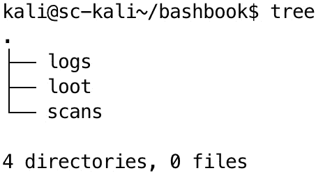

图 10.1 – 网络渗透测试目录结构示例

在顶级目录**bashbook**下，我将创建两个文件，**scope.txt**和**exclusions.txt**。**scope.txt**文件中列出我被授权测试的 IP 或网络地址。**exclusions.txt**文件中包括任何被排除的 IP 地址或主机名。这样，如果我的授权范围是网络地址**10.2.10.0/24**，但**10.2.10.13**被排除，我可以将该地址放入**exclusions.txt**文件中，以确保跳过该地址。

**logs**目录是我将每个在终端运行的命令输出的副本存放的地方。对于终端日志记录，我非常喜欢**tee**命令。有一些方法可以将所有命令行活动记录到一个文件中，但我个人喜欢将**tee**命令附加到每个命令后，并保存单独的日志文件。这将输出保存到一个带有日期和时间戳的文件中，文件名也具有意义。如果我的客户报告出现故障并询问我在做什么，我可以查看**logs**目录中的时间戳并给出回答。此外，这些日志文件在我测试结束后如果发现遗漏了报告中的截图时也非常有用。我可以简单地**cat**日志文件并截图。这些日志文件还将在我需要解析数据以发现报告中所有受影响主机时使用。要执行命令并查看输出的同时将输出保存到文件中，可以在命令和**tee**之间使用 Bash 管道符号（**|**）。

这是一个示例：

```
 $ netexec smb 10.2.10.0/24 -u user -p password --shares | tee logs/netexec-user-shares.log
```

现在，我有了一个有意义的日志文件名，包含时间戳和我命令的输出，方便稍后进行解析。

提示

如果你运行另一个命令并将其通过管道传递给**tee**并指定一个现有的文件名，该文件将会被覆盖。要向文件追加内容，使用**tee -a [filename]**。

## 使用 tmux 进行持久会话

在我们开始黑客之前，我想向你介绍另一个 shell 实用程序，**tmux** 。让我们看一下 **man tmux** 命令的输出：

```
 tmux is a terminal multiplexer: it enables a number of terminals to be created, accessed, and controlled from a single screen.  tmux may be detached from a screen and continue running in the background, then later reattached.
```

**tmux** 对我们的工作如此重要的原因在于，渗透测试人员经常远程工作，必须连接到远程系统或通过远程系统进行工作。例如，我百分之百远程工作。当我为客户执行内部网络渗透测试时，我不会亲自前往现场。我会将一台小型计算机，如 Intel NUC 或 System76 Meerkat 发送到客户现场。客户将其连接到网络并打开电源。该设备然后使用 Wireguard 协议连接到我团队的 **网络非军事区**（**DMZ**）上的堡垒主机。然后我使用带有公钥和私钥的 SSH 安全连接到我的客户内部网络通过我的堡垒主机。

在建立 SSH 会话后，我立即启动或恢复一个 **tmux** 会话。在运行扫描时，您可能会从远程系统断开连接，或者更糟的是，在利用系统并建立反向 shell 后断开连接。如果您没有 **tmux**，如果运行一个命令并从 SSH 会话断开连接，所有正在运行的进程都将被终止。

让我们探索如何使用 **tmux** 。首先，运行 **tmux** 并启动一个新会话：

```
 $ tmux new -s [session name]
```

会话名称不是必需的。您也可以通过简单输入 **tmux** 来启动一个新会话。如果您与他人合作并共享系统，则给会话命名是个好主意。

现在，我们的终端窗口将具有会话名称和左下角的单个默认窗口。当前窗口通过在窗口名称末尾添加星号（*）来表示。


图 10.2 – 显示了一个新的 tmux 会话状态行

**tmux** 可以通过使用默认的前缀键 *Ctrl* + *b*，然后是命令键，从附加的客户端控制。要从 **tmux** 会话中分离，输入键组合 *Ctrl* + *b*，*d*。这意味着按住 *Ctrl* 键（macOS 键盘上的 *control* 键），然后按下并释放 *b* 键，然后释放 *Ctrl* 键并按下 *d* 键。当您重新连接到 SSH 会话时，您可以通过输入 **tmux a -t [会话名称]** 重新连接到会话。这意味着 **tmux** 将附加（**a**）到目标会话（**-t**），然后是会话名称。

接下来，让我们通过输入 *Ctrl* + *b* ，*c* 来创建一个新窗口。

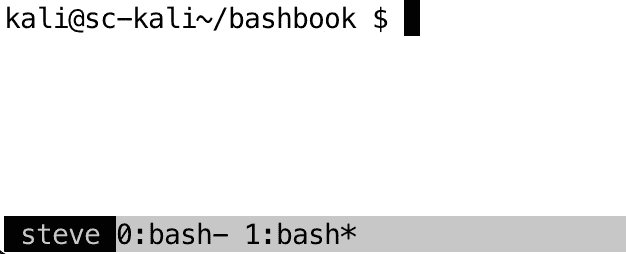

图 10.3 – 在 tmux 会话中创建一个新窗口

**tmux**能够根据运行的命令重命名窗口。但是，如果您想手动重命名窗口，请使用*Ctrl* + *b*，*，*（按下*Ctrl* + *b*组合键，释放键，然后按*，*（逗号）键），然后输入所需的名称和*Enter*键。请注意，当前窗口现在被命名为**foo**：

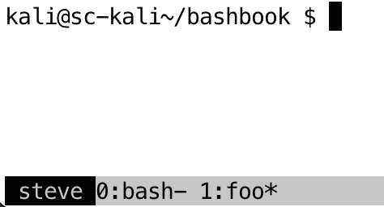

图 10.4 – 当前窗口已重命名

要在窗口之间切换，请按*Ctrl* + *b* + *n*切换到下一个窗口，或者*Ctrl* + *b* + *[窗口号]*切换到特定窗口。**tmux**还可以将终端分割成多个窗格。要查看默认热键，请在 Bash shell 中输入**man tmux**。如果尚未安装**tmux**，可以使用**sudo apt update && sudo apt install** **tmux**命令进行安装。

现在我们已经设置好了渗透测试系统并熟悉了基本工具，让我们开始扫描吧！

## 使用 Nmap 进行基本网络扫描

在*第六章*中，您学习了如何使用 Bash 进行非常基本的端口扫描。这些概念在您处于受限网络环境且无法安装标准扫描工具（如 Nmap）的情况下非常有用。然而，在进行网络渗透测试扫描时，纯 Bash 端口扫描工具不会是我的首选工具。在这里，我们将开始使用 Nmap 和 Masscan。

以下命令是最基本的 Nmap 扫描示例：

```
 $ nmap 10.2.10.0/24
```

请注意，您的 GOAD 环境中的 IP 地址可能与此处显示的示例不同。

以下图显示了此扫描的部分输出：

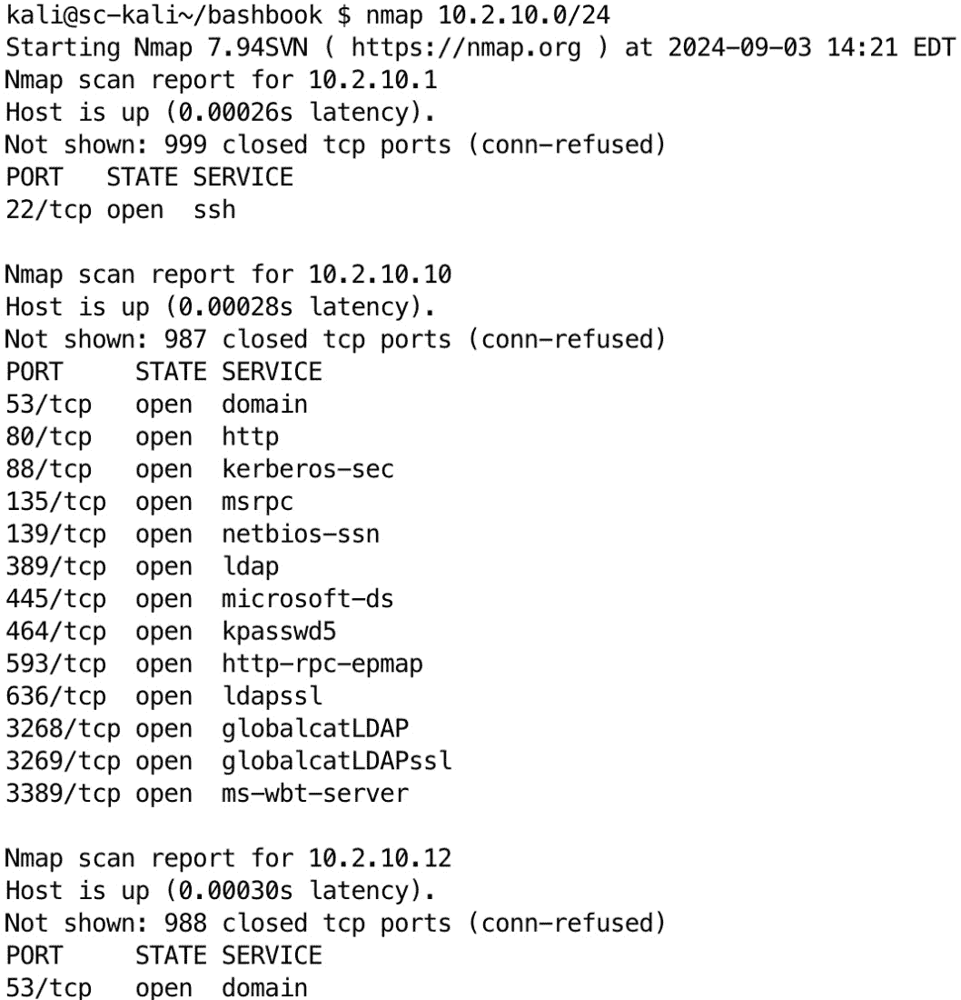

图 10.5 – 基本 Nmap TCP 端口扫描的部分输出

请注意，在上图中显示了非常基本的信息。每个端口的输出列出了该端口号的默认服务。由于我们没有使用任何其他扫描标志，Nmap 默认使用连接扫描（**-sT**），并且没有执行服务指纹识别，并且输出没有保存到文件中。

先前的扫描显示了默认的 TCP 扫描。要扫描 UDP 端口，请使用**-sU**标志，如下所示：

```
 $ sudo nmap -sU 10.2.10.0/24
```

UDP 扫描的输出可以在以下图中看到：

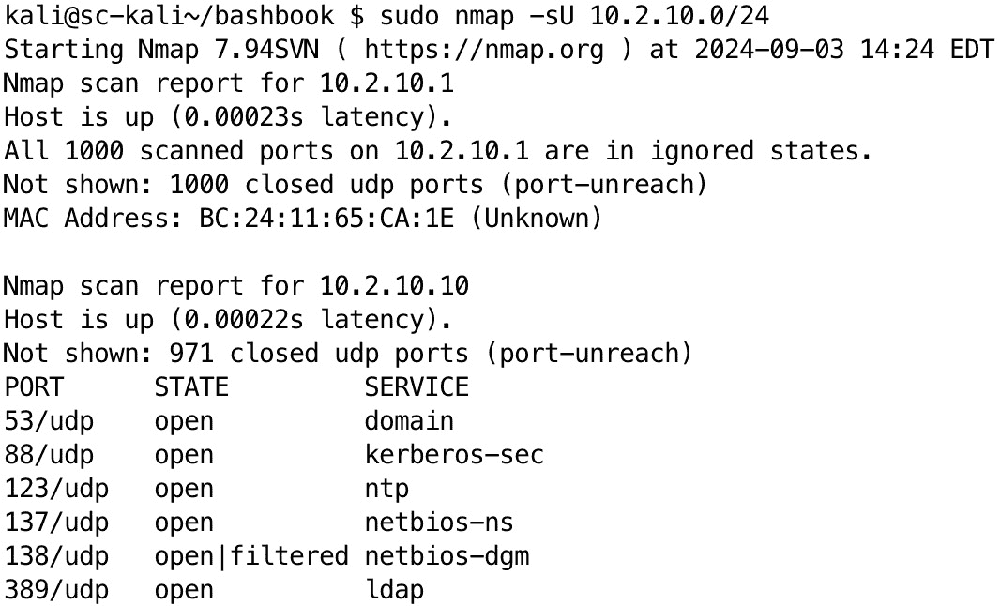

图 10.6 – 使用 Nmap 进行基本 UDP 端口扫描的部分输出

我们将在下一节中探讨更高级的用法。

## 使用 Masscan 进行快速网络扫描

另一个流行的端口扫描工具是 Masscan，这是一个极快的端口扫描工具。它可以在几分钟内扫描整个互联网。

Nmap 比 Masscan 功能更全面；但是，通过包括 **--rate** 选项，Masscan 可以执行更快的扫描。是的，Nmap 也可以调整扫描速度；但是，Masscan 可能更快。请注意此选项，因为可能会压垮路由器和交换机等网络设备。在进行渗透测试开始前，与项目利益相关者进行 *启动会议* 时，应询问是否将扫描过时的网络设备，这些设备可能无法承受高吞吐量。

在以下图中可以找到基本的 Masscan 示例：


图 10.7 – 示例 Masscan 扫描的部分输出

在非常大的网络上，我经常使用 Masscan 发现活动主机的列表，然后将其提供给另一个更高级的扫描。以下是我用来发现活动主机的 **masscan** 命令：

```
 $ sudo masscan -p 22,445 --open -oL [outputfile] -iL [inputfile] --rate=5000
```

让我们分解开来以理解它：

+   **-p 22,445** ：在内部网络上，每个 Linux 主机将会暴露端口 **22**（SSH），每个 Windows 主机将会暴露端口 **445**（SMB）。

+   **--open** ：我们指定 **open**，因为我们不想看到关闭或筛选的端口。

+   **-oL [outputfile]** ：我们指定保存结果的文件名以列表格式。其他可能的输出格式包括 JSON、NDJSON、Grepable、Binary、XML 和 Unicorn。

+   **-iL [inputfile]** ：我们指定包含在范围内网络的 **scope.txt** 文件。

+   **--rate=5000** ：这以每秒 5,000 个包的速率发送 TCP *SYN* 包。

在我运行 GOAD 和 Vulhub 的实验室网络上，我的扫描输出如下图所示：

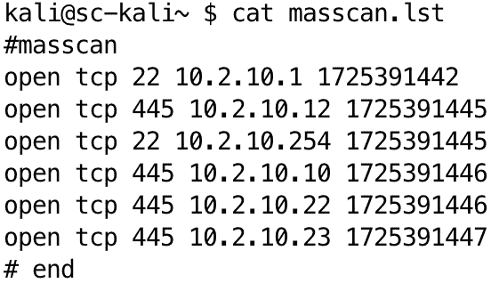

图 10.8 – Masscan 主机发现输出文件内容

## 使用 Bash 处理扫描结果

要仅显示活动主机，请输入以下命令：

```
 $ awk '$1 == "open" { print $4 }' masscan.lst | sort -uV > livehosts.txt
```

这里是解释：

+   **'** ：单引号字符开始并结束 **awk** 命令块。

+   **$1 == "open"** ：第一列是单词 **open**，如在 *图 10.8* 中所见。从 *第四章* 中记得，**awk** 默认在空白字符（包括空格和制表符）上分隔列。如果列用制表符分隔，该命令仍然有效。否则，包括 **-F** 选项指定不同的字段分隔符。

+   **{ print $4 }** ：打印第四列。

+   **masscan.lst** ：我们希望使用该命令解析的 Masscan 输出文件。

+   **| sort -uV** ：我们将 **awk** 命令的输出导管到排序，指定排序选项为唯一（ **-u** ）和版本（ **-V** ）。

+   **> livehosts.txt** ：我们将前述命令的输出从 **stdout** 重定向到文件。

小贴士

**sort -V**（版本）选项对于排序 IP 地址和版本号很有用。

如果将输出移除到文件并打印到 **stdout**，输出如下所示：


图 10.9 – 我们唯一的已排序活跃 IP 地址列表

将*图 10.8*（未排序）与*图 10.9*（已排序）中的输出进行比较，你可以看到**sort -V**选项对于排序版本号、IP 地址或任何由数字组成并以点分隔的字符串是非常有用的。

现在，你已经有了一个活跃主机的列表，这在扫描非常大的网络时节省了宝贵的时间。

## 结论

这部分内容总结了 Bash 网络渗透测试的基础知识。通过本节的基本概念，加上我们在*第六章*中讨论的网络和基础端口扫描内容，下一节将学习更高级的扫描技术。

# Bash 中的高级网络扫描技术

本节将更深入地讲解，演示一些 Nmap 的最常用高级选项。然后，我们将继续讲解如何解析报告输出。

这是我在网络渗透测试中最常使用的 Nmap 扫描命令：

```
 $ sudo nmap -sS -sV -sC -p 21,22,23,25,53,80,81,88,110,111,123,137-139,161,389,443,445,500,512,513,548,623-624,1099,1241,1433-1434,1521,2049,2483-2484,3268,3269,3306,3389,4333,4786,4848,5432,5800,5900,5901,5985,5986,6000,6001,7001,8000,8080,8181,8443,10000,16992-16993,27017,32764 --open -oA [output file] -iL [input file] --exclude-file [exclude file]
```

下面是解释：

+   **-sS** ：*SYN* 扫描，或半开放扫描。这仅发送 TCP 握手的第一部分，扫描速度比默认的连接扫描（**-sT**）要快，后者完成了 TCP 三次握手。

+   **-sV** ：版本扫描会指纹识别服务名称和版本，而不是默认的，仅打印与端口号关联的默认服务名称。

+   **-sC** ：对所有开放端口运行 Nmap 脚本。这些脚本的输出通常会揭示出重要的信息，甚至是可利用的信息。

+   **-p [端口列表]** ：要扫描的端口列表。这些是我根据经验发现最常见的可利用端口。如果你正在扫描单个主机或少量主机，或者你绝对需要找到所有开放端口，可以使用**-p-**，这是表示所有端口的简写。

+   **--open** ：只记录开放端口；不显示输出中的关闭或过滤端口。

+   **-oA [输出文件]** ：**A**选项代表所有格式。如果你将输出文件命名为**nmapquick**，扫描完成后你会在当前目录下找到以下三个输出文件：**nmapquick.nmap**，**nmapquick.gnmap**，和**nmapquick.xml**。

+   **-iL [输入文件]** ：包含要扫描的 IP 地址、网络地址或主机名的文件。

+   **--exclude-file [排除文件]** ：包含要从扫描中排除的 IP 地址、网络地址或主机名的文件。请参见你的渗透测试的*参与规则*文档，查找任何需要排除的主机列表。

在扫描输出中，我们查看以下图中的一台主机：

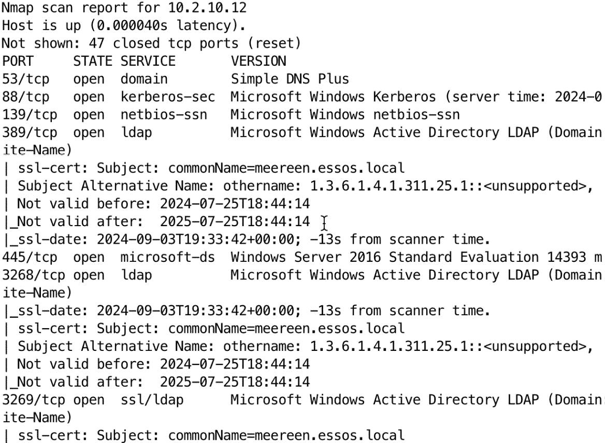

图 10.10 – 我们对单个主机的扫描结果

Nmap 脚本输出可以通过虚线和它们包含的输出在图中看到。这显示了主机名和服务版本。此外，我们可以猜测这是一个活动目录域控制器，因为它运行 Microsoft Windows，并且端口**53**、**88**、**3268**和**3269**是开放的。

扫描可能是快速和彻底之间的权衡。例如，在我们上次运行的扫描中，指定了有限数量的常见端口，对主机**10.2.10.1**的输出显示了一个开放端口，如下图所示：

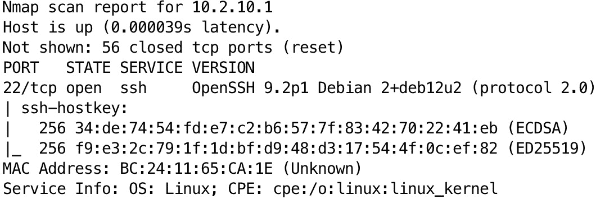

图 10.11 – 使用有限数量的常见端口进行 Nmap 扫描输出

如果我们使用**-p-**（所有端口）选项重新扫描此主机，我们会发现该主机实际上有七个开放端口，其中一些运行着易受攻击的应用程序。此示例说明了快速和彻底扫描之间的区别。在测试小型网络时，我通常会扫描所有端口。如果我要测试一个大型网络，我会运行一个快速扫描，指定一定数量的端口，并在处理扫描结果时，我会启动针对所有端口的第二次扫描，预计需要一天或更长的时间才能完成。

现在您已经对不同的端口扫描技术有了牢固的掌握，让我们继续下一节，探索各种可利用的网络协议。

# 使用 Bash 枚举网络服务和协议

我在每次网络内扫描测试中都执行网络数据包捕获。我寻找默认的**热备用路由器协议**（**HSRP**）默认密码**'cisco'**，没有相应提供的 DHCPv6 发现广播，以及广播或多播协议，如 LLMNR、NBT-NS 和 MDNS，这些协议可以生成密码哈希或被中继到其他系统进行破解。

下面的代码可以在本章的 GitHub 页面上找到，命名为**packetcap.sh**：

```
 #!/usr/bin/env bash
if [ "$#" -ne 1 ]; then
  echo "You must specify a network adapter as an argument."   echo "Usage: $0 [network adapter]"
  exit 1
fi
```

第一个代码块是熟悉的 shebang，后面是一个**if**语句，如果没有提供正好一个参数，就会打印使用信息并退出。

```
 echo "[+] Please wait; capturing network traffic on $1 for 2.5 minutes." sudo timeout 150 tcpdump -i "$1" -s0 -w packetcapture.pcap
```

此代码块让用户在运行 tcpdump 两分半钟之前知道发生了什么。在**sudo**之后，**tcpdump**之前的**timeout 150**命令运行**tcpdump** 150 秒然后退出。

```
 echo "[+] Testing for default HSRP password 'cisco'..." tcpdump -XX -r packetcapture.pcap 'udp port 1985 or udp port 2029' | grep -B4 cisco
```

此代码块检测使用默认**'cisco'**密码的明文 HSRP 广播。如果您知道此密码，您可以操纵 HSRP 选举过程并接管默认路由器，并对所有流量执行**中间人攻击**（**MITM**）。

提示

如果在网络中检测到使用默认的 HSRP 密码，我建议您不要尝试对其执行 MITM 攻击。如果您不在现场与运行攻击的系统一起并且失去了网络连接，您可能会导致网络拒绝服务，而您也不在那里停止它。这是非常危险的利用。最好是报告并继续前进。

在下一个代码块中，我们开始测试 **IP 第六版** (**IPv6**) 网络流量：

```
 echo "[+] Testing for DHCPv6." echo "[+] If detected, try mitm6!" tcpdump -r packetcapture.pcap '(udp port 546 or 547) or icmp6'
sudo rm packetcapture.pcap
```

这一代码块测试 DHCPv6 流量。如果你看到没有响应的 DHCPv6 discover 广播，网络很可能会受到攻击，可以运行 mitm6 工具并捕获密码哈希。

```
 echo "[+] Please wait; running Responder for 5 minutes." echo "[+] If hashes are captured, crack them or run Responder again with impacket-ntlmrelayx to relay." responder=$(sudo timeout 300 responder -I "$1")
cat /usr/share/responder/logs/Responder-Session.log
```

这一代码块在子 Shell 中运行 *Responder* 工具，这样你就看不到输出。然后，它会打印 **Responder-Session** 日志中的任何内容。你可能会在输出中看到密码哈希或明文密码。

下图展示了脚本执行的过程。这里显示了脚本输出的开始：


图 10.12 – 启动网络嗅探脚本

在输出的后面，你会看到密码哈希打印到屏幕上。这是一个 NTLMv2 密码哈希，你应该尝试使用 **hashcat** 破解它。你也可以重新配置 **Responder**，然后重新运行它，并与 **impacket-ntlmrelayx** 一起中继到其他系统，以运行命令或转储凭据。


图 10.13 – Responder 捕获密码哈希

接下来，让我们尝试使用 **hashcat** 破解它们。在运行以下命令之前，先将这些哈希复制并保存到一个文件中。然后，按以下命令运行 **hashcat**：

```
 $ sudo hashcat -m 5700 hashes.txt /usr/share/wordlists/rockyou.txt.gz
```

下图显示了我们破解了其中一个密码哈希！


图 10.14 – 使用 Hashcat 破解 NTLMv2 密码哈希

提示

你不仅仅局限于破解这些协议中的密码哈希；你还可以中继它们。搜索互联网了解更多关于 **relay LLMNR** 的信息。

不要忽视你网络中的这些协议。虽然它们不是可以直接指向漏洞并获得 Shell 的监听服务，但它们是 *危险的默认* 协议，通常可以在任何 Windows 域中广播，并且通常是攻击系统的最快方式。

在下一节中，我们将探索如何使用 Bash 与漏洞评估和利用工具。

# 使用 Bash 进行基础设施漏洞评估

评估基础设施漏洞是保持网络安全的关键步骤。通过 Bash，我们可以利用强大的工具来自动化网络主机发现和漏洞扫描，简化评估过程。本节介绍了两种重要技术：使用 NetExec 识别网络主机和使用 Greenbone 自动化漏洞扫描。每种技术都提供了一种务实的方式，通过减少人工操作、提高效率和准确性，改善你的安全态势。

## 使用 NetExec 枚举网络主机

从未验证的角度出发，我们将检查 TCP 端口 **445**，因为它历来存在许多漏洞，并且可能提供大量信息。我们将使用 NetExec 工具来枚举网络主机。

首先，让我们尝试使用 SMB 空会话枚举 SMB 共享。运行以下命令，将网络地址替换为您实验室实例的适当地址：

```
 $ netexec smb 10.2.10.0/24 -u a -p '' --shares
```

这是解释：

+   **netexec smb** : 在这里，我们指定 NetExec 要使用的协议。**netexec** 命令支持多种协议，包括 SMB。

+   **10.2.10.0/24** : 目标位于 **netexec** 和协议后面。目标可以是 IP 地址、主机名、网络地址，或者包含目标的文件（每行一个目标）。

+   **-u a -p ''** : 我们指定了一个随机用户名（**a**），后跟一个空密码（**''**）。

+   **--shares** : 这是一个 **netexec** 命令，用于枚举 SMB 共享。

以下图显示了输出：


图 10.15 – 使用 NetExec 执行 SMB 空会话 SMB 共享枚举。

请注意，这是一个裁剪过的截图，并未显示每个系统的主机名或 IP 地址。如果不裁剪图片，文本会变得太小，难以阅读。请注意我们在前面的图中显示的读写权限。在这种情况下，我建议您花时间连接到这些 SMB 共享并寻找有趣的信息，例如文件中的密码。

接下来，让我们尝试使用 SMB 空会话枚举用户。运行以下命令：

```
 $ netexec smb 10.2.10.0/24 -u a -p '' --users
```

这个命令与之前的命令唯一的区别在于，我们将共享（**--shares**）改为用户（**--users**）。我们检查输出并发现我们在枚举用户时没有成功。在放弃之前，让我们按以下方式修改命令并再次尝试：

```
 $ netexec smb 10.2.10.0/24 -u '' -p '' --users
```

在这里，除了指定用户名，我们使用了一个空的用户名。

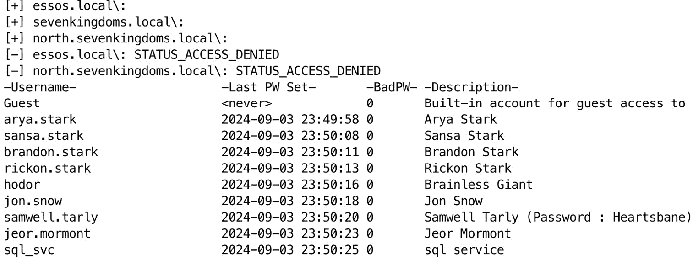

图 10.16 – 使用 SMB 空会话列出域用户

那么为什么指定一个无效用户名的某种方法失败了，而另一个成功了呢？不深入探讨我们 Bash 主题的前提下，这是因为该工具所使用的库如何验证 Microsoft Windows SMB 共享。这个问题留给你作为练习。我只是希望你注意到这个怪癖。

使用这些用户名，您可以使用 NetExec 执行密码喷射攻击，尝试常见密码，或许能幸运地猜中。但是，您真的需要进行密码喷射吗？去再看看 *图 10.16*，检查 **描述** 列。你看到 Samwell Tarly 的密码了吗？你会惊讶地发现，普通企业网络中这种情况发生得多么频繁！许多系统管理员没有意识到，空会话和无权限用户可以看到这些信息。让我们测试这个密码，正如下图所示：


图 10.17 – 使用 NetExec 测试凭证

在前面的图中，我们看到 Samwell Tarly 的凭证已通过身份验证连接到三个系统，但该账户在任何系统上都不是管理员，否则输出将显示**Pwn3d!**。我们可以对这些凭证做更多的事情。我将留给你一个练习，使用**netexec**命令配合**--help**和**-L**（列出模块）选项来探索可用的命令和模块。

提示

如果你在自己的 GOAD 实验室中进行操作，查看一下**petitpotam** SMB 模块。

接下来，我们将深入探讨如何从 Bash shell 进行漏洞扫描。

## 使用 Greenbone 自动化漏洞扫描

市场上有许多顶级的漏洞扫描产品，所有这些产品都有一个 Web 界面。然而，你应该学习如何从 Bash shell 自动化这些扫描，以节省宝贵的时间。当我负责全球公司企业漏洞扫描时，我使用 Bash shell 与扫描器 API 进行交互，尽可能地自动化我的工作，包括收集统计数据以生成自定义报告。

我们将使用 Greenbone Community Edition，前身为 OpenVAS。如果你想在自己的实验室中跟随操作，你应该首先查看*技术要求*部分，如果你还没有安装 Greenbone 的话。

创建扫描目标，如图所示，将密码和网络替换为你自己的值：

```
 $ sudo -u _gvm gvm-cli --gmp-username admin --gmp-password [password] socket --xml "<create_target><name>My Target</name><hosts>10.2.10.0/24</hosts><port_range>1-65535</port_range></create_target>"
```

该命令的输出可以在下图中找到：


图 10.18 – 在 GVM 中创建扫描目标

从创建目标时复制目标 ID 输出，创建一个用于快速完整扫描的任务，如下所示：

```
 $ sudo -u _gvm gvm-cli --gmp-username admin --gmp-password [password] socket --xml "<create_task><name>My Task</name><comment>Scanning 10.2.10.0/24</comment><config id='daba56c8-73ec-11df-a475-002264764cea'/><target id=29590015-db97-4d3e-8aab-694abb3b1c4c/></create_task>"
```

该命令的输出可以在下图中找到：


图 10.19 – 在 GVM 中创建一个扫描任务进行演示

使用前一个命令响应中的任务 ID 启动任务：

```
 $ sudo -u _gvm gvm-cli --gmp-username admin --gmp-password [password] socket --xml "<start_task task_id=abc324d4-7464-4415-8a77-de8dfa13606b'/>"
```

该命令的输出可以在下图中找到：


图 10.20 – 在 GVM 中启动任务

使用如下命令检查任务状态：

```
 $ sudo -u _gvm gvm-cli --gmp-username admin --gmp-password [password] socket --xml "<get_tasks task_id=7f6996b2-bdf5-49e8-8bb0-699cad0778ec'/>" | xmllint --format -
```

该命令的输出可以在下图中找到：

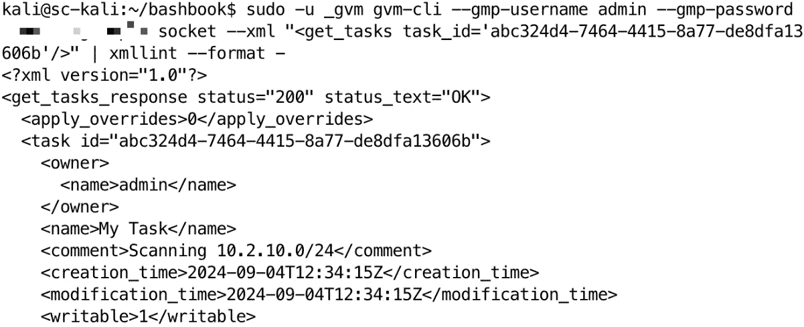

图 10.21 – 演示检查扫描任务状态

使用前一个命令输出中的报告 ID 下载报告，如下所示：

```
 $ sudo -u _gvm gvm-cli --gmp-username admin --gmp-password [password] socket --xml "<get_reports report_id='7c39338b-8c15-4e3a-93ff-bca125ff2ddf' format_id='c402cc3e-b531-11e1-9163-406186ea4fc5'/>" > scan_result.xml
```

接下来，让我们创建一个脚本来自动化这个过程并解析报告。以下代码可以在本章的 GitHub 仓库中找到，名为**ch10_gvm_scan.sh**：

```
 #!/usr/bin/env bash
# User and argument validation
if [ "$(whoami)" != "_gvm" ]; then
  echo "This script must be run as user _gvm."   exit 1
fi
```

上面的代码块以熟悉的 shebang 行开始。接下来，它检查运行脚本的用户是否是**_gvm**用户，这是在**gvm**安装过程中创建的用户。如果不是以该用户身份运行，脚本将退出。

```
 if [ $# -lt 2 ]; then
  echo "Usage: $0 <password> <target_host>"
  exit 1
fi
```

如果参数少于两个，脚本会退出。

```
 password="$1"
target_host="$2"
```

在前面的代码中，我们将第一个参数赋值给**password**变量，将第二个参数赋值给**target_host**变量。

```
 # Generate target name
target_name=$(echo -n "$target_host" | sed 's/\//_/g')
```

在这里，我们仅仅是将目标中的任何**/**字符替换为下划线。

```
 # Create target
echo "[+] Creating target"
target_id=$(gvm-cli --gmp-username admin --gmp-password "$password" socket --xml "<create_target><name>$target_name</name><hosts>$target_host</hosts><port_range>1-65535</port_range></create_target>" | grep -o 'id="[^"]*"' | sed -e 's/id="//' -e 's/"//')
if [ -z "$target_id" ]; then
  echo "[-] Failed to create target"
  exit 1
fi
```

上述代码块在 GVM 系统中创建一个目标：

1.  它使用**gvm-cli**发送 XML 请求来创建目标。

1.  目标通过指定的名称、主机和端口范围创建。

1.  它从响应中提取目标 ID。

1.  如果目标创建失败（**target_id**为空），脚本会退出。

以下代码将创建一个扫描任务：

```
 # Create task
echo "[+] Creating task"
task_id=$(gvm-cli --gmp-username admin --gmp-password "$password" socket --xml "<create_task><name>Task_$target_name</name><comment>Scanning $target_host</comment><config id='daba56c8-73ec-11df-a475-002264764cea'/><target id='$target_id'/></create_task>" | grep -o 'id="[^"]*"' | sed -e 's/id="//' -e 's/"//')
if [ -z "$task_id" ]; then
  echo "[-] Failed to create task"
  exit 1
fi
```

本部分在 GVM 系统中创建一个任务：

1.  它使用**gvm-cli**发送 XML 请求来创建任务。

1.  任务创建时会包含名称、评论、配置以及之前创建的目标。

1.  它从响应中提取任务 ID。

1.  **grep -o 'id="[^"]*"'** 命令会在输入文本中搜索所有出现的 **pattern id="[^"]*"**，并仅输出匹配的部分：

    +   **id="** 匹配字面字符串，**id="**。

1.  **[^"]*** 匹配零个或多个不是双引号（**"**）的字符。**[^"]** 是一个否定字符类，意味着任何字符都可以是除**"**之外的字符。

    +   **"** 匹配关闭双引号。

1.  如果任务创建失败（**task_id**为空），脚本会退出。

接下来，我们需要开始扫描，如下所示：

```
 # Start task and wait for completion
echo "[+] Starting task"
report_id=$(gvm-cli --gmp-username admin --gmp-password "$password" socket --xml "<start_task task_id='$task_id'/>" | grep -oP '(?<=<report_id>).*?(?=</report_id>)')
```

上述代码使用从之前的命令中捕获的变量启动扫描任务，并从响应中提取**report_id**：

+   **(?<=<report_id>).*?(?=</report_id>)** : 这是使用的正则表达式。

+   **(?<=<report_id>)** : 这是一个正向回溯断言。

+   **(?<=...)** : 该语法指定了一个向后查找，确保当前位置之前的内容是指定的模式，**<report_id>**。

+   **<report_id>** : 这是必须在匹配之前出现的字面字符串。

+   **.*?** : 这是一个非贪婪匹配，匹配任何字符序列。

+   **.** : 这匹配除换行符外的任何字符。

+   ***?** : 这匹配零个或多个前面的元素（此处是**.**），但以非贪婪（或懒惰）的方式进行匹配，即它将尽可能少地匹配字符。

+   **(?=</report_id>)** : 这是一个正向预查断言。

+   **(?=...)** : 该语法指定了一个向前查找，确保当前位置后面的内容是指定的模式，**</report_id>**。

+   **</report_id>** : 这是必须紧随匹配后的字面字符串。

下一个代码部分每隔 60 秒检查一次任务是否完成：

```
 # Wait for task to complete
echo "[-] Waiting for scan result. This may take a while." while true; do
    output=$(gvm-cli --gmp-username admin --gmp-password "$password" socket --xml "<get_tasks task_id='$task_id'/>" 2>/dev/null | xmllint --format -)
    if echo "$output" | grep -q '<status>Done</status>'; then
        break
    fi
    sleep 60
done
echo "[+] The scan is complete."
```

上述代码开始了一个**while**循环。**gvm-cli**命令的输出通过管道传输给**xmlstarlet**逐行打印，并保存到**output**变量中。如果输出状态确认已完成，则退出循环。否则，程序会暂停一分钟后重新开始循环。

```
 # Create report
echo "[+] Printing scan results..." gvm-cli --gmp-username admin --gmp-password "$password" socket --xml "<get_results task_id=\"$task_id\" filter='notes=1 overrides=1'/>" |\
xmlstarlet sel -t -m "//result" \
  -v "host" -o "|" \
  -v "host/hostname" -o "|" \
  -v "port" -o "|" \
  -v "threat" -o "|" \
  -v "name" -o "|" \
  -v "severity" -n |
sort -t'|' -k6,6nr |
awk -F'|' '{printf "%s\t%s\t%s\t%s\t%s\n", $1, $2, $3, $4, $5}'
```

前面的代码块请求扫描任务中检测到的扫描结果（漏洞）。它将输出通过管道传递给**xmlstarlet**，以解析 XML 内容并输出最感兴趣的部分。最后，它根据第六列（**severity**）进行排序，并使用制表符（**\t**）分隔符打印数据字段：

+   **xmlstarlet**是一个命令行工具，用于解析、查询、转换和编辑 XML 文件。它可以用来从 XML 文档中提取特定数据，修改 XML 结构，并执行各种与 XML 相关的任务。

+   **sel -t**：这是*select*的缩写。它表示我们正在使用选择子命令来查询 XML 数据。**-t**表示*template*。它用于定义输出模板。

+   **-m "//result"**：这代表*match*。它指定一个 XPath 表达式，用于从 XML 文档中选择节点。

+   **//result**：这个 XPath 表达式选择 XML 文档中所有的 result 元素，无论它们在层次结构中的位置如何。

+   **sort -t'|' -k6,6nr**：**-k**选项指定要排序的关键字（字段），而**nr**后缀表示排序类型（数字排序并按逆序排列）。

+   **-k6,6**：此选项告诉**sort**使用第六个字段作为排序的关键字。**6,6**语法意味着它应从第六个字段开始并在第六个字段结束进行排序。

+   **awk -F'|' '{printf "%s\t%s\t%s\t%s\t%s\n", $1, $2, $3, $4, $5}'**：这段代码确定了数据的打印方式：

    +   **-F**：此选项告诉**awk**使用特定字符作为字段分隔符。

    +   **'|'**：管道符号被指定为分隔符。这意味着**awk**将把管道符号之间的文本视为独立的字段。

    +   **{ ... }**：包围要对每一行输入执行的操作。

    +   **printf**：**awk**（以及许多编程语言）中的一个函数，用于格式化输出。

    +   **"%s\t%s\t%s\t%s\t%s\n"**：这个格式字符串告诉**printf**输出五个字符串字段（**%s**），每个字段后跟一个制表符（**\t**），并以换行符（**\n**）结束这一行。

    +   **$1, $2, $3, $4, $5**：这些是**awk**中的字段变量。**$1**表示第一个字段，**$2**表示第二个字段，以此类推。由于字段分隔符是管道符（**|**），这些变量对应于管道符之间的数据。

脚本必须以**_gvm**用户身份运行。当我们在脚本中为每个命令加上**sudo**前缀时，由于某些步骤之间有足够的时间，系统会在你离开时提示你输入凭证，而你可能没有意识到它在等待你的输入。相反，我们将脚本前缀加上**sudo -u _gvm**，因此在运行脚本之前，你需要执行以下命令来设置目录和文件权限：

```
 $ mkdir ~/shared_scripts
$ cp ch10_gvm_scan.sh ~/shared_scripts
$ sudo chmod 775 /home/kali/shared_scripts
$ sudo chown -R kali:_gvm /home/kali/shared_scripts
```

让我们来看看解释：

1.  我们使用**mkdir**命令创建了一个新目录。

1.  脚本被复制到新目录中。

1.  目录权限已更改，用户和组的权限设置为 **7**。用户和组的权限数字 **7** 代表读取 (4)、写入 (2) 和执行 (1)（*4 + 2 + 1 = 7*），而其他权限设置为读取 (4) 和执行 (1)（*4 + 1 =* *5*）。

1.  最后，所有者递归地更改为 **kali** 用户和 **_gvm** 组，适用于新目录及目录中的所有文件。

以下图示演示了如何运行脚本并展示了脚本输出：

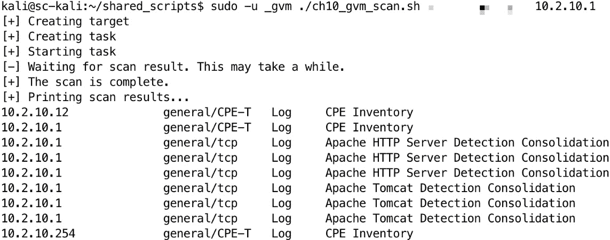

图 10.22 – 展示了 Greenbone 扫描脚本并显示扫描结果

你可以在 https://docs.greenbone.net/GSM-Manual/gos-22.04/en/gmp.html#starting-a-scan-using-the-command-gvm-cli 学习更多关于 **gvm-cli** 的使用。

本节结束时，我们重点讨论了漏洞扫描的自动化。我们的注意力和专注力是有限的。始终自动化那些琐碎、可重复的任务，这样你就能有更多时间专注于仔细审查扫描结果，发现可以利用的漏洞。

# 概述

本章探讨了使用 Bash 脚本进行网络渗透测试和自动化的主题。我们深入探讨了端口扫描，从基本的命令行选项到必要的高级技术，以优化结果的速度和深度。我们讨论了常见的网络协议的发现，这些协议常常被攻击者利用。最后，我们深入研究了网络漏洞扫描工具的自动化。

下一章将聚焦于 Bash 环境中的后渗透特权提升技术。当远程网络服务被利用时，通常会导致非 root 的 shell。在 *第十一章* 中，我们将深入探讨如何在 Bash shell 中枚举 Linux 系统，以提升权限并完成系统接管。
