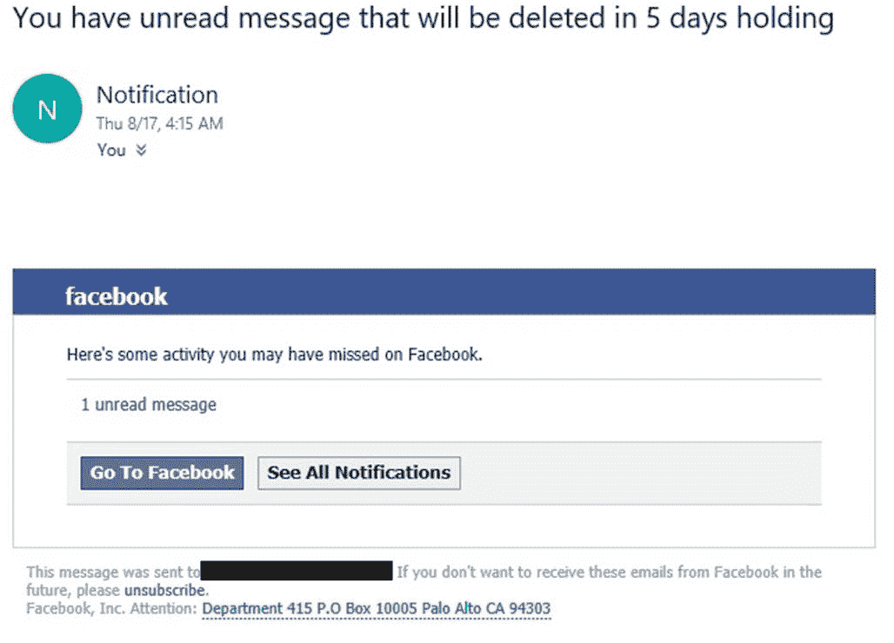
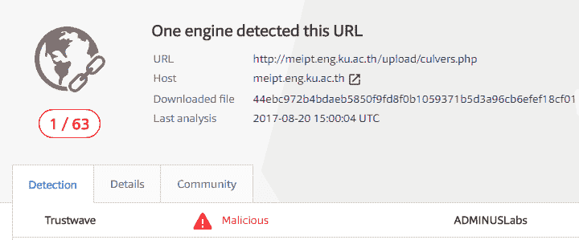
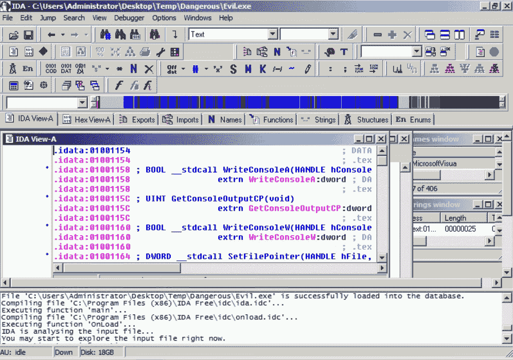
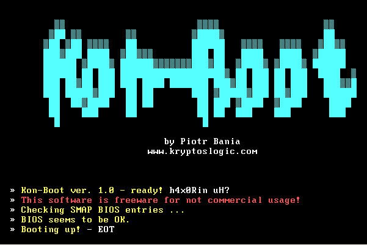
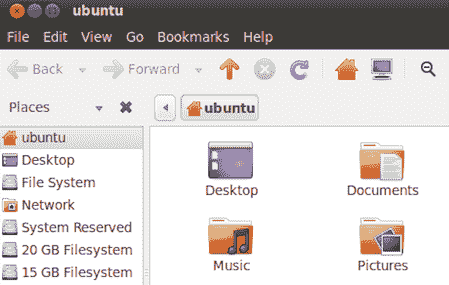
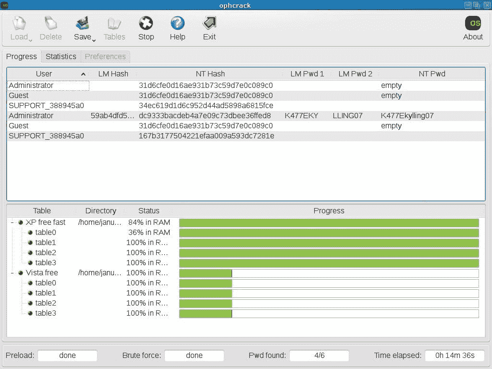
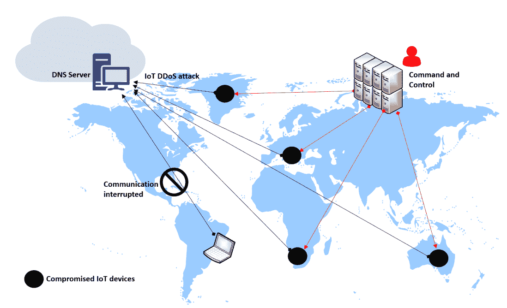

# 攻击系统

上一章让你对攻击的前兆有了初步了解。它讨论了用于收集关于目标信息的工具和技术，以便攻击可以被规划和执行。它还涉及了外部和内部侦察技术。本章将讨论在侦察阶段收集目标信息后，实际攻击是如何进行的。它将讨论黑客在选择攻击工具、技术和目标时的明显趋势。它还将讨论如何设计网络钓鱼攻击以执行实际攻击，零日漏洞的利用，以及黑客如何发现这些漏洞的方法。最后，本章将详细讨论如何逐步进行计算机、服务器和网站攻击。

话题大纲如下：

+   分析当前趋势

+   网络钓鱼

+   利用漏洞

+   零日漏洞

+   执行攻陷系统的步骤

    +   部署有效载荷

    +   攻击操作系统

    +   攻击远程系统

    +   攻击基于网页的系统

# 分析当前趋势

随着时间的推移，黑客已经向网络安全专家证明，他们的攻击变得更加持久、富有创意并且日益复杂。他们学会了如何适应 IT 环境的变化，以便在发起攻击时始终保持有效。尽管没有摩尔定律，或者在网络攻击的背景下没有类似的规律，但可以说，黑客技术每年都在变得更加复杂。在过去的几年里，关于首选攻击方式和执行模式有了一些明显的趋势。这些趋势包括：

# 勒索攻击

之前，在大多数情况下，黑客通过出售企业被窃取的数据赚取收入。然而，在过去三年中，黑客们开始使用另一种策略：直接从受害者那里勒索钱财。他们可能会将计算机文件作为人质，或者威胁公开泄露关于受害者的有害信息。在这两种情况下，他们都要求在某个截止日期前支付赎金。最著名的勒索尝试之一是 2017 年 5 月爆发的 WannaCry 勒索病毒。WannaCry 勒索病毒感染了 150 多个国家的数十万台计算机。从俄罗斯到美国，整个组织在用户被锁定加密数据后陷入停顿。勒索病毒要求受害者在 72 小时内支付 300 美元到一个比特币地址，否则赎金将翻倍。如果未在 7 天内付款，还会有严厉的警告，文件将被永久锁定。

据报道，由于其代码中包含了一个“杀死开关”，WannaCry 勒索病毒仅赚取了 50,000 美元。然而，它有潜在的巨大破坏力。专家表示，如果代码中没有“杀死开关”，该勒索病毒可能至今仍在传播，或者已经导致许多计算机被感染。在 WannaCry 得到缓解后不久，一种新的勒索病毒被报告出现。该勒索病毒袭击了乌克兰的计算机，受影响的数量据报道在几万台左右。俄罗斯也受到影响，用于监控切尔诺贝利核电站的计算机被攻击，导致现场工作人员不得不转而使用非计算机化的监控方式，例如观察。一些美国和澳大利亚的公司也受到了影响。

在这些国际事件发生之前，已经有不同公司出现了本地和孤立的勒索病毒事件。除了勒索病毒外，黑客还通过威胁攻击网站进行勒索。Ashley Madison 事件就是这一类型勒索的一个典型例子。在勒索未成功后，黑客曝光了数百万人的用户数据。网站的所有者没有认真对待黑客的威胁，因此没有支付赎金，也没有按照要求关闭网站。黑客在公开发布注册在该网站上的用户详情后，实际履行了他们的威胁。一些用户使用工作信息注册，例如工作邮箱。7 月，公司确认已提出支付 1100 万美元，以赔偿 3600 万用户的数据泄露。2015 年，阿联酋一家名为 Sharjah 的银行也面临了类似的勒索案件。黑客将用户数据作为勒索目标，要求银行支付 300 万美元。黑客在数小时后定期在 Twitter 上发布一些用户数据。银行也淡化了这些威胁，甚至让 Twitter 封锁了他所用的账户。然而，这一暂时的缓解很快被打破，黑客创建了一个新账户，并出于报复发布了包含账户持有者个人信息、交易记录以及他们与之交易的实体细节的用户数据。黑客甚至通过短信联系了一些用户。

这些事件表明勒索攻击正在上升，并且已成为黑客的首选手段。黑客通过入侵系统，目标是尽可能多地复制数据，然后成功将其勒索赎金，金额巨大。从后勤角度来看，这被认为比将盗取的数据转售给第三方更简单。黑客还能够通过谈判获取更多赎金，因为他们所持有的数据对数据所有者的价值高于对第三方的价值。像勒索病毒这样的勒索攻击也变得更加有效，因为几乎没有解密的解决办法，除非支付赎金。

# 数据篡改攻击

黑客入侵系统的另一个明显趋势是通过操控数据而不是删除或释放数据。这是因为这种攻击破坏了数据的完整性。没有什么比让目标不再信任自己数据的完整性更能给其带来痛苦的了。数据操控有时可能非常简单，仅改变一个值，但其后果可能深远。数据操控通常很难被检测到，黑客甚至可能操控备份存储中的数据，确保无法恢复。在一个真实的案例中，已知中国间谍曾攻击美国防承包商的网络窃取蓝图。然而，（22）人们担心他们可能还操控了承包商使用的数据。这可能反过来破坏美国供应的武器的完整性，或者改变它们的运作方式，从而使第三方也能拥有一定的控制权。

数据操控被认为是网络犯罪的下一个阶段，预计未来会有更多此类案件。美国各行业被认为尚未为这种攻击做好准备。网络安全专家已警告即将到来的医疗、金融和政府数据操控攻击的威胁。这是因为黑客之前曾经，并且仍然能够，从各行业和政府机构窃取数据，包括联邦调查局。若这些攻击稍有升级，将对所有组织造成更大后果。例如，对于像银行这样的机构，数据操控可能会带来灾难性后果。可以想象，黑客能突破银行系统，访问数据库并进行更改，然后再对银行的备份存储实施相同的更改。听起来可能牵强，但在内部威胁的情况下，这很容易发生。如果黑客能够操控实际数据库和备份数据库，以显示不同的客户余额值，后果将是混乱的。提款可能会被暂停，银行可能需要数月甚至数年才能确定实际的客户余额。

这些就是黑客未来将关注的攻击类型。这些攻击不仅会给用户带来痛苦，还将使黑客能够要求更多的钱来恢复数据的正确状态。对他们来说，许多组织并没有足够重视自己数据库的安全性，这使得他们的任务更加容易。数据操控攻击还可能被用来向大众提供虚假信息。这是上市公司应当关注的问题。一个好的例子是黑客曾成功入侵《美联社》官方推特账户，并发布一条新闻，称道琼斯指数下跌了 150 点。其影响是道琼斯实际缩水了约 1360 亿美元。如前所述，这是一种可以影响任何公司的攻击，并且损害其利润。

许多人，特别是竞争对手，有动机通过任何可能的方式打击其他公司。大多数企业在保护数据完整性方面的准备工作不足，令人非常担忧。大多数组织依赖自动备份，但并未采取额外步骤确保存储的数据未被篡改。这种小小的懒惰行为很容易被黑客利用。预测表明，除非组织重视数据完整性，否则数据篡改攻击将迅速增加。

# 物联网设备攻击

这是一项新兴且快速增长的技术，黑客正瞄准各种**物联网**（**IoT**）设备，从智能家电到婴儿监视器。物联网将看到更多连接的汽车、传感器、医疗设备、照明、房屋、电网以及监控摄像头等设备的增加。自物联网设备在市场广泛传播以来，已经出现了一些攻击事件。在大多数事件中，攻击的目标是控制由这些设备组成的大型网络，以执行更大规模的攻击。CCTV 监控摄像头和物联网灯光的网络曾被用来对银行甚至学校发起**分布式拒绝服务攻击**（**DDoS**）。

黑客正在利用这些设备的大量存在，集中精力生成大量非法流量，足以瘫痪提供在线服务的组织的服务器。这些攻击将淘汰由无害用户计算机组成的僵尸网络。原因在于物联网设备更容易被访问，且数量庞大，且保护不足。专家警告称，大多数物联网设备并不安全，主要的责任归咎于制造商。在急于从这一新技术中获利的过程中，许多物联网产品制造商并未优先考虑设备的安全性。而另一方面，用户往往懒于管理，专家表示，大多数用户仍然保持物联网设备的默认安全设置。随着世界向通过物联网设备实现许多任务自动化的方向发展，网络攻击者将有许多“棋子”可以操作，这意味着与物联网相关的攻击可能会迅速增加。

# 后门

2016 年，领先的网络设备制造商之一，Juniper Networks，发现其部分防火墙的固件中存在黑客安装的后门。这些后门使得黑客能够解密通过防火墙流动的流量。这显然意味着黑客想要渗透那些购买了该公司防火墙的组织。Juniper Networks 表示，这种攻击只有具备足够资源来处理进出多个网络的流量的政府机构才能实现。**国家安全局**（**NSA**）成为焦点，因为这个后门与另一个也被归因于该机构的后门相似。尽管目前还不清楚到底是谁真正负责了这个后门，但这一事件揭示了一个巨大的威胁。

黑客似乎开始采用使用后门的方式。这是通过破坏提供网络安全产品的供应链中的一家公司来实现的。在讨论的事件中，后门被植入到制造商的场所，因此任何购买了该厂商防火墙的组织都被黑客渗透。还有其他事件表明，后门通过嵌入在软件中的方式进行传播。那些在自己网站上销售合法软件的公司也成为了黑客的目标。黑客通过在合法软件中插入代码来创建后门，使得后门更难被发现。这是黑客在网络安全产品不断发展的背景下所做的一种适应。由于这些类型的后门难以发现，因此预计它们将在不久的将来被黑客广泛使用。

# 移动设备攻击

根据一家领先的网络安全公司——赛门铁克（Symantec）的说法，针对移动设备的恶意活动呈逐渐增加的趋势。最常被攻击的**操作系统**（**OS**）是安卓，因为它至今拥有最多的用户。然而，安卓操作系统在其架构中做出了多个安全改进，这使得黑客更难感染运行该系统的设备。该网络安全公司表示，在已安装的安卓设备总数中，仅在 2016 年，它就阻止了大约 1800 万次攻击。这是 2015 年阻止的攻击次数的两倍，2015 年仅报告了 900 万次攻击尝试。该安全公司还报告说，移动恶意软件的增长有所上升。人们认为这些恶意软件将在未来变得更加普遍。它指出的恶意软件包括生成虚假点击广告的恶意软件和那些将勒索病毒下载到手机上的恶意软件。

一种特殊的恶意软件曾经通过受害者手机发送高级收费短信，从而为其制造者创造了收入。此外，还有恶意软件被用来窃取受害者设备上的个人信息。由于手机设备的攻击预计每年都在翻倍，赛门铁克可能在其 2017 年报告中报告超过 3000 万次的攻击尝试。手机攻击的增加归因于用户对智能手机的保护程度较低。虽然人们愿意确保他们的计算机上运行着杀毒程序，但大多数智能手机用户对黑客可能对其设备发动的攻击并不关心。智能手机有浏览器和支持网页的应用程序，这些程序容易受到脚本攻击，而且还容易通过中间人攻击被利用。此外，新的攻击形式不断涌现；2017 年 9 月，发现了多个零日漏洞。其中之一是 BlueBorne，它可以接管任何启用蓝牙的设备并将其感染恶意软件。

# 攻击日常设备

黑客们越来越关注企业网络中一些不太显眼的目标，这些目标在其他人看来似乎无害，因此并未受到任何形式的安全保护。这些设备通常是外设，如打印机和扫描仪，尤其是那些为了共享目的被分配了 IP 地址的设备。黑客们一直在攻击这些设备，特别是打印机，因为现代打印机都内建了内存功能，且只有基本的安全功能。最常见的安全功能包括密码认证机制。然而，这些基本的安全措施不足以阻止有动机的黑客。黑客们通过窃取用户发送的敏感数据来进行企业间谍活动。打印机也曾被用作进入本应安全的网络的切入点。黑客可以通过攻击一个未加密的打印机轻松入侵网络，而不必采用更为复杂的方式，像是突破网络中的计算机或服务器。

在维基解密最近的一次震惊曝光中，声称美国国家安全局（NSA）一直在攻击三星智能电视。一个名为“Weeping Angel”的漏洞被泄露出来，并被发现利用三星智能电视始终开启的语音命令系统来窃听房间内的对话，并将这些对话记录发送到**中央情报局**（**CIA**）的服务器。这引起了对三星和中央情报局的批评。用户们现在开始抱怨三星的语音命令功能，因为它使得任何人都可能利用这一功能窃听他们的对话。一个名为“Shadow Brokers”的黑客团体也开始泄露 NSA 的漏洞，其他黑客正在利用这些漏洞制作危险的恶意软件。这个团体可能很快会公开针对三星电视的漏洞，而这可能导致网络攻击者开始攻击类似的使用语音命令的设备。

黑客针对家庭设备的攻击风险也在增加，前提是这些设备连接到了互联网。这是为了通过使用非计算机设备来扩展僵尸网络。非计算设备更容易被黑客攻破并被控制。大多数用户不注意，仍然使用设备的默认配置，且保留了厂商提供的密码。黑客入侵此类设备的趋势正在增长，攻击者能够接管成千上万的设备，并将其纳入僵尸网络。

# 攻击云端

目前增长最快的技术之一就是云计算。这是因为云具有无与伦比的灵活性、可访问性和容量。然而，网络安全专家一直警告称，云计算并不安全，而越来越多的针对云的攻击事件使这一观点得到了进一步验证。云计算的一个重大漏洞是：所有内容都需要共享。个人和组织必须共享存储空间、CPU 核心和网络接口。因此，黑客只需要突破云服务商为了防止用户互相访问数据而设定的边界。由于硬件由服务商拥有，他们有办法绕过这些边界。这正是黑客们所依赖的，借此进入云端的后台，那里存放着所有数据。各个组织确保其存储在云中的数据安全的能力是有限的。云的安全环境在很大程度上取决于服务商。虽然各个组织可能能够为其本地服务器提供坚不可摧的安全性，但无法将同样的安全措施扩展到云端。将网络安全交给第三方后，可能会产生一些风险。服务商可能不会对客户的数据提供如此全面的安全保障。云计算还涉及与他人共享平台，但云用户仅能获得有限的访问控制。安全性主要由服务商负责。

有许多其他原因使得网络安全专家担心云计算不安全。在过去的两年里，云供应商和使用云的公司遭到攻击的事件数量有所增加。Target 就是其中一个遭遇云攻击的组织之一。通过钓鱼邮件，黑客获得了用于该组织云服务器的凭证。一旦认证通过，他们便能够窃取多达 7000 万客户的信用卡信息。据称，该组织曾多次收到关于此类攻击可能性的警告，但这些警告被忽视了。2014 年，在 Target 事件发生一年后，Home Depot 也陷入了类似境地，黑客成功窃取了约 5600 万张信用卡的详细信息，并泄露了超过 5000 万条客户电子邮件。这些黑客在组织的销售点系统中使用了恶意软件。他们收集了足够的信息，使其能够访问该组织的云，从而开始窃取数据。索尼影业也遭到黑客攻击，攻击者从该组织的云服务器上获取了员工信息、财务细节、敏感电子邮件，甚至未发布的电影。2015 年，黑客成功访问了超过 10 万个来自美国**国税局**（**IRS**）的账户信息。这些信息包括社会安全号码、出生日期和个人的实际地址。上述信息是从 IRS 的云服务器中被盗取的。

还有许多其他的黑客攻击事件，黑客从云平台盗取了大量数据。尽管将云计算妖魔化是不公平的，但显然许多组织尚未准备好采纳云计算。在讨论的这些攻击中，云并不是直接的攻击目标：黑客必须入侵组织内的某个用户或系统。与组织的服务器不同，个人很难知道是否有入侵者在非法访问云中的数据。尽管对于云计算所带来的威胁，许多组织的准备工作仍然不够，但他们仍在不断采用云技术。大量敏感数据被置于云平台中，面临风险。因此，黑客决定将重点放在这种易于访问的数据上，一旦认证通过，便可轻松进入云端。因此，越来越多的事件被报告，组织在云端存储的数据正被黑客窃取。

另一个关于云计算的重要事实是云中存在的身份，以及这一身份如何成为攻击的目标。在《*微软安全情报报告*》第 22 卷中，该报告分析了 2017 年 1 月至 3 月的数据，报告揭示，从 2016 年第一季度到 2017 年第一季度，基于云的微软账户遭受的网络攻击增加了 300%。

接下来的部分将讨论黑客用来破坏系统的实际方法。将讨论钓鱼攻击是如何被设计出来的，不仅仅是为了收集数据，而是为了破坏系统。还将讨论零日漏洞以及黑客如何发现这些漏洞。然后，它将深入探讨计算机和基于 Web 的系统如何使用不同的技术和工具。

# 钓鱼攻击

上一章讨论了钓鱼攻击作为一种外部侦察技术，用于从组织中的用户获取数据。它被归类为社会工程学侦察方法。然而，钓鱼攻击可以有两种方式：它既可以是攻击的前奏，也可以作为一次独立的攻击。作为侦察攻击，黑客主要感兴趣的是从用户处获取信息。如前所述，他们可能伪装成可信的第三方组织，比如银行，简单地诱使用户泄露机密信息。他们还可能尝试利用用户的贪婪、情感、恐惧、痴迷和粗心大意。但当钓鱼攻击作为实际攻击来破坏系统时，钓鱼邮件中会携带一些恶意负载。黑客可能会在邮件中使用附件或链接来破坏用户的计算机。当攻击通过附件进行时，用户可能会被诱使下载一个附加文件，而这个文件最终可能是恶意软件。

有时，附加的文件可能是合法的 Word 或 PDF 文件，看起来似乎没有危害。然而，这些文件可能也包含恶意代码，且在用户打开时可能会执行。黑客们也很狡猾，可能会创建一个恶意网站，并将链接插入到钓鱼邮件中。例如，用户可能会被告知他们的在线银行账户发生了安全漏洞，然后通过某个链接去更改密码。该链接可能会将用户引导至一个仿制网站，用户在该网站上填写的所有信息都会被窃取。邮件中可能会有一个链接，首先将用户引导至一个恶意网站，安装恶意软件，然后几乎立即将其重定向至真正的网站。在所有这些情况下，认证信息被窃取后，黑客将用其进行欺诈性转账或盗取文件。

一种日益流行的技术是使用社交媒体通知消息，诱使用户点击链接。接下来的示例似乎是来自 Facebook 的一条通知消息，告诉用户他错过了一些活动。此时，用户可能会感到诱惑，点击该超链接：



在这种特定情况下，指向 1 条未读消息的超链接将用户重定向到一个恶意网址。我们怎么知道它是恶意的？验证网址的一种快速方法是访问 [www.virustotal.com](http://www.virustotal.com)，在该网站上，你可以粘贴网址，并查看类似下面所示的结果，这显示了该超链接中网址的检测结果。然而，这并不是一种万无一失的方法，因为黑客可以使用像 Shelter 这样的工具来验证他们的钓鱼资源：



# 利用漏洞

黑客们已知会花时间研究目标使用的系统，以识别其中的漏洞。例如，维基解密曾多次表示，美国国家安全局（NSA）也在做同样的事情，至今存在一个关于计算设备、常用软件系统甚至日常设备的漏洞数据库。他们存储的漏洞已被一个名为“影子经纪人”的黑客组织披露，后者定期泄露该机构持有的一些漏洞。此前泄露的一些漏洞已经被黑帽黑客用来创建强大的恶意软件，如 WannaCry。总而言之，黑客组织和许多其他政府机构正在研究软件系统，以发现可利用的漏洞。

漏洞的利用发生在黑客利用软件系统中的漏洞时；这些漏洞可能存在于操作系统、内核或基于 Web 的系统中。这些漏洞为黑客提供了可以执行恶意操作的缺口。可能是身份验证代码中的错误、账户管理系统中的漏洞，或开发者未预见到的其他错误。软件系统开发人员会不断向用户提供更新和升级，以应对系统中观察到或报告的漏洞。这被称为补丁管理，是许多专注于系统开发的公司采用的标准程序。

# 零日

如前所述，许多软件开发公司拥有严格的补丁管理，因此当发现漏洞时，他们会及时更新软件。这使得针对已被开发者修复的漏洞的黑客攻击变得困难。因此，作为应对措施，黑客们发现了零日攻击。零日攻击使用先进的漏洞发现工具和技术，寻找软件开发者尚未发现的漏洞。一些黑客用来寻找零日漏洞的常用工具和技术如下。

# 模糊测试

这涉及到黑客通过重建一个系统来尝试寻找漏洞。通过模糊测试，黑客可以确定系统开发者必须考虑的所有安全防范措施，以及在开发系统时需要修复的漏洞类型。攻击者还可以更容易地创建一个可以成功攻击目标系统模块的漏洞。这个过程是有效的，因为黑客可以全面了解系统的工作原理，以及哪里和如何被攻破。然而，这通常太繁琐，尤其是在处理大型程序时。

# 源代码分析

这适用于公开源代码或通过 BSD/GNU 许可证发布开源的系统。一个精通系统编程语言的黑客可能能够在源代码中识别出漏洞。这种方法比模糊测试更简单、更快捷。但它的成功率较低，因为仅仅通过查看代码并不容易准确发现错误。

另一种方法是使用特定的工具来识别代码中的漏洞，Checkmarx ([www.checkmarx.com](http://www.checkmarx.com)) 就是一个例子。Checkmarx 可以扫描代码，并快速识别、分类并建议应对措施来修复代码中的漏洞。

下图显示了 IDA PRO 工具的截图。在截图中，该工具已经识别出代码中的 25 个 SQL 注入漏洞和 2 个存储型 XSS 漏洞：


如果你无法访问源代码，仍然可以通过使用反向工程分析工具（如 IDA PRO (www.hex-rays.com)）来获取一些相关信息：



在这个例子中，IDA Pro 正在反汇编一个名为 evil.exe 的程序，进一步分析这些反汇编代码可以揭示更多关于该程序正在做什么的细节。

# 零日漏洞类型

毫无疑问，防范零日漏洞攻击是蓝队日常操作中最具挑战性的方面之一。然而，如果你知道攻击行为，而不是攻击的工作原理，这有助于你识别模式，并可能采取行动保护系统。接下来的部分将为你提供更多关于不同类型零日漏洞的详细信息。

# 缓冲区溢出

缓冲区溢出是由系统代码中的不正确逻辑引起的。黑客会识别系统中可以被利用的缓冲区溢出点。他们通过指示系统将数据写入缓冲区内存，但不遵循缓冲区的内存限制来执行攻击。系统最终会将数据写入超出可接受限制的区域，从而溢出到内存的其他部分。这种类型的攻击的主要目的是使系统以可控的方式崩溃。由于攻击者很容易在程序中识别出可能发生溢出的区域，因此这是一种常见的零日漏洞攻击。

攻击者还可以利用未修补系统中现有的缓冲区溢出漏洞，例如 CVE-2010-3939，解决了 Windows Server 2008 R2 中内核模式驱动程序`win32k.sys`模块中的缓冲区溢出漏洞。

# 结构化异常处理覆盖

**结构化异常处理**（**SEH**）是一种异常处理机制，几乎所有程序中都包含该机制，以增强程序的健壮性和可靠性。它用于处理多种类型的错误和应用程序正常执行过程中发生的任何异常。当应用程序的异常处理程序被篡改时，发生 SEH 攻击，导致应用程序被强制关闭。黑客通常攻击 SEH 的逻辑，使其修复不存在的错误，并导致系统优雅地关闭。这个技术有时与缓冲区溢出一起使用，以确保被溢出导致崩溃的系统能被关闭，从而防止不必要的过度损害。

在接下来的部分，我们将讨论一些黑客攻陷系统的常见方式。重点将放在如何使用基于 Linux 的工具攻陷 Windows 操作系统，因为大多数计算机和相当一部分服务器都运行在 Windows 上。讨论的攻击将从 BackTrack 5 发起，这是一款专注于安全的 Linux 发行版。黑客和渗透测试人员通常使用该发行版来攻陷系统。部分将在前一章节中讨论过的工具也会在这里提及。

# 执行攻陷系统的步骤

蓝队的主要任务之一是充分理解网络杀伤链，以及如何将其用于攻击一个组织的基础设施。另一方面，红队可以通过模拟演练来识别漏洞，演练的结果有助于提升组织的整体安全态势。

需要遵循的核心宏步骤如下：

1.  部署有效负载

1.  妥协操作系统

1.  妥协基于网页的系统

请注意，这些步骤会根据攻击者的任务或红队的目标演练有所不同。这里的目的是为您提供一个核心计划，您可以根据组织的需要进行定制。

# 部署有效负载

假设整个公开的侦察过程已经完成，您现在需要构建一个能够利用系统中现有漏洞的有效载荷。接下来的部分将介绍一些您可以实现的策略，以执行此操作。

# 安装并使用漏洞扫描器

在这里，我们选择了 Nessus 漏洞扫描器。如前所述，任何攻击都必须从扫描或嗅探工具开始，这些工具是侦察阶段的一部分。Nessus 可以通过 Linux 终端使用命令 `apt-get install Nessus` 安装在黑客的机器上。安装 Nessus 后，黑客需要创建一个账户，以便以后登录使用该工具。然后，该工具在 BackTrack 上启动，可以通过任何网络浏览器从本地主机（127.0.0.1）上的端口 `8834` 访问。该工具要求在打开它的浏览器中安装 Adobe Flash。之后，它会弹出一个登录提示，允许黑客登录并使用工具的全部功能。

在 Nessus 工具中，菜单栏有一个扫描功能。用户在此输入要扫描的目标的 IP 地址，然后启动立即扫描或延迟扫描。工具在扫描完成后，会生成报告，显示每个被扫描主机的结果。它会将漏洞按高、中、低优先级分类，并列出可被利用的开放端口数。高优先级的漏洞通常是黑客的攻击目标，因为它们可以轻松为黑客提供如何使用攻击工具利用系统的相关信息。此时，黑客会安装攻击工具，以便利用 Nessus 工具或其他扫描工具识别出的漏洞。

下图显示了 Nessus 工具的截图，展示了之前扫描目标的漏洞报告：


# 使用 Metasploit

选择 Metasploit 作为攻击工具是因为大多数黑客和渗透测试人员使用它。它也很容易访问，因为它已经预安装在 BackTrack Linux 发行版以及 Kali 中。由于不断有新的漏洞被添加到框架中，大多数用户在每次使用时都会更新它。可以通过在终端输入命令 msfconsole 启动框架的控制台。

`msfconsole` 拥有大量可以用来攻击通过前述扫描工具已经识别的漏洞的漏洞利用程序和有效载荷。框架中有一个搜索命令，可以帮助用户缩小搜索范围，找到特定的漏洞利用程序。一旦识别出特定的漏洞利用程序，所需做的就是输入命令和该漏洞利用程序的位置。

然后使用以下命令设置有效载荷（payload）：

```
windows/meterpreter/Name_of_payload  
```

执行此命令后，控制台将请求目标的 IP 地址并部署负载。负载是目标将遭遇的实际攻击。以下讨论将专注于一种可以针对 Windows 使用的攻击。

以下图示显示了 Metasploit 在虚拟机上运行，尝试攻击一台也运行在虚拟环境中的 Windows 计算机：


另一种生成负载的方式是使用`msfvenom`命令行界面。Msfvenom 将 msfpayload 和 msfencode 结合在一个框架中。在这个示例中，我们为 Windows 命令行外壳生成一个反向 TCP 启动器。首先选择平台（`-p` windows），使用本地 IP 地址作为监听 IP（`192.168.2.2`），端口`45`作为监听端口，并将可执行文件`dio.exe`作为攻击的一部分：


一旦负载被创建，你可以使用本章前面提到的一种方法来分发它，包括最常见的：钓鱼邮件。

# 危及操作系统

攻击的第二部分是危及操作系统。这里有很多可用的方法，目的是为你提供一些选项，你可以根据需要调整这些方法。

# 使用 Kon-Boot 或 Hiren's BootCD 危及系统

该攻击危及 Windows 登录功能，允许任何人轻松绕过密码提示。有很多工具可以用来实现这一点，最常见的两个工具是 Konboot 和 Hiren's Boot。这两个工具的使用方式相同，但它们都需要用户物理接近目标计算机。黑客可以通过社交工程技术获取组织计算机的访问权限。如果黑客是内鬼，事情就更加容易了。内鬼威胁是指在组织内部工作并怀有恶意意图的人；内鬼威胁的优势在于他们能接触到组织内部的信息，因此知道具体攻击的目标。两个黑客工具的工作方式相同。黑客只需从他们持有的设备（如 U 盘或 DVD）启动系统，就能跳过 Windows 认证，直接进入桌面。

从这里，黑客可以自由安装后门、键盘记录器和间谍软件，甚至使用被攻陷的机器远程登录服务器。他们还可以从被攻陷的机器及网络中的其他机器复制文件。攻击链会随着机器的被攻陷而延长。这些工具对 Linux 系统也有效，但这里的主要关注点是 Windows，因为它有很多用户。这些工具可以在黑客网站上下载，并且有一个免费的版本，仅能攻击较旧版本的 Windows。

以下图示显示了 Konboot 黑客工具的启动画面：



# 使用 Linux Live CD 攻破系统

前面的话题讨论了使用可以绕过 Windows 认证的工具，借此可以做很多事情，比如窃取数据。然而，这款工具的免费版本无法攻破 Windows 的后续版本。然而，还有一种更简单、更便宜的方法，可以在不绕过认证的情况下从任何 Windows 计算机复制文件。Linux Live CD 使人能够直接访问 Windows 计算机中的所有文件。做这件事出奇地简单，而且完全免费。所需要的仅仅是黑客拥有一份 Ubuntu Desktop 的副本。与之前讨论的工具类似，黑客需要物理接近目标计算机。这也是为什么内部威胁最容易执行这种攻击的原因，因为他们已经知道理想目标的物理位置。黑客需要将目标计算机从包含 Linux Desktop 启动镜像的 DVD 或 U 盘引导，并选择“尝试 Ubuntu”而不是“安装 Ubuntu”。Linux Live CD 将启动进入 Ubuntu Desktop。在家庭文件夹的设备下，所有 Windows 文件都会列出，黑客可以轻松复制它们。除非硬盘已加密，否则所有用户文件将以明文显示。不小心的用户通常会将包含密码的文本文件保存在桌面上。这些文件以及 Windows 文件所在磁盘上的任何其他文件都可以被黑客访问和/或复制。在这种简单的攻击中，可以窃取大量信息。该方法的优势在于，当进行取证时，Windows 不会有任何文件被复制的日志——这是之前讨论的工具无法隐藏的。

下图显示了 Ubuntu Desktop 操作系统（23）的截图。



# 利用预安装应用程序攻破系统

这更像是对之前微软 Windows 操作系统妥协的延伸。它同样使用 Linux Live CD 来访问运行 Windows 的计算机上的文件。在之前的攻击中，目标只是复制数据。

在这个攻击中，目的是攻破 Windows 程序。一旦通过 Live CD 获得访问权限，黑客只需导航到 Windows 文件夹，并点击`System32`文件夹。这是 Windows 存储自己应用程序的文件夹，通常这些应用程序是预安装的。黑客可以修改一些常用的应用程序，使得当 Windows 用户运行它们时，执行的却是恶意操作。这个讨论将集中在放大工具上，放大工具用于放大图片、扩大屏幕上的文本，或者在浏览器中使用。放大程序位于`System32`文件夹中，名为`magnify.exe`。该文件夹中的任何其他工具都可以用来实现相同的结果。需要删除真实的 magnify.exe，并用恶意程序替换它，并将其重命名为 magnify.exe。完成后，黑客可以退出系统。当 Windows 用户打开电脑并执行运行放大工具的操作时，恶意程序会代替正常程序运行，并立即开始加密电脑的文件。用户不会知道是什么导致了他们文件的加密。

或者，这项技术还可以用来攻击密码锁定的电脑。可以删除放大工具，并用命令提示符的副本替代。在这种情况下，黑客需要重新启动并加载 Windows 操作系统。放大工具通常被放置在一个方便的位置，使得用户无需登录电脑就能访问它。命令提示符可以用来创建用户、打开浏览器等程序，或者创建后门以及执行其他许多黑客操作。黑客还可以从命令点调用 Windows 资源管理器，在这种情况下，它将加载 Windows 用户界面，并且登录为名为 SYSTEM 的用户，仍处于登录屏幕上。该用户具有更改其他用户密码、访问文件以及进行系统更改等权限。对于在域中根据工作角色分配权限的用户来说，这通常非常有用。  

Konboot 和 Hiren's boot 只会让黑客无需身份验证就能打开用户账户。而这种技术则允许黑客访问正常用户账户可能由于权限不足而无法访问的功能。  

# 使用 Ophcrack 攻破系统  

该技术与 Konboot 和 Hiren's boot 在用来破解基于 Windows 的计算机时非常相似。因此，它要求黑客必须物理接触目标计算机。这也突显了使用内部威胁来实施大多数此类攻击的重要性。此技术使用一种名为 Ophcrack 的免费工具，用于恢复 Windows 密码。该工具可以免费下载，但其效果与 Konboot 和 Hiren's boot 的付费版本一样强大。要使用该工具，黑客需要将其烧录到 CD 上或复制到可启动的 USB 闪存驱动器中。目标计算机需要启动 Ophcrack，以便从 Windows 存储的哈希值中恢复密码。该工具将列出所有用户帐户，并逐一恢复各自的密码。对于简单的密码，恢复时间不到一分钟。这个工具非常有效，甚至能够恢复长且复杂的密码。

下图展示了 Ophcrack 恢复某个计算机用户密码的过程：



# 远程攻破系统

之前的攻击针对的是本地系统，黑客需要亲自到场才能破解目标设备。然而，黑客并不总是能够有机会靠近目标。在一些公司，为了限制人员对某些计算机的访问，采取了严格的措施，因此内部威胁可能无法发挥作用。这也是远程攻破系统变得尤为重要的原因。要远程攻破系统，需要两种黑客工具和一种技术。黑客必须掌握的技术是社交工程。上一章详细讨论了社交工程，解释了黑客如何成功地伪装成他人并有效地获取敏感信息。

所需的两种工具是 Nessus 扫描器（或其等效工具）和 Metasploit。通过社交工程，黑客应能够获取信息，比如有价值目标的 IP 地址。然后，可以使用网络扫描器（如 Nessus）扫描并识别该有价值目标的漏洞。接下来，使用 Metasploit 远程攻破目标。所有这些工具在上一章节中都有讨论。还有许多其他扫描和利用工具，可以按照相同的步骤执行并进行攻击。

一种替代方法是使用 Windows 内置的远程桌面连接功能。然而，这要求黑客已经攻破了组织网络中的一台机器。之前讨论的许多针对 Windows 操作系统的攻击技术适用于攻击的第一阶段；它们可以确保攻击者能够访问 Windows 的远程桌面连接功能。通过社会工程学或网络扫描获得的信息，黑客将知道服务器或其他有价值设备的 IP 地址。远程桌面连接将允许黑客从被攻破的计算机打开目标服务器或计算机。一旦通过该连接进入服务器或计算机，黑客就可以执行一系列恶意操作。黑客可以创建后门以便以后登录目标，服务器可以复制有价值的信息，黑客还可以安装恶意软件，使其能在网络中传播。

讨论的攻击方式突出了机器可能被攻破的一些途径。除了计算机和服务器，黑客还可以利用基于网络的系统。

接下来的主题将讨论黑客非法访问基于网络的系统的方式。它还将讨论黑客如何操纵系统的机密性、可用性和完整性。

# 攻破基于网络的系统

几乎所有的组织都有网络存在。一些组织通过其网站向在线客户提供服务或销售产品。像学校这样的组织拥有在线门户，帮助它们管理信息并以多种方式向不同的用户展示这些信息。黑客早在很久以前就开始攻击网站和基于网络的系统，但那时只是为了好玩。如今，基于网络的系统包含着非常宝贵和敏感的数据。

黑客们盯上这些数据，盗取它们并卖给其他方，或者勒索巨额赎金。有时，竞争对手会找黑客来迫使他们竞争对手的网站无法使用。网站有多种方式可能被攻破。接下来的讨论将重点介绍最常见的几种方式。

一个重要的建议是始终查看 OWASP 前十项目（OWASP Top 10 Project），了解最新的最关键网络应用列表。欲了解更多信息，请访问[www.owasp.org](http://www.owasp.org)。

# SQL 注入

这是一种代码注入攻击，针对的是在 PHP 和 SQL 编写的网站后端执行用户提供的输入。尽管这可能是一个过时的攻击方式，但一些组织仍然过于疏忽，随便聘请任何人来为他们制作企业网站。一些组织甚至运行着容易受到此攻击的老旧网站。黑客提供的输入可以操控 SQL 语句的执行，导致后端出现漏洞并暴露底层数据库。SQL 注入可以用来读取、修改或删除数据库及其内容。为了执行 SQL 注入攻击，黑客需要创建一个有效的 SQL 脚本并将其输入到任何输入字段中。常见示例包括 `"or "1"="1` 和 `" or "a"="a`，这些脚本可以欺骗后端运行的 SQL 代码。本质上，上述脚本的作用是结束预期的查询并插入一个有效的语句。如果是在登录字段中，后端开发人员会编写 SQL 和 PHP 代码来检查用户在用户名和密码字段中输入的值是否与数据库中的匹配。而脚本 `'or '1'='1` 则告诉 SQL 要么结束比较，要么检查是否为“1”=“1”。黑客还可以加入更具恶意的代码，如 `select` 或 `drop` 命令，这可能会导致数据库泄露其内容或删除表格。

# 跨站脚本攻击（XSS）

这是一种类似于 SQL 注入的攻击，其目标使用 JavaScript 代码。与 SQL 注入不同，这种攻击在网站的前端运行并动态执行。如果网站的输入字段没有经过清理，它就会利用这些字段。黑客使用 XSS 脚本来窃取 Cookies 和会话，或者显示警告框。XSS 脚本可以通过不同方式进行，具体包括存储型 XSS、反射型 XSS 和基于 DOM 的 XSS。

存储型 XSS 是 XSS 脚本的一种变体，黑客希望将恶意 XSS 脚本存储在页面的 HTML 或数据库中。当用户加载受影响的页面时，这些脚本会执行。在论坛中，黑客可能会注册一个账户，并在其中嵌入恶意 JavaScript 代码。

这段代码将被存储在数据库中，但当用户加载论坛会员的网页时，XSS 将执行。其他类型的 XSS 脚本容易被新版浏览器捕获，因此已变得无效。你可以在 `excess-xss.com` 查看更多 XSS 攻击示例。

# 身份验证漏洞

这是在公共计算机上常见的攻击，尤其是在网吧等场所。这些攻击目标是机器，因为网站会在物理计算机上建立会话并存储 Cookies，但当用户关闭浏览器而未退出登录时，它们并不会被删除。在这种情况下，黑客不需要做太多的事情，只需打开浏览器历史记录中的网站，便能窃取已登录账户的信息。在这种类型的黑客攻击的另一种变种中，黑客会密切关注社交媒体或聊天论坛中用户发布的链接。有些会话 ID 嵌入在浏览器的 URL 中，一旦用户共享带有 ID 的链接，黑客便可利用该链接访问账户，进而发现有关用户的私人信息。

# DDoS 攻击

这些攻击通常针对大型公司。正如前文所述，黑客正在越来越多地通过感染的计算机和物联网设备来控制僵尸网络。僵尸网络由已感染恶意软件的计算机或物联网设备组成，这些设备被转变为“代理”。这些代理由黑客创建的控制程序所控制，黑客通过这些控制程序来指挥大量的“机器人”。控制程序是连接黑客与代理之间通信的计算机。已经被感染并转化为代理的计算机的所有者可能并不知道它们的计算机已经变成了“机器人”：



为了执行 DDoS 攻击，黑客指示控制程序向所有代理发送命令，要求它们向特定的 IP 地址发送请求。对于一个网络服务器来说，这些请求超出了其处理能力，导致服务器宕机。DDoS 攻击的主要目的通常是使服务器瘫痪，或是制造混乱，为实施其他恶意行为如窃取数据提供掩护。

# 参考文献

1.  S. Layak, *勒索病毒：新千年互联网的敲诈者*, 《经济时报》（在线），2017 年。可用：[`search.proquest.com/docview/1900413817`](https://search.proquest.com/docview/1900413817)

1.  Wallenstrom.（7 月 5 日）。*减少非恶意威胁的危害*。可用：[`search.proquest.com/docview/1916016466`](https://search.proquest.com/docview/1916016466)

1.  N. Lomas.（8 月 19 日）。*完整的 Ashley Madison 被黑数据显然被发布到 Tor 网络上*。可用：[`search.proquest.com/docview/1705297436`](https://search.proquest.com/docview/1705297436)

1.  S. Writer, *QNB 黑客涉嫌破坏 Sharjah 银行数据泄露事件*, Arabianbusiness.com, 2016 年。可用：[`search.proquest.com/docview/1787557261`](https://search.proquest.com/docview/1787557261)

1.  J. Stein, *中国间谍案件如何变成了一个男人的儿童色情噩梦*, 《新闻周刊》，2016 年。可用：[`search.proquest.com/docview/1793546676`](https://search.proquest.com/docview/1793546676)

1.  J. Melrose, *网络安全保护进入新纪元*, 《控制工程》，2016 年。可用：[`search.proquest.com/docview/1777631974`](https://search.proquest.com/docview/1777631974)

1.  F. Y. Rashid，*听着，FBI：Juniper 代码揭示了后门问题*，InfoWorld.Com，2015 年。可用链接：[`search.proquest.com/docview/1751461898`](https://search.proquest.com/docview/1751461898)

1.  *2017 年互联网安全威胁报告*，Symantec.com，2017 年。[在线]。可用链接：[`www.symantec.com/security-center/threat-report`](https://www.symantec.com/security-center/threat-report)。[访问日期：2017 年 7 月 29 日]

1.  M. Burns。（2017 年 3 月 7 日）。*涉嫌 CIA 泄露再次证明智能电视的危险性*。可用链接：[`search.proquest.com/docview/1874924601`](https://search.proquest.com/docview/1874924601)

1.  B. Snyder，*如何判断你的智能电视是否能监视你*，Cio，2017 年。可用链接：[`search.proquest.com/docview/1875304683`](https://search.proquest.com/docview/1875304683)

1.  W. Leonhard，*“影子经纪人”威胁发布更多来源于 NSA 的恶意软件*，InfoWorld.Com，2017 年。可用链接：[`search.proquest.com/docview/1899382066`](https://search.proquest.com/docview/1899382066)

1.  P. Ziobro，*Target 现表示数据泄露影响 7000 万人；Neiman Marcus 也表示其客户数据被黑*，《华尔街日报》（在线），2014 年。可用链接：[`search.proquest.com/docview/1476282030`](https://search.proquest.com/docview/1476282030)

1.  S. Banjo 和 D. Yadron，*家得宝被以前未见过的“莫扎特”恶意软件黑客攻击；机构警告零售商此软件曾用于今年早些时候对家装零售商的攻击*，《华尔街日报》（在线），2014 年。可用链接：[`search.proquest.com/docview/1564494754`](https://search.proquest.com/docview/1564494754)

1.  L. Saunders，*美国新闻：IRS 表示更多账户被黑*，《华尔街日报》，2016 年。可用链接：[`search.proquest.com/docview/1768288045`](https://search.proquest.com/docview/1768288045)。

1.  M. Hypponen，*加入打击互联网诈骗的战争*，CIO Canada，第 14 卷，*(10)，*第 1 页，2006 年。可用链接：[`search.proquest.com/docview/217426610`](https://search.proquest.com/docview/217426610)。

1.  A. Sternstein，*漏洞猎人的秘密世界*，《基督教科学箴言报》，2017 年。可用链接：[`search.proquest.com/docview/1867025384`](https://search.proquest.com/docview/1867025384)

1.  D. Iaconangelo，*“影子经纪人”新一轮 NSA 数据泄露：这与政治还是钱有关？*，《基督教科学箴言报》，2016 年。可用链接：[`search.proquest.com/docview/1834501829`](https://search.proquest.com/docview/1834501829)

1.  C. Bryant，*对“零日”攻击的重新思考引发网络安全警惕*，金融时报，第 7 页，2014 年。可用链接：[`search.proquest.com/docview/1498149623`](https://search.proquest.com/docview/1498149623)

1.  B. Dawson，*结构化异常处理*，《游戏开发者》，第 6 卷，*(1)，*第 52-54 页，2009 年。可用链接：[`search.proquest.com/docview/219077576`](https://search.proquest.com/docview/219077576)

1.  *高度安全环境的渗透测试*, Udemy, 2017\. [在线]. 可用链接: [`www.udemy.com/advanced-penetration-testing-for-highly-secured-environments/`](https://www.udemy.com/advanced-penetration-testing-for-highly-secured-environments/). [访问日期: 2017 年 7 月 29 日]

1.  *专家级 Metasploit 渗透测试*, Packtpub.com, 2017\. [在线]. 可用链接: [`www.packtpub.com/networking-and-servers/expert-metasploit-penetration-testing-video`](https://www.packtpub.com/networking-and-servers/expert-metasploit-penetration-testing-video). [访问日期: 2017 年 7 月 29 日]

1.  Koder, *无需知道密码即可登录任何受密码保护的 Windows 机器 |* IndiaWebSearch.com, Indiawebsearch.com, 2017\. [在线]. 可用链接: [`indiawebsearch.com/content/logon-to-any-password-protected-windows-machine-without-knowing-the-password`](http://indiawebsearch.com/content/logon-to-any-password-protected-windows-machine-without-knowing-the-password). [访问日期: 2017 年 7 月 29 日]

1.  W. Gordon, *如何突破 Windows PC（并防止发生在你身上）*, Lifehacker.com.au, 2017\. [在线]. 可用链接: [`www.lifehacker.com.au/2010/10/how-to-break-into-a-windows-pc-and-prevent-it-from-happening-to-you/`](https://www.lifehacker.com.au/2010/10/how-to-break-into-a-windows-pc-and-prevent-it-from-happening-to-you/). [访问日期: 2017 年 7 月 29 日]

1.  *像专家一样破解密码：第一部分（原理与技术）*, WonderHowTo, 2017\. [在线]. 可用链接: [`null-byte.wonderhowto.com/how-to/hack-like-pro-crack-passwords-part-1-principles-technologies-0156136/`](https://null-byte.wonderhowto.com/how-to/hack-like-pro-crack-passwords-part-1-principles-technologies-0156136/). [访问日期: 2017 年 7 月 29 日]

# 摘要

本章讨论了系统被攻破的多种方式。它探讨了黑客如何破坏操作系统，并解释了可用于针对易受攻击目标部署有效载荷的工具。它还研究了远程系统是如何被攻破的，并解释了入侵基于 Web 的系统的常见方法。我们还讨论了钓鱼攻击、漏洞利用、零日攻击以及用于攻破系统的最常见软件。本章还为您提供了与所讨论的工具的替代方案。

下一章将讨论横向移动，重点介绍黑客在攻破系统后如何在系统中移动。该章将讨论攻击者如何找到进入系统其他部分的路径，如何避免被检测，并进一步讲解黑客执行横向移动的方式。
