# **主动传感器**

现在，您的网络已被分段，您需要主动监控以检测可疑活动和威胁，并根据此采取行动。如果没有良好的检测系统，您的安全防护将不完全，这意味着您需要在网络中分布合适的传感器来监控活动。蓝队应该利用现代检测技术，这些技术能够为用户和计算机创建一个配置文件，更好地理解异常和偏离正常操作的行为，并采取预防措施。

在本章中，我们将涵盖以下主题：

+   **检测能力**

+   **入侵检测系统**

+   **入侵防御系统**

+   本地行为分析

+   混合云中的行为分析

# **检测能力**

当前的威胁态势要求对检测系统采取新的方法，依赖于传统的复杂性来微调初始规则、阈值、基线，并且仍然面临大量的误报，对于许多组织来说，这已变得不可接受。在准备防御攻击者时，蓝队必须利用一系列技术，包括：

+   来自多个数据源的数据关联

+   **性能分析**

+   **行为分析**

+   异常检测

+   活动评估

+   **机器学习**

需要强调的是，一些传统的安全控制措施，如协议分析和基于签名的反恶意软件，仍然在防线中占有一席之地，但它们主要用于应对传统威胁。您不应该仅仅因为反恶意软件软件没有机器学习功能就卸载它，它仍然是对您的主机的一层保护。记得我们在上一章中讨论的“深度防御”方法吗？把这种保护看作是防御的一层，现在您需要汇聚其他层次来增强您的安全防护。

另一方面，传统的防御者思维方式——仅关注高权限用户的监控——已经过时，您不能再采取这种方法。当前的威胁检测必须覆盖所有用户账户，进行配置文件分析，并理解他们的正常行为。当前的威胁行为者将尝试妥协普通用户，保持在网络中潜伏，继续通过横向移动进行入侵，并提升权限。因此，蓝队必须有检测机制，能够识别所有设备、位置上的这些行为，并根据**数据关联**发出警报，正如下图所示：

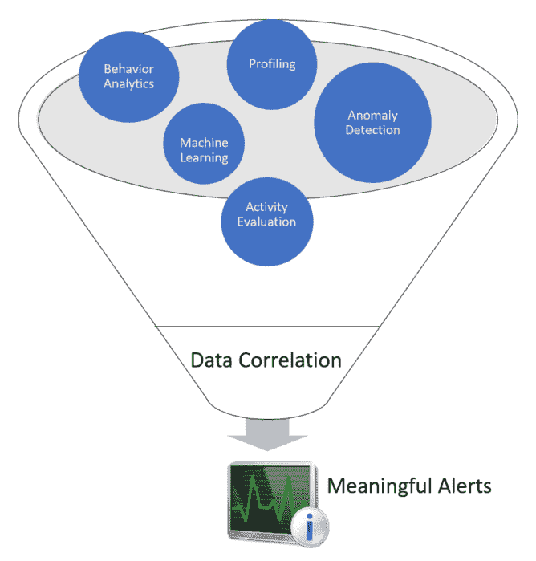

当您对数据进行上下文化时，您自然会减少误报的数量，并为调查员提供更有意义的结果。

# **妥协指标**

在谈论检测时，重要的是要提到**妥协指标**（**IoC**）。当新威胁在实际环境中被发现时，它们通常具有一定的行为模式，并且会在目标系统中留下痕迹。

例如，Petya 勒索软件在目标系统上运行以下命令来重新安排重启：

```
    schtasks /Create /SC once /TN "" /TR "<system folder>shutdown.exe /r /f" /ST <time>
    cmd.exe /c schtasks /RU "SYSTEM" /Create /SC once /TN "" /TR "C:Windowssystem32shutdown.exe /r /f" /ST <time>

```

另一个 Petya IoC 是在 TCP `139` 和 TCP `445` 端口上的本地网络扫描。这些是表明目标系统正在受到攻击的重要迹象，并且根据这些足迹，可以将责任归咎于 Petya。检测系统将能够收集这些妥协指标，并在攻击发生时发出警报。以 Azure 安全中心为例，在 Petya 爆发后的几个小时，安全中心自动更新了其检测引擎，并能够警告用户他们的机器已被攻破，如下图所示：

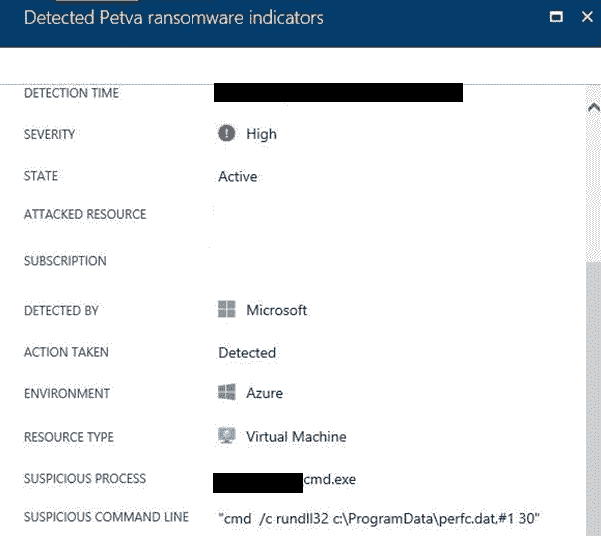

你可以通过 OpenIOC ([`openioc.org`](http://openioc.org)) 注册账号，获取有关新 IoC 的信息，并为社区做出贡献。通过使用他们的 IoC 编辑器（请查阅参考部分以获取下载该工具的网址），你可以创建自己的 IoC，或者查看现有的 IoC。下面的示例展示了 IoC 编辑器显示的 DUQU 木马 IoC：

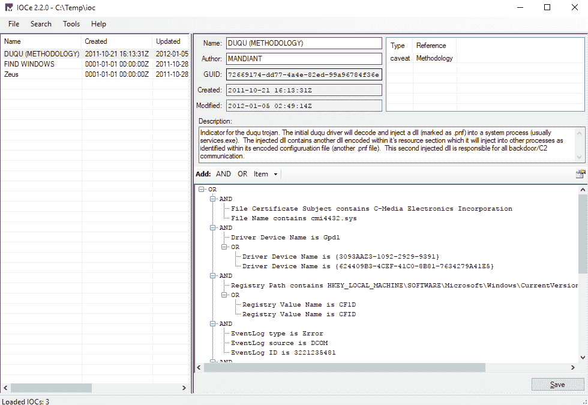

如果你查看右下角的窗格，你将看到所有的妥协迹象，以及逻辑运算符（在这种情况下，大多数是 AND），这些运算符将每个序列进行比较，只有在所有条件都为真时才会返回正结果。蓝队应该始终关注最新的威胁和 IoC。

你可以使用以下 PowerShell 命令从 OpenIOC 下载 IoC，下面的示例展示了如何下载 Zeus 威胁的 IoC：`wget "http://openioc.org/iocs/72669174-dd77-4a4e-82ed-99a96784f36e.ioc" -outfile "72669174-dd77-4a4e-82ed-99a96784f36e.ioc"`

# 入侵检测系统

正如其名称所示，**入侵检测系统**（**IDS**）负责检测潜在的入侵并触发警报。如何处理该警报取决于 IDS 策略。在创建 IDS 策略时，你需要回答以下问题：

+   谁应该负责监控 IDS？

+   谁应该拥有 IDS 的管理员访问权限？

+   事件将如何根据 IDS 生成的警报来处理？

+   IDS 的更新策略是什么？

+   我们应该在哪里安装 IDS？

这些只是一些初步问题的示例，有助于规划 IDS 的采纳。在搜索 IDS 时，你还可以查阅 ICSA Labs 认证产品列表 ([www.icsalabs.com](http://www.icsalabs.com)) 以获取更多厂商特定的信息。不论品牌如何，一个典型的**IDS**具有以下示意图所示的功能：

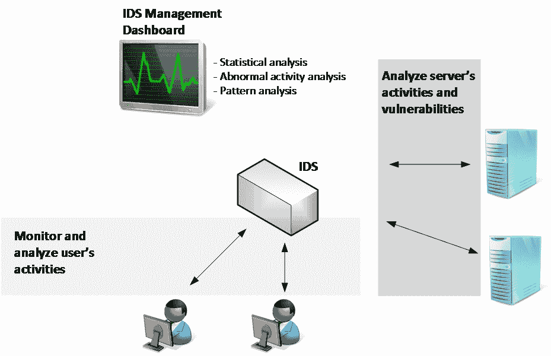

虽然这些是一些核心功能，但功能的数量会根据供应商和 IDS 使用的方法有所不同。基于签名的 IDS 会查询先前攻击的签名（足迹）和已知的系统漏洞数据库，以验证所识别的内容是否为威胁，并且是否需要触发警报。由于这是一个签名数据库，因此需要不断更新，以确保使用最新版本。基于行为的 IDS 通过根据从系统中学到的内容创建模式基线来工作。一旦它学习了正常行为，就能更容易识别出偏离正常活动的情况。

IDS 警报是任何类型的用户通知，用于提醒潜在的入侵活动。

IDS 可以是基于主机的，也就是所谓的主机入侵检测系统（**HIDS**），其中 IDS 机制仅检测特定主机的入侵尝试，或者它可以是**基于网络的入侵检测系统**（**NIDS**），它检测安装 NIDS 的网络分段的入侵。这意味着在 NIDS 的情况下，位置变得至关重要，以便收集有价值的流量。在这里，蓝队应与 IT 基础设施团队密切合作，确保 IDS 安装在网络中的战略位置。在规划 NIDS 放置时，优先考虑以下网络分段：

+   DMZ/边界

+   核心企业网络

+   无线网络

+   虚拟化网络

+   其他关键网络分段

这些传感器将监听流量，这意味着它们不会消耗太多的网络带宽。

下图展示了**IDS**的放置示例：

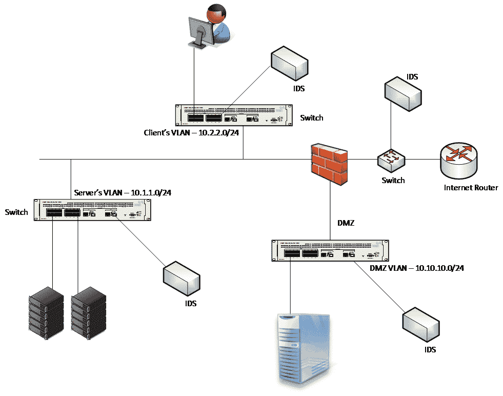

请注意，在这种情况下，**IDS**（实际上是 NIDS）已添加到每个分段中（利用网络交换机上的 SPAN 端口）。这总是这样吗？绝对不是！它将根据公司需求而有所不同。蓝队必须了解公司的约束条件，并帮助确定这些设备应安装的最佳位置。

# 入侵预防系统

**入侵预防系统**（**IPS**）使用与 IDS 相同的概念，但正如名称所示，它通过采取纠正措施来防止入侵。此措施将由 IPS 管理员与蓝队合作定制。

就像 IDS 可以应用于主机（HIDS）和网络（NIDS）一样，IPS 也可以应用于这两者，分别是 HIPS 和 NIPS。NIPS 在网络中的位置至关重要，之前提到的相同准则在这里也适用。你还应该考虑将 NIPS 放置在流量的内联位置，以便能够采取纠正措施。IPS 检测通常可以在以下一种或多种模式下运行：

+   基于规则

+   基于异常

# 基于规则的检测

在此模式下操作时，IPS 会将流量与一组规则进行比较，并尝试验证流量是否符合规则。当你需要部署新规则以阻止利用漏洞的尝试时，这非常有用。像**Snort**这样的 NIPS 系统，能够通过基于规则的检测来阻止威胁。例如，Snort 规则 Sid `1-42329`能够检测到`Win.Trojan.Doublepulsar`变体。

Snort 规则位于`etc/snort/rules`文件夹下，你可以从[`www.snort.org/downloads/#rule-downloads`](https://www.snort.org/downloads/#rule-downloads)下载其他规则。当蓝队与红队进行演练时，很可能需要根据流量模式和红队渗透系统的尝试创建新规则。有时候你需要多个规则来缓解某个威胁，例如，规则`42340`（Microsoft Windows SMB 匿名会话 IPC 共享访问尝试）、`41978`（Microsoft Windows SMB 远程代码执行尝试）和`42329-42332`（`Win.Trojan.Doublepulsar`变体）可以用来检测 WannaCry 勒索病毒。其他 IPS 也适用，例如，Cisco IPS 拥有`7958/0`和`7958/1`签名，用于处理 WannaCry。

订阅 Snort 博客以获取关于新规则的更新：[`blog.snort.org`](http://blog.snort.org)。

使用开源 NIPS（例如 Snort）的一个优势是，当新威胁在野外出现时，社区通常会迅速响应，发布新的规则来检测该威胁。例如，当 Petya 勒索病毒被检测到时，社区创建了一条规则，并发布在 GitHub 上（你可以在这里查看该规则：[`goo.gl/mLtnFM`](https://goo.gl/mLtnFM)）。尽管厂商和安全社区非常迅速地发布新规则，蓝队仍应密切关注新的 IoC，并根据这些 IoC 创建 NIPS 规则。

# 基于异常的检测

在这种情况下，异常是基于 IPS 所归类为异常的内容，这一分类通常基于启发式算法或一组规则。其中一种变体被称为统计异常检测，它会在随机时间采样网络流量，并与基准进行比较。如果该样本超出了基准范围，则会采取措施（警报并跟随执行动作）。

# 本地环境中的行为分析

对于目前市场上绝大多数公司来说，核心业务仍然发生在本地环境中。这里是关键数据的存储位置，大多数用户的工作地点，以及关键资产的所在地。正如你所知，我们在本书的第一部分讨论了攻击策略；攻击者往往会悄悄渗透进你的本地网络，横向移动，提升权限，并与指挥控制保持连接，直到他能够执行他的任务。因此，在本地环境中实施行为分析对于迅速打破攻击链至关重要。

根据 Gartner 的说法，理解用户行为至关重要，通过跟踪合法的流程，组织可以利用**用户和实体行为分析**（**UEBA**）来发现安全漏洞。使用 UEBA 来检测攻击有很多优势，其中最重要的一点是能够在攻击的早期阶段检测到并采取纠正措施来遏制攻击。

下图展示了**UEBA**如何在不同实体之间进行分析，以决定是否需要触发警报：


如果没有一个能够全面查看所有数据并进行关联的系统，不仅仅是基于流量模式，还基于用户的个人资料，误报的可能性会增加。如今，当你在一个以前从未去过的地方使用信用卡，且地理位置也不同于你常去的地方时，通常会发生这种情况。如果你的信用卡有监控保护，某人会打电话给你确认这笔交易；这是因为系统了解你的信用卡使用模式，知道你以前访问过哪些地方，在哪些位置进行了消费，甚至你通常的消费水平。当你偏离这些相互关联的模式时，系统会触发警报，采取的措施是打电话给你，核实这笔交易是否真的是你本人进行的。注意，在这个场景中，你是在早期阶段就快速采取了行动，因为信用卡公司会暂停这笔交易，直到得到你的验证。

当你在本地部署一个 UEBA 系统时，会发生类似的情况。该系统知道用户通常访问哪些服务器，通常访问哪些共享文件夹，通常使用什么操作系统来访问这些资源，以及用户的地理位置。下图展示了来自微软**高级威胁分析**（**ATA**）的这类检测示例，ATA 利用行为分析来检测可疑行为：

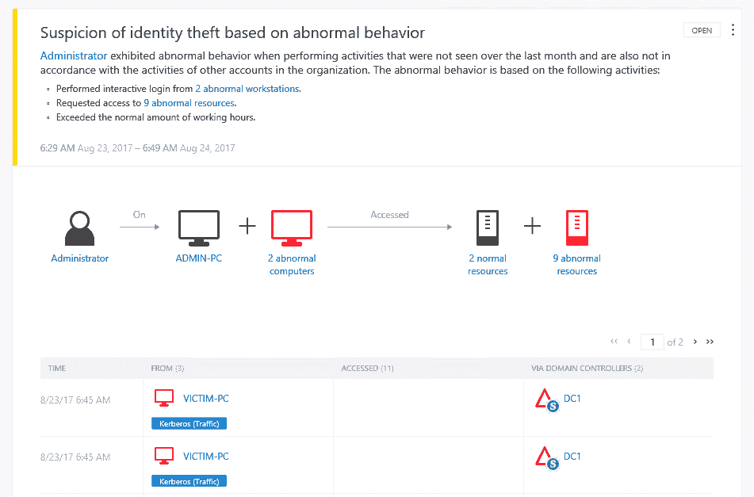

注意，在这种情况下，信息非常明确，系统提示管理员在过去一个月内没有进行这些活动，并且与组织内其他帐户没有关联。这一警报不是可以忽视的，因为它是有情境的，这意味着它从不同的角度分析所收集的数据，建立关联，以决定是否应该触发警报。

在本地部署 UEBA 系统可以帮助蓝队更加主动，拥有更有力的数据以便准确反应。UEBA 系统由多个模块组成，其中一个模块是高级威胁检测，它用于寻找已知的漏洞和攻击模式。下图展示了微软 ATA 检测到“通行证票证攻击”（pass-the-ticket 攻击）的情况：

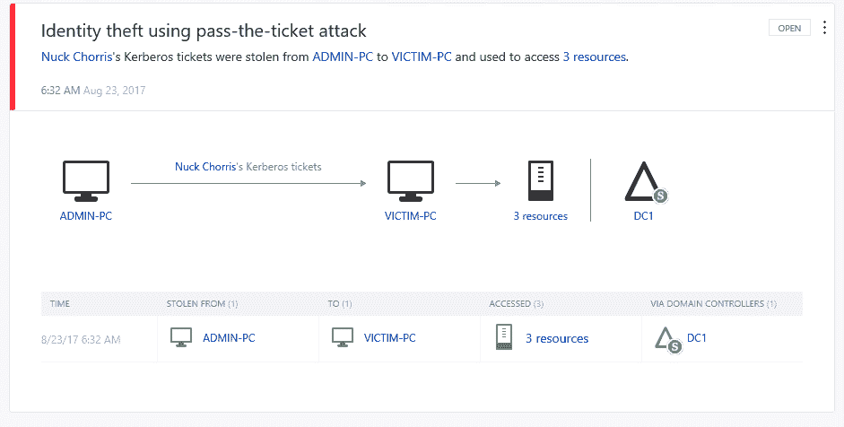

由于执行此攻击的方式有很多种，先进的威胁检测不能仅仅依赖于签名，它需要识别攻击模式和攻击者试图做的事情；这比使用基于签名的系统要强大得多。它还会监测来自正常用户的可疑行为，尤其是那些不应执行某些任务的用户，例如，如果普通用户试图针对本地域运行 `NetSess.exe` 工具，Microsoft ATA 会将其视为 SMB 会话枚举，而从攻击者的角度来看，这通常发生在侦察阶段。因此，会弹出警报，如下所示的截图所示：


攻击者不仅会利用漏洞，还会利用目标系统中的配置错误，如不良的协议实现和缺乏加固。因此，UEBA 系统还会检测缺乏安全配置的系统。

以下示例展示了 Microsoft Advanced Threat Analytics 检测到一个暴露账户凭证的服务，因为它使用了未加密的 LDAP：


# 设备部署

使用之前在 IDS 部分讨论过的相同原则，安装 UEBA 的位置将根据公司的需求和供应商的要求有所不同。在前一节中解释的 Microsoft ATA 示例要求您使用与域控制器（DC）的端口镜像。ATA 不会对网络带宽产生影响，因为它仅监听 DC 流量。其他解决方案可能需要不同的方法；因此，按照您为环境购买的解决方案进行规划非常重要。

# 混合云中的行为分析

当蓝队需要创建应对措施以保护混合环境时，团队需要扩展他们对当前威胁态势的视野，并进行评估，以验证与云的持续连接并检查对整体安全态势的影响。在混合云中，大多数公司将选择使用 IaaS 模型，尽管 IaaS 的采用在增长，但根据 Oracle 对 IaaS 采用的调查，安全性仍然是主要关注点。根据同一份报告，*长期使用 IaaS 的用户表示该技术最终对安全产生了积极影响*。实际上，它确实产生了积极影响，这也是蓝队应该集中精力提升整体检测能力的地方。目标是利用混合云能力来提升整体安全态势。第一步是与云服务提供商建立良好的合作伙伴关系，了解他们具备哪些安全能力，以及如何在混合环境中利用这些安全能力。这一点很重要，因为某些能力仅在云中可用，而在本地则不可用。

阅读文章*云安全可以提升你的整体安全态势*，更好地理解云计算在安全方面的一些好处。

你可以通过以下链接获取文章：[`go2l.ink/SecPosture`](http://go2l.ink/SecPosture)。

# Azure 安全中心

我们之所以使用 Azure 安全中心来监控混合环境，是因为安全中心代理可以安装在本地计算机（Windows 或 Linux）、在 Azure 中运行的虚拟机或 AWS 中。这种灵活性对于蓝队至关重要，集中管理对蓝队也非常重要。安全中心利用安全智能和高级分析来更快地检测威胁并减少误报。在理想情况下，蓝队将使用一个统一的界面来可视化所有工作负载中的警报和可疑活动。核心拓扑结构看起来类似于下图所示：

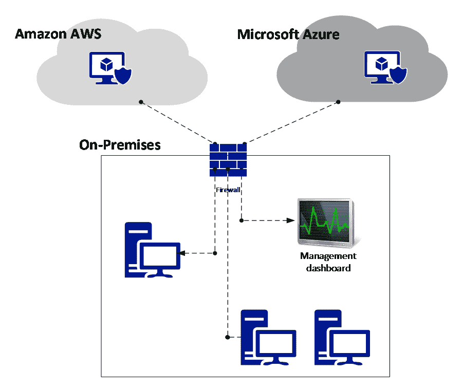

当安全中心安装在这些计算机上时，它将收集**Windows 事件追踪**（**ETW**）追踪、操作系统日志事件、正在运行的进程、计算机名称、IP 地址和登录用户。这些事件会被发送到 Azure，并存储在你的私有工作区存储中。安全中心将使用以下方法分析这些数据：

+   威胁情报

+   行为分析

+   异常检测

一旦这些数据被评估，安全中心将根据优先级触发警报，并将其添加到仪表板中，如下图所示：

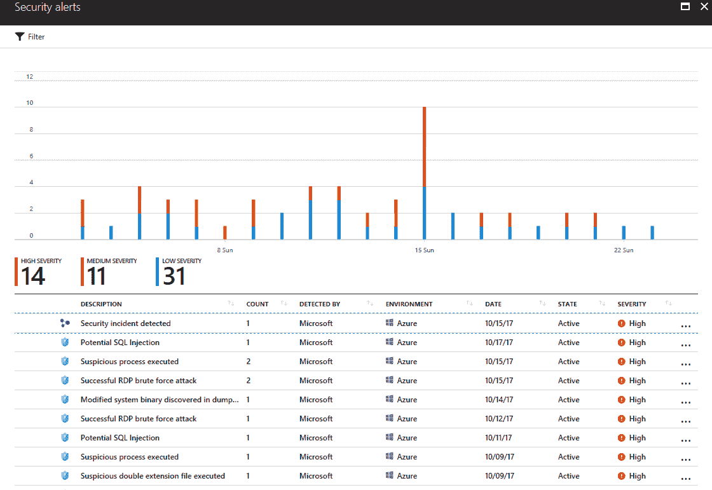

请注意，第一个警报有一个不同的图标，并且被称为“检测到安全事件”。之所以出现这种情况，是因为它被识别为两个或更多攻击属于针对特定资源的同一攻击活动。这意味着，不再需要蓝队成员手动筛选数据来查找事件之间的关联，安全中心会自动执行这一过程，并为您提供相关警报以供分析。当您点击此警报时，您将看到以下页面：

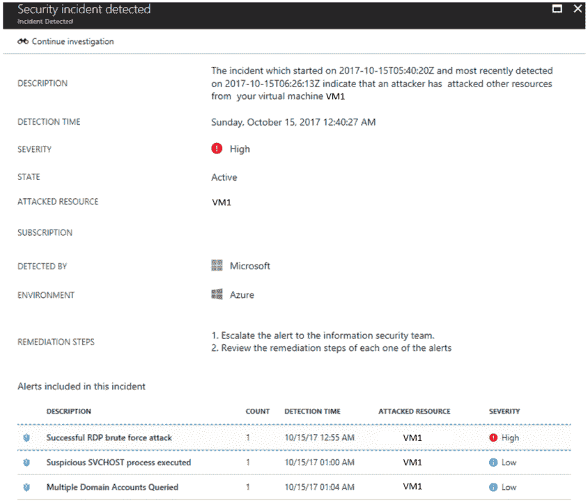

在本页面的底部，您可以看到所有三次攻击（按发生顺序）针对 VM1 的攻击以及由安全中心分配的严重性等级。关于使用行为分析来检测威胁的优势，有一个重要的观察结果，即第三个警报（查询多个域账户）。触发此警报的命令是一个简单的`*net user <用户名> /domain*`；然而，要判断这是可疑的，需要查看执行此命令的用户的正常行为，并将此信息与其他数据进行交叉参考，经过分析后在上下文中会被归类为可疑行为。正如您在这个示例中看到的，黑客正在利用内置的系统工具和本地命令行接口来执行攻击；因此，拥有一个命令行日志记录工具至关重要。

安全中心还将使用统计分析方法建立历史基线，并在符合潜在攻击向量的偏差发生时发出警报。这在许多场景中都很有用；一个典型的例子是偏离正常活动。例如，假设一台主机每天进行三次 RDP 连接，但某天尝试了 100 次连接。当出现这样的偏差时，必须触发警报以提醒您。

使用云服务的另一个重要方面是与其他厂商的内置集成。安全中心可以与许多其他解决方案集成，如 Barracuda、F5、Imperva 和 Fortinet 的**Web 应用防火墙**（**WAF**），以及其他用于终端保护、漏洞评估和下一代防火墙的解决方案。下图显示了这种集成的示例。请注意，此警报是由 Deep Security Agent 生成的，既然它已与安全中心集成，它将与由安全中心检测到的其他事件一起显示在相同的仪表盘中：

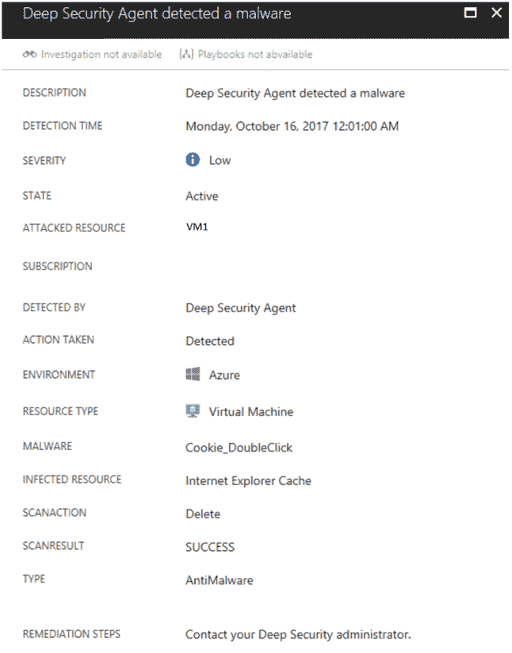

请记住，安全中心并不是唯一一个监控系统并与其他厂商集成的解决方案；还有许多**安全信息和事件管理**（**SIEM**）解决方案，如**Splunk**和**LogRhythm**，也会执行类似的监控任务。

# 参考文献

1.  Snort 规则解释

    [`www.snort.org/rules_explanation`](https://www.snort.org/rules_explanation)

1.  IoC 简介 [`openioc.org/resources/An_Introduction_to_OpenIOC.pdf`](http://openioc.org/resources/An_Introduction_to_OpenIOC.pdf)

1.  IoC 编辑器 [`www.fireeye.com/content/dam/fireeye-www/services/freeware/sdl-ioc-editor.zip`](https://www.fireeye.com/content/dam/fireeye-www/services/freeware/sdl-ioc-editor.zip)

1.  DUQU 使用类似 STUXNET 的技术进行信息窃取

[`www.trendmicro.com/vinfo/us/threat-encyclopedia/web-attack/90/duqu-uses-stuxnetlike-techniques-to-conduct-information-theft`](https://www.trendmicro.com/vinfo/us/threat-encyclopedia/web-attack/90/duqu-uses-stuxnetlike-techniques-to-conduct-information-theft)

1.  如何选择网络入侵预防系统（IPS）

[`www.icsalabs.com/sites/default/files/HowToSelectANetworkIPS.pdf`](https://www.icsalabs.com/sites/default/files/HowToSelectANetworkIPS.pdf)

1.  通过分析行为及早检测安全漏洞

[`www.gartner.com/smarterwithgartner/detect-security-breaches-early-by-analyzing-behavior/`](https://www.gartner.com/smarterwithgartner/detect-security-breaches-early-by-analyzing-behavior/)

1.  高级威胁分析攻击模拟剧本

    [`docs.microsoft.com/en-us/enterprise-mobility-security/solutions/ata-attack-simulation-playbook`](https://docs.microsoft.com/en-us/enterprise-mobility-security/solutions/ata-attack-simulation-playbook)

1.  你和 IaaS - 向早期采用者学习成功经验

    [`www.oracle.com/assets/pulse-survey-mini-report-3764078.pdf`](https://www.oracle.com/assets/pulse-survey-mini-report-3764078.pdf)

# 摘要

在本章节中，你了解了不同类型的检测机制以及使用它们来增强防御策略的优势。你学习了妥协的迹象以及如何查询当前的威胁。你还了解了 IDS，它是如何工作的，IDS 的不同类型，以及根据你的网络选择安装 IDS 的最佳位置。接下来，你学习了使用 IPS 的好处，规则基和基于异常的检测是如何工作的。没有好的行为分析，防御策略将不完整，在本节中，你学习了蓝队如何从这一能力中受益。微软 ATA 被用作此实施的本地示例，Azure 安全中心则作为行为分析的混合解决方案。

在下一章节中，我们将继续讨论防御策略；这次你将深入了解威胁情报，以及蓝队如何利用威胁情报来增强整体安全防御系统。
