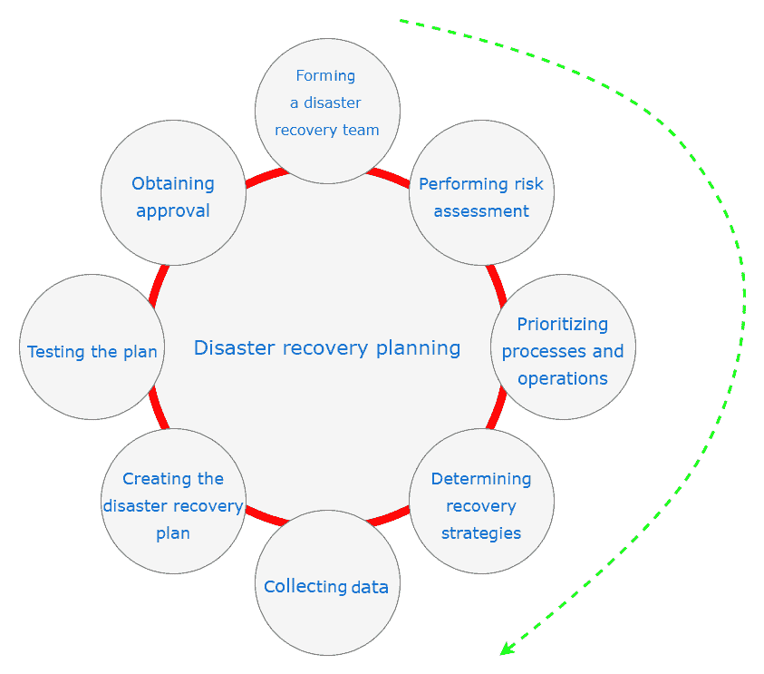
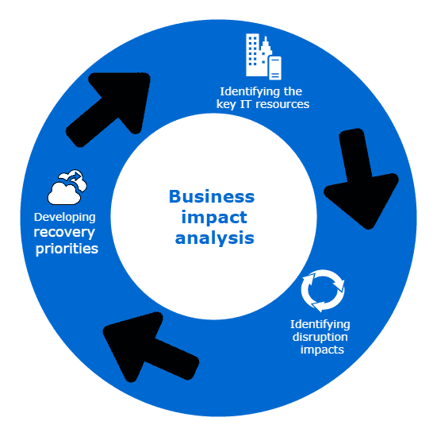
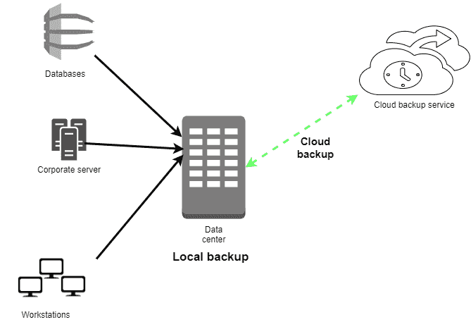

# 恢复过程

前一章讨论了如何调查一次攻击，以了解其原因并防止未来发生类似的攻击。然而，一个组织不能完全依赖于保护自己免受攻击以及面对的所有风险。组织面临着各种各样的灾难，因此不可能对它们采取所有的防护措施。IT 基础设施遭受灾难的原因可能是自然的，也可能是人为的。自然灾难是指由环境危险或自然灾害引起的灾难，包括暴风雪、野火、飓风、火山喷发、地震、洪水、闪电甚至是陨石从天而降撞击地面。人为灾难则是由人类用户或外部人为因素引起的灾难，包括火灾、网络战争、核爆炸、黑客攻击、电力浪涌以及事故等。

当这些灾难袭击组织时，组织应对灾难的准备程度将决定其生存能力和恢复速度。本章将讨论组织如何为灾难做好准备，如何在灾难发生时生存下来，以及如何从灾难的影响中快速恢复。

我们将讨论以下主题：

+   灾难恢复计划

+   实时恢复

+   应急计划

+   恢复的最佳实践

# 灾难恢复计划

灾难恢复计划是一套文档化的流程和程序，旨在在灾难发生时恢复 IT 基础设施。由于许多组织依赖于 IT，拥有一个全面且制定良好的灾难恢复计划已经成为组织的必要条件。组织无法避免所有的灾难；他们能做的最好的事情就是提前规划，当灾难发生时如何恢复。该计划的目标是保护在 IT 操作部分或完全停止时，业务运营的连续性。拥有一份良好的灾难恢复计划有几个好处：

+   组织拥有安全感。恢复计划保证它能够在灾难面前持续运作。

+   组织减少恢复过程中的延迟。如果没有完善的计划，灾难恢复过程很容易变得缺乏协调，导致不必要的延误。

+   备用系统的可靠性得到保障。灾难恢复计划的一部分是通过备用系统恢复业务运营。该计划确保这些系统始终处于准备状态，并能够在灾难发生时接管工作。

+   为所有业务运营提供标准化的测试计划。

+   最小化灾难期间做出决策所需的时间。

+   减轻组织在灾难期间可能产生的法律责任。

# 灾难恢复规划过程

以下是组织应采取的步骤，以制定全面的灾难恢复计划。图表总结了核心步骤。所有步骤同等重要：



# 组建灾难恢复团队

**灾难恢复**（**DR**）团队是负责协助组织执行所有灾难恢复操作的团队。该团队应具有全面性，涵盖所有部门的成员以及一些来自高层管理的代表。该团队将在确定恢复计划的范围时发挥关键作用，具体范围涉及他们各自部门所执行的操作。团队还将监督计划的成功制定和实施。

# 进行风险评估

灾难恢复团队应进行风险评估，识别可能影响组织运营的自然灾害和人为风险，特别是与 IT 基础设施相关的风险。选定的部门人员应分析各自职能领域的潜在风险，并确定与这些风险相关的潜在后果。灾难恢复团队还应评估敏感文件和服务器的安全性，通过列出它们面临的威胁及这些威胁可能带来的影响。在风险评估结束时，组织应充分了解多种灾难情景的影响与后果。全面的灾难恢复计划将考虑最坏情况来制定。

# 优先排序流程和操作

在此阶段，灾难恢复计划中各部门的代表识别出在灾难发生时需要优先处理的关键需求。大多数组织没有足够的资源应对灾难发生时出现的所有需求（2）。因此，需要设定一些标准来确定哪些需求需要组织首先关注并分配资源。灾难恢复计划中需要优先处理的关键领域包括：职能操作、信息流、计算机系统的可访问性和可用性、敏感数据以及现有的政策（2）。为了确定最重要的优先事项，团队需要确定每个部门在没有关键系统的情况下能维持运营的最长时间。关键系统被定义为支持组织不同运营所必需的系统。建立优先级的常见方法是列出各部门的关键需求，确定为满足这些需求所需的关键流程，然后识别并排序底层的流程和操作。操作和流程可以分为三个优先级等级：基本的、重要的和非必要的。

# 确定恢复策略

在此步骤中，确定并评估从灾难中恢复的实际方法。需要制定恢复策略，涵盖组织的各个方面。这些方面包括硬件、软件、数据库、通信渠道、客户服务和最终用户系统。有时，可能会与第三方（如供应商）签订书面协议，在灾难发生时提供恢复替代方案。组织应审查这些协议、它们的覆盖期限以及条款和条件。在此步骤结束时，灾难恢复团队应该对组织中可能受到灾难影响的所有事项有解决方案。

# 收集数据

为了便于灾难恢复团队完成完整的灾难恢复流程，应收集并记录有关组织的信息。应收集的相关信息包括库存表格、政策和程序、通信链接、重要联系方式、服务提供商的客户服务号码，以及组织拥有的硬件和软件资源的详细信息（3）。还应收集备份存储站点和备份计划的信息，以及它们的保留期限。

# 创建灾难恢复计划

如果前述步骤执行得当，灾难恢复团队将获得足够的信息，以制定出一个既全面又实用的灾难恢复计划。该计划应采用标准格式，易于阅读，并简明扼要地将所有关键信息整理在一起。响应程序应以易于理解的方式进行详细解释。计划应有逐步的布局，涵盖灾难发生时响应团队和其他用户需要采取的所有行动。该计划还应指定自己的审查和更新程序。

# 测试计划

计划的适用性和可靠性绝不应依赖于运气，因为它可能决定组织在重大灾难发生后是否能够持续运营。因此，计划应经过彻底测试，以识别可能存在的挑战或错误。测试将为灾难恢复（DR）团队和用户提供一个平台，进行必要的检查并深入理解响应计划。一些可以执行的测试包括模拟测试、清单测试、全面中断测试和并行测试。至关重要的是，整个组织将依赖的灾难恢复计划必须被证明是切实可行和有效的，既对最终用户，也对灾难恢复团队来说。

# 获得批准

在计划经过测试并被证明可靠、实用且全面后，应提交给高级管理层进行批准。

高级管理层必须从两个方面批准恢复计划：

+   第一个要点是确保该计划与组织的政策、程序及其他应急计划一致（3）。

一个组织可能拥有多个业务应急计划，这些计划应该被简化。例如，一个仅能在几周后恢复在线服务的 DR 计划，可能与电商公司的目标不兼容。

+   批准计划的第二个依据是该计划可以安排进行年度审查。

高层管理将对计划进行自我评估，以确定其是否充分。管理层的利益在于整个组织都能覆盖一个充分的恢复计划。高层管理还必须评估该计划与组织目标的兼容性。

# 维护计划

IT 威胁格局可能在短时间内发生巨大变化。在之前的章节中，我们讨论了勒索病毒 WannaCry，并解释了它在短时间内袭击了 150 多个国家。它造成了巨大的财务损失，甚至导致死亡，因为它加密了用于敏感功能的计算机。这是影响 IT 基础设施的许多动态变化之一，迫使组织迅速适应。因此，一个好的灾难恢复计划必须经常更新（3）。大多数受 WannaCry 攻击的组织没有为此做好准备，也不知道应采取哪些措施。攻击只持续了几天，但让许多组织措手不及。这清楚地表明，灾难恢复计划应该根据需要进行更新，而不是依照死板的时间表进行更新。因此，灾难恢复过程中的最后一步应是制定一个更新计划。这个计划还应规定，在需要时进行更新。

# 挑战

灾难恢复计划面临许多挑战，其中之一是未获得高层管理的批准。灾难恢复计划被视为一个虚假的演习，可能永远不会发生（3）。

因此，高层管理可能不会优先考虑制定此类计划，也可能不会批准看似有点昂贵的雄心勃勃的计划。另一个挑战是灾难恢复（**DR**）团队提出的**恢复时间目标**（**RTO**）的不完整性。RTO 是决定组织最大可接受停机时间的关键因素。对于 DR 团队来说，有时很难提出一个符合 RTO 且具有成本效益的计划。最后，还有计划过时的挑战。IT 基础设施随着对抗威胁的尝试而发生动态变化。因此，保持灾难恢复计划的更新是一个巨大的任务，有些组织未能做到这一点。过时的计划可能无效，且在新的威胁向量导致的灾难发生时，无法恢复组织。

# 实时恢复

有时灾难会影响仍在使用中的系统。传统的恢复机制意味着受影响的系统必须下线，安装一些备份文件，然后将系统重新上线。有些组织的系统无法享受下线恢复的奢侈。还有一些系统由于结构上的原因，无法在恢复时关闭。在这两种情况下，都必须进行实时恢复。实时恢复有两种方式。第一种方式是使用配置正确、备份文件未损坏的全新系统安装到故障系统上。最终结果是故障系统及其文件被移除，新的系统接管。

第二种类型的实时恢复是使用数据恢复工具对仍然在线的系统进行恢复。恢复工具可能会对所有现有配置进行更新，将它们更改为正确的配置。它还可能用最近的备份替换损坏的文件。这种类型的恢复适用于需要恢复系统中一些有价值数据的情况。它允许在不影响底层文件的情况下对系统进行更改，也可以在不进行完整系统恢复的情况下完成恢复。一个好的例子是使用 Linux Live CD 恢复 Windows。Live CD 可以执行许多恢复过程，从而避免了用户安装新的 Windows 版本并丢失所有现有程序（4）。例如，Live CD 可以用于重置或更改 Windows PC 密码。用于重置或更改密码的 Linux 工具叫做`chntpw`。攻击者不需要任何 root 权限就可以执行此操作。用户需要从 Ubuntu Live CD 启动 Windows PC 并安装`chntpw`（4）。Live CD 将检测计算机上的驱动器，用户只需识别包含 Windows 安装的驱动器。

有了这些信息，用户需要在终端中输入以下命令：

```
cd/media
ls
cd <hdd or ssd label>
cd windows/system32/config
```

这是包含 Windows 配置的目录：

```
sudo chntpw sam  
```

在前述命令中，`sam`是包含 Windows 注册表的配置文件（4）。在终端中打开后，会显示一个列出 PC 上所有用户账户的列表，并提示用户编辑账户。提供了两种选择：清除密码或重置旧密码。

重置密码的命令可以在终端中输入如下：

```
sudo chntpw -u <user> SAM  
```

正如前面讨论的例子所提到的，当用户无法记住他们的 Windows 密码时，他们可以使用 Live CD 恢复他们的账户，而无需破坏 Windows 安装。有许多其他的实时恢复过程，所有这些过程都具有一些相似之处。现有系统从未被完全抹去。

# 应急计划

组织需要保护他们的网络和 IT 基础设施免于完全失败。应急规划是实施临时措施的过程，旨在使组织能够快速从故障中恢复，并同时限制故障造成的损失程度（5）。这就是为什么应急规划是所有组织都应该承担的关键责任。规划过程包括识别 IT 基础设施面临的风险，然后制定补救策略，以显著减少这些风险的影响。组织面临许多风险，从自然灾害到用户的不小心行为不等。这些风险可能带来的影响从轻微的硬盘故障到严重的影响，比如服务器农场的物理摧毁。尽管组织倾向于投入资源预防此类风险的发生，但不可能消除所有风险（5）。它们无法消除的原因之一是组织依赖许多关键资源，这些资源超出了他们的控制范围，如电信。其他原因包括威胁的进展和内部用户由于疏忽或恶意行为造成的不可控行为。

因此，组织必须认识到，某一天他们可能会面临一个发生并造成严重损失的灾难。他们必须拥有可靠的应急计划、可靠的执行计划和合理安排的更新计划。为了确保应急计划有效，组织必须确保：

+   他们理解应急计划与其他业务连续性计划之间的整合

+   他们仔细制定应急计划，并关注他们选择的恢复策略，以及恢复时间目标

+   他们在制定应急计划时强调演练、培训和更新任务

应急计划必须解决以下 IT 平台，并提供足够的恢复策略和技术：

+   工作站、笔记本电脑和智能手机

+   服务器

+   网站

+   内联网

+   广域网

+   分布式系统（如果有）

+   服务器机房或公司（如果有）

# IT 应急规划过程

IT 应急规划帮助组织为未来的不幸事件做准备，确保在事件发生时能够及时有效地应对。未来的不幸事件可能由硬件故障、网络犯罪、自然灾害和前所未有的人为错误引起。当这些事件发生时，组织需要继续运营，即使在遭受重大损失之后。这就是为什么 IT 应急规划至关重要的原因。IT 应急规划过程包括以下五个详细步骤。

# 应急规划政策的制定

一个好的应急计划必须基于一个明确的政策，该政策定义了组织的应急目标，并指定负责应急规划的员工。所有高级员工必须支持应急计划。因此，他们应该参与制定一个全站的、经过一致同意的应急规划政策，明确应急规划的角色和责任。政策中应包含以下关键要素：

+   应急计划将覆盖的范围

+   所需资源

+   组织用户的培训需求

+   测试、演练和维护计划

+   备份计划和其存储位置

+   参与应急计划人员的角色和责任定义

# 进行业务影响分析

进行**业务影响分析**（**BIA**）将帮助应急规划协调员轻松描述组织的系统需求及其相互依赖关系。这些信息将帮助他们在制定应急计划时确定组织的应急需求和优先事项。然而，进行 BIA 的主要目的是将不同的系统与它们所提供的关键服务进行关联（6）。通过这些信息，组织可以识别每个系统发生中断时的个别后果。业务影响分析应分为三步进行，如下图所示：



# 确定关键 IT 资源

尽管 IT 基础设施有时可能复杂并包含多个组件，但其中只有少数是至关重要的。这些关键资源支持核心业务流程，如工资处理、交易处理或电子商务店铺结账。关键资源包括服务器、网络和通信渠道。然而，不同的企业可能有自己独特的关键资源。

# 确定中断的影响

对于每个已识别的关键资源，企业应识别其允许的停机时间。最大允许停机时间是指资源不可用的时间段，在此期间企业不会受到重大影响（6）。同样，不同的组织根据其核心业务流程将有不同的最大允许停机时间。例如，一家电子商务店铺的网络相比于制造业，其最大允许停机时间较短。组织需要仔细观察其关键流程，并估算它们在没有产生不良后果的情况下能够保持不可用的最大时间。最佳的停机时间估算应通过平衡中断的成本和恢复 IT 资源的成本来获得。

# 制定恢复优先级

根据组织从前一步收集的信息，应优先恢复首先需要恢复的资源。最关键的资源，如通信渠道和网络，几乎总是优先恢复的对象。然而，这仍然取决于组织的性质。有些组织可能会优先恢复生产线，而不是网络。

# 确定预防控制措施

在进行 BIA 后，组织将获得关于其系统及其恢复需求的重要信息。BIA 中揭示的一些影响可以通过预防措施加以缓解。这些是可以采取的措施，用于检测、遏制或减少对系统中断的影响。如果预防措施可行且成本不高，则应加以实施，以帮助系统恢复。然而，有时为了应对所有可能发生的中断，实施预防措施可能会变得过于昂贵。预防控制措施的种类非常广泛，从防止电力中断到防止火灾的措施都有。

# 制定恢复策略

这些是用于在发生中断后迅速有效地恢复 IT 基础设施的策略。恢复策略必须在 BIA（业务影响分析）获得的信息的基础上进行制定。选择不同策略时必须考虑的因素有很多，比如成本、安全性、站点兼容性以及组织的恢复时间目标（7）。

恢复策略还应由互补的方法组合而成，涵盖组织面临的整个威胁环境。

以下是最常用的恢复方法。

# 备份

系统中包含的数据应偶尔进行备份。然而，备份间隔应足够短，以便捕获合理近期的数据（7）。在发生导致系统和其中数据丧失的灾难时，组织可以轻松恢复。组织可以重新安装系统，然后加载最新的备份，并恢复运作。应该制定并实施数据备份政策。至少，这些政策应涵盖备份存储位置、备份命名规范、轮换频率以及将数据传输到备份站点的方法（7）。

下图展示了完整的备份过程：



云备份具有成本、可靠性、可用性和容量的优势。由于组织不需要购买硬件或承担云服务器的维护费用，因此成本较低。由于云备份始终在线，它们比外部存储设备上的备份更可靠且更具可用性。最后，租用所需空间的灵活性使得存储容量随着需求的增加而增长。云计算的两个主要缺点是隐私和安全性。

# 替代站点

有些中断会带来长期影响，这些影响使得组织必须在特定地点长时间关闭运营。应急计划应提供在替代设施中继续业务运营的选项。

有三种类型的替代站点：组织拥有的站点、通过与内部或外部实体达成协议获得的站点，以及通过租赁方式商业获得的站点（7）。替代站点根据其继续业务运营的准备情况进行分类。冷备站点是那些具有足够支持 IT 操作的资源的站点。然而，组织需要安装必要的 IT 设备和电信服务以恢复 IT 基础设施。温备站点部分配备并保持在就绪状态，可以继续提供迁移的 IT 系统。然而，它们需要一定的准备才能完全投入使用。热备站点充分配备并有人员来继续 IT 操作，以应对主站点发生灾难时的情况。移动站点是可以运输的办公空间，配备了所有必要的 IT 设备，以支持 IT 系统。最后，镜像站点是冗余设施，拥有与主站点相同的 IT 系统和数据，在主站点发生灾难时，能够无缝继续运营。

以下是按继续运营的准备情况升序排列的替代站点总结：

+   冷备站点

    +   已准备好支持资源

    +   需要安装 IT 设备和电信服务

+   温备站点

    +   部分配备并保持在就绪状态

    +   需要通过人员配备进行准备才能投入使用

+   热备站点

    +   充分配备并有人员来继续 IT 操作

+   镜像站点

    +   主站点的精确副本

# 设备更换

一旦发生破坏性灾难，损坏了关键的硬件和软件，组织将需要安排更换这些设备。应急计划可以选择三种方式之一。其一是与供应商达成协议，在灾难发生时，供应商能够提供必要的更换设备。另一个选择是设备库存，即组织提前购买关键 IT 设备的替代品并将其安全存储。一旦灾难发生，可以在主站点使用替代设备进行更换，或将其安装在备用站点恢复 IT 服务。最后，组织可能选择使用任何现有的兼容设备替代损坏的设备。此选项包括从备用站点借用设备。

# 计划测试、培训与演练

一旦应急计划制定完成，就需要进行测试，以便识别可能存在的不足之处。测试还需要评估员工在灾难发生时执行计划的准备情况。应急计划的测试必须集中在从备份和备用站点恢复的速度、恢复人员之间的协作、备用站点上恢复系统的性能以及恢复正常操作的难易程度。测试应在最坏情况下进行，并通过课堂演练或功能演练来进行。

课堂演练是成本最低的，因为员工通常在课堂上先了解恢复操作的流程，再进行实际演练。

另一方面，功能演练要求更高，需要模拟灾难发生，并且教导员工如何实际响应。

理论培训用于补充实践培训，并加深员工在演练中所学的内容。培训至少每年进行一次。

# 计划维护

应急计划需要保持在适当的状态，以便应对组织当前的风险、需求、组织结构和政策。因此，它应该不断更新，以反映组织的变化或威胁环境的变化。该计划需要定期审查，并在必要时更新，更新内容应有文档记录。审查应至少每年进行一次，所有记录的更改应在短期内实施。这是为了防止组织未做好准备而遭遇灾难。

# 恢复的最佳实践

形成灾难恢复计划的上述过程，如果遵循某些最佳实践，可以取得更好的效果。其中之一是拥有一个异地存储已归档备份的地点。云是一个方便的解决方案，用于安全的异地存储。

另一个实践是记录任何对 IT 基础设施所做的更改，以便在审查应急计划是否适用于新系统时能更加便捷。主动监控 IT 系统也是一种良好的做法，能早期识别灾难发生的迹象，并开始恢复过程。组织还应实施容错系统，以便在遭遇灾难时能承受一定程度的损害。例如，为服务器实现**独立磁盘冗余阵列**（**RAID**）是一种实现冗余的方法。定期检查备份的完整性，以确保其没有错误，也是非常重要的。如果一个组织在灾难发生后发现备份有错误并且无法使用，那将是非常令人失望的。最后，组织应定期测试其从备份中恢复系统的过程，所有 IT 员工都需要对这一过程有充分的了解。

# 参考文献

1.  C. Bradbury, *灾难！创建和测试有效的恢复计划*, Manager, 第 14-16 页, 2008 年\. 可获取: [`search.proquest.com/docview/224614625?accountid=45049`](https://search.proquest.com/docview/224614625?accountid=45049).

1.  B. Krousliss, *灾难恢复规划*, *Catalog Age,* 第 10 卷, *(12),* 第 98 页, 2007 年\. 可获取: [`search.proquest.com/docview/200632307?accountid=45049`](https://search.proquest.com/docview/200632307?accountid=45049).

1.  S. Drill, *假设最坏情况的 IT 灾难恢复计划*, *National Underwriter.P & C,* 第 109 卷, *(8),* 第 14-15 页, 2005 年\. 可获取: [`search.proquest.com/docview/228593444?accountid=45049`](https://search.proquest.com/docview/228593444?accountid=45049).

1.  M. Newton, *LINUX 小贴士*, *PC World,* 第 150 页, 2005 年\. 可获取: [`search.proquest.com/docview/231369196?accountid=45049`](https://search.proquest.com/docview/231369196?accountid=45049).

1.  Y. Mitome 和 K. D. Speer, "通过应急规划迎接灾难," *风险管理,* 第 48 卷, *(5),* 第 18-20 页, 2008 年\. 可获取: [`search.proquest.com/docview/227019730?accountid=45049`](https://search.proquest.com/docview/227019730?accountid=45049).

1.  J. Dow, "备份和恢复规划," *计算机技术评论,* 第 24 卷, *(3),* 第 20-21 页, 2004 年\. 可获取: [`search.proquest.com/docview/220621943?accountid=45049`](https://search.proquest.com/docview/220621943?accountid=45049).

1.  E. Jordan, *IT 应急规划：管理角色*, *信息管理与计算机安全,* 第 7 卷, *(5),* 第 232-238 页, 1999 年\. 可获取: [`search.proquest.com/docview/212366086?accountid=45049`](https://search.proquest.com/docview/212366086?accountid=45049).

# 摘要

在本章中，我们讨论了组织如何为确保在灾难期间的业务连续性做好准备。我们讲解了灾难恢复规划过程，强调了识别面临的风险、优先恢复关键资源并确定最合适的恢复策略的必要步骤。本章还讨论了在系统保持在线的情况下进行实时恢复。我们重点讨论了应急计划，详细讲解了整个应急规划过程，涉及如何制定、测试和维护一个可靠的应急计划。

最后，在本章中，我们提供了一些可以在恢复过程中使用的最佳实践，以实现最佳结果。

本章总结了网络犯罪分子使用的攻击策略，以及目标可以采取的漏洞管理和灾难恢复措施。
