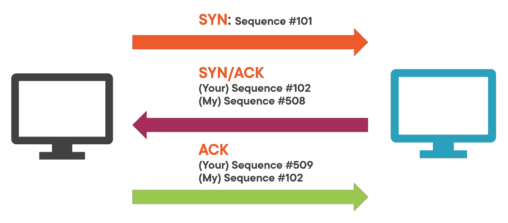
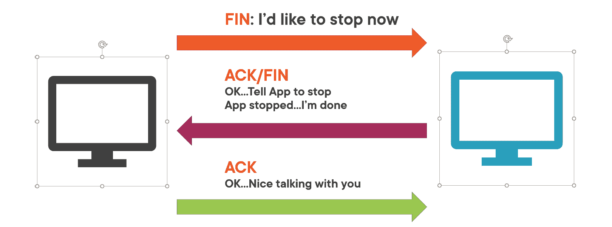
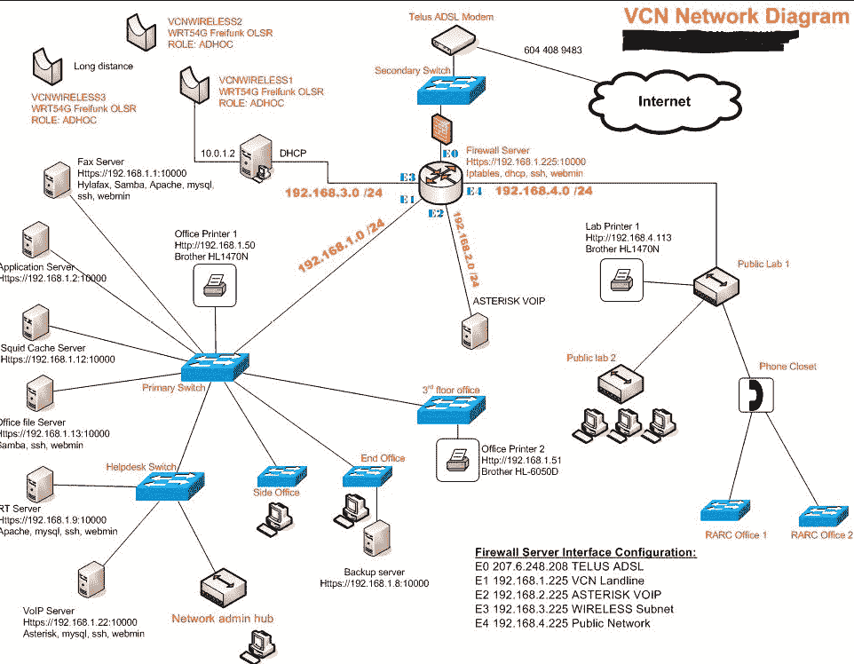

# 第二章：*第四章*：扫描网络

作为一名道德黑客，或者可能是攻击者，我们已经完成了一些攻击网络和系统的初步步骤。在上一章中，我们进行了侦察，这是我们完成的第一步。如果你不熟悉这个术语或那些步骤的内容，你需要回去复习那一章。侦察让我们得到了网络的清晰视图。现在，是时候变得更加具体了。在本章中，我们将更加积极和深入。

在查看目标的初期阶段，我们进行了足迹分析和侦察。现在，是时候进行扫描了。本章将帮助你理解你在做什么，以及什么是扫描。

你可能在想，*等一下，我以为我们在侦察阶段已经完成了所有必要的工作！* 其实，我们并没有获得足够的信息。这就是本章的目标。再说一遍，如果攻击者在攻击系统之前能够尽可能多地获取信息，那么进入系统的过程将变得轻松，而且他们被抓住的可能性很小。

在本章中，我们将讨论不同的扫描技术。我们还将介绍一些常见的扫描工具。然而，我们并不特别关注这些工具，因为很快就会有更多的工具出现。这里的目标是理解这些工具可以做什么。因此，让我们开始吧。

本章将涉及以下内容：

+   理解扫描

+   理解三次握手

+   检查存活的系统及其端口

+   通过跳出框架思维来扫描

+   横幅抓取和操作系统指纹识别

+   漏洞扫描与绘制网络图

+   准备代理和其他匿名化技术

# 理解扫描

在本节中，我们将讨论各种扫描技术，以及用于扫描的目标、技术和工具。

## 扫描类型

那么，攻击者可以使用哪些不同类型的扫描呢？首先，我们将这些扫描分为三个不同的类别。我们将讨论网络扫描、端口扫描和漏洞扫描。

### 网络扫描

在进行网络扫描时，攻击者只是简单地将一个数据包发送到网络上，查看网络上的每个设备，并对它们进行检查，试图识别它们。在此过程中，我们能够获取信息，帮助我们查看哪些主机当前是存活的。这个过程可以通过一个简单的 ping 来完成。不幸的是，使用 ping 只能告诉我们系统是否存活，但我们也能看到这些设备上运行的操作系统类型。这不仅仅是揭示桌面或服务器上的操作系统，还包括路由器、交换机或打印机上当前运行的操作系统。

我们还需要确保遍历并收集所有的 IP 地址。我们知道我们在侦察阶段有一个范围，但我们要确保逐一检查 IP 地址，并看看能否将它们按特定顺序分组。

现在，我所说的是，作为攻击者，我可能能够查看并发现你使用的是**192.168**的 IP 地址，前 10 个 IP 地址是用于服务器的，可能**250**到**255**是用于打印机或网络服务的。这些信息将在我看到一个节点时提供帮助。我可以通过查看说，*哦，哇，那台特定的服务器恰好有这个 IP 地址。我想知道它旁边的服务器是否有下一个 IP*。因此，这帮助我更好地进行排查。如果你愿意把它看作是增加了你的侦察步骤，那也可以。

### 端口扫描

现在，当我们访问这些机器时，我们想要做的是发现端口是什么。通常，端口是一个附加协议的 IP 地址。以**192.168.0.15**为例，这就是 IP 地址或目标地址，但当我们添加一个协议，如 HTTP 时，它就变成了一个端口。如果你想从端口的角度来看，这就是它的表现方式：你有 IP 地址，后面跟着**80**。端口**80**是一个非常典型的端口，它与显示网页的 IP 地址相关联。有时，你可能会看到**443**，这是该设备上的一个安全端口。

每台机器上有超过 65,535 个端口可以运行。当我们进行端口扫描时，我们希望了解哪些端口是开放的，哪些是关闭的。我们通常关注前 1,023 个端口。我们必须通过查看哪些端口有响应，并将其与使用这些端口的服务相关联，从而得出精确的足迹（该机器的精确表现）。不，你不需要逐个记住所有 1,023 个端口。只需要知道一些非常常见的端口就行。我们已经提到了端口**80**和端口**443**。我们还有端口**25**用于电子邮件，端口**53**用于 DNS，端口**20**和**21**用于 FTP，等等。我们希望扫描并查看哪些端口是开放的。在某些情况下，端口是特定于某些服务的。

### 漏洞扫描

作为 IT 专业人员，我们这样做是为了识别操作系统和/或已安装在环境中的应用程序可能面临的威胁。你还需要确保能够识别操作系统及其应用程序的漏洞。在某些情况下，我们可以安装服务包或进行某种更新，这可能会引入新的漏洞。这是每个 IT 人员几乎每月都需要做的事情，或者至少在每次更新时都要做。为什么？因为攻击者也会进行这种类型的漏洞扫描——稍后我们将看到一些漏洞扫描软件。

正如我们之前提到的，大多数我们看到并认为是*哦，它是为善而设计的！*的软件其实并非如此。想想攻击者能如何利用某个特定软件。如果攻击者能够进入你的网络，他们就会进行漏洞扫描，看看哪些系统可能被攻破。

## 目标是什么？

扫描可能有几种不同的目标。我们已经讨论过其中的一些，但我希望你能理解这一点，特别是对于你即将迎来的未来——也就是说，如果你计划参加道德黑客考试！

第一个目标是识别活动主机。更重要的是，我想知道何时有主机上线。如果你打算引入一个新的系统，我希望能及时发现，这样我就知道必须更加小心、更加隐蔽地行动。我还想确保收集到所有的 IP 地址。如果 IP 地址发生变化，我希望能够得到通知。网络总是在不断演变，我们总是在更改 IP 地址。现在，我们可能不会从服务器的角度改变它们，但相信我——桌面系统的 IP 地址总是在变化。如果我入侵了一台特定的机器，而它的 IP 地址发生了变化，我希望能以某种方式追踪到它。扫描将帮助我实现这一点。

一旦我获得了 IP 地址，接下来我想做的就是确保知道哪些端口仍然开放，哪些已经关闭。这可以暴露出操作系统的信息，甚至是架构信息。同样，我会记下扫描结果。

如我之前所提到的，某些 Windows 系统对于开放或关闭端口的响应方式与 Linux 或 UNIX 系统不同。所以，观察它是如何响应我们的操作，也有助于我们识别它的架构。这些功能大多已经内置在稍后演示的扫描软件中。我还会检查漏洞和威胁。同样，如果我能识别目标、它的操作系统以及运行的服务——*嘿，这是一台 Apache 服务器！ Apache 的哪个版本？版本 2.6*——我就会去查找该版本的 Apache 存在哪些漏洞。

我通常讨论的是 Web 服务器，因为它们经常遭到攻击，但也有特定机器的漏洞——比如运行 Adobe Acrobat Reader 的机器，或者是运行 iTunes 的机器等等。我会尝试入侵一台机器，如果有可能，我会攻击你环境中的多台机器。它不一定是服务器——同样，我的主要目标可能不是服务器，它可能只是你的桌面系统。我还会检查这些机器上运行的安全风险和服务。

从攻击者的角度来看，安全风险涉及思考，*当我攻击这台机器时，我的暴露风险有多大？* 很容易认为只是 Windows 系统总是成为攻击的目标，因为它们容易攻击，但猜猜看？我可以攻击 Mac 甚至 Linux 系统——没有什么是万无一失的。当然，有些系统比其他系统更难攻击，而有些系统则可能会暴露我。

扫描在网络上可能会非常*嘈杂*或*冗长*，这取决于你正在进行的扫描类型。所以，我要确保我的安全风险最低。我将进行一些可能非常隐秘的扫描。

我还会查看正在运行的服务——各种各样的服务。SNMP 是否在运行？那台机器上是否有 NNTP 时间服务？特定机器上是否有文件和打印服务？再问一次，哪些应用程序（基于服务器的应用程序）在运行？是 Exchange 服务器吗？是 SharePoint 服务器吗？是 SQL 服务器吗？有哪些服务正在运行，可能会给我提供对这个系统整体的访问权限？

## 使用了哪些技术？

扫描不同技术有不同的技巧。我们使用的某些技术包括适用于内部或外部网络的技术。通常，这些技术几乎是相同的。因为我们所使用的软件或扫描工具并不关心它们是内部还是外部的；这只是看待问题的不同方式——如果我攻击的是公共 IP 地址范围和攻击内部 IP 地址范围，方法是不同的。

我们还将采用不同的技术，不仅仅是看计算机——我还会寻找网络中的打印机、交换机、路由器和任何其他设备。我的意思是，没有什么比攻破一个你根本不知道有人在监控的网络设备更有趣了——比如打印机操作系统、交换机操作系统或路由器操作系统。如果我能通过其中一个设备来控制并向你的网络中的僵尸发送命令，追踪起来将非常困难，因为没人会怀疑它们。

另一种技术是 Wi-Fi，它是一种开放的力量。随着我们越来越多地利用无线技术，我可以直接接入网络。如果我正在访问某个地点并且能够连接 Wi-Fi，我就可以开始工作了。嗯，猜猜看？我可以在 Wi-Fi 网络上使用一些特定的技术，这些技术与我在内部或外部网络上扫描时使用的技术有所不同。

如果我能够访问到一台服务器，我要做的第一件事就是获取横幅信息。这是一种非常有趣的技术，称为操作系统指纹识别，或 OS 指纹识别。获取横幅信息将帮助我利用服务器响应的方式来识别它们——例如 Windows 系统、Linux 系统，等等。

在我们之前的侦察课程中，你看到我们使用了 Netcraft，它包含了使用横幅抓取技术来识别面向公众的服务器。我们可以在内部使用相同的方式来识别网络上的不同目标。

## 扫描工具

那么，哪些工具可以用来扫描呢？嗯，你想从哪里开始？我可以使用标准的命令行进行 ping 测试，看看网络上是否有活跃的主机或节点。我还可以使用 Nmap，这是目前最流行的扫描工具之一。它不仅仅是一个扫描工具。我们还可以使用 angry IP 扫描器，这是我在提供无线 ISP 服务时常用的一个小工具。我们为安装在客户家的每个天线分配了 IP 地址。

最初，我们整理了所有的设备，像是说，*这是这个天线，它的 IP 地址是 1，接下来这个天线的 IP 地址是 2*。这种方法非常有效，直到有一根天线出现故障。在这种情况下，你需要重新设置 IP 地址。我们会迅速进入无线网络，进行快速的 angry IP 扫描，查看哪个 IP 地址是可以使用的，因为某个主机或 IP 地址不再在线，意味着它是可用的。有趣的是，大多数防病毒软件将 angry IP 扫描器识别为恶意软件，然而它们只是普通的 ping 扫描器。

幸运的是，SolarWinds 提供了大量工具，特别是它的工程套件，你可以利用这些工具。它们扫描的内容包括以太网和蓝牙等。它们有各种各样的工具——不仅仅是扫描工具——它们的解决方案非常棒。我们还可以使用 Colasoft ping、Ping Scanner Pro 和 Visual Ping Tester，它们在进行 ping 测试后帮助绘制网络图。市面上有很多类似的工具。你可能有自己喜欢的工具，但有几个工具你可能要特别关注。如果你打算参加伦理黑客考试，我不会告诉你它们是哪几个，因为作为一名道德黑客，我不应该这么做，但有些工具会直接影响你的近期学习。

# 理解三次握手

让我们谈谈计算机在彼此通信时是多么有礼貌，好吗？扫描概念的一部分就是理解所谓的三次握手。再说一遍，这个过程非常有礼貌。

美国足球教练兼前球员 Mike O'Cain 曾说过 *我不记得是谁想出的握手方法，但它确实是个好主意*。

这是真的，因为在三次握手和计算机通信中有一些优势。

要理解三次握手，你必须进入极客模式。你需要理解后台发生了什么。为了以一种有意义的方式讲解这一点，我们将看一下 TCP 和 UDP 通信。我们还将查看 TCP 头部所拥有的不同标志。之后，我们将讨论非常正常的三次握手，确保你理解计算机在即将*相互通信*时所进行的通信。我会为你展示一些 Wireshark，我们来讨论它是如何发生的。

我们将从一些假设情况开始……如果发生了与计算机预期不同的事情怎么办？准备好你的口袋保护器，拿出你的钢笔，开始学习吧。

## TCP 和 UDP 通信

当计算机想要相互通信时，它们需要建立通信方式。计算机可以通过两种不同的方式来进行初始连接：TCP 和 UDP。

### TCP 通信

TCP 相比于 UDP 有着巨大的优势，因为当一台计算机通过 TCP 与另一台计算机通信时，它会尝试在两台计算机之间协商建立连接。这是非常礼貌的——*你好，我想和你通信，可以吗？*——它们在彼此之间进行通信并来回传输数据。TCP 另一个优点是它具有所谓的交付确认功能。*谢谢，先生！我确实收到了那个数据包，你可以继续发送*。这就像 UPS 给你递送包裹一样——你需要签收它。同样，你在确认你已经收到了那个数据包或包裹。由于有错误检测，它也内置了一定的容错机制，这意味着它可以重新传输那些没有成功送达的数据包。*哦，我看到你没有收到那个！好吧，让我再发一次。一旦你收到它，请给我回一个交付确认*。

当数据包被送到目标时，它会进行所谓的顺序交付。如果我们需要通过 UPS 发送五个盒子，我们可以将它们标记为 1/5、2/5、3/5、4/5 和 5/5，便于识别。同样，这有助于计算机在接收数据时重新组装它。TCP 还会进行拥塞控制。如果它看到有太多数据包传送过来，它会尝试减慢速度。

如果说 TCP 有什么缺点，那就是因为所有这些重新传输、顺序交付、拥塞控制和交付确认不断来回传递，TCP 比 UDP 更慢。

另外一个原因是它稍微慢一些，原因在于头部的大小。它大约是**20**字节。而 UDP 大约是**8**字节；稍微小一点。除了头部较大外，它还具有更大的开销。TCP 在通信时需要的一些字段包括数据包中的序列号字段。还有确认号、数据偏移、保留字段、校验和字段、源端口、目标端口，以及大约 12 个与 UDP 的 4 个字段相比更多的不同字段。

TCP 也是面向流的，这意味着数据作为字节流读取，而在 UDP 中，数据包是单独发送的，只有在到达时才会检查其完整性。这部分是由数据流控制处理的。所以，TCP 会进行流量控制，回想一下我们之前提到的三次握手——在用户数据能够发送之前，需要通过三个数据包来建立一个套接字连接，因此 TCP 处理可靠的传输。

再次提到，正如我们之前所说，它具有所有这些特性。我们看到的一些使用 TCP 的应用程序包括简单消息传输协议、文件传输协议、Telnet、超文本传输协议，甚至是 HTTPS。

### UDP 通信

TCP 的“邪恶双胞胎”是 UDP。现在，并不是说我们讨厌它，UDP 只是有些不同。例如，UDP 是无连接的，这意味着当两台计算机想通过 UDP 发送数据时，*我只是把数据发给你，管你收到没收到*，这就是它们的沟通方式。

一个很好的例子是，如果你喜欢流媒体音乐。有时在流媒体播放时，音乐会突然停止，然后再次播放。那是因为它使用的是 UDP，与 TCP 不同，UDP 没有保证的传输。你可以用另一个比喻来说明，TCP 就像是 FedEx，它保证第二天送达，而 UDP 则像普通的美国邮政系统，不是优先邮件——你只是把信件丢进去，然后希望最好。

它还使用更小的数据包。它仅为 8 字节，非常小。

再次说明，这部分原因是因为报头本身只有源端口、目标端口和校验和值。当数据被传输时，每次只传输一个数据包，而且使用 UDP 时，不能保证数据包会到达目的地。虽然它非常快，但因此没有涉及错误检查。而在 TCP 中，我们非常有礼貌；*你收到了吗？它正确吗？*

使用 UDP 时，数据包也会乱序到达。当数据包被发送时，它们是单独发送的，只有到达时才会检查其完整性，因为我们没有像 TCP 那样的按顺序交付机制。所以，数据包会乱序到达。数据包 5 可能会在数据包 4 之前到达。因此，没有消息排序或连接跟踪。

UDP 相对于 TCP 的一个最大优势是它非常快。它也没有拥塞控制，这可能是一个优势。我之所以看作劣势，是因为如果网络饱和，就没有办法停止数据包继续发送，也没有办法让网络即时调整，而 TCP 则有流量控制。技术上，UDP 是面向消息的，这意味着它是我们用于消息传输的协议。然而，因为它不是基于连接的，这意味着一个程序可以向另一个程序发送大量数据包，然后这段关系就结束了。

UDP 使用的一些应用程序包括 DNS、DHCP、TFTP 和 SNMP。VoIP 也使用它。所有类型的视频会议工具，如 Skype，都使用 UDP。我敢肯定，你参加过一个视频会议，突然间，视频流卡住了，看起来就像参与者处于一部老旧的 1930 年代电影中，画面抖动。这种情况发生是因为一些数据包丢失了，或者没有保证交付，但它最终会恢复。

现在我已经描述并解释了计算机是如何彼此通信并相互“喜欢”的，我们将讨论 TCP 如何建立三次握手。

### TCP 头部标志

TCP 使用我们称之为标志（flags）的方式来表示我们希望建立的不同类型的通信和连接。例如，你可能看到的一个标志是 SYN，表示同步（synchronization）。同步标志包含一个序列号。现在，序列号本身并不是按顺序递增的；它们与源计算机和目标计算机相关联。

从技术上讲，序列号在创建时是随机的，并且是基于有效载荷的。这个数字可以在零到四十亿之间。大多数嗅探工具，例如 Wireshark，会显示相对的序列号和确认号，而不是实际的数字，这使我们更容易查看。

我们可能看到的另一种标志是 ACK，表示确认（acknowledgment），意思是我收到了你的请求，你在其中表示希望做某件事。我们还有 FIN，表示结束（finish），意味着任务完成。

我们可能看到的其他标志是 PSH，表示我需要将数据推送给你。还有 URG，表示紧急（urgent）– *抱歉，我需要立即将这个数据包发送给你，请你注意*。最后，还有 RST，表示：*我需要重置连接*（*图 4.1* 和 *4.2*）。

现在我们了解了 TCP 用来创建、建立和断开与其他计算机连接的不同标志，我们来看看它们在正常的三次握手中是如何使用的：

](Images/B17486_04_001.jpg)

图 4.1 – 双向握手示意图

假设我们有两台计算机（*图 4.1*）。左侧的源计算机需要与右侧的目标计算机建立连接。它通过发送带有序列号的 SYN 来完成此操作。*我的序列号是 101*。目标计算机回复并响应 SYN，发送 SYN/ACK。*我收到了你的确认和序列号，因此你的下一个序列号将是 102，这是我的 SYN 或我的序列号，是 508*。源计算机回复 ACK，表示：*你说得对，我的序列号是 102，而你的下一个序列号将是 509*。看看序列号是如何同步的吗？这有助于确认我们已在两台系统之间建立了通信通道：

图 4.2 – 传输后的三次握手

现在，当源计算机完成信息传输后（*图 4.2*），它会发送 FIN – *我完成了。我现在想停止。这段关系不合适*。源计算机回复：*好的，我知道了；我要告诉应用程序停止 SYN 信息，等它完成后，我也就结束了*。回应中，源计算机发送：*哦，嘿，很高兴和你聊聊。我会再打电话给你，也许我们可以再做一次！*

# 检查活跃系统及其端口

扫描活跃系统可能在网络上非常嘈杂或者有很多噪音，但如果你能策略性地进行，目标可能永远都不会知道我们正在通过他们的网络寻找目标。

现在，让我们看看检查活跃系统的不同方法。

## ICMP 扫描/ Ping 扫描

这是检查活跃系统最常见的方法。就像潜艇中的声呐 Ping，我们发送 Ping 并希望得到回响，这告诉我们目标的远近或者目标的位置。标准的 Ping 使用 ICMP 协议，它不仅是广为人知的，而且在网络上非常嘈杂——以至于大多数 IT 专业人员会阻止 ICMP 流量作为威慑。

## 端口扫描

仅仅因为一台机器没有响应 Ping 扫描或 ICMP 扫描，并不意味着它不存在。所以，我们可以通过多种方式执行端口扫描并指定 IP 地址。我们仍然可以尝试检查它是否有响应。接下来我们将展示如何做到这一点。让我们开始 Ping 吧！

### Nmap

现在，在你不久的将来（我这样说是为了表达考试中会出现），你需要了解一些 Nmap 命令的语法。命令有很多，但我会在接下来的过程中突出最重要的几个。当我们进入一些可以通过 Nmap 完成的额外扫描时，我会确保你看到所有不同的选项：

接下来，我们来看看 hping 工具。

### hping3

我知道你在想什么：*这很酷，但如果机器没有响应 ICMP 请求或 Ping 扫描，会发生什么？* 哦，年轻的帕达旺，现在跟我来。

首先，你需要了解像 hping3 这样的工具可以构造数据包，以绕过安全措施。

数据包构造是向应用层协议数据包中添加自定义数据负载的过程。自定义数据负载指的是任何无法识别为协议一部分的任意内容。

Kali Linux 默认安装了一个很方便的工具，叫做 hping3。通过 hping3，我可以使用 TCP、UDP、ICMP，甚至 RAW 协议。hping3 是一个网络数据包生成器和分析器，可以通过命令行运行。由于其能够创建定制的网络数据包，hping3 可用于 TCP/IP 和安全测试，比如端口扫描、防火墙规则测试和网络性能测试。

hping3 的开关可以使工具以以下方式扫描：

+   -0（原始 IP 模式）

+   -1（ICMP 模式）

+   -2（UDP 模式）

+   -8（扫描模式）

+   -9（监听模式）

## 什么是火走？

Firewalking 背后的概念是，我们可以尝试确定 IP 地址（如路由器）将通过哪些第四层协议。尽管我们无法 ping 它，但它可能允许端口 **80** 通过。

Firewalking 的设计目的是帮助我们绕过 IDS 系统、防火墙和路由器。它非常类似于 traceroute，但它试图确定通过数据包过滤设备是否可以通过特定端口从攻击者的系统到目标系统。 

我们使用 firewalking 来帮助定义防火墙的访问控制列表，或者确定允许通过的内容。防火墙可能不允许其他端口通过，但也许允许端口 80 通过 - 它使用 TTL 实现。现在，我所说的是 traceroute - 一种网络实用程序，允许你看到数据包通过的路由器列表，以到达其目的地。要确定这些信息，traceroute 使用 TTL。

TTL 是用于 IP 上的一个实现，以防止数据包在你的网络上无限循环。现在，每个设备接收到一个数据包时，TTL 计数器会减少一个。如果计数器小于或等于 0，则数据包会被丢弃，并且你会收到一个 ICMP 错误消息，提示 TTL 在传输中超过。现在，这个错误消息通常会包含丢弃数据包的路由器的 IP 地址作为发起者。那么，当你进行 firewalking 时数据包会发生什么？如果端口是开放的，它会被转发；如果端口是关闭的，它会被丢弃。

假设我们有两个系统，当我们执行简单的 ping 时，我们的数据包会从一个路由器传递到下一个，然后传递到最终目的地。在 ping 命令中，我们可能看不到它经过的所有不同路由器或跳数，但如果我执行 traceroute，我会开始看到 IP 地址，然后开始看到数据包被丢弃的情况。

## 帮助的移动应用程序

我们经常谈论我们可以在笔记本电脑上使用的工具，但由于移动设备在我们生活中的影响力越来越大，有很多应用程序可以帮助我们进行网络发现。如果你打开你的应用商店并输入网络扫描、扫描器或网络扫描，你会看到大量不同的工具。

我经常使用的一个是 Fing。Fing 旨在跟踪当前连接到您网络的所有不同设备。它提供了一些很酷的工具，包括显示当前位置。它内置了漏洞测试和 Wi-Fi 入侵保护。您还可以检查您的互联网速度和查看您的 Wi-Fi 性能。此外，您还可以设置不同的用户并分配设备给他们。

它还非常适合查找设备。它找到了我的 TP-Link 交换机（*图 4.3*），可以获取我的 MAC 地址，显示我的供应商，并且我还可以设置当它更改状态时通知我的选项，这非常有趣：

图 4.3 – 使用 Fing 查找设备

你也可以浏览并阻止设备。我将大多数设备设置为，如果一个设备默认连接到我的网络，它将被阻止。

还有其他产品也能做到这一点——无论是在 Android 设备上还是 iOS 设备上。

# 跳出框架进行扫描

所以，当我们扫描网络时，我们有一些技巧可以用来让系统响应而不被检测到。现在，我们知道的正常三次握手过程是先发送 SYN，然后是 SYN/ACK，再到 ACK。如果我们改变握手的顺序，构造数据包，使得我们先发送 SYN/ACK 呢？或者先发送 FIN？通过这些方法，我们可以发现那些通常不会响应 ICMP 扫描的网络目标。让我们来谈谈这些扫描方法。

## 完全扫描

完全扫描就是我们之前讨论的相同过程——三次握手。只不过在这里，当计算机和另一台计算机进行通信时，攻击者正在攻击目标。他们所做的是发送标准的 SYN。这个 SYN 附带一个端口号。

正如你从三次握手中记得的那样，它会简单地回应 SYN/ACK。现在我们已经看到了确认，我们可以通过发送一个 ACK 并然后重置来完成它，这意味着，好吧，我不想和你通信。如果它再次以这种方式回应，使用完整的三次握手，我们就知道端口在那时是开放的。相反，如果我们在相同的环境下发送一个 SYN 并得到重置选项，那么我们就知道端口是关闭的。

完全扫描的缺点是它非常嘈杂。大多数 IDS 系统会检测到这一点，并且会在某处记录下来。但你可以把它作为最后的手段，尤其是如果你是黑客活动分子，或者你正遭遇黑客活动分子的攻击。他们并不在乎自己是否被抓住，或者可能他们只是认为你不会过多查看日志。

## 半开扫描

半开扫描也被称为隐匿扫描。现在，记得三次握手是怎么工作的吗？如果我们稍微修改一下呢？假设我们有目标和攻击者，通常我们会发送一个 SYN 对吧？好，如果我们发送一个 SYN，它的正常回应是发送 SYN/ACK。记得三次握手的第三步是什么吗？是发送一个 ACK 来确认收到了你的确认和 SYN？那么，如果我改成发送一个 RST 呢？通过发送 RST，扫描会部分打开连接，但在中途停止。现在，因为它在没有完成完整连接的情况下停止，它不会通知服务端有一个即将到来的连接，因此通常不会被记录下来。如果我从目标那里收到了 SYN/ACK，我就知道端口是打开的。如果我做同样的事情，发送一个 SYN 而回应是 RST，那么，猜猜看——端口是关闭的。

## Xmas 扫描

圣诞树扫描使用一种技术，利用我们的 ACK、RST、SYN、URG、PSH 和 FIN 标志来查看特定端口是否开放。不幸的是，这些标志只对符合 RFC 793 的系统有效，这意味着它在 Windows 系统上无法使用，因为 Microsoft 在 TCP/IP 方面遵循了他们自己的 RFC，所以遗漏了一些内容。

那么，圣诞树扫描是如何工作的呢？首先，我们有攻击者和目标，第一步，我们要发送的是 FIN、URG 和 PUSH 的组合。

作为回应，目标机器会什么都不做。如果它什么都不做，那是因为我说了*我完成了*，而计算机则说，*完成了？我们根本还没开始对话，伙计！*所以，如果它什么都不做，那么我们知道端口是开放的。现在，如果我通过相同的环境，进行相同的 FIN、URG 和 PUSH 扫描并收到 RST，你猜怎么着——这意味着端口已关闭。

因此，关于你即将面临的未来，请记住，圣诞树扫描（Xmas tree scan）无法在 Windows 或 Microsoft 产品上发挥作用。

## FIN 扫描

让我们再回到我们的攻击者和目标。你还记得三次握手吗？我们从哪里开始？SYN 吗？不，我们给它发送一个 FIN，意思是*我已经和你说完了！*目标机器会说，*我根本不知道该如何回应，因为我们甚至还没开始对话呢*。所以没有响应告诉我端口是开放的。再次，如果我想查看端口是否关闭，我发送我的 FIN，如果我只收到 RST/ACK，那么端口就关闭了。

## NULL 扫描

NULL 扫描有点独特，因为它通常适用于 UNIX 和 Linux 系统。同样，它在 Microsoft 平台上不起作用。

我们不发送任何内容，而是通过 TCP 发送数据包，但你猜怎么着？它将没有标志。它既不是 SYN，也不是 ACK，也不是 FIN——它什么都不是；标志是空的。当目标接收到该数据包时，它不会做出响应，这意味着你发送给我的是我不知道如何处理的信息。因为它没有响应，我们知道端口是开放的。

事情的真相恰恰相反，就像我们在圣诞树扫描中看到的那样。如果我发送一个没有标志的 TCP 数据包，内核会丢弃它（如果端口开放），或者它会向攻击者的机器发送一个 RST/ACK，这告诉我端口已关闭。

## UDP 扫描

你还记得 UDP 的优缺点吗？总是有一个两难的选择，对吧？三次握手是由 TCP 引起的，而在 UDP 中没有三次握手，也没有 TCP 的开销，这为我们创造了一些优势。一个优势是它更难监控，因为没有初始的握手。UDP 本身在作为开放端口时显得更不正式。数据帧可以被超载或更大，因此我们可以突破 TCP 数据帧的限制。再说一次，基于 Microsoft 的操作系统没有内建任何类型的 ICMP 速率限制，因此在 Windows 目标上，扫描非常高效。UDP 的缺点是我们只能获得端口数据；我们无法利用一些其他可用的选项，尤其是在 Nmap 中，比如识别操作系统。要查看这些内容，我们需要加入一些额外的参数。

所以，让我们假设有一个目标机器和攻击机器。如果攻击机器发送一个 UDP 数据包，询问，*嘿，端口 31 是否开放？*，而目标机器则回复，*嗨，我不打算和你说话*，那就表示没有响应，意味着端口是开放的。

相同的概念适用于攻击机器和目标机器进行相同操作：端口**31**是否开放？在这种情况下，我们会收到一个 ICMP 端口不可达错误信息。在这种情况下，我们知道该端口是关闭的。

我知道你在想，*让我们看看这个！* 事实上，UDP 扫描的最大挑战是要快速进行。被过滤和开放的端口很少发送任何类型的响应，这会导致 Nmap 经常超时。关闭的端口问题更大，它们通常会返回一个 ICMP 端口不可达错误。有时候，你确实会得到一些假阳性结果。有趣的是，Nmap 能够检测到速率限制并减慢扫描速度，以确保网络不会被大量无用的数据包淹没。不幸的是，Linux 风格的限制是每秒一个数据包，这使得扫描 65,000 个端口大约需要 18 小时。

现在我们已经了解了可以使用的不同扫描技术，我们将转向那些可以用来规避**入侵检测系统**（**IDSes**）的技术，这些系统正在寻找我们之前所讨论的扫描类型。

## 空闲扫描

空闲扫描是指你在星期五晚上坐在主街上的车里，查看旁边车里的人的情形，就像你在怠速时一样。开个玩笑…这个扫描非常巧妙，也很难被检测到，因为三次握手的工作原理以及计算机响应的设计方式。

我们将使用 TCP 端口扫描机制和常规的三次握手，但我们将伪造源地址指向目标。我们让目标认为，不是我在扫描你，而是别人——*看这边！* 这样做有一些好处，因为我们可以把责任推给别人。*不是我，是这台电脑在给我们带来问题*。这种扫描机制的缺点是，它确实需要你拥有一个僵尸系统——一个我已经渗透、入侵或了解的系统。我甚至不需要拥有或控制它。它只是一个我知道的 IP 地址，位于你现有的防火墙或 IDS 系统之后。之所以需要它，是因为我要使用这个僵尸系统作为源地址。

## 列表扫描

列表扫描非常快速，它会遍历并列举你提供的特定目标或每个块中的每个 IP 地址范围。然后，它会对每一个 IP 地址进行快速的反向 DNS 查询。列表扫描的一个优点是，很多时候，系统的名称可能会给你提供一些线索，告诉你它正在做什么。

## SSDP 扫描

**简单服务发现协议**（**SSDP**）是一个有趣且棘手的扫描。它是一种网络协议，通常与其他机器进行通信。所以，当一个系统启动并表示，*嘿，我在找打印机，或者我有一台可用的打印机*，这个服务会帮助进行通用即插即用。通常在机器没有防火墙的情况下，它能够正常工作。然而，也有可能在某些情况下，我们能够穿透防火墙。所以，攻击者可能会利用 SSDP 扫描来检测通用即插即用漏洞，这些漏洞可能允许他们对目标发起缓冲区溢出攻击，甚至拒绝服务攻击。

## 对策

那么，我们如何部署对策，以及我们可以实施哪些不同的对策呢？首先，防火墙需要配置为检测 SYN 扫描。这是因为如今大多数防火墙——如果没有更新——每个厂商会使用不同的机制或方法来扫描 SYN 攻击。

你还需要确保你的 IDS 系统能够检测到 Snort 或 Nmap。Snort 是一款分析流量的产品，帮助评估和判断发生了什么。它几乎像一个隐形的嗅探器，因此得名 Snort。再次提醒，你需要检查你的 IDS 系统，确保它们支持这些功能。

我们还需要确保只打开必需的端口。因此，如果我对一台系统进行扫描，发现没有端口开放，这就告诉我有问题。为什么这台机器还开着？它一定在提供某种服务。我是说，DNS 服务器会开放端口，域控也会开放某些端口。所以，你要限制打开的端口数量。这是你应该做的事情之一。但回到之前说的那些扫描，如果我对某个 IP 地址进行扫描，发现没有端口开放。此时，我知道在我和目标之间，肯定有某种设备在阻挡着它。因此，我们只想打开为该服务器的服务所需的端口。

我们还需要检查并确保过滤 ICMP 消息，确保不允许 ICMP 流量不必要地通过。我知道这会失去一些 ping 的功能，但我们希望能够过滤并记录这些数据。

我们还需要使用我刚才展示的技术对我们的网络进行测试。同样，作为道德黑客，我们的职责之一就是确保我们能够抵挡住攻击者使用这些相同技术和工具可能发现的漏洞。

最后，我们要确保我们的防火墙和 IDS 系统是最新的，并且已经打上了补丁。我知道对于某些人来说这看起来可能不算什么，但这就是我能做的。再次，我会用我一直使用的比喻：我知道在高速公路上开车比飞行更容易发生车祸，导致受伤或死亡，但我仍然对飞行有点神经质。这可能是我的控制问题，但我知道这些风险，并愿意接受这些风险，只为了能开车并住在我现在住的地方——远离大城市。

我曾经进行过一次非常有趣的对话，对象是一个为微软工作的白帽黑客。当我试图在我所在的地区开设互联网服务时，他问我，*你真的想做这件事吗？* 当我问他是什么意思时，他说，开设互联网服务提供商会让我成为目标。我说，*伙计，但我住在这个小镇，人口才 2000 人*。他说，*这没关系，因为在互联网上你只是一个号码。他们不关心你在哪儿*。但我还是选择了那个风险，我们今天也在面对同样的风险。我们都知道可以在网上购物，很方便。但我们知道，身份可能会被盗。尽管如此，这仍然是我们愿意承担的风险。

## 更多的 IDS 躲避方法

我们可以通过其他方式绕过 IDS 系统。方法之一是伪造你的 IP，但我们也可以嗅探那里的响应。我们还可以使用代理或被控制的机器。所以，僵尸机算是这两者的结合体。

另一种方法是对 IP 包进行分片，稍后我会展示给你。然后，如果你能够的话，可以使用源路由（source routing），这是一种方法或技术，可以让你指定数据包通过网络的路径。因此，当你有一个指定了源路由的数据包在网络中传输时，做出路由决策的设备（例如路由器）会查看数据包中指定的路径，来决定将包转发到哪里。这样，我们就能迫使数据包绕过一些 IDS 系统。

关于 IP 分片或 IP 碎片的概念，是为了绕过这些 IDS 系统。通常情况下，它们会监控正常大小的包通过，而对较小的包通常会忽略。因此，当一个大包通过时，它会因包的大小和协议被阻塞。也许你的 IDS 系统正在阻止 FTP 或某个特定端口。那么，解决方法就是将大包分割成更小的包，这些小包将顺利通过并在目标机器上重新组装。

# 横幅抓取与操作系统指纹识别

我们已经找到并扫描了活跃的目标，查看了哪些端口是开放的。我们的下一步是尝试识别系统。我们怎么做呢？当我说识别时，我是指找出运行在机器上的操作系统和应用程序。我们将通过横幅抓取和操作系统指纹识别来实现这一点。

总结这个模块内容的最好方式是引用著名学者乔伊·特里比亚尼（Joey Tribbiani）的话，他曾说过，*How you doin?* 这正是我们在做的事！我们正在尝试了解系统，识别目标。因此，我们将了解操作系统指纹识别（OS fingerprinting），这是一种通过发送特定类型的数据包并观察系统如何响应，从而识别操作系统的方法。

现在，我们可以做另外一件事叫做 **横幅抓取**（banner grabbing）。这是一种非常直接的识别系统的方法，作为 IT 专业人员，你无法阻止它。操作系统就是按照特定方式响应不同请求的，这是它们的设计方式。最终，我们会查看应对措施。再次强调，有些事情你无法阻止，但我可以让攻击者的进攻变得缓慢。你不能完全阻止他们；如果你以为自己能阻止他们，那你会给自己带来心脏病发作的风险，但你是做不到的。

## 操作系统指纹识别

我们今天做渗透测试时之所以这样做，是因为测试人员通常从尽可能多地收集目标的信息开始。我们要确保得到的信息之一就是操作系统，或者尝试识别操作系统本身。我们通常通过向目标机器发送特定类型的数据包来完成这一任务。如果我们能隐藏这些信息，那么就能让攻击者更难判断要进行哪些攻击。通常，你会让攻击者产生犹豫；并不是说他们无法进入，而是他们可能会想找一些更容易的目标。因此，在收集初步信息时，重点是发现使用的操作系统。这使得我们在网络上变得极其、极其活跃。

我们可以使用几种不同的方法来找出一个未知主机的操作系统，而不需要拥有账户或直接登录到机器上。

有两种类型的指纹识别。第一种被称为**主动指纹识别**。在主动指纹识别中，我将使用一些数据包，这些数据包是我设计来帮助我识别操作系统的。根据你使用的应用程序——我将使用 Nmap，因为它是我最喜欢的工具之一——以及目标机器对我的数据包的响应或反应方式，我会将其与已知响应的数据库进行比较，这将帮助我识别操作系统。不幸的是，这样做有一个缺点：因为它非常主动，所以很容易被网络检测到。

还有**被动指纹识别**，这涉及到嗅探网络并查看数据包，看看源 IP 地址是什么。你或者你的应用程序会在一段时间内记录数据，然后你将收集足够的信息，帮助你识别目标。

从攻击者的角度看，好的方面是它非常、非常安静，因为很难检测到他们在你的网络上进行此操作，因为他们只是在嗅探数据包。当然，攻击者完成这一过程会花费一段时间，而你正好没有——时间。

## 对策

那么，我的对策是什么呢？如何阻止人们识别指纹并可能抓取你的服务器横幅？嗯，你可以做几件事。首先，你可以通过使用假横幅来误导。例如，在 IIS 中，我们可以修改横幅返回的内容。微软为此提供了一个工具，叫做**IIS 锁定工具**，它有助于锁定 IIS 服务器，特别是旧版本的 IIS。

我非常喜欢误导策略。如果我买了一台 Linksys 无线路由器，它的默认无线 SSID 会是什么？是 Linksys，对吧？一个路过的攻击者看到我的 Wi-Fi 会针对 Linksys 发起攻击。为了避免这种情况，我会把我的 Linksys 路由器的 SSID 改成 Belkin 或 Netgear，让他们发起错误的攻击。这里同样适用这个概念。去伪造这些标语。

还有一个很有用的小工具，叫做 ServerMask，你可以运行它使服务器看起来不像它真实的样子，比如显示成旧版的 IIS 或旧版的 Apache。

你还可以关闭不必要的服务，因为这些服务和端口可以用来识别操作系统。如果你有一些 Linux 主机，你也需要进入并修改**httpd.conf**文件中的**ServerSignature**条目。

如果你处理的是 Apache 服务器，你可以进入并将**ServerSignature**行设置为**ServerSignature**关闭，在**httpd.conf**文件中。

你还可以进入相同的文件（即**httpd.conf**文件），并寻找一个叫做**mod headers**的部分。在那里，你可以修改服务器的名称。所以，我可以输入 IIS 版本 6.0，让攻击者困惑，猜测为什么他们的攻击没有奏效。

# 漏洞扫描和绘制网络

现在，我们已经出去，找到了我们的活动主机，识别了操作系统，或者通过标语抓取来识别操作系统，下一步是浏览并寻找漏洞。

记住，我们的目标是发现这些目标——希望能够找出操作系统的类型以及可能运行的应用程序。这正是漏洞扫描和绘制网络为我们做的事情。

一些 IT 人员可能会怀疑漏洞扫描是否重要，而我的回答——我最喜欢的名句来自一个著名角色——是，*一个人必须了解自己的局限性*。

你必须了解自己的局限性和漏洞。

现在我们达成一致，我们将继续查看一些我们最大的弱点。我们通过理解漏洞扫描来实现这一点。之后，我们将看看它是如何工作的，我们可以使用的不同机制，以及各种软件如何查看你的网络基础设施。

我们还将看一些漏洞扫描工具，并进行一些漏洞扫描。

然后我们将讨论绘制网络的过程，我们部分这么做是为了记住——作为攻击者——当我们再次访问该网络时，我们曾经所在的网络。

当然，我们还将学习一些与如何绘制网络相关的工具。

当我们进入这个非常积极的步骤时，我们将划定黑帽和白帽的界限，因为你将积极主动地去发现你所识别的系统中的问题。因此，在你对一个网络执行此操作之前，最好确保你已经获得了许可。好吗？现在你已经拿到家长或监护人签署的许可书，我们开始吧。

## 什么是漏洞扫描？

漏洞扫描器用于检查网络中的各种漏洞，我们将使用一个这样的软件来完成扫描任务。

市面上有几家厂商提供漏洞扫描工具。我们使用的大部分工具都是为好目的设计的，但有时也会被用于恶意用途。所以，这些软件会检查诸如你的网络系统、交换机、路由器和计算机等信息——它会试图根据正在运行的操作系统以及没有被修补的漏洞来识别这些设备，包括应用程序。

当我们谈论应用程序时，并不一定是指 Word 或 Excel。它可能是基于服务器的应用程序，例如 SQL、Exchange 或任何其他类型的邮件服务器。这些是运行在服务器平台上的应用程序。不过，这也可以包括桌面级别的应用程序，因为，正如我之前所说，我会尝试攻击任何可以找到的目标。所以，如果你的桌面上安装了 Adobe Acrobat 并且没有得到适当的修补，而这个机器还没有被保护好，我就会攻击这台机器，因为我可以稍后利用它的资源，可能攻击或链式攻击你网络中的其他系统。

一个常见的问题是，*这些漏洞是如何产生的？* 好吧，它们是通过几种不同的机制和方式产生的。它们中的一些是由于用户发起的任务。例如，某个用户将本不该共享的目录分享给别人，未运行防病毒解决方案，或者没有及时更新防病毒软件。在某些情况下，你可能会遇到一个我喜欢称为 *周末极客* 的人——他们喜欢炫耀 *我会组装电脑*，对一切都知道，却故意在自己的系统中安装后门，同时试图入侵系统，结果反而为真正的攻击者打开了大门。

厂商创建的漏洞有时是由软件漏洞、操作系统补丁、以及未经通知就开启的服务引起的——其中一些服务可能是不必要的、不安全的默认配置、Web 应用程序漏洞，甚至是系统管理员自身的操作失误。

这些漏洞的产生部分是由于懒惰的管理员，他们安装了需要服务帐户的应用程序，却懒得使用默认的内置域管理员帐户来运行服务。有时，他们为了应对临时情况做出配置更改，却忘记了再切换回来。还有些管理员缺乏密码保护策略，这意味着他们允许使用较短的密码（七个或八个字符），而不是更长的密码。

## 扫描器的类型

首先，我们有基于网络的扫描器。这些工具设计用来执行诸如评估远程 Web 服务器可能存在的漏洞，或者执行端口扫描来确定哪些端口可能是开放的等任务。

如果你在使用服务器提供资源访问，就无法避免开放端口，但我们需要确保只有必要的端口被打开。

在这里，我们将关注 Web 应用扫描器。这些扫描器会通过检查 SQL 注入等方式，评估 Web 应用的安全性。Web 应用扫描器还会查找跨站脚本等问题。

技术提示

Web 应用扫描器不一定会对目标 Web 应用的每个方面进行全面的安全检查。可能需要额外的手动检查，例如查看在多次无效尝试后是否会锁定登录账户。当你测试 Web 应用时，可能需要检查这些问题。

我们还有基于主机的扫描器，它安装在要扫描的主机上。它可以直接访问所谓的低级数据，例如可能存在于主机操作系统中的服务或配置细节。由于这种访问级别，它能更好地洞察可能被认为是风险的用户活动，比如使用容易猜到的密码，甚至根本没有密码。

它还会检测到攻击者已经入侵系统的迹象，这包括检查可疑的文件名、意外出现的系统文件，甚至是设备文件。在某些情况下，我们可能会看到程序被赋予了意外的权限。

基于主机的扫描器还可以执行基准测试或文件系统检查。通常，基于网络的扫描器不会进行这种级别的安全检查，因为它们无法直接访问目标的文件系统。一个很好的基于主机的扫描器例子是数据库扫描器，它会执行详细的授权安全分析，检查哪些账户已获得授权、使用的身份验证机制、数据库的完整性，以及数据库系统中可能存在的任何安全漏洞（如弱密码、配置错误等）。

## 漏洞扫描是如何工作的？

那么它的局限性是什么呢？因为它确实存在一些缺点。首先，漏洞扫描需要人工判断。漏洞扫描仪只能根据安装在数据库中的插件报告它发现的漏洞。它们并不设计用来判断结果是否是误报或漏报，因此我们总是需要有人在扫描后查看并分析数据。

你还应该注意到，它严格来说只是一个快照。漏洞扫描仪只会查看特定时间点的特定系统。因此，你不能仅仅做一次漏洞扫描就认为自己是安全的。你必须持续进行扫描。随着新漏洞的出现，或者有人对配置设置进行更改，我们可能会引入新的安全漏洞。

另一个限制是它只能识别它已知的漏洞。漏洞扫描器是为了发现它已知的特定漏洞而设计的。它并不用于识别其他安全威胁。因此，你必须定期更新这个小家伙。

还有一个限制，我称之为*组件即组件*，或者说插件。大多数漏洞扫描器依赖于这些插件来确定可能存在的问题或漏洞。插件成为扫描数据库的一部分，扩展了扫描器已知的漏洞范围。现在，一些漏洞扫描软件程序可能会把它们称为扫描配置文件，但大多数供应商通常称之为插件。

再次强调，扫描器只会检测它已知的漏洞。它无法识别它不知道的漏洞。然而，并不是所有扫描器都需要插件。例如，端口扫描器就不需要插件，它会扫描一系列端口。

那么，漏洞扫描器的好处是什么呢？首先，漏洞扫描器可以让你尽早发现并处理已知的安全问题。作为安全专家，通过持续使用这些扫描器进行安全评估，你很容易识别出网络上可能存在的漏洞。这些漏洞可能是外部的，也可能是内部的。

另一个好处是能够检测网络中的新设备或未经授权的恶意系统，这些设备会在没有任何授权或许可的情况下连接到网络。这通常是我们在进行渗透测试时发现的情况。我会尝试找一个没有被使用的端口，然后连接一个小巧的树莓派设备——这是一款体积和普通手机差不多的小型迷你电脑。我可以将它连接到端口，走开，过几天回来，它就会完成对你网络的嗅探工作。漏洞扫描器会检测到这些设备。

漏洞扫描器还可以帮助你进行设备清单管理，验证所有应该在网络上的设备是否确实存在。它还可以帮助清单管理一些其他信息，比如操作系统版本，哪些操作系统已打过补丁，哪些软件已打过补丁，以及使用了哪些硬件配置。我最喜欢的一种情况是：*嘿，Billy，为什么你的机器只有 8GB 内存，而我们给它安装了 16GB，那个机器现在在家运行得怎么样？* 再说一次，这种信息在跟踪和管理你的环境时非常有用。你会听我反复强调，当涉及到保护你的网络时，你的第一道防线就是了解你系统中的内容，尤其是软件方面。好了，猜猜看？漏洞扫描器能帮助你做到这一点。

## 漏洞扫描工具

那么，如何选择一个漏洞扫描器呢？市面上有成百上千款。选择如此众多，时间又如此紧迫。每个人都有自己的偏好，但如果你是在寻找第一个漏洞扫描器，以下是一些你可能需要考虑的因素。

他们多久更新一次数据库和插件？再一次，我们回到一个说法：漏洞扫描器只知道它所知道的。因此，如果插件不可用或尚未更新新漏洞，它无法识别漏洞。所以，一个有信誉的供应商可以每天或每周发布更新和新插件——你来选择。你感觉多安全吗？我还会寻找那些具有自动更新功能的扫描器，确保我不必每天都担心下载更新。这可以是一个定时任务。

我们还需要关注质量与准确性。如果漏洞扫描器发现了一个漏洞，问题是，*既然我已经发现了 300 个漏洞，那其中有多少是准确的（即没有假阳性）？* 确认关键漏洞的准确性比检查漏洞的数量更加重要。因为同一个漏洞可能会被同一个扫描器多次计数。

我们还需要关注可用报告选项的质量。一款好的漏洞扫描器应该具备一个报告机制，能够提供非常清晰简洁的信息，告诉你如何修复你发现的一些问题。拥有良好报告选项或功能，并配有精美后端数据库的扫描器，可以使管理员在执行初始扫描后，如果有配置更改或需要对比以前扫描和当前扫描结果时，工作更加轻松。

另一个需要考虑的因素是部署过程。无论你将扫描器放置在防火墙前面还是后面，都将影响你得到的结果。从防火墙外部扫描内部网络只会检测对外部用户或攻击者开放的服务。它无法查看网络内部侧的漏洞，因为这些漏洞受防火墙保护，不会显示给你。

另一方面，从内部扫描你 DMZ（隔离区）中的机器可能无法提供完整的安全状况。因此，为了全面了解你的安全状况，确保你进行外部和内部扫描。

那么，端口范围呢？我们已经知道，开放端口可能意味着我们的某些地方存在安全弱点，端口扫描正是我们之前提到的其中一种方式。知道攻击者会利用这一点，你的漏洞扫描部分内容应包括端口扫描。

一些漏洞扫描器只检查前 15,000 个端口，而实际上有超过 65,000 个端口，所以确保你了解默认设置下扫描了多少端口。通常，你可以通过更改漏洞扫描器的配置选项来覆盖这些设置。

## 扫描后

现在，让我们谈谈扫描后的实践。我们之后该怎么办？当你收到报告时，正确解读扫描结果很重要，以避免识别出并不存在的漏洞。

同样，审查和设置你所发现的不同漏洞的优先级也很重要。比如，暴露在互联网上的服务器漏洞，其优先级就会比例如 Billy Bob 在邮件室的机器漏洞要高。

另外，请注意，当你收到服务包、微软的 Patch Tuesday 或其他软件供应商的更新时，每当应用新补丁时，都应该立即运行新的扫描。确保你的数据库已经更新，但在应用补丁后再次扫描。

再次提醒，如果你做了任何配置更改，完成后需要运行漏洞扫描。如果你计划部署任何新软件，即使是包括桌面平台，也应该这样做。

### 漏洞扫描器的缺点

咚咚咚！小心！漏洞扫描器可能会引发一些问题。你需要意识到其中一些问题，最重要的就是潜在威胁。我知道我刚才说的是漏洞扫描器，但没错，它也是潜在的威胁。如果启用了所有插件，例如测试拒绝服务攻击的插件，你可能会导致已经脆弱的服务器崩溃。因此，在配置扫描时，首先需要明确哪些扫描部分是必要的。

通常，对于预生产系统，启用所有插件，包括高风险插件，可能是可以接受的，但对于生产系统的持续扫描，你应该非常小心。或者，考虑禁用某些高风险插件。

在处理扫描结果时，为自己做个提醒——不要将它们发布在你组织的网站上，或者上传到 Dropbox，或者放在黑客通过 Google 黑客攻击可以找到的地方。如果你这样做，可以考虑将文档命名为**howtobreakintomynetwork.pdf**。否则，保护好这些信息，并将其保存在安全的地方。我建议加密存储，因为你最不想做的事情就是将“藏宝图”交给攻击者。

我们已经讨论了一些漏洞扫描器提供的酷炫功能，并且知道它们是为了好用而创建的。你还需要有一些政策和措施，以防某些人将这些工具用在你身上，比如一个员工，而不一定是公司外部的人。你会发现，特别是在大型企业环境中，有一些周末的技术宅会带来某些软件来扫描，因为他们在 YouTube 上看到了什么酷的东西。

你需要确保你有相关的政策和程序，明确谁、如何以及何时可以使用漏洞评估工具。这些政策可以包括扫描执行的通知、管理层批准以及可能的法律审批。任何人都不应在没有事先许可的情况下进行漏洞扫描！

### 更多扫描工具

那么，市场上有哪些工具呢？哦，天哪。我只能给你提供一些重点工具，因为市面上有很多这样的工具。这些工具包括查看一种叫做 Nessus 的工具，它是其中较为流行的一款。我们还有 Core Impact Pro 等工具，它内置了一些酷炫的功能，包括 Android 代理和 Windows 域信息收集模块。它们还支持 WMI。

我们还有微软基线安全分析器，它会为特定的服务器提供基线安全性。微软将这些功能嵌入到他们的许多新服务器平台中，并配备了一些最佳实践分析工具。所以，如果你有一些 Windows 服务器，尤其是那些运行 Server 2012 的服务器，你可能想用这些工具来看看它们提供的最佳实践建议。

GFI LanGuard 是另一个非常棒的产品，已经存在很长时间了。

还有 Retina。我曾在使用 ISP 服务时有机会玩一下 Retina，我们用它来查看漏洞。我有一个朋友经营 ISP 服务，但他对安全的合法性了解不多。他在自己的网络上运行 Retina，并向客户发送电子邮件，*嗨，你的机器缺少这些补丁*。那时候，他的客户很感激，并购买了他的服务包。这有点过界，因为他从未获得过任何权限来攻击他们的系统。是的，客户在他的网络上，而且他有合同规定他会对网络进行扫描，但这可能有点过于激进。

我们还有 Saint（**https://www.carson-saint.com**/）。Saint 推广的一项功能是，他们的产品帮助你遵守政府和行业规定，例如 PCI、HIPAA、SOX、NERC、FISMA 和 COPPA。

## 为什么要绘制网络图？

既然我们已经完成了漏洞扫描，我们的下一阶段是绘制网络图。很多人会问，为什么需要绘制网络图？从攻击者的角度来看，首先，你不是他唯一在追踪的网络。他一定有某种方式来可视化你的环境，这样当他重新访问时，他会想，*我记得他们这里有一台服务器机箱，一台 Linux 机器；这台机器上运行的是 XP，他们依然在用 2000 服务器。*

他可能还想看看是否能找出那些缺失的部分，因为也许他没有注意到，比如 IP 地址范围中的跳过部分。

这些软件的设计目的是帮助 IT 人员管理和管理他们的网络。其中一些软件会提供实时地图，并开始展示一些重要的事情，比如某个节点停机时。

它还将帮助展示物理路径和逻辑路径。

所以，先问一下，你在这张地图上看到了什么？(*图 4.4*)

图 4.4 – VCN 网络图

你能看到操作系统吗？还有什么呢？我能看到设备——一台戴尔工作站、一台兄弟打印机，以及可用的应用程序。我可能还能够追踪架构。

一些绘图程序会帮助你保存附加信息笔记。所以，我在这里给你一个警告：你可能已经在你的环境中使用了类似的工具，通常这些程序会将布局保存为文件扩展名。

作为攻击者，我会特别留意这些扩展名，因为如果我能下载一份地图，那就太好了，感谢你！我会把这些文件存储在一个安全的地方，最好是加密的。

那么，帮助我们可视化的工具有哪些呢？它们有很多种，但最常用的之一是 WhatsUp Gold，我在以前的 ISP 工作时很喜欢用它。它会告诉我们天线何时停机，这样我们就可以在客户甚至意识到问题之前，通知他们或派人到他们家处理。

另外还有 The Dude，它的名字来源于电影《大 Lebowski》。电影的主角就是 The Dude。我们还有 NetworkView 这个不错的产品，还有 OpManager。微软也有一款很好的小产品，叫做 System Center Operations Manager，不过它需要我们加载一个代理，而其他工具可以通过 ping 和端口扫描完成。我们还有 LANsurveyors 和 FriendlyPinger——快速且简便。

# 准备代理和其他匿名化技术

在我们开始攻击系统或对公司发起攻击之前，我们需要准备好我们的代理，并讨论另一种技术，叫做**HTTP 隧道**。

还有其他方法可以利用不同的匿名化技术来隐藏我们的身份和来源。我们想要创造一个环境，就像魔术师的移花接木——当你在这里看着时，我从这里攻击你。

首先，我们将讨论如何将责任推给别人。在这个数以百万计设备连接的世界里，为什么不利用这些设备（系统）来创建代理呢？因此，我们将了解什么是代理、为什么使用代理以及如何使用代理。接着，我们将讨论一种如今被广泛使用且应该让你感到非常担忧的可怕技术：HTTP 隧道。*等等，我的用户竟然能做什么？*你看到它时的反应将会是如此。最后，我们将通过了解一些其他类型的匿名化工具来结束本章。我们来看看那些机器人吧，怎么样？

## 什么是代理？

代理可以做很多事情。很多公司都会使用代理来隐藏其系统在防火墙后的身份，尽管有时，防火墙本身就是唯一的代理。

一个很好的例子是微软的 ISIS 服务器，它充当代理。它会为你获取网站。人们只会看到那台机器的 IP 地址；他们根本无法知道你背后有多台机器。

它还可以用来过滤不良内容。很多公司也利用这个功能，让员工专注于他们应该做的事情。

有时，代理还会为网站提供匿名 ID，因为网站会追踪各种信息。它们会追踪你来自哪个 IP 地址，在这种情况下，它会看到你的代理 IP 地址。我们也可以利用它来进行 NAT 转换，将外部的 IP 地址映射到内部。再次强调，它仅仅是作为我们的前端。

它为我们提供了一定的保护。它无法欺骗一个优秀的黑客，但对于大多数用途而言，来自你公司访问网站的 IP 地址并不多。

实际上，由于某些 IP 地址以及现代浏览器的使用方式，某些网站所有者可以检测你使用的操作系统。这可以通过你使用的网页浏览器来确定。这里最重要的一点——对我们来说也是——是它节省了带宽。在我那时候，当我使用 ISP 服务时，我们实施了一个代理服务器来帮助减少带宽，因为当时每个人的 Internet Explorer 默认页面都是**msn.com**。

与其让我拥有 600 名员工不断访问**msn.com**，重复获取相同的信息，为什么不让第一个请求发出去，然后由代理缓存该网页呢？这样，第二个请求就会到达代理服务器，代理服务器快速检查**msn.com**，发现没有变化，立即通过网络返回。这样做避免了占用我们的互联网带宽，而是直接转移到页面，速度非常快。它节省了我们近 40%的带宽。

让我大吃一惊的一件事是获得了一个最受欢迎网站的缓存列表。这让我大开眼界。所以，你可以看到，使用代理对企业有一些巨大的好处。现在，问题是：*为什么攻击者使用代理？* 嗯，他们的做法和我们类似——隐藏自己的 IP 地址，并将责任推到别处。如果他们想的话，他们可以掩盖真正的来源。你甚至可以设置一个代理，仍然在这个代理之外伪造地址。

如果我是攻击者，并且我想这么做，我可以访问防火墙背后的内部数据。如果我能让某人加载我分发的恶意软件，并且他们在一个设立了强大防火墙的环境中，那么恶意软件会向我报告，设置一个代理服务器，这样我就能轻松进入你的环境，而无需动手突破防火墙。

我们也用它们来进行误导。*看这里，而我在那边做着这个*。我可以让你相信攻击来自邮件服务器，或者来自市场部的迪克·格雷森的电脑，而实际上它是来自我这里。

我们还使用它来帮助创建我们所说的代理链——其中涉及多个代理。

## 如何使用代理

那么，我们如何使用代理呢？作为攻击者，我有几种不同的方式可以与你的服务器和机器进行通信或连接。首先，我可以非常直接地攻击你。这样做的缺点是，任何一个有点技术能力的 IT 人员都能轻松地追溯并找出攻击的来源。

一些攻击者会通过攻破一台机器或利用他们已攻破的机器来发起攻击。或者，他们会伪造地址。再次，当我们查看日志文件，看到有人攻击我们的服务器时，我们会将其与中间的服务器联系起来，这台服务器被攻击者控制。现在，这个攻击者算是一个合格的攻击者，这是普通攻击者的做法。我们在电影中看到的顶级攻击者难以追踪，因为他们的手机通话会经过无数的中转，使得侦探很难及时找到他们。

代理链是指攻击者将通过多个机器来路由他们的流量。你可能能够发现他们用来攻击你的第一个代理 IP 地址，但就在你以为已经找出是谁的时候，你会意识到流量已经通过另一个 IP 地址跳转，从而到达第二个代理服务器。你可能会一直追溯到第三个，甚至可能是第四个。

一个好的攻击者可能会在你的网络中使用多台机器，但这很容易被你追踪回去。为了更好的掩护，一些人会先在你的网络中使用前两台机器，然后在外部（一个完全不同的网络），让这些机器攻击你，因为你没有权限查看那些机器的日志文件。随着你追踪链路，发现真相将变得越来越困难。

通常，在你找到它们之后，下次它们连接到你时，可能会走完全不同的路由。通过代理链进行攻击的行为很容易被检测出来，因为可以很容易看到源 IP 地址，但要发现攻击的来源却极其困难。

## Proxy o'plenty

目前有一些工具可以帮助代理或者让自己变得更匿名。其中一个是 proxifier，它允许那些通常不支持通过代理服务器工作的网络应用程序，通过 HTTPS 代理或链路运行。这使得人们可以访问通常受到限制的网站，尤其是由政府或公司组织所限制的网站。它帮助你绕过防火墙并隐藏你的 IP 地址。它甚至可以在通过代理链时使用不同的协议。

还有 SocksChain，这是一款通过并作为一个 Sock 服务器的产品，能够通过代理链传输查询。同样，我们可以将其用于不支持 Socks 但支持 TCP 连接的客户端程序，如 Telnet、HTTP 或 IRC。它的设计是隐藏你的 IP 地址，使其不会出现在目标的日志文件或邮件头信息中。

Fiddler 是一个 HTTP 调试代理服务器应用程序，也可以作为代理服务器使用。它捕获 HTTP 和 HTTPS 流量，并将其记录以供用户查看。这是我们通过使用签名证书实施中间人攻击的一种方式。

Fiddler 还可以用于修改 HTTP 流量进行故障排除。再说一次，这些工具是为善而设计的，但最终可能会落入不正当用户之手，成为恶意工具。

我们还有**洋葱路由器**（**TOR**）。TOR 是一种软件和开放网络的组合，能防止网站追踪你的信息。通过使用 TOR 网络，我可以设置一些代理——市面上有一些程序能为我在 TOR 网络中设置代理——这样我就可以访问新的站点和即时通讯服务，即使我的公司封锁了这些服务。它还使用公钥加密技术对数据包进行加密和解密。

还有 Proxy Switcher，顾名思义，它允许你在互联网上匿名浏览，不暴露你的 IP 地址，允许你通过多个不同的代理（你可以获得可用代理的列表）和 IP 地址，选择你希望使用的代理进行路由。因此，它隐藏了你的 IP 地址，帮助你访问受限制的网站。

Proxy Workbench 程序也是一个非常实用的工具。通过它，你可以浏览并获取一个免费的代理服务器列表，并创建一个代理链。此外，它非常图形化，界面友好。

所以，再次强调，这门课程，或者所有这些课程，并不一定是关于学习不同的软件工具。它是理解这些工具能做什么，因为当你进行软件清单盘点时，你的第一道防线始终是知道员工的机器上安装了什么。所以，做一个软件盘点。他们是否在运行 TOR 或 Proxy Workbench？他们是否安装了 Fiddler？他们是否安装了 Nmap？这些都会是你的红色警告信号。

## HTTP 隧道

现在，让我告诉你一件让我今天有些害怕的事情，关于人们如何绕过我们设置的安全环境，甚至是我们的安全设备。它叫做**HTTP 隧道**。

HTTP 隧道技术的目的是通过 HTTP 创建一个隧道。这意味着，如果用户能够在他们的系统上安装此软件，他们启动系统时通常会通过我们的标准网络。它们会通过防火墙，然后送到互联网，用户就能访问他们想去的网站。然而，任何被安全团队认为不允许在我们网络基础设施中存在的受限站点或服务都会被屏蔽。

这就是事情应有的运作方式。这不是你的网络——这是公司的网络。作为员工，你是为了做工作而拿工资的，而不是在公司时间做他们认为不可接受的事情。

我们都听说过**虚拟专用网络**（**VPN**），即我们在自己与另一台机器之间创建 VPN。一些 VPN 使用特定的端口，但现在流行的是使用端口**80**和**443**创建 VPN 隧道，这让我很担心。用户启动他们的机器，安装一个进行 HTTP 隧道的程序，然后连接到防火墙。他们传递到互联网的包，如果希望确保安全地访问受限网站，就会通过端口**443**。问题是，路由器不会阻止它，因为这是我们用来浏览互联网的端口。但作为攻击者，我可以将另一个协议封装在 HTTP 包中，因为它在隧道内。我可以将其提交到 HTTP 隧道服务器，然后作为代理将其发送到受限站点。

就 IDS 系统和路由器而言，它只是通过端口**80**传递数据，但将其封装在 FTP 中，也许你并没有允许 FTP。或者它看起来像是使用端口**80**访问你的 HTTP 隧道服务器网站，可能是 Billy Bob 的站点，但它们被重定向到某个黑客网站或不适当的网站。

这非常难以追踪。所以，再次强调，检测你网络中这类活动的最佳方法是，记住，你需要知道每台机器上安装了什么软件，并了解它的功能。为什么？因为要让这个工作生效，必须下载某种类型的软件来设置这套 VPN 解决方案。

## 匿名化工具

我们还有匿名化工具，它是一种隐藏身份的方式。与其被识别为布鲁斯·韦恩（Bruce Wayne），我们被识别为约翰·史密斯（John Smith）。有几种工具或机制可以作为匿名化工具使用。我们可以绕过 IDS 系统和防火墙规则，使用匿名化工具访问受限内容，无论这些内容是在网络内还是网络外。我们还可以使用匿名化工具来防止在线攻击。如果攻击者不知道我们是谁，我们岂不是在用同样的工具对抗攻击者？没错！最后，我们还可以使用它来保护我们的隐私。

我们可以使用的一款工具是**Ultra Surf**（**U-Surf**），它允许你设置代理。它会重新识别你，并允许你通过代理路由来隐藏身份。

我们还有 G-Zapper。如果你对 Google 以及它如何追踪你感到有些疑虑，可以使用 G-Zapper。它会清除你机器上存储的 Google Cookie，这样当你访问 Google 时，它就不会自动登录，你可以在不登录的情况下进行搜索，从而避免被 Google 跟踪。

然而，仅仅因为它不追踪你的搜索历史，并不意味着你完全匿名。其他的东西会追踪你的 IP 地址，除非你使用像 VPN 这样的工具。

还有一个叫做**Hide My IP**的工具。它的名字已经告诉你它的功能。

另有一家公司推出了类似的工具。它是一个可以安装在浏览器上的 Chrome 扩展程序。抱歉，它的名字叫 Hide Your Ass。它是一个 Chrome 浏览器插件。你可以访问一个网站，但在按下 *Enter* 之前，你可以点击 Hide Your Ass 图标，它会通过并让它看起来像你的 IP 或请求来自不同的位置，从而为你提供一些保护。

# 总结

在这一章中，我们讨论了多种扫描目标网络的方法。我们讨论了如何使用被动和主动技术。我们还花时间了解了各种扫描类型。在复习考试时，确保你已经复习过这些类型。记住，某些技术在基于 Windows 的系统上不可行。我们还讨论了如何通过实现横幅抓取（Banner Grab）来识别操作系统。使用漏洞扫描器还可以为目标系统生成大量情报。最后，我们讨论了为什么映射网络很重要，以及如何通过使用代理和代理链来隐藏身份。

在下一章中，我们将重点讨论枚举目标，这将涉及诸如用户、服务以及其他资源等内容。

# 问题

在我们总结时，以下是一些问题供你测试自己对本章内容的理解。你将在*附录*的*评估*部分找到答案：

1.  以下哪项是横幅抓取的例子？

    1.  应用研究

    1.  被动操作系统指纹识别

    1.  足迹收集

    1.  主动操作系统指纹识别

1.  扫描的三种类型是什么？

    1.  灰色、黑色和白色

    1.  服务器、客户端和网络

    1.  主动、被动和混合

    1.  端口扫描、网络扫描和漏洞扫描

1.  执行端口扫描的主要目标是什么？

    1.  检查是否有路由器已被修补

    1.  查找系统名称

    1.  确定船只可能停靠的地方

    1.  检测正在监听的服务/应用

1.  你的系统已被黑客入侵。日志中显示的 IP 地址来自法国，而源 IP 地址来自巴西。攻击者使用了以下哪个选项？

    1.  Hide My IP

    1.  TOR 网络

    1.  代理链

    1.  WarpProxy
