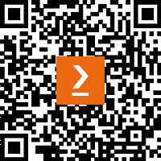

# 前言

恭喜你，亲爱的读者！在过去大约 15 年里，云平台的使用取得了巨大的增长。亚马逊的 AWS 在 2006 年正式推出，微软的 Azure 和**谷歌云平台**（**GCP**）随后在 2008 年推出。市面上有许多云平台，但 AWS、Azure 和 GCP 是最受欢迎的。AWS、Azure 和 GCP 使企业、组织和公司能够部署比自己在本地基础设施上能做的更强大、可扩展的网络。许多组织甚至在其网络中使用不止一个云平台。

云网络与公共互联网连接，因此自然容易受到各种网络攻击的威胁。随着云平台的日益普及，企业意识到需要保护其云网络以确保商业成功，具备云渗透测试技能的人才在国际就业市场上非常抢手。通过学习如何在云平台上模拟网络攻击以进行安全测试，无论你身在何处，你的能力都会受到青睐。

在云平台进行渗透测试和红队演练与在公司本地网络中进行测试有根本的不同，因为亚马逊、微软和谷歌拥有基础设施。作为渗透测试人员，你必须遵守比你所在组织的规则和政策更多的规定和政策。本书将教你如何以云原生的方式进行渗透测试和红队演练。

# 本书适用对象

本书适用于有经验的渗透测试人员以及刚开始学习渗透测试的人。如果你有传统本地网络渗透测试的经验，本书将教你如何在 AWS、Azure 和 GCP 中进行渗透测试，并与本地网络测试有所不同。如果你刚刚开始学习渗透测试，这本书是一个很好的起点，因为云计算是渗透测试的未来。无论哪种情况，你都应该对计算机网络有一定了解，并渴望提升自己的技能。

# 本书内容

*第一章*，*企业如何利用和实施云网络？*，介绍了 AWS、Azure 和 GCP，混合云、全云和多云网络之间的差异，软件即服务、平台即服务和基础设施即服务，以及组织与云服务提供商之间共享的网络安全责任。在你开始进行 AWS、Azure 和 GCP 的渗透测试之前，了解企业为什么以及如何使用这些云平台非常重要。

*第二章*，*云网络如何遭受网络攻击？*，研究了云网络如何容易受到各种网络攻击。本章解释了外部和内部的各种网络攻击类型，以及影响计算机数据的机密性、完整性和可用性的攻击，这些都是基于 CIA 三原则的网络安全模型。你将通过模拟一些网络威胁行为者的操作来测试云网络的安全性。

*第三章*，*今天云网络渗透测试的关键概念*，介绍了适用于所有云渗透测试的核心概念和流程。在进行渗透测试或红队任务之前，安全专家必须了解渗透测试目标的状态和范围。你需要进行漏洞评估，以发现暴露的服务和集成，一旦渗透测试完成，你需要有效地分享你的发现，以便改善客户的安全态势。

*第四章*，*AWS 中的安全特性*，探索了 AWS 特有的一系列功能、应用程序和工具，以及它们对渗透测试人员的影响。本章还涵盖了 AWS 的安全策略和安全工具。

*第五章*，*通过无服务器应用和工具进行 AWS 特性渗透测试*，讨论了进行最成功的 AWS 渗透测试所需的最相关和最有效的安全特性和工具。AWS 有许多特定的安全控制、安全特性和渗透测试工具，包括第一方和第三方工具。

*第六章*，*在 AWS 中渗透测试容器化应用程序*，深入探讨了在 AWS 中如何部署和管理 Docker 与 Kubernetes 的具体技术细节。企业越来越多地在 AWS 中部署容器化应用，以充分利用容器化的可扩展性进行虚拟化。你将学习到一些在 AWS 中容器化平台运行时独有的渗透测试技巧。

*第七章*，*Azure 中的安全特性*，探索了 Azure 特有的一系列功能、应用程序和工具，以及它们对渗透测试人员的影响。本章还涵盖了 Azure 的安全策略和安全工具。

*第八章*，*通过无服务器应用和工具进行 Azure 特性渗透测试*，分析了进行最成功的 Azure 渗透测试所需的最相关和最有效的安全特性和工具。Azure 有许多特定的安全控制、安全特性和渗透测试工具，包括第一方和第三方工具。

*第九章*，*在 Azure 中渗透测试容器化应用程序*，涵盖了 Docker 和 Kubernetes 在 Azure 中如何部署和管理的具体技术细节。企业越来越多地在 Azure 中部署容器化应用程序，以充分利用容器化虚拟化的可扩展性。你还将学习到针对这些容器化平台在 Azure 中运行的渗透测试技术。

*第十章*，*GCP 中的安全功能*，深入探讨了 GCP 特有的大量功能、应用程序和工具，以及它们对渗透测试人员的影响。本章还涵盖了 GCP 的安全政策和安全工具。

*第十一章*，*通过无服务器应用程序和工具进行 GCP 功能渗透测试*，研究了进行最成功的 GCP 渗透测试的最相关和有效的安全功能和工具。有许多特定于 GCP 的安全控制、安全功能和渗透测试工具，包括第一方和第三方工具。

*第十二章*，*在 GCP 中渗透测试容器化应用程序*，涵盖了 Docker 和 Kubernetes 在 GCP 中如何部署和管理的具体技术细节。企业越来越多地在 GCP 中部署容器化应用程序，以充分利用容器化虚拟化的可扩展性。你还将学习到针对这些容器化平台在 GCP 中运行的渗透测试技术。*

*第十三章*，*最佳实践与总结*，回顾了在 AWS、Azure 和 GCP 中执行渗透测试练习后所学到的内容。本章还解释了在渗透测试和红队演练前后需要进行的工作。最重要的是，你需要与所在组织定义一个遵守 AWS、Azure 和 GCP 政策的测试范围，签署正式化你责任与范围的法律文件，并撰写一份渗透测试报告，帮助公司领导和防御安全团队提升网络的网络安全性。

# 为了充分利用本书

你将需要以下设备：

| **书中涵盖的软件/硬件** | **操作系统要求** |
| --- | --- |
| AWS 网页控制台：[aws.amazon.com](https://aws.amazon.com) | Windows 7、8、10 或 11，macOS 11–14，或当前支持的 Linux 发行版，以及 Safari、Edge、Chrome、Firefox 或 Opera 浏览器的当前支持版本 |
| Microsoft Azure 网页控制台：[azure.microsoft.com](https://azure.microsoft.com) | Windows 7、8、10 或 11，macOS 11–14，或当前支持的 Linux 发行版，以及 Safari、Edge、Chrome、Firefox 或 Opera 浏览器的当前支持版本 |
| Google Cloud Platform 网页控制台在 [console.cloud.google.com](https://console.cloud.google.com) | Windows 7、8、10 或 11，macOS 11–14，或当前支持的 Linux 发行版，支持的 Safari、Edge、Chrome、Firefox 或 Opera 浏览器版本 |
| Prowler | 在 AWS、Azure 和 GCP 中支持；端点操作系统无关 |
| Pacu | 在 AWS 中支持，端点操作系统无关 |
| Cred Scanner | 在 AWS 中支持，端点操作系统无关 |
| CloudFrunt | 在 AWS 中支持，端点操作系统无关 |
| Redboto Python 脚本 | 在 AWS 中支持，端点操作系统无关 |
| Docker Desktop | Windows 7、8、10 或 11，macOS 11–14，或当前支持的 Linux 发行版 |
| ScoutSuite | 在 AWS、Azure 和 GCP 中支持；端点操作系统无关 |
| MFASweep | 在 Azure 中支持，端点操作系统无关 |
| kube-hunter | 在所有当前版本的 Kubernetes 中支持；端点操作系统无关 |
| kdigger | 在所有当前版本的 Kubernetes 中支持；端点操作系统无关 |
| GCPBucketBrute | 在 GCP 中支持，端点操作系统无关 |
| GCP 扫描器 | 在 GCP 中支持，端点操作系统无关 |

# Code in Action

本书的*Code in Action*视频可以在 [`bit.ly/3rWmFnS`](https://bit.ly/3rWmFnS) 上观看。

免责声明

本书中的信息仅应以道德方式使用。如果没有设备所有者的书面许可，请不要使用本书中的任何信息。如果你进行非法行为，可能会被逮捕并依法追究责任。如果你滥用本书中的任何信息，Packt Publishing 不承担任何责任。书中的信息只能在经过适当授权的测试环境中使用。

# 约定使用

本书中使用了一些文本约定。

**文本中的代码**：表示文本中的代码字、数据库表名、文件夹名称、文件名、文件扩展名、路径名、虚拟 URL、用户输入和 Twitter 账号。例如：“将下载的**WebStorm-10*.dmg**磁盘镜像文件挂载为系统中的另一个磁盘。”

任何命令行输入或输出按如下格式编写：

```
pip install --upgrade pip 
pip install prowler
```

**粗体**：表示新术语、重要单词或屏幕上显示的单词。例如，菜单或对话框中的单词显示为**粗体**。例如：“从**管理**面板中选择**系统信息**。”

提示或重要说明

如下所示。

# 与我们联系

我们始终欢迎读者的反馈。

**一般反馈**：如果你对本书的任何部分有疑问，请通过电子邮件联系我们：customercare@packtpub.com，并在邮件主题中注明书名。

**勘误表**：虽然我们已尽力确保内容的准确性，但仍然可能出现错误。如果您在本书中发现错误，我们将非常感激您向我们报告。请访问[www.packtpub.com/support/errata](https://www.packtpub.com/support/errata)并填写表格。

**盗版**：如果您在互联网上遇到任何形式的非法复制品，我们将非常感激您提供该材料的地址或网站名称。请通过版权@packt.com 与我们联系并提供链接。

**如果您有兴趣成为作者**：如果您在某个领域具有专业知识并且有兴趣编写或参与编写一本书，请访问[authors.packtpub.com](https://authors.packtpub.com)。

# 分享您的想法

阅读完*《云渗透测试：红队实战》*后，我们很想听听您的想法！请点击这里直接前往本书的亚马逊评价页面，分享您的反馈。

您的评价对我们和技术社区非常重要，它将帮助我们确保提供优质的内容。

# 下载本书的免费 PDF 副本

感谢您购买本书！

您喜欢在路上阅读，但无法随身携带纸质书籍吗？

您的电子书购买无法与您选择的设备兼容吗？

不用担心，现在购买任何 Packt 书籍，您都可以免费获得该书的 DRM-free PDF 版本。

随时随地，在任何设备上阅读。直接从您最喜欢的技术书籍中搜索、复制和粘贴代码到您的应用中。

优惠不仅仅是这些，你还可以每天在邮箱中获得独家折扣、新闻通讯和精彩的免费内容。

按照这些简单的步骤获取福利：

1.  扫描二维码或访问下面的链接



[`packt.link/free-ebook/9781803248486`](https://packt.link/free-ebook/9781803248486)

2. 提交您的购买证明

3. 就是这样！我们将直接通过电子邮件发送您的免费 PDF 和其他福利。

# 第一部分：今天的云网络及其安全影响

渗透测试人员和红队成员测试计算机系统的安全性。在本书中，您将学习如何渗透测试的计算机系统是云应用和网络。在开始测试之前，您应该了解您正在测试的内容！因此，在这一部分，我们将学习各种云服务和应用的类型，为什么组织使用它们，以及它们是如何配置和部署的。我们还将学习渗透测试和红队的基础知识。这些知识将为您在本书中学习的其他内容奠定基础。

本节包含以下章节：

+   *第一章*，*企业如何利用和实施云网络？*

+   *第二章*，*云网络如何遭受网络攻击？*

+   *第三章*，*当今云网络渗透测试的关键概念*
