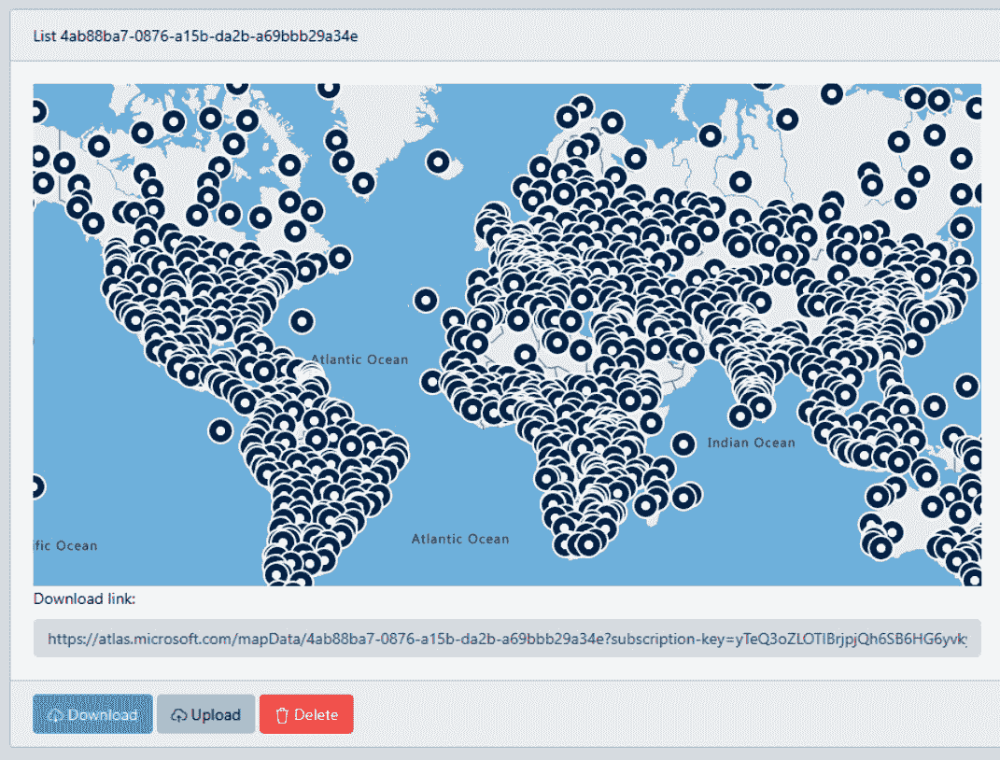
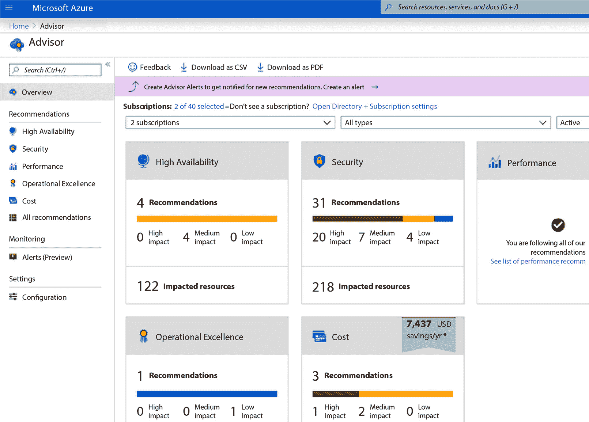
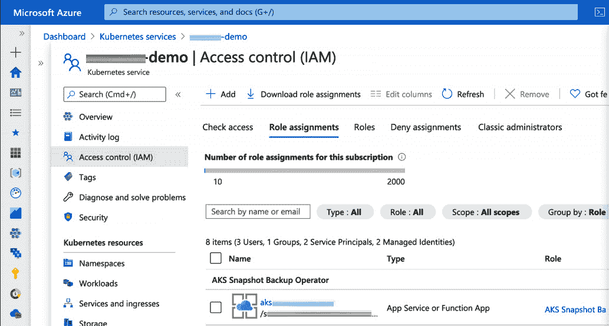
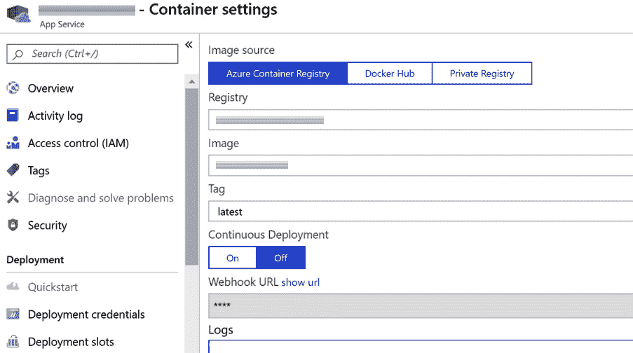
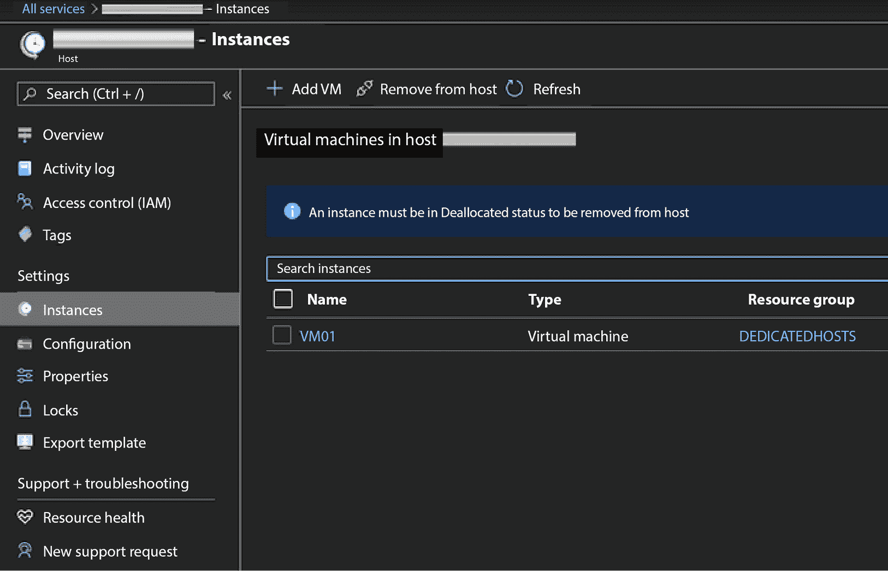

# 7

# Azure 中的安全功能

作为一名云渗透测试员，了解 Azure 这一最受欢迎的云平台之一是非常重要的。你可能会经常进行 Azure 网络和应用的渗透测试。

本章中，我们将首先检查 Azure 生态系统中最常用的方面，以及最受欢迎的 Azure 服务、应用和功能，以及它们为何被使用。接下来，我们将探讨 Azure **软件即服务**（**SaaS**）、**基础设施即服务**（**IaaS**）和 **平台即服务**（**PaaS**）功能。最后，我们将讨论微软自有的 Azure 安全工具和第三方安全工具。

本章涵盖以下主要主题：

+   Azure 介绍

+   常用的 Azure SaaS 应用

+   Azure IaaS 应用

+   Azure PaaS 应用

+   Azure 安全控制与工具

让我们直接开始吧！

# Azure 介绍

在 2000 年代初期，微软的数据中心基础设施比现在的云平台竞争对手 Amazon 和 Google 要小。但微软的财力相对雄厚。当它在 2002 年推出 Xbox Live（现为 Xbox 网络）时，已经构建了庞大的后台基础设施，以支持当时世界上最大容量的在线游戏服务。从那时起，微软不断扩大其数据中心容量，进入网络服务行业（MSN 不算）并与其视频游戏主机业务同步扩展。

从我了解的情况来看，微软为消费市场打造 Xbox Live/ Xbox 网络的经历，为其提供了进入企业市场提供网络服务的经验。2002 年，亚马逊以“*Amazon.com Web Services*”推出了 AWS，旨在为企业提供云服务。微软可能想，“我也想参与这场竞争。”

这花费了几年的研究和开发，以及更多的基础设施建设。但到 2008 年 10 月，微软准备宣布“红狗计划”。

红狗计划（Project Red Dog）

红狗计划是微软的云操作系统项目，是 Azure 的前身。并没有所谓的“红狗”操作系统；它演变成了本章提到的 Azure 服务。

到 2010 年，微软的新云服务以 Windows Azure 推出，2014 年更名为 Microsoft Azure。

与其主要竞争对手 Amazon 和 Google 一样，微软在过去几年里一直稳步向其云平台添加新功能和服务。

微软的一大优势是其在市场上占据主导地位的商业操作系统和应用程序。大量使用 Windows Server 和 Active Directory 的企业，在 Azure 托管云网络和应用程序时能够获得极大的协同效应。AWS 和 GCP 也可以与 Windows Server 和 Active Directory 一起使用，但那就像是法国人做的意大利菜。而 Windows Server 和 Microsoft Azure 就像是意大利人做的意大利菜！因此，许多组织选择将 Azure 集成到其网络中，无论其云是完全使用 Azure 还是多云环境。

在进行任何 Azure 网络渗透测试之前，确保遵守微软的*渗透测试参与规则*是很重要的。以下是微软官网上所述内容（[`www.microsoft.com/en-us/msrc/pentest-rules-of-engagement`](https://www.microsoft.com/en-us/msrc/pentest-rules-of-engagement)）：

“*该计划的目标是让客户能够在不对其他微软客户造成损害的情况下，测试其在微软云服务中托管的服务。*

*以下活动* *是禁止的：*

+   *扫描或测试属于任何其他微软* *云客户的资产。*

+   *访问任何非完全属于* *自己的数据。*

+   *进行任何形式的拒绝服务* *测试。*

+   *对任何资产进行网络密集型模糊测试，除了你的 Azure* *虚拟机。*

+   *对生成大量流量的服务进行* *自动化测试。*

+   *故意访问任何其他* *客户的数据。*

+   *超越“概念验证”步骤，解决基础设施执行问题（例如，证明你通过 SQLi 获得了 sysadmin 访问权限是可以接受的，但运行 xp_cmdshell* *则不行）。*

+   *以违反《微软在线服务条款》中所述的可接受使用政策的方式使用我们的服务。*

+   *尝试进行钓鱼或其他社交工程攻击* *针对我们的员工。*

*以下活动* *是鼓励的：*

+   *创建少量测试账户和/或试用租户，用于演示和证明跨账户或跨租户的数据访问。然而，禁止使用其中一个账户访问另一个客户* *或账户的数据。*

+   *对自己的 Azure* *虚拟机进行模糊测试、端口扫描或运行漏洞评估工具。*

+   *通过生成正常业务过程中预期的流量进行应用程序负载测试。这包括测试* *激增容量。*

+   *测试安全监控和检测（例如，生成异常安全日志，丢弃* *EICAR 等）。*

+   *尝试从共享服务容器中突破，如 Azure 网站或 Azure Functions。如果成功，你必须立即向微软报告并停止进一步探索。故意访问其他客户的数据是* *违反条款的行为。*

+   *在 Microsoft Intune 中应用条件访问或移动应用管理（MAM）策略，以测试这些策略强制执行的限制。*

*即使有这些禁止性规定，微软保留对其网络中任何看起来具有恶意性质的行为作出响应的权利。微软云中采用了许多自动化的缓解机制，这些机制不会因为渗透测试而被禁用。*

简而言之，你可以在 Azure 中进行渗透测试，而无需获得微软的许可。但你所能做的事情是有限制的。你不能执行可能干扰其他 Azure 客户的活动，例如**分布式拒绝服务**（**DDoS**）攻击模拟或压力测试。你甚至不能尝试访问不属于你所在公司的 Azure 数据和资产。模拟犯罪基础设施执行漏洞是严格禁止的。你可以对公司自己的服务和应用进行负载测试，但不能生成超过正常操作所需的数据或消耗更多带宽。微软鼓励你创建新的用户账户来测试身份和访问管理（IAM）问题，只要你不尝试访问不属于你所在公司的数据。当然，你还需要公司书面许可才能进行任何形式的渗透测试、安全测试或红队活动。

Microsoft Azure 是一个独特的云平台。但在许多方面，它与 AWS 和 GCP 相似。与 AWS、GCP 以及许多其他云提供商一样，Azure 提供了广泛的云服务，这些服务可以根据微软负责的程度和客户（你所在的公司）负责的程度进行分类。与其他云平台一样，所有 Azure 服务可以分为 SaaS、PaaS 或 IaaS。

无论服务是 SaaS、PaaS 还是 IaaS，组织都要对其自身数据的安全负责。如果客户自己的代码中的软件漏洞在网络攻击中被利用，这是客户需要处理的问题。微软提供了许多非常有用的安全工具，能够大大改善组织在 Azure 中的安全态势，但必须实际使用这些工具，它们才能发挥作用。

无论如何，微软负责其 Azure 基础设施的安全。这也是为什么没有人被允许在没有微软明确许可和严格监督的情况下访问其任何数据中心。这也是为什么在执行渗透测试和红队活动时，渗透测试人员在 Azure 中的权限受到限制的原因。客户对云中的安全负责；云服务提供商对云的安全负责。客户自己的代码和应用程序是他们的事；微软的服务器、网络设备、数据中心建筑和微软自己的代码是微软的事。

*第三章*详细介绍了云计算的共享责任模型。但为了方便起见，你可以查看微软的 *渗透测试参与规则*（[`www.microsoft.com/en-us/msrc/pentest-rules-of-engagement`](https://www.microsoft.com/en-us/msrc/pentest-rules-of-engagement)）和 *微软在线订阅协议*（[`azure.microsoft.com/en-us/support/legal/subscription-agreement/`](https://azure.microsoft.com/en-us/support/legal/subscription-agreement/)）。在你开始任何 Azure 渗透测试之前，务必理解并遵守微软的规则。因此，查阅这些资源并重新阅读 *第三章*，确保你了解你被允许做的事情和禁止的事项。如果你所在的组织要求你做微软禁止的事情，那么微软的权威将优于他们的。当你在 Azure 进行渗透测试时，你是在微软的“家”里做客。

SaaS、PaaS 和 IaaS 表示 Azure 服务中有多少部分是属于微软的，且你所在公司的责任和自主权有多少。在 SaaS 中，很多软件代码归微软所有。你的公司需要做的工作最少（相对于 PaaS 和 IaaS）。你公司的数据运行在微软的在线应用中。在 IaaS 中，微软提供的是自己的基础设施，其他几乎没有。你的组织拥有最多的灵活性和控制权，但也必须构建和维护几乎所有的软件代码和网络配置，这些都是在微软的基础设施中使用的。PaaS 介于这两者之间。PaaS 提供比 IaaS 更多的微软 API 和服务功能。微软提供一个应用程序和服务平台，但它支持你组织自己的软件。

现在，让我们探索一下最常用的 Azure 服务。

# 常用的 Azure SaaS 应用程序

我将总结 Azure 中最受欢迎的 SaaS 应用程序。你不太可能对它们进行渗透测试，因为微软在其 SaaS 的安全性方面负有更多责任，而不是 PaaS 和 IaaS。你的公司只是将自己的数据输入到这些应用程序中，或者将它们嵌入到自己的应用程序中。但作为一个 Azure 渗透测试员，理解 Azure 的多种使用方式非常重要，这样你才能将 SaaS 与 Azure 其他部分的关系进行背景化，并了解你所在公司如何使用 Azure 的 SaaS 应用程序。此外，你所在组织输入到 Azure SaaS 应用程序中的数据是你们组织的安全责任。例如，如果你所在组织的某个人将他们的敏感银行账户信息输入到 Microsoft Cost Management 中，而绕过了微软所实现的加密，那么这是你们组织的问题。如果你的组织有一个与 SaaS 应用程序接口的 PaaS 或 IaaS 应用程序，那么这个数据流很可能可以从 PaaS 或 IaaS 端进行渗透测试。

## Azure Maps

**Azure Maps** 类似于 Google Maps。它提供了几乎所有建设区域的详细地图。内置功能使用 IP 和 GPS 地理定位，用户可以看到自己在地图上的位置以及目的地。Azure Maps 可以集成到 Azure 客户开发的移动应用和网页应用中。例如，企业可以在其网页上嵌入一个 Azure Maps 小组件，展示其实体位置的地图。Azure Maps 在 GitHub 上有大约 250 个不同的代码示例（[`samples.azuremaps.com/`](https://samples.azuremaps.com/)），使开发者的集成工作变得简单。代码示例涵盖了从在地图上为多个点添加动画，到展示带有不同类型地理和气象数据的不同地图层，再到使用 Azure Maps Web Control 实现室内空间地图等内容。

图 7.1 – Azure Maps 截图

Azure Maps 提供多种数据流，涵盖交通、天气、摄影图像和数据可视化。例如，哪里是最高的山峰和最深的峡谷？哪一地区的年降水量最多？零售商的所有门店都在哪些地方？Azure Maps 的数据可视化功能可以与商业客户自己的数据进行配合。

## Azure Digital Twins

**Azure Digital Twins** 使用客户自己的物联网设备来创建物理对象、业务流程和地点的数字模型。当物联网设备检测到物理环境的变化时，Azure Digital Twins 可以相应地调整数字模型。它与 REST API、Azure IoT Hub、Logic Apps、Event Hubs、Azure Data Explorer 和 Azure Synapse Analytics 集成。虽然有点奇怪，但也有点酷。

## Azure Monitor

前两个应用程序（Azure Maps 和 Azure Digital Twins）更为专业化。但 **Azure Monitor** 则更加通用。Azure Monitor 可以进行配置，使组织通过动态仪表板界面查看广泛的业务网络数据。度量、日志、变化和跟踪会传送到 Azure Monitor。然后，管理员可以观察不同的网络事件，其中并非所有事件都直接与安全事件相关。你还可以显示实时数据，查看如“*有多少用户在使用哪些应用程序，* *以及何时使用？*”等指标。

Azure Monitor 集成到每一个可能的 Azure 服务和应用程序中。你还可以通过 Azure Arc 实现来自其他云服务提供商（多云环境）和本地网络的数据。

## Microsoft 成本管理

**Microsoft 成本管理** 为 Azure 客户提供有关他们在各种 Azure 服务、应用程序和功能上的支出非常详细的信息。它有详细的面板，用于成本分析、成本警报、预算数据、账单费用和使用情况，以及与公司部门和账户相关的 Azure 成本。

可以显示图表，展示客户在 Azure 服务上的支出趋势和模式。会计人员和 **首席财务官**（**CFO**）对此类信息非常喜爱。它不仅仅是“*我们公司本月在 Azure 上花费了 $25,657*。” Microsoft 成本管理展示了所有可以在会计账本中显示的 Azure 支出指标。因此，当然，客户可以看到饼图，展示整体 Azure 支出的各个相关类别。

## Azure Advisor

**Azure Advisor** 类似于 Microsoft 成本管理，但它显示的是与安全性、可靠性、性能、运营卓越性和成本相关的各种指标，而非预算和账单信息：

图 7.2 – Azure Advisor 截图

可以通过 **Azure 命令行界面**（**Azure CLI**）、Advisor API 或 Azure 门户启动 Azure Advisor，以显示相关的度量数据。如果管理员问“*我们如何更有效地管理 Azure 资源和应用程序？*”，Azure Advisor 将提供所需的信息，帮助他们做出这些决策。

## 网络观察器

**Network Watcher** 是一种全面的网络性能监控和诊断解决方案。它显示带有动态实时网络度量的仪表板，涵盖 **虚拟机**（**VMs**）、**虚拟专用网络**（**VPNs**）和网络流量模式。

查看组织中每个部分使用的 Azure 云网络带宽！通过安全中心查看一般安全指标、资源安全卫生、安保警报和合规数据。网络观察器也可以用来诊断各种连接性问题。

现在我们已经了解了 SaaS，让我们来看看 IaaS。虽然 SaaS 将最大控制权和安全责任交给微软，但 IaaS 则将大部分控制权和安全责任交给你所在的组织。

# Azure IaaS 应用程序

Azure IaaS 仅为你的组织提供关于软件代码的基础内容。你所在的组织在 IaaS 中部署的大多数代码都属于你的组织，并且就网络安全而言是你组织的责任。

这里是 Azure 中一些最常用的 IaaS 应用程序。

## Azure 虚拟机

**Azure 虚拟机**使你的组织能够部署带有 Windows 和 Linux 的虚拟机。你可以部署大量的虚拟化 Windows 和 Linux 服务器，用于执行 Linux 和 Windows 服务器的所有任务，从运行大型企业应用程序到部署 Web 服务器和其他类型的互联网服务。

## Azure Kubernetes 服务

**Azure Kubernetes 服务**（**AKS**）支持 Azure 中的 Kubernetes 容器化编排 ([`azure.microsoft.com/en-ca/products/kubernetes-service/`](https://azure.microsoft.com/en-ca/products/kubernetes-service/))。

AKS 是专为 Kubernetes 集群设计的，因此它是部署基于 Kubernetes 的应用程序到 Azure 的最佳方式。我能够在几分钟内通过 AKS 在 Azure 上部署 Kubernetes，而在没有 AKS 的情况下在 Azure 上部署 Kubernetes 至少需要数小时的工作，并且过程充满麻烦：

图 7.3 – AKS 的截图

有关 AKS 的更多信息，请参考*第九章*！

## Azure 容器实例

**Azure 容器实例**（**ACI**）使 Azure 客户能够开发和部署自己的软件应用程序，而无需管理虚拟机或学习新工具：

图 7.4 – ACI 的截图

ACI 可以与 AKS 和 Azure Functions（更多内容将在下一节介绍）一起使用，以支持具有大量容器的复杂应用程序。

## Azure 专用主机

**Azure 专用主机**是用于托管运行 Windows 和 Linux 的 Azure 虚拟机的专用物理服务器。是的，通过 Azure 专用主机，你的组织可以在微软的场地上拥有自己的物理服务器。这是一个相对昂贵的选择，适合那些有预算的企业，但它为企业提供了在 Azure 生态系统中能够获得的最大控制权：

图 7.5 – Azure 专用主机的截图

现在，让我们来看看 Azure 中的 PaaS。

# Azure PaaS 应用程序

Azure PaaS 在控制和自主性方面介于 SaaS 和 IaaS 之间，具体取决于 Azure 客户（例如你所在的商业组织）。

在 PaaS 中，Azure 提供平台。只有 Azure SaaS 提供 Azure 自己的完整应用程序，客户可以将数据部署到其中，而 Azure IaaS 基本上提供 Azure 的服务器硬件和网络基础设施，几乎没有 Azure 的代码。在 IaaS 部署中，绝大多数代码属于客户，并由客户负责。

这是 Azure PaaS 服务，客户在这些平台系统中运行他们开发的应用，而这些系统由 Microsoft 开发。

## Azure SQL 数据库

**Azure SQL 数据库**使客户能够构建带有 SQL 数据库的应用程序。SQL 是顶级的供应商中立数据库开发技术之一。需要后端服务支持的各种类型的应用程序使用 SQL，不仅仅是移动应用或 web 应用。

## Web 应用

**Web 应用**用于托管 ASP.NET web 应用程序。ASP.NET 是一个开发平台，提供构建 web 应用的工具、编程语言和库。它使用 HTML、CSS、JavaScript、Node.js、Python、Java 和 C#。

## 移动应用

**移动应用**是 Microsoft Azure 提供的服务，用于部署各种 iOS 和 Android 应用的后台。它通过 Azure Active Directory 部署**单点登录**（**SSO**）认证，支持与 Facebook、Twitter 和 Google 的 API 集成。它还使应用能够在长时间离线的情况下工作，尽管移动应用应定期在线以进行同步。

## Azure 逻辑应用

**Azure 逻辑应用**是一个非常专业的逻辑应用开发工具。逻辑应用可以创建和自动化工作流，而无需编写大量代码。逻辑应用可以通过图表构建，其中事件触发相应的动作。

## Azure Functions

**Azure Functions**是一个无服务器计算平台，意味着 Azure 客户可以部署应用程序而无需管理服务器。Azure Functions 是事件驱动的，这意味着如果在你组织开发的应用程序中发生某些定义的事件，Azure Functions 将根据你定义的方式响应这些事件（[`azure.microsoft.com/en-us/products/functions/`](https://azure.microsoft.com/en-us/products/functions/)）。

现在，让我们看看 Microsoft 为 Azure 用户提供的用于管理网络安全的应用程序。

# Azure 安全控制和工具

可以使用 Microsoft Azure 部署具有卓越安全性的云网络。但是，网络安全是日常工作。作为一名云渗透测试员，你将执行渗透测试、红队演练和漏洞扫描，这些工作将为组织提供所需的漏洞数据，帮助其不断加强网络和应用的安全性。防御安全专家需要将你的安全建议付诸实践，并且实际使用 Microsoft 为 Azure 提供的各种安全工具。

使用 Azure 可以实现卓越的网络安全。但你需要付出努力，并使用 Microsoft 提供的工具！

## 安全控制

微软提供了多个应用程序，帮助你的组织维护其在 Azure 中的应用和服务的网络安全。这些应用同样对于渗透测试人员检查 Microsoft 自身安全控制能够发现的安全警报和漏洞非常有用。

以下是微软提供的主要安全控制措施，用于确保 Azure 的安全。

### Microsoft Defender for Cloud

**Microsoft Defender for Cloud** 是其主要的统一云原生应用保护平台。如果你已经熟悉 Windows 中的 Microsoft Defender，Microsoft Defender for Cloud 包含了许多这些功能，并且在此基础上进行了扩展，增加了保障云网络安全所需的功能。

Microsoft Defender for Cloud 不仅提供对 Azure 中安全状况的可见性，还能在 AWS、GCP 和组织的本地网络中提供可见性。它为各种服务提供反恶意软件和安全监控。管理员可以看到经过优先级排序的关键风险，并具有上下文感知的安全性。它还提供 **扩展检测与响应** (**XDR**) 来检测和响应网络攻击。你甚至可以看到有关网络合规性的实时数据。

如果 Microsoft Defender for Cloud 正在你进行渗透测试的服务中运行，组织应该能够看到你正在模拟的网络攻击的详细信息！

### Microsoft Defender 外部攻击面管理

**Microsoft Defender 外部攻击面管理** (**Defender EASM**) 基于 Microsoft Defender 的基本功能进行扩展。组织可能会有独特的外部网络攻击面。Defender EASM 会发现未知的资源，帮助组织全面了解其安全状况。

Defender EASM 动态工作并实时更新，因此管理员可以在新的外部面向资源出现时获得警报。

注意

Shadow IT 是许多组织中的一个重大问题。Shadow IT 是指员工、承包商及其他公司内部人员在使用公司网络时，使用了自己的应用程序和设备。Shadow IT 的问题在于，内部人员将新技术引入公司网络时，这些技术并未由公司的网络安全或 IT 团队进行管理。因此，Shadow IT 可能会引入新的攻击向量、漏洞和恶意软件，而组织往往对此毫不知情。Shadow IT 是 Defender EASM 能够检测和缓解的众多外部风险之一。

### Azure DDoS 保护

**Azure DDoS 保护**顾名思义。在 DDoS 攻击中，网络攻击者通过巨大的恶意数据流量淹没你的应用和网络服务，目的是使它们崩溃。这是对网络安全中机密性、完整性和可用性（CIA 三元组）中的“可用性”发起的重大攻击。*分布式*部分意味着攻击者利用多个分布式机器来执行攻击。DDoS 攻击最常用的方法是使用僵尸网络，这些设备通常是被恶意软件感染的计算设备，包括任何类型的 PC、服务器、手机、平板电脑、物联网设备和路由器。攻击者通过其**指挥与控制**（**C2**）服务器控制这些僵尸网络。因此，僵尸网络提供了大量计算能力，可用于执行 DDoS 攻击。

Azure DDoS 保护使用自适应的**威胁智能**（**TI**）结合**人工智能**（**AI**）和 DDoS 缓解能力。后者功能利用微软的数据处理和网络基础设施，在攻击者的大量恶意数据对你的组织 Azure 服务和应用造成损害之前，将这些数据吸收掉。

### Azure Bastion

**Azure Bastion**使得组织能够以安全的方式部署对虚拟机的远程访问。这是一个常见需求，因为如今企业支持的远程工作者比以往任何时候都多。如果员工从家里连接到他们雇主的 Azure 托管虚拟机，应通过 Azure Bastion 进行路由。

可以随时在 Azure 门户中发起 RDP 和 SSH（常见远程网络互联网协议）会话的直接连接。你组织的虚拟机无需额外的软件即可使用 Azure Bastion。Azure Bastion 与防火墙和其他安全控制集成。最重要的是，Azure Bastion 防止分配给虚拟机的 IP 地址暴露给公众。这使得外部网络攻击者更难访问并危害你组织的虚拟机。

### Azure 防火墙

**Azure 防火墙**旨在安全地管理并限制对组织 Azure **虚拟网络**（**VNet**）的访问。可以动态拒绝来自恶意 IP 地址和域的流量。它使用**传输层安全性**（**TLS**）来防止通过加密会话传播恶意软件。网络和应用防火墙规则可以在组织的所有虚拟网络中进行管理。

Azure 防火墙还具备内置的**入侵检测与防御系统**（**IDPS**）功能，能够生成安全事件警报，输出日志，并实时阻止多种攻击。因此，它不仅具有根据一系列安全规则阻止或过滤流量的基本防火墙功能，还通过使用**机器学习**（**ML**），根据你组织的网络流量模式，随着时间推移不断提升其功能。

### Azure Web 应用防火墙

**Azure Web 应用程序防火墙**（**WAF**）是一个专门针对 Web 应用程序的防火墙。**开放 Web 应用程序安全项目**（**OWASP**）是一个维护 Web 安全标准的组织，包括其十大安全风险。Azure WAF 专门设计用来缓解这些风险。

针对 Web 应用程序和 Web 服务器的特定技术有很多，因此 Azure WAF 被设计为在这种用例中本地工作。

### Azure 防火墙管理器

**Azure 防火墙管理器**作为一个独立的应用程序列出。它仅作为 Azure 防火墙的配置和管理界面。它为管理员提供一个统一的控制平面仪表板，让他们可以随时看到 Azure 防火墙的所有操作，并查看安全警报。多个 Azure 防火墙实例可以通过一个 Azure 防火墙管理器控制平面进行管理。它还可以与第三方**安全即服务**（**SECaaS**）应用程序集成。

### Microsoft Sentinel

**Microsoft Sentinel**是一个**安全信息和事件管理**（**SIEM**）系统，直接集成到 Azure 中。如果你的组织有**安全运营中心**（**SOC**），他们可能会使用它。

SOC 是做什么的？

SOC 是一个防御性网络安全团队和部门，负责实时监视安全事件和事故并对其做出响应。

SIEM 系统分析输入到系统中的各种网络和服务器日志，并在看起来可能发生安全事件（通常是网络攻击）时，向 SOC 分析人员显示安全警报。

SOC 在**事件响应**（**IR**）中扮演着重要角色。他们的工作是在攻击或泄露发生时尽早缓解或遏制事件，以尽可能减少损害。

通俗来说，使用 Microsoft Sentinel，SOC 分析人员可以查看一个控制平面和仪表板，显示通过网络和应用程序活动发现有不良事件正在发生。当确实出现严重问题时，SOC 分析人员会收到通知，内容大致是“*危险，危险！*”。然后，他们可以使用 Microsoft Sentinel 调查该事件，帮助阻止坏事发生。

### 密钥保管库

**密钥保管库**存储了你组织在 Azure 中使用的各种加密密钥和机密。密钥和机密用于获取对敏感数据和应用程序的特权访问。如果这些密钥落入不当之手，那将是非常危险的。因此，它们被保存在一个比喻的保险库中！

密钥保管库确保应用程序无法直接访问密钥。密钥既可以由密钥保管库创建，也可以导入到密钥保管库中。

你组织尽可能多的传输数据和存储数据应当被加密。这是*网络安全基础 101*的一部分。将明文数据加密为密文垃圾串，保护了 CIA 三原则中的机密性和完整性。

Azure 拥有您组织需要的所有工具，以确保所有存储和传输中的数据都经过强加密。应使用 Key Vault，以确保未经授权的人员和网络攻击者无法“解锁”其中任何数据。

### Microsoft Azure Attestation

**Microsoft Azure Attestation** 存在的原因是，组织部署的 Azure 云不仅仅实现了 Azure 生态系统内的实体。许多组织还将第三方服务和应用程序集成到其 Azure 网络中。Microsoft Azure Attestation 在与这些平台交互之前，验证第三方平台的身份和安全态势。

您的组织有许多不同的安全政策、基准和标准。Microsoft Azure Attestation 将验证这些是否可以在第三方平台上建立。如果可以，Microsoft Azure Attestation 可以确保这些安全政策、基准和标准通过这些平台得以执行。

Active Directory 是 Windows Server 用来管理用户账户、用户组和管理员账户安全的工具。**Azure Active Directory** 将这些 IAM 功能扩展到 Azure。

控制用户账户可以执行的操作是安全运营的重要组成部分，同时确保这些账户具有适当的身份验证和授权也至关重要。控制平面提供了账户使用情况的完全可视化。Azure Active Directory 还实现了 SSO 和 **多因素认证**（**MFA**）系统。MFA 是绝对必要的！MFA 通常不是默认启用的，但它应该是。即使是最强的密码也容易受到数据泄露和某些类型的密码分析攻击的威胁。通过生物识别和 **一次性密码**（**OTP**）/PIN 应用等额外的身份验证方式来增强密码的安全性，可以大大提高账户的安全性。

### Azure 信息保护

**Azure 信息保护**（**AIP**）是另一种描述其功能的通用名称。它通过根据敏感性标签对数据进行分类，并确保这些数据仅在允许的情况下与外部共享，从而执行大量的 **数据丢失防护**（**DLP**）功能。

AIP 可以保护文档、许多其他类型的文件和电子邮件。作为网络安全从业者，我们时刻将电子邮件附件视为恶意软件的传播途径。我们也意识到，带有指向危险钓鱼网站链接的钓鱼邮件频繁被发送和接收。但电子邮件也是突破机密或敏感数据的主要途径！AIP 有助于防止通过电子邮件泄露敏感数据。

### Azure 专用 HSM

**Azure 专用 HSM** 是一种非常专业的 Azure 网络安全应用。**HSM** 代表 **硬件安全模块**。HSM 是一种物理计算设备，通常大小与 RAM 或显卡相似，用于保护加密密钥、执行数字签名的加密和解密操作，并通过其他方式确保强身份验证。

组织可以在其端点和客户计算机以及本地网络中使用 HSM 设备。 Azure Dedicated HSM 是支持在 Azure 云平台上运行的 HSM 的后端。 Azure Dedicated HSM 可用于管理组织内的 HSM 访问，并将其配置为与 Azure 服务配合使用。

### VPN 网关

**VPN 网关**使组织能够将自己的 VPN 基础架构与其 Azure 服务集成。 VPN 是通过计算机网络在两个端点之间实现**端到端**（**E2E**）加密的一种方式，通常通过互联网实现。 企业通常拥有自己的 VPN 服务器，以便完全控制该技术的使用方式。

许多组织要求在诸如远程办公并连接到雇主网络以及保护员工出差和**自带设备**（**BYOD**）政策等使用情况下使用 VPN。 一个好的 VPN 可以防止**中间人**（**MITM**）攻击，即网络攻击者拦截网络会话以侵犯机密性或篡改网络传输数据的完整性。

### 应用配置

**应用配置**适用于在 Azure 中开发和部署自己的应用程序的组织。 应用配置使组织能够统一安全配置设置，涵盖其所有 Azure 应用程序和应用程序用户。 这对于遵守监管合规性和符合组织自身安全政策尤为有用。

如果应用程序配置存在关键问题，可以实时修复问题，而无需重新部署应用程序。 如果多个应用程序之间共享的组件存在安全漏洞或配置错误，也可以进行故障排除和修复。

这就是微软为 Azure 客户提供的所有主要安全控制措施，以帮助他们提高 Azure 网络、应用程序和服务的安全性。

现在，让我们来看看一些顶级第三方 Azure 渗透测试和漏洞扫描工具！

## 安全工具

Azure 有许多由第三方开发的漏洞评估和渗透测试工具。 作为渗透测试人员，您可能会使用其中至少一些！ 在*第 8*和*第 9*章中，我将指导您使用其中一些工具，以便您可以按照 Microsoft 的 Azure 政策允许的方式发现 Azure 的网络安全漏洞。

### Prowler

如果您已经阅读了关于 AWS 渗透测试的*第 5*和*第 6*章，您可能已经熟悉**Prowler**（[`github.com/prowler-cloud/prowler`](https://github.com/prowler-cloud/prowler)）。 Prowler 也可以用于对 Azure 进行渗透测试！ Prowler 可以从 CLI 运行，检查常见的安全配置错误，并根据 CIS 基准进行漏洞扫描。

与 AWS 一样，当您在 Azure 上使用 Prowler 时，您可以生成漏洞扫描日志，这些日志为您提供可以直接用于渗透测试报告的数据，并附有 **常见漏洞评分系统** (**CVSS**) 的漏洞评分，涵盖严重、高、中、低四个类别。

### MicroBurst

**MicroBurst** 是一组由 NetSPI 开发的 Microsoft Azure 安全评估脚本 ([`github.com/NetSPI/MicroBurst`](https://github.com/NetSPI/MicroBurst))。

它可以发现您网络中的 Azure 服务，审计弱配置，并模拟网络攻击者的行为，例如凭证转储。

MicroBurst 与 Az、AzureAD 和 MSOnline PowerShell 模块一起工作。PowerShell 是 Microsoft 用于管理 Windows Server 和 Azure 的命令行界面。

MicroBurst 使用 Az 模块从应用服务、存储帐户、Cosmos DB、密钥保管库、自动化帐户和 AKS 获取敏感的密码、密钥、证书以及其他敏感的身份验证和授权秘密。

### AzureAD

**AzureAD** 是一个已过时的 PowerShell 模块，因此，已妥善修补且不支持遗留系统的 Azure 部署将不会使用它。但是，如果您正在对具有遗留系统的 Azure 实例进行渗透测试（这些系统本身就容易受到攻击！），AzureAD 模块将帮助 MicroBurst 利用与 Azure 中如何实现 Active Directory 相关的漏洞。不安全的 Active Directory 配置可能导致危险的权限提升攻击！它们还可能导致攻击者获得对特权用户帐户的未经授权访问。Active Directory 是 Azure 和 Windows Server 中 IAM（身份和访问管理）工作的核心，因此发现和减轻 Active Directory 漏洞至关重要。

### MSOnline

**MSOnline** 是另一个过时的 PowerShell 模块，因此它仅对支持旧版 Azure Active Directory 的遗留系统的 Azure 网络有用。MSOnline 模块使 MicroBurst 支持类似于 AzureAD 模块的 IAM 相关漏洞利用。

### PowerZure

**PowerZure** ([`github.com/hausec/PowerZure`](https://github.com/hausec/PowerZure)) 是另一个与 PowerShell 配合使用的有用 Azure 渗透测试工具，由 hausec 开发。

与 MicroBurst 一样，PowerZure 使用 **az** PowerShell 模块扫描 Azure 中的 Active Directory 漏洞。PowerZure 可以利用漏洞进行信息收集、数据提取和恶意凭证访问。一旦安装了 PowerZure，它可以通过一些简单的命令在 CLI 中执行。

### ScoutSuite

**ScoutSuite** ([`github.com/nccgroup/ScoutSuite`](https://github.com/nccgroup/ScoutSuite)) 是一个由 nccgroup 开发的 CLI 应用程序。nccgroup 曾开发过 Azucar，一种 "*用于 Azure 环境的安全审计工具*"。由于不再维护 Azucar，nccgroup 推荐使用 ScoutSuite 替代它。

ScoutSuite 是一个多云安全审计工具。 因此，与 Prowler 一样，它也可以用于 AWS 和 GCP。 ScoutSuite 还在开发支持阿里云和 **Oracle 云基础设施** (**OCI**)，这两个云平台在本书中没有涵盖。

ScoutSuite 扫描 API 以查找常见漏洞，使用该工具可以让渗透测试人员更准确地了解其云环境的外部网络攻击面的范围。

### Azurite

**蓝宝石** ([`github.com/FSecureLABS/Azurite`](https://github.com/FSecureLABS/Azurite)) 是由 FSecureLABS 开发的，包括两个组件——*Azurite Explorer* 和 *Azurite Visualizer*。 Azurite 是一种新颖的使用 PowerShell 进行 Azure 渗透测试的方式。让我们稍微详细地看一下它的组件：

+   *Azurite Explorer* 可以导入 PowerShell 模块来指纹识别 Azure 实例并检索敏感配置数据。 这是个坏消息，作为 Azure 渗透测试人员，你需要警惕并模拟。 如果真正的网络攻击者知道你的组织的 Azure 服务和帐户如何配置，他们可以造成很大的伤害！

+   *Azurite Visualizer* 从 Azurite Explorer 的输出中生成数据可视化。 可视化可以帮助渗透测试人员和安全管理员更好地了解不同 Azure 漏洞之间的关系。

Azurite 扫描以下 Azure 组件：

+   VNets

+   子网

+   VNet 网关

+   Azure SQL 服务器

+   Azure SQL 数据库

+   Azure 网站

+   Azure 密钥保管库

### 云刀

**云刀** ([`github.com/Azure/Cloud-Katana`](https://github.com/Azure/Cloud-Katana)) 是由 Microsoft 领导开发的开源工具。 云刀 ([`cloud-katana.com/intro.html`](https://cloud-katana.com/intro.html)) 用于评估和评估客户在其 Azure 网络中使用的安全工具。 它是一个构建在 Azure Functions 之上的无服务器应用程序。

### SkyArk

**SkyArk** ([`github.com/cyberark/SkyArk`](https://github.com/cyberark/SkyArk)) 是由 CyberArk 开发的，用于发现、评估和保护 Azure 中最特权的实体。 它也适用于 AWS。

SkyArk 的 AzureStealth 模块用于扫描 Azure 环境。

SkyArk 的目的很简单——发现最特权的云用户！

如果网络攻击者能够获取高度特权的 Azure 帐户的恶意访问权限，他们可以造成巨大的破坏。 他们可以在 Azure 环境中安装各种恶意软件，获取非常敏感的数据，甚至使 Azure 网络完全失效。 如果他们可以访问管理帐户，数据泄露和勒索软件部署是攻击者可以轻松执行的两个主要网络安全问题！

云影子管理员是一个重大的安全风险，SkyArk 将帮助渗透测试人员和安全管理员发现它们，并防范给予攻击者特权和管理访问权限的漏洞。

### MFASweep

**MFASweep**（[`github.com/dafthack/MFASweep`](https://github.com/dafthack/MFASweep)）是由 dafthack 开发的一个工具，用于检查多种 Microsoft 服务中是否启用了 MFA，包括用于 Azure 的服务。

与云影子管理员（这是一种非常、非常糟糕的情况）不同，MFA 是一项非常、非常好的安全措施！希望在使用 MFASweep 时，能发现贵组织所有的 Azure 账户都启用了 MFA！

密码经常在数据泄露中暴露，因此网络安全界普遍认为，保护账户启用 MFA 是必要的。密码的第二因素可以是生物识别扫描（如指纹和虹膜扫描）或发送到用户设备的 OTP，且该 OTP 会在几分钟内过期。

MFASweep 扫描以下服务：

+   Microsoft Graph API

+   Azure 服务管理 API

+   Microsoft 365 Exchange Web Services

+   Microsoft 365 Web 门户（Windows、Linux、macOS、Android 手机、iPhone、Windows Phone）

+   Microsoft 365 ActiveSync

+   **Active Directory 联邦** **服务** (**ADFS**)

### Azure AD Connect

**Azure AD Connect** 密码提取工具（[`github.com/dirkjanm/adconnectdump`](https://github.com/dirkjanm/adconnectdump)）由 Foxit 开发。它正如其名所示，利用了 Azure 中 Active Directory 配置的漏洞来提取密码。如果真正的网络攻击者能够做到这一点，那么贵组织的 Azure 网络存在一些非常危险的 Azure 漏洞！

该工具包可以从 Azure Active Directory 中提取高度特权的凭证。

### CloudBrute

**CloudBrute**（[`github.com/0xsha/CloudBrute`](https://github.com/0xsha/CloudBrute)）是由 0xsha 开发的多云枚举工具。如果贵组织的网站和 Web 应用程序有公开的 URL，那么确保贵组织的云网络中敏感部分不被暴露给网络攻击者是非常重要的。

CloudBrute 不仅适用于 Azure 和其他 Microsoft 服务，还适用于 AWS、GCP、DigitalOcean、阿里巴巴、Vultr 和 Linode。

CloudBrute 将帮助你发现贵组织是否通过互联网暴露了敏感的云实体。暴露的服务是云网络攻击的重要攻击向量！理想情况下，任何服务都不应该以使其易受网络攻击的方式暴露。

### BlobHunter

**BlobHunter**（[`github.com/cyberark/blobhunter`](https://github.com/cyberark/blobhunter)）是 CyberArk 提供的另一个工具。与 CloudBrute 一般查找暴露的云服务不同，BlobHunter 查找在互联网上公开可访问的 Azure Blob 存储容器。

它可以发现配置不当的容器，这些容器可能存储大量敏感数据。在攻击者找到之前，先发现这些配置错误！

如你所见，Azure 中有广泛的应用程序，同时也有许多第三方工具用于对 Azure 进行渗透测试。

# 总结

微软 Azure 提供了多种 SaaS、PaaS 和 IaaS 应用程序和服务。您的组织将根据具体的业务需求选择使用哪些 Azure 组件。

微软还提供了多种安全控制措施，使得 Azure 实例能够实现有效的网络安全。这包括通过 Active Directory 保护身份和访问管理（IAM）、防止暴露服务，并保护高度敏感的加密密钥以及其他类型的认证数据和组件。

许多第三方开发了开源的 Azure 渗透测试和漏洞扫描工具，作为渗透测试员，您将使用这些工具。使用这些工具是发现 Azure 环境中漏洞的有效方法，同时避免违反微软的渗透测试政策。

在下一章，我们将部署我们自己的 Azure 网络并在其中进行一些渗透测试。

# 进一步阅读

要深入了解本章涉及的主题，您可以访问以下链接：

+   *Microsoft Azure 服务列表*： [`azure.microsoft.com/en-ca/products/`](https://azure.microsoft.com/en-ca/products/)

+   *Microsoft Azure 对 PaaS 的定义*： [`azure.microsoft.com/en-ca/resources/cloud-computing-dictionary/what-is-paas`](https://azure.microsoft.com/en-ca/resources/cloud-computing-dictionary/what-is-paas)

+   *Microsoft Azure 对 IaaS 的定义*： [`azure.microsoft.com/en-ca/resources/cloud-computing-dictionary/what-is-azure/azure-iaas/`](https://azure.microsoft.com/en-ca/resources/cloud-computing-dictionary/what-is-azure/azure-iaas/)

+   *Kyuu-Ji 在 GitHub 上的 Azure 渗透测试工具合集*： [`github.com/Kyuu-Ji/Awesome-Azure-Pentest`](https://github.com/Kyuu-Ji/Awesome-Azure-Pentest)
