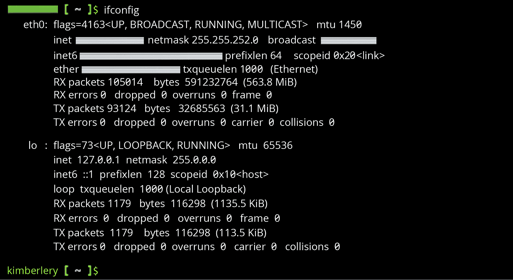
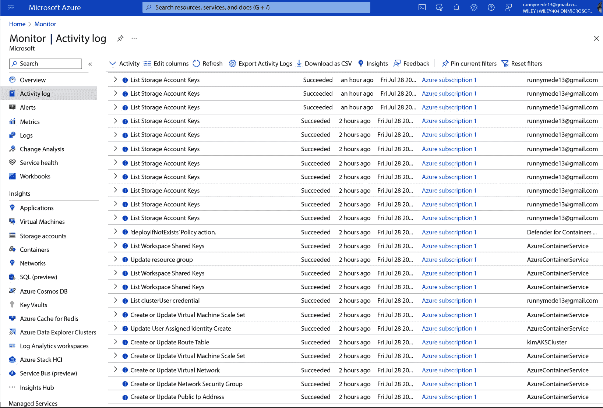

# 第九章：在 Azure 中对容器化应用进行渗透测试

在上一章，我们介绍了如何设置一个 Microsoft Azure 环境，以便我们在其中练习渗透测试和漏洞扫描。接着我们部署了一个**虚拟机**（**VM**），学习了一些 PowerShell 命令，并使用 Bash 在 Azure Cloud Shell CLI 中进行了一些应用扫描。

有时，组织会仅仅在普通的 Windows 和 Linux 虚拟机中运行它们的应用程序。然而，很多时候，组织需要一个高度可扩展的云配置，应用程序组件可以快速、灵活地启动和关闭。这在 DevOps 应用中尤其重要，这正是*容器化*派上用场的地方。

由于许多公司在其 Azure 网络中使用容器化，因此你学习如何进行渗透测试变得尤为重要。这正是本章的内容。

在本章中，我将解释什么是容器化，为什么使用容器化，以及容器化的基本工作原理。我们还将讨论 Docker 和 Kubernetes 在 Azure 中的工作方式，并介绍测试它们的渗透测试技术。

本章将涵盖以下主题：

+   容器化的工作原理

+   在 Azure 中的 Docker 和 Kubernetes 渗透测试技术

那么，让我们开始吧！

# 技术要求

我们将使用微软的基础设施。大量的 Azure 数据中心将负责本章练习的主要计算处理工作。所以，幸运的是，你不需要一台顶级的工作站。你将需要以下设备：

+   一个网页浏览器

+   一台台式机或笔记本电脑

+   一台安卓手机或 iPhone 手机

+   一个良好的、可靠的互联网连接

查看以下视频，查看代码实际操作：[`bit.ly/3QmGlKX`](https://bit.ly/3QmGlKX)

# 容器化的工作原理

**虚拟机**是模拟计算机。它不是直接运行在 PC 或服务器的硬件上，而是模拟操作系统运行所需的所有硬件组件。因此，一台物理计算机可以运行多个模拟计算机，每个模拟计算机就像在宿主操作系统的虚拟化程序（hypervisor）中运行的一个应用程序，或者在直接运行在硬件上的虚拟化程序中运行。

你可以使用自己的 PC 上的应用程序，如 Oracle VirtualBox 或 VMware Workstation Player，作为虚拟机的虚拟化程序。你只需要一个你想在虚拟机中运行的操作系统的磁盘映像文件，并将其配置在虚拟化程序中即可。操作系统不需要与宿主操作系统匹配，实际上，通常并不匹配。我可以在我的 Windows 11 PC 上运行一个 Kali Linux 虚拟机。你可以在你的 MacBook 上运行一个 Windows 11 虚拟机。而我可以在我的 Ubuntu Linux 桌面上运行一个 macOS 虚拟机。

然而，设置虚拟机确实需要一些时间，就像我们在*第八章*中所做的那样，当你设置虚拟机时，需要使用整个操作系统的磁盘映像。

也可以在云平台上运行虚拟机，正如我们在前一章中所做的那样。即使我使用的是微软的计算机，而不是自己的计算机来运行虚拟机，在 Azure 上设置一个虚拟机仍然需要几分钟的时间。此外，云平台上的传统虚拟机在功能上与自己计算机上的虚拟机类似；它使用整个操作系统。

在云平台上运行这样的虚拟机非常适合当公司希望让同一虚拟机运行几个月或更长时间时使用。在云平台上运行简单的 web 服务器是一个很好的使用案例。

然而，如今，DevOps 和 CI/CD 应用开发方法论使得公司能够部署需要快速扩展的动态应用程序。这些应用程序的后台可能会发生剧烈变化，每天甚至每时每刻都可能响应当前生产网络的需求。

*容器* 是部署虚拟化的一种非常精确的方式。一个 **容器** 只包含运行更大应用程序小部分所需的操作系统组件。单个容器的生命周期可能只有几天，甚至只有几个小时。

*Docker* 和 *Kubernetes* 是公司今天常用的两种容器化编排平台。容器化编排平台会自动启动和停止容器，而无需直接的人类干预。这些平台管理容器的部署，并处理虚拟化硬件中的负载均衡，只在需要时分配硬件资源，如 CPU 和内存。

云平台使得公司和其他类型的企业能够实现容器化应用。微软在其全球各地的 Azure 数据中心拥有巨大的硬件和网络能力。因此，如果容器化应用某天需要 1,000 台机器，第二天需要 200 台，第三天需要 2,000 台，Azure 可以提供这样的支持，这样公司就不需要在自己的场地上部署和停用这些机器。

你很可能会被要求在 Azure 中对基于 Docker 和 Kubernetes 的应用程序进行渗透测试。

正如 AWS 有自己管理 Docker 和 Kubernetes 的方式，Azure 也有自己的方式。因此，让我们来了解一下这些内容。

## 如何在 Azure 中使用 Docker

你可以通过 Docker Desktop 从本地计算机启动 Azure 中的 Docker 实例，或者直接通过 Azure CLI 启动。Docker Desktop 要求你在计算机上安装 Docker Desktop 应用程序（[`docs.docker.com/cloud/aci-integration/`](https://docs.docker.com/cloud/aci-integration/)），但也可以直接通过 Azure Cloud Shell（这是一种在网页浏览器中访问 Azure CLI 的方式）启动 Docker 实例。我个人更倾向于后者。如果你只是为了测试目的以最简单的方式启动 Docker，这可能是最方便的方式。如果你要为特定的业务用途启动 Docker，并对其进行更多控制，Docker Desktop 可能是更好的选择。

让我们从 Azure Cloud Shell 开始工作，使用 Azure 默认提供的 Docker 镜像（当然也可以获取或创建你自己的 Docker 镜像，但对于本书中的练习，这不是必要的；Docker 镜像类似于传统虚拟机中使用的磁盘镜像，但它是为容器优化的）：

1.  通过你的网页浏览器登录到我们在上一章中设置的 Azure 帐户。

    在 Azure 中部署 Docker 的原生方式是使用 Azure 容器实例，这是一个无服务器服务。严格来说，背后是有服务器的，但由 Azure 管理，而不是你！在你按照这些指令操作时，这就是后台运行的服务。

1.  在网页顶部的蓝色菜单栏中，点击搜索栏右侧的第一个图标。它应该看起来像**>_**。

1.  点击它以启动 Azure Cloud Shell。接下来，我们将使用 Bash 而不是 PowerShell，因为本章中的渗透测试工具使用的是 Bash。在 Azure Cloud Shell 屏幕的顶部栏选择**Bash**。

1.  然后，确保你拥有所需版本的 Azure CLI。输入以下命令：

    ```
    az version
    ```

    只要你有 2.0.55 版本或更高版本，就可以正常使用。我现在使用的是 2.50.0 版本，所以不需要升级。如果你需要升级，请输入以下命令：

    ```
    az upgrade
    ```

1.  Azure 中的容器使用资源组来管理 Azure 的资源以满足你的需求。让我们设置一个资源组。输入以下命令：

    ```
    az group create --name <resourceGroupNameOfYourChoiceHere> --location eastus
    ```

    **eastus** 可以替换为你选择的任何 Azure 数据中心区域名称。例如，如果你愿意，可以选择 **canadacentral**、**brazilsouth** 或 **westus** 等。

1.  接下来，我们需要创建一个容器！为了本章练习的目的，使用 Microsoft 默认的 Docker 容器镜像即可。使用以下命令操作：

    ```
    az container create --resource-group <resourceGroupNameOfYourChoiceHere> --name mycontainer --image mcr.microsoft.com/azuredocs/aci-helloworld --dns-name-label <dns-name-label-of-your-choice-here> --ports 80
    ```

    确保你的资源组名称与前一个命令中创建的名称相同。

1.  现在，你可以验证容器的状态，查看一切是否正常！输入以下命令：

    ```
    az container show --resource-group <resourceGroupNameOfYourChoiceHere> --name mycontainer --query "{FQDN:ipAddress.fqdn,ProvisioningState:provisioningState}" --out table
    ```

    如果一切顺利，命令行上会打印出类似的内容：

    ```
    FQDN                                         ProvisioningState
    ---------------------------------            -------------------
    aci-demo.eastus.azurecontainer.io            Succeeded
    ```

    如果没有成功，请从**创建资源组**命令重新开始。现在，我们已经启动了一个 Docker 实例，可以在其中测试我们的渗透测试技能！恭喜！

还有一个非常有用的命令，可以用来对你的新 Docker 实例进行渗透测试。我们在渗透测试报告中提到的许多漏洞数据都来源于日志记录。你可以使用以下命令来拉取容器实例日志：

```
az container logs --resource-group <resourceGroupNameOfYourChoiceHere> --name mycontainer
```

在命令行中，你会看到一条消息，显示**监听端口 80**（HTTP 的 TCP/IP 端口），最终，你将看到 HTTP **GET** 请求在命令行中显示出来，这些请求来自你的计算机或互联网上的其他计算机，针对你的 Docker 实例。

你可以使用这个命令删除你的 Docker 容器：

```
docker rm <name of folder with container here>
```

现在，让我们继续讲解 Kubernetes。

## Kubernetes 在 Azure 中的工作方式

Azure 提供了专门用于部署 Kubernetes 的服务！Azure Kubernetes 服务（[`learn.microsoft.com/en-us/azure/aks/intro-kubernetes`](https://learn.microsoft.com/en-us/azure/aks/intro-kubernetes)）使得在 Azure 平台上部署 Kubernetes 容器化变得非常简单。

Kubernetes 是目前最流行的容器编排平台。然而，有一个事实可能会让一些新手感到困惑——Kubernetes 扩展了 Docker 开创的一些技术。实际上，Kubernetes 中也可以运行 Docker 容器！因此，Docker 和 Kubernetes 在企业 DevOps 和 CI/CD 应用中经常相互交织，尤其是那些运行在云中的应用。

在前一部分中，我们部署了一个完全基于 Docker 的容器化系统，Azure 的无服务器 Azure 容器实例服务在后台支持这一切。现在，我们将把容器化部署到 Azure Kubernetes 服务中。

Kubernetes 具有非常特殊的架构（如 *第六章* 中所讨论的）。

注意

Kubernetes 的架构在不同的云平台中是相同的。

Kubernetes 部署的基础是控制平面。它是其他所有组件的父级，位于其上方。控制平面包含一个 API 服务器，用于管理与外部应用的连接，以及一个控制器管理器。我们将通过 *kubectl*（Kubernetes 的命令行工具）向其发送命令。

控制平面的子组件是*节点*。它们共享计算、网络和存储资源。节点的子组件是*Pod*，而 Pod 的子组件是*单个容器*。因此，可以这样理解——容器是容器的曾祖父母。

容器是最具动态性的组件；它们是变化最频繁的。它们根据应用的需求响应性地从容器镜像中生成。容器中仅包含执行代码所需的配置文件、库和依赖项。这是因为节点处理硬件资源的负载均衡，而控制平面对所有内容具有最终控制权，并且也是 Kubernetes 容器化系统外部系统的网关。

如果你想听起来像个真正的 Kubernetes 专家，可以称其为 *K8s*。这是 Kubernetes 开发者和管理员给它起的昵称。不过，我更喜欢用它的正式名称。

好的，让我们在 Azure 网络中部署 Kubernetes！我们可以在本章后面用它进行渗透测试：

1.  首先，我们需要再次启动 Azure Cloud Shell。从网页顶部的蓝色菜单栏中，点击搜索栏右侧的第一个图标，它应该像 **>_** 这样。

1.  点击它以启动 Azure Cloud Shell。从这里，我们将使用 Bash 而不是 PowerShell。在 Azure Cloud Shell 屏幕的顶部栏中选择**Bash**。

1.  然后，确保你有正确版本的 Azure CLI。使用此命令：

    ```
    az –version
    ```

    只要你有版本 2.0.55 或更高版本，就可以继续使用了。否则，输入此命令：

    ```
    az upgrade
    ```

    在 Azure CLI 中操作 Kubernetes 时，我了解到首先需要创建一个具有访问我的容器注册表权限的服务主体，这样其他操作才能正常进行。

1.  复制这段脚本并粘贴到文本编辑器中，如记事本。将 **$containerRegistry** 替换为你选择的名称（例如 **acrKim**）。将 **$servicePrincipal** 替换为你选择的名称（例如 **KIM_KUBERNETES**）：

    ```
     #!/bin/bash
     # This script requires Azure CLI version 2.25.0 or later. Check version with `az --version`.
     # Modify for your environment.
     # ACR_NAME: The name of your Azure Container Registry
     ACR_NAME=$containerRegistry
     # SERVICE_PRINCIPAL_NAME: Must be unique within your AD tenant
     SERVICE_PRINCIPAL_NAME=$servicePrincipal
     # Obtain the full registry ID
     ACR_REGISTRY_ID=$(az acr show --name $ACR_NAME --query "id" --output tsv)
     # echo $registryId
     # Create the service principal with rights scoped to the registry.
     # Default permissions are for docker pull access. Modify the '--role'
     # argument value as desired:
     # acrpull:   pull only
     # acrpush:   push and pull
     # owner:    push, pull, and assign roles
     PASSWORD=$(az ad sp create-for-rbac --name $SERVICE_PRINCIPAL_NAME --scopes $ACR_REGISTRY_ID --role acrpull --query "password" --output tsv)
     USER_NAME=$(az ad sp list --display-name $SERVICE_PRINCIPAL_NAME --query "[].appId" --output tsv)
     # Output the service principal's credentials; use these in your services and
     # applications to authenticate to the container registry.
     echo "Service principal ID: $USER_NAME"
     echo "Service principal password: $PASSWORD"
    ```

1.  如果你的密码不会很快被丢弃，最好将密码更改为一个复杂的、包含大量随机字符的密码。

    现在，我们终于可以部署我们的 Kubernetes 集群了！将 **kimAKSCluster** 替换为你选择的集群名称。将 **acrKim** 替换为你在前一个脚本的 **ACR_REGISTRY_ID=$(az acr show --name $acrKim --query "id" --output tsv)** 行中使用的 ACR 名称：

    ```
    az aks create \
        --resource-group myResourceGroup \
        --name kimAKSCluster \
        --node-count 2 \
        --generate-ssh-keys \
        --attach-acr acrKim
    ```

1.  几分钟后，JSON 输出将显示确认 Azure Kubernetes Service 部署的度量信息。

    Kubernetes CLI，也就是 *kubectl*，已经安装在 Azure Cloud Shell 中。

1.  然后，我们需要使用 kubectl 连接到我们的 Kubernetes 集群。输入以下命令，但将 **myResourceGroup** 替换为你之前使用的资源组名称，将 **kimAKSCluster** 替换为你之前使用的集群名称：

    ```
    az aks get-credentials --resource-group myResourceGroup --name kimAKSCluster
    ```

1.  现在，我们可以验证一切是否正常，并确保我们的节点在运行。输入以下命令：

    ```
    kubectl get nodes
    ```

现在，我们在 Azure 中使用 Azure 容器实例有了一个基础的 Docker 实例，并且使用 Azure Kubernetes Service 配置了一个基本的 Kubernetes 实例。

在接下来的部分，我们将在这些实例中运行一些漏洞扫描和渗透测试脚本。这才是有趣的部分！

# Azure 中的 Docker 和 Kubernetes 渗透测试技术

让我们探索一些在 Azure 中进行容器渗透测试的工具。

## kube-hunter

我们将尝试的第一个渗透测试应用程序是 GitHub 上 Aqua Security 提供的 **kube-hunter**。kube-hunter **README** 文件中的介绍在 [`github.com/aquasecurity/kube-hunter/blob/main/README.md`](https://github.com/aquasecurity/kube-hunter/blob/main/README.md) 中提到如下内容：

*“kube-hunter 会搜索 Kubernetes 集群中的安全漏洞。该工具的开发目的是提高 Kubernetes 环境中安全问题的意识和可见性。你不应该在你* *不拥有的 Kubernetes 集群上运行 kube-hunter！”*

绝对可以！这就是为什么我们在本章中在我们自己的 Azure 服务中设置了自己的 Kubernetes 集群。当你实际做渗透测试工作时，你将需要得到拥有 Azure 网络和 Kubernetes 实例的公司签署的法律许可。

使用 kube-hunter，你可以进行许多不同类型的扫描。首先，让我们安装它。然后，我们将进行一次快速扫描。

在 Azure Cloud Shell 中的 Bash 中，让我们使用此命令克隆 kube-hunter 的**git**仓库：

```
git clone https://github.com/aquasecurity/kube-hunter.git
```

现在，我们将安装它的依赖项：

```
cd ./kube-hunter
pip install -r requirements.txt
```

kube-hunter 是一个 Python 应用程序，所以我们可以使用以下命令启动它：

```
python3 kube_hunter
```

还有另一种安装方法我喜欢使用，它利用**pip**仓库。试试这个：

```
pip install kube-hunter
```

如果你是通过这种方式安装了 kube-hunter，你可以使用这个命令启动它：

```
kube-hunter
```

你也可以在指定特定日志级别的情况下运行 kube-hunter。试试这个命令：

```
kube-hunter --active --log WARNING
```

这样会输出**WARNING**级别的日志。这些事件你应该特别关注，它们在渗透测试报告中非常有用。或者，你可以使用这个命令输出**DEBUG**日志：

```
kube-hunter --active --log DEBUG
```

启动 kube-hunter 时，默认会记录**INFO**级别的事件。如果你更改了日志记录为**WARNING**或**DEBUG**，并且希望切换回**INFO**，可以使用以下命令：

```
kube-hunter --active --log INFO
```

由于我们在自己的 Kubernetes 实例中进行教育用途的操作，可以随意尝试不同的日志记录选项。

当你使用**kube-hunter**命令进行快速扫描时，命令行将输出以下内容：


图 9.1 – 在 Azure 中运行 kube-hunter

接下来，你输入**1**、**2**或**3**，选择你想执行的扫描类型。如果选择**1**或**3**，你需要在以下提示中输入 IP 地址。

我常常忘记在玩弄 Azure 实例时所使用的 IP 地址。我们在 Bash 中，因此检查 Azure 中 IP 地址的最简单方法是使用以下命令：

```
ifconfig
```

命令行应该会输出类似这样的内容：



图 9.2 – Azure 中的 ifconfig 命令

是的，我知道字符**X**在 IPv4 或 IPv6 IP 地址中并未使用。我替换了我的 IP 地址中的某些字符，目的是出于操作安全考虑。你永远也不能太小心！

你还可以在 Docker 容器内安装并运行 kube-hunter！通过以下命令在 Docker 中安装 kube-hunter：

```
docker run -it --rm --network host aquasec/kube-hunter
```

默认情况下，kube-hunter 通过一个名为**stdout**的实体输出所有扫描日志。因此，你可以通过 Azure Monitor 界面找到你的日志：

1.  返回到您的 Azure 账户界面，[portal.azure.com](https://portal.azure.com)。

1.  在顶部的蓝色菜单栏中，在搜索栏中输入 **监控**。

1.  在左侧，有一个 **监控** 下的部分列表，例如 **概述** 和 **活动日志**。点击 **活动日志**。

    以下屏幕将以这种方式显示您的日志：



图 9.3 – Azure 中的活动日志

您在 kube-hunter 中的操作将被记录在那里。我的操作产生了很多名为 **列出存储帐户密钥** 的条目。这就是 kube-hunter 要寻找的敏感信息！

探索 kube-hunter 文档（[`aquasecurity.github.io/kube-hunter/`](https://aquasecurity.github.io/kube-hunter/)）以了解您可以执行的其他操作。

现在，让我们尝试 *kdigger*。

## kdigger

**kdigger** 是一个多用途的 Kubernetes 渗透测试工具。它能够在您的 Kubernetes 实例中进行*挖掘*，查看它能找到哪些实体。当然，能够指纹识别和列举容器化部署对于网络威胁行为者来说是一项非常危险的能力，因为他们将知道如何继续进行攻击。

使用 kdigger 获得的数据也可以用于在 Kubernetes 中进行更有根据的渗透测试。

kdigger 还可以用于模糊测试。这意味着将无效、意外或随机的数据输入到应用程序中，以查看它是否会崩溃。如果应用程序设计用于验证输入并处理代码中的异常，它就不会容易受到模糊测试攻击。要了解如何使用 kdigger 进行模糊测试和其他功能，请查看它们的文档：[`github.com/quarkslab/kdigger`](https://github.com/quarkslab/kdigger)。

让我们安装 kdigger 并进行一些挖掘。

根据您的配置，您可能会发现以下两种安装方法中的一种效果最佳：

+   第一个方法是默认的 Git 源技术：

    ```
    git clone https://github.com/quarkslab/kdigger
    cd kdigger
    ```

    然后，您需要将二进制文件移到您的路径中的工作目录：

    ```
    sudo install kdigger </usr/local/bin or enter your path name here>
    ```

    该方法将要求您记住您的 **sudo** 密码。

+   这个更简单的安装方法使用 **go**：

    ```
    go install github.com/quarkslab/kdigger@main
    ```

现在，让我们试试 kdigger！

导航到您的 Pods 所在的目录以及 kdigger 安装的目录。当我在 Bash 中迷失方向时，我输入这个命令来列出当前目录的内容：

```
ls
```

然后，我输入这个命令来切换到我正在寻找的目录：

```
cd go/bin
```

当您进入 kdigger 安装目录时，您可以通过一个非常简单的命令进行一般扫描：

```
 ./kdigger dig all
```

对我来说，这就是命令行输出的内容。我出于操作安全的原因，将 DNS 名称和 IP 地址中的一些字符替换为 **X**：

```
; <<>> DiG 9.16.33 <<>>
;; global options: +cmd
;; Got answer:
;; ->>HEADER<<- opcode: QUERY, status: NOERROR, id: 33463
;; flags: qr rd ra; QUERY: 1, ANSWER: 13, AUTHORITY: 0, ADDITIONAL: 27
;; OPT PSEUDOSECTION:
; EDNS: version: 0, flags:; udp: 1224
;; QUESTION SECTION:
;.                              IN      NS
;; ANSWER SECTION:
.                       7048    IN      NS      XXX.net.
.                       7048    IN      NS      XXX.net.
.                       7048    IN      NS      XXX.net.
.                       7048    IN      NS      XXX.net.
.                       7048    IN      NS      XXX.net.
.                       7048    IN      NS      XXX.net.
.                       7048    IN      NS      XXX.net.
.                       7048    IN      NS      XXX.net.
.                       7048    IN      NS      XXX.net.
.                       7048    IN      NS      XXX.net.
.                       7048    IN      NS      XXX.net.
.                       7048    IN      NS      XXX.net.
.                       7048    IN      NS      XXX.net.
;; ADDITIONAL SECTION:
XXX.net.     1461    IN      A       198.XX.X.X
XXX.net.     1461    IN      AAAA    2001:503:XXXXX
XXX.net.     1461    IN      A       192.58.XX.XX
XXX.net.     1461    IN      AAAA    2001:503:XXXXX
XXX.net.     1461    IN      A       192.XXX.XX.XX
XXX.net.     1461    IN      AAAA    2001:XXXXX
XXX.net.     1461    IN      A       199.X.XX.XX
XXX.net.     1461    IN      AAAA    2001:XXX
;; Query time: 0 msec
;; SERVER: 168.63.129.16#53(168.XX.XXX.XX)
;; WHEN: Fri Jul 28 21:56:48 UTC 2023
;; MSG SIZE  rcvd: 824
```

如果您想扫描所有的桶，试试这个：

```
dig all
```

您可以在渗透测试报告中提到 kdigger 找到的任何暴露的 Kubernetes 实体。

# 总结

组织通常在他们的云平台上部署容器化，因为这是一种非常响应迅速且动态的方式，利用虚拟化实施快速可扩展且不断发展的应用程序，使用 DevOps 或 CI/CD 方法。

容器只包含执行其处理的代码所需的操作系统部分。负载均衡和硬件资源管理由容器化平台内容器的父容器、祖父容器或曾祖父容器完成。

现在，我们知道如何在 Azure 中部署 Docker 和 Kubernetes 容器化实例，并测试其安全漏洞。Docker 和 Kubernetes 是最常用的容器化平台。Kubernetes 基本上是对 Docker 功能的进一步扩展，甚至可以与 Docker 镜像和容器一起使用。

在接下来的章节中，我将介绍 Google Cloud Platform 及其各种服务。

# 延伸阅读

要了解更多关于本章所涉及的主题，您可以访问以下链接：

+   *使用 Azure* *CLI 部署容器实例*: [`learn.microsoft.com/en-us/azure/container-instances/container-instances-quickstart`](https://learn.microsoft.com/en-us/azure/container-instances/container-instances-quickstart)

)

+   *什么是 Azure Kubernetes* *服务？*: [`learn.microsoft.com/en-us/azure/aks/intro-kubernetes`](https://learn.microsoft.com/en-us/azure/aks/intro-kubernetes)

)

+   *kube-hunter* *文档*: [`aquasecurity.github.io/kube-hunter/`](https://aquasecurity.github.io/kube-hunter/)

)

+   *kdigger* *文档*: [`github.com/quarkslab/kdigger`](https://github.com/quarkslab/kdigger)

# 第四部分：渗透测试 GCP

**GCP**是**谷歌的云平台**！不过，业内人士通常使用这个缩写。在这一部分，我们将了解 GCP 的各种软件即服务、平台即服务和基础设施即服务应用。我们将部署自己的 GCP 实例，在其中测试我们的渗透测试技能。我们将使用 Security Command Center 检查 GCP 部署的安全状态。我们还将逐步尝试一些在 GCP 中的渗透测试工具。然后，我们将部署 Docker 和 Kubernetes 容器，并对其进行测试。

本节包含以下章节：

+   *第十章*，*GCP 中的安全特性*

+   *第十一章*，*通过无服务器应用和工具进行 GCP 特性渗透测试*

+   *第十二章*，*在 GCP 中进行容器化应用的渗透测试*
