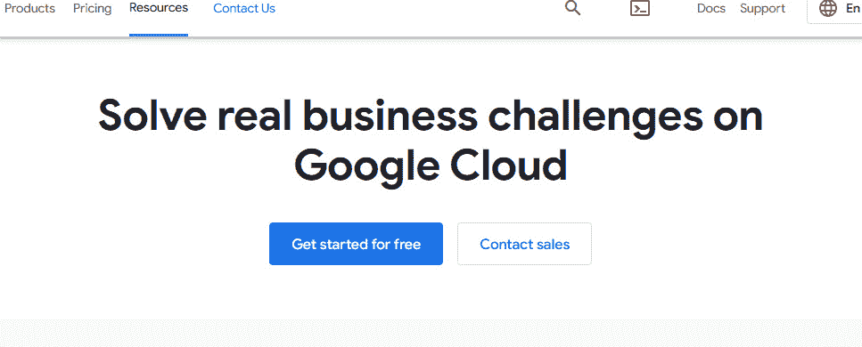
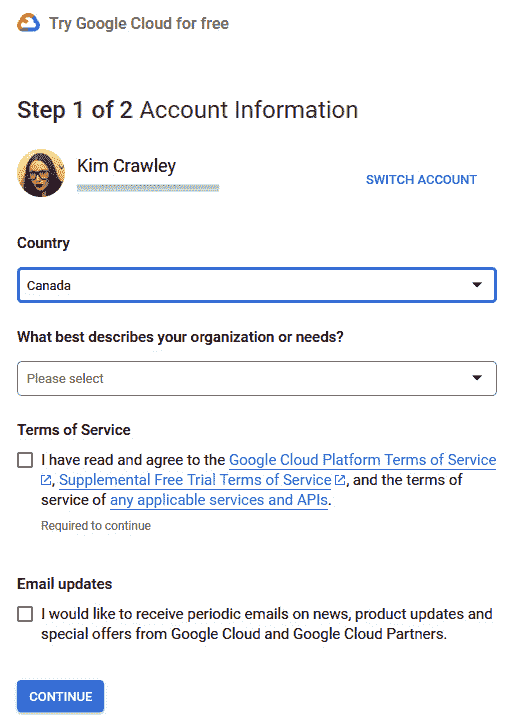
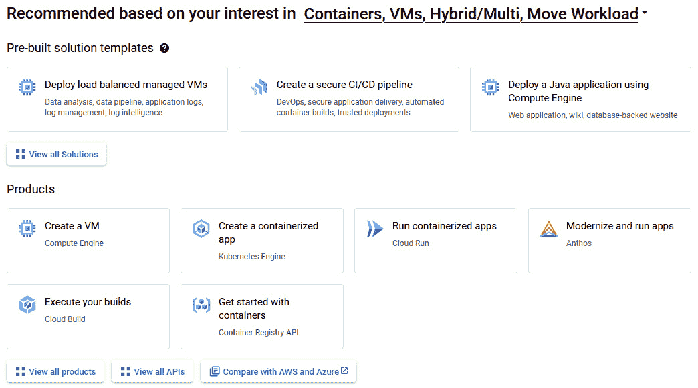
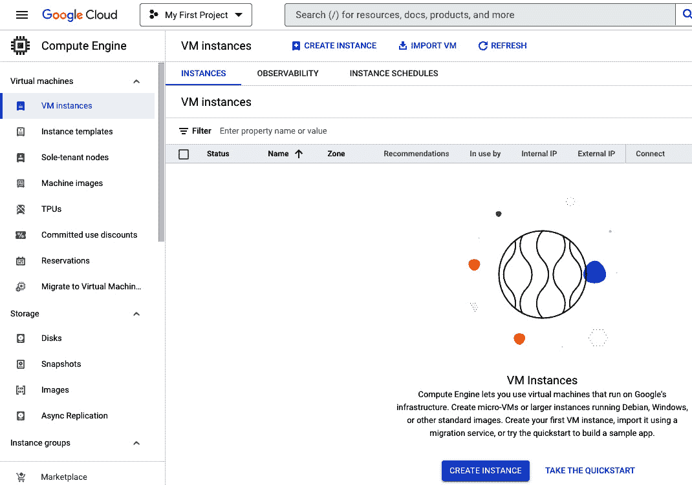
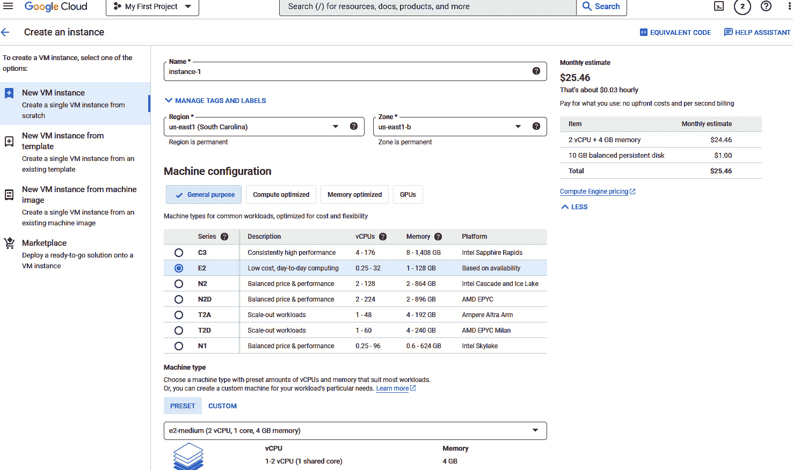
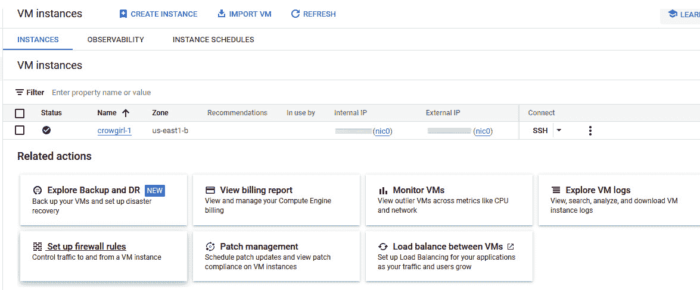
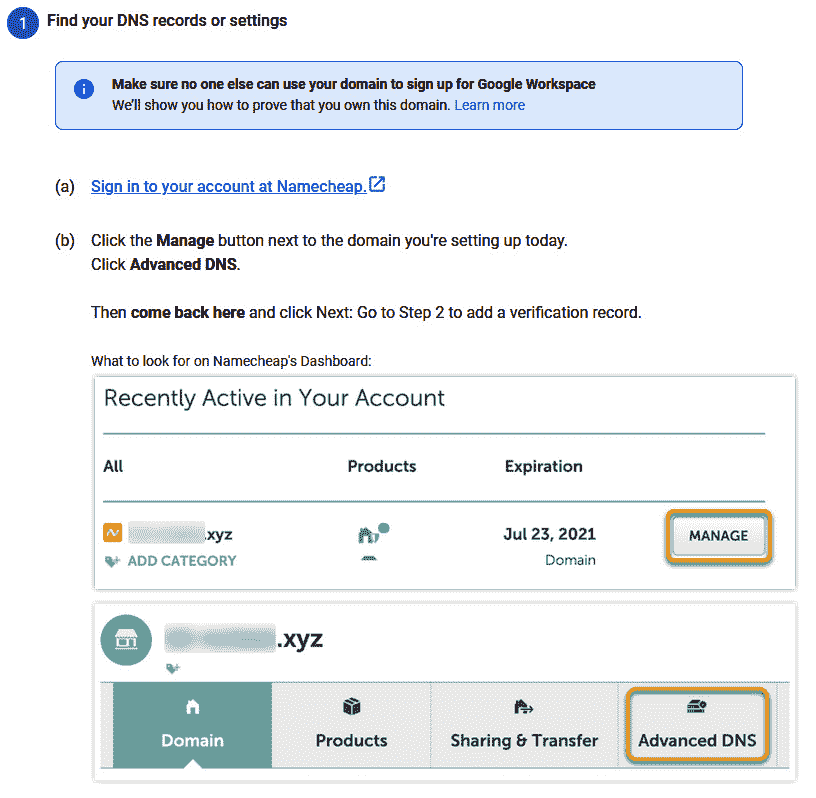
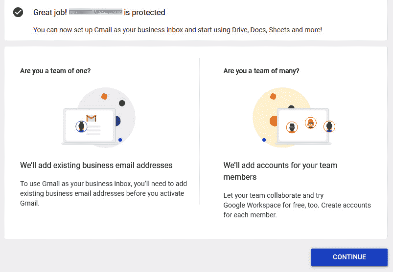
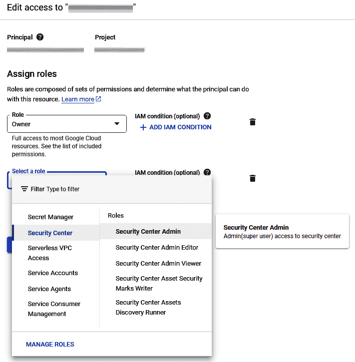

# 第十一章：通过无服务器应用程序和工具渗透测试 GCP 特性

现在我们已经了解了 **Google Cloud Platform**（**GCP**）所提供的各种服务，是时候开始我们的 GCP 部署，并通过动手实践学习一些 GCP 渗透测试工具了。

我们将在我们在*第十章*中设置的 GCP 虚拟机上安装并执行一些渗透测试工具。这些工具包括 Prowler、GCPBucketBrute 和 GCP Scanner。我们还将查看 Google 在安全指挥中心为我们提供的安全工具。

本章将涵盖以下主题：

+   GCP 免费层

+   启动一个 GCP 网络

+   使用 GCP Cloud Shell

+   GCP 原生安全工具

+   GCP 渗透测试工具

+   利用 GCP 应用程序

让我们开始吧！

# 技术要求

我们将使用 Google 的基础设施。巨大的 GCP 数据中心将负责本章练习的大部分计算工作。所以幸运的是，你不需要一台顶级工作站。你将需要以下设备：

+   一个网页浏览器

+   一台台式电脑或笔记本电脑

+   一部安卓手机或 iPhone

+   一条可靠的互联网连接

查看以下视频，观看代码演示：[`bit.ly/4093wMk`](https://bit.ly/4093wMk)

# GCP 免费层

我强烈建议你设置自己的 GCP 网络，以便测试本章和*第十二章*中的练习。

有几个 GCP 产品和服务，你可以在免费层中享受而不产生费用。然而，请记住，在注册时，你需要提供 GCP 的信用卡号码。如果你超出了免费层的限制，你的信用卡将被收费，因此你必须非常小心地检查你的使用情况和账单。当我注册时，我获得了 300 美元的免费服务费用信用额度，有效期为我订阅的前 90 天。根据你注册的时间、地点以及具体情况，你可能会或不会获得类似的信用额度。本章稍后我会展示如何检查你的账单状态，以确保你不会产生无法负担或不想支付的服务费用。

截至 2023 年撰写本文时，以下是 GCP 免费层中提供的服务以及它们的限制 ([`cloud.google.com/free/docs/free-cloud-features`](https://cloud.google.com/free/docs/free-cloud-features)):

+   **Compute Engine**是为 GCP 上的虚拟机提供支持的服务。免费额度包括每月一个 e2-micro 实例。这意味着“*每月在以下美国区域之一获得 1 个非抢占性 e2-micro VM 实例：us-west1、us-central1、us-east1。30 GB-月的标准持久磁盘。每月从北美到所有区域目的地（不包括中国和澳大利亚）的 1 GB 网络出口流量*”([`cloud.google.com/free/docs/free-cloud-features?hl=en#compute`](https://cloud.google.com/free/docs/free-cloud-features?hl=en#compute))。请记住，区域是 GCP 数据中心的位置。*你*不必物理上位于美国。你和你的笔记本电脑可以在巴西、印度、埃塞俄比亚或任何能够连接到 GCP 服务的国家。只要你使用的 GCP 数据中心位于**us-west1**、**us-central1**或**us-east1**，你就可以使用这些服务。

+   **Cloud Storage**是存储数据的主要服务。每月包含 5 GB 的免费额度。那么每月 5 GB 意味着什么呢？“*每月 5,000 次 A 类操作，50,000 次 B 类操作，来自北美的 100 GB 网络出口流量，覆盖所有地区目的地（不包括中国和澳大利亚）每月*。”([`cloud.google.com/free/docs/free-cloud-features#storage`](https://cloud.google.com/free/docs/free-cloud-features#storage))。如果你按照本书中我展示的方式使用 GCP 网络，应该没问题。

+   **BigQuery**是一个无服务器的数据分析平台。我们在本书中不会使用它，但在免费额度中，你每月可以获得 1 TB 的 BigQuery 查询。

+   **App Engine**是一个用于部署 Web 应用程序和移动应用的平台。免费额度为每天 28 小时实例。我们在本书中不会使用 App Engine，但如果你部署一个有大量用户的 App Engine 应用，你肯定会因此产生费用。

+   **Cloud Run**是一个用于部署无状态容器的服务。免费额度为每月 200 万次请求，因此你应该没问题。

+   **Cloud Build**可以从 Cloud Storage、Cloud Source Repositories、GitHub 或 Bitbucket 导入源代码构建，创建 Docker 容器或其他类型的软件工件。你每天可以获得 120 分钟的构建时间，免费额度内有此服务。本书中我们不会使用此服务，而是将使用标准的默认 Docker 和 Kubernetes 容器镜像。你应该没问题。

+   使用**Google Kubernetes Engine**，每月可以获得一个自动驾驶或区域集群。我们将在*第十二章*中部署一个集群。

    在免费套餐中，你可以获得一些 Cloud Logging、Cloud Monitoring 和 Cloud Trace 的配额，这些都属于运营套件（以前称为 Stackdriver）。这些功能可以帮助你分析 GCP 中的云活动。免费配额有点复杂，但按照本书中的说明操作，超出配额的可能性很小。为了安全起见，你可以阅读更多关于免费配额的内容 ([`cloud.google.com/stackdriver/pricing`](https://cloud.google.com/stackdriver/pricing))。

+   **Firestore** 是一个 NoSQL 文档数据库服务。在免费套餐中，你可以获得 1 GB 的存储空间，但我在这里不会使用它。它主要用于应用开发。

+   在免费套餐中，**Cloud Functions** 每月提供 200 万次调用。这是一个无服务器环境，用于构建和连接云服务。我们可能不会用到它。

+   **Workflows** 便于在 GCP 与外部 HTTP API 之间进行服务调用。每月提供 5,000 个免费的内部步骤，这应该足够了。

+   免费套餐包括 **Cloud Source Repositories** 的五个用户的免费访问权限，这是一个用于托管私有 Git 仓库的服务，适用于应用开发。我们也不会使用这个服务。

+   我们将使用 **Secret Manager**，它用于存储密码、证书、API 密钥等。每月在免费套餐中我们可以获得六个秘密版本，这已经足够了。

好的！现在我们知道了我们要做什么，让我们一起部署一个 GCP 网络。在本书中，我们将需要自己的 GCP 部署来测试我们的渗透测试技能。就像我们在 AWS 和 Azure 上部署实例一样，我会一步一步地引导你完成整个过程。

# 启动 GCP 网络

和 AWS、Azure 一样，你只需要一台运行 Windows、macOS 或 Linux 发行版的现代笔记本或台式电脑，就可以启动和管理 GCP 网络。谷歌的计算机和基础设施负责处理所有计算资源方面的工作。

我还建议你在 Android 手机上使用 Google Authenticator ([`play.google.com/store/apps/details?id=com.google.android.apps.authenticator2&pli=1`](https://play.google.com/store/apps/details?id=com.google.android.apps.authenticator2&pli=1)) 或 iPhone 上使用 ([`apps.apple.com/us/app/google-authenticator/id388497605`](https://apps.apple.com/us/app/google-authenticator/id388497605))，这样你就可以在 GCP 服务中启用 **多因素认证**（**MFA**）。我不建议你用手机做大部分的 GCP 工作，因为 PC 屏幕和物理键盘更适合这类操作。但如果你想查看 GCP 服务的状态，可以在手机上安装 Google Cloud 应用 ([`cloud.google.com/app`](https://cloud.google.com/app))。它特别适合在路上检查你的账单，确保你没有做出任何昂贵的操作！

过去十年内制造的 PC 或 MacBook 和一个可靠的互联网连接，足以让你在全球任何地方部署 GCP 并进行 GCP 上的渗透测试。

所有开始自己的 GCP 部署的工作都可以在你的网页浏览器中完成。让我们开始吧：

1.  设置自己的 GCP 网络的第一步是访问 Google Cloud 免费层页面（[`cloud.google.com/free`](https://cloud.google.com/free)），并点击屏幕中央的蓝色**免费开始**按钮：



图 11.1 – Google Cloud 注册页面

1.  在下一个屏幕中，确保你的 Gmail 或 Google 账户已登录。如果你还没有账户，设置一个，或者登录你已经有的账户。在下拉框中选择你的国家，并回答**什么最能描述你的组织或需求？**的问题。我选择了**其他**。确保你选择了你已阅读**服务条款**，然后点击上面写着**继续**的蓝色按钮：



图 11.2 – Google Cloud 注册屏幕

1.  下一屏要求你选择你的**支付**配置文件。如果你在使用 GCP 服务时发生费用，Google 需要有一个方式向你收费，即使你能保持在免费层的限制内。我已经有了**支付**配置文件，因为我购买过 Google Play 应用和服务，是 YouTube Premium 订阅者，并且使用过 Google Pay。如果你没有**支付**配置文件，你可能需要输入信用卡号码或链接你的 Google Pay 账户（[`payments.google.com/`](https://payments.google.com/)）。

1.  在**账户类型**下，我选择了**个人**。除非你是代表企业或组织设置 GCP，否则我建议你选择**个人**。

1.  在**姓名和地址**下，确保你的姓名和街道地址与信用卡或 Google Pay 账户上的信息一致。

1.  在下面，点击蓝色的**开始我的免费试用**按钮。任何关于额外服务和信用的时间限制（例如我的 90 天$300 服务信用）现在开始！

    如果你往下滚动一点，你会看到启动 GCP 项目的按钮。首先，是一些预建的解决方案模板：

    +   **部署负载均衡的** **托管虚拟机**

    +   **创建一个安全的** **CI/CD 管道**

    +   **使用** **Compute Engine 部署 Java 应用**

    也有按钮可以在没有模板的情况下启动产品：

    +   **创建** **虚拟机**

    +   **创建一个** **容器化应用**

    +   **运行** **容器化应用**

    +   **现代化并** **运行应用**

    +   **执行** **构建**

    +   **开始使用** **容器**

    这是项目启动页面的样子：



图 11.3 – Google Cloud 项目启动页面

1.  现在，让我们点击**创建虚拟机**，在 GCP 上使用 Compute Engine 部署一个简单的虚拟机，用于本章中的渗透测试。

1.  下一屏显示**计算引擎 API**，概述中写着**在 Google Cloud Platform 上创建和运行虚拟机**。点击蓝色的**启用**按钮。

1.  你将被引导到虚拟机实例仪表板，界面如下所示。点击蓝色的**创建** **实例**按钮：



图 11.4 – GCP 计算引擎屏幕

1.  在下一屏中，我们可以为实例命名并选择其区域和可用区，以及其机器配置。我将向你展示一个最不可能产生服务费用的配置：



图 11.5 – 虚拟机实例的机器配置

+   在**名称**字段中，给你的实例取个名字。我给它取名为**crowgirl-1**。

+   在免费层中，我们使用 Compute Engine 的配额限制为“*每月在以下美国区域中的一个，最多创建 1 个不可抢占的 e2-micro 虚拟机实例：us-west1、us-central1、us-east1。*”因此，我选择了**us-east1**作为我的区域。无论你身处世界的哪个角落，你都可以选择**us-west1**、**us-central1**或**us-east1**。

+   在**机器配置**下，为了节省费用，我选择了**通用型**，**E2 系列**，**e2-micro** 机器类型（这是唯一一个在免费层中涵盖的机器类型），以及标准虚拟机配置模型。然后点击底部的蓝色**创建**按钮。

几秒钟到一分钟后，我们的基础虚拟机将在 Compute Engine 中准备好！你会看到类似这样的屏幕：



图 11.6 – 项目中的虚拟机实例列表

默认会安装 Debian Linux 镜像。我们现在有一台可以使用 Bash CLI 的 Linux 虚拟机！

我总是偏向使用云平台网页界面中内置的 CLI。因此，我们来启动 GCP Cloud Shell。

# 使用 GCP Cloud Shell

要启动 GCP Cloud Shell，请看顶部的菜单栏，点击位于搜索框右侧的**>_**图标。你是否注意到 GCP 的网页界面和 AWS、Azure 的网页界面非常相似？


图 11.7 – GCP 控制台中的顶部菜单栏

我们在*第五章*为 AWS 和*第八章*为 Azure 使用的所有 Bash 命令，在这里也能正常工作。我们在 GCP 中的 Linux 虚拟机本质上和任何其他基于 Linux 的计算机一样；Bash CLI 是标准配置。如果你愿意，可以回顾一下在*第五章*中提到的 Bash 命令。

Cloud Shell 屏幕长这样：


图 11.8 – Cloud Shell 屏幕

接下来，我们来看一下 Google 提供的一些工具，它们将在我们作为 GCP 渗透测试人员工作时发挥作用。

# GCP 原生安全工具

**Security Command Center** 是您访问 GCP 中所有安全工具的起点。它集成了我在*第十章*中提到的多种第一方 GCP 安全工具。这意味着您可以在**Security Command Center**（**SCC**）面板中查看来自这些应用和服务的数据：

+   **Identity and Access Management** ([`cloud.google.com/iam`](https://cloud.google.com/iam))，用于管理您 GCP 网络中所有用户身份和机器身份（例如，Web 服务器的 TLS 证书），并提供强大的日志记录功能，该功能已集成到 SCC 中，也可以集成到组织的第三方安全监控服务中。“*Identity and Access Management (IAM) 允许管理员授权谁可以对特定资源进行操作，赋予您对 Google Cloud 资源的完全控制和可视性，以集中管理这些资源。*”

+   **Cloud IDS** ([`cloud.google.com/intrusion-detection-system`](https://cloud.google.com/intrusion-detection-system))，其功能与大多数基于网络的入侵检测系统（IDS）相同。它实时读取您的网络日志，并在可能出现网络威胁迹象时通知安全管理员。它可以监控并生成针对入口流量（东西向，从一个内部服务器或应用到另一个）和出口流量（南北向，在您的云网络和公共互联网或其他外部网络之间）的警报。这是零信任网络安全的核心概念——恶意流量可能来自任何地方。内部网络和外部网络之间的安全边界已经不再是过去的常态。Cloud IDS 能够检测的潜在威胁包括恶意软件和由指挥控制中心驱动的攻击。

+   **Cloud Firewall** ([`cloud.google.com/firewall`](https://cloud.google.com/firewall))，其功能类似于大多数其他基于状态检测的网络防火墙。可以应用全局网络防火墙策略，以根据一般的 GCP 安全基线允许或禁止流量。可以使用 IAM 管理的标签来根据用户和机器身份账户的标签标记来允许或禁止流量。Google Cloud Threat Intelligence 列表也可以应用，以便当 Google 发现新的网络威胁时，您的防火墙会相应更新。当然，安全和网络管理员也可以手动阻止或允许特定的用户和机器。

+   **Cloud DLP** ([`cloud.google.com/dlp`](https://cloud.google.com/dlp))，一个用于**数据丢失防护**（**DLP**）的工具。它追踪数据在您的 GCP 网络中的流动以及如何离开您的 GCP 网络，以确保敏感数据不会被网络泄露。敏感数据可以被防止上传到外部目的地，或者根据情况进行令牌化或掩码处理（例如，将信用卡号写为*45xx-xxxx-xxxx-xxx*）。

在测试 SCC 时，我了解到必须设置 Cloud Identity 才能访问该应用程序。Cloud Identity Premium 是一项收费服务，提供额外功能。我选择了**Cloud Identity 免费版**，因为我们希望在进行 GCP 渗透测试时保持低成本：

1.  访问 [`workspace.google.com/gcpidentity/signup?sku=identitybasic`](https://workspace.google.com/gcpidentity/signup?sku=identitybasic)，一旦你创建了 GCP 账户，就可以设置 Cloud Identity 免费版。以下截图显示了设置**Cloud Identity 免费版**的第一步：


图 11.9 – 设置 Cloud Identity 账户

1.  在下一个界面，你需要输入你的名字、姓氏和联系邮箱地址。点击**下一步**。然后，你需要输入一个你有权限访问的域名（例如**packtpub.com**，但不能是**packtpub.com**，因为该域名属于本书的出版社）。幸运的是，我已经有一个用于其他项目的域名。如果你没有自己的域名并且具有管理权限，建议通过 [namecheap.com](http://namecheap.com) 获取一个。根据你选择的顶级域名（如 **.com**、**.net** 或 **.io**），每年可能只需 5.00 美元。

1.  一旦你为 Cloud Identity 免费版提供了一个*你拥有并且具有管理权限*的域名，最后一步是为你的新 Cloud Identity/Google Workspace 账户输入用户名和密码：


图 11.10 – Cloud Identity 凭证创建界面

1.  接下来，Cloud Identity 向导会引导你添加一个 DNS 验证记录到你的域名，以便 Cloud Identity 可以保护它。该应用程序知道我使用 Namecheap 注册域名，并在添加验证记录时引导我，如下所示：



图 11.11 – 如何将 Cloud Identity 账户与 DNS 提供商连接

一旦按照向导中的步骤操作，可能需要等待几分钟才能完成 DNS 验证过程。

1.  然后，你将看到这样一个界面，在这里你可以点击蓝色的**继续**按钮：



图 11.12 – Cloud Identity 用户设置界面

一旦 Cloud Identity 设置完成，Google 还不会让你访问 SCC。请按照 Google Cloud 文档中 *创建和管理组织资源* ([`cloud.google.com/resource-manager/docs/creating-managing-organization`](https://cloud.google.com/resource-manager/docs/creating-managing-organization)) 页面上的说明，将你的 Cloud Identity 添加到具有 SCC 访问权限的组织中。我发现 TechTrapture 的 YouTube 视频 *如何在 GCP 中创建组织、文件夹和项目* ([`www.youtube.com/watch?v=QvpedBNZqvA`](https://www.youtube.com/watch?v=QvpedBNZqvA)) 对确保我的 Cloud Identity 账户是我可以添加项目的组织非常有帮助，从而能够访问 SCC。

在我的 Google Cloud 控制台的 IAM 部分（**console.cloud.google.com**），我需要确保我的所有者账户具有 Security Center Admin 访问权限，像这样：



图 11.13 – 在 GCP 中为用户账户分配角色

## 探索 GCP 控制台

一旦进入，你会看到左侧的菜单，其中包含以下面板：

+   **概览**

+   **威胁**

+   **漏洞**

+   **合规性**

+   **资产**

+   **发现**

+   **来源**

现在我们已经看过了 SCC，知道如何在进行渗透测试时访问它，以获取重要的安全状态信息。

一旦你用你的管理员 Cloud Identity 账户和组织设置好一切，你可以随时通过 [console.cloud.google.com](http://console.cloud.google.com) 的 Web 应用程序访问 SCC。我通常的做法是在控制台屏幕顶部菜单栏的搜索框中搜索 **Security** **Command Center**。

你可以在渗透测试报告中使用这些数据。**合规性** 面板对你组织的蓝队尤其重要。你的组织可能需要遵守许多数据保护法规，包括 PCI DSS、萨班斯-奥克斯利法案、HIPAA、GDPR 等等。哪些适用于你的组织取决于你的行业、所在地区以及你公司管理哪些外国国家的数据。例如，你的公司可能位于印度，但如果一些客户在欧盟，GDPR 将适用于你组织如何处理他们的数据。

在进行 GCP 渗透测试之前，确保查看 **Security Command Center**，并在编写渗透测试报告之前。**漏洞**、**资产** 和 **发现** 面板对你的报告特别有用。

现在，让我们在 GCP 中运行一些漏洞扫描和渗透测试吧！

# 安装 GCP 渗透测试工具

我们将在 GCP 实例中使用一些不同的第三方工具来进行安全扫描。首先，我们将安装它们。

## Prowler

我在 *第五章* 中提到过 Prowler 在 AWS 上的应用，在 *第八章* 中提到过在 Azure 上的应用。你也可以使用 Prowler 来查找 GCP 中的漏洞。我将简要地带你走过这个过程，因为 Prowler 在本书中已经讲解得比较多了。

我们将做的所有操作都将在 Cloud Shell 中完成。在 GCP 控制台的 Web 应用中，点击搜索栏右侧看起来像 **>_** 的图标打开 Cloud Shell。默认的 CLI 是终端，即 Bash。我们在 AWS 和 Azure 章节中使用的所有 Linux Bash 命令都能在这里工作。

首先，我通过以下命令验证了是否安装了 **pip** 以及版本：

```
pip -V
```

这是我在命令行中得到的响应：

```
pip 20.3.4 from /usr/lib/python3/dist-packages/pip (python 3.9)
```

因此，**pip** 已经在我的 GCP 基于 Linux 的虚拟机中安装好了 Python 3.9，而我无需做任何操作。**pip** 是一个用来安装 Python 应用程序的工具。Prowler 基于 Python。所以，你可以使用以下命令在 GCP 中安装 Prowler：

```
sudo apt-get install python3-distutils
pip install prowler
```

另外，你也可以使用 GitHub 来安装 Prowler，使用以下命令，然后安装后进行验证：

```
git clone https://github.com/prowler-cloud/prowler
cd prowler
python prowler.py -v
```

接下来，让我们安装 GCPBucketBrute，这是我在 *第十章* 中介绍的工具。

## GCPBucketBrute

GCPBucketBrute 专门用于扫描 Google Storage 桶，确定你对它们的访问权限，以及是否能够进行权限提升。这对于你的渗透测试报告非常有用，因为如果 GCPBucketBrute 可以轻松访问你的桶，那么恶意的网络攻击者也能做到！

我们可以使用 **git** 从 Cloud Shell 安装 GCPBucketBrute（如果你仍在 Prowler 目录中，先使用 **cd** 命令返回主目录）：

```
git clone https://github.com/RhinoSecurityLabs/GCPBucketBrute.git
cd GCPBucketBrute/
pip3 install -r requirements.txt
```

现在，让我们安装 GCP Scanner。

## GCP Scanner

GCP Scanner 是一个由 Google 开发的 GCP 渗透测试应用程序，但他们在 **README** 文件中说明了这一点 ([`github.com/google/gcp_scanner`](https://github.com/google/gcp_scanner))：

“*这个项目不是 Google 官方项目。它不受 Google 支持，Google 明确声明不对其质量、适销性或适用于特定用途的保证负责*。”

我发现通过 **git** 安装 GCP Scanner 最为有效：

```
git clone https://github.com/google/gcp_scanner
cd gcp_scanner
pip install .
```

接下来，让我们运行刚刚安装的应用程序！

# 利用 GCP 应用

现在我们已经安装了一些第三方扫描工具，是时候使用它们了。

## Prowler

让我们首先通过 Prowler 来了解 GCP 扫描的基础。

默认情况下，Prowler 会使用你用于登录 GCP 的账户凭证。如果你需要更换账户，可以在 GCP Web 控制台的 IAM 中验证你的账户。验证账户凭证后，你可以使用以下命令更改 GCP 中的账户：

```
gcloud config set account <account>
```

现在，我们可以通过这个命令在 GCP 中运行默认的 Prowler 扫描。首先确保你在 Prowler 目录中，然后运行扫描：

```
cd prowler
prowler gcp
```

如果你使用 GitHub 安装了 Prowler，请在命令中使用 **prowler.py**，而不是 **prowler**。

我建议首先执行 **help** 文件，这样你可以查看 Prowler 中可以使用的所有命令和选项。和之前的章节一样，你可以让 Prowler 列出服务和检查项，并在特定位置使用特定的日志选项运行服务扫描和检查。所有这些信息都可以通过以下命令在 Cloud Shell CLI 上打印出来：

```
prowler -h
```

或者，你也可以使用以下命令：

```
python prowler.py -h
```

扫描结果可以在屏幕上打印，也可以以 CSV、JSON 或 HTML 文件的形式保存在 Prowler 目录中。你可以在撰写渗透测试报告时使用这些日志。

## GCPBucketBrute

接下来，让我们使用 GCPBucketBrute 进行扫描。只要你登录的是用户账户而不是服务账户，你就可以通过未认证扫描获得有效的结果。你可能需要先进入 GCP 网络控制台，确保你已登录用户账户。

接下来，输入这个命令：

```
python3 gcpbucketbrute.py -k <enter your keyword here> -u
```

在 CiA 视频中，我使用了 **test** 关键词，像这样：

```
python3 gcpbucketbrute.py -k test -u
```

我还建议尝试其他可能出现在你存储桶文件中的关键词，比如 **file** 或 **print**。

当我用 **test** 进行扫描时，这就是我的结果的开始。不过，我在命令行界面的输出远比这个长：

```
    EXISTS: test-pubsub
    EXISTS: project_test
    EXISTS: dl_test
    EXISTS: test_6
    EXISTS: test-export
    EXISTS: gcplogs-test
    EXISTS: teamcity-test
    EXISTS: testproject
    EXISTS: appenginetest
    EXISTS: test-artifacts
    EXISTS: estest
    EXISTS: ops_test
    EXISTS: staging_test
    EXISTS: testtemp
    EXISTS: templates-test
    EXISTS: bucket_test
    EXISTS: testservices
    EXISTS: syslog-test
    EXISTS: test-sitemaps
    EXISTS: cloudtest
    EXISTS: trace-test
    EXISTS: audit_test
    EXISTS: test_ml
    EXISTS: gcp-logs-test
    EXISTS: test-videos
    EXISTS: ux_test
    EXISTS: test_tasks
    EXISTS: tmp_test
    EXISTS: dockertest
    EXISTS: testassets
    EXISTS: testops
    EXISTS: test_support
    UNAUTHENTICATED ACCESS ALLOWED: pictures-test
        - UNAUTHENTICATED LISTABLE (storage.objects.list)
        - UNAUTHENTICATED READABLE (storage.objects.get)
        - ALL PERMISSIONS:
            [
                "storage.objects.get",
                "storage.objects.list"
            ]
```

## GCP Scanner

现在，让我们试一下 GCP Scanner。首先，确保你位于 GCP Scanner 所在的目录：

```
cd gcp_scanner
```

创建一个文件夹来保存你的扫描结果：

```
mkdir <folder name of your choice here>
```

如果你输入这个命令，你将在命令行中得到一个便捷的帮助指南：

```
python3 scanner.py -h
```

我使用这个命令运行了一个简单的元数据扫描。这个命令检查你 GCP VM 文件中的元数据，以查看是否有敏感凭证暴露在其中：

```
python3 scanner.py -o <folder name you used in mkdir command here> -ls -m
```

随时玩转 GCP Scanner 帮助指南中显示的所有选项和参数：

```
GCP Scanner
optional arguments:
  -h, --help            show this help message and exit
  -ls, --light-scan     Return only the most important GCP resource fields in the output.
  -k KEY_PATH, --sa-key-path KEY_PATH
                        Path to directory with SA keys in json format
  -g GCLOUD_PROFILE_PATH, --gcloud-profile-path GCLOUD_PROFILE_PATH
                        Path to directory with gcloud profile. Specify - to search for credentials in default gcloud config path
  -m, --use-metadata    Extract credentials from GCE instance metadata
  -at ACCESS_TOKEN_FILES, --access-token-files ACCESS_TOKEN_FILES
                        A list of comma separated files with access token and OAuth scopes.TTL limited. A token and scopes should be stored in JSON format.
  -rt REFRESH_TOKEN_FILES, --refresh-token-files REFRESH_TOKEN_FILES
                        A list of comma separated files with refresh_token, client_id,token_uri and client_secret stored in JSON format.
  -s KEY_NAME, --service-account KEY_NAME
                        Name of individual SA to scan
  -p TARGET_PROJECT, --project TARGET_PROJECT
                        Name of individual project to scan
  -f FORCE_PROJECTS, --force-projects FORCE_PROJECTS
                        Comma separated list of project names to include in the scan
  -c CONFIG_PATH, --config CONFIG_PATH
                        A path to config file with a set of specific resources to scan.
  -l {DEBUG,INFO,WARNING,ERROR,CRITICAL}, --logging {DEBUG,INFO,WARNING,ERROR,CRITICAL}
                        Set logging level (INFO, WARNING, ERROR)
  -lf LOG_FILE, --log-file LOG_FILE
                        Save logs to the path specified rather than displaying in console
```

恭喜你，你刚刚生成了一些 GCP 渗透测试扫描日志，你可以在渗透测试报告中引用它们！

在下一章中，我们将进行 GCP 中 Docker 和 Kubernetes 容器内的渗透测试扫描。

# 总结

创建一个 GCP 网络进行渗透测试练习所需的一切，都可以通过 GCP 免费层的服务来完成。只需确保你在 GCP 网络控制台中检查账单，确保不会产生费用。

你可能需要设置一个 Google Workspace 或 Cloud Identity 账户，才能充分利用 GCP。这包括使用 SCC。SCC 是所有 GCP 内置安全工具的起点。它整合了各种第一方的 GCP 安全工具。你可以使用 SCC 检查一些威胁、漏洞和基于 Google 威胁情报的安全建议。就像使用第三方渗透测试工具一样，SCC 也可以提供一些有用的信息，供你在渗透测试报告中使用。

就像在 AWS 和 Azure 中一样，Prowler 也可以用来扫描 GCP 中的漏洞和合规性。我们在 Cloud Shell 的命令行中运行了 Prowler 漏洞扫描。

GCPBucketBrute 检查攻击者是否能访问你的 GCP 存储桶，以及他们是否可以提权。因为我们刚刚在 GCP 上设置了一个简单的虚拟机部署，内容不多，没想到 GCPBucketBrute 竟然还能找到存在未认证访问权限的地方！

GCP 扫描器可用于确定特定凭证在你的 GCP 部署中拥有何种访问权限。

在下一章，我们将部署 Docker 和 Kubernetes 集群在 GCP 上，并在其中运行一些漏洞扫描。

# 深入阅读

若想了解本章涉及的更多内容，请查看以下资源：

+   *GCP 中的免费服务列表*：[`cloud.google.com/free?hl=en`](https://cloud.google.com/free?hl=en)

+   *TechTrapture 的 YouTube 视频* *如何在 GCP 中创建组织、文件夹和项目*：[`www.youtube.com/watch?v=QvpedBNZqvA`](https://www.youtube.com/watch?v=QvpedBNZqvA)

+   *Prowler 在 GCP 中的使用*：[`docs.prowler.cloud/en/latest/#google-cloud`](https://docs.prowler.cloud/en/latest/#google-cloud)

+   *GCPBucketBrute*：[`github.com/RhinoSecurityLabs/GCPBucketBrute`](https://github.com/RhinoSecurityLabs/GCPBucketBrute)

+   *GCP 扫描器*：[`github.com/google/gcp_scanner`](https://github.com/google/gcp_scanner)
