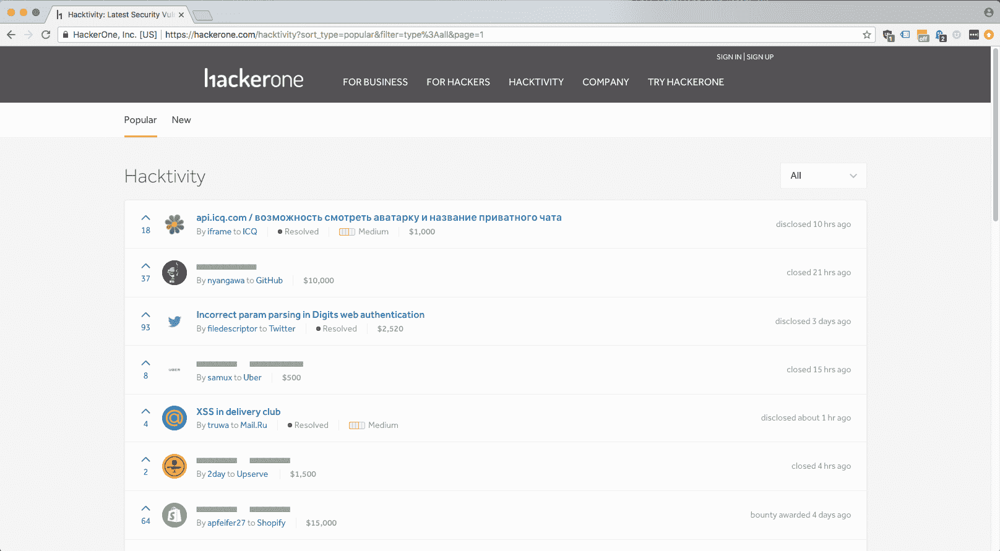
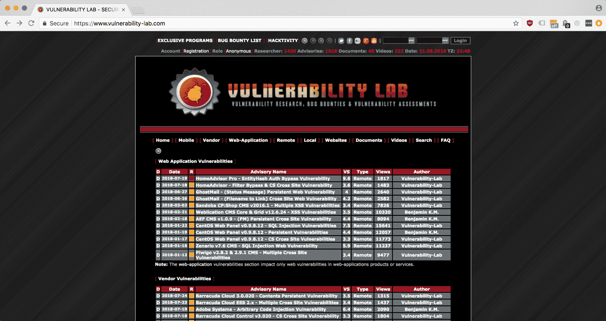
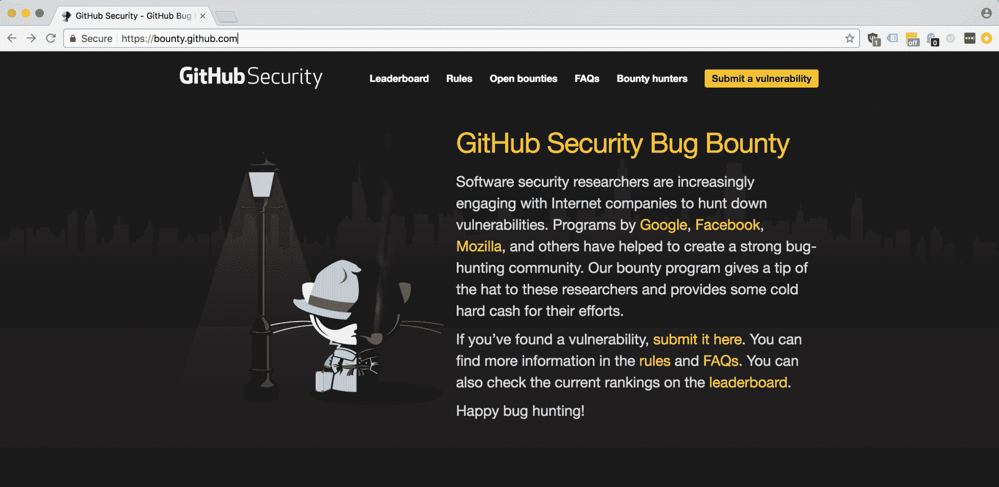

# 格式化你的报告

在本书中，我们根据每个漏洞深入探讨的内容格式化了样本报告。理想情况下，你应该已经从那些频繁出现在报告中的数据点中获得了哪些信息是重要的感觉，但在本章中，我们将更详细地讨论最重要的提交组成部分。我们将讨论什么可以增加获得奖励的机会，什么可以提升奖励的严重性（以及其支付金额），哪些信息是可选但有用的，哪些只是噪音。我们还将讨论你可以用来编写报告的原则，这些报告清晰、易于重现漏洞，并且包含详细、引人入胜的攻击场景，这些将使内部安全团队迫切要求修补漏洞（从而触发你的奖励）。

对一个优秀报告示例中个别内容、场景和格式有深入了解，可以帮助你塑造你的渗透测试实践。随着你不断学习、提高技能，成为更好的研究人员，你可以采用与最终目标一致的新工具、策略和方法，创造出那种完美的报告，那个会立即在最高适当严重性级别获得奖励的报告。

本章将涵盖以下主题：

+   重现漏洞——如何审核你的提交

+   关键的资料——你的报告需要什么

+   最大化你的奖励——那些能带来回报的特性

+   示例提交报告——在哪里查找

# 技术要求

本节将提供文本中的所有必要报告示例。除非你想阅读*进一步阅读*部分的部分材料，否则甚至不需要浏览器。

# 重现漏洞——如何审核你的提交

如果内部安全团队无法通过重现你的 PoC 来验证你的发现，就很难获得奖励。你可能伪造或模拟了发现，或是在某个已修补的边缘条件下创建了它，这些情况并不代表重大威胁。

确保你的漏洞是可重现的最简单方法是，从一开始就自己亲自练习重现它。如果是手动发现的漏洞或像 Burp Intruder 这样的半自动化工具，你能可靠地重现它吗（如果存在竞争条件，可能需要尝试几次才能获得正确的样本大小）；如果是通过扫描器严格控制的漏洞应用，你能手动重现它吗？仅仅再次运行扫描并看到相同的结果是不够的，如果你不能手动重现自动化漏洞，它会被视为无效提交。

编写一系列可重现的操作步骤很容易，只要你强调正确的内容。你应该注意：

+   使用清晰的编号步骤。

+   为每个步骤添加简洁的描述和应用程序状态截图。

+   注意应用内的副作用，即使它们是功能性问题而非直接可利用的（例如，用户信息弹窗立即打开并关闭），因为它们可能会提示回应开发者你没有察觉到的问题，并告知他们自己走在正确的轨道上。

+   包括细微的区分（点击提交按钮与高亮提交按钮并按回车键）以尽可能提供有用的上下文，而不至于过度。一个好的问题是：你是否在将模糊的描述改写为尽可能具体的内容（好），还是在打字时胡乱堆砌术语和信息，试图把每个信息点都扔到墙上，看哪些能粘住（不好）？

+   除了可重复性操作流程本身的描述质量外，提供关于你的环境的（有用的）上下文也非常重要，这些上下文可能比*方法论*部分更深入。例如，在*方法论*部分，你可能会说我导航到*X*页面并将*Y*输入框填入*Z*值，然后使用某某工具。一些额外的、有用的上下文信息可能包括你的浏览器类型、版本，以及任何适用的扩展或配置，这些可能使其与其他环境有所区别。不必要的上下文可能是，你的系统上还安装了一个与任何测试结果完全无关的游戏。

+   了解你的受众。这个建议与我们讨论的正确区分和添加适当技术细节的内容重叠并有所延伸。当你联系一个内部安全团队时，回应者将取决于组织的规模。在一个小型创业公司，你可能会得到一个开发者（甚至是技术创始人）来回应你的报告。在一个更大、更多企业化的公司中，会有专门的安全工程师，甚至可能有一个正式的**网络运维中心**（**NOC**），它本质上是任何网络/数据中心的神经中枢。这意味着，虽然你不能依赖于你的报告被安全专家阅读，但最终你的报告会被传递给负责编写补丁的人，而且它应该包含他们开始调试所需的技术细节。这意味着，如果有一个描述性的错误堆栈追踪，例如——尽管它不会给你带来奖励——你仍然可以通过将其包括在内，帮助贡献的开发者更轻松地解决问题。

这些建议虽然简单，但如果付诸实践，将会提高你提交报告的质量。

让我们看一个示例报告，假设在本节的上下文中，我们正在编写一个我们在一个流行的链接聚合论坛（比如 Reddit 或 Hacker News）评论区发现的持久性 XSS 漏洞。假设我们已经填写了漏洞的基本统计信息（将在我们的*关键信息*部分中介绍），并添加了任何适当的上下文信息（在这种情况下，XSS Payload 将会有用），现在我们准备编写重现该问题的步骤。我在*斜体*中添加了一些简短的注释，以便您区分我的评论和示例报告文本：

1.  导航到某个帖子页面（[`www.somesite.com/the/location/of/the/vulnerable/thread.html`](https://www.somesite.com/the/location/of/the/vulnerable/thread.html)）并点击“添加评论”按钮。包括一个特定的 URL 位置是关键——即使您已经在报告的其他部分添加了该数据。具体描述您在 UI 中执行的操作（点击“添加评论”按钮）虽然看起来比提交表单这样的描述显得冗长，但仍然非常有用。

1.  在弹出的`textarea`输入框模态中，输入以下恶意 XSS 代码片段。然后，点击提交按钮：

```
<svg/onload=alert(document.location.origin)>
```

确保在每次更改应用程序状态时都描述用户体验。引用您正在测试的攻击面中直接涉及的前端组件，将帮助开发人员/工程师重现整个输入链，从前端提交到（在这种情况下，失败的）后端验证。

1.  当代码成功提交后，您应该会被重定向回您添加评论的帖子页面。您应该能看到脚本已执行，`alert()` 弹出漏洞的 URL 位置。

使用`document.location.origin`可以向接收我们提交的团队证明 XSS 脚本正在一个活跃的、非沙箱化的生产实例上执行，且可能会影响实时用户数据。我们还附上了一张显示漏洞实际执行的截图。如果您想为每个单独的步骤附上截图，那也很好，这可以揭示出可能对应用开发者有兴趣的标记文档痕迹，但最关键的状态是捕获漏洞的 PoC 执行。

# 关键信息 – 您的报告需要哪些内容

尽管报告信息会根据漏洞的类型有所不同（您可能会遇到已编码但可解码的敏感信息，这意味着您无法提交任何 Payload 信息），但总有一组通用的字段是您需要填写的：

+   漏洞的位置（URL）

+   漏洞类型

+   何时发现该漏洞

+   如何发现该漏洞（自动化/手动，工具）

+   如何重现该漏洞

+   如何利用这个漏洞

本书中我们已经展示了各个领域的例子，但其中有两个特别值得一提。位置 URL 很明确，类型、时间、方法以及所有直接信息也都很清晰，但确保报告中的漏洞可以重现，并且有一个令人信服的攻击场景，详细描述它造成的可怕后果，且漏洞未被修复，将是确保你的漏洞获得奖励并获取最高可能奖金的关键。

除了必要的信息、完整的重现路径和有说服力的攻击场景外，你还可以包括一些额外的数据，其中有些是特定于漏洞的，有些则是可选的但能提供启发性的信息。

如果你报告的漏洞包含有效载荷，那是很重要的。包括指向 OWASP、NIST 和其他受尊敬的安全组织参考页面的链接，也是清晰传达漏洞性质和类型的有效方式 —— 例如，直接引用 OWASP 页面来描述某种 XSS 类型（[`www.owasp.org/index.php/Testing_for_Reflected_Cross_site_scripting_(OTG-INPVAL-001)`](https://www.owasp.org/index.php/Testing_for_Reflected_Cross_site_scripting_(OTG-INPVAL-001)))，立刻显示你对漏洞的性质非常熟悉，理解其基本原理。如果你写的是由已知组件漏洞导致的攻击场景，确保你包含其 CVE ID 以及漏洞页面的链接。

你的攻击可能会使某些平面文件变得可访问，或者它们可能作为漏洞的证据被包含在内（例如，也许你在服务器上发现了一个包含真实凭证值的旧配置文件，并希望将其作为提交的一部分）。尽管你可以将文件作为证据发送，但请考虑你应该仅发送相对安全的文件，如 `.txt`、`.json`、`.xml` 或其他常见的数据类型。没有哪个安全团队愿意冒着意外执行 `.exe` 或其他潜在恶意软件的风险。如果可能，尽量只包含文件中相关的部分。

# 最大化你的奖励 —— 那些能带来报酬的特点

如果你想了解某个漏洞可能带来的奖励，查看你参与的赏金页面以及 Bugcrowd 创建的漏洞评级系统 **漏洞评级分类法**（**VRT**）是很有帮助的。VRT ([`bugcrowd.com/vulnerability-rating-taxonomy`](https://bugcrowd.com/vulnerability-rating-taxonomy)) 试图以一种系统化的方式评估漏洞的严重性，从而为研究人员、开发者和管理者提供一个共同的参考框架。VRT 还与另一个共同威胁度量系统兼容，即 **通用漏洞评分系统**（**CVSS**）——VRT 可用于计算 CVSS。理解 VRT 有助于你将精力集中在那些能为你带来最大价值的漏洞上。

撰写一个能为漏洞严重性提供适当补偿的赏金报告，要求你能让审查你提交的安全团队重现你的攻击，同时——同样重要的是——你需要写一个有说服力的攻击场景。要写出一个有说服力的攻击场景，你需要具备以下几点：

+   **具体性**：你的攻击场景应该考虑到具体种类的漏洞和利用方式，并且如果可能的话，提到一个具体的部分，而不是泛指类型（例如用户名，而不是 `auth` 数据——除非这是你收集的多个信息的最佳描述）。始终标明应用程序的版本，包含你能够访问的任何元数据等。

+   **现实的严重性**：你的漏洞可能不会导致每个托管区域崩溃，或者使公司的基础设施瘫痪，但它会给员工、客户、投资者以及任何被波及的人员带来严重风险。你应该能够定义一个现实的攻击场景（它不能耗费过多资源或无限时间），但应该会导致不可接受的数据丢失、数据窃取、性能下降或基本功能丧失，因为这些都属于明显的危机。

+   **正确术语**：使用正确的术语（技术词汇、缩写、适用的比喻）可以确保审查你提交的安全团队相信你的攻击场景是可信的，因为你本身是可信的。你不希望因为以笨拙、混乱或误导的方式描述可能是合法发现的内容，而错失奖励机会。能够利用诸如 **远程代码执行**（**RCE**）和 PoC 等常见术语至关重要。

+   **文档**：这是报告！（对吧？）其他部分是相关的考虑因素，但你能附上更多关于场景本身的信息会更好。这可能意味着截图、文件或在发现过程中副作用生成的产物，甚至是某些数据——虽然还没有达到主动利用的路径，但能证明，例如，你可以打印出敏感的 cookie 信息，而不实际泄露或滥用这些信息。

牢记这些原则，让我们来看一个写得不太好的报告示例，并将其与一个更强的尝试进行对比，假设我们正在提交关于之前讨论的相同漏洞——持久性 XSS（跨站脚本攻击）——的报告，该漏洞在一个热门在线论坛的评论区被发现。

+   **弱点**：利用这个漏洞，某人可以通过在一个热门讨论串中插入恶意脚本来攻击网站的用户社区。

+   **更强的**：攻击者可以通过在一个热门讨论串的评论中插入恶意 JavaScript 代码片段来利用持久性 XSS 漏洞，这段代码可能通过将管理员账户的 cookies 发送到监听服务器来窃取这些 cookies。

注意，第二个、更强的攻击场景仍然简洁——保持场景详细但简洁是很重要的。它使用了具体的术语而不是笼统的词汇（JavaScript，而不是脚本；评论中的热门讨论串，而不是热门讨论串中的评论；管理员账户 cookies，而不是其他不具体的说法），并列出了一个可能的风险（窃取管理员账户 cookies），这个风险远比简单的关于恶意脚本的模糊描述要具体，代表了一个具体且有害的场景。这个场景也符合漏洞的严重性：XSS 不会像某些科幻超级蠕虫那样摧毁全球金融系统，但它可以对个体用户造成很大伤害。

# 示例提交报告——查看地点

我们为每个讨论过的漏洞写了一个示例报告，并在本章中使用了一些例子来说明某些要点。希望这为你提供了关于报告所需内容和写作方法的坚实基础。

学习做任何事情的最佳方法之一是将你的实践建立在其他成功研究人员的经验上，并看到他们的专业技能在实际中的运用，而不是单纯地接受它作为传承下来的智慧。阅读足够多的成功报告（那些已经获得奖励的报告），你会开始看到其中的共同主题，以及支撑这些研究者成功职业生涯的实践方法。以下是一些资源，展示了这些经过实战检验的报告，它们为作者赢得了声誉和奖项。

# Hackerone Hacktivity

Hackerone 的 Hacktivity 部分([`hackerone.com/hacktivity`](https://hackerone.com/hacktivity))是一个漏洞报告提交的档案库，采用类似 Reddit 的投票系统，社区可以对特别有趣的报告进行点赞，从而将其展示在该部分的首页：



由于报告只有在赏金计划经理同意后才会公开，你可以看到许多报告是灰色显示的。但那些可见的报告不仅展示了参与公司在安全文化方面的情况，还提供了成功研究人员日常渗透测试的过程。

# 漏洞实验室档案

我们首先讨论了漏洞实验室，类似于 Hackerone，在优秀漏洞悬赏研究员社区中的作用。除了是发现新漏洞悬赏计划的绝佳来源外，漏洞实验室还维护着一个档案（[`www.vulnerability-lab.com/`](https://www.vulnerability-lab.com/)），其中包含了所有在其平台上提交的漏洞报告（这些计划的所有者也同意公开披露这些漏洞）：



漏洞实验室档案的一个最有价值的元素是，每份报告按类型组织——无论是 Web 应用、移动应用还是一般的供应商漏洞——使你能够轻松地深入了解与你的实践最相关的报告。

# GitHub

GitHub 的漏洞悬赏页面（[`bounty.github.com/`](https://bounty.github.com/)）不仅展示了所有参与其计划的安全研究人员的排行榜，显示了贡献者的用户名、个人资料图片和 Twitter 用户名，还提供了一些关于他们发现的漏洞的基本信息——漏洞的类别、子类别，以及一个简要的解释段落，说明漏洞是在哪里发现的以及其影响的服务：



尽管这些报告很有价值，但它们没有提供前两组漏洞报告通常会展示的技术细节（如代码片段、截图和相关文件附件）。

# 摘要

本章讨论了编写漏洞报告提交的细节，我们可能在攻击章节中略过了这些内容，解释了每份报告应包含的关键信息、可选信息、包含详细重现步骤的重要性、如何编写好的攻击场景（包括示例）、哪里可以找到实际的生产漏洞报告提交等内容。基于我们在漏洞演练章节中创建的示例提交报告，并结合更多关于什么样的报告值得获得奖励的高层讨论，本章将为你提供前进所需的一切，帮助你编写高质量的报告，从而为你发现的漏洞赢得最大奖励。

在下一章中，我们将讨论一些超出我们直接使用的工具和方法。

# 问题

1.  RCE 代表什么？

1.  在报告中，关于你的发现，什么样的背景信息是有用的？

1.  每份报告中应该包含哪些数据的几个例子？

1.  什么是漏洞评级分类法（VRT）？CVSS 又是什么？

1.  为什么确保漏洞是可重现的很重要？

1.  什么区分了一篇写得好的攻击场景与一篇平淡无奇的攻击场景？

1.  有哪些好的资源可以用来查找实际漏洞报告提交的例子？

1.  在你的漏洞报告中，哪些类型的文件附件值得包括？

# 深入阅读

你可以在以下链接中找到更多我们在本章讨论的主题：

+   **GitHub 漏洞赏金常见问题**: [`bounty.github.com/index.html#faqs`](https://bounty.github.com/index.html#faqs).

+   **漏洞提交方法**: [`www.bugcrowd.com/writing-successful-bug-submissions-bug-bounty-hunter-methodology/`](https://www.bugcrowd.com/writing-successful-bug-submissions-bug-bounty-hunter-methodology/)
