# 汇编语言与反汇编入门

静态分析和动态分析是理解恶意软件基本功能的绝佳技术，但这些技术并不能提供关于恶意软件功能的所有必要信息。恶意软件作者通常使用高级语言（如 C 或 C++）编写恶意代码，然后通过编译器将其编译成可执行文件。在你的调查过程中，你只能获得恶意可执行文件，而没有源代码。为了深入了解恶意软件的内部工作原理，并理解恶意二进制文件的关键方面，需要进行代码分析。

本章将介绍进行代码分析所需的概念和技能。为了更好地理解该主题，本章将结合 C 编程和汇编语言编程中的相关概念。为了理解本章涉及的概念，要求你具备基本的编程知识（最好是 C 编程）。如果你不熟悉基本的编程概念，可以从一本入门编程书籍开始学习（可以参考本章末尾提供的附加资源），然后再回来阅读本章。

从代码分析（逆向工程）角度将涵盖以下主题：

+   计算机基础、内存和 CPU

+   数据传输、算术运算和位运算

+   分支和循环

+   函数和栈

+   数组、字符串和结构体

+   x64 架构的概念

# 1\. 计算机基础

计算机是一种处理信息的机器。计算机中的所有信息都是通过*比特*表示的。比特是一个基本单位，它可以取值 `0` 或 `1`。比特的集合可以表示一个数字、一个字符或任何其他信息。

**基本数据类型**：

一组 `8` 个比特组成一个*字节*。一个字节用两个十六进制数字表示，每个十六进制数字是 `4` 比特大小，称为*半字节（nibble）*。例如，二进制数 `01011101` 转换为十六进制是 `5D`。数字 `5`（`0101`）和数字 `D`（`1101`）就是这两个*半字节*：

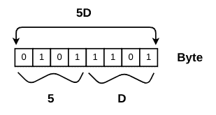

除了字节外，还有其他数据类型，例如 `word`，它是 `2` 字节（`16 位`）大小；`double word (dword)` 是 `4` 字节（`32 位`）；`quadword (qword)` 是 `8` 字节（`64 位`）：

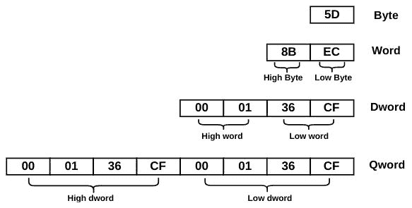

**数据解释**：

一个字节或字节序列可以有不同的解释。例如，`5D` 可以表示二进制数 `01011101`，或者十进制数 `93`，或者字符 `]`。字节 `5D` 还可以表示一条机器指令，`pop ebp`。

类似地，两个字节序列 `8B EC`（`word`）可以表示 `short int 35820` 或一条机器指令，`mov ebp,esp`。

双字（`dword`）值 `0x010F1000` 可以解释为一个整数值 `17764352`，也可以解释为一个内存地址。这完全取决于如何解释字节，字节或字节序列的意义取决于其用途。

# 1.1 内存

*主内存（RAM）* 存储计算机的代码（机器码）和数据。计算机的主内存是一个字节数组（十六进制格式的字节序列），每个字节都标有一个唯一的编号，称为 *地址*。第一个地址从 `0` 开始，最后一个地址取决于所使用的硬件和软件。地址和值以十六进制表示：

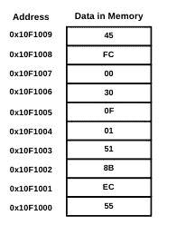

# 1.1.1 数据在内存中的存储方式

在内存中，数据以 *小端* 格式存储；也就是说，低位字节存储在较低的地址，后续字节依次存储在内存中逐渐增高的地址：

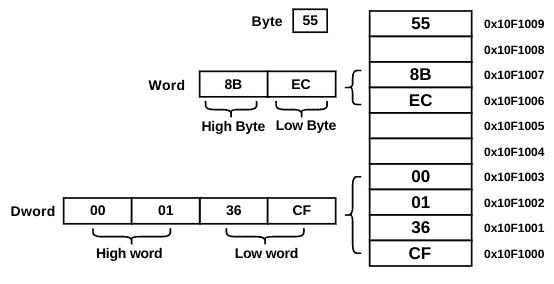

# 1.2 CPU

*中央处理单元（CPU）* 执行指令（也叫 *机器指令*）。CPU 执行的指令以字节序列的形式存储在内存中。在执行指令时，需要的数据（也以字节序列形式存储）从内存中提取。

CPU 本身在其芯片内包含了一小部分内存，称为 *寄存器组*。寄存器用于存储在执行过程中从内存中提取的值。

# 1.2.1 机器语言

每个 CPU 都有一组它可以执行的指令。CPU 执行的指令构成了 CPU 的机器语言。这些机器指令以字节序列的形式存储在内存中，并被 CPU 提取、解释和执行。

*编译器* 是一种将用编程语言（如 C 或 C++）编写的程序转换为机器语言的程序。

# 1.3 程序基础

在本节中，你将学习编译过程和程序执行过程中发生的事情，以及程序执行时各个计算机组件如何相互作用。

# 1.3.1 程序编译

以下列表概述了可执行文件的编译过程：

1.  源代码是用高级语言编写的，例如 C 或 C++。

1.  程序的源代码通过编译器进行处理。编译器将用高级语言编写的语句转换为一种称为 *目标文件* 或 *机器代码* 的中间形式，这种形式不可读，旨在供处理器执行。

1.  然后，目标代码会传递给链接器。链接器将目标代码与所需的库文件（DLL）链接，以生成可以在系统上运行的可执行文件：


# 1.3.2 硬盘上的程序

让我们通过一个示例来理解编译后的程序在磁盘上的样子。我们以一个简单的 C 程序为例，程序将字符串打印到屏幕：

```
#include <stdio.h>
int main() {
   char *string = "This is a simple program"; 
   printf("%s",string);
   return 0;
}
```

上述程序经过编译器编译生成了一个可执行文件（`print_string.exe`）。在 PE Internals 工具中打开已编译的可执行文件（[`www.andreybazhan.com/pe-internals.html`](http://www.andreybazhan.com/pe-internals.html)）会显示由编译器生成的五个节（`.text`、`.rdata`、`.data`、`.rsrc`和`.reloc`）。关于这些节的信息可以在第二章中找到，*静态分析*部分。这里我们将主要关注两个节：`.text`和`.data`。`.data`节的内容如下图所示：


在上面的截图中，你可以看到我们在程序中使用的字符串`This is a simple program`存储在文件偏移量`0x1E00`的`.data`节中。这个字符串不是代码，而是程序所需的数据。同样，`.rdata`节包含只读数据，有时也包含*导入/导出*信息。`.rsrc`节包含可执行文件使用的资源。

`.text`节的内容如下图所示：


显示在`.text`节中的字节序列（具体来说是`35`个字节，从文件偏移量`0x400`开始）是*机器代码*。我们编写的源代码经过编译器转换成了机器代码（或机器语言程序）。机器代码对于人类来说不易阅读，但处理器（CPU）知道如何解读这些字节序列。机器代码包含处理器将执行的指令。编译器将数据和代码分隔到磁盘上的不同节中。为了简化起见，我们可以将可执行文件视为包含代码（`.text`）和数据（`.data`、`.rdata`等）：

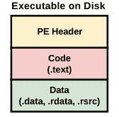

# 1.3.3 程序在内存中的表现

在上一节中，我们检查了磁盘上可执行文件的结构。现在我们来理解当可执行文件被加载到内存时发生了什么。当双击可执行文件时，操作系统会为进程分配内存，并通过操作系统加载器将可执行文件加载到分配的内存中。以下简化的内存布局图有助于你理解这个概念；请注意，磁盘上可执行文件的结构与内存中的可执行文件结构相似：

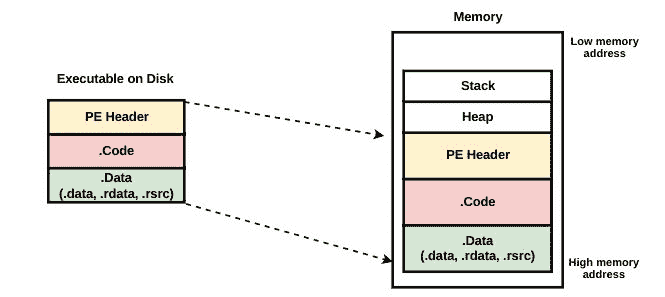

在上面的示意图中，堆用于程序执行过程中进行动态内存分配，其内容是可变的。栈用于存储局部变量、函数参数和返回地址。你将在后面的章节中详细了解栈。

前面展示的内存布局大大简化了，组件的位置可以是任何顺序。内存中还包含了各种*动态链接库（DLLs）*，这些在前面的图示中没有展示，为了简化起见。你将在接下来的章节中详细了解进程内存。

现在，让我们回到我们编译后的可执行文件（`print_string.exe`），并将其加载到内存中。该可执行文件已在*x64dbg*调试器中打开，调试器将可执行文件加载到了内存中（我们将在后面的章节中介绍*x64dbg*；现在我们将专注于可执行文件在内存中的结构）。在以下截图中，你可以看到可执行文件已加载到内存地址`0x010F0000`，并且可执行文件的所有部分也已加载到内存中。需要记住的一点是，你看到的内存地址是虚拟地址，而不是物理内存地址。虚拟地址最终会被转换为物理内存地址（你将在后面的章节中了解更多关于虚拟地址和物理地址的内容）：


检查`.data`部分在内存地址`0x010F3000`的位置，可以看到字符串`This is a simple program`。


检查`.text`部分在内存地址`0x010F1000`的位置，可以看到字节序列，这就是机器码。


一旦包含代码和数据的可执行文件被加载到内存中，CPU 会从内存中取出机器码，解释并执行它。在执行机器指令时，所需的数据也会从内存中提取。在我们的示例中，CPU 从`.text`部分获取包含指令（在屏幕上打印）的机器码，并从`.data`部分获取要打印的字符串（数据）`This is a simple program`。以下图示将帮助你可视化 CPU 和内存之间的交互：


在执行指令时，程序还可能与输入/输出设备交互。在我们的示例中，当程序执行时，字符串被打印到计算机屏幕上（输出设备）。如果机器码中有接收输入的指令，处理器（CPU）将与输入设备（例如键盘）进行交互。

总结一下，程序执行时会执行以下步骤：

1.  程序（包含代码和数据）被加载到内存中。

1.  CPU 从内存中获取机器指令，解码并执行它。

1.  CPU 从内存中获取所需的数据；数据也可以被写入内存。

1.  CPU 可能会根据需要与输入/输出系统进行交互：

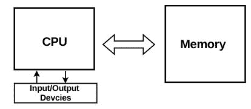

# 1.3.4 程序反汇编（从机器码到汇编代码）

正如你所预期的，机器码包含了关于程序内部工作的详细信息。例如，在我们的程序中，机器码包含了在屏幕上打印的指令，但对于人类来说，尝试理解机器码（它是以字节序列形式存储的）会非常困难。

一个*反汇编器/调试器*（如*IDA Pro*或*x64dbg*）是一个将机器码翻译成低级代码（称为*汇编代码*，即汇编语言程序）的程序，可以被读取和分析，以确定程序的工作原理。下图显示了机器码（`.text`部分的字节序列）被翻译成表示`13`条可执行指令（`push ebp`、`mov ebp,esp`等）的汇编指令。这些翻译后的指令称为*汇编语言指令*。

你可以看到，汇编指令比机器码更容易阅读。注意，反汇编器是如何将字节`55`翻译为可读的汇编指令`push ebp`，并将接下来的两个字节`8B EC`翻译为`mov ebp,esp`，依此类推：


从代码分析的角度来看，确定程序的功能主要依赖于理解这些汇编指令以及如何解释它们。

在本章的其余部分，你将学习理解汇编代码所需的技能，以便逆向工程恶意二进制文件。在接下来的章节中，你将学习进行代码分析所必需的 x86 汇编语言指令的概念；x86，也称为 IA-32（32 位），是 PC 上最常见的架构。Microsoft Windows 运行在 x86（32 位）架构和 Intel 64（x64）架构上。你将遇到的大多数恶意软件都是为 x86（32 位）架构编译的，并且可以在 32 位和 64 位 Windows 上运行。章节末，你将理解 x64 架构以及 x86 和 x64 之间的区别。

# 2\. CPU 寄存器

如前所述，CPU 包含称为*寄存器*的特殊存储器。由于 CPU 可以比内存中数据的访问速度快得多，因此从内存中提取的值会暂时存储在这些寄存器中，以便执行操作。

# 2.1 通用寄存器

x86 CPU 有八个通用寄存器：`eax`，`ebx`，`ecx`，`edx`，`esp`，`ebp`，`esi` 和 `edi`。这些寄存器的大小为 32 位（4 字节）。程序可以按 32 位（4 字节）、16 位（2 字节）或 8 位（1 字节）值来访问这些寄存器。这些寄存器的低 16 位（2 字节）可以作为 `ax`，`bx`，`cx`，`dx`，`sp`，`bp`，`si` 和 `di` 来访问。`eax`，`ebx`，`ecx` 和 `edx` 的低 8 位（1 字节）可以分别引用为 `al`，`bl`，`cl` 和 `dl`。高 8 位可以通过 `ah`，`bh`，`ch` 和 `dh` 来访问。在以下示意图中，`eax` 寄存器包含 4 字节值 `0xC6A93174`。程序可以通过访问 `ax` 寄存器来访问低 2 字节（`0x3174`），通过访问 `al` 寄存器来访问低字节（`0x74`），而下一个字节（`0x31`）则可以通过使用 `ah` 寄存器来访问：

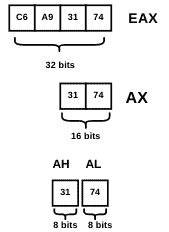

# 2.2 指令指针（EIP）

CPU 有一个特殊的寄存器，叫做 `eip`；它包含下一条指令的地址。当指令执行时，`eip` 将指向内存中下一条要执行的指令。

# 2.3 EFLAGS 寄存器

`eflags` 寄存器是一个 32 位的寄存器，寄存器中的每一位都是一个*标志*。`EFLAGS` 寄存器中的位用于指示计算的状态，并控制 CPU 操作。标志寄存器通常不会直接引用，但在执行计算或条件指令时，每个标志位都会被设置为 `1` 或 `0`。除了这些寄存器外，还有一些其他寄存器，称为*段寄存器*（`cs`，`ss`，`ds`，`es`，`fs`，和 `gs`），它们用于跟踪内存中的各个段。

# 3. 数据传输指令

汇编语言中的基本指令之一是 `mov` 指令。顾名思义，这条指令将数据从一个位置移动到另一个位置（从源位置到目标位置）。`mov` 指令的一般形式如下；这类似于高级语言中的赋值操作：

```
mov dst,src
```

`mov` 指令有不同的变体，接下来将会介绍。

# 3.1 将常量移入寄存器

`mov` 指令的第一种变体是将一个*常量（或立即数值）*移动到寄存器中。在以下示例中，`;`（分号）表示注释的开始；分号后面的内容不属于汇编指令。这只是一个简短的描述，帮助你理解这个概念：

```
mov eax,10  *; moves 10 into EAX register, same as eax=10*
mov bx,7    *; moves 7 in bx register, same as bx=7*
mov eax,64h *; moves hex value 0x64 (i.e 100) into EAX*
```

# 3.2 从寄存器到寄存器的值传送

将一个值从一个寄存器传送到另一个寄存器，可以通过将寄存器名称作为操作数放置到 `mov` 指令中来实现：

```
mov eax,ebx *; moves content of ebx into eax, i.e eax=ebx*
```

以下是两条汇编指令的示例。第一条指令将常量值 `10` 移入 `ebx` 寄存器。第二条指令将 `ebx` 寄存器的值（即 `10`）移入 `eax` 寄存器；因此，`eax` 寄存器将包含值 `10`：

```
mov ebx,10  *; moves 10 into ebx, ebx = 10*
mov eax,ebx *; moves value in ebx into eax, eax = ebx or eax = 10*
```

# 3.3 从内存到寄存器的值传送

在查看将值从内存移动到寄存器的汇编指令之前，我们先尝试理解值是如何存储在内存中的。假设你在 C 程序中定义了一个变量：

```
int val = 100;
```

以下列表概述了程序运行时发生的事情：

1.  整数占用 4 个字节，因此整数 `100` 作为 4 个字节（`00 00 00 64`）存储在内存中。

1.  四个字节的顺序是按照之前提到的*小端*格式存储的。

1.  整数 `100` 存储在某个内存地址。假设 `100` 存储在从 `0x403000` 开始的内存地址中；你可以将这个内存地址看作是标记为 `val`：


要将一个值从内存移动到寄存器中，你必须使用该值的地址。以下汇编指令将把存储在内存地址 `0x403000` 处的 4 字节移入寄存器 `eax`。方括号表示你要的是存储在该内存位置的值，而不是地址本身：

```
mov eax,[0x403000] *; eax will now contain 00 00 00 64 (i.e 100)*
```

请注意，在前面的指令中，你不需要在指令中指定 4 字节；根据目标寄存器（`eax`）的大小，它会自动确定移动多少字节。以下截图将帮助你理解执行前述指令后的情况：


在逆向工程中，你通常会看到类似下面的指令。方括号中可能包含一个*寄存器*、*一个加到寄存器上的常量*，或者*一个寄存器加到另一个寄存器上*。所有以下图示的指令都将把存储在方括号中指定的内存地址的值移动到寄存器中。最简单的记法是，方括号中的一切都代表一个地址：

```
mov eax,[ebx]     *; moves value at address specifed by ebx register*
mov eax,[ebx+ecx] *; moves value at address specified by ebx+ecx*
mov ebx,[ebp-4]   *; moves value at address specified by ebp-4*
```

另一个你通常会遇到的指令是 `lea` 指令，表示*加载有效地址*；这条指令将加载地址，而不是值：

```
lea ebx,[0x403000] *; loads the address 0x403000 into ebx*
lea eax, [ebx]     *; if ebx = 0x403000, then eax will also contain 0x403000*
```

有时，你会遇到类似以下的指令。这些指令与前面提到的指令相同，都是将存储在内存地址（由 `ebp-4` 指定）中的数据传送到寄存器中。`dword ptr` 只是表示一个 4 字节（`dword`）的值从由 `ebp-4` 指定的内存地址移动到 `eax`：

```
mov eax,dword ptr [ebp-4]  *; same as mov eax,[ebp-4]*
```

# 3.4 从寄存器到内存的值的移动

你可以通过交换操作数，将值从寄存器移动到内存，使得内存地址位于左侧（目标），而寄存器位于右侧（源）：

```
mov [0x403000],eax *; moves 4 byte value in eax to memory location starting at 0x403000*
mov [ebx],eax   *; moves 4 byte value in eax to the memory address specified by ebx*
```

有时，你会遇到类似以下的指令。这些指令将常量值移动到内存位置；`dword ptr` 只是指定一个 `dword` 值（4 字节）被移动到内存位置。同样，`word ptr` 指定一个 `word`（2 字节）被移动到内存位置：

```
mov dword ptr [402000],13498h *; moves dword value 0x13496 into the address 0x402000*
mov dword ptr [ebx],100   *; moves dword value 100 into the address specified by ebx*
mov word ptr [ebx], 100    *; moves a word 100 into the address specified by ebx*
```

在之前的情况下，如果`ebx`包含内存地址`0x402000`，那么第二条指令将`100`以`00 00 00 64`（4 字节）的形式复制到内存位置`0x402000`开始的地址，第三条指令将`100`以`00 64`（2 字节）的形式复制到内存位置`0x40200`开始的地址，如下所示：

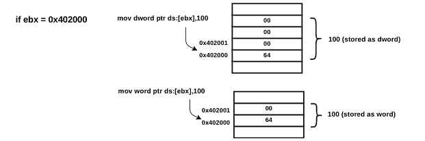

让我们来看一个简单的挑战。

# 3.5 拆解挑战

以下是一个简单 C 代码片段的反汇编输出。你能搞清楚这段代码做了什么吗？并且你能将它翻译回伪代码（高级语言等效代码）吗？请运用到目前为止你学到的所有概念来解决这个挑战。挑战的答案将在下一节中介绍，解决挑战后我们还将回顾原始的 C 代码片段：

```
mov dword ptr [ebp-4],1  ➊
mov eax,dword ptr [ebp-4]  ➋
mov dword ptr [ebp-8],eax  ➌
```

# 3.6 反汇编解决方案

之前的程序将一个值从一个内存位置复制到另一个位置。在➊处，程序将`dword`值`1`复制到内存地址（由`ebp-4`指定）。在➋处，相同的值被复制到`eax`寄存器中，然后在➌处被复制到另一个内存地址`ebp-8`。

反汇编代码可能一开始难以理解，所以让我来分解一下，使其变得简单。我们知道，在像 C 这样的高级语言中，你定义的变量（例如`int val;`）其实只是一个内存地址的符号名称（如前所述）。根据这个逻辑，让我们识别内存地址引用并给它们起个符号名称。在反汇编程序中，我们有两个地址（方括号内）：`ebp-4` 和 `ebp-8`。让我们给它们起名字，假设`ebp-4 = a`和`ebp-8 = b`。现在，程序应该像这样：

```
mov dword ptr [a],1     *; treat it as mov [a],1*
mov eax,dword ptr [a]   *; treat it as mov eax,[a]*
mov dword ptr [b],eax   *; treat it as mov [b],eax*
```

在高级语言中，当你给一个变量赋值，比如`val = 1`，值`1`被移动到由`val`变量表示的地址。在汇编中，这可以表示为`mov [val], 1`。换句话说，`val = 1`在高级语言中与汇编中的`mov [val],1`是等效的。运用这个逻辑，之前的程序可以写成一个高级语言的等效代码：

```
a = 1
eax = a
b = eax ➍
```

记住，寄存器是 CPU 用于临时存储的地方。所以，让我们将所有寄存器名称替换为`=`符号右侧的值（例如，将`eax`替换为其值`a`，位于➍）。结果代码如下所示：

```
a = 1
eax = a ➎
b = a
```

在之前的程序中，`eax`寄存器用于临时存储`a`的值，因此我们可以删除第➎行的条目（即删除`=`符号左侧包含寄存器的条目）。现在我们得到的是简化后的代码，如下所示：

```
a = 1
b = a
```

在高级语言中，变量有数据类型。让我们尝试确定这些变量`a`和`b`的数据类型。有时，可以通过了解变量如何被访问和使用来确定数据类型。从反汇编的代码中，我们知道`dword`值（4 字节）`1`被移入变量`a`，然后又复制到`b`。现在我们知道这些变量的大小为 4 字节，这意味着它们可能是`int`、`float`或`指针`类型。为了确定确切的数据类型，让我们考虑以下内容。

变量`a`和`b`不能是`float`类型，因为从反汇编代码中我们知道`eax`参与了数据传输操作。如果是浮点值，则会使用浮点寄存器，而不是使用像`eax`这样的通用寄存器。

在这种情况下，变量`a`和`b`不能是`指针`，因为值`1`不是一个有效的地址。所以，我们可以猜测`a`和`b`应该是`int`类型。

基于这些观察结果，我们现在可以将程序重写如下：

```
int a;
int b;

a = 1;
b = a;
```

现在我们已经解决了这个问题，让我们来看一下反汇编输出的原始 C 代码片段。原始 C 代码片段如下所示。将其与我们确定的结果进行对比。注意，尽管无法完全恢复原始的 C 程序（并不总是能恢复出完全相同的 C 程序），但我们仍然能够构建一个与原始程序类似的程序，现在也更容易确定程序的功能：

```
int x = 1;
int y;
y = x;
```

如果你正在反汇编一个较大的程序，那么标记所有内存地址会非常困难。通常，你会使用反汇编器或调试器的功能来重命名内存地址并进行代码分析。你将在下一章学习如何使用反汇编器的功能进行代码分析。当你处理较大的程序时，最好将程序分解成小块代码，翻译成你熟悉的某种高级语言，然后对其余的代码块做同样的事情。

# 4. 算术操作

在汇编语言中，你可以执行加法、减法、乘法和除法。加法和减法分别使用`add`和`sub`指令进行。这些指令接受两个操作数：*目标*和*源*。`add`指令将源操作数与目标操作数相加，并将结果存储在目标中。`sub`指令从目标操作数中减去源操作数，结果存储在目标中。这些指令根据操作设置或清除`eflags`寄存器中的标志。这些标志可以在条件语句中使用。如果结果为零，`sub`指令会设置零标志`(zf)`，如果目标值小于源值，则设置进位标志`(cf)`。以下概述了这些指令的一些变体：

```
add eax,42      *; same as eax = eax+42*
add eax,ebx     *; same as eax = eax+ebx*
add [ebx],42    *; adds 42 to the value in address specified by ebx*
sub eax, 64h    *; subtracts hex value 0x64 from eax, same as eax = eax-0x64*
```

有一个特殊的增量（`inc`）和减量（`dec`）指令，可用于向寄存器或内存位置加`1`或减`1`：

```
inc eax    *; same as eax = eax+1*
dec ebx    *; same as ebx = ebx-1*
```

乘法是使用`mul`指令完成的。`mul`指令只接受一个操作数；该操作数与`al`、`ax`或`eax`寄存器的内容相乘。乘法的结果存储在`ax`、`dx 和 ax`或`edx 和 eax`寄存器中。

如果`mul`指令的操作数为*8 位（1 字节）*，则与 8 位`al`寄存器相乘，并将乘积存储在`ax`寄存器中。如果操作数为*16 位（2 字节）*，则与`ax`寄存器相乘，并将乘积存储在`dx`和`ax`寄存器中。如果操作数为*32 位（4 字节）*，则与`eax`寄存器相乘，并将乘积存储在`edx`和`eax`寄存器中。将乘积存储在比输入值大一倍的寄存器中的原因是，当两个值相乘时，输出值可能比输入值大得多。以下概述了`mul`指令的变体：

```
mul ebx  *;ebx is multiplied with eax and result is stored in EDX and EAX*
mul bx   *;bx is multiplied with ax and the result is stored in DX and AX*
```

除法是使用`div`指令执行的。`div`只接受一个操作数，可以是寄存器或内存引用。要执行除法，将被除数（要除的数）放入`edx 和 eax`寄存器中，其中`edx`保存最高有效*dword*。执行`div`指令后，商存储在`eax`中，余数存储在`edx`寄存器中：

```
div ebx   *; divides the value in EDX:EAX by EBX*
```

# 4.1 反汇编挑战

让我们接受另一个简单的挑战。以下是一个简单 C 程序的反汇编输出。您能够弄清楚这个程序的功能，并将其翻译回伪代码吗？

```
mov dword ptr [ebp-4], 16h
mov dword ptr [ebp-8], 5
mov eax, [ebp-4]
add eax, [ebp-8]
mov [ebp-0Ch], eax
mov ecx, [ebp-4]
sub ecx, [ebp-8]
mov [ebp-10h], ecx
```

# 4.2 反汇编解决方案

您可以逐行阅读代码并尝试确定程序的逻辑，但如果将其翻译回某种高级语言，则会更容易。为了理解前述程序，让我们使用之前介绍的相同逻辑。前述代码包含四个内存引用。首先，让我们标记这些地址 - `ebp-4=a`、`ebp-8=b`、`ebp-0Ch=c`和`ebp-10H=d`。标记地址后，它翻译为以下内容：

```
mov dword ptr [a], 16h
mov dword ptr [b], 5
mov eax, [a]
add eax, [b]
mov [c], eax
mov ecx, [a]
sub ecx, [b]
mov [d], ecx
```

现在，让我们将上述代码翻译成伪代码（高级语言等效）。代码如下：

```
a = 16h    *; h represents hexadecmial, so 16h (0x16) is 22 in decimal*
b = 5
eax = a
eax = eax + b  ➊
c = eax  ➊ 
ecx = a
ecx = ecx-b  ➊
d = ecx  ➊
```

将所有寄存器名称替换为等号右侧（即➊处）的相应值，我们得到以下代码：

```
a = 22
b = 5
eax = a  ➋
eax = a+b  ➋
c = a+b
ecx = a  ➋
ecx = a-b  ➋
d = a-b
```

在去除所有左侧含有寄存器的`=`符号处的条目后，我们得到以下代码：

```
a = 22
b = 5
c = a+b
d = a-b
```

现在，我们已将八行汇编代码简化为四行伪代码。此时，你可以看出代码执行的是加法和减法操作，并将结果存储。你可以根据代码中变量的大小和使用方式（上下文）来推断变量类型，如前所述。变量`a`和`b`用于加法和减法，因此这些变量必须是整数类型，而变量`c`和`d`存储整数加法和减法的结果，因此可以推测它们也是整数类型。现在，前面的代码可以写成如下形式：

```
int a,b,c,d;
a = 22;
b = 5;
c = a+b;
d = a-b;
```

如果你对反汇编输出的原始 C 程序感到好奇，以下是原始的 C 程序来满足你的好奇心。注意，我们是如何将汇编代码写回到其等效的高级语言中的：

```
int num1 = 22;
int num2 = 5;
int diff;
int sum;
sum = num1 + num2;
diff = num1 - num2;
```

# 5. 位运算

在这一部分，你将学习操作位的汇编指令。位是从最右侧开始编号的；*最右边的位（最低有效位）*的位位置是`0`，位位置向左增加。最左边的位称为*最高有效位*。以下是一个示例，展示了一个字节`5D (0101 1101)`的位及其位位置。相同的逻辑适用于`word`、`dword`和`qword`：


位运算指令之一是`not`指令；它只需要一个操作数（既作为源操作数又作为目标操作数），并将所有位取反。如果`eax`寄存器包含`FF FF 00 00 (11111111 11111111 00000000 00000000)`，则以下指令会将所有位取反，并将结果存储在`eax`寄存器中。因此，`eax`寄存器将包含`00 00 FF FF (00000000 00000000 11111111 11111111)`：

```
not eax
```

`and`、`or`和`xor`指令执行位与（`and`）、位或（`or`）和位异或（`xor`）操作，并将结果存储到目标位置。这些操作类似于 C 语言或 Python 语言中的`and (&)`、`or (|)`和`xor (^)`操作。以下示例中，`and`操作会对`bl`寄存器的位`0`和`cl`寄存器的位`0`、`bl`寄存器的位`1`和`cl`寄存器的位`1`等执行操作。结果存储在`bl`寄存器中：

```
and bl,cl  *; same as bl = bl & cl*
```

在前面的示例中，如果`bl`寄存器包含`5 (0000 0101)`，`cl`寄存器包含`6 (0000 0110)`，那么`and`操作的结果将是`4 (0000 0100)`，如图所示：

```
                    bl: 0000 0101
                    cl: 0000 0110
--------------------------------------
After and operation bl: 0000 0100
```

同样，`or`和`xor`操作会对操作数的相应位执行操作。以下展示了一些示例指令：

```
or eax,ebx   *; same as eax = eax | ebx*
xor eax,eax  *; same eax = eax^eax, this operation clears the eax register*
```

`shr`（右移位）和`shl`（左移位）指令需要两个操作数（目标和计数）。目标可以是寄存器或内存引用。其一般形式如下所示。这两条指令将目标中的比特按照计数操作数指定的位数向右或向左移动；这些指令执行的操作与 C 或 Python 编程语言中的`shift left (<<)`和`shift right(>>)`相同：

```
shl dst,count
```

在下面的示例中，第一条指令（`xor eax, eax`）清空了`eax`寄存器，随后将`4`移入`al`寄存器，`al`寄存器的内容（即`4 (0000 0100)`）被左移了`2`位。经过该操作后（最左侧的两个比特被移除，右侧添加了两个`0`比特），操作完成后，`al`寄存器将包含`0001 0000`（即`0x10`）：

```
xor eax,eax
mov al,4 
shl al, 2
```

有关位运算符如何工作的详细信息，请参阅[`en.wikipedia.org/wiki/Bitwise_operations_in_C`](https://en.wikipedia.org/wiki/Bitwise_operations_in_C)和[`www.programiz.com/c-programming/bitwise-operators`](https://www.programiz.com/c-programming/bitwise-operators)。

`rol`（左循环移位）和`ror`（右循环移位）指令类似于移位指令。与移位操作不同，它们不会移除被移位的比特，而是将它们旋转到另一端。以下是一些示例指令：

```
rol al,2
```

在前面的示例中，如果`al`包含`0x44 (0100 0100)`，则`rol`操作的结果将是`0x11 (0001 0001)`。

# 6. 分支与条件语句

本节将重点讨论分支指令。到目前为止，你已经看到了按顺序执行的指令；但是在许多情况下，你的程序需要在不同的内存地址执行代码（如`if/else`语句、循环、函数等）。这可以通过使用分支指令来实现。分支指令将执行控制转移到不同的内存地址。为了进行分支，汇编语言中通常使用跳转指令。跳转分为两种：*条件跳转*和*无条件跳转*。

# 6.1 无条件跳转

在*无条件*跳转中，跳转总是会发生。`jmp`指令告诉 CPU 去执行不同内存地址的代码。这类似于 C 语言中的`goto`语句。当执行以下指令时，控制权会转移到跳转地址，并从那里开始执行：

```
jmp <jump address>
```

# 6.2 条件跳转

在*条件*跳转中，控制会根据某些条件转移到一个内存地址。要使用条件跳转，你需要能够改变标志（*设置*或*清除*）的指令。这些指令可以执行*算术*操作或*按位*操作。x86 指令提供了 `cmp` 指令，它将*第二操作数（源操作数）*从*第一操作数（目标操作数）*中减去，并在不将差值存储到目标中的情况下改变标志。在以下指令中，如果 `eax` 包含值 `5`，那么 `cmp eax,5` 会设置零标志（`zf=1`），因为这次操作的结果为零：

```
cmp eax,5  *; subtracts eax from 5, sets the flags but result is not stored*
```

另一种改变标志而不存储结果的指令是 `test` 指令。`test` 指令执行按位 `and` 操作，并在不存储结果的情况下改变标志。在以下指令中，如果 `eax` 的值为零，那么零标志将被设置（`zf=1`），因为当你 `and` `0` 与 `0` 时，结果是 `0`：

```
test eax,eax *; performs and operation, alters the flags but result in not stored*
```

`cmp` 和 `test` 指令通常与条件 `jump` 指令一起使用，用于决策判断。

条件跳转指令有几种变体；这里展示了其一般格式：

```
jcc <address>
```

上述格式中的 `cc` 表示条件。这些条件是根据 `eflags` 寄存器中的位来评估的。以下表格列出了不同的条件跳转指令、它们的别名以及用来评估条件的 `eflags` 寄存器中的位：

| 指令 | 描述 | 别名 | 标志 |
| --- | --- | --- | --- |
| `jz` | 如果为零则跳转 | `je` | `zf=1` |
| `jnz` | 如果不为零则跳转 | `jne` | `zf=0` |
| `jl` | 如果小于则跳转 | `jnge` | `sf=1` |
| `jle` | 如果小于或等于则跳转 | `jng` | `zf=1 或 sf=1` |
| `jg` | 如果大于则跳转 | `jnle` | `zf=0 和 sf=0` |
| `jge` | 如果大于或等于则跳转 | `jnl` | `sf=0` |
| `jc` | 如果进位则跳转 | `jb,jnae` | `cf=1` |
| `jnc` | 如果无进位则跳转 | `jnb,jae` | ` .` |

# 6.3 `if` 语句

从逆向工程的角度来看，识别分支/条件语句非常重要。为了做到这一点，理解分支/条件语句（如 `if`、`if-else` 和 `if-else if-else`）是如何翻译成汇编语言是至关重要的。让我们看一个简单的 C 程序的例子，并尝试理解 `if` 语句是如何在汇编层面实现的：

```
if (x == 0) {
   x = 5;
}
x = 2;
```

在之前的 C 程序中，如果条件为真（`if x==0`），则执行`if`块内的代码；否则，跳过`if`块，控制转移到`x=2`。可以把*控制转移*理解为*跳转*。现在，问问自己：什么时候会发生跳转？当`x`不等于`0`时就会发生跳转。这正是前述代码在汇编语言中的实现方式（如下所示）；请注意，在第一条汇编指令中，`x`与`0`进行了比较，第二条指令中，当`x`不等于`0`时，将跳转到`end_if`（换句话说，它会跳过`mov dword ptr [x],5`并执行`mov dword ptr [x],2`）。请注意，C 程序中的相等条件（`==`）在汇编语言中被反转为“不等于”（`jne`）：

```
cmp dword ptr [x], 0
jne end_if
mov dword ptr [x], 5

end_if:
mov dword ptr [x], 2
```

以下截图展示了 C 语言编程语句和对应的汇编指令：

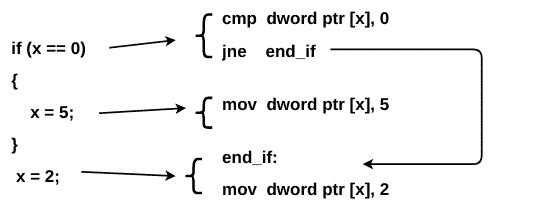

# 6.4 If-Else 语句

现在，大家一起看看`if/else`语句是如何转换为汇编语言的。我们以以下 C 代码为例：

```
if (x == 0) {
    x = 5;
}
else {
    x = 1;
}
```

在上述代码中，尝试确定在什么情况下会发生跳转（控制会被转移）。有两种情况：如果`x`不等于`0`，跳转到`else`块；或者，如果`x`等于`0`（`if x == 0`），那么在执行`x=5`（`if`块的结尾）后，将跳转到跳过`else`块，直接执行`else`块后的代码。

以下是该 C 程序的汇编语言翻译；请注意，在第一行中，`x`的值与`0`进行了比较，如果`x`不等于`0`（条件被反转，如前所述），将跳转到`else`块。在`else`块之前，请注意有一个无条件跳转到`end`。这个跳转确保了如果`x`等于`0`，执行完`if`块内的代码后，跳过`else`块并直接到达程序末尾：

```
cmp dword ptr [x], 0
jne else
mov dword ptr [x], 5
jmp end

else:
mov dword ptr [x], 1

end:
```

# 6.5 If-Elseif-Else 语句

以下是包含`if-ElseIf-else`语句的 C 代码：

```
if (x == 0) {
  x = 5;
}
else if (x == 1) {
  x = 6;
}
else {
  x = 7;
}
```

根据上述代码，尝试确定何时会发生跳转（控制转移）。有两个条件跳转点；如果`x`不等于`0`，将跳转到`else_if`块，如果`x`不等于`1`（这是`else if`中的条件检查），跳转将发生到`else`。此外，还有两个无条件跳转：在`if`块内`x=5`（`if`块结束时）和在`else if`内`x=6`（`else if`块结束时）。这两个无条件跳转跳过了`else`语句，直接到达程序末尾。

以下是显示条件跳转和无条件跳转的汇编语言翻译：

```
cmp dword ptr [ebp-4], 0
jnz else_if
mov dword ptr [ebp-4], 5
jmp short end

else_if:
 cmp dword ptr [ebp-4], 1
 jnz else
 mov dword ptr [ebp-4], 6
 jmp short end

else:
 mov dword ptr [ebp-4], 7
end:
```

# 6.6 汇编反汇编挑战

以下是程序的反汇编输出；让我们将以下代码转换为它的高级语言等效形式。运用你之前学到的技术和概念来解决这个挑战：

```
mov dword ptr [ebp-4], 1
cmp dword ptr [ebp-4], 0
jnz loc_40101C
mov eax, [ebp-4]
xor eax, 2
mov [ebp-4], eax
jmp loc_401025

loc_40101C:
 mov ecx, [ebp-4]
 xor ecx, 3
 mov [ebp-4], ecx

loc_401025:
```

# 6.7 反汇编解决方案

我们从为地址（`ebp-4`）分配符号名称开始。将符号名称分配给内存地址引用后，我们得到以下代码：

```
mov dword ptr [x], 1
cmp dword ptr [x], 0  ➊
jnz loc_40101C  ➋
mov eax, [x]  ➍
xor eax, 2
mov [x], eax
jmp loc_401025  ➌

loc_40101C:  
mov ecx, [x]  ➎
xor ecx, 3  
mov [x], ecx   ➏  

loc_401025:

```

在前面的代码中，注意 ➊ 和 ➋ 处的 `cmp` 和 `jnz` 指令（这是一个条件语句），并注意 `jnz` 与 `jne` 相同（`跳转如果不相等`）。既然我们已经确定了条件语句，让我们尝试确定这是什么类型的条件语句（`if`、`if/else`、`if/else if/else` 等等）；为此，请关注跳转。➋ 处的条件跳转跳转到 `loc_401010C`，而在 `loc_40101C` 之前，有一个无条件跳转到 `loc_401025`。根据我们之前学到的知识，这具备了 `if-else` 语句的特征。准确来说，➍ 到 ➌ 之间的代码是 `if` 块的一部分，而 ➎ 到 ➏ 之间的代码是 `else` 块的一部分。为了提高可读性，我们将 `loc_40101C` 重命名为 `else`，将 `loc_401025` 重命名为 `end`：

```
mov dword ptr [x], 1  ➐
cmp dword ptr [x], 0  ➊
jnz else  ➋
mov eax, [x]  ➍
xor eax, 2
mov [x], eax  ➑
jmp end  ➌

else:
mov ecx, [x]  ➎
xor ecx, 3
mov [x], ecx  ➏
end:
```

在前面的汇编代码中，`x` 在 ➐ 处被赋值为 `1`；`x` 的值与 `0` 比较，如果等于 `0`（➊ 和 ➋），则 `x` 与 `2` 做异或运算，并将结果存储回 `x`（➍ 到 ➑）。如果 `x` 不等于 `0`，则 `x` 与 `3` 做异或运算（➎ 到 ➏）。

阅读汇编代码有点复杂，因此让我们将前面的代码写成高级语言的等效代码。我们知道 ➊ 和 ➋ 是一个 `if` 语句，你可以将其理解为“如果 `x` 不等于 0，则跳转到 `else`” （记住 `jnz` 是 `jne` 的别名）。

如果你回想一下，观察 C 代码如何转换为汇编，条件在转换为汇编代码时被反转了。既然我们现在看到的是汇编代码，为了将这些语句写回到高级语言，你需要反转条件。为此，问问自己这个问题：在 ➋ 处，何时跳转不会发生？跳转不会发生的情况是当 `x` 等于 `0` 时，因此你可以将前面的代码写成伪代码，如下所示。请注意，在以下代码中，`cmp` 和 `jnz` 指令被转换为一个 `if` 语句；另外，注意条件是如何被反转的：

```
x = 1
if(x == 0)
{
  eax = x
  eax = eax ^ 2  ➒
  x = eax  ➒
} 
else {
 ecx = x
 ecx = ecx ^ 3  ➒
 x = ecx  ➒
}
```

现在我们已经确定了条件语句，接下来让我们将 `=` 操作符右侧的所有寄存器（在 ➒ 处）替换为它们对应的值。这样做之后，我们得到以下代码：

```
x = 1
if(x == 0)
{
  eax = x  ➓
  eax = x ^ 2  ➓
  x = x ^ 2
} 
else {
  ecx = x  ➓
  ecx = x ^ 3  ➓
  x = x ^ 3
}
```

移除所有包含在 `=` 操作符左侧的寄存器（在 ➓ 处），我们得到以下代码：

```
x = 1;
if(x == 0)
{
  x = x ^ 2;
} 
else {
  x = x ^ 3;
}
```

如果你感兴趣，下面是拆解挑战中使用的原始 C 程序，与你在前面的代码片段中看到的进行比较。正如你所见，我们能够将多行汇编代码还原回它们对应的高级语言代码。现在，相比直接阅读汇编代码，这段代码更容易理解：

```
int a = 1;
if (a == 0) 
{
    a = a ^ 2;
}
else {
    a = a ^ 3;
}
```

# 7. 循环

循环会执行一段代码，直到某个条件满足为止。最常见的两种循环类型是 `for` 和 `while`。到目前为止，你看到的跳转和条件跳转都是向前跳转，而循环是向后跳转的。首先，让我们理解 `for` 循环的功能。`for` 循环的一般形式如下所示：

```
for (initialization; condition; update_statement ) {
    block of code
}
```

这是 `for` 语句的工作原理。`initialization` 语句只执行一次，之后会评估 `condition`；如果条件为真，则执行 `for` 循环内部的代码块，然后执行 `update_statement`。

`while` 循环与 `for` 循环相同。在 `for` 循环中，`initialization`、`condition` 和 `update_statment` 一起指定，而在 `while` 循环中，`initialization` 与 `condition` 检查是分开的，并且 `update_statement` 在循环内部指定。`while` 循环的一般形式如下所示：

```
initialization
while (condition)
{
    block of code
    update_statement
}
```

让我们通过以下来自简单 C 程序的代码片段，了解循环在汇编级别是如何实现的：

```
int i;
for (i = 0; i < 5; i++) {
}
```

上述代码可以使用 `while` 循环来编写，如下所示：

```
int i = 0;
while (i < 5) { 
    i++;
}
```

我们知道，跳转用于实现条件和循环，因此让我们从跳转的角度来思考。在 `while` 和 `for` 循环中，我们试图确定所有会导致跳转的情况。在这两种情况下，当 `i` 大于或等于 `5` 时，跳转会发生，控制会转移到循环外（换句话说，跳到循环之后）。当 `i` 小于 `5` 时，`while` 循环内部的代码会执行，且在执行 `i++` 后会进行向后的跳转，以再次检查条件。

以下是前述代码在汇编语言中的实现方式（如下所示）。在下面的汇编代码中，在 ➊ 处，注意有一个跳转到某个地址（标记为 `while_start`）；这表示一个循环。在循环内部，条件在 ➋ 和 ➌ 通过使用 `cmp` 和 `jge`（如果大于或等于则跳转）指令进行检查；这里的代码在检查 `i` 是否大于或等于 `5`。如果满足该条件，则跳转到 `end`（跳出循环）。注意，在 ➌ 处，C 语言中的 `小于` (`<`) 条件通过 `jge` 指令被反转为 `大于或等于` (`>=`)。初始化在 ➍ 处进行，其中 `i` 被赋值为 `0`：

```
  mov [i],0  ➍

while_start:
  cmp [i], 5  ➋
  jge end  ➌
  mov eax, [i]
  add eax, 1
  mov [i], eax
  jmp while_start  ➊
end:
```

以下图显示了 C 编程语句和对应的汇编指令：

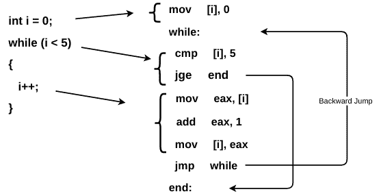

# 7.1 拆解挑战

让我们将以下代码转换为其高级等效代码。使用你到目前为止学到的技术和概念来解决这个挑战：

```
 mov dword ptr [ebp-8], 0
 mov dword ptr [ebp-4], 0

loc_401014:
 cmp dword ptr [ebp-4], 4
 cmp dword ptr [ebp-4], 4
 jge loc_40102E
 mov eax, [ebp-8]
 add eax, [ebp-4]
 mov [ebp-8], eax
 mov ecx, [ebp-4]
 add ecx, 1
 mov [ebp-4], ecx
 jmp loc_401014

loc_40102E:
```

# 7.2 反汇编解决方案

前面的代码包含两个内存地址（`ebp-4`和`ebp-8`）；我们将`ebp-4`重命名为`x`，将`ebp-8`重命名为`y`。修改后的代码如下所示：

```
 mov dword ptr [y], 1
 mov dword ptr [x], 0

loc_401014:
 cmp dword ptr [x], 4  ➋
 jge loc_40102E  ➌ 
 mov eax, [y]
 add eax, [x]
 mov [y], eax
 mov ecx, [x]  ➎
 add ecx, 1
 mov [x], ecx  ➏
 jmp loc_401014 ➊ 

loc_40102E:  ➍
```

在前面的代码中，在➊处，有一个跳转到`loc_401014`的操作，表示这是一个循环；因此，我们将`loc_401014`重命名为`loop`。在➋和➌处，检查变量`x`的条件（使用`cmp`和`jge`）；代码在检查`x`是否大于或等于`4`。如果条件成立，它将跳出循环，跳转到`loc_40102E`（在➍处）。`x`的值会增加`1`（从➎到➏），这就是更新语句。基于这些信息，可以推测`x`是控制循环的循环变量。现在，我们可以将前面的代码写成高级语言的等效代码；但为了做到这一点，记住我们需要将条件从`jge`（`大于或等于时跳转`）反转为`小于时跳转`。修改后的代码如下所示：

```
y = 1
x = 0
while (x<4) {
eax = y
eax = eax + x  ➐
y = eax  ➐
ecx = x
ecx = ecx + 1  ➐
x = ecx  ➐
}
```

将`=`运算符右侧的所有寄存器（在➐处）替换为它们之前的值，我们得到以下代码：

```
y = 1
x = 0
while (x<4) {
eax = y  ➑
eax = y + x  ➑
y = y + x
ecx = x  ➑
ecx = x + 1  ➑
x = x + 1
}
```

现在，去除所有在`=`符号左侧包含寄存器的条目（在➑处），我们得到以下代码：

```
y = 1;
x = 0;
while (x<4) {
y = y + x;
x = x + 1;
}
```

如果你感到好奇，以下是反汇编输出的原始 C 程序。比较我们之前确定的代码和下面来自原始程序的代码；注意到如何逆向工程并反编译反汇编输出到其原始等效代码：

```
int a = 1;
int i = 0;
while (i < 4) {
a = a + i;
i++;
}
```

# 8\. 函数

函数是一个执行特定任务的代码块；通常，程序包含许多函数。当调用一个函数时，控制权会转移到不同的内存地址。然后，CPU 执行该内存地址处的代码，并在代码执行完毕后返回（控制权转移回来）。函数包含多个组成部分：函数可以通过参数接收数据作为输入，具有包含执行代码的函数体，包含用于临时存储值的局部变量，并且可以输出数据。

参数、局部变量和函数控制流都存储在内存中的一个重要区域——*栈*。

# 8.1 栈

栈是操作系统在创建线程时分配的一块内存区域。栈是以 *后进先出（LIFO）* 的结构组织的，这意味着你压入栈中的最新数据将是第一个从栈中移除的数据。你通过使用 `push` 指令将数据（称为 *压栈*）压入栈中，使用 `pop` 指令从栈中移除数据（称为 *弹栈*）。`push` 指令将一个 *4 字节* 的值压入栈中，`pop` 指令从栈顶弹出一个 *4 字节* 的值。`push` 和 `pop` 指令的通用形式如下所示：

```
push source     ; pushes source on top of the stack
pop destination ; copies value from the top of the stack to the destination
```

栈是从高地址增长到低地址的。这意味着，当栈被创建时，`esp` 寄存器（也称为 *栈指针*）指向栈顶（高地址），随着你使用 `push` 指令将数据压入栈中，`esp` 寄存器会减少 `4`（`esp-4`）指向一个更低的地址。当你使用 `pop` 指令弹出一个值时，`esp` 会增加 `4`（`esp+4`）。让我们看看以下汇编代码，尝试理解栈的内部运作：

```
push 3
push 4
pop ebx
pop edx
```

在执行上述指令之前，`esp` 寄存器指向栈顶（例如，地址为 `0xff8c`），如图所示：


在执行第一条指令（`push 3`）后，`ESP` 被减去 `4`（因为 `push` 指令将一个 *4 字节* 的值压入栈中），并且值 `3` 被放入栈中；此时，`ESP` 指向栈顶，地址为 `0xff88`。执行第二条指令（`push 4`）后，`esp` 再次减去 `4`；此时，`esp` 的值为 `0xff84`，它现在是栈顶。当执行 `pop ebx` 时，栈顶的值 `4` 被移到 `ebx` 寄存器中，`esp` 增加了 `4`（因为 `pop` 从栈中移除一个 *4 字节* 的值）。因此，`esp` 此时指向栈顶，地址为 `0xff88`。同样地，当执行 `pop edx` 指令时，栈顶的值 `3` 被放入 `edx` 寄存器中，`esp` 返回到原来的位置 `0xff8c`：

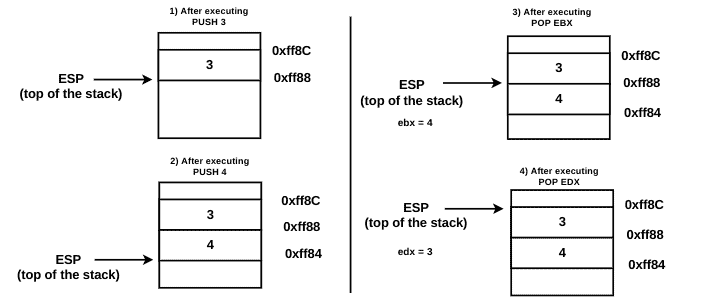

在上图中，虽然栈中的值从逻辑上被移除，但它们在内存中物理上仍然存在。而且，注意到最近压入的值（`4`）是第一个被移除的。

# 8.2 调用函数

汇编语言中的 `call` 指令可以用来调用一个函数。`call` 指令的通用形式如下所示：

```
call <some_function>
```

从代码分析的角度来看，可以将`some_function`视为一个包含代码块的地址。当执行`call`指令时，控制权转移到`some_function`（一个代码块），但在此之前，它会通过将下一个指令的地址（即`call <some_function>`后面的指令）推入堆栈来保存该地址。推入堆栈的`call`指令后的地址被称为*返回地址*。一旦`some_function`执行完毕，存储在堆栈上的返回地址会从堆栈中弹出，执行将从弹出的地址继续。

# 8.3 从函数返回

在汇编语言中，要从函数返回，使用`ret`指令。该指令从堆栈顶端弹出地址；弹出的地址会被放入`eip`寄存器中，然后控制权转移到该弹出的地址。

# 8.4 函数参数和返回值

在`x86`架构中，函数接受的参数会被推入堆栈中，返回值则放置在`eax`寄存器中。

为了理解这个函数，让我们以一个简单的 C 程序为例。当执行以下程序时，`main()`函数调用`test`函数并传递两个整数参数：`2`和`3`。在`test`函数内部，参数的值被复制到局部变量`x`和`y`中，并且`test`返回一个值`0`（`返回值`）：

```
int test(int a, int b)
{ 
    int x, y; 
    x = a; 
    y = b;        
    return 0;
}

int main()
{ 
   test(2, 3); 
   return 0; 
}
```

首先，让我们看看`main()`函数中的语句如何被翻译成汇编指令：

```
push 3  ➊
push 2  ➋
call test  ➌
add esp, 8 ; after test is exectued, the control is returned here
xor eax, eax
```

前三条指令，➊、➋和➌，表示函数调用`test(2,3)`。参数（`2`和`3`）在函数调用之前按反向顺序（从右到左）推入堆栈，第二个参数`3`在第一个参数`2`之前被推入堆栈。推送参数后，函数`test()`在➌处被调用；结果，下一个指令`add esp,8`的地址被推入堆栈（这就是*返回地址*），然后控制权转移到`test`函数的起始地址。假设在执行指令➊、➋、➌之前，`esp`（栈指针）指向堆栈顶部的地址`0xFE50`。以下图示展示了执行➊、➋、➌前后发生的情况：


现在，让我们聚焦于`test`函数，如下所示：

```
int test(int a, int b)
{ 
   int x, y; 
   x = a; 
   y = b;        
   return 0;
}
```

以下是`test`函数的汇编语言翻译：

```
push ebp  ➍
mov ebp, esp  ➎
sub esp, 8  ➑
mov eax, [ebp+8]
mov [ebp-4], eax
mov ecx, [ebp+0Ch]
mov [ebp-8], ecx
xor eax, eax  ➒
mov esp, ebp  ➏
pop ebp  ➐
ret  ➓
```

第一条指令➍将`ebp`（也叫*帧指针*）保存在堆栈中；这样做是为了在函数返回时能够恢复它。由于将`ebp`的值压入堆栈，`esp`寄存器将减少`4`。在下一条指令（➎）中，`esp`的值被复制到`ebp`中；因此，`esp`和`ebp`都指向堆栈的顶部，如下所示。从现在开始，`ebp`将保持在固定位置，应用程序将使用`ebp`来引用函数参数和局部变量：


通常你会在大多数函数的开始找到`push ebp`和`mov ebp, esp`这两条指令；这两条指令被称为*函数前导*。这些指令负责为函数设置环境。在➏和➐处，两个指令（`mov esp,ebp`和`pop ebp`）执行*函数前导*的逆操作。这些指令被称为*函数尾部*，它们在函数执行完毕后恢复环境。

在➑处，`sub esp,8`进一步减少了`esp`寄存器的值。这样做是为了为局部变量（`x`和`y`）分配空间。现在，堆栈看起来如下所示：

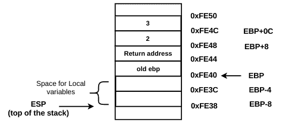

请注意，`ebp`仍然位于固定位置，函数参数可以通过从`ebp`的正偏移量来访问（`ebp + 某个值`）。局部变量可以通过从`ebp`的负偏移量来访问（`ebp - 某个值`）。例如，在上图中，第一个参数（`2`）可以通过地址`ebp+8`访问（即`a`的值），第二个参数可以通过地址`ebp+0xc`访问（即`b`的值）。局部变量可以通过地址`ebp-4`（局部变量`x`）和`ebp-8`（局部变量`y`）访问。

大多数编译器（如微软的 Visual C/C++编译器）使用基于固定`ebp`的堆栈帧来引用函数参数和局部变量。GNU 编译器（如 gcc）默认不使用基于`ebp`的堆栈帧，但它们使用一种不同的技术，其中使用`ESP`（堆栈指针）寄存器来引用函数参数和局部变量。

函数内部的实际代码位于➑和➏之间，如下所示：

```
mov eax, [ebp+8]
mov [ebp-4], eax
mov ecx, [ebp+0Ch]
mov [ebp-8], ecx
```

我们可以将参数`ebp+8`重命名为`a`，将`ebp+0Ch`重命名为`b`。地址`ebp-4`可以重命名为变量`x`，`ebp-8`重命名为变量`y`，如下所示：

```
mov eax, [a]
mov [x], eax
mov ecx, [b]
mov [y], ecx
```

使用前面讲解的技巧，以上语句可以翻译为以下伪代码：

```
x = a
y = b
```

在➒处，`xor eax,eax`将`eax`的值设置为`0`。这是返回值（`return 0`）。返回值总是存储在`eax`寄存器中。在➏和➐处的*函数尾部*指令恢复了函数环境。➏处的指令`mov esp,ebp`将`ebp`的值复制到`esp`中；结果，`esp`将指向`ebp`所指向的地址。➐处的`pop ebp`从栈中恢复旧的`ebp`；此操作后，`esp`将增加`4`。执行完➏和➐处的指令后，栈的状态如下所示：

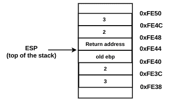

在➓处，当执行`ret`指令时，栈顶的返回地址被弹出并放入`eip`寄存器中。同时，控制转移到返回地址（即`main`函数中的`add esp,8`）。由于弹出了返回地址，`esp`增加了`4`。此时，控制从`test`函数返回到`main`函数。`main`中的指令`add esp,8`清理了栈，`esp`被恢复到其原始位置（地址`0xFE50`，即我们开始的地方），如下所示。此时，栈上的所有值从逻辑上被移除，尽管它们在物理上仍然存在。函数的工作原理就是如此：

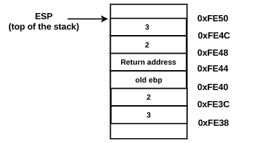

在之前的示例中，`main`函数调用了`test`函数，并通过将参数压入栈中（从右到左的顺序）传递给了`test`函数。`main`函数被称为*调用者*（或*调用函数*），而`test`是*被调用者*（或*被调用函数*）。`main`函数（调用者）在函数调用后，通过执行`add esp,8`指令清理栈。该指令的作用是移除压入栈中的参数，并将栈指针（`esp`）恢复到函数调用前的位置；这样的函数被认为使用了`cdecl`调用约定。调用约定决定了如何传递参数以及在被调用函数完成后，谁（*调用者*或*被调用者*）负责从栈中移除这些参数。大多数编译后的 C 程序通常遵循`cdecl`调用约定。在`cdecl`约定中，*调用者*将参数按从右到左的顺序压入栈中，且*调用者*在函数调用后负责清理栈。还有其他的调用约定，如`stdcall`和`fastcall`。在`stdcall`中，参数由*调用者*按从右到左的顺序压入栈中，且*被调用者*（*被调用函数*）负责清理栈。微软 Windows 利用`stdcall`约定来处理 DLL 文件导出的函数（API）。在`fastcall`调用约定中，前几个参数通过放入寄存器传递给函数，剩余的参数则按从右到左的顺序压入栈中，*被调用者*类似于`stdcall`约定负责清理栈。你通常会看到 64 位程序遵循`fastcall`调用约定。

# 9\. 数组与字符串

数组是由相同数据类型组成的列表。数组元素存储在内存中的连续位置，这使得访问数组元素变得非常方便。以下定义了一个包含三个元素的整数数组，数组的每个元素在内存中占用 4 个字节（因为一个整数是 4 个字节长）：

```
int nums[3] = {1, 2, 3}
```

数组名称`nums`是一个指向数组第一个元素的常量指针（也就是说，数组名称指向数组的`基地址`）。在高级语言中，访问数组元素时，你可以使用数组名称和`索引`。例如，你可以通过`nums[0]`访问第一个元素，通过`nums[1]`访问第二个元素，以此类推：

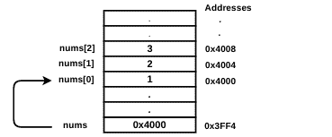

在汇编语言中，数组中任何元素的地址是通过三样东西计算得出的：

+   数组的基地址

+   元素的索引

+   数组中每个元素的大小

当你在高级语言中使用 `nums[0]` 时，它被翻译为 `[nums+0*<每个元素的字节大小>]`，其中 `0` 是索引，`nums` 表示数组的基址。从前面的例子中，你可以按如下方式访问整型数组的元素（每个元素的大小为 4 字节）：

```
nums[0] = [nums+0*4] = [0x4000+0*4] = [0x4000] = 1
nums[1] = [nums+1*4] = [0x4000+1*4] = [0x4004] = 2
nums[2] = [nums+2*4] = [0x4000+2*4] = [0x4008] = 3
```

`nums` 整型数组的一般形式可以表示如下：

```

nums[i] = nums+i*4
```

以下展示了访问数组元素的一般格式：

```
[base_address + index * size of element]
```

# 9.1 反汇编挑战

将以下代码翻译为其高级等价形式。使用你目前为止学到的技巧和概念来解决这个挑战：

```
push ebp
mov ebp, esp
sub esp, 14h
mov dword ptr [ebp-14h], 1
mov dword ptr [ebp-10h], 2
mov dword ptr [ebp-0Ch], 3
mov dword ptr [ebp-4], 0

loc_401022:
 cmp dword ptr [ebp-4], 3
 jge loc_40103D
 mov eax, [ebp-4]
 mov ecx, [ebp+eax*4-14h]
 mov [ebp-8], ecx
 mov edx, [ebp-4]
 add edx, 1
 mov [ebp-4], edx
 jmp loc_401022

loc_40103D:
 xor eax, eax
 mov esp, ebp
 pop ebp
 ret
```

# 9.2 反汇编解决方案

在前面的代码中，前两条指令（`push ebp` 和 `mov ebp, esp`）代表了*函数序言*。类似地，倒数第二条指令前的两行（`mov esp,ebp` 和 `pop ebp`）代表了*函数尾声*。我们知道，*函数序言*和*尾声*并不是代码的核心部分，但它们用于为函数设置环境，因此可以移除以简化代码。第三条指令，`sub,14h`，表明为局部变量分配了`20 (14h)`字节空间；我们知道，这条指令同样不是代码的一部分（它只是用于为局部变量分配空间），也可以忽略。去除这些不属于实际代码的指令后，我们得到以下内容：

```
1\. mov dword ptr [ebp-14h], 1
2\. mov dword ptr [ebp-10h], 2  ➐
3\. mov dword ptr [ebp-0Ch], 3  ➑ 
4\. mov dword ptr [ebp-4], 0  ➍

loc_401022:  ➋
5\. cmp dword ptr [ebp-4], 3  ➌
6\. jge loc_40103D  ➌
7\. mov eax, [ebp-4]
8\. mov ecx, [ebp+eax*4-14h]  ➏
9\. mov [ebp-8], ecx
10\. mov edx, [ebp-4]  ➎
11\. add edx, 1  ➎ 
12\. mov [ebp-4], edx  ➎
13\. jmp loc_401022  ➊

loc_40103D:
14\. xor eax, eax
15\. ret
```

在 ➊ 处的回退跳转到 `loc_401022` 表示循环，➊ 和 ➋ 之间的代码是循环的一部分。让我们来识别 `循环变量`、`循环初始化`、`条件检查` 和 `更新语句`。在 ➌ 处的两条指令是条件检查，它检查 `[ebp-4]` 的值是否 `大于或等于` `3`；当此条件满足时，跳转到循环外部。同样的变量 `[ebp-4]` 在 ➍ 处被初始化为 `0`，并在 ➎ 处使用指令进行递增。所有这些细节表明，`ebp-4` 是循环变量，因此我们可以将 `ebp-4` 重命名为 `i`（`ebp-4=i`）。

在 ➏ 处，指令 `[ebp+eax*4-14h]` 代表数组访问。我们来尝试识别数组的各个组成部分（`基址`、`索引`和每个元素的`大小`）。我们知道，局部变量（包括数组元素）是通过 `ebp-<某个值>`（即 `ebp` 的负偏移量）来访问的，因此我们可以将 `[ebp+eax*4-14h]` 重写为 `[ebp-14h+eax*4]`。这里，`ebp-14h` 表示数组在栈上的基址，`eax` 表示 `索引`，而 `4` 是数组每个元素的大小。由于 `ebp-14h` 是基址，意味着该地址也代表数组的第一个元素，如果我们假设数组名为 `val`，那么 `ebp-14h = val[0]`。

现在我们已经确定了数组的第一个元素，接下来让我们尝试找出其他元素。从数组表示法来看，在这种情况下，我们知道每个元素的大小是`4`字节。所以，如果`val[0] = ebp-14h`，那么`val[1]`应该位于下一个更高的地址，即`ebp-10h`，`val[2]`应该在`ebp-0Ch`，依此类推。注意到`ebp-10h`和`ebp-0Ch`在➐和➑处被引用。我们将`ebp-10h`重命名为`val[1]`，将`ebp-14h`重命名为`val[2]`。我们仍然没有弄清楚这个数组包含多少个元素。首先，让我们替换所有已确定的值，并将前面的代码写成高级语言等效的形式。最后两条指令`xor eax,eax`和`ret`可以写为`return 0`，所以伪代码现在如下所示：

```
val[0] = 1
val[1] = 2
val[2] = 3
i = 0
while (i<3) 
{
eax = i
ecx = [val+eax*4]  ➒
[ebp-8] = ecx  ➒
edx = i
edx = edx + 1  ➒
i = edx  ➒
}
return 0
```

在➒处，将所有在`=`运算符右侧的寄存器名称替换为其对应的值，我们将得到以下代码：

```
val[0] = 1
val[1] = 2
val[2] = 3
i = 0
while (i<3) 
{
eax = i  ➓
ecx = [val+i*4]  ➓
[ebp-8] = [val+i*4]
edx = i  ➓
edx = i + 1  ➓
i = i + 1
}
return 0
```

删除在➓处`=`运算符左侧包含寄存器名称的所有条目，我们得到以下代码：

```
val[0] = 1
val[1] = 2
val[2] = 3
i = 0
while (i<3) 
{
[ebp-8] = [val+i*4]
i = i + 1
}
return 0
```

从我们之前学到的知识，当我们使用`nums[0]`访问整数数组的元素时，它与`[nums+0*4]`是一样的，`nums[1]`与`[nums+1*4]`是一样的，这意味着`nums[i]`的一般形式可以表示为`[nums+i*4]`，也就是`nums[i] = [nums+i*4]`。根据这个逻辑，我们可以在前面的代码中将`[val+i*4]`替换为`val[i]`。

现在，我们在前面的代码中剩下了地址`ebp-8`；这可能是一个局部变量，也可能是数组`val[3]`的第四个元素（很难说）。如果我们假设它是局部变量，并将`ebp-8`重命名为`x`（`ebp-8=x`），那么得到的代码将如下所示。从以下代码中，我们可以看出，代码可能在循环遍历数组的每个元素（使用索引变量`i`），并将值分配给变量`x`。从代码中，我们还可以得出一个额外的信息：如果索引`i`被用来遍历数组的每个元素，那么我们可以猜测该数组可能包含三个元素（因为在退出循环之前，索引`i`的最大值为`2`）：

```
val[0] = 1
val[1] = 2
val[2] = 3
i = 0
while (i<3) 
{
x = val[i]
i = i + 1
}
return 0
```

如果将`ebp-8`视为局部变量`x`，不再将`ebp-8`视为数组的第四个元素（`ebp-8 = val[3]`），那么代码将转换为以下形式。现在，代码可以被不同地解释，即数组现在有四个元素，代码会遍历前三个元素。在每次迭代中，值被赋给第四个元素：

```
val[0] = 1
val[1] = 2
val[2] = 3
i = 0
while (i<3) 
{
val[3] = val[i]
i = i + 1
}
return 0
```

正如你从前面的例子中可能已经猜到的那样，通常无法准确地将汇编代码反编译回原始形式，因为编译器生成代码的方式（而且，代码可能没有所有所需的信息）。不过，这种技术应该有助于确定程序的功能。下面显示的是反汇编输出的原始 C 程序；注意我们之前确定的内容与这里的原始代码之间的相似性：

```
int main()
{
  int a[3] = { 1, 2, 3 };
  int b, i;
  i = 0;
   while (i < 3)
   { 
     b = a[i]; 
     i++;
   }
  return 0;
}
```

# 9.3 字符串

字符串是字符数组。当你定义一个字符串时，如下所示，会在每个字符串的末尾添加一个*空终止符*（*字符串终止符*）。每个元素占用 1 字节内存（换句话说，每个 ASCII 字符的长度是 1 字节）：

```
char *str = "Let"
```

字符串名`str`是一个指针变量，它指向字符串中的第一个字符（换句话说，它指向字符数组的基地址）。下图显示了这些字符在内存中的存储方式：


从前面的例子中，你可以访问字符数组（字符串）的元素，如下所示：

```
str[0] = [str+0] = [0x4000+0] = [0x4000] = L
str[1] = [str+1] = [0x4000+1] = [0x4001] = e
str[2] = [str+2] = [0x4000+2] = [0x4002] = t
```

字符数组的一般形式可以表示如下：

```
str[i] = [str+i]
```

# 9.3.1 字符串指令

x86 系列处理器提供了字符串指令，这些指令用于操作字符串。指令逐步遍历字符串（字符数组），并以`b`、`w`和`d`作为后缀，表示操作数据的大小（`1`、`2`或`4`字节）。字符串指令使用寄存器`eax`、`esi`和`edi`。寄存器`eax`，或其子寄存器`ax`和`al`，用于存储值。寄存器`esi`充当*源地址寄存器*（存储源字符串的地址），而`edi`是*目标地址寄存器*（存储目标字符串的地址）。

执行完字符串操作后，`esi`和`edi`寄存器会自动递增或递减（你可以将`esi`和`edi`视为源索引和目标索引寄存器）。`eflags`寄存器中的`方向标志（DF）`决定了`esi`和`edi`是否应该递增或递减。`cld`指令清除方向标志（`df=0`）；如果`df=0`，那么索引寄存器（`esi`和`edi`）会递增。`std`指令设置方向标志（`df=1`）；在这种情况下，`esi`和`edi`会递减。

# 9.3.2 从内存到内存的移动（movsx）

`movsx` 指令用于将一系列字节从一个内存位置移动到另一个位置。`movsb` 指令用于将 1 字节从由 `esi` 寄存器指定的地址复制到由 `edi` 寄存器指定的地址。`movsw, movsd` 指令将 2 字节和 4 字节从 `esi` 指定的地址复制到 `edi` 指定的地址。数据移动后，`esi` 和 `edi` 寄存器会根据数据项的大小，分别增加或减少 1、2 或 4 字节。在以下汇编代码中，假设标记为 `src` 的地址包含字符串 `"Good"`，并紧跟一个 *空字符终止符*（`0x0`）。在执行 ➊ 指令后，`esi` 将包含字符串 `"Good"` 的起始地址（换句话说，`esi` 将包含字符 `G` 的地址），而 ➋ 指令将设置 `EDI` 包含一个内存缓冲区（`dst`）的地址。执行 ➌ 指令时，将会把 1 字节（字符 `G`）从 `esi` 指定的地址复制到 `edi` 指定的地址。执行完 ➌ 指令后，`esi` 和 `edi` 都会增加 1，以指向下一个地址：

```
 ➊ lea esi,[src] ; "Good",0x0
 ➋ lea edi,[dst]
 ➌ movsb
```

以下截图将帮助你理解在执行 `movsb` 指令之前和之后发生了什么。若使用的是 `movsw` 而非 `movsb`，则会将 2 字节从 `src` 复制到 `dst`，同时 `esi` 和 `edi` 会各自增加 `2`：

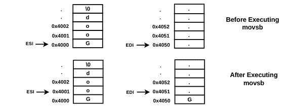

# 9.3.3 重复指令（rep）

`movsx` 指令只能复制 1、2 或 4 字节，但要复制多字节内容时，需配合 `rep` 指令和字符串指令使用。`rep` 指令依赖于 `ecx` 寄存器，并根据 `ecx` 寄存器指定的次数重复执行字符串指令。执行完 `rep` 指令后，`ecx` 的值会递减。以下汇编代码将字符串 `"Good"`（包括 *空字符终止符*）从 `src` 复制到 `dst`：

```
lea esi,[src] ; "Good",0x0
lea edi,[dst]
mov ecx,5
rep movsb
```

`rep` 指令与 `movsx` 指令一起使用时，相当于 C 编程中的 `memcpy()` 函数。`rep` 指令有多种形式，允许在执行循环时，根据条件提前终止。下表列出了不同形式的 `rep` 指令及其条件：

| 指令 | 条件 |
| --- | --- |
| `rep` | 重复直到 `ecx=0` |
| `repe, repz` | 重复直到 `ecx=0` 或 `ZF=0` |
| `repne, repnz` | 重复直到 `ecx=0` 或 `ZF=1` |

# 9.3.4 从寄存器存储值到内存（stosx）

`stosb`指令将一个字节从 CPU 的`al`寄存器移动到由`edi`指定的内存地址（*目标索引寄存器*）。同样，`stosw`和`stosd`指令将数据从`ax`（2 字节）和`eax`（4 字节）移动到由`edi`指定的地址。通常，`stosb`指令与`rep`指令一起使用，用于将缓冲区的所有字节初始化为某个值。以下汇编代码将目标缓冲区填充为`5`个双字（`dword`），所有值为`0`（换句话说，它将`5*4=20`字节的内存初始化为`0`）。当`stosb`与`rep`一起使用时，它相当于 C 编程中的`memset()`函数：

```
mov eax, 0
lea edi,[dest]
mov ecx,5
rep stosd
```

# 9.3.5 从内存加载到寄存器（lodsx）

`lodsb`指令将由`esi`指定的内存地址中的一个字节移到`al`寄存器中。同样，`lodsw`和`lodsd`指令将由`esi`指定的内存地址中的 2 个字节和 4 个字节数据分别移到`ax`和`eax`寄存器中。

# 9.3.6 扫描内存（scasx）

`scasb`指令用于在字节序列中搜索（或扫描）某个字节值的存在或不存在。要搜索的字节值放置在`al`寄存器中，内存地址（缓冲区）放置在`edi`寄存器中。`scasb`指令通常与`repne`指令一起使用（`repne scasb`），并将`ecx`设置为缓冲区的长度；这会逐个字节地检查，直到找到`al`寄存器中的指定字节，或者直到`ecx`变为`0`。

# 9.3.7 比较内存中的值（cmpsx）

`cmpsb`指令用于比较由`esi`指定的内存地址中的一个字节与由`edi`指定的内存地址中的一个字节，以确定它们是否包含相同的数据。`cmpsb`通常与`repe`（`repe cmpsb`）一起使用，用于比较两个内存缓冲区；在这种情况下，`ecx`将被设置为缓冲区的长度，比较会持续进行，直到`ecx=0`或者两个缓冲区不相等。

# 10. 结构体

结构体将不同类型的数据组合在一起；结构体的每个元素称为*成员*。结构体成员通过常量偏移量进行访问。为了理解这个概念，来看一下以下的 C 程序。`simpleStruct`定义包含三个不同数据类型的成员变量（`a`、`b` 和 `c`）。`main`函数在➊处定义了结构体变量（`test_stru`），并将结构体变量的地址（`&test_stru`）作为第一个参数在➋处传递给`update`函数。在`update`函数内部，成员变量被赋予了值：

```
struct simpleStruct
{
  int a;
  short int b;
  char c;
};

void update(struct simpleStruct *test_stru_ptr) {
 test_stru_ptr->a = 6;
 test_stru_ptr->b = 7;
 test_stru_ptr->c = 'A';
}

int main()
{
 struct simpleStruct test_stru;  ➊  
 update(&test_stru);  ➋
 return 0;
}
```

为了理解结构体成员是如何访问的，让我们来看一下`update`函数的反汇编输出。在➌位置，结构体的基地址被移动到`eax`寄存器中（记住，`ebp+8`表示第一个参数；在我们的例子中，第一个参数包含了`structure`的`base address`）。此时，`eax`寄存器包含了结构体的基地址。在➍位置，整数值`6`通过将偏移量`0`加到基地址上（`[eax+0]`，也就是`[eax]`）赋值给第一个成员。因为整数占用`4`字节，注意到在➎位置，`short int 值 7`（存储在`cx`寄存器中）通过将偏移量`4`加到基地址上赋值给第二个成员。类似地，`41h`（即`A`）的值在➏位置通过将偏移量`6`加到基地址上赋值给第三个成员：

```
push ebp
mov ebp, esp
mov eax, [ebp+8]  ➌
mov dword ptr [eax], 6  ➍
mov ecx, 7
mov [eax+4], cx  ➎
mov byte ptr [eax+6], 41h  ➏
mov esp,ebp
pop ebp
ret
```

从前面的例子可以看出，每个结构体成员都有自己的*偏移量*，并通过将*常量偏移量*加到*基地址*来访问；因此，通用形式可以写成如下：

`[base_address + constant_offset]`

结构体在内存中看起来与数组非常相似，但你需要记住一些要点来区分它们：

+   数组元素始终具有相同的数据类型，而结构体的成员不必具有相同的数据类型。

+   数组元素大多是通过相对于基地址的变量偏移量访问（例如，`[eax + ebx]` 或 `[eax+ebx*4]`），而结构体则大多是通过相对于基地址的常量偏移量访问（例如，`[eax+4]`）。

# 11. x64 架构

一旦你理解了 x86 架构的概念，就更容易理解 x64 架构了。x64 架构是作为 x86 的扩展设计的，与 x86 的指令集非常相似，但从代码分析的角度看，仍然有一些你需要注意的区别。本节涵盖了一些 x64 架构的差异：

+   第一个区别是，32 位（4 字节）通用寄存器`eax`、`ebx`、`ecx`、`edx`、`esi`、`edi`、`ebp`和`esp`被扩展为 64 位（8 字节）；这些寄存器被命名为`rax`、`rbx`、`rcx`、`rdx`、`rsi`、`rdi`、`rbp`和`rsp`。新增的八个寄存器命名为`r8`、`r9`、`r10`、`r11`、`r12`、`r13`、`r14`和`r15`。如你所料，程序可以将寄存器访问为 64 位（`RAX`、`RBX`等）、32 位（`eax`、`ebx`等）、16 位（`ax`、`bx`等）或 8 位（`al`、`bl`等）。例如，你可以将`RAX`寄存器的下半部分访问为`EAX`，并将最底层的字访问为`AX`。你可以通过在寄存器名称后附加`b`、`w`、`d`或`q`来访问寄存器`r8-r15`的字节、字、双字或四字。

+   x64 架构可以处理 64 位（8 字节）数据，所有的地址和指针都是 64 位（8 字节）大小。

+   x64 CPU 具有一个 64 位的指令指针`(rip)`，它包含下一条将执行的指令的地址，并且还具有一个 64 位的标志寄存器`(rflags)`，但目前只使用低 32 位`(eflags)`。

+   x64 架构支持`rip-relative`寻址。现在可以使用`rip`寄存器来引用内存位置；也就是说，你可以访问当前*指令指针*偏移一定量的数据。

+   另一个主要的区别是，在 x86 架构中，函数参数是按之前提到的方式推送到栈上的，而在 x64 架构中，前四个参数通过`rcx`、`rdx`、`r8`和`r9`寄存器传递，如果程序包含额外的参数，它们则存储在栈上。我们来看一个简单的 C 代码示例（`printf`函数）；该函数有六个参数：

```
printf("%d %d %d %d %d", 1, 2, 3, 4, 5);
```

以下是为 32 位（x86）处理器编译的 C 代码的反汇编；在这种情况下，所有参数都按逆序推送到栈上，在调用`printf`后，使用`add esp,18h`来清理栈。因此，很容易判断`printf`函数有六个参数：

```
push 5
push 4
push 3
push 2
push 1
push offset Format ; "%d %d %d %d %d"
call ds:printf
add esp, 18h
```

以下是为 64 位（x64）处理器编译的 C 代码的反汇编。第一个指令，在➊位置，分配了`0x38`（即 56 字节）空间到栈上。第一个、第二个、第三个和第四个参数存储在`rcx`、`rdx`、`r8`和`r9`寄存器中（在调用`printf`之前），分别位于➋、➌、➍、➎。第五个和第六个参数存储在栈上（在分配的空间中），使用的指令位于➏和➐。在此情况下，没有使用`push`指令，因此很难判断内存地址是*局部变量*还是函数的*参数*。在此情况下，格式字符串有助于确定传递给`printf`函数的参数数量，但在其他情况下则不容易：

```
sub rsp, 38h  ➊ 
mov dword ptr [rsp+28h], 5  ➐
mov dword ptr [rsp+20h], 4  ➏
mov r9d, 3  ➎
mov r8d, 2  ➍
mov edx, 1  ➌
lea rcx, Format ; "%d %d %d %d %d"  ➋
call cs:printf
```

英特尔 64 位（x64）和 IA-32（x86）架构包含许多指令。如果你遇到本章没有涉及的汇编指令，可以从[`software.intel.com/en-us/articles/intel-sdm`](https://software.intel.com/en-us/articles/intel-sdm)下载最新的英特尔架构手册，指令集参考（*卷 2A、2B、2C 和 2D*）可以从[`software.intel.com/sites/default/files/managed/a4/60/325383-sdm-vol-2abcd.pdf`](https://software.intel.com/sites/default/files/managed/a4/60/325383-sdm-vol-2abcd.pdf)下载。

# 11.1 分析 64 位 Windows 上的 32 位可执行文件

64 位 Windows 操作系统可以运行 32 位可执行文件；为此，Windows 开发了一个名为*WOW64*（Windows 32 位在 Windows 64 位上的子系统）的子系统。WOW64 子系统允许在 64 位 Windows 上执行 32 位二进制文件。当你运行一个可执行文件时，它需要加载 DLL 以调用 API 函数与系统进行交互。32 位可执行文件不能加载 64 位 DLL（而 64 位进程也不能加载 32 位 DLL），因此微软为 32 位和 64 位分别提供了不同的 DLL。64 位二进制文件存储在`\Windows\system32`目录下，而 32 位二进制文件存储在`\Windows\Syswow64`目录下。

32 位应用程序在 64 位 Windows（Wow64）下运行时，可能表现与在本机 32 位 Windows 上的行为不同。当你在 64 位 Windows 上分析 32 位恶意软件时，如果你发现恶意软件访问了`system32`目录，实际上它是在访问`syswow64`目录（操作系统会自动将其重定向到`Syswow64`目录）。如果一个 32 位恶意软件（在 64 位 Windows 上执行时）在`\Windows\system32`目录写入文件，那么你需要检查`\Windows\Syswow64`目录中的文件。类似地，访问`%windir%\regedit.exe`会被重定向到`%windir%\SysWOW64\regedit.exe`。这种行为差异可能会在分析时造成混淆，因此理解这种差异非常重要，为了避免混淆，最好在 32 位 Windows 环境中分析 32 位二进制文件。

要了解 WOW64 子系统如何影响你的分析，请参考*The WOW-Effect* by Christian Wojner ([`www.cert.at/static/downloads/papers/cert.at-the_wow_effect.pdf`](http://www.cert.at/static/downloads/papers/cert.at-the_wow_effect.pdf))

# 12\. 额外资源

以下是一些额外的资源，帮助你更深入地了解 C 编程、x86 和 x64 汇编语言编程：

+   *学习 C 语言:* [`www.programiz.com/c-programming`](https://www.programiz.com/c-programming)

+   Greg Perry 和 Dean Miller 的*C 编程绝对初学者指南*

+   *x86 汇编编程教程*：[`www.tutorialspoint.com/assembly_programming/`](https://www.tutorialspoint.com/assembly_programming/)

+   保罗·卡特博士的*PC 汇编语言*：[`pacman128.github.io/pcasm/`](http://pacman128.github.io/pcasm/)

+   *Intel x86 简介 - 架构、汇编、应用程序和修辞*: [`opensecuritytraining.info/IntroX86.html`](http://opensecuritytraining.info/IntroX86.html)

+   Jeff Duntemann 的*汇编语言逐步学习*

+   Ray Seyfarth 的*64 位 Windows 汇编编程入门*

+   *x86 反汇编*：[`en.wikibooks.org/wiki/X86_Disassembly`](https://en.wikibooks.org/wiki/X86_Disassembly)

# 13\. 总结

在本章中，你学习了理解和解释汇编代码所需的概念和技巧。本章还强调了 x32 和 x64 架构之间的关键区别。你在本章中学习的反汇编和反编译（静态代码分析）技巧将帮助你更深入地理解恶意代码如何在底层运行。在下一章，我们将介绍代码分析工具（反汇编器和调试器），你将学习这些工具提供的各种功能如何简化你的分析，并帮助你检查与恶意二进制文件相关的代码。
