# 第四章 攻击移动应用程序流量

在本章中，我们将涵盖以下主题：

+   为移动设备设置无线渗透测试实验室

+   配置 Android 中的流量拦截

+   使用 Burp Suite 和 Wireshark 拦截流量

+   使用 MITM 代理修改和攻击

+   配置 iOS 中的流量拦截

+   分析 iOS 应用程序流量并提取敏感信息

+   对移动应用程序的 WebKit 攻击

+   通过证书操作执行 SSL 流量拦截

+   使用移动配置文件在 iOS 设备中设置 VPN 并拦截流量

+   绕过 Android 和 iOS 中的 SSL 证书验证

# 简介

移动应用程序架构涉及移动设备上运行的应用程序（`.apk`、`.ipa` 等）与服务器端应用程序组件之间的通信，业务逻辑驻留在其中。此通信通过 HTTP、GPRS、USSD、SMS 等各种通道进行。通信渠道对攻击者开放，因此，通信安全或数据传输安全变得重要。

本章重点是攻击移动应用程序流量。为了简化起见，我们选择了后续配方中的 HTTP 通信层。敏感的移动应用程序已经实现了 SSL 以实现保密性，但我们将在后续的配方中了解到 SSL 流量也可以被攻击。

# 为移动设备设置无线渗透测试实验室

让我们开始为移动设备的无线渗透测试设置实验室。为了能够嗅探移动设备发出的流量，我们需要了解移动应用程序如何通信，即通信渠道是什么？移动设备如何发送 HTTP 或 HTTPS 请求？

移动应用程序的 HTTP/HTTPS 流量通过 GPRS 或 Wi-Fi 通道流动。无论使用哪种通道，我们都需要设置一个实验室来嗅探空中的流量。GPRS 嗅探需要特定的硬件设备，并且周围有各种黑客技术可以完成剩下的工作。请注意，某些国家禁止对 GPRS（电信）流量进行拦截。我们将专注于设置 Wi-Fi 通道的实验室。

## 准备工作

我们需要一个连接到互联网的 Wi-Fi 网络（无线接入点）。我们需要运行目标应用程序的移动设备，其流量将被嗅探。我们还需要一台安装了任何代理工具的笔记本电脑（或计算机）。

### 注意事项

注意，移动设备和笔记本电脑都应该有无线网卡；它们应该能够连接到 Wi-Fi 网络并参与 HTTP 通信。

## 如何实现…

设置无线渗透测试实验室的步骤如下：

1.  设置无线网络并确保 Wi-Fi 网络正在广播，并且 SSID 可供连接各种 Wi-Fi 设备使用。

1.  将您的移动设备连接到 Wi-Fi 网络。

1.  浏览特定应用程序以验证应用程序通信是否正常工作。

1.  现在，在笔记本电脑中安装一个网络代理工具，如 Burp Suite 或 Fiddler。将这台笔记本电脑也连接到相同的 Wi-Fi 网络。这个设置应该如下图所示：

## 它是如何工作的...

移动应用的常规通信路径是：**移动设备** | **无线接入点** | **服务器**（通过互联网）。在下图中，这条路径为`1` | `4`：

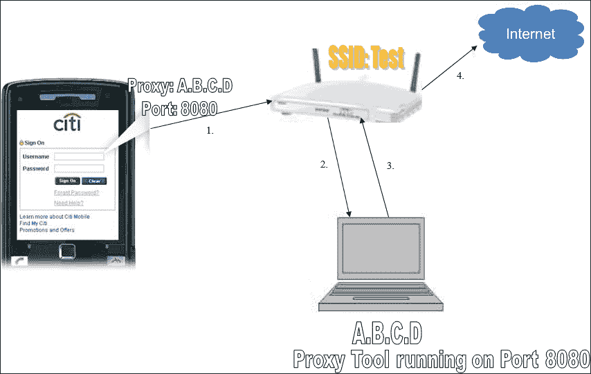

无线渗透测试实验室的设计是在常规的通信路径**1**到**4**之间插入**2**和**3**步骤（请参考前面的图表了解步骤）。

移动设备被配置为设置 Wi-Fi 网络的网络代理，因此我们将流量强制通过**2**步骤。现在我们在代理机器上运行代理工具；该代理工具能够在将流量通过**3**步骤转发到无线接入点之前，查看并编辑移动应用的流量。之后，常规的**4**步骤用于与服务器的通信。

通过这种方式，建立了一个用于渗透测试的无线实验室环境。在这里，移动应用的流量可以被篡改以绕过业务逻辑。即便是 SSL 应用的流量，也可以通过这种方式进行修改。接下来的教程中我们将会看到这一点。

## 还有更多...

使用移动电话的替代方案是使用模拟器。使用模拟器时，实验室的要求进一步简化。相同的机器可以同时运行模拟器和代理工具，并在流量到达服务器之前进行编辑。因此，在同一台笔记本电脑中拥有模拟器、ADB 和代理工具也是移动无线渗透测试实验室的必要要求。然而，请注意，对于一些生产环境的应用，无法在模拟器中进行测试。我们曾看到银行应用中的短信激活步骤是无法在模拟器中工作的原因之一。这个问题可以通过与应用开发人员的合作来绕过。进行黑盒渗透测试时，这样的选项是不可用的。

在一个特定的案例中，我们遇到了一款绑定到特定电信 3G 网络的移动应用，且无法在 Wi-Fi 或其他运营商的 3G 网络上运行。

这需要稍微不同的实验室配置。在前面的图中，我们将无线接入点替换为一个支持 3G 和 Wi-Fi 的设备。该设备用于创建热点，从而提供无线网络，最终通过该设备的 3G 连接到服务器。因此，拦截设置的**1**、**2**和**3**步骤保持不变。在**4**步骤中，我们没有使用有线网络，而是通过 3G 通道连接到服务器。

## 另见

+   *配置 iOS 的流量拦截*

+   [`www.blackhat.com/presentations/bh-dc-08/Steve-DHulton/Whitepaper/bh-dc-08-steve-dhulton-WP.pdf`](https://www.blackhat.com/presentations/bh-dc-08/Steve-DHulton/Whitepaper/bh-dc-08-steve-dhulton-WP.pdf)

# 配置 Android 流量拦截

在之前的教程中，我们学会了如何为移动设备拦截创建渗透测试实验室，其中提到我们需要配置移动设备，强制执行步骤 **2** 来跟随网络代理。在本教程中，让我们学习如何在 Android 手机上实现这一过程。

## 准备工作

一部 Android 手机。移动应用程序需要一部已 root 的手机。（我们在 第一章 的 *“Root 和越狱简介”* 中学到了 root 技巧，*移动安全简介*）

像 ProxyDroid 这样的 Android 代理工具可以从 Play 商店下载。

## 如何操作...

对于基于 WAP 的应用程序（即在 Android 浏览器中运行的应用程序），设置流量拦截非常简单。为此，进入 Wi-Fi 设置，选择你希望连接的 **Wi-Fi**，然后在 **高级选项**下可以看到 **代理设置**。选择 **代理设置** 为 **手动**，然后配置 **代理主机名**/**IP 地址**，**代理端口** 等信息。以下截图也展示了这一过程：

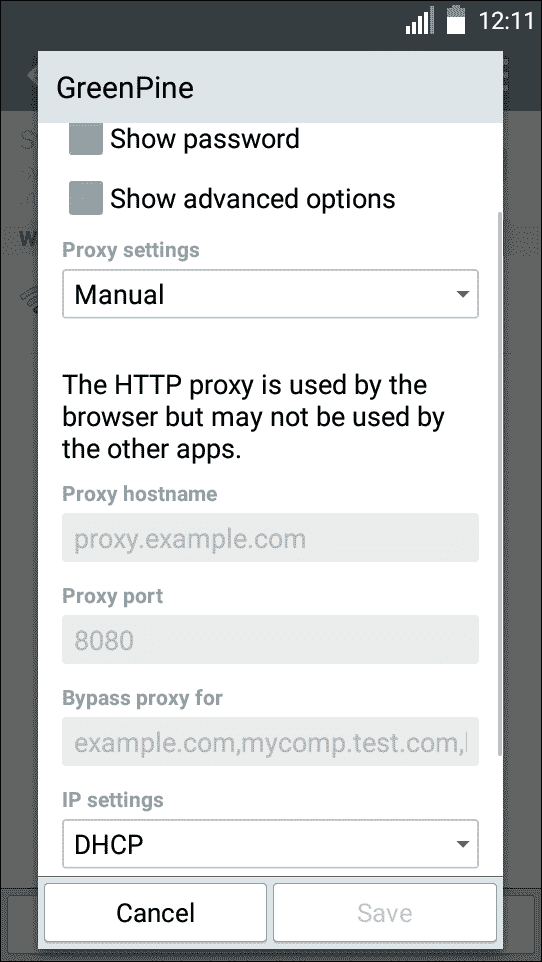

虽然前述方法适用于 WAP 应用程序，但它不适用于下载并安装的应用程序（即原生应用和混合应用）。对于这些应用程序，我们需要在手机上安装 Android 代理工具。ProxyDroid 就是其中一款工具，可以从 Google Play 商店免费下载。这些工具的代理设置仅在已 root 的手机上有效。所以，使用第三方代理工具的代理顺序如下：

1.  对你的 Android 设备进行 root。

1.  安装诸如 **ProxyDroid** 或 **Autoproxy lite** 等代理工具。

1.  配置代理工具。

前两个步骤你已经了解了。第三步如图所示：

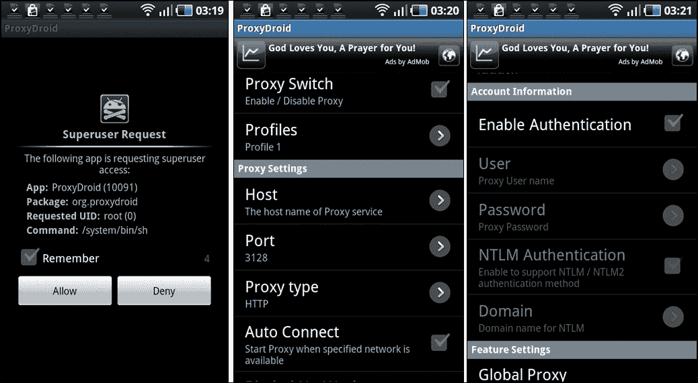

ProxyDroid 需要超级用户权限，以便能够设置代理。进入下一步，启用 **代理开关**，配置 **主机名**、**端口** 等。最后，如果代理需要身份验证，可以提供身份验证凭据。由于代理由我们控制，我们希望保持简单，不配置身份验证，以便进行无缝测试。

## 它是如何工作的...

Android 操作系统基于 Linux 构建。Linux 使用路由表来通过网络路由数据包。因此，我们需要修改 Android 中的路由表条目，以便将数据包路由到我们愿意拦截的网络代理。

由于无法访问底层组件（如路由表），因此我们需要对手机进行 root，使得代理工具能够在操作系统上获得超级用户权限。这样，根目录手机上的代理工具可以根据用户提供的代理设置覆盖路由表。

## 还有更多...

使用 Android 模拟器时，可以使用 ADB 工具设置代理。模拟器和 Web 代理工具可以在同一台机器上运行。使用以下命令启动模拟器，并将本地代理设置为端口 `7000`：

```
**emulator.exe -avd <name> -http-proxy 127.0.0.1:7000**

```

## 另见

+   *使用 Burp Suite 和 Wireshark 拦截流量*

+   https://play.google.com/store/apps/details?id=org.proxydroid&hl=en

+   https://play.google.com/store/apps/details?id=com.mgranja.autoproxy_lite&hl=en

# 使用 Burp Suite 和 Wireshark 拦截流量

流量拦截是设置代理后需要进行的下一个目标。流量拦截为应用程序攻击提供了另一层攻击面。在这个配方中，我们将学习如何设置流量拦截，而下一个配方将讨论如何通过代理拦截流量来攻击应用程序。

拦截或嗅探流量的两种主要工具是 Web 代理工具（如 Burp Suite 或 Charles Proxy）和网络嗅探工具（如 Wireshark 或 Android 上的 Shark for Root）。Burp Suite 将自己插入到通信中（暂停、修改并转发），而 Shark for Root 则嗅探网络数据包（支持 Wi-Fi 或 3G）。

## 准备工作

要拦截移动设备流量，请按照前两个配方中描述的设置实验室和工具。另请从 Play 商店下载并安装 **Shark**。

## 如何操作...

以下是使用 Burp Suite 和 Shark for Root 分别进行设置时需要遵循的步骤：

**Burp Suite**

1.  按照 *为移动设备设置无线渗透测试实验室* 配方中描述的步骤，设置无线渗透测试实验室。此时，Burp Suite（Burp Proxy）应当在你的笔记本电脑上运行，并监听默认端口 `8080`。

1.  现在配置 Android 手机，将流量路由到你笔记本电脑上运行的 Burp Proxy（可以参考之前的配置方法）。确保 IP 地址、端口等配置正确。现在你可以看到被拦截的流量并进行篡改。让我们将恶意活动留到下一个配方中。

**Shark for Root**

与 Android 上的代理工具类似，Shark for Root 也需要超级用户权限。它需要在已 Root 的手机上运行，并且需要允许创建数据包转储。此步骤显示在下面的截图中：

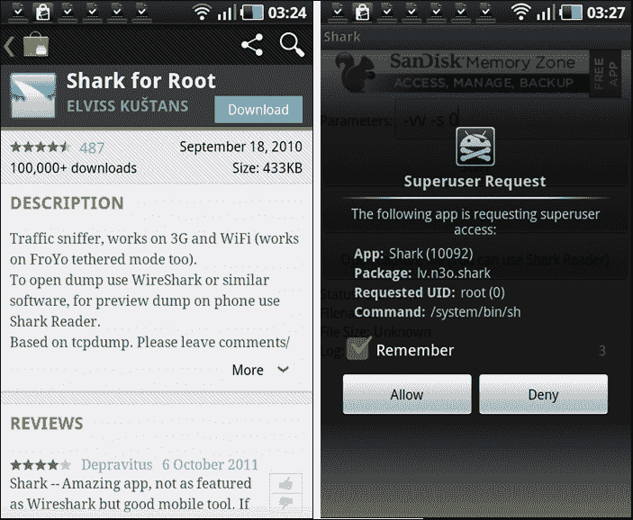

最后，设置捕获流量的参数。Shark for Root 会将所有数据包转储到 `.pcap` 文件中，正如你在下图中所看到的，表示 `pcap` 转储已经开始。右侧的截图显示了 `.pcap` 文件在手机中创建并存储的路径：

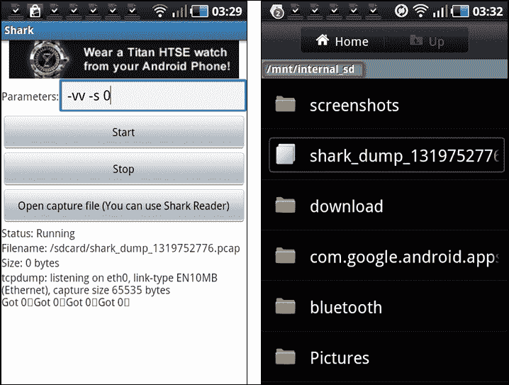

`.pcap` 文件可以转移到计算机上，并通过 Wireshark 进行更好的解析。

## 它是如何工作的...

网络代理（或 Burp Suite）的工作原理很简单。它像中间人一样插入网络路径，监听或修改流量。

Shark for Root 通过在底层操作系统上获取超级用户权限并访问网络文件来工作；因此，它能够嗅探数据包并创建数据包转储。

## 还有更多...

Shark for Root 创建的数据包转储（.pcap）文件在分析网络上传输的数据包类型方面非常有用。有时，Web 代理无法捕获流量。造成这种情况的原因可能是特定的 SSL 证书捆绑到移动应用程序中，或者使用特定的 TCP 数据包或协议（不一定是 HTTP）。在代理工具失败时，Shark for Root 可以帮助理解失败原因，从而为拦截和故障排除提供进一步方向。

## 参见

+   *使用 MITM 代理进行修改和攻击*

+   [`portswigger.net/burp/`](https://portswigger.net/burp/)

+   [`play.google.com/store/apps/details?id=lv.n3o.shark&hl=en`](https://play.google.com/store/apps/details?id=lv.n3o.shark&hl=en)

# 使用 MITM 代理进行修改和攻击

Burp Suite 被设置为**中间人攻击**（**MITM**）代理。中间人攻击者控制着双方交换的每一笔交易（请求和响应），即手机上的移动应用程序和存放业务逻辑的移动服务器之间的交换。

使用 MITM 代理攻击应用程序的业务逻辑，比如尝试绕过 1000 美元的转账限制，通过进行更高金额的交易；还可以尝试特定工作流程，如绕过一次性密码。MITM 代理还可以用于通过访问对象或修改参数值来获取应用程序中的特权访问以提供特权内容。

## 准备工作

要拦截移动流量，请按照本章中先前的步骤设置实验室和工具。完成后，您的 Burp Suite 已经准备好进行修改和攻击。

## 如何操作...

让我们来看一个业务案例，并采用*修改和攻击*方法。所有移动银行应用程序都允许查看自有银行账户余额的基本功能。让我们攻击这个功能以查看其他用户账户的余额：

1.  首先，选择一个移动银行应用程序。

1.  登录并转到查看余额功能；该应用程序允许您选择其中一个自有账户，随后向服务器发送请求请求用户余额。此请求在 Burp 代理中被拦截，如下所示：

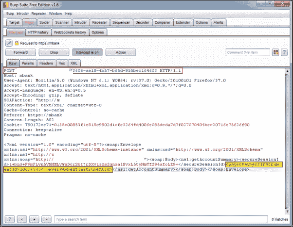

注意截图中突出显示的`Payment Instrument Id`。该参数值被篡改为另一个值，如`10001856`，导致显示不属于已登录用户的账户余额。不幸的是，由于这是一个实时的移动银行应用程序，我们无法向您展示更多应用程序截图。

这样，MITM 代理用于修改和攻击应用程序中的参数。

## 工作原理...

MITM 代理药物攻击是针对服务器端应用程序逻辑的。由于代理充当中间人，它可以完全控制正在传输的数据。选择可能导致响应数据的参数，并对其进行修改以实现应用程序中不允许的功能。

在这种特殊情况下，为每个用户分配了一个唯一的会话令牌，但应用程序未验证请求的参数值（`支付工具 ID`）是否不属于已登录用户。因此，它显示其他客户的账户余额，允许绕过业务逻辑验证。

这种 MITM 代理对应用程序逻辑进行了各种臭名昭著的攻击。关键是选择正确的变量进行操作，有时可能会耗费时间。

## 还有更多...

我们只能讨论一个案例。通过这种 MITM 修改和攻击方法可以实现更多。考虑一下应用程序功能和验证，然后决定使用这种方法攻击哪一个。

对于移动银行应用程序，以下是您可以尝试的可能攻击的指示性列表：

+   查看他人的账户余额

+   查看他人的交易历史记录

+   从其他用户的账户中转账

+   将资金转账给未添加为受益人的人

+   在其他用户的账户中注册或注销信用卡

+   在其他用户的账户中注册或注销账单支付者

同样，在涉及多个角色（用户、经理和管理员）的应用程序中，您可能希望玩弄负责提供特权内容的请求变量。如果成功，用户可以获得经理或管理员的访问权限，从而成功进行特权升级攻击。

## 参见

+   *分析 iOS 应用程序流量并提取敏感信息*

# 配置 iOS 的流量拦截

移动设备拦截的渗透测试实验室是在本章的*为移动设备设置无线渗透测试实验室*配方中构想的。我们必须配置 iOS 设备以强制第 2 步（在第一个配方中描述）遵循网络代理。让我们在这个配方中学习如何在 iOS 设备中做到这一点。

## 准备就绪

需要 iOS 设备，以及实验室设置的其他必需品，如 Wi-Fi 网络和带有网络代理工具的笔记本电脑（如本章第一个配方中讨论的）。

## 如何做...

iOS 为 iDevice 用户提供了代理作为一个功能。这使得用户或攻击者可以很容易地为 iOS 应用程序设置流量拦截。设备代理设置是全局的，也适用于应用程序。

可以通过在 iPhone 或 iPad 上导航到设置来配置设置。

为此，进入 Wi-Fi 设置，选择要连接的 Wi-Fi；在高级选项下可以看到**代理设置**。在**HTTP 代理**下选择**手动**以配置代理主机名/IP 地址、代理端口号等。如下截图所示：

## 工作原理...

iOS 提供了一个设置代理的功能，用户可以设置网络代理并捕获流量。这在 Android 中比较复杂，因为代理功能本身不是默认存在的。在 iOS 中，代理作为一个功能的存在使得它更加直接。

## 更多内容...

对于可以在 iOS 模拟器上运行的 iOS 应用程序和 Xcode 项目，可以设置代理。Xcode 和 iOS 模拟器运行在 Mac OS X 上。我们可以在 MacBook 上设置全局代理设置。在 Wi-Fi 设置中，对于连接的 Wi-Fi 网络，导航至**代理**和**Web 代理（HTTP）**。在那里，设置本地代理（`127.0.0.1`）并提供代理端口（Burp Proxy 的`8080`）。如下截图所示，这将确保 iOS 模拟器的流量通过运行在同一台机器上的代理工具发送到服务器：

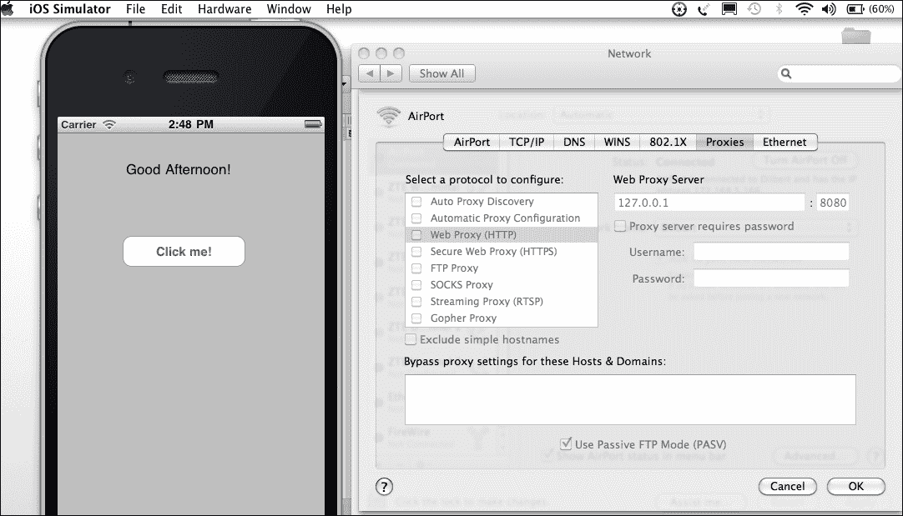

## 另请参阅

+   [`www.charlesproxy.com/documentation/faqs/using-charles-from-an-iphone/`](http://www.charlesproxy.com/documentation/faqs/using-charles-from-an-iphone/)

# 分析流量并从 iOS 应用程序流量中提取敏感信息

当拦截设置准备就绪时，流量分析已经开始。从流量中提取敏感信息是最困难的任务，或者说是找到可以帮助进一步提取敏感信息的 HTTP 请求和变量。

让我们以一款 iOS 应用为例。首先分析流量，然后看如何提取敏感信息。

## 准备工作

拦截 iOS 应用程序流量，按照前面的步骤设置实验室和工具。完成后，代理工具（Charles Proxy）已准备好拦截流量。

## 如何操作...

1.  登录移动应用程序，如下截图所示。为正确的用户名输入错误的密码：请注意，登录请求已发送并收到响应。

1.  密切监视响应流量。对于密码错误，响应中会显示`ERR_PWD`文本，如下截图所示：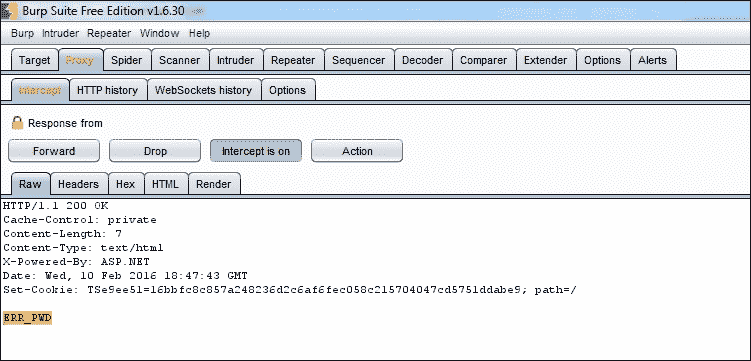

1.  这将导致 iPhone 屏幕上显示错误响应，如下截图所示：

1.  现在尝试使用正确的用户名和密码登录应用程序。注意登录请求的响应。响应中包含文本`SUCCESS_LOGIN`，如下截图所示。此操作将显示移动应用程序的内部屏幕：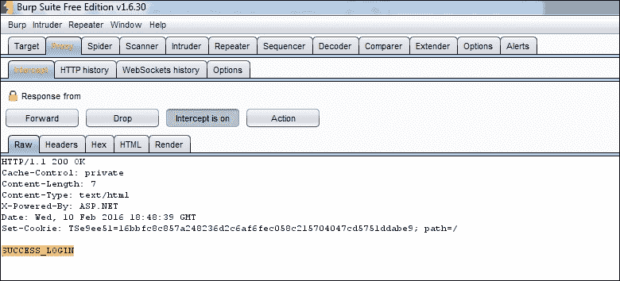

对 iOS 应用程序流量的分析显示了两种情况下响应的差异。现在让我们尝试将一种情况的响应粘贴到另一种情况中。

当我们用错误的密码登录时，我们会在响应中得到`ERR_PWD`。现在，通过 Charles Proxy 工具，将响应中的`ERR_PWD`操纵为`SUCCESS_LOGIN`，并将响应从 Charles 转发。这样做会将用户登录到应用程序中，并在 iPhone 上显示内部应用程序屏幕。这样，我们通过错误的密码从 iOS 应用程序中获取了敏感信息。

## 还有更多...

应用程序流量揭示敏感信息的可能性是多种多样的。另一个值得一提的案例是，当我们发现一个 iPad 应用程序发送一个包含用户名、密码和**唯一设备标识符**（**UDID**）号码的请求时。该应用程序试图实现用户仅能在特定 iPad 上登录，以便同一用户无法从其他 iPad 登录。

我们可以通过篡改另一台 iPad 的 UDID 号码到前一台 iPad 的出站请求中，绕过这一点，并从另一台 iPad 登录相同的用户。这样，应用程序的 iPad 绑定被证明是无用的。

根据应用程序功能和流量分析，可以尝试和绕过许多事情。

## 参见

+   *使用 MITM 代理进行修改和攻击*

# 针对移动应用程序的 WebKit 攻击

Safari 和其他移动应用程序使用**WebKit**。它是一个 Web 浏览器引擎。它为实现的应用程序提供浏览器功能。大多数混合移动应用程序使用 WebKit 来调用浏览器组件，并使其对应用程序用户进行无缝集成。

基于 WebKit 的移动应用程序攻击类似于基于 Web 应用程序浏览器的攻击。**跨站脚本**（**XSS**）或 HTML 注入是移动应用程序的 WebKit 组件上最常见的攻击。

跨站脚本利用应用程序将用户输入反射回用户而不对输出进行消毒的功能。因此，如果应用程序将攻击者发布的恶意 JavaScript 反射给用户，则脚本将在用户的浏览器中执行。这些脚本可能窃取用户会话令牌，或者下载和安装恶意软件和后门。

HTML 注入与 XSS 略有不同。在这里，发送 HTML 标签或代码，当反射回用户时，修改 HTML 视图。这最终可能绕过某些客户端限制或完全改变呈现方式，包括加载新的 HTML 文件。

## 准备工作

为此，我们需要使用 WebKit 组件的应用程序。测试工具与本章中先前描述的相同。

## 如何做...

让我们来看一个使用 UIWebView 在移动应用程序中嵌入 Web 内容的 iOS 应用程序。

在此应用程序中，网页通过简单地将 URL 传递给 `UIWebView` 类对象加载。该对象将 HTML 渲染成 iOS Safari 浏览器（WebKit）一样的方式。

让我们看看在这种情况下 WebKit 攻击的可能性：

1.  篡改路径变量以加载另一个存储或被入侵的 HTML 文件（HTML 注入变体）。

1.  加载一些其他页面，嵌入恶意 JavaScript，导致在用户上下文中执行 JavaScript（XSS 变体）。

## 工作原理...

为了理解 WebKit 攻击在这种情况下是如何工作的，让我们看看与视图生成相关的 iOS 应用程序代码长什么样：


从代码中可以注意到，位于索引位置的 HTML 文件将被加载。

如果此索引文件可以被攻破或修改以包含 JavaScript，可能导致跨站脚本攻击（XSS）。这需要攻击者能够控制用户的移动设备。

为了演示，向 `index.html` 文件中插入了 HTML 代码，并加载显示 HTML 注入攻击也是可能的。以下截图展示了这个结果：

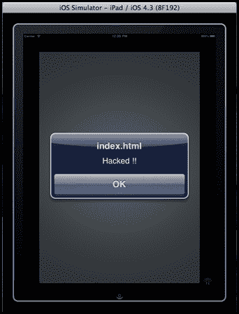

## 还有更多...

对于类似类别的 WebKit 攻击，您需要使用 WebKit 组件并反射用户输入的移动应用程序。您需要像 Burp Proxy 这样的代理工具来攻击网络流量，篡改并插入特定的有效载荷。这些有效载荷会立即在 WebKit 下反射并执行攻击。

查看移动端代码中包含 WebView、WebKit 等的应用程序。使用 Web 应用程序代理技术找出在响应中反射的参数。创建有效载荷并制定自定义攻击。

## 另见

+   *在基于 WAP 的移动应用中寻找漏洞*，第三章，*审计移动应用程序*

+   [`cansecwest.com/slides/2015/Liang_CanSecWest2015.pdf`](https://cansecwest.com/slides/2015/Liang_CanSecWest2015.pdf)

# 通过证书操作执行 SSL 流量拦截

在*使用 Burp Suite 和 Wireshark 拦截流量*以及*使用 MITM 代理修改并攻击*的配方中，我们拦截了移动应用程序的流量。如今，大多数组织都使用 SSL 来保护网络上的数据。因此，期望大多数现实世界中的移动应用程序都使用 SSL。我们需要解决的下一个挑战是拦截移动应用程序的 SSL 流量。这需要在用户或受害者端进行证书操作。

## 准备就绪

本配方的主要要求是使用 SSL 的移动应用程序。此外，您还需要本章中*使用 Burp Suite 和 Wireshark 拦截流量*以及*使用 MITM 代理修改并攻击*配方中使用的所有工具。

## 如何操作...

尝试根据本章前面描述的方法设置代理工具并拦截安卓或 iOS 应用的流量。你会注意到，对于基于 WAP 的应用，SSL 错误会出现在移动浏览器中。对于已安装的应用或混合应用，你可能不会看到任何错误，流量也不会被捕获。

在 WAP 应用的情况下，如果提供证书接受选项，你可以继续操作并在代理工具中捕获流量。

对于非 WAP 应用，您需要强制应用接受代理证书。可以通过将代理证书添加到受信任的凭据存储中来实现。

让我们在本教程中使用 Charles Proxy：

1.  在我们的安卓手机上安装 Charles Proxy，以便能够拦截安卓应用的流量。

1.  可以从[`www.charlesproxy.com/assets/legacy-ssl/charles.crt`](http://www.charlesproxy.com/assets/legacy-ssl/charles.crt)下载 Charles Proxy 版本 v3.10 之前的 SSL 证书。

1.  要安装 Charles Proxy 证书，请在安卓手机上打开前述网址。

1.  代理安装界面会要求你提供一个名称；我们将在这里输入`charles`，如下截图所示：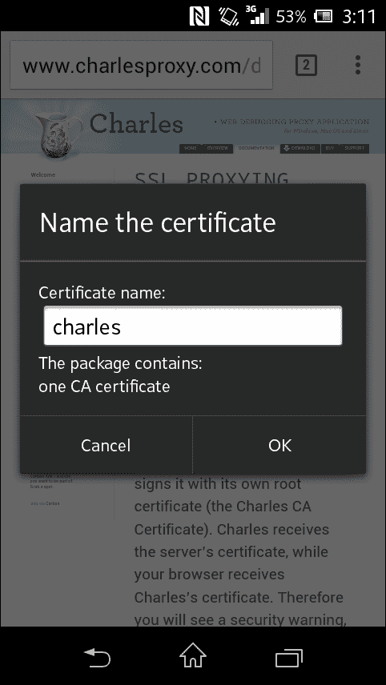

1.  接下来的步骤提示我们提供锁屏 PIN 码或密码。完成后，我们会收到一条消息，表示`Charles 已安装`。

1.  让我们进入**受信任的凭据**存储，验证证书是否已安装。导航路径为：**设置** | **安全性** | **受信任的凭据** | **用户**: 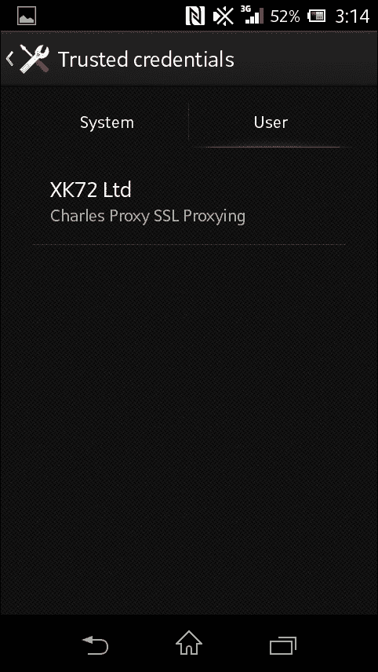

从前面的截图中可以看到，`Charles Proxy SSL 证书`已存在并安装。

接下来的步骤非常简单，类似于本章第四个操作步骤。通过这种方式，可以为移动应用设置 SSL 代理，并篡改流量以攻击应用的业务逻辑。

## 它是如何工作的...

SSL 代理拦截之所以有效，是因为 SSL 协议天生容易受到 MITM 攻击。如果两个人（`A`和`B`）通过 SSL 进行通信，每个人都有自己的公钥和私钥。假设发生 MITM 攻击，攻击者介入了`A`和`B`之间的通信路径。

攻击者（或 MITM）拦截并与`A`和`B`交换密钥。通过这个更改后的密钥，攻击者能够加密和解密由`A`或`B`发起的通信，并将其无缝地发送给对方。

这种攻击会弹出 SSL 证书错误，只有当用户接受伪造（或攻击者的）证书时，通信才会被发起。在本教程中，我们通过手动安装相同证书，强制安卓手机接受 Charles Proxy。现实中的 MITM 攻击通常依赖于用户以某种方式接受证书，或者通过其他攻击渠道将伪造证书安装到受信任的存储中。

## 还有更多内容...

类似于为 Charles Proxy 安装代理证书的方法，可以在其他代理工具（如 Burp Suite、Fiddler 等）上为 SSL 证书进行安装，适用于各种移动设备。可以按照相同的步骤在模拟器或仿真器中安装 SSL 证书。

## 另见

+   [`en.wikipedia.org/wiki/Man-in-the-middle_attack`](https://en.wikipedia.org/wiki/Man-in-the-middle_attack)

+   [`www.symantec.com/connect/blogs/android-mobile-app-pen-test-tricks-part-i-installing-ca-certificates`](http://www.symantec.com/connect/blogs/android-mobile-app-pen-test-tricks-part-i-installing-ca-certificates)

+   [`resources.infosecinstitute.com/android-application-penetration-testing-setting-certificate-installation-goatdroid-installation/`](http://resources.infosecinstitute.com/android-application-penetration-testing-setting-certificate-installation-goatdroid-installation/)

# 使用移动配置文件设置 VPN 并在 iOS 设备中截获流量

iOS 允许 iDevice 配置并参与 VPN。这个 VPN 通道打开了另一条通信通道，我们也可以利用这个通道设置代理以截获流量。

## 准备工作

我们需要代理工具、iDevice 以及无线渗透测试实验室的其他要求。

此外，您还需要在一台计算机上配置 VPN 服务器。可以使用 Open VPN 或 PPTP 服务器来完成此操作。

## 操作方法...

一旦准备好，执行以下步骤：

1.  从 http://poptop.sourceforge.net/dox/ 下载**PPTP Server**并将其安装在 Linux 机器上。

1.  编辑 `pptpd.conf` 文件，为 VPN 客户端分配**IP 范围**，并为 VPN 服务器提供静态 IP，VPN 服务器还将充当网关。

1.  进一步配置**DNS** **服务器**为**VPN**客户端。

1.  最后，配置**VPN**密码，并在需要时调整网络设置。

1.  配置编辑完成后，保存 `pptpd.conf` 文件并重新启动 VPN 服务。这确保 VPN 服务器已启动并正常工作。

1.  现在需要在 iDevice 中配置移动 VPN 客户端。找到 iDevice 上的**VPN 设置**并编辑**PPTP**设置。

1.  配置服务器**IP 地址**、**VPN 认证凭据**等。以下截图显示了这些设置：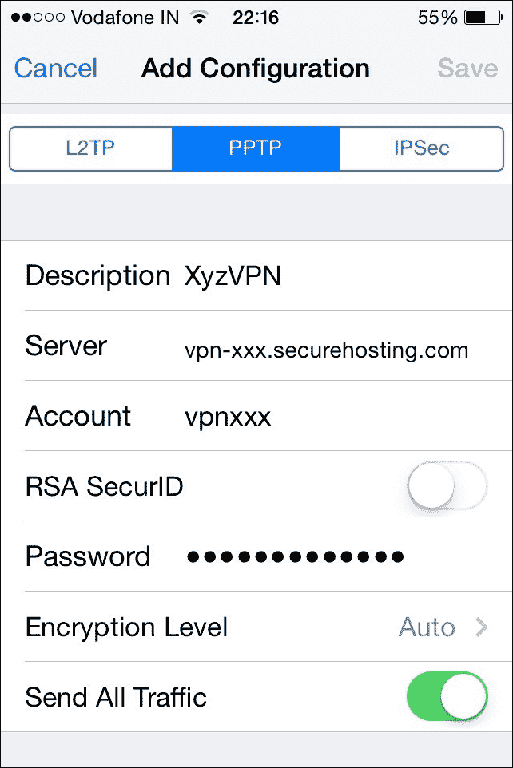

1.  上述步骤确保 iDevice 现在已经是 VPN 的一部分，其中默认网关已由我们控制。

1.  现在让我们为这个 VPN 客户端设置代理，即我们的 iDevice。在**VPN 设置**下，向下滚动找到**代理设置**，在这里您可以配置**代理服务器 IP 地址**和**端口**，并在需要时提供代理身份验证详细信息。如下截图所示：

现在，在代理 IP 地址上运行的 Burp 或 Charles Proxy 开始捕获流量。

## 工作原理...

这个配方听起来可能很复杂，涉及 VPN 服务器、客户端配置和代理。但实际上，操作起来非常简单。一旦设置了 VPN 网络，像 iDevice、VPN 服务器和代理工具这样的所有组件都是同一个网络的一部分。现在，网络代理位于这个 VPN 网络中。所以一切都没有改变，只是这是一个 VPN 代理，而不是我们之前见过的 Wi-Fi 代理。iOS 提供 VPN 配置作为 iDevices 功能使得操作相当简单。

可以更好地认识到此配方在拦截移动网络流量方面的重要性，否则可能非常困难。

## 还有更多内容…

OpenVPN 服务器和客户端可以作为 PPTP 服务器的替代方案来看待。步骤非常相似：

1.  在一台计算机上安装 OpenVPN 服务器。

1.  在 iDevice 上安装 OpenVPN 客户端。

1.  运行类似 Burp 或 Charles 代理的代理工具。

1.  一旦上述三个组件都在同一 VPN 网络中，配置 iDevice 中的代理设置以启动流量拦截。

## 另请参阅

+   [`thesprawl.org/research/ios-data-interception/`](https://thesprawl.org/research/ios-data-interception/)

+   [`poptop.sourceforge.net/dox/`](http://poptop.sourceforge.net/dox/)

+   [`itunes.apple.com/in/app/openvpn-connect/id590379981?mt=8`](https://itunes.apple.com/in/app/openvpn-connect/id590379981?mt=8)

# 绕过 Android 和 iOS 的 SSL 证书验证

SSL 证书验证在移动应用中实现，强制使用带有受信任证书的 SSL。服务器证书被固定到移动应用中。SSL 证书存储在移动设备的信任存储中，并且移动应用被编码为在与服务器建立连接时使用相同的证书。这也被称为**证书 pinning**。

可以绕过证书 pinning，这导致整体 SSL 证书验证绕过。让我们学习如何在 Android 和 iOS 设备上绕过证书 pinning。

## 准备工作

我们将需要 SSL 拦截工具和其他在本章节中提到的工具，如应用程序逆向工程或反编译工具，以及使用 SSL pinning 的应用程序。

## 如何做…

按照以下步骤绕过 pinning：

1.  安装使用 SSL pinning 的移动应用程序。

1.  尝试设置 Burp 代理，并注意出现错误，无法建立成功连接。这是因为移动应用程序只编码为仅使用固定的证书。由于 Burp 代理证书未固定，应用程序不会启动 SSL 通信。因此，显而易见，我们需要将 Burp 代理证书固定到移动应用程序中。

1.  让我们首先将 Burp 代理证书安装到移动设备的信任证书存储中。为此，请按照之前在本章节中解释过的 *通过证书操作执行 SSL 流量拦截* 配方进行操作。

1.  现在，应用程序需要配置以删除钉扎或使用存储在移动设备上的新证书。为此，您需要找到负责使用钉扎证书的应用程序代码，删除此代码，并重新打包应用程序。重新打包的应用程序现在不使用钉扎证书，而是使用 Burp 代理的受信任证书。通过这种方式，SSL 代理得以设置，证书验证被绕过。

## 它是如何工作的...

SSL 钉扎绕过之所以有效，是因为它依赖于检查用户提供的证书是否被允许，且只使用钉扎证书。它并没有尝试将钉扎证书与服务器证书相关联的参数进行匹配。在整个过程中，它忽略了移动设备由用户控制这一事实，而用户可以进行黑客攻击来禁用钉扎。

代理证书（或伪造证书）可以通过不同的黑客手段被推送到移动设备的受信任存储中。此外，应用程序被修改为丢弃钉扎证书的使用。移动应用程序因此受到影响，开始使用已经被移动设备信任的伪造或代理证书进行通信。

## 还有更多...

前述方法依赖于操作应用代码以删除钉扎证书。还有另一种方法不需要操作代码，而是通过操作密钥库将代理（或伪造）证书添加到密钥库中。

这需要一个密钥库密码，它是硬编码在移动应用程序代码中的。密钥库密码可以从反编译的代码中获得。像 **smali**/baksmali 这样的工具可以用来完成此操作。

最后，找到密钥库。在 Android 中，最可能的位置是在 `res` 文件夹下。现在，使用 `keytool` 命令将代理证书添加到密钥库中。重新打包并签名应用程序。现在，它使用代理证书，流量拦截生效，从而绕过 SSL 证书验证。

### 提示

要特别检查移动应用程序源代码中是否存在绕过 SSL 验证的代码。一些开发者喜欢编写绕过 SSL 验证的代码用于测试和调试目的。该代码在进入生产环境时，应当经过清理，去除此类绕过代码。

## 另见

+   *检查 iOS 应用数据存储* 和 *钥匙串安全漏洞*，第三章，*移动应用审计*。

+   [`media.blackhat.com/bh-us-12/Turbo/Diquet/BH_US_12_Diqut_Osborne_Mobile_Certificate_Pinning_Slides.pdf`](https://media.blackhat.com/bh-us-12/Turbo/Diquet/BH_US_12_Diqut_Osborne_Mobile_Certificate_Pinning_Slides.pdf)
