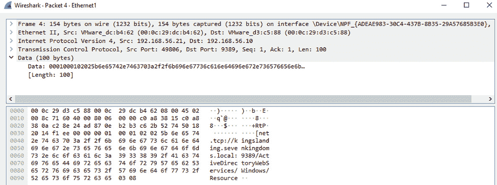
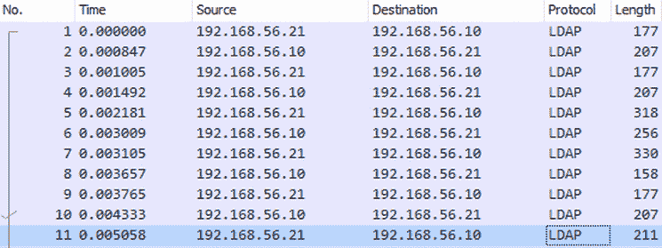
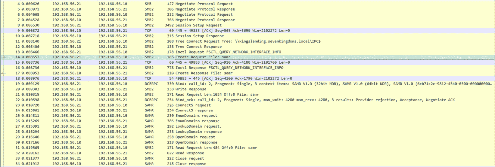
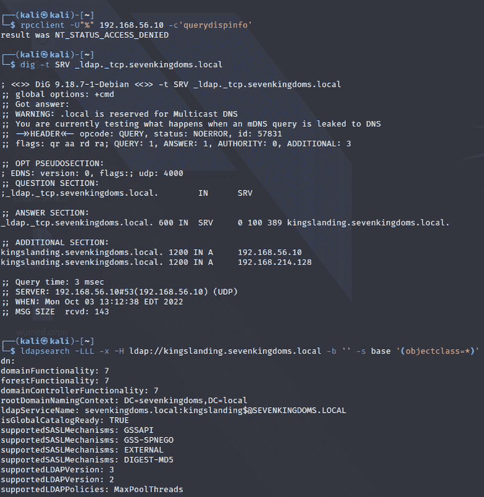
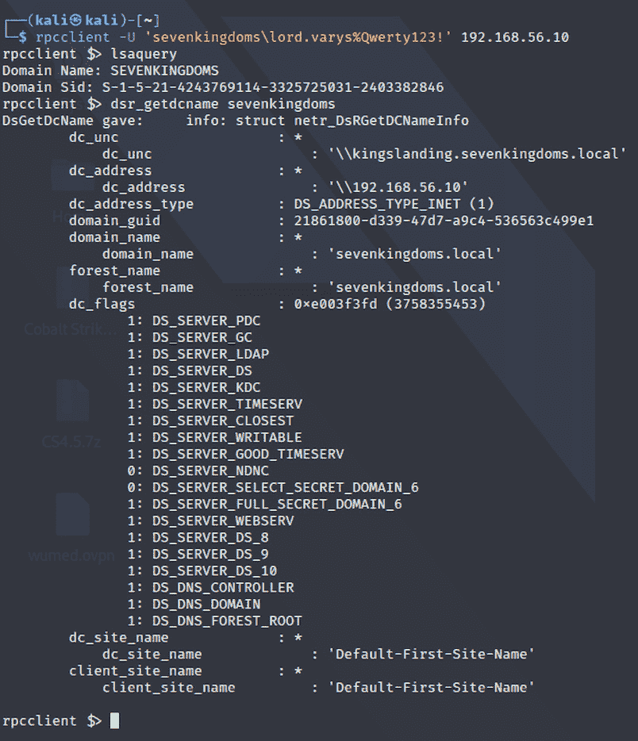
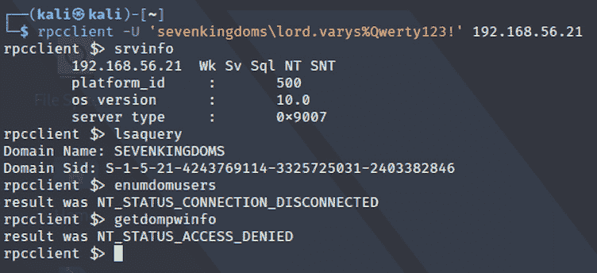
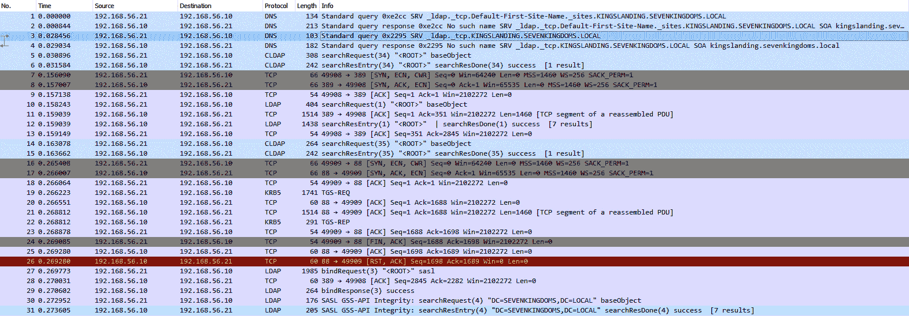
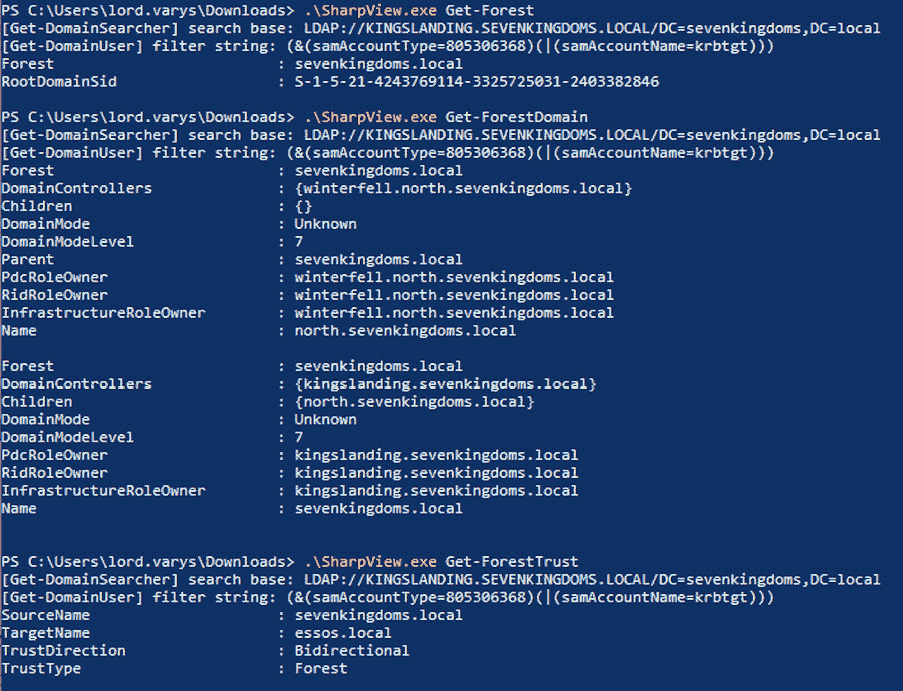
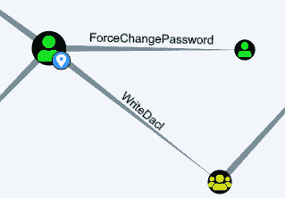
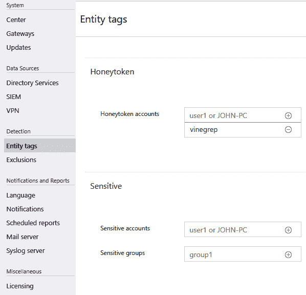

# 3

# 域侦察与发现

本章将重点介绍域枚举。尽管方法论看起来显而易见且直观，但实际过程可能会显得令人生畏，而侦察是成功入侵的关键步骤。此外，重要的是在每次行动后重新进行枚举，因为新的路径可能会打开。有时枚举可能直接导致入侵；例如，受损的用户可能读取 **本地管理员密码解决方案**（**LAPS**）或 **组托管服务账户**（**gMSA**）密码，或者可能在启用不受限制代理的计算机上拥有管理员权限。

我们将简要回顾侦察方法，并以不同方式开始全面枚举。我们将涵盖内置 PowerShell 模块、**Windows 管理工具**（**WMI**）和 **net.exe** 命令的使用，并利用 LDAP 搜索功能。作为下一步，我们将使用 PowerView 和 BloodHound 工具。我们将以服务枚举结束我们的旅程。作为锦上添花，我们将在活动中研究 **高级威胁分析**（**ATA**）检测规避以及如何理解和处理蜜罐令牌。

本章将涵盖以下主要内容：

+   使用内置功能进行枚举（PowerShell，WMI，**net.exe**，LDAP）

+   最常用的枚举工具（PowerView，BloodHound）

+   域服务枚举

+   ATA 和蜜罐令牌的检测规避

# 技术要求

本章的技术要求如下：

+   至少 16 GB RAM、8 个 CPU 核心和至少 55 GB 总空间（如果进行快照，空间要求更大）的 VMware Workstation 或 Oracle VirtualBox

+   强烈推荐使用基于 Linux 的操作系统

+   安装了对应虚拟化平台插件的 Vagrant 和 Ansible

+   已部署的 ATA 案例 DetectionLab 版本 ([`www.detectionlab.network/introduction/prerequisites/`](https://www.detectionlab.network/introduction/prerequisites/))

+   从 GOADv2 项目中，我们将使用 DC01、DC02、SRV01 和 SRV03

# 使用内置功能进行枚举

在我们的场景中，我们已建立了初步立足点，成功识别并规避了防御性安全措施。接下来的步骤是更好地了解我们已进入的环境。我们所有的侦察活动可能会受到蓝队的密切监视。随后，我们将运行各种命令和工具，检查 Windows 事件日志并生成流量。进行这种演练的目的是理解底层使用了哪些协议，以及在枚举过程中可能留下哪些妥协迹象。

在进入实践部分之前，让我们简要概述一下我们将遵循的枚举方法论。我的方法是从较高层次的抽象开始，逐渐深入。

## PowerShell cmdlet

我们将枚举一个 Active Directory 环境，从森林、域以及它们之间的信任关系开始。接下来的步骤是分别枚举每个域，获取有关 **组织单位** (**OUs**) 和包含相应用户和计算机的组的信息，最后是域的 **组策略对象** (**GPOs**) 和 **访问控制列表** (**ACLs**)。使用 PowerShell，您可以使用多种方式进行枚举。虽然有一个 Active Directory cmdlet，但它默认仅安装在域控制器上。不过这没什么大不了的！有一个很棒的项目，由 *Nikhil Mittal* 创建，叫做 ADModule。这个项目的思路是，我们复制一个微软签名的 DLL 文件，用它来执行 Active Directory cmdlet，而无需安装 RSAT 或拥有管理员权限，也能进行枚举。同时，它还可以将所有操作保存在内存中，而不触及磁盘。ADModule 项目的主要缺点是，它已经不再维护，因此不会有新的命令可用。需要提到的是，PowerShell 的 Active Directory cmdlet 需要 **Active Directory Web 服务** (**ADWS**) 在端口 **9389** 上运行。我们可以在 Wireshark 捕获的第四个连接数据包中看到它：



图 3.1 – 连接到 ADWS 端口 9389

可以通过运行以下命令查看可用命令的完整列表：

```
Get-Command -Module ActiveDirectory
```

使用这样的模块有明显的优势；例如，不需要绕过杀毒软件，所有执行都发生在内存中，而且如果没有应用特殊的检测规则，流量会很好地融入环境。防御者可以阻止端口 **9389**，禁用 ADWS，和/或在流量访问此端口时创建警报。但这完全取决于目标环境——在大多数情况下，这种活动会被视为正常活动。接下来，我们将讨论使用 WMI 进行枚举，这在域中的每台机器上默认可用。

## WMI

**WMI** 是 **Web-Based Enterprise Management** (**WBEM**) 的微软实现。WMI 使用 **通用信息模型** (**CIM**) 来表示受管理的组件。

要查看 WMI 的实际操作，我强烈推荐阅读 *0xinfection*[2] 撰写的五篇博客文章。WMI 可以在 PowerShell 中使用，因此我们将利用它进行 Active Directory 枚举。同时，也可以通过命令行使用 **WMI 命令行工具** (**WMIC**) 执行 WMI 操作。WMI 有一个名为 **root\directory\ldap** 的提供程序，我们将使用它与 Active Directory 进行交互。

让我们运行以下示例中的命令，找出域名并查看将发送的流量：

```
Get-WmiObject -Namespace root\directory\ldap -Class ds_domain | select ds_dc, ds_distinguishedname, pscomputername
```

我不会讨论捕获中的每个数据包，但用简单的语言来说，发生了以下高层次步骤：

1.  进行了 Kerberos 身份验证。

1.  出现了一个 LDAP 绑定请求和响应。

1.  攻击者发出了搜索请求，并且相应的结果条目也出现了。

完成上述步骤后，我们将收到以下输出：


图 3.2 – 当前域的结果

在相应的 Wireshark 窗口中，我们可以看到，接收到上述截图信息共用了 11 次 LDAP 查询/回复：



图 3.3 – 获取当前域信息后的 Wireshark 流量捕获

需要提到的是，这个流量仅发生在域控制器和受损机器之间。我们可以看到，WMI 依赖于 LDAP，稍后我们将对此进行介绍。

## net.exe

另一个用于域枚举的内置工具是**net.exe**。在本节中，我们将使用以下命令枚举域用户：

```
net user /domain
```

运行上述命令的结果如下：


图 3.4 – 使用 net.exe 命令进行域用户枚举

在这种情况下，我们的机器发送的流量将使用一组独特的协议——SMBv2、DCERPC 和 SAMR。这一点很重要，因为某些协议的使用可能是妥协的良好指示。我们将在本章稍后看到这一点。

关于**安全账户管理器远程**（**SAMR**）如何工作的高层次解释是在 BloodHound 使用的背景下发布的[3]。稍后我们将在本章分析 SharpHound 行为时使用来自三篇博客文章的信息。简而言之，我们的机器打开一个 SMB 连接到域控制器，然后将自己绑定到**\PIPE\samr**，该管道通过**IPC$**共享导出，并使用 SAMR 查询来提取关于用户的信息。

以下是 Wireshark 流量捕获：



图 3.5 – MS-RPC 流量捕获

以上所有枚举方法都是在基于 Windows 的系统上展示的。但是，如果我们能够访问一台 Linux 机器呢？在下一节中，我们将结合流行的 Linux 工具使用**轻量级目录访问协议**（**LDAP**）搜索查询。

## LDAP

LDAP 是一种目录服务协议，提供连接、搜索和修改目录的机制。网上有一个免费的优秀 wiki[4]，其中可以找到适用于 Active Directory 的相关 LDAP 查询示例。为了理解如何将其应用于有意义的枚举，我强烈推荐您阅读*ropnop* 在 Thotcon 2018 中做的精彩演讲[5]。

在之前的示例中，我们使用有效的凭据在域用户上下文中执行了枚举。但如果我们还没有凭据呢？在某些罕见的环境中，旧版本的环境可能会允许通过以下命令进行 NULL 会话枚举：

```
rpcclient –U"%" IPAddress
```

*Reino Mostert* 分享了一个新的观点，他讲述了在 Windows 域控制器上枚举用户的三种方式[6]，并通过工具[7]补充了他的研究。

总结来说，作为一个未经身份验证的域用户，我们可以运行 **nbtscan**、**dig**、**ldapsearch**，在某些情况下，**rpcclient** 来获取域名、域控制器和计算机的 NetBIOS 名称：



图 3.6 – 无域用户凭据的枚举

获取我们第一组有效的域用户凭据将为获取更多信息开辟途径，正如以下截图所示。



图 3.7 – 使用 rpcclient 进行身份验证枚举

请小心，因为根据 Windows 版本的不同，一些 SAMR 查询可能无法正常工作，但 NETLOGON 和 LSARPC 仍然可以正常使用。以下截图展示了这一点：



图 3.8 – SAMR 查询失败

LDAP 查询比 **rpcclient** 或 **enum4linux** 中的预定义搜索提供更多灵活性。我们可以使用 **ldapsearch**[8] 和/或 **windapsearch**[9]。我们可以通过查询枚举管理员组的成员，如下所示：

```
ldapsearch -LLL -x -H ldap://kingslanding.sevenkingdoms.local -D "lord.varys@sevenkingdoms.local" -w 'Qwerty123!' -b dc=sevenkingdoms,dc=local "adminCount=1" dn | grep "dn:"
```

运行上述命令将得到以下输出：


图 3.9 – 列出属性 adminCount=1 的对象

我们已经讨论了如何手动执行枚举并分析流量以理解底层协议的使用方式。现在，我们将讨论用于以自动化或半自动化方式执行枚举的最常见工具。

# 枚举工具

用于域枚举的最常见工具是 PowerView 或 SharpView 和 SharpHound，结合使用 BloodHound。

## SharpView/PowerView

SharpView[10] 是 PowerView[11] 的 .NET 移植版本。这个工具有各种各样的方法，可以改善和加速复杂环境中的枚举过程。我推荐阅读 PowerView wiki[12]，因为它详细解释了如何运行查询。让我们从 GitHub 获取版本，编译并按照我们的研究方法进行操作。我们不会为每个命令都运行 Wireshark，而是选择一个示例来理解我们留下的痕迹。为了让我们的工作更轻松，我使用了 **Get-DomainSID** 命令：


图 3.10 – Get-DomainSID 命令的结果

以下是 Wireshark 捕获的几个 DNS 请求，用于获取域 LDAP SRV，接着是 CLDAP 和 LDAP 查询/响应的混合，结合了 Kerberos 认证。总共捕获了 265 个数据包：



图 3.11 – 获取 Get-DomainSID 命令的 Wireshark 捕获

以下列表展示了在几乎每次参与过程中你将使用的最常见的枚举命令。命令名称不言自明。有关额外选项和键，请参见官方指南：

+   **Get-Forest**

+   **Get-ForestDomain**

+   **Get-ForestTrust**

+   **Get-Domain**

+   **Get-DomainTrust**

+   **Get-DomainController**

+   **Get-DomainOU**

+   **Get-DomainGroup**

+   **Get-DomainGroupMember**

+   **Get-DomainUser**

+   **Get-DomainComputer**

+   **Get-DomainGPO**

+   **Get-DomainForeignUser**

+   **Get-DomainForeignGroupMember**

+   **Invoke-ACLScanner**

+   **Find-LocalAdminAccess**

+   **Find-DomainShare**

作为示例，我将展示如何使用 SharpView 命令帮助进行森林枚举。枚举以标准用户身份执行。在运行了仅三个命令后，我们就能知道根域和森林中所有域的 SID，包括域控制器的名称，并且两片森林之间存在双向信任。森林枚举的结果如下：



图 3.12 – 使用 SharpView 进行森林枚举的结果

在收集完所有森林和域的信息后，我们需要对其进行分析。我们的目标是寻找一种方法，将允许的信任和访问与错误配置串联起来，以便进一步推进。如果有一个工具能以某种自动化的方式帮助我们将所有信息结合在一起呢？让我们欢迎并讨论 BloodHound！

## BloodHound

*防御者思维是按列表进行的，而攻击者则是按图形思维的。只要这一点成立，攻击者就会胜利。* 这句伟大的名言出自 *John Lambert*。我认为这种思维方式的转变能帮助我们理解 **BloodHound**[13] 的全部潜力。这个工具利用图论帮助攻击者找到 Active Directory 中原本不应该存在的或可以被利用来进一步妥协的对象关系。为了实现这一点，我们需要 SharpHound 数据收集器[14] 和 BloodHound。我们的目标是了解这些工具的工作原理以及使用它们的好处。SharpHound 有多种收集方法，在使用这些方法之前，我们需要了解它们的影响。例如，RDP、DCOM、PSRemote、LocalAdmin 和 LoggedOn 等方法非常嘈杂，会产生大量流量，因为它们需要连接到域中的每台计算机以获取请求的信息。

在以默认收集选项运行 SharpHound 并将结果上传到 BloodHound 后，我们可以找到一些有前景的路径，如下图所示，其中 **tywin.lannister** 可以更改另一个用户的密码并将自己添加到一个组中：



图 3.13 – BloodHound 发现的 ACL 错误配置

在某些情况下，BloodHound 中预定义的查询可能不足以找到下一步的行动。这时，我们可以自己编写查询和/或使用已发布的自定义查询[15]。

要了解更多关于 BloodHound 内部的内容，*Sven Defatsch*[3]写了三篇博客文章。在这些文章中，他讨论了通过不同方法进行用户和会话枚举。我们不会复制完整的研究，但会简要查看流量以确认结果。我们将开始会话的数据收集，并进行数据包捕获：

```
SharpHound.exe -d sevenkingdoms.local –CollectionMethods Session --Stealth
```

上述命令创建了以下数据捕获：


图 3.14 – 会话收集

如我们所见，流量与原始研究中的流量相同。有许多不同噪声级别的收集方法。而且，这也取决于你在猎取什么。一般建议是使用**--Jitter**和**--Throttle**选项，在请求之间创建延迟。**--Stealthy**选项迫使 SharpHound 以不同的方式表现，但它也可能影响收集的质量。

总结一下，数据收集器通过 SMB 连接和 Kerberos 身份验证，使用各种命名管道和协议获取信息。

然而，还有另一种探索目标 Active Directory 的方法。**ADExplorer**[16]是微软编写的一个工具，不仅可以查看和编辑对象，还支持快照。我强烈推荐你阅读*api0cradle*[18]关于在参与活动中使用 ADExplorer 的帖子。使用由*c3c*[18]编写的工具，我们可以将快照转换为 BloodHound 兼容的 JSON 文件。显然，由于没有与系统的网络交互，像本地管理员列表和会话这样的信息将缺失。进行快照时唯一需要考虑的 OpSec 因素是要记住会收集大量数据。然而，正如*FalconForce*[19]提到的那样，检测 Active Directory 数据收集并不容易。

在收集了所有关于域的可用信息后，接下来我们将专注于域内部署的服务，并简要了解用户狩猎过程。

# 枚举服务并猎取用户

为了继续我们的枚举，下一步是识别可用服务、文件和 SQL 服务器以及域中特权用户的活动。如本章开头所述，我们的目标是获取受损环境中的关键数据和服务访问权限。

## SPN

**服务主体名称**（**SPNs**）是 Kerberos 客户端用来唯一标识给定 Kerberos 目标计算机上的服务实例的名称。*PyroTek3*[20]拥有一个关于 Active Directory 已知 SPN 的全面列表。我们可以利用这些信息来更好地理解域中存在哪些服务，并使用 Kerberos 身份验证。

我们可以使用**setspn**工具或 SharpView 通过以下命令在域中枚举 SPN，以查找具有 SPN 的用户和计算机：

```
Get-DomainComputer -ServicePrincipalName "*"
Get-DomainUser -SPN
```

要使用**setspn**工具获取所有 SPN，我们可以运行以下命令：

```
setspn -T sevenkingdoms.local -F -Q */*
```

结果，我们得到了一个冗长的 SPN 列表。我们可以通过使用**-L**开关来针对特定服务器或用户缩小列表范围。运行上述命令后，以下是一些有前景的发现：


图 3.15 – 七王国森林中的 SPN

在域中的下一个猎捕目标是文件服务器。有时它甚至可能具有开放共享或我们具有“写入”权限的共享。在*第五章*中，我们将展示如何利用可写共享，但首先我们需要找到它们。

## 文件服务器

文件服务器是一个重要的信息资源。如果攻击者妥协了一个在组织内具有广泛访问权限的用户，那么就有可能从文件共享中提取所有所需的信息。在 SharpView 中，有几个选项用于文件服务器枚举。它们如下：

+   **Get-DomainFileServer**

+   **Find-DomainShare -CheckShareAccess**

+   **Find-InterestingFile**

+   **Find-InterestingDomainShareFile**

## 用户猎捕

用户猎捕更像是一种艺术，而不是一个过程。*harmj0y*创建了一个精彩的演示[21]，展示了总体方法。对于一个小型环境来说，这可能看起来是一个直接的过程，但如果跨多个域和森林有成千上万的用户，就不那么简单了。找到合适的猎捕目标是最关键的一步。对于特权用户，我们可以通过以下 SharpView 命令来识别他们：

```
Get-DomainUser -AdminCount -Properties samaccountname
```

以下是域中受特权的用户列表：


图 3.16 – 具有 AdminCount=1 属性的用户列表

作为下一步，我们可以运行各种命令，例如以下命令：

+   **Find-DomainUserLocation**

+   **Get-NetSession**

+   **Invoke-UserHunter -****Stealth -ShowAll**

只需小心，未使用**Stealth**开关的第一个和最后一个命令（[`www.labofapenetrationtester.com/2018/10/deploy-deception.xhtml`](http://www.labofapenetrationtester.com/2018/10/deploy-deception.xhtml)）会通过查询域内的每台机器生成大量噪声。在下一节中，我们将介绍一些检测方法以及在枚举过程中如何避免这些检测。

# 枚举检测规避

枚举可能是一个噪声很大的过程，如果没有采取预防措施使用工具的话。同时，防御者通过使用安全产品和欺骗方法来猎捕侦察活动。这些方法就像黑暗房间中的隐藏铃铛——你需要知道它在哪里，才能避免被检测到。我们将一并介绍微软 ATA 及其继任者——**Defender for Identity** (**MDI**)以及蜜罐令牌。

## 微软 ATA

微软**高级威胁分析**(**ATA**)是一个本地平台，旨在帮助保护企业免受威胁。扩展支持将在 2026 年结束，因此值得快速介绍一下它。

在本节中，我们将仅讨论用于重建方法的检测；其他攻击和绕过将在相应的章节中讨论。一般来说，ATA 通过解析多种协议的网络流量来检测恶意活动。值得注意的是，工具需要一定时间来学习环境中用户和机器的正常行为。数据收集发生在 ATA 网关上。2017 年，*Nikhil Mittal*写了一系列五篇关于 ATA 检测和绕过的博客文章[22]。一般的绕过策略是将现有环境流量混合在一起，并限制与域控制器的交互。**Microsoft Defender for Identity**（**MDI**）是 ATA 的继任者。Nikhil 重新审视了该产品，并在 BruCON 会议[23]上分享了他的研究。这里提到的所有技术至今仍对 ATA 同样有效。在演讲中给出了两个不错的枚举建议：排除对 DC 的 SMB 会话枚举，忘记任何使用 SAMR 协议的工具。WMI 和 LDAP 查询是侦察的途径，但现在推荐请求所有 LDAP 属性并离线筛选。

## 蜜罐令牌

另一种检测环境中恶意活动的方法是部署并监控环境中的诱饵对象。这些对象应该是攻击者想要的目标，但在正常活动中永远不应使用。我们可以指出更多*Nikhil Mittal*的研究[24]以及他现成的 PowerShell 模块[25]。通过该工具，我们可以部署蜜罐用户、计算机和组。为了检测这些对象的访问，我们需要配置组策略审计[26]，或者我们可以简单地将账户添加到 Microsoft ATA 中的蜜罐令牌：



图 3.17 – Microsoft ATA 中的蜜罐令牌

攻击者仍然可以通过检查如**LastLogon**、**logonCount**、**badpwdCount**、**whenCreated**等属性来识别蜜罐账户。一些工具可以协助进行此类活动，例如**HoneypotBuster**[27]。它使用一个内部的虚假排名系统，计算为账户的几个参数的组合。该工具的排名系统可以被蓝队分析，因此蜜罐可以调整到所需的级别。

另一种方法是在域内的机器内存中引入虚假凭据，并在特权提升攻击（例如 pass-the-hash 攻击）期间检测凭据重用。一个出色的项目，展示了这种欺骗技术，名为 Dcept[28]。如果蓝队检测到此类活动，他们将知道被攻击的确切主机以及攻击者执行横向移动的方式。

另一个脚本，Honeyhash[29]，是用 PowerShell 编写的，用于创建内存欺骗。它创建一个内存中的虚假账户，然后攻击者将使用该账户进行横向移动。 *Stealthbits* 公司撰写了一个关于如何部署和实施检测的详细指南[30]。

# 摘要

在本章中，我们讨论了攻击者可以用于枚举活动的可用工具和协议。我们简要介绍了工具内部机制，以便清晰地了解我们留下的痕迹。我们的方法论是从环境内部的高层次到低层次进行枚举。其中一个关键思想是枚举是一个持续的过程。在本章结束时，我们讨论了一些 OpSec 方面的问题，并看到蓝队如何欺骗攻击者。

在下一章中，我们将从域的角度讨论凭证访问。我们不会花时间在端点凭证访问上，而是会探讨诸如 Kerberoasting、GMSA、LAPS、不同类型的强制认证、如何滥用可写共享等内容。

# 参考资料

1.  ADModule: [`github.com/samratashok/ADModule`](https://github.com/samratashok/ADModule)

1.  WMI 基础系列: [`0xinfection.github.io/posts/wmi-basics-part-1/`](https://0xinfection.github.io/posts/wmi-basics-part-1/)

1.  Bloodhound 内部工作原理: [`blog.compass-security.com/2022/05/bloodhound-inner-workings-part-1/`](https://blog.compass-security.com/2022/05/bloodhound-inner-workings-part-1/), [`blog.compass-security.com/2022/05/bloodhound-inner-workings-part-2/`](https://blog.compass-security.com/2022/05/bloodhound-inner-workings-part-2/) 和 [`blog.compass-security.com/2022/05/bloodhound-inner-workings-part-3/`](https://blog.compass-security.com/2022/05/bloodhound-inner-workings-part-3/)

1.  LDAP wiki: [`ldapwiki.com/wiki/Main`](https://ldapwiki.com/wiki/Main)

1.  LDAP 和 Kerberos: [`blog.ropnop.com/talk/2018/funwithldapkerb/`](https://blog.ropnop.com/talk/2018/funwithldapkerb/)

1.  对 NULL 会话枚举的新看法: [`sensepost.com/blog/2018/a-new-look-at-null-sessions-and-user-enumeration/`](https://sensepost.com/blog/2018/a-new-look-at-null-sessions-and-user-enumeration/)

1.  UserEnum: [`github.com/sensepost/UserEnum`](https://github.com/sensepost/UserEnum)

1.  Ldapsearch: [`malicious.link/post/2022/ldapsearch-reference/`](https://malicious.link/post/2022/ldapsearch-reference/)

1.  Windapsearch: [`github.com/ropnop/windapsearch`](https://github.com/ropnop/windapsearch)

1.  SharpView: [`github.com/tevora-threat/SharpView`](https://github.com/tevora-threat/SharpView)

1.  PowerView: [`github.com/PowerShellMafia/PowerSploit/blob/dev/Recon/PowerView.ps1`](https://github.com/PowerShellMafia/PowerSploit/blob/dev/Recon/PowerView.ps1)

1.  PowerView recon wiki: [`powersploit.readthedocs.io/en/latest/Recon/`](https://powersploit.readthedocs.io/en/latest/Recon/)

1.  BloodHound: [`bloodhound.readthedocs.io/en/latest/`](https://bloodhound.readthedocs.io/en/latest/)

1.  SharpHound: [`bloodhound.readthedocs.io/en/latest/data-collection/sharphound.xhtml`](https://bloodhound.readthedocs.io/en/latest/data-collection/sharphound.xhtml)

1.  自定义 BloodHound 查询: [`github.com/hausec/Bloodhound-Custom-Queries`](https://github.com/hausec/Bloodhound-Custom-Queries)

1.  ADExplorer: [`learn.microsoft.com/en-us/sysinternals/downloads/adexplorer`](https://learn.microsoft.com/en-us/sysinternals/downloads/adexplorer)

1.  ADExplorer 在项目中的应用: [`www.trustedsec.com/blog/adexplorer-on-engagements/`](https://www.trustedsec.com/blog/adexplorer-on-engagements/)

1.  ADExplorerSnapshot: [`github.com/c3c/ADExplorerSnapshot.py`](https://github.com/c3c/ADExplorerSnapshot.py)

1.  检测 AD 数据收集: [`falconforce.nl/falconfriday-detecting-active-directory-data-collection-0xff21/`](https://falconforce.nl/falconfriday-detecting-active-directory-data-collection-0xff21/)

1.  已知 SPN 列表: [`adsecurity.org/?page_id=183`](https://adsecurity.org/?page_id=183)

1.  追踪系统管理员: [`www.slideshare.net/harmj0y/i-hunt-sys-admins-20`](https://www.slideshare.net/harmj0y/i-hunt-sys-admins-20)

1.  躲避 Microsoft ATA: [`www.labofapenetrationtester.com/2017/08/week-of-evading-microsoft-ata-day1.xhtml`](http://www.labofapenetrationtester.com/2017/08/week-of-evading-microsoft-ata-day1.xhtml)

1.  滥用 MDI: [`www.youtube.com/watch?v=bzLvOu1awKM`](https://www.youtube.com/watch?v=bzLvOu1awKM)

1.  部署欺骗研究: [`www.labofapenetrationtester.com/2018/10/deploy-deception.xhtml`](http://www.labofapenetrationtester.com/2018/10/deploy-deception.xhtml)

1.  部署欺骗工具: [`github.com/samratashok/Deploy-Deception`](https://github.com/samratashok/Deploy-Deception)

1.  用于 AD 蜜罐令牌的组策略配置: [`www.bordergate.co.uk/active-directory-honey-tokens/`](https://www.bordergate.co.uk/active-directory-honey-tokens/)

1.  HoneypotBuster: [`github.com/JavelinNetworks/HoneypotBuster`](https://github.com/JavelinNetworks/HoneypotBuster)

1.  DCEPT: [`github.com/secureworks/dcept`](https://github.com/secureworks/dcept)

1.  HoneyHash: [`github.com/EmpireProject/Empire/blob/dev/data/module_source/management/New-HoneyHash.ps1`](https://github.com/EmpireProject/Empire/blob/dev/data/module_source/management/New-HoneyHash.ps1)

1.  如何检测蜜罐哈希: [`stealthbits.com/blog/implementing-detections-for-the-honeyhash/`](https://stealthbits.com/blog/implementing-detections-for-the-honeyhash/)

# 进一步阅读

这些资料将帮助你进一步学习，并让你能够更深入地了解本章涉及的攻击内容：

+   Microsoft 的 WMI 详细信息: [`learn.microsoft.com/en-us/windows/win32/wmisdk/about-wmi`](https://learn.microsoft.com/en-us/windows/win32/wmisdk/about-wmi)

+   使用 WMI 枚举 Active Directory: [`0xinfection.github.io/posts/wmi-ad-enum/`](https://0xinfection.github.io/posts/wmi-ad-enum/)

+   Windows 中的 LDAP API: [`learn.microsoft.com/en-us/previous-versions/windows/desktop/ldap/lightweight-directory-access-protocol-ldap-api`](https://learn.microsoft.com/en-us/previous-versions/windows/desktop/ldap/lightweight-directory-access-protocol-ldap-api)
