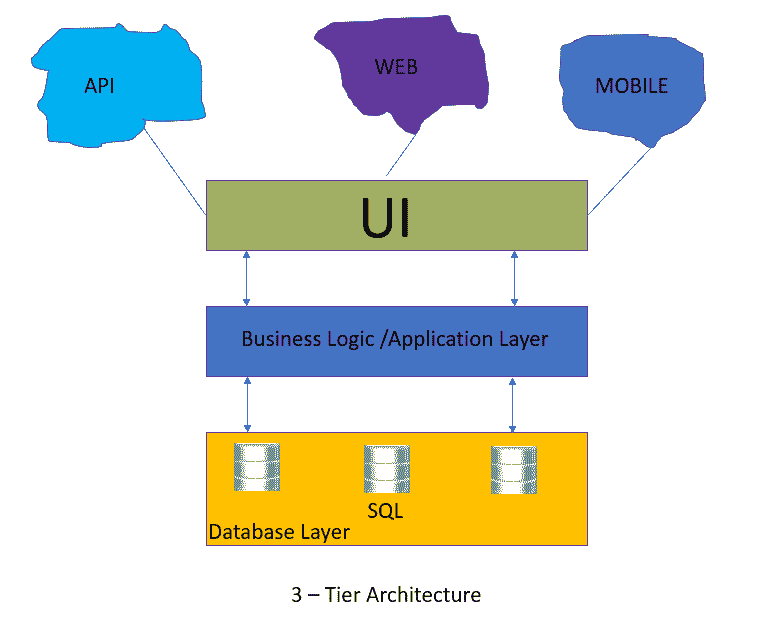
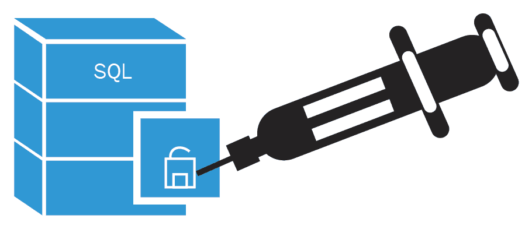
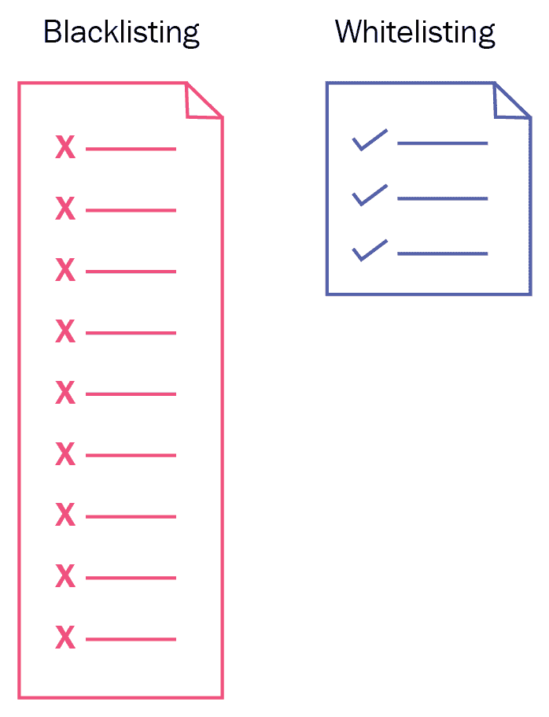
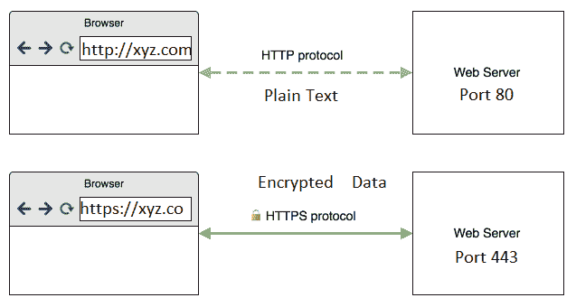

# 应用安全设计

在上一章中，我们讨论了云托管应用程序的数据保护和安全技术。在本章中，我们将讨论基于 Web 的应用程序的安全性。

尽管应用程序可以提高效率，但风险仍然存在。这是因为存在一些新的安全威胁，这些威胁可能对组织的 IT 基础设施造成重大风险。了解各种应用程序中常见的漏洞，并为用户提供更好的体验至关重要。本章将重点讨论基于 Web 的应用程序的安全性，**通用数据保护条例**(**GDPR**)即将到来。

本章我们将讨论以下主题：

+   GDPR

+   SQL 注入

+   Web 应用防火墙和安全性

+   黑名单与白名单

+   使用 HTTPS 做为一切的基础

# GDPR

在数字化转型的时代，商业组织持有的客户敏感个人信息一旦被盗用或滥用，将构成重大风险。全球的数据保护法律有一个共同的目标，即保护个人的隐私。为此，推出了通用数据保护条例，明确规定了如何使用和保护客户数据。我们大多数人在多个网页门户上分享个人信息，并点击“我同意”或“我接受”条款与条件。个人数据包含有关个人的信息，包括他们是谁、做什么以及去哪里。我们每个人在网络世界中都会留下数字足迹。数据挖掘是行业中的新石油，它提供洞察力并带来竞争优势。

GDPR 合规期限为 2018 年 5 月 25 日。任何存储或使用欧洲个人数据的组织，无论其业务性质如何，都将受到新数据保护法的影响。

让我们看一个例子，了解这如何影响全球组织。

收集来自欧盟人员数据的美国公司将承担与其欧盟总部相同的法律义务。即使他们在欧盟没有实际的物理服务器或办公室，基本的原则是，如果数据没有实际存放在欧盟区域，那么这些规则也不适用。例如，任何社交网络门户都必须保存用户信息，如果用户属于欧盟，该信息将存储在欧盟边界之外的服务器上。

法规必须在 2018 年 5 月 25 日前强制执行，未能遵守的组织可能会面临巨额罚款。最高罚款为 2000 万欧元或公司全球营业额的 4%。这一金额足以让许多企业关闭。为了避免这些严厉的后果，准备工作是成功的关键。

# 获取同意

同意是 GDPR 法规的一个关键因素，它为个人提供了选择和控制自己数据使用方式的权利，旨在建立信任和参与感。您的收集个人数据的 Web 门户必须让访问者清楚了解您计划如何使用他们的个人信息。然后，他们必须同意每一个具体的目的。即使您在某人使用购物车功能后获得了他们的电子邮件地址、电话号码和信用卡信息，在没有他们的同意下，您也不允许分享这些信息。

WhatsApp 现在允许用户查看它从他们那里收集的数据。

# 数据访问

GDPR 的另一个关键特性是使用户能够查看谁有权限访问存储在您网站和后台系统中的个人数据。首先需要了解的是，这些实体是谁，并且他们是否有正当理由访问这些数据。此外，所有从个人收集的数据必须是关联的，且一键操作应该足以删除所有不再需要的系统数据。

# 加密

提交到您的网站的任何数据都必须加密，以符合 GDPR 的要求。必须在您的站点上安装 SSL/TLS 证书以加密数据，避免中间人攻击。

若要了解更多有关 GDPR 的信息，您可以访问[`www.eugdpr.org`](https://www.eugdpr.org)。

# SQL 注入

SQL 注入是攻击者用来从基于 SQL 的数据库中窃取有价值数据的最古老且最广泛使用的应用层漏洞之一。攻击者利用 SQL 注入漏洞绕过 Web 应用程序的身份验证系统并检索信息。SQL 注入还可以用于进行更改，如添加、删除和修改数据记录。下图展示了 3 层架构应用程序：



3 层架构应用程序包含以下组件：

+   **用户界面**：**用户界面**（**UI**）基本上是与实际应用程序交互的一种用户友好的方式。它可以是移动应用程序、Web UI 或 API 方法来与应用程序交互。UI 层请求来自业务层的数据。

+   **业务逻辑**：业务逻辑可以被视为一个应用层，负责处理数据验证、业务规则和特定任务的行为。业务规则从数据库层提取或插入数据。

+   **数据库层**：这是 3 层架构中第三层也是最关键的一层，承载实际的数据，并负责将数据提供给上述两个层。

在此值得一提的是，在没有网站所有者许可的情况下对网站发起 SQLi 攻击，可能会导致您面临法律麻烦，并受到国家执法机关的追究。

让我们详细讨论 SQLi 的工作原理：

+   在网站登录页面，当您提交用户名和密码时，SQL 查询将如下所示。如果提供了正确的凭据，一切将正常工作：

```
SELECT id FROM customer_data WHERE username = 'xyz' AND password ='abcd';
```

+   由于一个小技巧绕过了 Web 门户的登录表单，同样的方法变得脆弱：

```
SELECT id FROM customer_data WHERE username = '' AND password = '' OR '1'='1'';
```

你可以看到用户名字段为空，密码字段有一个闭合的引号。魔法从这里开始，`OR` 语句 `'1' = '1'` 总是返回 true，整个查询返回了整个数据库的所有 `username` 和 `password`。

我们已经讨论了 SQL 注入的基本概念及其工作原理。前面的例子是一个非常基本的攻击，能够运行非常复杂的查询来破解数据库。强烈建议每次将系统或包含数据库的网站发布到公共访问时，都对其进行这类攻击的测试。试想，如果你能在一个易受 SQL 注入攻击的银行系统上捣乱，你可能通过操纵账户显示的金额或向别人转账来抢劫银行。

请记住，这个 SQL 注入测试应该只在测试环境中进行。

# 防止对 Web 应用程序的 SQL 注入攻击

好消息是，网站所有者实际上可以做很多事情来防止 SQL 注入。坏消息是，数据库安全没有一个完整、万无一失的解决方案：



# 实施全面的数据清理

对所有网站来说，过滤所有用户输入非常重要，利用弱输入过滤或根本没有过滤的漏洞也很常见。你也可以把这个叫做*验证*。例如，如果输入字段应该是手机号码，你当然可以验证这个字段，确保它只包含数字，且长度符合手机号码的标准。这不仅可以保护你的应用免受 SQL 注入攻击，还可以保护你免受不必要的行为。

# 部署 Web 应用防火墙

**Web 应用防火墙**（**WAFs**）是如今几乎所有商业网站上都使用的重要安全机制。使用 WAF 是防止已知攻击的非常有效的方式。WAF 通过多种安全检查来过滤传入的 HTTP/HTTPS 请求，抵御常见的针对 Web 服务器的攻击。除了管理请求，你还可以对返回给用户的响应应用 WAF 安全检查。尽管 WAF 对许多类型的攻击提供了优秀的保护，但它对当前复杂的**SQL 注入**（**SQLi**）攻击并不充分防护。你可以将 WAF 视为一种基于规则的第二层防御，用于保护 Web 服务器免受已知威胁，如 XSS、SQLi 和 DDoS 攻击。

# 限制数据库权限

数据库安全的关键要素是每个人的访问控制权限，从 DBA 到应用程序架构。为了限制数据库权限，应为每个使用环境创建多个具有最低权限的数据库用户账户。还应为应用程序授予最低的数据库访问权限。除非绝对必要，否则不要允许 DROP、DELETE 等操作。

# 漏洞发现

一旦你编写了应用程序，我们无法知道它是否容易受到 SQL 注入攻击。显然，你可以检查源代码，找出任何将用户输入与 SQL 拼接的实例，但这可能非常繁琐且耗时。你必须使用一个优秀且更新的漏洞扫描器来查找最常见的漏洞。执行 SQL 注入攻击会产生高网络带宽并发送大量数据，因此确保你是你正在测试的网站的所有者。如果不是，确保已从网站所有者处获得事先许可。像 sqlmap、Acunetix、Vega 和 Netsparker 等一些著名工具可以用于扫描。

# WAF

WAF 提供额外的安全防护，位于用户和 Web 应用程序之间，保护 Web 服务器免受未经授权的访问和恶意攻击。WAF 供应商提供硬件、软件、虚拟和基于云的防火墙解决方案。Web 应用程序极其脆弱，同时又是业务的支柱，因此必须保护它们。应用程序安全的最大挑战是检测应用程序中的漏洞，此时修补和修复代码的工作才开始，因为这些都是耗时的任务。这时 WAF 发挥作用；一旦发现漏洞，你可以将补丁应用到 WAF 中。所有在 WAF 补丁更新后发出的请求都会阻止与已发现漏洞相关的攻击。

让我们来看一下下面的图示。非 HTTP/HTTPS 攻击会被外围防火墙阻止，但外围防火墙确实允许 HTTP/HTTPS 连接。这些 HTTP/HTTPS 连接也可能成为攻击，因此会被 WAF 阻止，WAF 作为第二层安全防护。因此，只有通过这两层的干净连接才能到达应用服务器：


# WAF 防护常见的 Web 攻击

WAF 保护你的 Web 服务器免受可能危害网站安全的常见威胁。我们将列出常见的威胁和你可以使用的 WAF 安全检查，以应对这些攻击：

+   缓冲区溢出攻击

+   Cookie 篡改

+   强制浏览

+   Web 表单安全攻击

+   请求保护

+   机器人检测

+   暴力破解和凭证填充

+   第 7 层 DoS 攻击

+   跨站脚本攻击（XSS）

# 黑名单和白名单

IT 安全中的一个简单方法和基本原则是只允许真正需要的内容。安全就是访问控制和通过身份追踪活动。在网络安全中，访问是基于身份和意图授予的。白名单是具有良好意图的身份，而黑名单是具有恶意意图的身份。这是一个有争议的话题，我们将根据需求和实施进一步讨论：



# 什么是黑名单？

市面上大多数杀毒软件套件都采用黑名单方法来检测和防止病毒及恶意软件。1980 年代，杀毒软件首次使用黑名单。如今，杀毒行业仍然遵循这一原则。这就像是创建一个全球所有网络罪犯的名单。然而，如果漏掉了几个罪犯，或者他们是新出现的并且不在名单上，那该怎么办呢？根据 IT 环境的不同，黑名单中的实体可能包括已知会对个人或其他组织构成威胁的用户、应用程序、进程、IP 地址和组织。

黑名单几乎对零日威胁毫无价值。

# 黑名单的优缺点

黑名单的主要优势在于其简单性。你可以将已知威胁排除在系统之外，情报掌握在软件供应商手中。其有效性完全取决于供应商发布或更新已知威胁数据库的频率。从用户的角度来看，所有更新都是自动获取的。用户无法区分好坏数据流，直到软件标识为恶意。黑名单架构的主要缺点是如何应对未知威胁。例如，勒索软件不断发展，出现了许多前所未见的新模式和变种。

# 什么是白名单？

应用程序白名单使用的是反向逻辑。在这里，你可以创建一个受信任实体的名单，例如应用程序、电子邮件、用户、可信伙伴、服务和 IP 地址。这些实体被允许访问 IT 资源，而所有看似不必要的内容则被阻止。使用白名单架构时，你必须有严格的访问控制策略，并为用户授予适当的权限。由于你阻止了所有不需要的实体，这样可以减少攻击面，从而自动防御零日攻击。

# 白名单的优缺点

白名单的主要目标是保护高风险的安全环境。此方法只允许可信的软件、应用程序、用户和 IP，这大大减少了入侵的风险。主要优势在于，任何不在列表上的东西都无法进入网络。一个很好的例子是 Salesforce 应用程序门户的运作方式。通过此方法，你只能从允许的 IP 范围和用户中访问应用程序。我们都知道，Salesforce 是一个关键应用程序。对于大型网络来说，这种方式的扩展性不好，每次需要添加新条目时也很麻烦，因此难以管理。

# 哪个更好？

每种安全方法都有其优缺点。听起来可能有些奇怪，但你需要两者。一个典型的商业组织使用有限数量的应用程序，并且了解这些应用程序所需的用户和网络连接，应采用白名单方法。下一步是将此方法与黑名单结合，确保如果授权用户带着已知威胁进入网络，你的网络仍然可以得到保护。当然，相比白名单，黑名单的管理工作量较小，而且随着白名单规模的增大，差距也会更加明显。你可以对那些可以全球访问的应用程序采取白名单方法，比如银行门户网站和在线购物车。

# 对所有内容使用 HTTPS

全球约有二十亿人连接到互联网，互联网世界已成为人类的支柱。HTTP 是最著名的协议之一，在今天的数字时代中变得至关重要，它是计算机、平板、智能手机及其他许多设备上应用程序的主要协议。你应该始终用 HTTPS 保护你所有的网站，即使它们不处理敏感信息。因为在今天的世界中，没有所谓的非敏感网络流量。

从 2018 年 7 月起，随着 Chrome 68 的发布，Chrome 将标记所有 HTTP 网站为*不安全*。

HTTPS 是一个非常严肃和敏感的话题，在本节中我们将讨论网站安全。

# HTTP 与 HTTPS 的比较

**超文本传输协议**（**HTTP**）是一种允许客户端和服务器之间进行通信的协议。最常见的用途是将数据从网页服务器传输到浏览器，以查看网页内容。主要的问题在于，HTTP 不会加密传输的数据，可能会被他人窃听。如图表的第一部分所示，运行在服务端口`80`上的网页服务器以及客户端和服务器之间传输的所有内容都是明文的。在图表的下一部分，网页服务运行在服务端口`443`上，并且数据以加密模式传输：



HTTPS 是 HTTP 的安全版本，这意味着你访问的浏览器和 web 服务器之间交换的信息是加密的。目前使用 HTTP 的任何 web 服务器都可以迁移到 HTTPS。然而，如果必须购买**安全套接字层**（**SSL**）证书，可能会有一定成本。HTTPS 有助于防止攻击者在使用公共基础设施（如公共 Wi-Fi、互联网服务提供商或酒店）时劫持你的 web 服务器与用户浏览器之间的通信会话。

# Web 应用安全

每个开发者都希望他们的应用能够更安全。本节重点介绍了在设计或迁移到 HTTPS 时的一些顶级安全考虑和最佳实践。

# SSL/TLS 部署

选择一个**认证机构**（**CA**），该机构可靠且严肃对待其证书业务、安全性和声誉。可靠的 CA 还会提供各种证书类型和灵活的许可模型。

# SSL/TLS 密钥大小

长度更长的密钥总是更为理想，但对于公钥密码学（非对称密码），2048 位密钥具有相同的性质，因此更长的密钥没有意义。**国家标准与技术研究院**（**NIST**）建议，2048 位 RSA 密钥的强度相当于 112 位，因此理论上有 2112 种可能性来破解私钥。RSA 声明，1024 位（非对称）密钥可能会在 2006 年至 2010 年之间被破解，而 2048 位密钥足以保持安全直到 2030 年。同时，像 4096 位这样的更长密钥会显著降低服务器性能，直接影响浏览器的响应时间。

NIST 建议使用 2048 位的 RSA 密钥。

# 签名算法

**安全哈希算法**（**SHA**）是一种用于确保连接安全的哈希算法，用于提供消息的完整性和接收方的真实性。SHA 算法是 SSL/TLS 证书中的默认哈希算法。SHA-2 是一组哈希函数，包括 SHA-224、SHA-256、SHA-384、SHA-512、SHA-512/224 和 SHA-512/256。最常用的哈希函数是 SHA-256。一般来说，SHA-2 = SHA-256，这也是最低要求。

**安全哈希算法 3**（**SHA-3**）是安全哈希算法系列标准中的最新成员，于 2015 年 8 月 5 日由 NIST 发布。SHA-3 的广泛应用可能还需要许多年。

# 安全协议

不要使用 SSL 3.0。为了安全实现，配置支持最新版本 TLS 标准（TLS 1.1 和 TLS 1.2）的服务器和软件。

# 防止认证攻击

认证在 web 应用安全中扮演着非常关键的角色。攻击者会尝试寻找密码或会话 ID，并获得访问所需信息的权限。以下是一些防止认证攻击的方法：

+   通过添加验证码来防止自动化的暴力破解攻击。然而，这并不完美。除了验证码，还要使用账户锁定功能。这是防范暴力破解攻击的一个非常有效的威慑手段。

+   在 Cookies 中传输会话密钥（不要在 URL 中显示会话 ID），并确保会话密钥是不可预测的。将会话 ID 显示在 URL 中通常是当客户端阻止 Cookies 或作为备用方法时使用的。

+   缩短会话 ID 的持续时间，并确保在登出后服务器会拒绝它们。

+   使用双因素认证。

+   在会话固定攻击中，攻击者希望你使用他选择的会话 ID 登录账户。解决此问题的一个简单方法是不要让客户端选择会话 ID。

+   一旦完成操作，切勿保持会话处于活动状态；确保在每次会话结束时登出。会话登出也会迫使攻击者自动登出。

# 安全使用 Cookies

Cookies 是存储在客户端浏览器中的一组信息，在客户端每次发出后续请求时都会将这些信息发送到服务器。Cookies 主要用于身份验证和保持会话状态。为了避免会话劫持，确保有效地保护 Cookies 变得非常重要。可以通过正确设置 Cookie 属性来保护 Cookies。这些属性包括：

+   安全

+   域名

+   路径

+   HTTPOnly

+   过期

开发人员仅对主登录页面进行加密。其他敏感和非敏感信息以未加密的格式发送到服务器。请记住，Cookies 也会与这些请求一起发送。如果这些 Cookies 没有加密，就会给攻击者提供嗅探数据的机会，从而窃取这些 Cookies 中的会话信息。为了避免会话信息泄露给攻击者，确保 Cookies 也只能通过 HTTPS 连接进行传输，而非 HTTP 连接。这可以通过 Cookie 的安全属性来实现。你还可以调整其他属性，如 HTTPOnly。这样可以保护你免受 XSS（跨站脚本攻击），防止从 Cookies 中窃取数据。

# 漏洞扫描

随着企业和组织采用数字化转型，Web 应用程序已成为攻击者的有利目标。由于编码不当和硬化策略失效，Web 应用程序通常会受到漏洞和错误配置的困扰。网络和安全管理员必须使用 Web 应用安全扫描器对 Web 应用程序进行测试，并识别安全漏洞。扫描器不会访问实际的源代码，它们仅进行功能测试并尝试寻找安全漏洞。

# 服务器安全

为服务器做好安全运行的准备。以下是你需要执行的几个步骤：

1.  将服务器更新至最新操作系统

1.  开启内置防火墙

1.  启用操作系统安全的自动关键更新

1.  启用日志记录或与 SIEM 系统集成

# 引入漏洞赏金计划

漏洞奖励计划是基于激励并以结果为导向的计划，旨在鼓励安全研究人员发现与产品相关的漏洞和安全风险。然后，鼓励他们将这些问题报告给赞助组织。这些计划被认为非常有益，因为它们代表了一个全球的专业人员和研究人员社区，随时可用。

# 总结

到目前为止，你已经熟悉了应用安全的基础知识。我们在这一章中提供了足够的背景信息，帮助你理解多层安全方法。虽然 Web 应用能够高效地交换信息，但这些应用依然存在被攻击的风险。许多新的安全威胁也随之出现。如果处理不当，这些问题可能对组织的信息技术基础设施构成重大风险。由于涉及到数据安全，个人数据至关重要。因此，设计一个符合 GDPR 的稳健 Web 系统以保护用户信息变得尤为重要。

在下一章中，我们将讨论基础设施安全和未来技术的整体方法。

# 问题

1.  以下哪项不是保护环境免受安全攻击的因素？

    1.  攻击者的教育

    1.  系统配置

    1.  网络架构

    1.  公司的商业策略

    1.  数据库管理员（DBA）提供的访问权限级别

1.  你在任何网站地址开头输入的`http`代表什么？

    1.  超文本传输协议

    1.  HTML 传输技术过程

    1.  超空间术语与技术协议

    1.  超空间技术与技术进展

1.  SQL 注入是一种什么样的攻击，处理什么样的代码发送到数据库服务器？

    1.  恶意

    1.  冗余

    1.  清洁

    1.  非恶意

1.  以下哪项不是一种安全漏洞？

    1.  窃听

    1.  跨站脚本攻击

    1.  身份验证

    1.  SQL 注入

    1.  以上都不是

1.  以下哪项最容易受到注入攻击？

    1.  会话 ID

    1.  注册表键值

    1.  网络通信

    1.  基于用户输入的 SQL 查询

    1.  以上都不容易受到注入攻击

# 延伸阅读

欲了解更多信息，请参考以下链接：

+   [`www.sans.org/reading-room/whitepapers/analyst/started-web-application-security-36735`](https://www.sans.org/reading-room/whitepapers/analyst/started-web-application-security-36735)

+   [`www.eugdpr.org/`](https://www.eugdpr.org/)

+   [`www.sans.org/reading-room/whitepapers/application/web-application-firewalls-35817`](https://www.sans.org/reading-room/whitepapers/application/web-application-firewalls-35817)

+   [`www.cisecurity.org/wp-content/uploads/2017/05/SQL-Injection-White-Paper2.pdf`](https://www.cisecurity.org/wp-content/uploads/2017/05/SQL-Injection-White-Paper2.pdf)
