# 防火墙部署和检测技术

在上一章中，我们学习了有关 SSL 的所有内容。我们还探讨了 SSL 如何提供认证、机密性和完整性，以实现传输层安全性。

本章简要概述了防火墙技术，介绍了防火墙在网络中的部署及其提供的服务。在本章中，您将探讨不同一代的防火墙及其应用场景。您还将了解防火墙在网络中的作用，以及它能做什么和不能做什么。此外，本章还涵盖了 TCP/IP、Traceroute、扫描工具、防火墙设置、测试、维护防火墙的最佳实践等内容。我们将讨论以下主题：

+   防火墙和设计考虑因素

+   DMZ 安全设计

+   TCP/IP 与 OSI 模型

+   防火墙性能、能力和功能

# 技术要求

您需要一台安装了 hping 的 Unix 或 Linux 机器，并具备 TCP/IP、防火墙和 IP 通信的基础知识。

# 防火墙和设计考虑因素

安全性是任何安全网络设计中最重要的考虑因素。有许多方法可以确保网络安全，而防火墙技术是实现网络安全的最重要手段之一。

*防火墙*这个术语早在 1764 年就已使用，描述的是将建筑物中最容易发生火灾的部分（例如厨房）与建筑的其他部分隔离开的墙壁。防火墙有两种类型：一种基于硬件，另一种基于软件。硬件防火墙是专用硬件设备，用于保护网络的一部分或一个区段，而软件防火墙则运行在操作系统之上，用于保护主机。

防火墙保护策略完全依赖于防火墙管理员的专业知识和防火墙硬件的效率。安全规则和管理策略是访问控制策略中最关键的任务。IP 通信基于五个基本元组，对于每条防火墙规则，您需要一个有效的源地址、目标地址、源端口、目标端口和传输协议（TCP 或 UDP），以及允许或拒绝的操作。

企业最常实施的解决方案是基于防火墙技术的组合，如数据包过滤、**虚拟私人网络**（**VPN**）和**网络地址转换**（**NAT**）。

# 防火墙术语

在详细讨论防火墙之前，您必须理解基本术语：

+   **IP 地址**：IP 地址是互联网上主机的身份，通过路由协议在网络之间实现可达性。有两种类型的 IP 地址：IPv4（32 位，分为 A、B、C 或 D 类）和 IPv6（128 位，具有单播地址、任播地址或多播地址）。例如，IPv4：`200.10.20.1`，IPv6：`2001:0db8:85a3:0000:0000:8a2e:0370:7334`。

+   **端口**：任何托管在操作系统上的应用程序都会通过标准端口在网络上提供服务。当访问互联网上的任何应用程序时，源端口会打开一个动态端口，而目标端口则使用标准已知端口。例如，HTTP 使用端口`80`，FTP 使用端口`22`，Telnet 使用端口`23`。

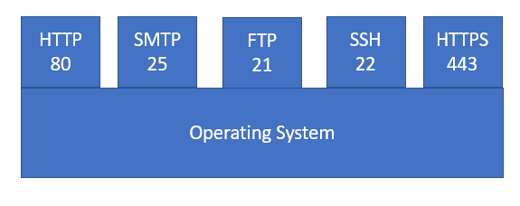

+   **协议**：协议是用于在本地网络、互联网、内部网和广域网中的网络主机间交换数据的标准方法和相互协议。

+   **元组**：5-元组这个术语指的是在任何给定的 IP 数据包中包含的五个项（源和目标 IP、源和目标端口、协议）。防火墙策略使用这些元组来定义防火墙规则，决定是否阻止或允许流量。

# 防火墙的代际发展

防火墙是一种网络安全设备，基于一套定义明确且高级的安全规则，监控和控制所有进出网络的流量。让我们讨论一下防火墙的发展历程及其功能。

+   **数据包过滤**：第一代防火墙——这些防火墙相对便宜，采用一种简单的过滤功能，称为静态数据包过滤，也被称为无状态防火墙。在防火墙术语中，*无状态*指的是对进出流量进行规则检查，因此，防火墙设备不会保持任何会话或连接状态。

基本上，数据包过滤在第 3 层（IP 层）和第 4 层（传输层）执行，通过将数据包的头部字段与四个元组进行匹配：源和目标 IP 地址、端口和传输协议（TCP/UDP）。一个好的例子是将其与路由器和访问控制列表相联系，用于控制进出流量。

1988 年，**数字设备公司**（**DEC**）开发了第一个防火墙系统，称为数据包过滤防火墙。基础数据包过滤防火墙容易受到 IP 欺骗攻击，因为它们不维护连接状态，因此攻击者可以利用这一点进行攻击。

+   **有状态防火墙**：第二代防火墙——这些防火墙具有与第一代相同的功能，但增加了监控和存储会话及连接状态的能力。对于任何连接，数据包匹配是双向的，这意味着发送的数据包与返回数据包的属性进行匹配，以确认它们属于同一个数据包流。与在无状态设备中双向放置访问控制列表不同，防火墙会根据数据包流的情况允许返回的数据包。它会查看 TCP 头部信息中的 SYN、RST、ACK 和 FIN 标志来确定连接的状态。

+   **应用网关**：第三代防火墙——应用网关防火墙基于深度数据包检查来理解应用程序（第七层），并充当服务器和客户端之间的代理。这些代理会丢弃可疑的数据和连接。由于它们了解应用程序，它们可以处理更复杂的协议，如 Web、H.323、SIP、FTP、SQL Net 等。应用网关的缺点是建立代理连接需要两个步骤，才能连接到入站或出站连接。简单来说，用户需要连接到应用防火墙，而不是直接连接到主机。

+   **下一代防火墙（NGFW）**：下一代防火墙的核心功能是**深度数据包检查**（**DPI**），它包含像 NAT、VPN 和内容过滤这样的标准功能。DPI 功能允许防火墙深入检查数据包，使用协议识别方法。这些识别基于应用程序的特定参数，而不是基于端口的应用程序识别。这也可以基于 IPS 引擎和签名阻止复杂的网络攻击。安全策略或规则可以基于应用程序和网络协议进行实施。

SDN 实现也在遵循类似的方法，通过控制策略来阻止或允许跨多个网关传输的流量，这些网关安装在不同位置。这些策略是基于应用程序的，而不是基于 IP 和端口的。我们获得的灵活性意味着我们可以集中控制器，并且可以在网络上路由应用程序。

由于具有 DPI 功能，下一代防火墙（**NGFW**）提供的不同安全服务可以协同工作，从而提供比**有状态数据包检查**（**SPI**）防火墙更高的安全性：

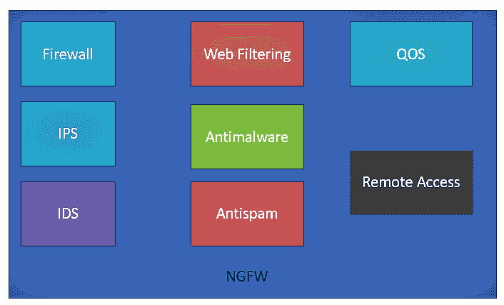

让我们来看看如何选择一款适合企业和性能标准的防火墙。

# 防火墙性能

防火墙的性能是在不同的流量负载下进行测试的，考虑到不同的度量标准来评估防火墙性能。具体的度量标准如下：

+   **吞吐量**：这是每单位时间接收到的实际负载

+   **延迟**：这是数据包从源头到目的地传输的时间

+   **抖动**：这是衡量接收数据包延迟变化的指标

+   **数据包丢失率（PLR）**：这是丢失数据包与总传输数据包的比例

如果您正在升级防火墙或购买新的下一代防火墙，如何选择适合您业务的防火墙？供应商总是告诉您他们的防火墙产品有多好，并贬低其他产品，因此很难直接向他们寻求建议。

你应该首先确定一个功能列表和性能水平，然后决定你希望在其基础上添加什么扩展功能或特性。当然，你还应该考虑预算。

**安全性考虑问题**：

+   流量是否始终在两个方向上进行扫描？

+   所有端口默认是否开放？

+   深度包检测是否默认开启？

+   IPS 和应用控制可以一起运行吗？

**管理性考虑问题**：

+   是否提供事件分析仪表板？

**性能考虑问题**：

+   供应商所声称的性能是否基于真实流量？

+   是否对大量安全策略进行过测试？

**功能性考虑问题**：

+   我需要 VPN 吗？

+   我的网络吞吐量是多少？

+   我需要什么样的许可证和规模——SOHO 还是企业版？

+   我需要高可用性吗？

+   我应该使用软件设备还是硬件设备？

+   防火墙是否支持虚拟化和路由？

+   会话的总数是多少？

+   防火墙是否提供 SSL 吞吐量和远程访问连接？

这些是一些示例问题。根据这些问题的答案，你可以为你的网络选择最佳的防火墙。

# 防火墙位置和设计网络拓扑

当我们谈论防火墙部署架构时，你有两个选择：单一防火墙或多层防火墙。

# 单一防火墙架构

单一防火墙在网络中的位置取决于多个因素，如 IP 子网数量以及防火墙后面提供和托管的服务。我们来看几个场景。

# 单一防火墙架构与单一 IP 子网

在以下图示中，单一防火墙位于 WAN 路由器下方，所有流量都通过此防火墙传输。所有服务器都托管在单一子网中，并由防火墙提供平等的安全保护，从而实现与互联网的隔离。如果服务器之间不需要进一步的隔离，并且不造成重大风险，那么使用单一子网的防火墙可能是合理的：

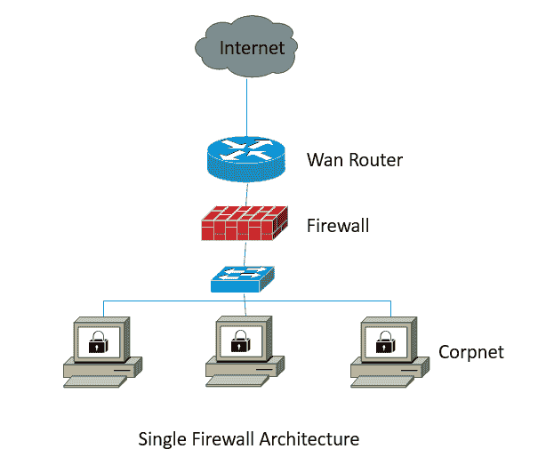

# 单一防火墙架构与多个 IP 子网

如下图所示，一种隔离网络资源的简单方法是在不引入另一套防火墙的情况下，使用配置了多个子网的多个接口。在这个设计中，Web、应用程序和数据库服务器被放置在不同的子网中，使用不同的 IP 子网，并且在接口上配置了不同的安全级别。假设只有一台 Web 服务器需要暴露到互联网，其他服务器则通过内部网络与 Web 服务器通信。通过输入防火墙规则，可以轻松配置和控制这一点。通过将 Web 服务器暴露到互联网并允许互联网子网策略，可以实现这一点。如果防火墙由于配置错误被攻破，攻击者可能会访问所有子网：

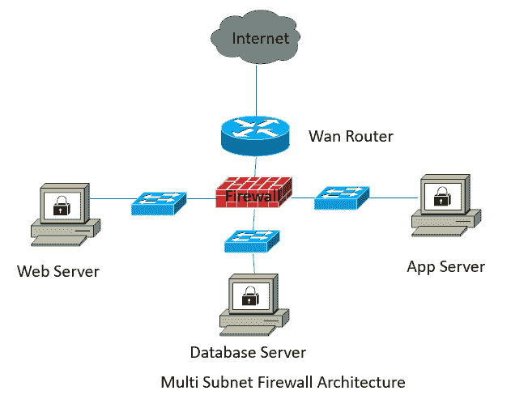

# 多层防火墙架构

多层防火墙安全布局是网络安全策略的一部分。将所有服务都放在一个防火墙后面可能存在风险，并且存在单点故障的隐患。让我们来看看防火墙沙拉安全设计，如何在多层安全保护下保护关键资产：

# 防火墙沙拉设计

企业网络中经常会部署多层防火墙或沙拉设计拓扑。与其将接口专门分配给不同的子网，不如为服务器角色配置独立的防火墙。在这种设计中，基于角色的应用被*夹在*防火墙之间，并且专用防火墙根据应用架构和安全策略调节相邻子网之间的通信。该架构的基本理念是为简单管理专门设置防火墙角色，并寻找支持不同应用段流量的硬件最佳规格：

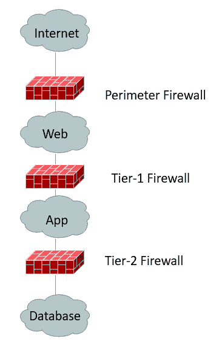

# 非军事区

**非军事区**（**DMZ**）是你的前线，保护重要资产免受不信任环境的直接暴露。换句话说，DMZ 通常是一个暴露于互联网的安全网络段，您可以在其中放置像 web 服务器这样的有价值资源（最常见的互联网应用），通过增加一层额外的安全性来增强应用程序的安全性。仔细规划和设计 DMZ 非常重要，因为在处理生产流量时，修复漏洞可能并非易事。

那么，如何设计 DMZ 呢？大多数时候，管理员会把精力集中在 DMZ 安全性上，**只关注**DMZ 的安全，而忽略了内部数据通信的安全，这些通信用于访问有价值的信息。内部应用访问 DMZ 的路径应尽可能严格限制。

# DMZ 到内部访问策略

内部系统存储着重要数据，不直接暴露在互联网上，但 DMZ 在两者之间起到了代理作用。试想一下，如果 DMZ 服务器被攻破，而内部局域网又没有任何防护，在这种情况下，攻击者可能会找到进入网络的方式。

我们来看一下在 DMZ 中设置 web 服务器的示例。

您必须为您想要保护的内容设定一个基准，并考虑可扩展性、可用性和灵活性。您可以自由选择用于设置 DMZ 的防火墙数量，但两个防火墙是一个不错的起点。使用两个防火墙，您可以将前端服务器放置在外围防火墙（DMZ）后面，并将内部资源放置在另一个防火墙后面。

在这个设计中，您还可以有多种场景。我会尽力覆盖这些场景。可以使用私有 IP 配置 Web 服务器，并通过 NAT 将其转换为公共 IP 以便互联网可访问。然而，您也可以直接在服务器上配置公共 IP。Web 服务器可以配置为双网卡，前端网卡（FE NIC）和后端网卡（BE NIC）。来自互联网的连接将终止于前端网卡，之后会建立新连接以访问应用程序和数据库服务器。由于这是一个 Web 服务器，DMZ 防火墙只需要对端口`80`或`443`设置规则。Tier-1 防火墙上的端口`1433`将允许 Web 与应用程序和数据库服务器之间的连接，假设它是一个 SQL 服务器。

在这个图中，您可以看到已经为公共 IP `2.2.2.2`上的 Web 服务器建立了一个新连接，端口为`80`。一旦该连接到达前端防火墙，NAT 规则将把此连接转换为 Web 服务器的真实 IP `10.10.10.1`。是否使用单一或双接口 IP 进一步连接数据库服务器，现将取决于网卡设计：

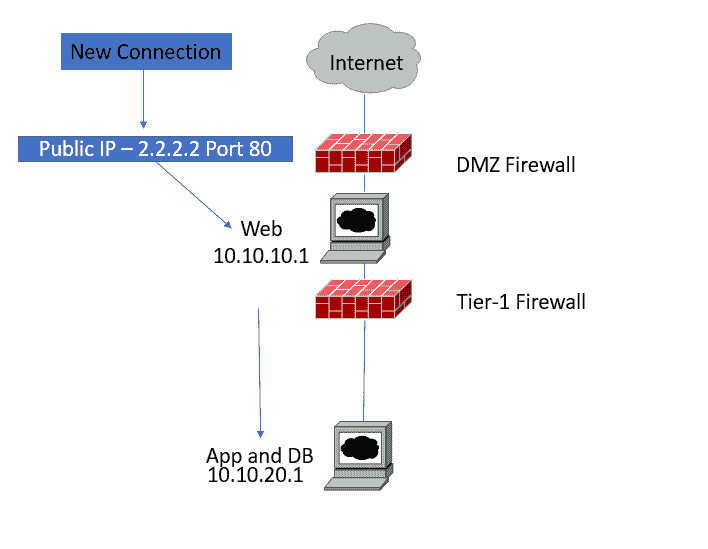

**我真的需要双网卡**吗？当基于单网卡或双网卡时，这种设计也是可行的。考虑到单网卡可能需要调整路由、交换和 NAT 语句以便在私有 IP 空间之间通信，双网卡设计更为安全。双网卡提供了额外的物理层隔离，从而实现更高的安全性。

话虽如此，DMZ 是您网络安全架构中的一个重要部分。

您需要一种方法将服务暴露给互联网世界，但需要以受控且安全的方式进行。要成功创建 DMZ，需要对访问策略和防火墙检测配置有正确的理解。

# OSI 模型与 TCP/IP 模型

在讨论防火墙如何工作之前，我们必须首先了解网络中各个层级如何交互。网络通信基于七层模型，每一层都有自己的职责，以实现通信。防火墙可以在不同层级上运行，以使用不同的标准来阻止或允许流量。

一般来说，防火墙必须在网络层（L3）和传输层（L4）上运行。上层则更像是扫描数据负载中的病毒并进行深度包检测。第 1 层物理层基本上仅仅是网络连接的要求。

TCP/IP，也被称为由**国防部**（**DoD**）开发的互联网模型，是一个简化且实用的**开放系统互联**（**OSI**）模型（1984 年），该模型基于一个理论概念。

OSI 模型基于服务器层级及其具体功能。下图展示了各个层级及其功能：

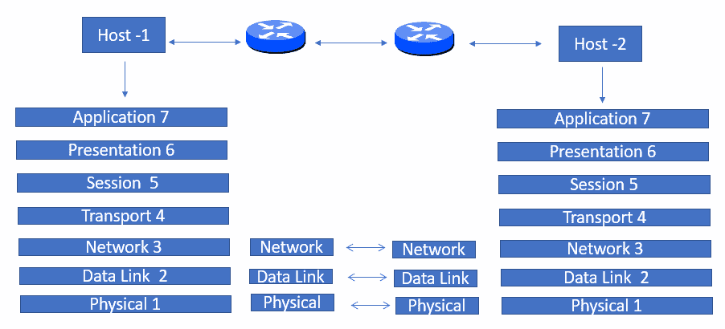

前述图中的各个层级如下：

+   **物理层**：该层通过物理介质连接网络节点，并将比特编码为电信号。

+   **数据链路层**：该层负责物理介质上的错误检测和流量控制。

+   **网络层**：该层负责 IP 路由、交换和网络 IP 地址分配。

+   **传输层**：该层负责传输协议 TCP/UDP 及错误处理。

+   **会话层**：该层负责连接建立和数据流。

+   **表示层**：该层负责数据的标准格式，以及加密和解密。

+   **应用层**：该层提供直接面向用户应用程序的服务，供最终用户通过网络访问。

让我们来看一下 OSI 模型和 TCP/IP 模型之间的区别。在图的右侧，我们可以看到 TCP/IP 模型有四层，包括网络接口层、互联网层、传输层和应用层。TCP/IP 采用自上而下的方法，而 OSI 模型采用自下而上的方法。由于层数较少，这使得它看起来相对简单：

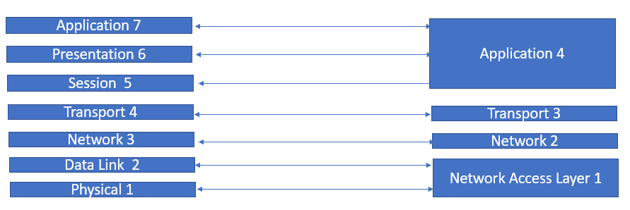

# 防火墙的性能、功能和作用。

到目前为止，我们已经讨论了防火墙的基本功能。还有许多其他功能可以用于多种用途。以下是这些功能：

+   **URL 过滤**：随意上网可能会使网络暴露于恶意软件，从而对组织的安全性造成风险。URL 过滤是一种通过比较网络流量与数据库中的数据来限制访问的方式，从而防止员工访问无效的 URL 或内容。

+   **病毒和恶意软件保护**：NGFW 配备了内建的防病毒引擎和恶意软件保护，能够检查流量并发现恶意感染的文件。

+   **集成 IPS/IDS**：在传统的企业网络中，IPS/IDS 的部署通常作为独立设备。下一代防火墙配备了 IPS/IDS 模块，并可以根据需求启用或禁用。需要考虑的最大问题是我们希望通过 IPS/IDS 设备传输多少流量，并且这些模块应该支持该流量。

+   **服务质量（QoS）**：QoS 是一个网络框架，确保高优先级应用程序的带宽能力。流量可以根据 DSCP 包标记、应用端口、源和目标 IP，以及深度包检测来进行分类，以检测基于应用的方法。

+   **远程访问（VPN）**：通过防火墙代替专用设备来终止 VPN 连接是一个可行的方案。VPN 有多个版本——企业总部与远程位置之间的连接通常基于站点到站点的 VPN。远程访问 VPN 如 SSL、Web VPN 和 IPsec VPN 客户端允许个人用户远程连接企业网络。

+   **高可用性 (HA)**：这是一种将两个或更多防火墙放入同一组并同步其配置，以防止网络中的单点故障的部署方式。高可用性可以通过将防火墙置于活动-被动模式或活动-活动模式下，通过共享流量来实现。

+   **虚拟化**：这是防火墙在虚拟化上下文模式下操作的另一个重要功能或特性。可以根据需求形成拓扑结构，并且上下文可以在活动-被动或活动-活动模式下运行。这在需要客户之间隔离的托管环境中效果最佳。请参考产品文档以查看哪些功能在虚拟化环境中受支持。

# 防火墙管理

防火墙保护企业网络，并在外围防御中发挥关键作用。大多数数据泄露事件都是由于配置错误引起的。因此，企业必须将管理员访问权限交给专家，并避免将安全设置为自动驾驶模式。必须提供实时仪表盘，以便持续监控网络防火墙流量，在损害发生之前识别和响应威胁。

必须实施一些最佳实践，以确保防火墙的正常运行：

+   **变更控制策略**：防火墙规则或策略变更本质上是非常动态的，并且在适应基础设施环境中的新变化或响应新威胁或漏洞时大多是不可避免的。

+   **定期审计配置**：审计是确保防火墙补丁保持最新并确保设备符合 SOX、PCI-DSS 和 HIPAA 等标准的要求。

+   **防火墙规则整合与优化**：随着时间的推移，防火墙将积累成千上万的规则和策略，其中许多规则会变得过时或废弃。这会增加日常任务、故障排除和审计的复杂性，并可能导致防火墙设备的性能问题。通常建议根据应用程序将规则整合成组，并从策略中移除未使用的规则。

+   **威胁检测签名更新**：威胁检测是基于攻击中发现的模式。在日益增长的互联网环境中，每天都会检测到新的威胁。因此，更新签名和微调策略以避免误报变得非常重要。

# 应用代理

应用代理（有时称为应用层网关）通常作为中间层。这些代理应用程序运行在防火墙之上。用户通过 Telnet、FTP 或 Web 连接等应用程序连接网关。系统会提示用户输入要访问的资源，并要求验证其凭证。经过成功认证后，网关将建立与远程应用程序的连接，并在应用程序与最终用户之间转发数据。由于应用网关能够感知应用程序，因此从网关管理的角度来看，它变得非常容易。在典型的防火墙中，端口要么关闭，要么打开，且策略由管理员定义。

在下图中，你可以看到 Tom 将根据配置为 ALG 防火墙的规则进行身份验证，这使得 Tom 可以访问运行在 `20.20.20.1` 上的应用程序。所有其他连接将被拒绝：

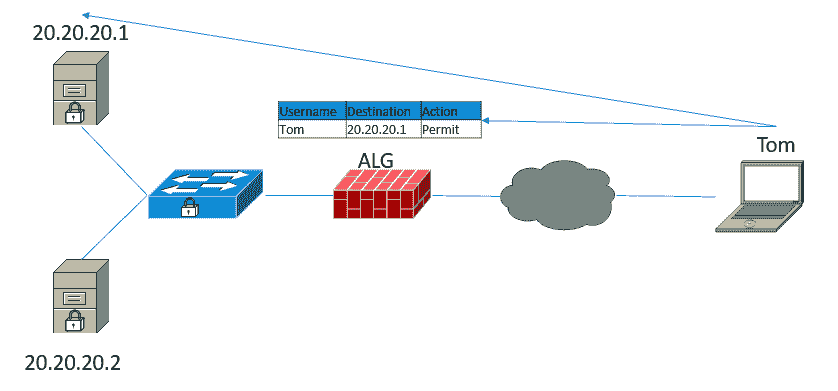

应用网关的最大限制之一是它需要为每个网络服务提供一个单独的应用程序。因此，必须检查防火墙供应商支持哪些服务。ALG 的另一个缺点是每个连接都会增加额外的处理开销。

# 检测防火墙

防火墙保护从小型到大型的基础设施网络免受恶意攻击和不必要的流量。但如果认为输入防火墙就能解决所有问题，那就是错误的。漏洞是任何硬件和软件设备的一部分。最大的漏洞是防火墙的配置错误。一个配置良好、结构设计合理、更新及时且维护得当的防火墙几乎是不可能被突破的。

有几种方法可以帮助你检测位置

防火墙。一个非常简单的方法来定位防火墙是通过 `traceroute`（Unix 工具）或 `tracert`（Windows 工具）。

让我们简要了解一下 `traceroute` 的背景以及它是如何工作的。人们通常说 traceroute 使用 ICMP，这部分是正确的，因为 ICMP 用于错误消息报告。ICMP、UDP 和 TCP 都是第四层协议，IP 数据包包含一个字段 **生存时间（TTL）**。TTL 字段为 8 位，最大值为 255 跳。不同的操作系统使用不同的值。例如，Windows 10 默认使用 128。这里有一种快速的方式可以从命令提示符查找默认值并 ping 本地主机。每当数据包通过路由器或 L3 设备时，TTL 值会减少 1。

这里有一种快速的方式，可以从命令提示符查找默认值并 ping 本地主机。我是在我的 Windows 10 计算机上进行的。你也可以通过 Windows 注册表获取或调整该值：

假设 ICMP 是开放的：查看 traceroute 结果。我从一个在线 trace 门户获取了这个信息，显示最后一跳是 `182.168.6.81`。之后，ICMP 似乎被防火墙阻止：

这是另一个不基于 ICMP，而是基于端口 `80` 上的 TCP 的 traceroute，并到达最终的服务器。当您比较两者时，您可以看到 ICMP 被防火墙过滤：

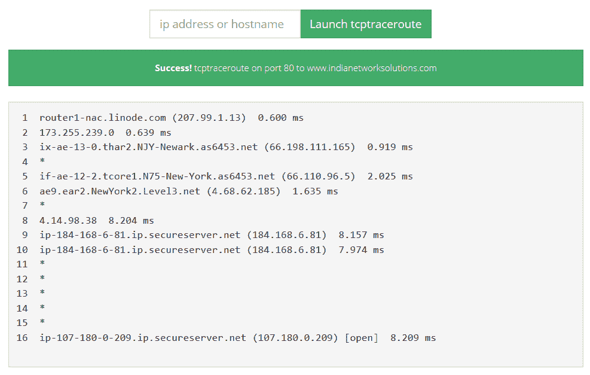

事实上，没有任何方法是 100% 准确的。它们只是为您提供更多信息，以便您可以更准确地猜测是哪台机器在过滤数据包。

一个非常流行的防火墙 Cisco ASA 默认不会执行 TTL 减少，我们必须手动执行这些操作，以便在进行 traceroutes 时查看 ASA 的接口。

**Firewalking** 是一种用于发现受防火墙保护的远程网络信息的技术。Firewalking 在后台使用 traceroute 分析来确定数据包是否可以通过数据包过滤设备传递到目标主机。

防火墙执行 NAT/PAT 功能，多个应用程序可以通过一个公共 IP 在互联网上提供服务。您可以看到一个公共 IP `20.20.20.10`，它与不同端口号上的内部 IP 进行映射。这称为 NAT 操作，由防火墙执行。通过这种方式，您可以创建远程网络的网络拓扑：

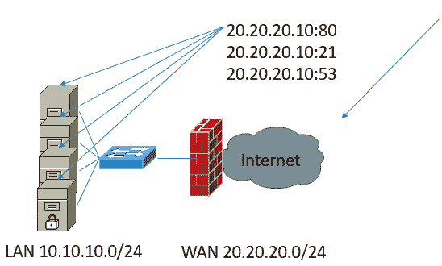

# 调试工具

使用以下调试工具：

+   **ICMP Ping 扫描**：在检查网络中的任何设备时，第一个想到的通常是测试基于 ICMP 的扫描。其工作原理是发送一个 ICMP 请求包，并期待 ICMP 回显回复。其基本思路是获取网络中的在线主机，然后针对这些在线主机启动端口扫描器。Angry IP Scanner 是一个非常流行的网络扫描工具。ICMP 的问题在于网络管理员可以在网络或主机层阻止 ICMP。您还可以轻松创建一个 IP 扫描器脚本，扫描其定义范围内的 IP。

+   **TCP Ping 扫描**：我们已经了解到 ICMP 可能被阻止，因此现在并不非常可靠。然而，代替使用 ICMP，可以通过远程主机发送 TCP syn 到特定端口来进行 ping 探测。然后，您将收到一个 TCP syn-ack 的回复。如果您希望保持您的应用程序在线，这将无法被网络管理员阻止。

+   **ARP Ping**：您可以使用像 NMAP 这样的工具进行 Ping 扫描，如果您在本地子网使用它，它会使用 ARP Ping 而不是 ICMP。NMAP 默认会这样做。

+   **NAMP**：NAMP 可以为您做多项工作，从扫描主机开始。它甚至可以通过漏洞扫描的轻量级功能来检测远程主机的操作系统。

+   **Hping**：Hping 主要用作安全工具，可以用于防火墙测试、端口扫描、网络测试、MTU 发现、进阶跟踪路由和操作系统指纹识别。该工具让你能够构造数据包。我正在使用 Ubuntu 服务器，并且需要安装 hping 包：

让我们看看如何在端口扫描模式下运行此工具。语法包含 0-100（端口范围待扫描）、-S（发送 SYN 包）和`4.2.2.2`（待扫描主机的 IP 地址）作为参数。结果显示，DNS 端口是开放的，这是正确的，`4.2.2.2`是一个 DNS 服务器，因此结果是预期的：

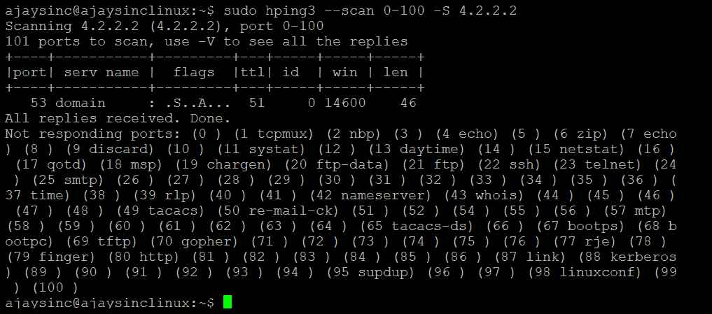

+   **TCP 连接扫描**：TCP 连接可以用作端口扫描，这是一种更简单的探测远程主机的方式。此方法涉及到完整的 TCP/IP 连接，逐步与目标主机的所有 TCP 端口建立连接。TCP/IP 作为协议是可靠的，因此这种端口扫描是一种非常可靠的方式，用于确定给定目标主机上哪些 TCP 服务是可访问的。

在这个例子中，`nmap`工具将尝试以两种方式连接到远程主机。第一种方式是通过语法参数（`-sS`），这意味着会完成一个三次握手。另一种方法是使用一个（`-sT`）工具，像浏览器这样的应用程序在后台连接到远程主机：

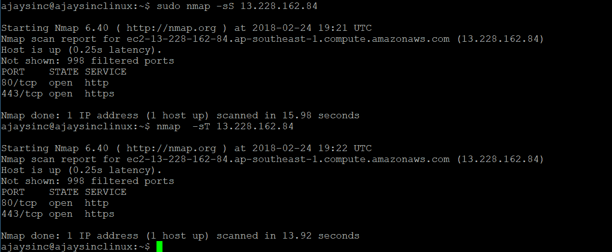

如果目标端口关闭，源主机将直接接收到一个 RST/ACK 数据包。

# 总结

本章向你展示了防火墙的基础知识和防火墙系统的设计考虑因素。你了解了不同代防火墙及其功能，并学习了如何设计一个好的防火墙系统。这可以是设置一个基本的包过滤防火墙，也可以是使用带有 DMZ 的有状态防火墙、ALG 认证用户连接、身份验证用户连接、使用不同的扫描技术探测防火墙后面的主机，以及利用许多其他功能等复杂操作。

在下一章中，我们将讨论公共互联网基础设施中的 VPN 以及 IPsec 框架中的不同属性。

# 问题

1.  以下哪些是防火墙类型？

    1.  包过滤防火墙

    1.  应用层网关

    1.  屏蔽主机防火墙

    1.  所有提到的

1.  应用代理防火墙过滤的位置是：

    1.  物理层 1

    1.  数据链路层 2

    1.  网络层 3

    1.  应用层 7

1.  这个 8 位值标识了数据包在系统中可以停留的最大时间，超过这个时间后会被丢弃：

    1.  分段

    1.  存活时间

    1.  协议

    1.  校验和

# 进一步阅读

欲了解更多信息，请访问以下链接：

+   [`www.juniper.net/documentation/en_US/learn-about/LA_FIrewallEvolution.pdf`](https://www.juniper.net/documentation/en_US/learn-about/LA_FIrewallEvolution.pdf)

+   [`www.ietf.org/rfc/rfc1122.txt`](https://www.ietf.org/rfc/rfc1122.txt)

+   [`www.sans.org/reading-room/whitepapers/firewalls/intrusion-detection-response-leveraging-generation-firewall-technology-33053`](https://www.sans.org/reading-room/whitepapers/firewalls/intrusion-detection-response-leveraging-generation-firewall-technology-33053)
