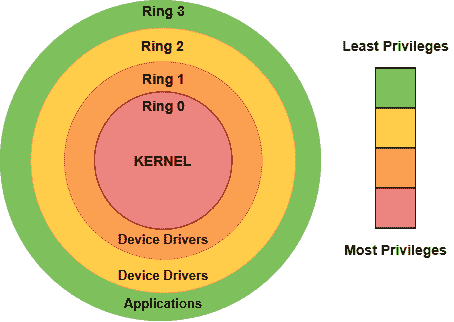
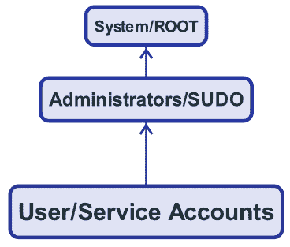
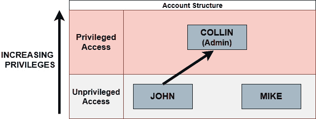
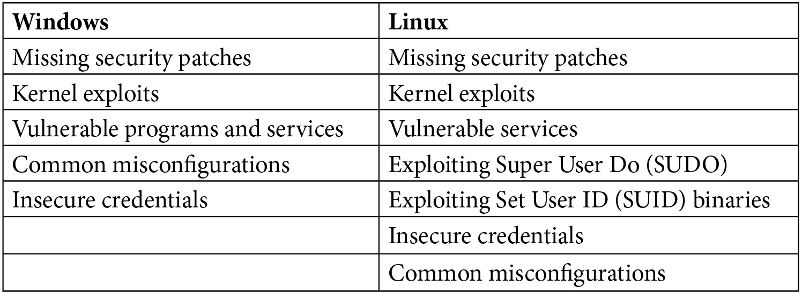
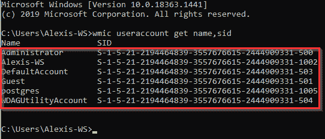
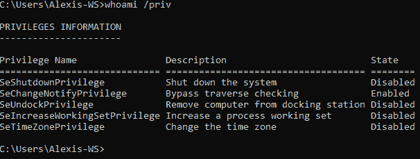
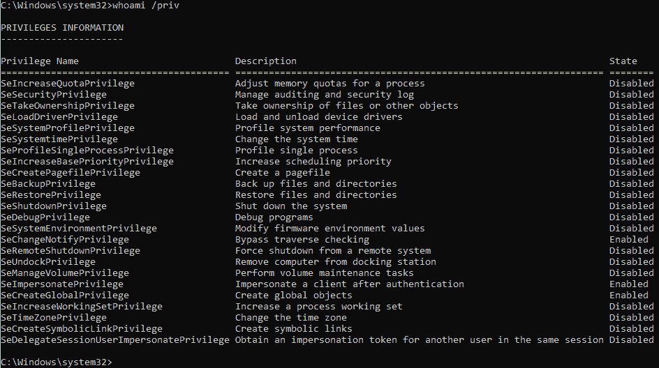

# *第一章*: 权限提升介绍

权限提升是攻击生命周期中的关键环节，也是渗透测试成功与否的主要决定因素。

在渗透测试过程中，权限提升的重要性不可过分强调或忽视。提升你的权限提升技能会让你成为一名优秀的渗透测试员。能够枚举目标系统的信息，并利用这些信息识别潜在的配置错误和漏洞，从而提升权限，这是每个渗透测试员的基本技能。

本章旨在让你更清晰地了解权限提升过程，并作为对各种权限提升技术的正式介绍，同时也会介绍 Windows 和 Linux 系统之间在权限提升过程中的差异。

要全面理解并利用各种权限提升工具和技术，首先需要了解在不同操作系统中权限和特权的实现方式，以及这些设计和实现差异如何整体影响权限提升过程。

到本章结束时，你将清楚地了解什么是权限提升，同时你也会理解 Windows 和 Linux 系统中权限的实现方式，并简要介绍我们将在接下来的章节中深入探讨的各种权限提升技术。

在本章中，我们将覆盖以下主题：

+   什么是权限提升？

+   权限和特权是如何分配的

+   理解 Windows 与 Linux 中权限提升的差异

+   探索权限提升攻击的类型

# 什么是权限提升？

**权限提升**是利用系统中的漏洞或配置错误，将用户权限从一个级别提升到另一个级别的过程，通常是提升到具有管理员或*root*访问权限的用户。成功的权限提升使攻击者能够增强对系统或属于某个域的多个系统的控制，从而能够进行管理性更改、窃取数据、修改或破坏操作系统，并通过持久化手段（如注册表编辑或定时任务）保持访问。

从渗透测试员的角度来看，权限提升是在成功利用系统漏洞后，进行下一步操作的逻辑步骤，通常通过绕过或利用认证与授权系统来执行，这些系统的目的是根据用户的权限和角色隔离用户账户。

一种典型的方法是利用系统的初始访问权限或立足点，获取超出当前用户账户权限范围的资源和功能。这个过程通常被称为获得**root**权限。

在我们开始各种权限提升技术之前，我们需要了解现代操作系统是如何实现用户帐户和权限的。

# 权限和特权的分配方式

为了更好地理解如何提升**特权**，我们需要首先了解操作系统是如何在用户帐户和特权方面进行设计的。

操作系统的授权设计旨在处理多个具有不同角色和权限的用户。角色的这种隔离是现代操作系统中实现不同用户帐户哲学的主要因素。

系统上用户角色和权限的抽象由一个称为**保护环**的系统来设置和促成，如*图 1.1* 所示。它指定了用户在系统上的功能限制并强制执行他们相应的资源访问。

正如名称所示，保护环是一种层级保护和隔离机制，用于提供系统上功能和资源的不同访问级别。等级保护环表示操作系统中的特权层次，如下图所示：

图 1.1 – 保护环

*图 1.1* 中的等级保护环从最有特权的（通常表示为 0 级）到最少特权的按顺序排列，最少特权的表示为最高的环编号。系统上权限的这种隔离导致了两种主要角色的采用，如下所示：

+   **特权访问**：通常分配给根用户或**管理员**帐户，并提供对所有系统命令和资源的完全访问。根用户或管理员帐户通常具有以下功能：

    1\. 安装、卸载和修改系统软件或二进制文件的能力

    2\. 添加、修改或删除用户及用户组的能力

    3\. 创建、访问、修改和删除任何系统或用户数据的能力

    4\. 访问和控制所有系统硬件的能力

    5\. 访问网络功能和网络工具的能力

    6\. 创建、管理和终止系统和用户进程的能力

+   **非特权访问**：通常赋予*非根用户*或标准用户帐户，权限有限，通常针对系统上标准用户访问的特定权限集进行设计和定制。它将用户的功能限制为基本任务以及对系统上用户数据的访问。非根用户帐户通常具有以下功能：

    1\. 启动和停止用户进程和程序的能力

    2\. 创建、修改和删除用户数据的能力

    3\. 访问网络功能的能力

这种权限的隔离突显了权限提升对于渗透测试人员或攻击者的重要性，因为它提供了对系统的完全和无与伦比的控制，或者如果他们能够获得“root”或管理员访问权限，则可能控制一组系统。

根据权限提升攻击与用户帐户和权限的关系，攻击者可以根据他们的意图和目标采用两种主要的权限提升方法，如下所示：

+   水平权限提升

+   垂直权限提升

我们将在下一节中更详细地探讨它们是什么。

## 水平权限提升

**水平权限提升**是访问系统中其他用户帐户的功能或数据的过程，而不是获得具有管理员或 root 权限的帐户的访问权限。它主要涉及使用权限水平相同的帐户访问或授权系统中的功能，而不是访问权限更高、权限更多的用户帐户。

攻击者或渗透测试人员通常会执行这种类型的权限提升攻击，目的是访问没有权限的用户帐户数据，或窃取用户帐户凭证或密码哈希值。

### 场景

以下截图展示了计算机上典型的帐户设置，其中有两个没有权限的用户和一个有权限的用户。在这种情况下，两个没有权限的用户分别是**John**和**Mike**，有权限的用户是**Collin**：

图 1.2 – 水平权限提升场景

在这个场景中，John 正在尝试执行典型的水平权限提升攻击，将他的用户帐户权限提升到 Mike 的帐户权限。请注意，John 和 Mike 处于相同的水平权限级别。

*图 1.2* 清晰地概述了水平权限提升的唯一目标，目标是将权限提升到与执行攻击的用户帐户处于同一水平的用户帐户。

## 垂直权限提升

**垂直权限提升**是利用操作系统中的漏洞来获取系统的 root 或管理员访问权限的过程。由于权限和功能的巨大回报，攻击者和渗透测试人员通常更偏向于这种方法，因为它们现在对系统拥有完全的访问和控制权限。

以下截图概述了用户帐户权限和特权的自下而上的方法，其中最顶部的帐户具有最高的权限，最不容易访问，通常分配给系统管理员。最底层的帐户设置和配置为标准用户和无需管理员权限的服务使用，这些服务在日常任务中不需要管理员权限：

图 1.3 – 垂直特权提升

*图 1.3* 同样展示了一个基于用户账户和权限的垂直特权提升方法，适用于 Windows 和 Linux 系统，目标是横向提升到特权最高的账户，从而获得系统的完全访问权限。

重要提示

垂直特权提升可能不仅仅来源于操作系统或服务中的漏洞利用。常见的情况是系统和服务配置错误，可能允许非管理员用户账户以管理员权限运行命令或二进制文件。我们将在接下来的章节中探讨各种特权提升技术。

### 场景

以下截图展示了计算机上典型的账户设置，其中有两个非特权用户和一个特权用户。在这种情况下，两个非特权用户分别是**约翰**和**迈克**，而特权用户是**科林**：

图 1.4 – 垂直特权提升场景

在此场景中，*图 1.4* 展示了一个传统的垂直特权提升方法，其中用户约翰试图将特权提升到管理员账户，即科林的账户。如果成功，约翰将获得管理员特权，并能够访问所有用户账户和文件，从而完全控制系统。此场景展示了成功的垂直特权提升攻击的重要性和潜在影响。

现在我们已经了解了两种主要的特权提升方法以及它们的运作方式，我们可以开始查看 Windows 和 Linux 上特权提升之间的各种区别。

# 了解 Windows 和 Linux 上特权提升的区别

现在我们对用户账户和权限的实现有了大致了解，并且查看了两种主要的特权提升方法，我们可以开始了解在特权提升攻击的背景下，**Linux** 和 **Windows** 之间的差异，以及它们各自的设计和开发理念如何影响特权提升过程。

这种细致的方法将帮助我们清晰地了解两个操作系统及其相应内核在漏洞和潜在利用方面的优缺点。

以下表格概述了两种操作系统及其服务中可以被利用来提升特权的常见潜在**攻击向量**：

表 1.1 – 常见潜在攻击向量

为了全面理解这两种操作系统在潜在漏洞和攻击路径方面的差异，我们需要了解它们如何处理身份验证和安全性，因为这将帮助我们发现安全隐患。然而，值得注意的是，Windows 和 Linux 之间的安全差异归结于它们独特的设计理念。

## Windows 安全

Windows 是一个由微软公司拥有和开发的专有操作系统，占据了大约 93% 的 PC 市场份额，这意味着大多数公司很可能在其最终用户设备上运行 Windows 客户端，或者在其关键基础设施中部署 Windows Server。

因此，Windows 更有可能运行在员工的笔记本电脑和工作站上，因为它具有更加**以用户为中心的设计**（**UCD**）和理念。为了理解 Windows 上的特权提升过程，我们需要了解 Windows 如何管理和维护系统安全。为此，我们需要更详细地查看负责管理和维护 Windows 身份验证和安全性的各种组件。

### 用户身份验证

身份验证是验证试图访问系统或系统资源的用户身份的过程。

现代操作系统中的身份验证通常是通过用户名和密码组合来强制执行的；然而，操作系统已开始实现附加的身份验证层，并且为用户密码实现更强大的加密算法。

密码和密码散列通常是渗透测试人员的目标，我们将在本书后面介绍如何提取系统密码和散列值。

Windows 上的用户身份验证由**Windows 登录**（**Winlogon**）进程和**安全账户管理器**（**SAM**）处理。SAM 是一个用于管理和存储 Windows 系统上用户账户的数据库。

现代版本的 Windows 使用**新技术局域网管理器 2**（**NTLM2**）加密协议进行密码散列和加密，远远强于旧版本 Windows 中的**局域网管理器**（**LM**）加密协议。

Windows 上的域身份验证通常通过诸如 Kerberos 等身份验证协议来实现。

### 用户识别

用户识别用于唯一标识系统中的用户，并用于建立一个责任体系，因为在系统上执行的操作可以追溯到执行它们的用户。了解 Windows 上如何实现和运作用户识别，对于特权提升过程中的用户识别非常有用，可以帮助识别系统中的用户、他们的角色和组。

在 Windows 中，用户身份验证过程使用 **安全标识符**（**SID**）进行识别。每个用户和组都有一个唯一的 SID，该 SID 由以下截图中列出的组件组成：

图 1.5 – 示例 Windows SID

以下是前述 SID 的不同参数说明：

+   **SID 字符串**: **S** 表示这是一个 SID 字符串

+   **修订版**: 始终设置为 1；这是指结构的修订号

+   **权限 ID**: 指明谁创建或授予了 SID，如下所示：

    - **空值**: 0

    - **全局权限**: 1

    - **本地权限**: 2

    - **创建者权限**: 3

    - **非唯一权限**: 4

    - **NT 权限**: 5

+   **子权限 ID**/**实际 ID**: 用户的唯一标识符，或者包含域标识符

+   **RID**: 代表 **相对 ID**，用于与其他账户进行区分。Windows 将为特定用户分配以下唯一的 RID。能够根据 SID 识别特权用户非常重要，如下所示：

    - **管理员**: 500

    - **来宾用户**: 501

    - **域管理员**: 512

    - **域计算机**: 515

你可以通过在 **命令提示符**（**CMD**）中运行以下命令来枚举 Windows 系统上的 SID：

wmic useraccount get name,sid

此命令将枚举系统上所有用户账户的 SID，如下图所示。请特别注意 RID，因为它们可以用来快速识别管理员和来宾账户：

图 1.6 – 枚举 Windows SIDs

如 *图 1.6* 所示，我们可以根据 RID 来识别用户角色，而无需关注账户用户名。在这个特定的例子中，我们设置了管理员和来宾账户，它们可以通过 RID 被识别。

### 访问令牌

访问令牌是描述和标识系统中进程或线程安全上下文的对象。每次用户成功认证时，访问令牌由 Winlogon 进程生成，并包含与线程或进程关联的用户账户的身份和权限。然后，该令牌被附加到初始进程（通常是 **userinit.exe** 进程），之后所有子进程将继承来自其创建者的访问令牌副本，并在相同的访问令牌下运行。

在 Windows 上，访问令牌将包含以下元素：

+   用户 SID

+   组 SID

+   登录 SID

+   分配给用户或用户组的权限

+   **自主访问控制列表**（**DACL**）正在使用

+   访问令牌的来源

我们可以通过在 CMD 中运行以下命令列出用户的访问令牌：

Whoami /priv

如果用户没有特权，则访问令牌将被限制，如下图所示：

图 1.7 – 限制访问令牌

需要注意的是，*图 1.7* 中高亮的用户具有管理权限；然而，**cmd.exe** 进程使用的访问令牌限制了权限。如果我们以管理员身份运行 **cmd.exe**，该用户的访问令牌将列出所有权限，如下截图所示：

图 1.8 – 特权访问令牌

访问令牌可以在特权升级过程中通过诸如主访问令牌操控攻击等手段加以利用，该攻击通过欺骗系统使其相信一个进程属于不同的用户，而不是启动该进程的用户。我们将在本书后续部分学习如何利用这一攻击途径来提升我们的权限。

## Linux 安全性

Linux 是一个免费的开源操作系统，包括由 Linus Torvalds 开发的 Linux 内核和**GNU 的非 Unix**（**GNU**）工具包。GNU 工具包是由 Richard Stallman 最初启动和开发的软件和实用工具的集合。这些开源项目的结合构成了 Linux 操作系统的整体，通常称为 GNU/Linux。

通常，大多数个人和公司可能会运行 Windows 客户端，并且会使用 Linux 作为其关键基础设施——例如邮件服务器、数据库、网页服务器和**入侵检测系统**（**IDSes**）。鉴于 Linux 服务器在组织中的性质和部署方式，攻击更有可能严重影响公司并造成重大干扰。

### 用户身份验证

Linux 上的用户账户详细信息存储在 **/etc/passwd** 文件中。此文件包含用户账户用户名、**用户 ID**（**UID**）、加密密码、**组 ID**（**GID**）以及个人用户信息。

该文件可以被系统中的所有用户访问，这意味着系统中的任何用户都可以检索其他用户的密码哈希值。这使得在 Linux 上的哈希转储过程变得更加直接，也为潜在的密码破解攻击敞开了大门。大多数较老的 Linux 发行版使用 **消息摘要算法 5**（**MD5**）哈希算法，这种算法更容易破解，因此大多数较新的发行版已经开始使用并实施 **安全哈希算法 256**（**SHA-256**）加密协议，使得破解哈希变得更加困难。

### 身份识别

Linux 上的用户身份验证通过使用与唯一 UID 对应的用户名来实现，UID 是一个数值，由系统管理员自动分配或手动分配。Linux 上的 root 账户的 UID 始终为 0。

这些用户信息以及加密后的用户密码存储在**/etc/passwd** 文件中。

### 访问令牌

Linux 上的访问令牌与 Windows 上的工作方式类似，但它们存储在内存中（**随机访问内存**，或 **RAM**），并在初始化时附加到进程上。

Linux 上的访问令牌将包含以下信息：

+   用户账户的 UID

+   用户所属组的 GID/GIDs

+   用户权限

+   主要组 UID

+   **访问控制列表**（**ACL**）条目

现在我们对 Windows 和 Linux 上使用的各种身份验证和安全组件有了基本了解，我们可以看看各种类型的权限提升攻击及它们如何利用上述安全机制。

# 探索权限提升攻击的类型

现在我们可以探讨最常见的权限提升攻击及其工作原理。目标是对可用的权限提升攻击类型有一个基本的了解，并理解它们是如何被利用的。

在接下来的章节中，我们将深入探讨如何在 Windows 和 Linux 系统上利用这些漏洞。

## 内核漏洞利用

内核漏洞利用是影响 Windows 和 Linux 系统的程序或二进制文件，旨在利用底层内核中的漏洞，以提高权限或获取“root”权限来执行任意代码。

漏洞利用过程是多方面的，需要进行大量的枚举，以确定操作系统版本和已安装的补丁或热修复程序，从而判断系统是否受到内核漏洞的影响，接着可以通过各种漏洞库（如 **exploit-db**）获取内核漏洞利用代码。漏洞代码应该被检查并根据所需的参数和功能进行定制。定制完成后，代码可以编译成二进制文件并传输到目标系统上执行。在某些情况下，如果漏洞利用代码依赖于某些依赖项，则需要在目标系统上下载并编译。

成功编译并执行二进制文件后，内核漏洞利用将通过 shell 提示符授予攻击者在目标系统上“root”访问权限，攻击者可以使用“root”权限在系统上运行命令。

在许多情况下，Windows 系统的预编译内核漏洞利用代码已经在线存在，并且可以直接下载和执行，从而完全避免了编译过程。然而，在编译之前，检查和分析漏洞利用代码非常重要，因为漏洞代码可能包含恶意代码或有效负载。

重要说明

内核漏洞利用是非常强大的；然而，它们可能导致系统崩溃和内核恐慌，这会阻碍权限提升过程，并可能对系统造成损害。

## 利用 SUID 二进制文件

**SUID** 是一个内建的 Linux 特性，允许用户以其他用户的权限执行二进制文件和文件。

该功能通常用于允许非 root 账户以 root 权限运行系统工具和二进制文件。您可以将程序或工具的 SUID 权限设置为“root”所有者。这样，每当非 root 用户执行该程序或工具时，它将以“root”权限运行。攻击者可以利用或利用 SUID 配置错误，以 root 权限运行任意命令。

例如，允许执行任意命令的程序或二进制文件，如**vim**，不应将其 SUID 所有者设置为“root”，因为非 root 用户可以利用 **vim** 中的命令执行功能，以“root”权限运行命令。

## 利用易受攻击的服务和权限

**服务**提供了攻击者最大的威胁面，因为在 Windows 和 Linux 系统上运行的程序和服务种类繁多且各不相同。

攻击者通常会目标是识别错误配置或易受攻击的服务和程序，这些服务和程序可能促成权限提升。例如，在 Linux 系统上，攻击者会尝试识别并利用 **cron jobs** 的配置错误，利用其功能执行任意代码或恶意二进制文件。

利用 Windows 上的易受攻击或不安全服务通常涉及在具有管理员权限的服务中嵌入有效负载。当服务执行时，它以管理员权限执行有效负载，从而允许二进制文件以“root”权限执行命令。

## 不安全的凭证

这一技术涉及搜索系统上由用户存储的不安全凭证，或通过破解弱用户凭证的过程来进行。许多用户——甚至是系统管理员——会将密码以明文形式记录在文档、电子表格和配置文件中，用于各种服务账户。这些文件可以通过运行专门的搜索查询和各种命令行工具来找到。

其中一个例子是使用 Linux 上的 **find** 命令行工具来定位具有特定扩展名和文件名的文件。

## 利用 SUDO

攻击者通常会瞄准具有 **SUDO** 权限的用户。SUDO 允许用户以其他用户身份（通常是 root 用户）运行命令。

SUDO 权限通常由管理员手动配置，这使得可能存在配置错误的风险。例如，管理员可以为某些命令行工具（如 **find** 或 **vim**）分配 SUDO 权限，这些工具可以运行 shell 命令或任意代码。

攻击者可以利用这一点运行任意代码或以“root”权限执行命令。

重要提示

SUDO 是一种 Linux 命令和权限设置，允许用户以超级用户或“root”权限运行命令或程序。

这些只是一些可以在 Windows 和 Linux 系统上使用的权限提升攻击和技术。我们将在接下来的章节中详细介绍如何使用这些技术。

# 总结

本章向你介绍了权限提升过程，解释了现代操作系统中如何实现特权和用户账户，并探讨了 Windows 和 Linux 系统中权限提升的区别。还重点讲解了最常见的权限提升技术，并解释了如何利用它们。

现在你应该对权限提升过程有了较好的理解，了解了权限和特权是如何实现的，以及在 Windows 和 Linux 上使用的各种渗透测试技术。

在下一章中，我们将开始设置我们的虚拟环境，并准备我们的渗透测试分发版。我们还将了解我们将使用的各种工具和框架，以增强和优化权限提升过程。
