# 3

# 理解被动侦察

随着越来越多的人和组织连接到全球最大的网络——互联网，它正成为一个巨大的存储媒介。许多人正在各种网站和在线平台上上传各种类型的数据。虽然互联网被称为*信息高速公路*，使得全球人民能够共享信息和协作，但它也已成为存储有关个人、组织、系统和网络数据的媒介。这些信息可能被恶意对手利用，计划未来对目标的网络攻击。作为一名有志成为道德黑客的人，理解对手如何发现并利用公开信息来建立目标的个人资料，从而提升其网络行动策略和技术，是非常重要的。

在本章的学习过程中，你将了解被动侦察的基本原理和重要性，以及行业专家如道德黑客和渗透测试人员使用的最佳实践，并了解这些技术如何与对手的行为相对接。此外，你还将探索**开源情报**（**OSINT**）的基础知识，了解它如何帮助组织减少攻击面。此外，你还将学习作为道德黑客如何在执行被动侦察时有效地隐藏你的在线身份，并如何匿名化你的互联网流量。

在本章中，我们将涵盖以下主题：

+   探索被动侦察

+   开源情报（OSINT）基础

+   隐藏你的在线身份

+   匿名化你的网络流量

让我们开始吧！

# 技术要求

为了配合本章的练习，请确保你已经满足以下硬件和软件要求：

+   Kali Linux: [`www.kali.org/get-kali/`](https://www.kali.org/get-kali/)

+   如何在 Kali Linux 上设置**洋葱路由器**（**TOR**）服务和浏览器的说明：[`www.kali.org/docs/tools/tor/`](https://www.kali.org/docs/tools/tor/)

# 探索被动侦察

随着时间的推移，互联网正变得对许多人和组织来说越来越有价值，帮助每个人跨越传统边界与他人合作和分享想法。互联网最初被称为信息高速公路，允许拥有互联网连接和计算机的用户轻松访问网站、参与在线论坛和社区，以及进行电子商务交易，而无需访问传统的*实体店铺*。

在今天的世界中，配有数据计划的智能手机使用户能够在几秒钟内轻松访问互联网及其资源。例如，假设你想在网络安全行业提升自己的职业生涯，并希望找出你所在地区正在招聘专业人员的组织。使用智能手机上的网页浏览器和 Google 搜索，你可以快速研究所在地区的顶级网络安全组织，查看它们的招聘门户，并探索它们的招聘流程。此外，你还可以进一步了解这些组织的使命、愿景、核心价值观、面试流程和小组，以及合适候选人的职位职责和要求。然而，一些组织在招聘信息中泄露了过多数据，这些数据被攻击者利用来策划未来的网络攻击。

每天，世界各地的许多人使用互联网并上传文档、音频、视频和其他文件类型。当用户决定删除内容时，这些数据并不会自动从互联网上消失。例如，**互联网档案馆**是一个公共数字图书馆，它索引并记录过去 20 年间互联网上的所有信息。简单来说，如果你在互联网上上传或创建了某些内容并删除它，它并不会真正从互联网上消失，因为可以通过互联网档案馆的**网络时光机**检索，查看互联网上的历史数据。因此，攻击者利用从互联网档案馆收集的目标数据来增强他们的攻击。

下图展示了网络时光机，任何人都可以在搜索框中输入**统一资源定位符**（**URL**）：


图 3.1 – 网络时光机

一旦输入有效的 URL，网络时光机会检查其档案记录，查找网站的快照并提供时间线，允许用户选择可用的日期以查看该时间点的网页。

重要提示

要了解更多关于互联网档案馆、网络时光机及其资源的信息，请访问 [`archive.org/`](https://archive.org/)。

数据隐私是全球关注的一个主要问题，越来越多的人、组织和政府意识到机密数据对拥有恶意意图的任何人，如对手和其他威胁行为者的影响。访问网站时存在许多数据隐私问题，例如用户的数据是否被收集以及网站所有者将如何使用这些数据。例如，一些网站没有为其用户提供任何安全保护，并会在网页服务器和用户的网络浏览器之间以明文传输数据，使对手能够拦截和捕获任何敏感数据。例如，网站将 cookie 插入访问者的网络浏览器中，这使网站能够跟踪访问者的活动和用户信息，同时改善用户体验。如果威胁行为者捕获并分析 cookie 中的数据，对手将能够检索**会话 ID**并确定用户的网络活动。如果用户在网站上进行了身份验证，会话 ID 使威胁行为者能够在不知道受害者用户凭据的情况下未经授权地访问受害者在同一网站上的帐户。

随着互联网的发展，许多社交媒体网站应运而生，使人们能够通过在线数字平台与家人、朋友和同事进行数字连接并分享更新。在过去的十年里，社交媒体平台已经发展壮大，许多人和组织利用这些平台创建在线社区，宣传他们的产品和服务，并分享新闻和更新。虽然社交媒体网站鼓励每个人互相连接，但重要的是要理解这些网站创建了一个**人际网络**，这些人通过共同的联系相互联系在一起。例如，当您以登录用户的身份访问社交媒体平台上的某人个人资料时，平台会显示您的共同联系或朋友。如果您点击一个共同联系，您将被重定向到该人的个人资料，您可能会看到其他共同联系或朋友，这样就创建了一个以某种方式相互连接的人际网络。

尽管社交媒体平台帮助人们保持数字连接，但有些人的在线个人资料可能比其他人更不安全，可能会泄露您的数据给威胁行为者。例如，如果您不使用社交媒体而其他人使用，您可能会出现在由您的家人、朋友或同事发布的照片中，这些人可能拥有不太安全的个人资料。这为威胁行为者提供了使用面部识别确定照片中人物身份，并使用 Google Images 进行**反向图像搜索**以确定包含类似照片的任何网站以确定某人或某物的身份或位置的机会。

提示

要了解更多关于高级谷歌搜索的信息，请参考*第四章**，域和 DNS 情报*。要了解更多关于反向图像搜索的信息，请参考*第六章**，图像、人员和* *信号情报*。

以下图显示了谷歌图片上的**按图搜索**功能：


图 3.2 – 谷歌图片

重要提示

谷歌图片利用**Google Lens**，一种先进的图像识别技术，帮助识别位置、文本和物体。

威胁行为者和道德黑客使用许多数据源收集有关组织和个人的信息。**数据经纪人**是一些组织，它们在未获得许可的情况下购买、收集、分析和出售有关人员和组织的数据。数据经纪人通常向全球的广告机构、人员搜索引擎、金融机构和营销公司等任何人出售数据。数据经纪人从许多来源收集数据，包括在用户网络浏览器上放置的网站 cookie 中找到的跟踪信息、从安装在智能手机和平板电脑上的移动应用程序收集的使用信息，以及在互联网上找到的公共信息。

数据经纪人分析和处理收集到的数据，创建关于全球数百万人的档案和档案，包括他们的活动、偏好和厌恶、旅行和健康状况以及居住地点。这些公共信息的可用性可以被针对用户、一群人或组织的威胁行为者利用。

到目前为止，您已经了解到互联网目前被用作各种类型数据的大规模存储介质，任何拥有互联网连接的人都可以访问公共数据。这意味着威胁行为者可以花费大量时间调整他们的互联网搜索，从各种在线来源收集特定数据，目的是创建一个档案并了解他们目标的攻击面。

**侦察**是威胁行为者和道德黑客用来收集可用于发现和利用目标安全漏洞的信息的策略和技术。以下是侦察的两个类别：

+   **被动侦察**

+   **主动侦察**

被动侦察是指威胁行为者或道德黑客不直接与目标互动或连接，而是严重依赖公开可用信息来收集可用于破坏目标的情报。

进行被动侦察的关键优势如下：

+   **增加隐蔽性**：被动侦察中使用的技术确保威胁行为者或道德黑客不会直接与目标交互。这减少了被安全系统检测到的可能性。

+   **更多数据来源**：互联网包含了大量的信息，这些信息可以在网站、社交媒体平台和互联网搜索引擎上找到，并可供道德黑客进行被动侦察。

+   **减少法律风险**：由于被动信息收集涉及从公开来源收集数据，这一过程不像主动侦察那样具有相同的风险，通常是合法的。

+   **降低成本**：由于道德黑客从互联网收集公开可用的信息以创建目标的资料，因此与主动侦察相比，被动侦察通常成本较低，并且不需要相同的资源。

+   **提高安全性**：由于道德黑客收集的是互联网中的公开信息，因此他们遭到检测的风险较低。因此，与主动侦察相比，使用被动侦察是一种更安全的选择。

虽然被动信息收集被威胁行为者和道德黑客普遍使用，但也存在一些缺点，例如：

+   **数据有限**：由于被动侦察利用的是公开可用的信息，因此找到的数据可能已经过时或不准确，并且访问可能受到限制。

+   **不准确的数据**：使用被动侦察收集信息可能导致收集到关于目标的不准确或误导性数据，这可能进一步导致发现虚假网站并做出不准确的结论。因此，道德黑客依赖于从互联网收集的信息的可用性和准确性。

+   **耗时**：互联网包含大量数据。道德黑客可能需要花费大量时间来从各种数据源中定位和收集关于目标的特定数据。

然而，主动侦察使威胁行为者或道德黑客能够直接与目标系统进行交互或连接，以获取在被动侦察中不太可能收集到的特定细节。它通常涉及道德黑客使用专门的工具和技术发送探针，来确定系统的技术架构、操作系统、运行的服务和开放端口，以及安全漏洞。与被动侦察不同，主动侦察技术更加侵入性，且被检测到并触发安全系统警报的风险较高。

重要说明

由于主动信息收集技术是侵入性的，因为它们会收集关于系统的敏感细节，所以通常在未获得合法许可之前，不允许对系统进行扫描。

道德黑客和渗透测试员使用与真实黑客相同的技术，高效地确定攻击面并识别组织中的安全漏洞及其相关的安全风险。那么，使用相同的技术来危害属于组织的系统和网络，不是违法的吗？简单的回答是，是的，因为黑客攻击通常是非法的。然而，道德黑客和渗透测试员在开始任何客户系统和网络的工作之前，必须从相关当局那里获得合法许可。

以下是道德黑客使用与真实黑客相同技术的几个好处：

+   **高效测试系统安全性**：使用与威胁行为者相同的技术，道德黑客能够高效测试系统的安全性是否按预期工作，或是否存在潜在的安全漏洞。

+   **高效发现安全漏洞**：通过对组织的系统进行真实世界网络攻击的模拟，道德黑客能够高效发现隐藏的安全漏洞，并提出应对措施，防止或缓解真实网络攻击的发生。

+   **提高安全意识**：许多组织并未完全理解网络攻击对其系统和网络的影响。通过模拟真实的网络攻击，伦理黑客能够展示如果发生真实网络攻击时的影响和严重性。总体而言，它提高了网络安全对组织决策者的重要性。

+   **提供证据**：由于道德黑客使用与真实黑客相同的技术来测试系统的安全性并发现隐藏的安全漏洞，伦理黑客可以收集关于安全漏洞的有力证据，并了解它们的严重性风险级别，这些证据可以帮助组织的安全团队优先分配资源，以提升其安全防护能力。

+   **保持更新**：由于每天都有新的网络攻击和威胁，道德黑客和渗透测试员始终需要保持对真实黑客使用的最新技术的了解，以高效测试系统中的隐藏安全漏洞。

+   **发现数据泄露**：许多组织泄露了关于自身的数据，这些信息可能被真实黑客用来策划未来针对目标的网络攻击。

为了更好地理解应该收集哪种类型的数据以及如何处理这些数据以创建有意义的信息，让我们先了解一下足迹分析的概念。

## 理解足迹分析

使用互联网查找和收集有关个人或组织的敏感数据，对许多人来说都很吸引人，尤其是那些有志成为道德黑客和渗透测试员的人。然而，如果我们不了解自己要寻找的是什么，以及如何处理和转换这些数据，将其转化为对我们开发目标档案有意义的信息，那么收集大量数据是没有意义的。

**信息收集**是威胁行为者和道德黑客用于收集目标特定细节的技术，例如主机操作系统、开放端口和运行的服务。通过信息收集收集到的信息可以被道德黑客用来识别可以被利用的安全漏洞，从而未经授权访问系统、网络或组织。此外，信息收集有助于道德黑客更好地了解组织的安全态势及其基础设施。

以下图展示了信息收集与侦察之间的联系：

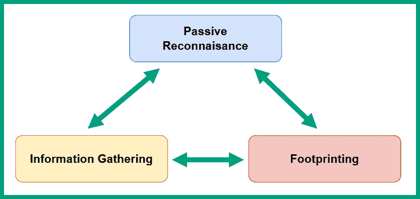

图 3.3 – 信息收集

在信息收集过程中收集的数据通常分为以下几类：

+   系统信息

+   网络信息

+   组织信息

系统信息帮助道德黑客确定设备上运行的内容，例如主机操作系统、运行的服务和应用程序，以及用户名和密码。道德黑客可以利用操作系统信息来研究和识别操作系统是否存在漏洞并且可以被利用。在许多组织中，存在过时且容易受到攻击的应用程序和服务，这为道德黑客提供了识别和利用运行服务中的安全漏洞，以未经授权的方式访问目标的机会。此外，道德黑客还可能能够获取有效的用户凭证，这些凭证可以用于未经授权地远程访问目标系统。

网络信息帮助道德黑客识别网络中系统之间是否存在易受攻击的网络协议和服务。许多常见的网络协议在设计时并未考虑到安全性，因此使得威胁行为者能够利用它们的安全漏洞进行网络攻击。攻击者可以拦截并识别敏感的网络信息，如**域名系统**（**DNS**）、**链路本地多播名称解析**（**LLMNR**）、**地址解析协议**（**ARP**）、域名、子域名以及防火墙规则。例如，如果威胁行为者捕获 DNS 查询和回应，攻击者可能能够识别出组织的 DNS 服务器，并尝试获取内部主机名和 IP 地址。

重要提示

**DNS**是一个应用层协议，它使系统能够将主机名解析为 IP 地址。**LLMNR**是一个二层协议，使得系统能够在**局域网**（**LAN**）上解析主机名。**ARP**是一个网络协议，允许系统将 IP 地址解析为**媒体访问控制**（**MAC**）地址。

脆弱的网络协议，如 LLMNR 和 ARP，容易受到各种基于二层的攻击，这使得攻击者能够拦截并向网络中的主机注入未请求的数据包。此外，识别一个组织的域名可以集中精力列举子域名。一些组织可能对其主域名实施额外的安全控制，但忽视了某些子域名。攻击者可以识别是否通过攻破一个脆弱的子域名，能够获得未授权访问组织网络的权限。

组织信息有助于道德黑客识别公司的员工，员工的联系信息，如电话号码和电子邮件地址，以及展示具有高级权限用户账户的高层员工的组织结构图。组织信息可以在规划各种社会工程攻击时发挥作用，例如针对组织员工的鱼叉式钓鱼电子邮件攻击。

虽然道德黑客和威胁行为者使用的方法各不相同，但以下是一套常见的指南，用于开始对目标进行足迹分析：

+   使用互联网搜索引擎

+   执行高级 Google 搜索（**Google 黑客/Google Dorking**）

+   从社交媒体网站收集信息

+   从目标网站收集信息

+   对来自目标的电子邮件消息进行足迹分析

+   使用在线域名注册表检索域名信息

+   执行 DNS 信息收集

+   执行网络足迹分析

+   执行社会工程学攻击

提示

道德黑客可以使用 Google Dork **"login" site:microsoft.com** 查找与 **microsoft.com** 域名相关的登录页面，或者使用 **site:microsoft.com AND intitle:"login"** 查找包含 **login** 关键字的页面。

你将在下一章探索上述技术，该章聚焦于高级情报收集，旨在帮助发展道德黑客和渗透测试人员所需的行业技能。完成这一部分后，你已经掌握了被动信息收集的基础知识，并学会了如何利用互联网收集目标数据。在下一部分，你将学习 OSINT 的基础知识，以及它如何帮助道德黑客对目标进行分析。

# OSINT 基础知识

OSINT（开放源情报）仅仅是道德黑客用来搜索、收集和分析互联网上公开资源中数据的过程和技术。虽然每天有很多人上传各种类型的数据到互联网，伦理黑客可以利用这些数据创建个人资料，从而更好地了解他们的目标。虽然 OSINT 看起来可能只是像使用谷歌搜索引擎那样简单，来寻找问题的答案，但很多人通常只会使用搜索结果第一页显示的信息和资源，因为这些内容通常最符合搜索条件。然而，并不是很多人会查看搜索结果的后续页面，比如第 2 到第 10 页，以判断搜索条件的答案是否准确，并且是否为用户提供了全面的细节。

伦理黑客花费大量时间从各种公开来源收集数据，以确保足够的数据被收集到关于他们的目标；然而，这些数据并不总是提供有意义的背景和上下文，需要通过彻底分析来创造意义，使伦理黑客能更好地理解系统细节以及网络和组织信息。因此，在使用互联网搜索引擎查找数据时，超越第一页以收集更多关于目标的数据是至关重要的。关键是收集所有数据，然后分析所收集的数据，创造意义并提供与目标相关的上下文。

以下是可以从公开来源找到的常见数据类型：

+   **媒体**：包括上传到互联网的音频、视频和图片。

+   **文本**：这些是在线发布的文档、文章和博客。

+   **地图**：关于个人或组织的地理位置数据。

这些常见的数据类型通常是目标本人或其他人关于目标发布的，包含了有助于更好地理解和分析目标的有用数据。例如，如果目标在社交媒体上发布了关于度假的照片，一名伦理黑客可以观察照片的细节，如发布时间和背景。发布时间有助于伦理黑客确定目标何时以及多久去过该地点，目标在度假时的具体时间，是否有其他可利用的模式来追踪目标的行动。此外，每张照片的背景透露了照片拍摄地点的身份信息，允许伦理黑客使用在线搜索引擎，如谷歌图片，进行反向图像查找，从而确定目标的地理位置。

此外，如果伦理黑客被指派对目标的无线网络基础设施进行渗透测试，识别地理位置有助于伦理黑客确定目标场所的实际位置。此外，在线发布的视频和博客包含有关目标环境的信息，如他们的办公室位置和空间、他们去过的地方以及他们访问某地的频率。

从文档、文章和博客中收集数据，可以帮助伦理黑客识别目标完成的技术、项目和工作。例如，许多人在 LinkedIn 上发布他们在组织内实施的技术项目和系统的具体细节。这些信息帮助攻击者或伦理黑客确定公司内部的基础设施类型和安全控制措施。

因此，组织需要意识到数据在线泄露的风险，这可能会导致潜在的网络攻击，以及这些数据如何被网络犯罪分子获取和利用。作为伦理黑客，关于目标的最有价值数据，往往是目标及其他人直接发布的数据。

下图展示了执行 OSINT 操作时的各种数据来源：

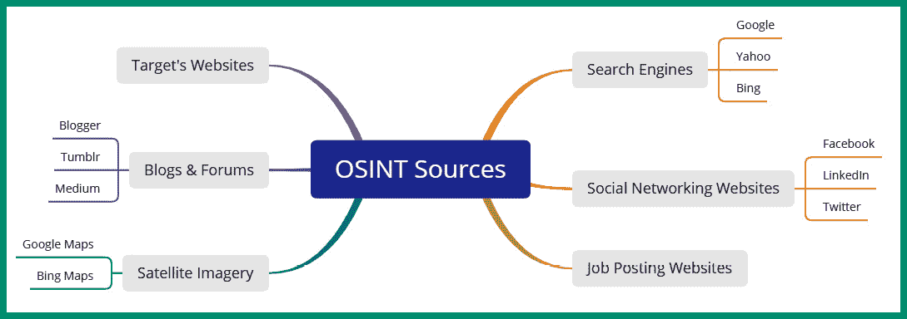

图 3.4 – OSINT 数据源

如上图所示，任何人都可以使用各种在线资源收集关于目标的数据，然后分析收集到的数据以提供意义和背景。使用多个互联网搜索引擎进行目标研究是必需的，因为一个搜索引擎可能会提供比另一个更多的额外数据。许多组织和个人通过社交媒体与他人建立联系，并分享关于他们自己及其公司的信息。有时，人们在不意识到其影响的情况下泄露敏感数据，若这些数据被利用，后果严重。许多组织会在招聘新员工的职位描述中发布技术细节和技术信息，其中包含一些具体细节，例如他们服务器的操作系统、服务器类型与架构、云计算服务，甚至是网络设备。

## OSINT 生命周期

OSINT 生命周期帮助伦理黑客更好地理解在伦理黑客和渗透测试的侦察阶段，收集、分析和报告数据所涉及的各个阶段。

OSINT 生命周期通常包括以下几个阶段：

1.  理解信息收集的需求

1.  执行数据收集与检索

1.  执行收集数据的分析

1.  进行数据分析和报告分析

下图展示了执行 OSINT 时的持续过程：

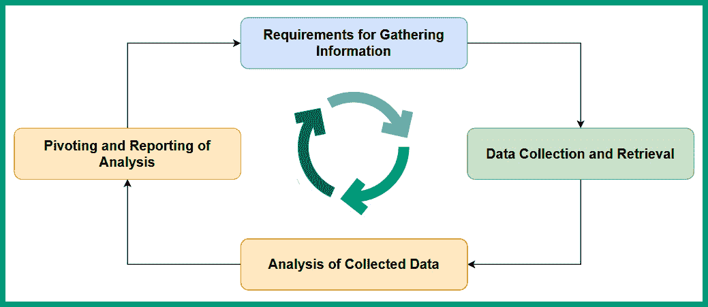

图 3.5 – OSINT 生命周期

在第 1 阶段，*信息收集要求*，道德黑客需要清楚了解组织的需求。因此，以下是一些应该向客户提出的问题，以便获得更明确的理解：

+   OSINT 渗透测试结束时的交付成果是什么？

+   组织是否希望确定他们的数据是否已被泄露到网上？

+   攻击者如何识别其组织的入侵点（攻击面）和安全漏洞？

+   如果攻击者利用 OSINT 攻破组织的系统和网络，风险等级和影响会是什么？

在第 2 阶段，*数据收集与检索*，道德黑客使用与真实黑客类似的**战术、技术和程序**（**TTPs**）从公开可用的来源收集关于目标的数据。在此阶段，重要的是收集所有足够的数据，如照片、视频、文档和其他类型的媒体，从互联网上的各种数据源中收集与目标组织相关的上下文信息。然而，道德黑客必须明确识别哪些数据被认为是相关信息，以及在何时收集的数据已足够。

在第 3 阶段，*收集数据分析*，道德黑客仔细分析收集到的数据，以更好地理解如何将其应用于满足客户的需求，同时将数据分类为有意义且有用的类别。在此阶段，道德黑客有时会发现一些有趣的内容，并决定深入收集更多数据。例如，如果道德黑客发现目标组织正在招聘一名 IT 专业人员来管理他们的自托管服务器，道德黑客可能会尝试从当前和过去的招聘信息中获取任何可能透露目标内部服务器操作系统的技术细节。深入挖掘时，道德黑客还可能利用社交媒体，如 LinkedIn，收集有关目标公司当前和过去员工所实施的 IT 系统的情报。

收集的数据经过处理并转化为有意义的信息，具体通过以下方式来确定：

+   收集的数据是否准确？

+   收集的数据来自可信来源吗？

+   收集的数据是事实性的还是主观的？

+   是否需要更多的数据来更好地理解目标的某个特定领域？

在第 4 阶段，*数据转向与报告分析*，道德黑客可能会转向收集目标在不同领域的额外数据。例如，如果关于目标组织的结构已经收集并分析了足够的数据，转向收集每个员工社交媒体的相关数据可能有助于发现更多关于目标的数据泄露。例如，转向可以揭示目标组织 IT 专业人员的社交媒体账户，从而帮助你识别公司内部使用的技术，如果它们已在线发布。

一旦分析了足够/充分的目标数据，道德黑客就进入报告阶段，其中包含相关数据、信息以及执行的分析。重要的是要通知客户/顾客在 OSINT 过程中收集的证据，以及为什么这些证据对他们来说很重要。因此，要提供关于数据是如何被员工泄露的，并解释它如何被真正的黑客利用来计划对公司可能的未来网络攻击。

在收集关于目标的数据时，有时过程会变得有些压倒性，决定是否转向另一个方向可能会带来不确定性。为了帮助提供清晰的视觉地图和 OSINT 数据的相互关系，**您的 OSINT 图形分析器**（**YOGA**）是一个免费的在线资源，帮助网络安全专业人员轻松可视化他们如何继续访问另一个数据点并在 OSINT 过程中收集更多数据。

以下图示显示了 YOGA 用户界面和数据点：

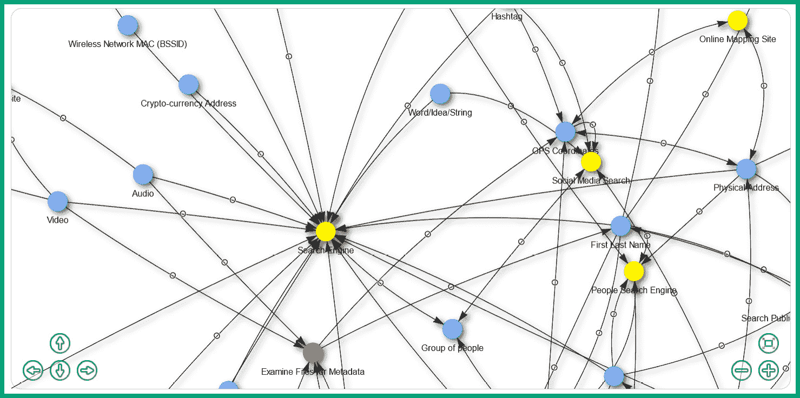

图 3.6 – YOGA 数据点与地图

如前图所示，YOGA 展示了一个数据点如何与另一个数据点相互关联，这使得道德黑客能够轻松地跟随地图到达另一个数据点，以收集关于目标的额外情报。

重要提示

要了解更多关于 YOGA 交互式地图和 OSINT 数据点的信息，请访问 [`yoga.myosint.training/`](https://yoga.myosint.training/)。

接下来，你将发现 OSINT 如何帮助执法部门发现新的犯罪活动并提高警觉，以及它如何被道德黑客利用。

## 使用 OSINT 的好处

拥有正确使用 OSINT 的知识和理解使一个人变得非常强大。类似地，互联网上有大量公开的数据，但理解如何收集和分析这些数据，以便为某个话题创造意义和背景，可以出于好坏不同的动机和意图加以使用。作为道德黑客和渗透测试人员，我们将专注于以良好的意图使用 OSINT，例如帮助组织减少攻击面并提高其安全态势。

OSINT 通常用于合法且正当的目的。例如，执法机关利用 OSINT 收集的数据来确定“关注人物”和通缉人员的位置及其他详细信息。一个通缉人员可能会利用社交媒体炫耀自己成功逃脱了当地执法机关的抓捕，并发布在线帖子显示他们在派对上玩得很开心。执法专业人员可以监控目标以及任何关于目标的帖子，以确定他们的位置和活动。社交媒体上发布的照片和视频有助于执法机关发现新的犯罪行为。此外，也有一些违法者在社交媒体上过度分享自己的活动，导致自我暴露，进而帮助执法机关察觉到违法行为。

如前所述，社交媒体平台的创建目的是帮助人们保持联系并分享彼此的动态。然而，执法机关常常将社交媒体平台用作现代版的“通缉令”，通过这些平台帮助提高对嫌疑人和犯罪活动的认识，目的是覆盖更广泛的受众。

全球有很多失踪人口。使用 OSINT 可以帮助你和执法机关通过利用互联网上关于失踪人员的信息找到失踪的人。例如，失踪的人可能有社交媒体账户，里面包含他们日常生活和活动、朋友及群组的数据。日常活动可以用来识别失踪人的常见模式，以及是否最近发生了不寻常的事情。受害人的好友列表可以帮助执法机关确定谁能查看受害人事件发生前的活动、帖子、照片和视频，且这些人是否有动机做出违法行为。如果一个跟踪者在受害人的好友列表中，伪装成守法公民，却秘密监视他们的日常活动，并利用这些信息来策划犯罪活动，那会怎样？总的来说，与执法机关合作的网络安全专业人员可以利用 OSINT 来寻找失踪人员并抓捕违法分子。

作为一名道德黑客，在对目标进行 OSINT 操作时，隐匿身份非常重要。在接下来的部分，你将了解在收集目标信息时隐藏自己在线身份的重要性。

# 隐藏你的在线身份

为了更好地理解在进行 OSINT 时作为道德黑客隐藏身份的重要性，我们来设想一下：假如你的组织被威胁行为者入侵，黑客向公司的一名高管发送了一个钓鱼电子邮件，成功诱使该员工点击了一个看似安全但被混淆的链接。点击该链接后，恶意软件被下载并在受害者的系统上执行，使得黑客获得了未经授权的访问权限，并从公司的服务器及其他设备中窃取了机密数据。之后，黑客向组织发送了一封电子邮件，表明从服务器中窃取的数据类型，并要求公司在 24 小时内支付加密货币，否则黑客将把数据卖给*暗网*的最高出价者。

在公司内部，Bob 是负责管理和监督公司安全操作的安全专业人员，是处理与安全相关问题的主要联系人。由于领导团队担心他们的知识产权和其他机密数据可能被出售给其他黑客，因此安全漏洞很快引起了 Bob 的注意。Bob 决定检查由威胁行为者发送的电子邮件消息的源代码，以找出任何可能用于追踪发送者和攻击者位置的信息。例如，原始 IP 地址可以用来确定发送者的地理位置和网络服务提供商。

重要提示

在电子邮件消息的头部，有时会泄露发送者的原始 IP 地址，这使得收件人能够识别发送者的真实 IP 地址。然而，许多电子邮件服务提供商会在外发邮件时隐藏发送者的真实 IP 地址，从而增加了追踪电子邮件来源的复杂性。不过，你可以尝试通过创建并通过电子邮件发送**canary token**来社交工程攻击黑客。Canary tokens（[`canarytokens.org/generate`](https://canarytokens.org/generate)）用于帮助网络安全专业人员确定他们的系统或网络是否被入侵，并诱使对手自我暴露并揭示其地理位置。

然而，Bob 无法从电子邮件头部找到威胁行为者的真实 IP 地址，决定使用邮件中找到的发件人姓名和别名进行在线搜索。通过威胁行为者的别名进行 Google 搜索可能会提供一些结果，也可能没有任何结果。在 LinkedIn 等社交媒体网站上搜索任何包含发件人姓名的个人资料，会触发对该个人资料所有者的警报，因此网络安全专业人员需要注意不要引起目标的警觉。例如，如果你使用个人账户搜索并查看某人的 LinkedIn 资料，目标将会收到通知，并得知是谁查看了他们的资料。试想一下，如果 Bob 使用个人账户来查找攻击者，而攻击者可能在 LinkedIn 上使用虚假资料。那么，威胁行为者就会被通知到，有人正在对该受害者组织的网络攻击者进行调查。简而言之，Bob 应该使用一个无法追溯到他或他的公司的不同账户，以防目标意识到调查的存在。

## 垃圾娃娃的基本概念

无论你是在对网络犯罪分子进行 OSINT 调查，还是作为道德黑客为某个组织工作，隐藏你的真实身份以避免目标识别出谁在收集信息并追溯到你，都是非常重要的。因此，始终建议不要使用个人账户来进行工作。

道德黑客使用**垃圾娃娃**来隐瞒或隐藏其身份，以便在对目标进行调查和 OSINT 操作时保护自己。垃圾娃娃是一个或多个由道德黑客设置和操作的备用社交媒体账户，目的是执行 OSINT，例如从各种在线数据源收集情报。使用垃圾娃娃的概念是伪匿名的，绝不能追溯到你，即道德黑客本人。它在收集情报时提供隐私保护。

此外，垃圾娃娃使道德黑客能够创建多个定制的社交媒体账户，用于收集有关目标的情报。然而，垃圾娃娃账户应该具有现实的人设，使得任何人，包括目标，都会相信该账户是真实的而不是虚假的。垃圾娃娃账户应当具备一个能够吸引追随者并鼓励他人连接的在线个性，使得道德黑客能够与目标建立联系并收集更多信息。此外，垃圾娃娃完全符合**操作安全**（**OPSEC**）实践，因为该账户无法追溯到你。记住，当你执行 OSINT 操作或调查目标时，确保目标不知道你正在进行调查或收集关于他们的情报是非常重要的。

## 设置垃圾娃娃

在设置假人之前，伦理黑客必须确定是否需要匿名性和/或持久性。如果需要匿名性，这意味着你不希望目标发现或追踪到你是谁，在对其进行情报收集时。为了确保匿名性，设置假人时需要做更多的工作。如果假人需要持久性，这意味着伦理黑客希望确保虚假身份会在社交媒体上与他人互动、关注并与他人连接，并且定期发布新的状态和更新，以确保假人具有真实的身份，而不是被识别为假账户。持久性还意味着伦理黑客需要渗透社交网络，如群组，持续数周、数月或数年，以建立一个受信任的在线形象。然而，如果你不需要持久性，那么设置和维护一个假人账户将比持久账户更容易。

重要提醒

永远不要使用个人账户进行工作相关活动，如开放源信息（OSINT）操作、调查、道德黑客或渗透测试。

以下是创建假人的指导原则和建议：

+   在创建假人时，你的来源细节很重要。创建和设置社交媒体账户时不要使用你自己的 IP 地址。可以考虑访问一个有免费无线网络的本地咖啡店。

+   请勿使用**虚拟私人网络**（**VPN**）或 TOR 服务，因为社交媒体平台能够检测到来源流量是否通过代理或 VPN 发送，并且会要求你进一步验证身份。

+   确保你在社交媒体上的在线形象看起来像一个普通、常规的人，以避免被标记为虚假用户账户。

+   注册社交媒体账户时请使用*临时*电子邮件地址。可以考虑使用**Proton Mail** ([`proton.me/`](https://proton.me/))，因为它提供额外的隐私保护和数据加密。但是，你也可以使用常见的电子邮件服务，如 Gmail、Yahoo Mail 或 Hotmail。确保电子邮件地址非常简单（基础）。

+   使用 Facebook 时，请使用网站的移动版本 ([`m.facebook.com/`](https://m.facebook.com/))，因为与桌面版本相比，移动版本进行的安全检查和验证较少。

+   确保定期分享内容，如状态更新、照片和视频，并与社交媒体平台上的人互动和联系。

+   请勿使用他人的照片。进行反向图片搜索非常容易，能够判断一张照片是否为假。

以下是创建假人时有用的资源：

+   **假名** **生成器**: [`www.fakenamegenerator.com/`](https://www.fakenamegenerator.com/)

+   **此人不存在**: [`www.thispersondoesnotexist.com/`](https://www.thispersondoesnotexist.com/)

+   **隐私** **卡**: [`privacy.com/`](https://privacy.com/)

+   **远程** **浏览器**: [`webgap.io/`](https://webgap.io/)

**假名生成器**使道德黑客能够快速生成一个假身份，用于创建虚假账户。该网站允许你自定义身份信息，如性别、姓名集和国家，以创建一个可信的虚拟人物。**这个人不存在**是一个使用**人工智能**（**AI**）创建虚假照片的网站，这些照片是虚构的，不存在的人的面貌。**隐私卡**是一个网站，允许你为真实的信用卡创建一个代理，这样你就无需在电子商务网站上输入真实的信用卡信息进行购买；会创建一个代理信用卡来代替使用。因此，电子商务商家无法获知你的真实信用卡号码和详细信息。**WEBGAP**提供远程浏览器隔离服务，允许任何人通过远程浏览器上网，以增强安全性和隐私性。

以下是可能在 OSINT 操作中需要的额外资源：

+   一种来自服务提供商的*临时*电话号码，这些服务商每月不回收号码。这个*临时*电话号码可以用于账户验证。

+   如果需要，代理信用卡可以用于购买临时手机和其他物品。

+   用于执行 OSINT 操作和调查的虚拟机。

+   如有需要，使用 VPN 服务。

+   执行 OSINT 操作时，始终使用专用计算机，因为你不希望目标将任何事情追溯到你。考虑使用廉价的微型计算机，如 Raspberry Pi。

完成本节内容后，你已经了解了在执行 OSINT 操作时如何使用虚假账户来隐藏你的在线身份，并知道了如何开始这一过程。接下来，你将学习如何匿名化你的互联网流量。

# 匿名化你的网络流量

作为一名执行 OSINT 操作的道德黑客，确保目标无法追踪到谁在收集关于他们的数据是非常重要的。熟练的网络安全和网络专业人员能够捕获并分析网络包和日志中的数据，以确定流量的来源；因此，建议在上网时匿名化你的网络流量，以隐藏你的真实地理位置和公共 IP 地址。

以下是一些常用的匿名化互联网流量的技术：

+   **VPNs**

+   **ProxyChains**

+   **TOR**

以下小节将描述前述技术的优势，以及每种技术如何工作以匿名化你基于互联网的流量。

## VPNs

VPN 使用户能够在不安全的网络上建立安全的通信通道，从而提供保密性并减少网络监听攻击。VPN 通常被组织用于在远程办公室和总部之间建立安全的远程连接，而无需电信服务提供商提供的**广域网**（**WAN**）。这些通常被称为**站点到站点 VPN**。还有**远程访问 VPN**，这些 VPN 是组织为其远程员工提供安全连接并访问企业网络资源而实现的。

道德黑客可以自行在云端搭建远程访问 VPN 服务器，或者订阅商业 VPN 服务。自行在云端搭建远程访问 VPN 需要一些技术技能，比如知道如何在所选云服务提供商环境中搭建虚拟机，以及一些网络技能。拥有 VPN 服务器的好处是，只有你自己能查看 VPN 流量日志，因此可以增加隐私保护。然而，确保云服务器操作系统的安全非常重要，以防止攻击者未经授权访问服务器。此外，在设置云端虚拟机时，你需要选择一个托管位置。这个位置将成为所有通过你的 VPN 通道的流量的出口点。因此，如果你位于**美国**（**US**），而你的 VPN 服务器托管在**英国**（**UK**），那么所有通过 VPN 路由的基于互联网的流量将在英国出口，源公网 IP 地址将显示为英国的地址。

下图展示了使用 VPN 来匿名化流量的概念：


图 3.7 – VPN 概念

如前图所示，攻击者机器由道德黑客使用，并连接到云上的 VPN 服务器。所有基于互联网的流量都会通过 VPN 隧道发送，并在托管位置（国家）出口，然后发送到目标。因此，如果目标捕获并分析网络数据包，它将追踪到出口节点（VPN 服务器），而不是道德黑客的机器。

提示

**OpenVPN**提供了一个自托管的访问服务器选项，使你可以免费连接最多两台设备。这使你能够在自己的设备或云端设置 OpenVPN 访问服务器。请参考以下链接了解更多信息：[`openvpn.net/access-server/`](https://openvpn.net/access-server/)。

一些伦理黑客可能更倾向于使用商业 VPN 服务提供商，这样可以减少在云上配置和设置虚拟服务器的需要。使用基于订阅的 VPN 服务的一个主要好处是，它使订阅者可以连接到全球各国多个 VPN 服务器，这些服务器都由同一个商业 VPN 提供商管理。因此，你可以轻松切换不同国家，并选择负责将流量路由到互联网的出口节点位置。

以下是使用 VPN 时需要考虑的因素：

+   无论是托管 VPN 服务器在云端，还是使用商业 VPN 服务，都需要付费。

+   确保你选择的 VPN 服务提供商不会记录你的流量日志。

+   确保你选择的 VPN 服务提供商不会出售你的数据。

+   确保你选择的 VPN 服务提供商有无限流量使用。

+   确保 VPN 客户端与你计算机的操作系统兼容。

+   许多云服务提供商，如 Microsoft Azure 和 Amazon AWS，都提供预配置的 OpenVPN 访问服务器，便于快速部署。

+   使用 VPN 时，确保你的 DNS 流量不会泄露到 VPN 外部，否则你的真实地理位置将会被揭示。可以通过使用**DNS 泄漏测试**来检查 DNS 泄漏，网址为 [`www.dnsleaktest.com/`](https://www.dnsleaktest.com/)。

+   如果你的 VPN 服务不支持 IPv6，确保在你的设备上禁用 IPv6，以防止地理位置泄漏。

虽然有许多商业 VPN 服务提供商，但根据它们的服务、功能、性能和评价，排名前列的 VPN 服务提供商会随时变化。花些时间研究哪家商业 VPN 提供商最适合你的需求，或者是否自托管的解决方案更好。接下来，你将了解 Proxychains 及其设置方法。

## Proxychains

**Proxychains** 是伦理黑客常用的技术和工具，用于掩盖其网络流量的来源，同时提高隐私性和安全性。Proxychains 允许网络流量通过多个代理服务器进行路由，形成链式效果，当使用多个代理服务器时，可以提高所需的匿名性和安全性。

以下是使用代理服务器和 Proxychains 进行 OSINT 操作的优势：

+   **提供匿名性**：Proxychains 允许你的互联网流量通过多个代理服务器进行路由。这使得伦理黑客在进行 OSINT 操作时能够隐藏其真实的源 IP 地址和身份。

+   **绕过地域限制**：许多网络和组织限制访问特定的网站和服务。使用代理链技术可以让伦理黑客绕过这些地理位置限制，访问目标网站。

+   **绕过安全措施**：一些组织实施了安全系统，用来基于源地址和地理位置检测并防止恶意流量。使用代理链可以使这些安全系统更难检测和限制黑客的流量。

Proxychains 工具使道德黑客能够配置一个代理服务器列表，通过链式格式路由网络流量。当道德黑客向目标发送流量时，数据包首先通过链中的第一个代理服务器，然后依次传递到其他代理服务器，直到数据包到达目标。目标响应时，返回的数据包将逆序经过代理链，回到道德黑客的计算机。

下图展示了代理服务器的链式连接：

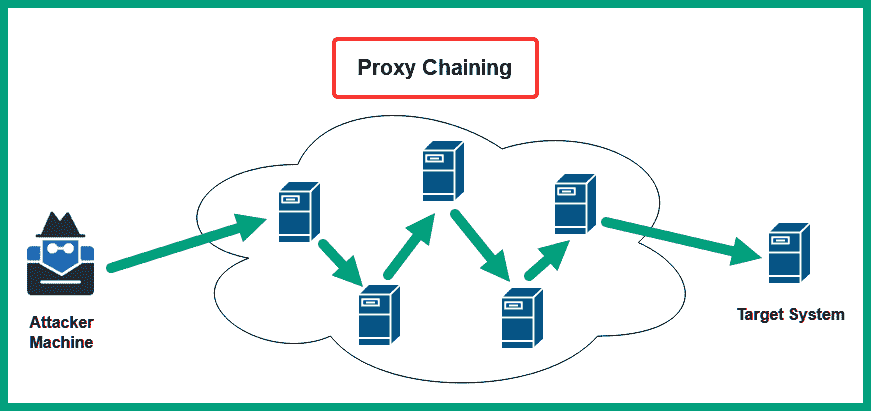

图 3.8 – 代理链

代理链中的每一个代理服务器都作为一个中继，转发数据包到链中的下一个代理服务器，直到数据包到达目标。这种技术使得道德黑客能够隐藏其身份、真实公共 IP 地址和位置。目标只会看到来自代理链中的出口节点或最后一个代理服务器的流量。

提示

互联网上有许多网站提供免费代理服务器的列表。你可以查看 [`spys.one/en/`](https://spys.one/en/)。

Kali Linux 上的 **proxychains4.conf** 文件使你能够配置 Proxychains 工具，并将特定的服务器添加到首选代理服务器列表中，以创建代理链效果。此外，Proxychains 支持以下类型的代理服务器：

+   HTTP

+   HTTPS

+   SOCKS4

+   SOCKS5

这些特定类型的代理服务器各自拥有一套独特的安全功能。使用 HTTP 转发流量的代理服务器不提供数据加密，而使用 HTTPS 的代理服务器则会加密流量。在进行 OSINT 操作之前，了解适合你需求的代理服务器类型是非常重要的。

要开始设置 Proxychains，请按照以下说明操作：

1.  打开 VirtualBox 管理器并启动 Kali Linux 虚拟机。

1.  一旦 Kali Linux 虚拟机启动，登录并打开终端，使用以下命令更新文件名数据库并搜索 Proxychains 配置文件：

    ```
    kali@kali:~$ sudo updatedb
    ```

    ```
    kali@kali:~$ locate proxychain
    ```

如下图所示，**proxychains4.conf** 文件 [位置是：](https://openvpn.net/access-server/)


[图 3](https://openvpn.net/access-server/).9 – 定位 Proxychains 配置文件

1.  接下来，打开你的网页浏览器，访问[`spys.one/en/`](https://spys.one/en/)查看各种代理服务器的列表。

1.  在上一步选择了一些代理服务器后，你需要配置 **proxychains4.conf** 文件以使用这些选择的代理服务器。使用以下命令通过命令行文本编辑器打开 **proxychains4.conf** 文件：

    ```
    kali@kali:~$ sudo nano /etc/proxychains4.conf
    ```

1.  接下来，当 **proxychains4.conf** 文件在终端中打开时，向下滚动到包含 **dynamic_chain** 的那一行，取消注释该行，方法是删除行首的 **#** 字符。同时，在包含 **strict_chain** 的行首插入 **#** 字符，将其注释掉，如下所示：

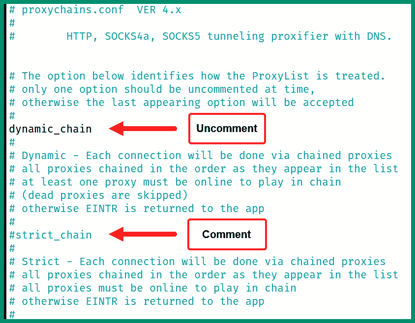

图 3.10 – 启用动态链式连接

如前图所示，取消注释一行代码仅仅是启用了某个功能，例如动态链式连接多个代理服务器，而注释掉一行则禁用了严格的链式连接功能。

1.  接下来，滚动到 **proxychains4.conf** 文件的末尾，在 **socks4 127.0.0.1 9050** 行的开头插入 **#** 字符将其注释掉，并在列表底部插入你的附加代理，如下所示：

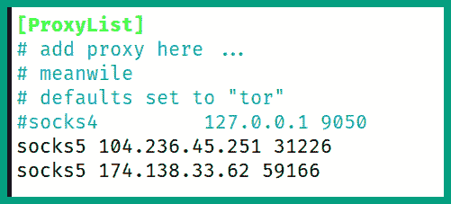

图 3.11 – 添加代理

1.  接下来，保存配置文件时，按下 *Ctrl* + *X*，然后按 *Y* 确认文件名，再按 *Enter* 键退出并返回终端。

1.  要使用 Proxychains，使用以下命令启动一个 Firefox 浏览实例，将互联网流量通过代理服务器链路进行路由：

    ```
    kali@kali:~$ proxychains4 firefox
    ```

如下图所示，Firefox 正通过配置文件中的代理服务器列表来路由出站流量：

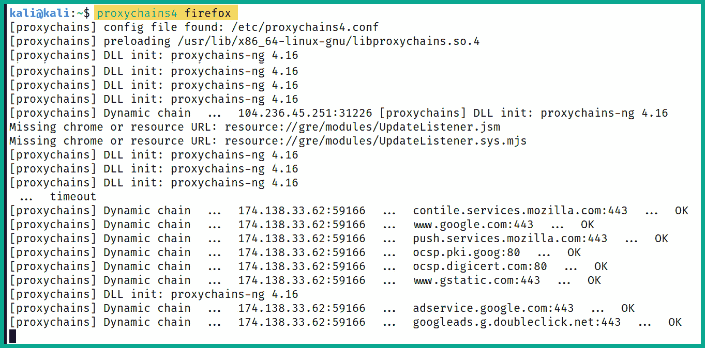

图 3.12 – 使用 Proxychains

1.  接下来，为了确认你是否通过 Firefox 匿名化了网络流量，可以使用相同的网页浏览器，访问[`whatismyipaddress.com/`](https://whatismyipaddress.com/)验证你的公共 IP 地址，如下图所示：

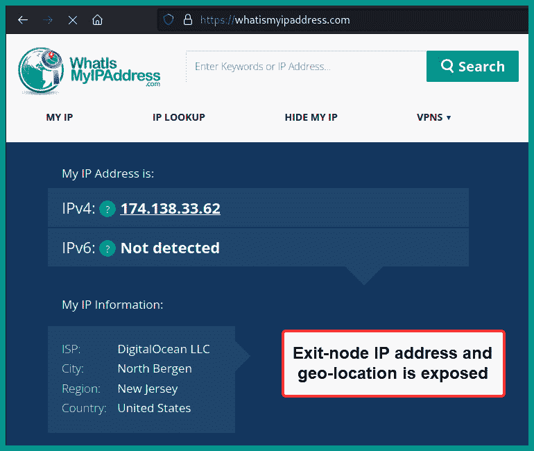

图 3.13 – 验证公共 IP 地址以确保匿名性

如前图所示，公共 IP 地址被识别为出口节点，即 **proxychains4.conf** 文件中的最后一个代理服务器，而不是实际的源 IP 地址。

1.  最后，请记住，每次使用 Proxychains 时，只需确保代理服务器在线，并在终端启动时输入 **proxychains4** 命令，如 *步骤 8* 所示。

接下来，你将学习如何通过 TOR 在暗网上匿名化你的互联网流量。

## TOR

TOR 是一个开源项目，使任何人都能够匿名浏览互联网。TOR 网络通过多个节点路由用户的网络流量，这使得用户在使用互联网时能够隐藏其身份和地理位置。这对道德黑客非常有用。当用户通过 TOR 网络发送流量时，它会加密网络流量，并将其包装在多个加密层中。当加密流量传递到另一个节点时，接收节点会去除一层加密，揭示下一个节点以继续转发流量，直到流量到达目标。在这一过程中，目标接收加密数据，并且无法追踪数据包的真实来源。

下图展示了使用 TOR 的一般概念：

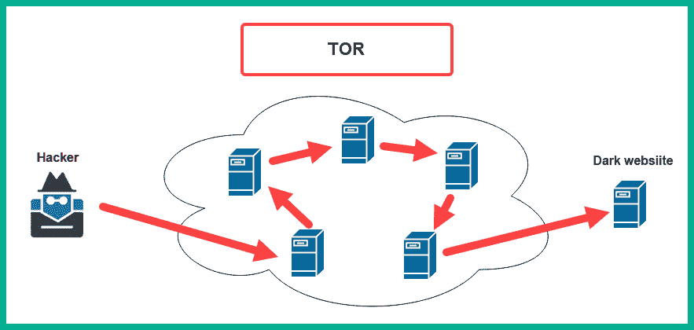

图 3.14 – 使用 TOR 路由

在 TOR 网络中，每个节点只知道前一个和下一个节点，从而形成类似代理链的效果。然而，节点并不知道流量的发送方（源）或最终目的地（目标）。这使得任何在 TOR 网络中的节点或任何人都很难确定通过 TOR 网络路由的流量的真实来源和目的地。作为额外的安全层，流量会被多次加密、解密和重新加密，以防止任何截取流量的人识别原始数据或流量的源头。使用 TOR 使用户能够浏览互联网，并访问使用 **.onion** 域的暗网网站。

以下是连接到 TOR 网络时发生的过程：

1.  道德黑客将连接到 TOR 并打开 TOR 浏览器。

1.  TOR 浏览器将加密外发流量，发送到 TOR 网络中的第一个中继节点。

1.  第一个节点将接收流量，解密第一层加密以确定下一个节点，并将流量转发到下一个节点。

1.  这一过程会沿途重复，因为每个节点会解密流量的一层加密，然后将流量转发到下一个节点，直到它到达 TOR 网络中的最终（出口）节点。

1.  TOR 中的最终或出口节点将把请求转发到目标。

1.  当目标响应时，返回的流量将通过 TOR 网络返回，沿相同路径反向传输。每个节点在转发流量之前都会加密流量。这个过程会重复，直到流量以反向顺序到达最终（出口）节点。

1.  最终（出口）节点将加密流量返回到您的 TOR 浏览器，浏览器将解密并显示从目标返回的数据。

要开始设置 TOR 和 TOR 浏览器，请使用以下说明：

1.  打开 VirtualBox 管理器并启动 Kali Linux 虚拟机。

1.  一旦 Kali Linux 虚拟机启动，打开终端并使用以下命令更新软件包仓库列表：

    ```
    kali@kali:~$ sudo apt update
    ```

下图显示了前述命令的完整执行：

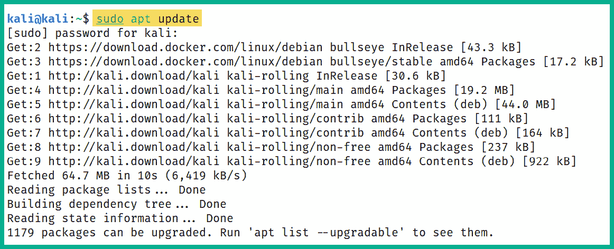

图 3.15 – 更新软件包仓库

1.  接下来，使用以下命令在 Kali Linux 上下载并安装 TOR 和 TOR 浏览器：

    ```
    kali@kali:~$ sudo apt install -y tor torbrowser-launcher
    ```

下图显示了执行前述命令时的预期输出：

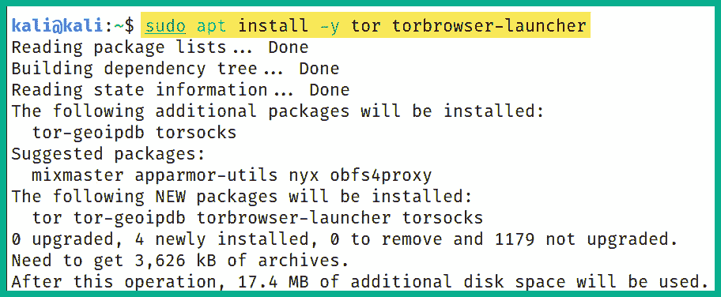

图 3.16 – 设置 TOR

1.  接下来，使用以下命令启动 TOR 浏览器：

    ```
    kali@kali:~$ torbrowser-launcher
    ```

下图显示了启动前 TOR 浏览器的设置：


图 3.17 – Tor 浏览器服务

1.  接下来，TOR 浏览器将自动出现。点击 **连接** 来建立 TOR 浏览器与 TOR 网络的连接，如下图所示：

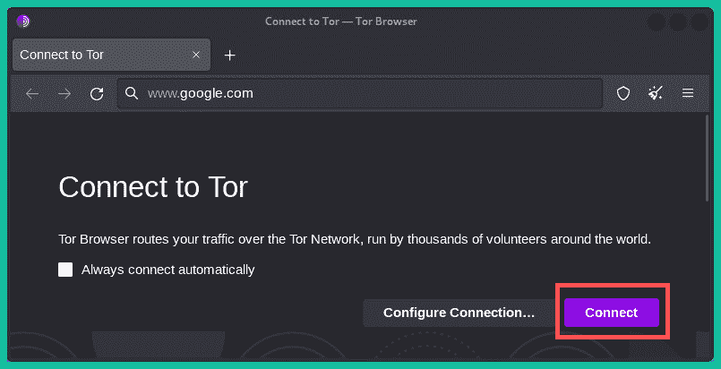

图 3.18 – TOR 浏览器

然后，你会看到正在与 TOR 网络建立连接，如下图所示：

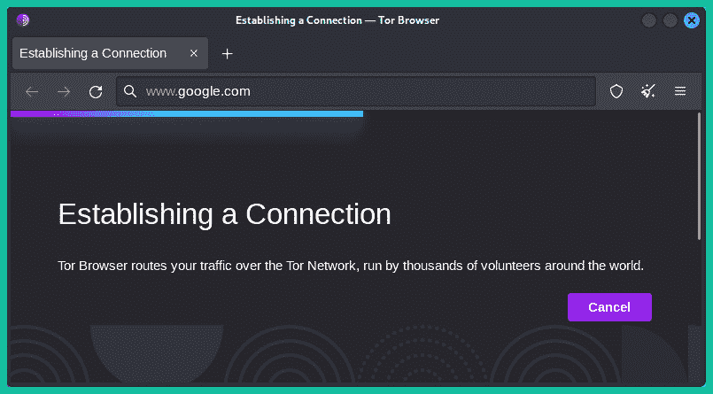

图 3.19 – 连接到暗网

1.  一旦连接建立，前往 [`whatismyipaddress.com/`](https://whatismyipaddress.com/) 验证你的真实地址和地理位置是否已被匿名化，如下图所示：

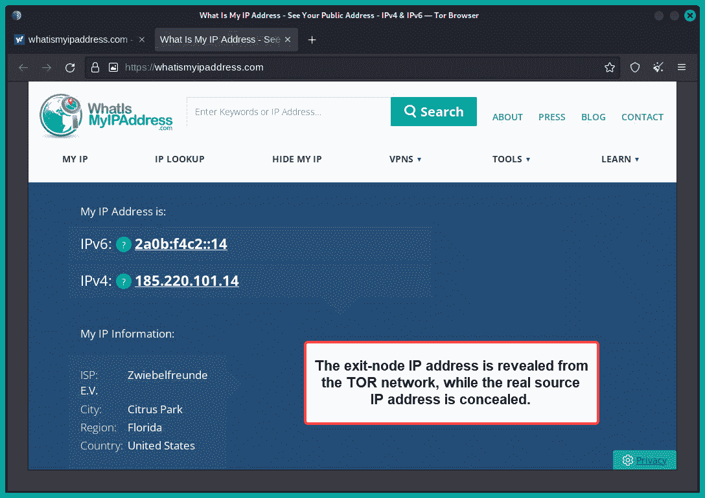

图 3.20 – 验证匿名性

如前图所示，真实的源地址和地理位置未被揭示。然而，只有来自 TOR 浏览器的网络流量会通过 TOR 网络匿名化。

重要提示

如果你想访问任何暗网上的 **.onion** 地址的网站，确保只使用 TOR 和 TOR 浏览器。不要下载任何内容，不要信任任何人，也不要信任任何东西。只有在自担风险的情况下访问。请注意。

1.  接下来，关闭 TOR 浏览器以终止与 TOR 网络的连接。

要将 Kali Linux 中的其他应用程序和工具的流量通过 TOR 网络路由，你需要使用以下指令修改 **proxychains4.conf** 文件：

1.  在 Kali Linux 上，打开终端并使用以下命令通过 **nano** 命令行文本编辑器打开 **proxychains4.conf** 文件：

    ```
    kali@kali:~$ sudo nano /etc/proxychains4.conf
    ```

1.  接下来，当 **proxychains4.conf** 文件出现时，滚动到文件末尾，取消注释 **socks4 127.0.0.1 9050**，并在每行包含代理服务器的开头插入注释（**#**），如下图所示：

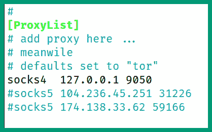

图 3.21 – 修改 Proxychains 文件

1.  接下来，为了保存配置文件，请在键盘上按 *Ctrl* + *X*，然后按 *Y* 使用当前文件名，再按 *Enter* 确认并返回终端。

1.  接下来，在终端中使用以下命令启动 TOR 服务并验证其状态：

    ```
    kali@kali:~$ sudo systemctl start tor
    ```

    ```
    kali@kali:~$ sudo systemctl status tor
    ```

1.  接下来，使用以下命令连接到 [`ifconfig.co/`](https://ifconfig.co/) 并验证你的基于互联网的流量是否已匿名化：

    ```
    kali@kali:~$ proxychains4 curl ifconfig.co
    ```

下图显示了网站检测到的公共 IP 地址。由于基于互联网的流量通过 TOR 网络路由，它已被匿名化，因为显示的地址是 TOR 网络出口节点的 IP 地址，而不是实际地址：


图 3.22 – 通过 TOR 验证匿名性

1.  接下来，由于 TOR 服务正在 Kali Linux 上运行，我们可以使用 **proxychains4** 命令来启动任何应用程序，同时通过 TOR 网络路由其流量：

    ```
    kali@kali:~$ proxychains4 firefox
    ```

下图显示了 Firefox 正在建立一个 TOR 电路：


图 3.23 – 通过 TOR 路由应用流量

1.  接下来，当 Firefox 出现在桌面上时，访问 [`whatismyipaddress.com/`](https://whatismyipaddress.com/) 验证基于互联网的流量和地理位置是否已匿名化，如下图所示：

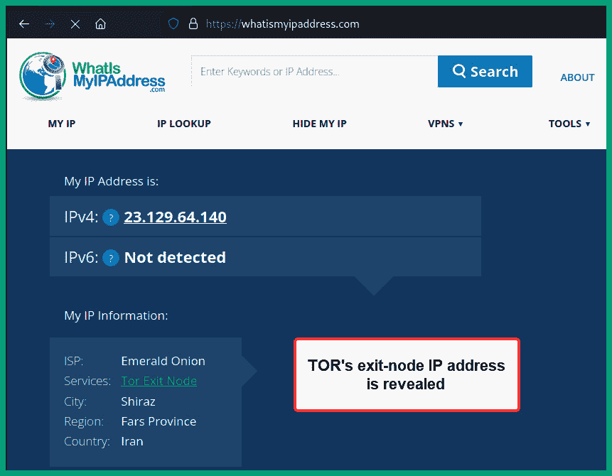

图 3.24 – 使用 TOR 匿名化流量

如前图所示，IP 检测网站能够识别出 TOR 电路的出口节点，而无法识别出真实的 IP 地址或地理位置。

1.  接下来，使用以下命令停止 TOR 服务并终止 TOR 电路：

    ```
    kali@kali:~$ sudo systemctl stop tor
    ```

    ```
    kali@kali:~$ sudo systemctl status tor
    ```

下图显示了执行前述命令的预期结果：


图 3.25 – 禁用 TOR 服务

如前图所示，TOR 服务现在处于非活动状态。

完成本节后，你已学会如何匿名化你的互联网流量，防止你的目标追溯到你的 OSINT 操作。

# 总结

在本章的学习过程中，你了解了道德黑客如何使用被动信息收集技术和 OSINT 来收集、汇总和分析来自互联网的公开数据，以更好地理解目标和安全漏洞。此外，你还学会了作为道德黑客如何使用 VPN、Proxychains 和 TOR 来隐藏身份并匿名化你的互联网流量。

我希望本章对你有所帮助，并在你进入网络安全行业的过程中提供了有价值的知识。在下一章，*第四章*，*域名与 DNS 情报*，你将获得在行业中高效执行 OSINT 操作所需的实践技能，作为一名道德黑客，你将学习如何针对目标进行操作。

# 进一步阅读

+   足迹追踪的步骤: [`www.eccouncil.org/cybersecurity-exchange/penetration-testing/footprinting-steps-penetration-testing/`](https://www.eccouncil.org/cybersecurity-exchange/penetration-testing/footprinting-steps-penetration-testing/)

+   了解 OSINT: [`www.crowdstrike.com/cybersecurity-101/osint-open-source-intelligence/`](https://www.crowdstrike.com/cybersecurity-101/osint-open-source-intelligence/)

+   创建虚假身份: [`www.maltego.com/blog/creating-sock-puppets-for-your-investigations/`](https://www.maltego.com/blog/creating-sock-puppets-for-your-investigations/)

+   在 Kali Linux 上安装 TOR: [`www.kali.org/docs/tools/tor/`](https://www.kali.org/docs/tools/tor/)
