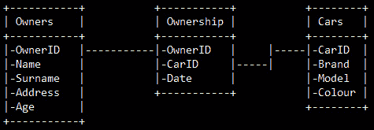
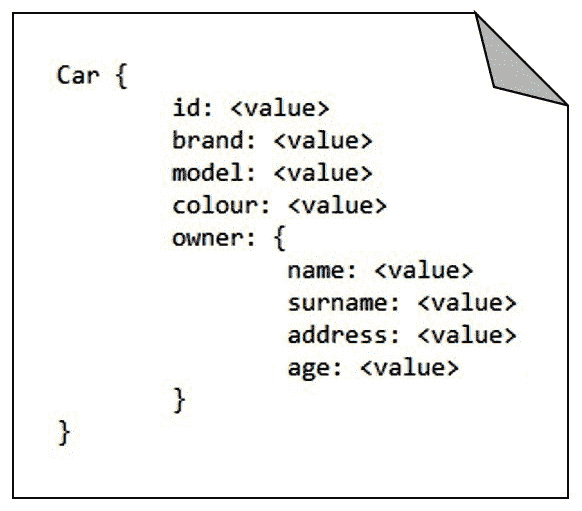
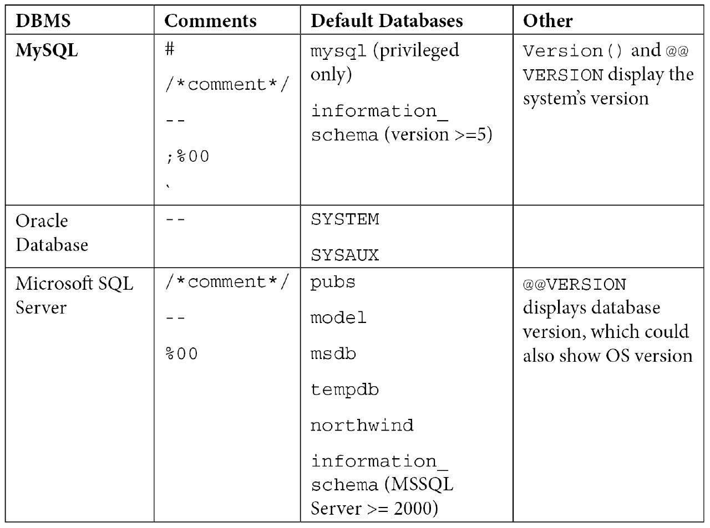

# *第一章*：用于 SQL 注入的结构化查询语言

当今世界每天都依赖于网络空间的概念：互联网使全球各地的人们能够连接到世界任何地方的计算机。这使得通过依赖各种技术、协议和机制提供的服务能够即时使用，这些技术、协议和机制构成了万维网上一切可用资源的基础。不幸的是，安全问题对于这个复杂的连接和服务网络来说，和现实世界一样重要。

恶意代理每天在全球范围内对计算机发动攻击，主要是为了个人利益或优势。通过利用在线应用和服务，实际上有可能获得计算机或整个网络的控制，从而利用某些技术、协议、框架或应用的内在漏洞。最常见且臭名昭著的方式之一就是通过 SQL 注入，它是一种特定类型的攻击，试图利用数据库语言的语法——**SQL**，即**结构化查询语言**——以访问通常无法获取的数据库信息，包括负责账户认证的数据库，其中包含用于访问服务的用户名和密码。尽管 SQL 注入是一种众所周知的攻击方式，但易受攻击的应用程序仍然存在，暗示着在应用开发的安全性方面，有时并没有得到足够的重视。

本书旨在通过从理论和实践两个方面解释 SQL 注入，深入探讨这个问题。

本章作为对这一问题的理论性介绍，高层次地描述了 SQL 是什么，它的用途，以及导致 SQL 注入的可能弱点。这一理论概述对于理解后续章节将进一步探讨的 SQL 注入背后的概念至关重要。

在介绍了数据库、数据库管理系统和模型、查询以及 SQL 特定概念后，将涉及语法和逻辑的各个方面，快速展示可能导致 SQL 使用中安全漏洞的主要构造和要素，最终引出核心问题：SQL 注入。

本章将涵盖以下主题：

+   **SQL 概述——一种关系查询语言**：对 SQL 的初步概述，SQL 注入通常基于这种语言，我们的主要参考语言，并与其他 DBMS 模型的关系模型进行比较。

+   **SQL 的语法和逻辑**：解释 SQL 背后的主要概念和构造，其中一些可能被恶意攻击者利用。

+   **SQL 的安全隐患**：对 SQL 中安全概念的简要介绍及其在应用中的使用。

+   **SQL 使用中的弱点**：解释依赖 SQL 的应用程序可能遇到的主要陷阱，并强调在安全开发中的一些通用建议。

# 技术要求

在本章及接下来的章节中，我们讨论的主题大多是理论性的。然而，我们建议你阅读 SQL 技术文档。为了参考，我们提供了 MySQL、Oracle 和 Microsoft SQL Server 的文档链接：

+   [`dev.mysql.com/doc/refman/8.0/en/`](https://dev.mysql.com/doc/refman/8.0/en/)

+   [`docs.oracle.com/en/database/oracle/oracle-database/index.html`](https://docs.oracle.com/en/database/oracle/oracle-database/index.html)

+   [`docs.microsoft.com/en-us/sql/sql-server/?view=sql-server-ver15`](https://docs.microsoft.com/en-us/sql/sql-server/?view=sql-server-ver15)

# SQL 概述 – 一种关系型查询语言

在计算机系统中，最常见的数据存储方式之一是依赖于**数据库**。数据库可以被视为大型软件容器，能够以结构化和可访问的方式存储大量信息，从而优化数据的存储和访问操作。

根据使用的方式和模型，达成这一目标的实现方式可能会有所不同。最常见的方法之一是使用关系模型，该模型基于关系代数，数据作为一系列记录被收集，描述了对象之间存在的关系。SQL 是一种基于这些概念的查询语言，并且在许多数据库系统中得到广泛应用。本节将深入讨论这些主题，首先解释数据库管理系统、关系型数据库和 SQL。

## 数据库管理系统和关系型数据库

如前所述，数据库的实现依赖于底层系统，或称**数据库管理系统**（**DBMS**）。DBMS 本质上是一款负责存储、访问、操作以及一般性地管理数据的软件，通过对收集和管理信息的特定定义来实现这些功能。

为了更好地理解它们之间的差异，本书现在将数据库系统分为两个大类。我们可以根据关系型模型在数据管理中的相关性，区分关系型数据库和非关系型数据库。

### 关系型数据库

关系型数据库由于其诸多优点，已被广泛认为是标准。数据以表格的形式收集，其中行表示对象，以记录的形式存储，列表示其属性。其名称来源于数据可以通过表格之间的公共属性进行关联和连接的方式，即通过关系。因此，关系代数的概念变得相关，它描述了通过结构化过程语言，如何管理数据表。SQL 是该模型最流行的代表，它利用了关系代数的大部分概念，从而提供了一个任何人都可以轻松使用的模型，即使没有编程经验，同时保持其整体效率：

](image/B15632_01_002.jpg)

图 1.1 – 由三张表组成的简单关系型模式，描述了汽车和车主的关系，并将唯一的 ID 放入关系中

### 非关系型数据库

**非关系型（No-rel）**数据库是被视为关系型模型替代方案的一类数据库管理系统（DBMS）模型，通常在数据库系统中占据更重要的位置。最初，NoSQL 这个术语用于定义这一类系统，但由于其误导性，后来被放弃：一些最早尝试构建非关系型数据库的努力实际上使用了关系模型的一些概念。非关系型数据库包含许多模型，其中一些如下：

+   **网络数据库**将数据建模为网络中的连接节点：

](image/B15632_01_004.jpg)

图 1.2 – 一个简单的网络模式，用于表示车主和汽车之间的所有权关系

+   **基于图的数据库**通过图形结构突出显示数据之间的连接，提供可导航的结构：

](image/B15632_01_003.jpg)

图 1.3 – 与关系型示例中相同的所有权关系，这次在基于图的模型模式中表示

+   **面向对象数据库**将数据建模为对象，类似于 Java 等编程语言中的方式：

](image/B15632_01_003.jpg)

图 1.4 – 在面向对象模型模式中表示的所有权关系

+   **基于文档的数据库**描述包含键值对的文档中的数据，指定数据的存储和管理方式，并提供一种不依赖于定义模式的灵活方法。基于文档的模型通常可以将嵌入的对象作为集合包含在单一键中，如下图所示：

图 1.5 – 一种基于文档的模型架构，可以表示所有权关系

尽管名字中有“SQL 注入”一词，但实际上，SQL 注入以某种形式可能影响所有现有的数据库模型。我们现在将重点讨论关系型数据库和 SQL。

## SQL – 结构化查询语言

SQL 代表结构化查询语言，它是访问、导航和管理关系型数据库的主要工具。SQL 提供了一种结构化良好的语言，易于理解，得益于其类自然语言的命令和操作的清晰性，这些操作与特定的语言字符串相对应，接下来的章节将对此进行描述。

SQL 有许多不同的实现，取决于其所在的系统，这些实现之间存在一些细微的差异，部分差异将在下一章中更详细地解释，因为它们与 SQL 注入攻击直接相关。让我们来看看最流行的 SQL 实现。

### MySQL

MySQL 是 SQL 的开源版本，广泛应用于许多 Web 应用框架和知名网站。它被认为是 SQL 技术的主要代表之一，也是一个整体表现良好的实现。

MySQL 被认为是开源 SQL 引擎中最好的实现之一，通常作为 SQL 语法的参考。

在这里，我们将列出一些关于 MySQL 的特别之处。

在字符序列方面，插入注释的方式不止一种：

+   **#**

+   **/*comment*/**

+   **--**（这需要一个空格，后面跟任何字符，才能被解释为注释。在实际测试中，我们使用组合 **-- -**。）

+   **;%00**（**%00** 是空字符，在这里以 URL 编码的形式显示。这是一种非官方的注释插入方法，因为它没有出现在官方文档中。）

+   **`**（反引号，另一种非官方方法）

通常，MySQL 系统中有两个默认数据库，它们始终存在于架构中：

+   **mysql**（仅对特权用户可用）

+   **information_schema**（仅从 MySQL 版本 5 开始提供）

MySQL 支持一些函数和变量，如 **VERSION()** 和 **@@VERSION**，用于获取 MySQL 服务器的版本信息。

### SQLite

SQLite 提供了另一种方法，它将实现直接嵌入应用程序代码中，而不使用客户端-服务器架构。虽然它推荐用于轻量级应用，如移动应用，但由于一些内在的简化，它可能存在一些缺点。

SQLite 的主要特点是，它将信息存储在 SQLite 数据库文件中，而不需要客户端-服务器架构。因此，由于它是独立运行的，最好不要将其用于敏感操作，如身份验证，或者一般来说，不应用于存储敏感信息：任何访问文件系统的人都可以轻松查看整个数据库。

### Oracle 数据库

Oracle 数据库，通常简称为 Oracle，是主要的专有 SQL 系统之一。尽管它最初是作为一个 SQL 关系型 DBMS 诞生的，但随着时间的推移，它开始支持不同的模型。因此，它被认为是一个多模型 DBMS。

在专有数据库系统方面，Oracle 是企业中最受欢迎的模型，因其与许多技术、编程语言和数据库模型具有广泛的兼容性。

和 MySQL 一样，Oracle 数据库在数据库结构和语法方面也有一些需要记住的特点。

与其他数据库系统不同，Oracle 数据库只支持通过字符序列插入注释的一种方式：**--**。

Oracle 数据库系统也有两个默认数据库：

+   **SYSTEM**

+   **SYSAUX**

### Microsoft SQL Server

Microsoft SQL Server 是企业世界中最常见的解决方案之一。它是一个为在 Windows Server 操作系统上运行而优化的 SQL DBMS，而 Windows Server 操作系统是最广泛采用的服务器操作系统之一。

**Microsoft SQL Server**（**MSSQL**）也有自己的一些特点。

MSSQL 支持通过三种方式插入注释，形式为字符序列：

+   **/*comment*/**

+   **--**

+   **%00**

MSSQL 系统有许多默认的数据库，这些数据库在架构中始终存在：

+   **pubs**

+   **model**

+   **msdb**

+   **tempdb**

+   **northwind**

+   **information_schema**（从 MSSQL Server 2000 起）

MSSQL 允许使用 **@@VERSION** 命令来检索数据库系统版本。

SQL 通常是一种高性能的语言，能够查询结构化数据。查询遵循特定的可读语法，允许用户和数据库管理员执行各种操作，从创建和删除表到根据特定条件提取数据。以下部分重点展示了基本的 SQL 语法和功能，暂时搁置语言实现差异，同时也将探讨所提到命令背后的逻辑。

# SQL 的语法和逻辑

如前所述，SQL 是一种易于使用和理解的语言，能够执行多种不同类型的操作。像所有语言一样，它基于解释命令字符串，这些命令字符串插入时需遵循预期的语法，并且每个特定语句只对应一种操作。SQL 的主要语句可以有许多类型。让我们来看一下最重要的几个：

+   **SELECT 语句**：**SELECT** 是最常用的 SQL 命令。其目的是允许数据库进行查询，显示满足（可选）特定条件的记录中的指定属性；例如：

    SELECT color, shape FROM objects

    该语句显示了**objects**表中所有记录的**color**和**shape**属性。SQL 还允许使用通配符——在本例中是字符*****——来进行一般性的选择：

    SELECT * FROM objects

+   该语句将返回**objects**表中的所有记录，并显示所有属性。通过添加**WHERE**子句指定条件，搜索还可以进一步细化：

    SELECT color, shape FROM objects WHERE color='blue'

    该语句只会显示**color**字段值为**blue**的记录：

图 1.6 – SQL 中的 SELECT 查询，并显示其结果

**SELECT**语句中可以使用其他子句：

**- DISTINCT 子句**：用于返回没有重复的结果（**SELECT DISTINCT color FROM objects**）

**- ORDER BY 子句**：用于根据属性对结果进行排序（**SELECT * FROM objects ORDER BY color ASC** 为升序，**DESC** 为降序）

清楚理解**SELECT**语句的工作原理对于掌握 SQL 注入非常重要。作为最常见的语句，滥用其结构是 SQL 注入攻击的主要推动力，它允许在看似无害的指令中插入其他 SQL 命令。我们将在下一章进一步详细介绍这一点。

+   **INSERT 语句**：**INSERT**语句用于以非常简单的方式将数据添加到数据库中，也就是指定要插入的属性值。我们来看一个例子：

    INSERT INTO objects (shape, color) VALUES (square, blue)

    前面的语句通过分别为**形状**和**颜色**属性赋值**方形**和**蓝色**，将新数据添加到数据库中：

图 1.7 – SQL 中的 INSERT 查询，并显示其结果

另外，你可以在不指定属性的情况下添加数据（**INSERT INTO objects VALUES (square, blue)**），但请记住，由于未指定的属性会被设置为**null**，这种方式仅在插入的完整记录顺序正确时才推荐使用。**INSERT**语句也可能被恶意使用，例如，插入攻击者可用于获取系统访问权限的账户凭证。

+   **CREATE 和 DROP 语句**：正如它们的名字所示，**CREATE** 和 **DROP** 语句用于创建或删除整个 SQL 表，甚至是数据库。**DROP** 语句的语法非常简单，因为它仅仅删除指定表或数据库中的所有记录（**DROP TABLE objects**，**DROP DATABASE db**），而 **CREATE** 语句则可以根据目标以多种方式使用。创建数据库与 **DROP** 语句类似，即只需要使用 **CREATE DATABASE db**，而表则显然需要特定的信息来创建属性。以 **objects** 为例，我们可以使用以下代码：

    创建表 `objects`（objID 整型，shape 字符串类型，color 字符串类型）。

    该语句将创建一个名为 **objects** 的表，其中 **objID** 为整型，**shape** 和 **color** 为字符串类型，最大长度设置为 32 个字符。

+   **ALTER 语句**：**ALTER** 语句用于修改关于数据库或表的一般信息：

    ALTER DATABASE dbname1 MODIFY NAME=dbname2

    上述语句将重命名数据库 **dbname1** 为 **dbname2**。以下语句也将向现有的表（**objects**）添加一个名为 **newcolumn** 的新字符串字段，该字段最大存储 32 个字符：

    ALTER TABLE objects ADD newcolumn varchar(32)

    **ALTER TABLE** 也可以用来删除整个属性（**ALTER TABLE objects DROP newcolumn**）或修改列的数据类型。由于 **DROP** 语句通常用于禁用应用程序功能，**ALTER** 语句在 SQL 注入中通常不被使用。

这里列出的语句仅仅是 SQL 中可能实现的功能的一部分，但为了更好地理解本书的主要问题，这些语句为我们接下来的内容提供了足够的基础。

除了语句外，SQL 还提供了广泛的子句，可以用来整合命令，以精细化数据查询，并在数据库操作中加入约束条件。我们已经看到过用于 **SELECT** 语句的 **WHERE**、**DISTINCT** 和 **ORDER BY** 子句。更高级的例子将在接下来的章节中探讨。

# SQL 的安全性影响

正如我们所看到的，SQL 允许我们执行大量的指令，使得在许多不同层面与整个数据库进行交互成为可能。我们也可以通过修改数据库的结构来实现这一点。如此强大的语言可以用来对数据库执行各种操作，当然，我们会开始想，*会有什么问题呢？* 在大量可能的语句和操作中，恶意攻击者显然可以选择多种工具来以不同的方式破坏数据库、存储的数据以及使用这些数据的应用程序。例如，像**DROP DATABASE <数据库名称>** 这样的简单指令，可能完全破坏一个依赖数据库查询数据或甚至身份验证数据（即用户名和密码）的应用程序的功能。

因此，SQL 代码从来不是（至少直接）为了在应用程序中进行交互而设计的。相反，正是应用程序根据用户输入，准备好所需的 SQL 代码并发送到数据库，以提取（或修改）请求的数据。

然而，潜在攻击者仍然可以滥用 SQL 语法并插入任意指令。这种攻击方式通常称为**代码注入**，它涉及将计算机或系统识别的语言代码插入现有代码中，从而使得执行原本无法预见的任务成为可能。

作为一种简单（但非常强大）的语言，在 SQL 语句中注入代码相对容易，并且可能产生非常严重的后果，从授予任何人经过身份验证的访问权限，到完全破坏依赖数据库的 Web 应用程序。前面的例子只是可以被注入的许多破坏性命令之一。

使用 SQL 的主要问题在于代码在应用程序运行时被评估：如果没有控制措施，已经启动的程序本身不会从内容或正确性方面评估语句。恶意攻击者可以利用这一点，在用户提供的输入中插入任意命令，例如在身份验证表单或字符串字段中，这些输入会被应用程序评估，并插入到正在运行的代码中。

在接下来的部分中，我们将看到在一个存在漏洞的应用程序中，如何实现这一点。

# 使用 SQL 的弱点

导致代码注入——显然也包括 SQL 注入——的主要问题在于编程（和查询）语言本身固有的工作方式。

由于命令仅仅是作为代码解释的字符字符串，而用户输入是由文本组成的，我们原则上可以在用户输入中插入代码语法。如果没有正确验证并简单地接受输入，而没有我们进行任何控制，这些注入的代码可能导致恶意用户插入的任意命令被执行。

这是因为一个天真的字符串读取器不会区分文本和代码，因为它本质上是作为文本编码的二进制数据 —— 从计算机程序或应用程序的角度来看也是如此。通常，为了注入特定的指令或代码对象，使用特定的字符来欺骗解析器 —— 负责读取文本输入的软件组件 —— 使其将插入的代码解释为未预期的命令。传统上，注入代码的最简单方式是插入行终止字符 —— 在大多数编程语言中是分号 —— 这样，除了预期的操作之外，新的操作也会被视为完全不同的指令。其他字符可以用来操控应用程序的行为，例如注释分隔符，它用于完全排除指令后面的代码部分。

SQL 也不例外：许多用于代码注入的技术同样适用于 SQL。事实上，这个漏洞早在 20 多年前就被发现，当时是通过向 SQL 查询中注入命令，导致了未预期的操作。在后续章节中，我们将看到这种利用的具体形式，这些形式都可以用来对应用程序造成损害，或者帮助攻击者获得战略优势，既可以是数据方面，也可以是在某些情况下访问本应受限的系统。

幸运的是，SQL 注入只适用于编码不当的应用程序。对用户提供的输入和内部应用流添加特定的控制措施，可以彻底避免这个问题。除了改善输入的安全控制外，丢弃可疑的 Web 流量也有助于避免漏洞的利用。理想情况下，作为一个编码错误，你应该根据最佳实践开发安全代码。以下是一些将在本书后续章节中进一步探讨的建议：

+   **不要允许查询中出现不必要的特殊字符**：通常，SQL 注入是通过使用特殊字符来实现的。如果查询中允许特殊字符，那么这些字符也可以以一种 SQL 无法解释的方式进行编码，从而使基于特殊字符（如字符串分隔符（单引号或双引号）、指令分隔符（分号）和注释分隔符）的 SQL 注入攻击失败。

+   **不要允许特定的可疑命令**：一些命令经常用于 SQL 注入攻击。通过白名单仅允许特定的授权命令，有助于避免在应用程序中插入任意命令，从而符合软件组件的预期行为。

+   **不要给予用户无限制的权限**：虽然我们希望用户能够保持尊重和负责的态度，但对我们来说，用户可能是任何人——甚至是恶意用户。从这个角度来看，限制用户行为是一个好主意，因此我们永远不应该信任用户输入。查询输入应始终转换为参数并进行序列化。

这些要点有助于防范 SQL 注入，至少可以作为指导方针。本书后续章节将详细探讨如何防范 SQL 注入的低级和具体方法。一般来说，通过在应用程序编码中采用以安全为导向的方法，绝大多数漏洞和安全问题都能够得到解决。此外，在开发过程中加入安全控制可以节省时间和精力，因为重新编写代码要比从头开始编写带有这些控制的代码要困难得多。

# SQL 注入 - 回顾

本章作为 SQL 注入基本概念的介绍，提供了一个概览。以下是对本章要点的总结，帮助你记住我们至今提到的主要概念：

+   SQL 注入是 SQL 的一种软件弱点，SQL 是一种特定的语言和引擎，用于与基于关系模型的数据库结构进行交互，并通过表格以结构化格式处理数据。它允许恶意用户执行任意命令，从而以应用程序原本不打算的方式与应用程序的数据库交互。攻击者可以通过多种方式使用 SQL 注入：

+   SQL 提供了一种简单的语言，可以用于对关系数据库进行操作。在大多数情况下，SQL 语句的结构很简单。以下是一些 SQL 语句：

    **-SELECT**，用于从数据库中提取信息并返回记录

    **-INSERT**，用于在数据库中插入记录

    **-CREATE**，用于创建数据表或数据库

    **-DROP**，用于删除整个表格或数据库

    **-DELETE**，用于删除数据库中的记录

    **-ALTER**，用于修改数据库或表格

    其中一些语句在注入时比其他语句更有效，但最重要的是 **SELECT**，因为它是注入的主要推动力，也是应用程序中最常用的命令。几乎所有的 SQL 注入都通过在 **SELECT** 语句中插入 SQL 命令来实现。

    一些特定的高级 SQL 命令还可以基于某些共同属性，将不同的表格建立关联。这是关系模型的主要优点之一，它能够将数据记录分隔到不同的表中来描述关系，同时这些表格又可以相互连接，扩大了可执行操作的范围。

+   基于 SQL 的系统在实现上可能有所不同，并且在语法（注释）和结构（默认数据库名称）方面可能存在一些小的差异：

    - MySQL 是一种开源实现，是最流行的版本。它可以被视为参考的基本 SQL 实现。

    - SQLite 设计为 SQL 的独立版本，将数据库存储在与正在运行的客户端应用程序相同的文件系统中。它使用基本的 SQL 语法，没有重大差异。

    - Oracle 数据库是企业环境中最受欢迎的 SQL 数据库系统之一，因为它还支持其他数据库模型，使其成为一个多模型系统。

    **- Microsoft SQL** (**MSSQL**) 服务器是另一个在企业环境中流行的解决方案，得益于它与 Microsoft Windows 环境的集成，而 Windows 环境在 IT 领域非常普及。

    一般来说，底层引擎在查询处理方面的工作方式相同，但在语言和默认数据库架构方面存在一些小的差异。

    为了进行这次回顾，我们准备了一张参考表，突出显示了主要 SQL 引擎之间的一些基本差异。这将帮助你记住我们在本章中描述的主要差异：

    

SQL 在编码应用程序中用于与数据库进行交互，可以用于存储和访问数据，同时还提供获得认证访问权限的手段。数据库通常存储访问信息，如用户名和密码，并在数据库的特定表中进行匹配评估。因此，作为应用程序的组成部分，SQL 可能会被潜在的恶意行为者利用，他们可能会滥用其表达能力。

+   如果没有安全控制措施，应用程序将评估发送给它的每一个可能的文本字符串，从而可能允许恶意用户插入原本不打算执行的任意命令。为了抵抗潜在恶意用户的行为，最好的解决方案是实施安全驱动的开发方法，确保通过安全控制来防止 SQL 注入（以及其他许多攻击），这些安全控制应当遵循现有的安全编码最佳实践作为安全设计模式。作为一般蓝图，我们可以将一些安全设计原则总结为三大要点：

    - 在查询中不要允许不必要的特殊字符，以防 SQL 语法被滥用。

    - 通过仅允许特定指令，避免在查询中允许可疑的命令。

    - 不要给予用户过多自由，从而防止恶意用户注入任意代码。

我们将在后续章节中看到更具体的安全原则，既包括防范措施，也包括现有的最佳实践，涉及应用程序安全。

# 总结

总结一下我们在本章中讨论的内容，SQL 通过关系进行工作，接受多种命令。我们还看到，一般来说，这些命令中的一些可能会被恶意攻击者滥用。因此，在设计和开发依赖数据库的应用程序时，我们应始终考虑安全性。本章让你了解了主要的安全问题及可能的解决方案。

下一章将重点讨论恶意攻击者如何利用 SQL 功能进行攻击。我们将提供一些示例，同时涉及与非关系型数据库相关的内容。

本章尽管较为抽象，但对理解 SQL 注入背后的核心概念至关重要。当然，这只是我们将在全书中深入探讨的内容的引言，届时会有更多具体的例子。在处理 SQL 注入的实际问题时，务必牢记这些主题。

我们对 SQL 注入的探索才刚刚开始！

# 问题

1.  什么是数据库？

1.  什么是关系型数据库？

1.  什么是 SQL？它是用来做什么的？

1.  能举出一些数据库系统中 SQL 实现的例子吗？

1.  **SELECT** 在 SQL 中是什么意思？为什么它如此重要？

1.  你能用自己的话描述 SQL 注入吗？
