# 第五章：会话管理测试

欢迎来到*第五章*！在这一章节中，我们将带领您完成与会话管理相关的实用技巧。本章涵盖的主题将向您展示如何使用 OWASP ZAP 来捕获和使用会话令牌，并可以在多种类型的攻击中使用。

在本章中，我们将涵盖以下实用技巧：

+   测试 Cookie 属性

+   测试跨站请求伪造（CSRF）

+   测试注销功能

+   会话劫持测试

# 技术要求

对于本章，您需要在计算机上安装 OWASP ZAP 代理和 OWASP Juice Shop 以拦截浏览器和 OWASP Juice Shop 之间的流量。此外，利用您的 PortSwigger 帐户访问 PortSwigger Academy 实验室，这些实验室将在本章的实例中使用。最后，使用 Mutillidae II Docker 环境是完成某些攻击所必需的。

## Mutillidae 设置

Mutillidae 是一个开放源代码、不安全且易受攻击的 Web 应用程序，用于训练和学习各种类型的漏洞，通过提示和帮助来利用攻击。这将帮助您学习如何执行从简单到更复杂的攻击。您可以在[`owasp.org/www-project-mutillidae-ii/`](https://owasp.org/www-project-mutillidae-ii/)找到有关该项目的更多信息。为了简化设置，我们将使用 Mutillidae II Docker 镜像。

1.  第一步是 git 克隆或下载 GitHub 存储库：

[`github.com/Nanjuan/mutillidae-docker-nes`](https://github.com/Nanjuan/mutillidae-docker-nes)

1.  一旦您下载了 GitHub 存储库，请在终端中导航到该文件夹，并查看文件以确保其如*图 5**.1*所示：


图 5.1 – 下载的 Mutillidae 存储库

1.  当您在 Mutillidae 目录中时，请运行以下 Docker 命令：

    ```
    docker compose up -d
    ```


图 5.2 – Mutillidae 目录

1.  一旦 Docker 设置完成，请打开浏览器并导航到 localhost。您可能注意到 localhost URL 将重定向到**localhost/database-offline.php**，如*图 5**.3*所示：

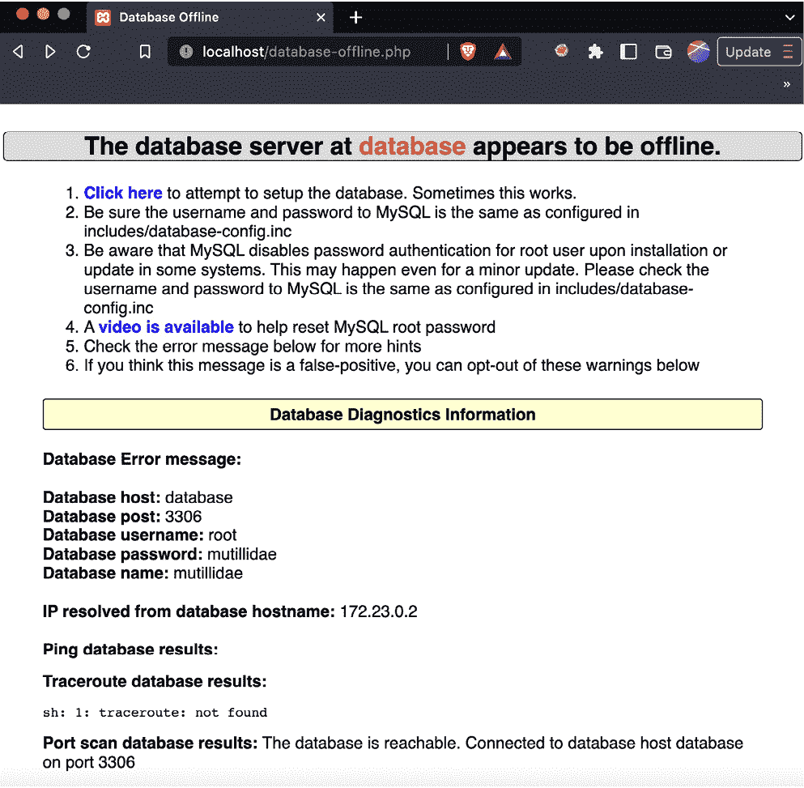

图 5.3 – Mutillidae 的本地主机

1.  接下来，在*步骤 1*中按下**点击此处**按钮，如*图 5**.3*所示。这将弹出一个消息。点击**确定**。

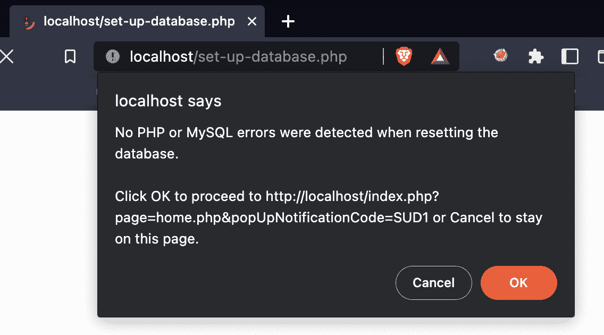

图 5.4 – 点击此处消息

1.  点击**确定**后，应用程序将重定向到 Mutillidae 主页，如*图 5**.5*所示：

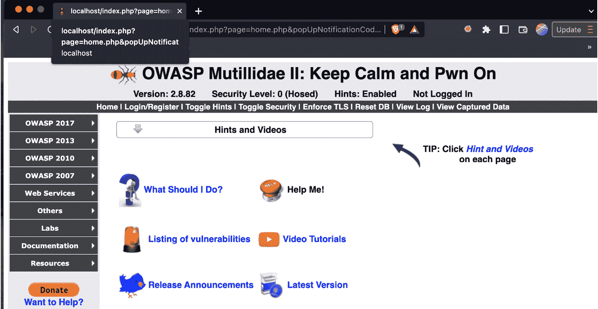

图 5.5 – Mutillidae 主页

设置完成。

# 测试 Cookie 属性

Cookies 是网站存储在计算机上的文本文件。网站使用 cookies 来跟踪用户活动、提供个性化体验和/或进行会话管理。因此，在大多数情况下，cookies 包含大量关于用户的私密信息，使其成为犯罪分子的攻击目标。

由于 cookie 中可能存储的数据非常敏感，业界已经创建了 cookie 属性来帮助保护 cookie 数据。以下是可以设置的属性及其解释：

+   **Secure 属性**：

**Secure**属性确保 cookie 通过 HTTPS 发送，以防止中间人攻击。

+   **HttpOnly 属性**：

**HttpOnly**属性被设置为防止客户端脚本访问 cookie 数据。此属性作为防御跨站脚本攻击的另一层保护。

+   **Domain 属性**：

**Domain**属性用于设置 cookie 可以使用的域范围。如果请求 URL 中的域与**Domain**属性中的域不匹配，cookie 将无效。

+   **Path 属性**：

**Path**属性被设置为指定 cookie 可以使用的路径。如果路径匹配，则 cookie 将在请求中发送。

+   **Expires 属性**：

**Expires**属性被设置为指定 cookie 的生命周期。

+   **SameSite 属性**：

**SameSite**属性被设置为限制在跨站请求中发送 cookie。此属性用于限制与第三方共享 cookie，并作为防御**跨站请求伪造**（**CSRF**）攻击的保护。**SameSite**属性可以设置为以下值之一：**Strict**、**Lax**或**None**。如果将值设置为**None**，cookie 将会在跨站请求中发送。如果将值设置为**Strict**，cookie 将仅发送到它的来源站点。如果将值设置为**Lax**，即使 cookie 是由第三方创建的，只要 URL 与 cookie 的域匹配，cookie 仍会被发送。

## 准备工作

对于本教程，您需要启动 ZAP 并确保它正在拦截服务器与浏览器之间的通信。此外，您需要一个 PortSwigger Academy 的用户账户（[portswigger.net/web-security](http://portswigger.net/web-security)）。

## 如何操作...

默认情况下，ZAP 在被动扫描器中具有规则，如果未设置之前定义的某个属性，将发出警报。在本教程中，我们将启动 PortSwigger 实验室，查看 ZAP 中的 cookie 警报。以下步骤将引导您完成此过程：

1.  第一步是浏览[portswigger.net/web-security](http://portswigger.net/web-security)，然后点击顶部导航栏中的**All Labs**。

1.  一旦进入实验室页面，点击**Exploiting cross-site scripting to steal cookies >>**，如*图 5.6*所示：


图 5.6 – PortSwigger 实验室

1.  点击 **访问实验室**，如 *图 5.7* 所示，并登录：

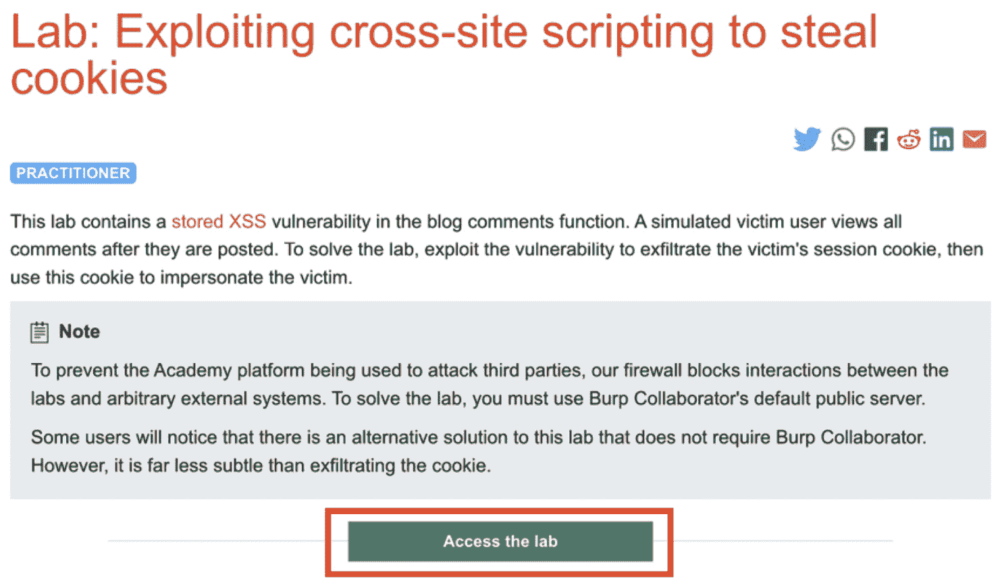

图 5.7 – 访问实验室

1.  实验提供了一个易受攻击的应用程序。打开该应用程序后，点击 ZAP 中的 **新建上下文** 按钮，并在 **新建上下文** 窗口中选择该应用程序作为 **顶级节点**，如 *图 5.8* 所示：


图 5.8 – 新建上下文窗口

1.  点击目标图标，只有在范围内的应用程序才会显示发现的内容。

1.  右键点击上下文，点击 **蜘蛛爬取...**，如 *图 5.9* 所示，开始对网站进行爬取：

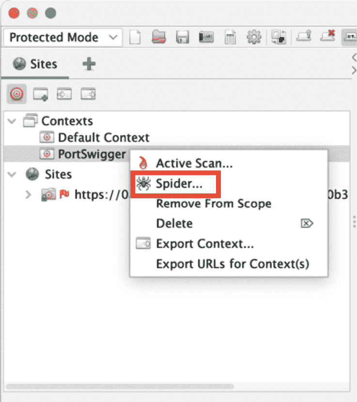

图 5.9 – 爬虫抓取

这样做会将爬虫添加到 ZAP 的底部窗口（如果它不在那里），你会看到进度条。

1.  完成蜘蛛爬取后，点击底部窗口中的 **警报** 标签。你会看到 ZAP 发现该应用程序的 cookie 没有包含 **HttpOnly** 标志和 **SameSite** 属性，如 *图 5.10* 所示：


图 5.10 – Cookie 警报

## 操作原理...

在这个实验中，我们已经看到如何使用 ZAP 来测试缺失的 cookie 安全属性。ZAP 内置了规则，如果 cookie 缺少安全属性，会触发警报。ZAP 被动地发现这些问题；无需进行主动扫描。

# 测试跨站请求伪造 (CSRF)

在本实验中，我们将介绍如何执行 CSRF 攻击，在此过程中，我们能够以不同的用户身份发布评论。应用程序需要足够安全，因为 CSRF 漏洞允许攻击者利用该漏洞，使用户在不知情的情况下更改敏感信息。

## 准备工作

为了准备这个实验，请启动 ZAP 和 Mutillidae II。确保 ZAP 拦截来自 Mutillidae II 应用程序的流量。你还需要一个 Mutillidae II 测试账户来发布消息。

## 如何操作...

1.  第一步是使用你创建的账户登录到 Mutillidae II，导航到博客页面，并在启用代理的情况下，提交博客帖子。在应用程序中使用下拉菜单，进入 OWASP 2013，再到 A8 - 跨站请求伪造 (CSRF)，然后添加到你的博客。在启用代理的情况下，提交博客帖子：

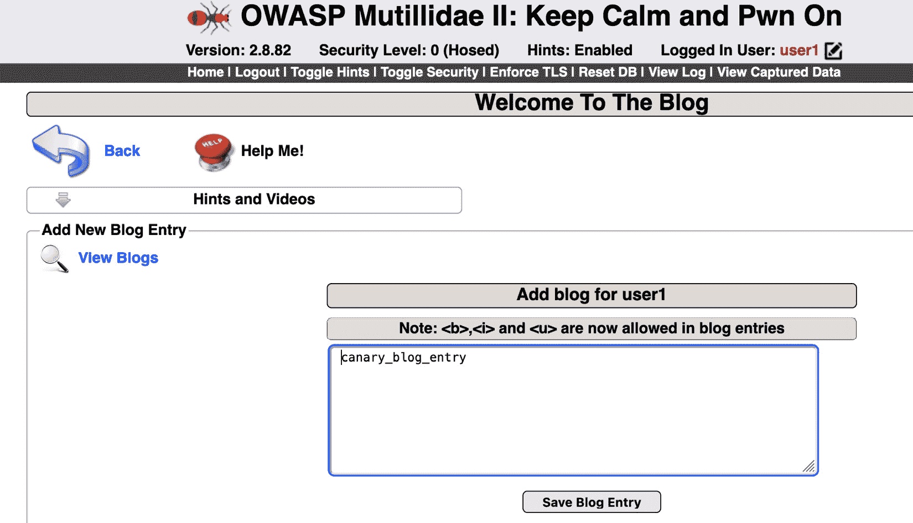

图 5.11 – Mutillidae 添加博客页面


图 5.12 – Mutillidae 当前博客条目

1.  进入 ZAP Proxy，右键点击 POST 请求，点击 **生成反-CSRF** **测试表单**：

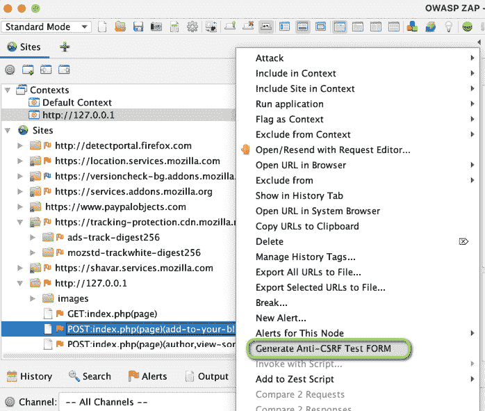

图 5.13 – 生成反-CSRF 测试表单

这将打开一个屏幕，页面上显示表单字段和 CSRF 令牌：

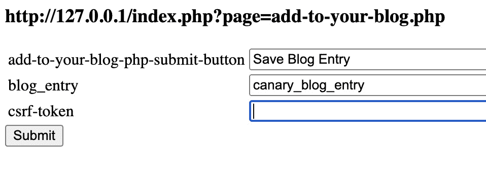

图 5.14 – 博客条目 csrf-token 字段

1.  以另一个用户身份登录同一浏览器，然后在表单中输入随机的 CSRF 令牌和攻击者博客条目：

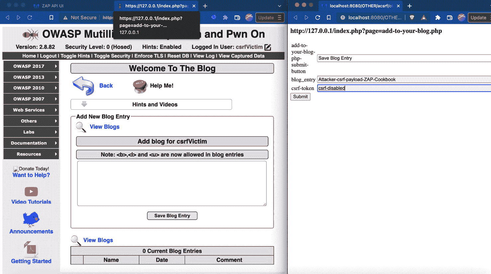

图 5.15 – Mutillidae CSRF 令牌字段操控

1.  请注意，在点击 ZAP 反 CSRF 表单上的**提交**按钮后，页面会重定向到博客页面，并提交了通过 ZAP 代理创建的反 CSRF 表单的博客条目：

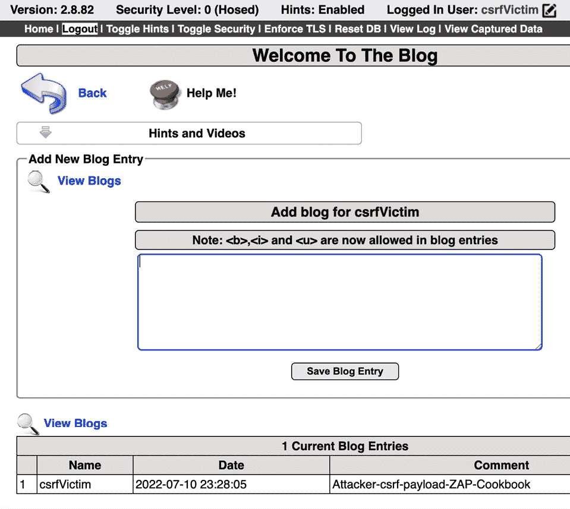

图 5.16 – CSRF 有效载荷

## 它是如何工作的…

在这个配方中，你能够在没有任何 CSRF 令牌的情况下向受害者用户提交请求。这是通过滥用应用程序代码中的配置错误来完成的，该错误允许在没有验证 CSRF 令牌和已登录用户的情况下接受请求。

# 测试注销功能

这个配方专注于测试网站的注销机制。注销机制在应用程序中很重要，用于终止活动会话。一些攻击，如跨站脚本和 CSRF，依赖于用户账户中存在活动会话。因此，拥有构建良好且配置合理的注销功能，可以帮助防止跨站脚本和 CSRF 攻击，通过在预定时间框架后或用户注销后终止活动会话。

会话终止需要测试的三个要素如下：

+   第一项是注销功能。这通常表现为大多数网站上的注销按钮。该按钮应出现在所有页面上，并且应引人注意，确保用户在决定注销时不会错过。

+   第二项是会话超时期。会话超时期指定会话在被终止之前的不活动时长。

+   第三项是服务器端会话终止。应用程序必须确保在用户注销或超时后，服务器端会话状态被终止。

## 准备工作

为了准备这次实验，请确保 OWASP Juice Shop 正在运行，并且 ZAP 正在拦截浏览器与 OWASP Juice Shop 之间的通信。

## 如何实现…

在本实验中，我们将测试当用户注销时，服务器端会话是否被终止。按照以下步骤来查看如何做到这一点：

1.  启动 OWASP Juice Shop 应用程序。

1.  启动 ZAP 并将 OWASP Juice Shop 添加到范围中。

1.  打开 Juice Shop 并进入登录页面。

1.  打开 ZAP 并点击绿色圆圈**设置在所有请求和响应上断点**按钮来添加断点。绿色圆圈按钮会变为红色。

1.  以管理员身份登录。管理员凭据是 admin@juice-sh.op 作为电子邮件地址，**admin123**作为密码。

1.  点击**步骤**按钮，直到看到包含令牌 ID 的登录请求响应，如*图 5.17*所示。然后点击**继续**：

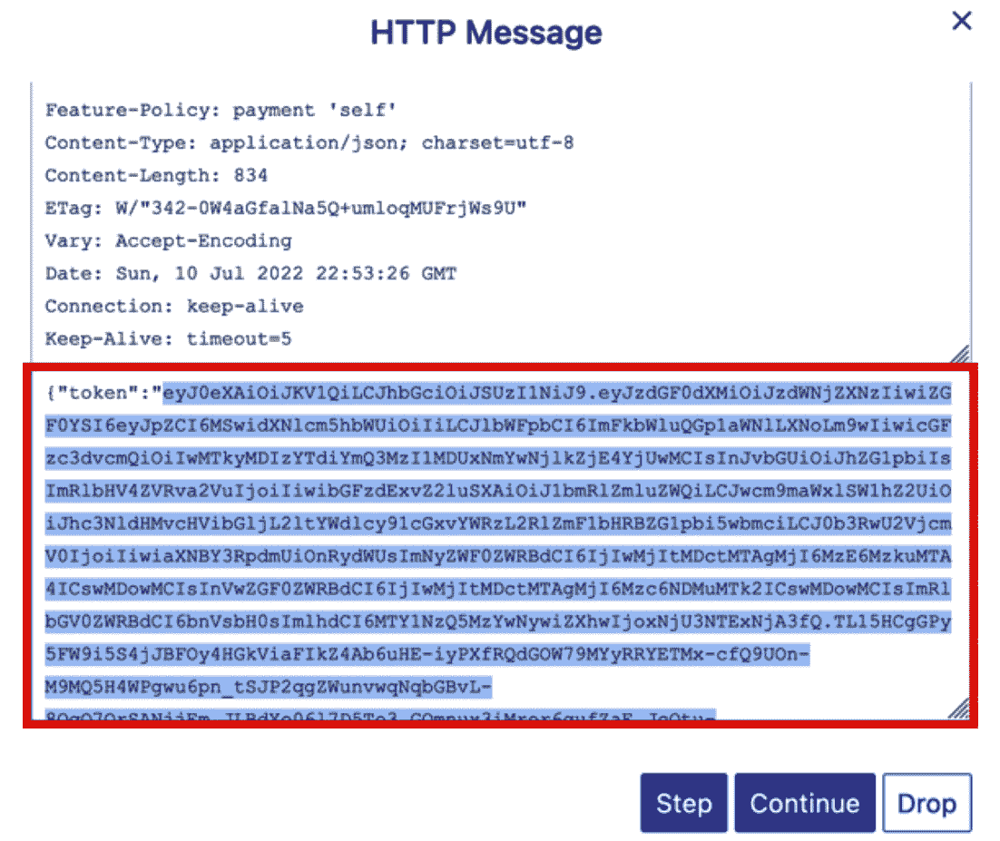

图 5.17 – JWT 令牌 ID

1.  在 Juice Shop 应用中，点击**账户**，然后点击**订单与支付**，接着点击**订单历史**，如*图 5.18*所示：

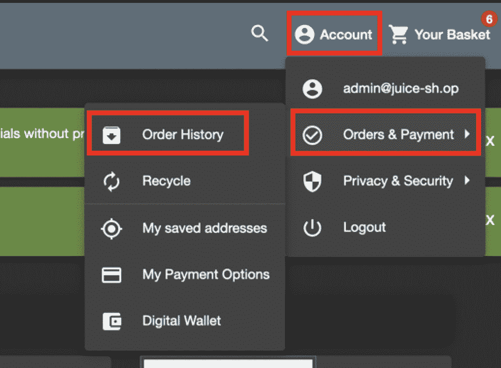

图 5.18 – 订单历史到订单与支付

1.  点击**账户**，然后点击**注销**，以退出 Juice Shop。

1.  打开 ZAP，在**历史**标签中，搜索以下**/rest/order-history** URL 的 GET 请求，如*图 5.19*所示：


图 5.19 – /rest/order-history 的 GET 请求

1.  右键点击请求，选择**用请求编辑器打开/重新发送...**，如*图 5.20*所示：

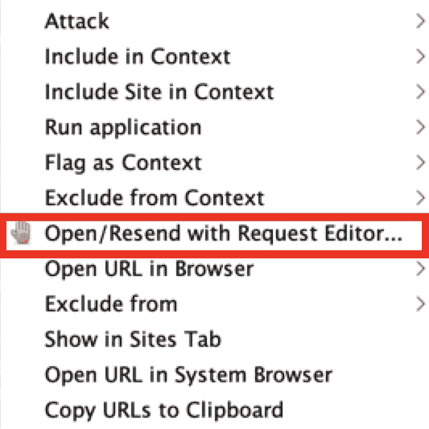

图 5.20 – 请求编辑器

这将打开**手动请求编辑器**。在请求编辑器中，你可以编辑请求。

1.  点击**发送**以重新发送请求：


图 5.21 – 手动请求编辑器发送

1.  发送请求后，**响应**标签将打开，其中将包括服务器的响应。你可以看到请求被接受，并且响应中包含了管理员用户的订单历史，如*图 5.22*所示：

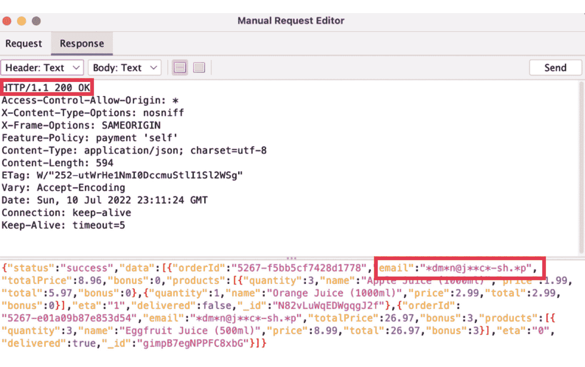

图 5.22 – 订单历史响应

## 工作原理...

在这个实验中，我们作为管理员用户在用户已经注销后重新发送请求。该请求被服务器接受，且返回了包含用户信息的响应，这证明即使我们作为管理员用户已经注销，应用程序并没有在后台终止管理员用户的会话，这使得我们能够执行未经授权的操作。

## 还有更多内容...

其他类型的注销功能测试，例如会话超时，可以通过等待递增时间进行测试（即 15 分钟、30 分钟、1 小时、1 天）。测试时，登录应用程序并设置计时器，等待递增的时间段，希望能够成功注销。时间过后，尝试刷新网页应用页面、在应用程序上执行操作，或重新发送请求以触发应用程序的会话超时。

## 另见

另一种利用会话变量的攻击是会话拼图攻击或会话变量重载攻击。使用会话变量处理多个目的的应用程序容易受到这种攻击。有关这种攻击的更多信息，请参见以下链接：[`owasp.org/www-project-web-security-testing-guide/latest/4-Web_Application_Security_Testing/06-Session_Management_Testing/08-Testing_for_Session_Puzzling`](https://owasp.org/www-project-web-security-testing-guide/latest/4-Web_Application_Security_Testing/06-Session_Management_Testing/08-Testing_for_Session_Puzzling)。

# 测试会话劫持

在本教程中，我们将演示如何通过利用 web 会话控制机制（即会话令牌）劫持会话，并使用该令牌（即 cookie）接管一个不知情用户的会话。常见的漏洞包括会话嗅探、恶意 JavaScript 代码（如 XSS、CSRF）或**中间人攻击**（**MiTM**）导致令牌可预测。

我们将使用 MiTM 攻击通过跨站脚本攻击盗取会话令牌，并将盗取的令牌重放到另一个用户的会话中，进而劫持该用户的 Juice Shop 账户。

## 准备工作

为了准备此教程，请启动 ZAP 和 OWASP Juice Shop。确保 ZAP 在 OWASP Juice Shop 应用程序主页拦截流量，并注册/创建两个不同的用户。

## 如何进行...

我们将引导您通过以下步骤，教您如何利用 OWASP Juice Shop 中的两个用户进行会话劫持，通过 MiTM 攻击捕获会话 cookie 或令牌，并将其加载到另一个用户的请求中，劫持该会话并验证用户账户。

以下步骤将引导您完成此过程：

1.  打开 ZAP 的**手动探索**页面，输入 Juice Shop URL，并点击**启动浏览器**，如*图 5.23*所示：

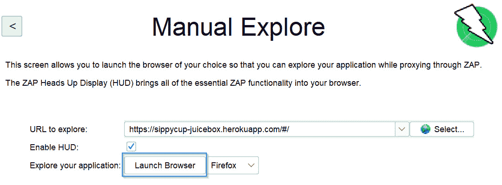

图 5.23 – Juice Shop URL 中的手动探索

1.  首先，进入**账户**，选择**登录**，然后选择**还不是客户**。

1.  创建一个**User1@email.com**，密码可以随便设置，安全问题也随便填写。

1.  创建第一个用户后，重复*步骤 1*和*步骤 2*来创建**User2@email.com**。

1.  使用*User1*账户登录到 Juice Shop。

1.  在所有请求和响应上设置断点，并刷新*User1*的已登录网页。

这可以通过启动的**手动探索**浏览器或工作区窗口来实现：


图 5.24 – 在所有请求和响应上设置断点

1.  在 ZAP 中，您将看到一个新的标签页，名为**Break**，如*图 5.25*所示，它会显示捕获的*User1*会话（JWT）令牌。

1.  复制请求中**token=**和**Upgrade-Insecure-Requests**之间的所有文本：

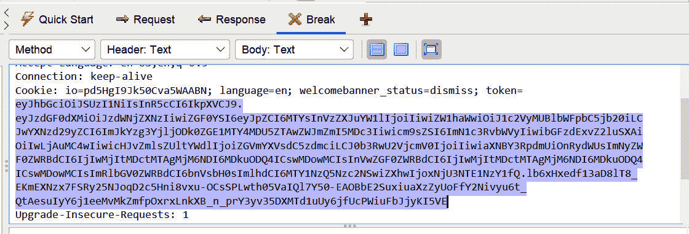

图 5.25 – 捕获的会话令牌

1.  登出*User1*账户并使用*User2*账户登录。

1.  在以*User2*身份登录的状态下，打开浏览器的**检查**工具并转到**存储**标签。

1.  在 Cookies 的储存区中，点击打开下拉菜单并选择 Juice Shop 网址。

1.  将*User2*的令牌元素替换为*User1*的会话令牌，然后按下键盘上的*Enter*键。

1.  刷新浏览器网页并打开 Juice Shop 的**账户**菜单。现在将显示*User1*已经登录，而不是*User2*，成功劫持了*User1*的会话。

## 它是如何工作的……

用户会话在未获得用户知情或同意的情况下被控制的行为称为会话劫持。此操作通常通过获取用户的**JSON Web Token**（**JWT**）来实现，该令牌用于在网页应用程序中验证用户身份。

获取受害者 JWT 的攻击者可以冒充受害者并访问其账户。这是通过将被窃取的 JWT 放入网页应用请求的 HTTP 头部来实现的。由于 JWT 看起来是合法的，并且由应用程序提供，应用程序会将请求当作来自受害者的请求处理。

攻击者可以通过多种方式获取受害者的 JWT，包括网络钓鱼攻击、中间人攻击（MiTM）以及利用应用程序或受害者设备中的弱点。

## 还有更多……

ZAP 可以通过进入**选项**并滚动到**常规**中的**JWT**设置来扫描 JWT 令牌漏洞，勾选**启用客户端配置扫描**。稍后，在*第十章*，“*高级攻击技术*”中，在*操作 JSON Web 令牌*这一食谱中，我们将回顾如何在 ZAP 中使用和滥用它。此外，这些令牌可以通过**编码/解码/哈希**工具进行解码，以查看其中的内容，如头部算法、用户名、密码、令牌过期时间等。在*第十二章*中，我们将进一步讨论 JWT 令牌的结构、如何解码它们，并展示可以尝试的攻击方法。

## 参见

为了进一步理解会话劫持及其缓解方法，可以考虑阅读更多资料：

+   [`owasp.org/www-community/attacks/Session_hijacking_attack#`](https://owasp.org/www-community/attacks/Session_hijacking_attack#)

+   [`cheatsheetseries.owasp.org/cheatsheets/Session_Management_Cheat_Sheet.html`](https://cheatsheetseries.owasp.org/cheatsheets/Session_Management_Cheat_Sheet.html)

+   [`owasp.deteact.com/cheat/cheatsheets/Input_Validation_Cheat_Sheet.html`](https://owasp.deteact.com/cheat/cheatsheets/Input_Validation_Cheat_Sheet.html)
