# 8

# 业务逻辑测试

太好了！你已经完成了三分之一。在本章中，我们将讨论**业务逻辑缺陷**。业务逻辑缺陷是一种错误类型，攻击者发现利用应用程序的实际处理流程的方式，给关联带来负面影响。

在这里，你将学习如何绕过前端 GUI 应用程序，直接将数据发送到后台进行处理。我们还将发现如何通过简单地保持活动会话并未在*预期*时间内提交交易，来操控和干扰设计的业务流程，在*测试流程时序*的实验中就是这种情况。此外，我们还将了解工作流漏洞，包括任何使攻击者能够以某种方式滥用系统或应用程序的缺陷，从而避免（不遵循）预定或构建的工作流。

最后，我们将探讨意外文件类型上传的情况，在这种情况下，应用程序可能只接受某些文件类型（如**.csv**或**.txt**文件）进行处理，并且可能不会检查上传文件的内容或扩展名。这可能导致系统或数据库结果异常，或为攻击者提供新的漏洞可供利用。

在本章中，我们将涵盖以下实验：

+   测试伪造请求的能力

+   测试流程时序

+   测试绕过工作流

+   测试上传带有恶意载荷的意外文件类型

# 技术要求

你需要安装 OWASP ZAP 代理，以便使用你的 PortSwigger 帐户访问 PortSwigger Academy 实验室，这些实验室将在本章的实验中使用。

# 测试伪造请求的能力

攻击者通过伪造请求，将数据直接发送到应用程序的后台进行处理，而不是通过其前端 GUI。

攻击者尝试通过拦截代理（在本例中为 OWASP ZAP）提交包含不被允许、未受保护或未被应用程序业务逻辑预料到的数据值的 HTTP **GET**/**POST**请求；在本例中，攻击者（即你）将利用应用程序逻辑中的缺陷，以意外的价格购买一件皮夹克。

## 准备就绪

本实验需要一个 PortSwigger Academy 帐户和 ZAP，以便拦截从服务器到浏览器的请求和响应。

## 如何操作…

在这一部分，我们将使用 PortSwigger Academy 的*过度信任客户端控制*实验，通过编辑请求来改变产品的价格。请按照以下说明完成此实验：

1.  在浏览器中通过 ZAP 代理访问 URL，并登录到 PortSwigger Academy 网站以启动实验：

[`portswigger.net/web-security/logic-flaws/examples/lab-logic-flaws-excessive-trust-in-client-side-controls`](https://portswigger.net/web-security/logic-flaws/examples/lab-logic-flaws-excessive-trust-in-client-side-controls)

1.  一旦你访问实验室，登录到实验室应用程序的**我的账户**，并使用提供的**用户名**/**密码**：**wiener**/**peter**。没有登录你将无法完成购买。

你还会注意到账户有**$100.00**的店内积分余额。

1.  尝试通过将第一个商品**轻便‘l33t’皮夹克**添加到购物车并完成整个购买过程。

由于没有足够的店内积分，订单被拒绝，如*图 8.1*所示：


图 8.1 – 轻便夹克购买失败

1.  在 ZAP 中，进入**历史**并查看订单过程。你会注意到，当你将商品添加到购物车时，相应的请求中包含一个价格参数。

1.  从购物车中移除商品，但停留在显示**购物车为空**的页面上。

1.  右键点击**POST <url>/cart**请求，并选择**使用请求编辑器打开/重新发送**。

1.  在请求编辑器中，将价格更改为一个任意整数，并确保末尾有两个零以便计算零钱（即**1700**），然后发送请求，如*图 8.2*所示：

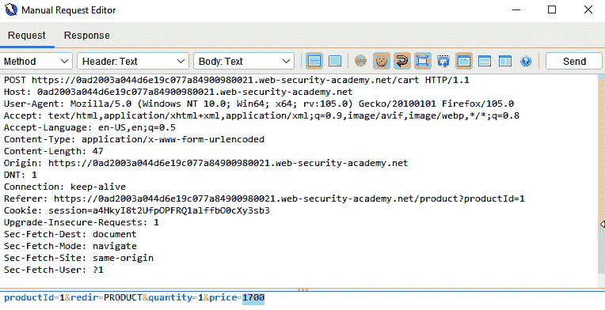

图 8.2 – 修改价格的请求

1.  在网页上，刷新购物车并注意到商品已经回到购物车中，但确认价格已根据你的输入发生了变化（见*图 8.3*）：

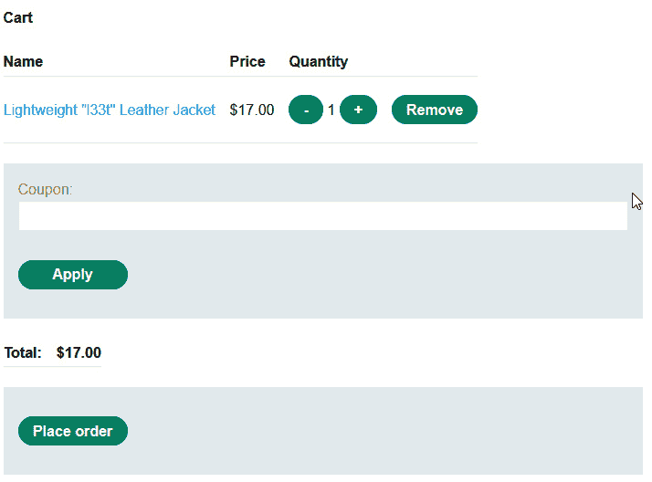

图 8.3 – 购物车中已更改的商品

1.  重复此过程，将价格设置为低于可用店内积分的任意金额。

1.  完成订单以解决实验室问题，如*图 8.4*所示：


图 8.4 – 完成的购买订单

## 它是如何工作的…

这些缺陷通过检查项目文档中的字段功能来加以利用，功能可以推断或预测，或者是隐藏的。为了避免遵循标准的业务逻辑程序，插入逻辑上合理的数据。

## 参见

对于其他类似的情况，请参阅以下内容：

+   *测试暴露的* *会话变量*：

[`owasp.org/www-project-web-security-testing-guide/stable/4-Web_Application_Security_Testing/06-Session_Management_Testing/04-Testing_for_Exposed_Session_Variables`](https://owasp.org/www-project-web-security-testing-guide/stable/4-Web_Application_Security_Testing/06-Session_Management_Testing/04-Testing_for_Exposed_Session_Variables)

+   *跨站请求伪造测试*：

[`owasp.org/www-project-web-security-testing-guide/stable/4-Web_Application_Security_Testing/06-Session_Management_Testing/05-Testing_for_Cross_Site_Request_Forgery`](https://owasp.org/www-project-web-security-testing-guide/stable/4-Web_Application_Security_Testing/06-Session_Management_Testing/05-Testing_for_Cross_Site_Request_Forgery)

+   *测试账户枚举和可猜测的* *用户账户*：

[`owasp.org/www-project-web-security-testing-guide/stable/4-Web_Application_Security_Testing/03-Identity_Management_Testing/04-Testing_for_Account_Enumeration_and_Guessable_User_Account`](https://owasp.org/www-project-web-security-testing-guide/stable/4-Web_Application_Security_Testing/03-Identity_Management_Testing/04-Testing_for_Account_Enumeration_and_Guessable_User_Account)

# 测试过程时延

过程时延测试是一种业务逻辑测试类型，重点在于查找应用程序完成某些过程（如身份验证）时的流动。在过程时延测试中，测试者观察应用程序处理有效输入与无效输入或操作所花费的时间。测试者验证攻击者是否无法仅通过应用程序完成操作所需的时间来判断应用程序的行为。在身份验证示例中，通过监控过程时延，基于输入有效凭证与无效凭证的时间差异，攻击者可以判断凭证是否有效，而无需依赖图形用户界面（GUI）。

## 准备就绪

对于这个教程，你需要启动 PortSwigger 的 *用户名枚举通过响应时间* 实验，并确保 ZAP 在拦截实验应用程序与浏览器之间的流量。

## 如何操作…

以下是逐步教程，演示如何使用过程时延来找到正确的登录信息：

1.  使用浏览器代理到 ZAP，导航到以下 URL 并登录到 PortSwigger Academy 网站以启动实验：

[`portswigger.net/web-security/authentication/password-based/lab-username-enumeration-via-response-timing`](https://portswigger.net/web-security/authentication/password-based/lab-username-enumeration-via-response-timing)

1.  打开 *用户名枚举通过响应时间* 实验并启动 ZAP，拦截浏览器和实验之间的通信。

1.  创建一个上下文并将应用程序的 URL 添加进去，然后点击目标符号，以便仅显示来自应用程序的请求，出现在 **站点树** 和 **历史记录** 标签页中。

1.  尝试使用不同的用户名和密码登录五次；如*图 8.5*所示，你的 IP 地址已被封锁。

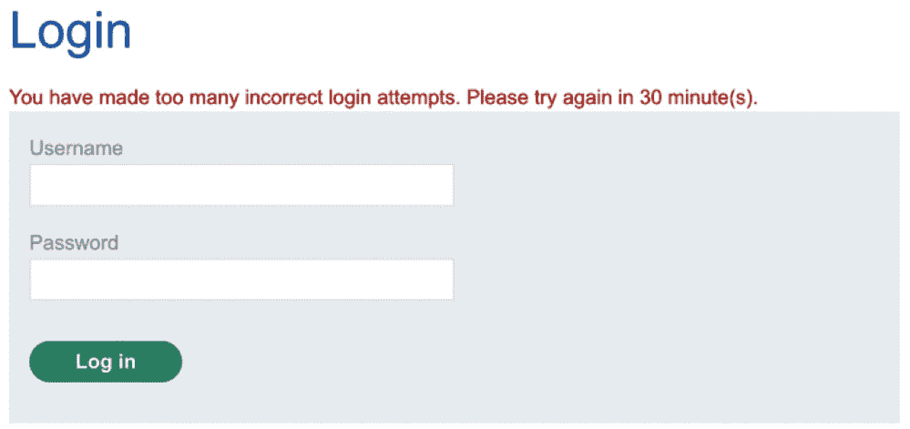

图 8.5 – 用户账户被封锁 30 分钟

1.  如果 IP 地址被封锁，我们将无法执行暴力破解攻击。为了绕过这个问题，我们可以使用 **X-Forwarded-For** HTTP 头部，这将允许我们伪造 IP 地址。现在，选择尝试登录时发送的 **POST** 请求；该请求的 URL 以 **/login** 结尾，如*图 8.6*所示。右键点击请求并选择 **打开/重新发送请求编辑器…** 选项：


图 8.6 – 登录的 POST 请求

1.  **请求编辑器**窗口将打开。在**请求**标签中，向下滚动至 HTTP 头部的末尾并添加**X-Forwarded-For**头部。我们将该头部的值设置为**100**，如*图 8.7*所示。更改用户名和密码的值，并点击**发送**。*图 8.7*还显示了**用户名**和**密码**字段的高亮显示；图片中这些字段的值是**admin**和**admin**。

如你所见，请求已成功发送。

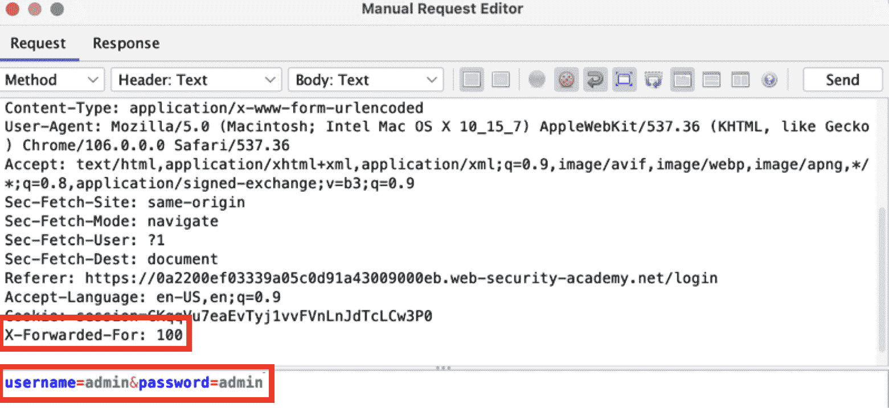

图 8.7 – X-Forwarded-For 头部

1.  为了能够自动并持续地更改**X-Forwarded-For**字段的值，我们需要下载**社区脚本**。这是为了暴力破解**密码**和**用户名**字段。以下是下载**社区脚本**的步骤：

    1.  所以，首先通过点击三立方体图标打开**管理附加组件**窗口，如*图 8.8*所示：


图 8.8 – 管理附加组件图标

1.  一旦**管理附加组件**窗口打开，导航到**市场**标签，搜索**社区脚本**。勾选它旁边的复选框，并点击**安装所选项**，如*图 8.9*所示：


图 8.9 – 市场社区脚本

1.  安装**社区脚本**后，点击**站点**标签旁边的加号图标，选择**脚本**来添加**脚本**标签。

1.  展开**Fuzzer HTTP 处理器**部分，通过右键点击**random_x_forwarded_for_ip.js**并点击**启用脚本**来启用它，如*图 8.10*所示：

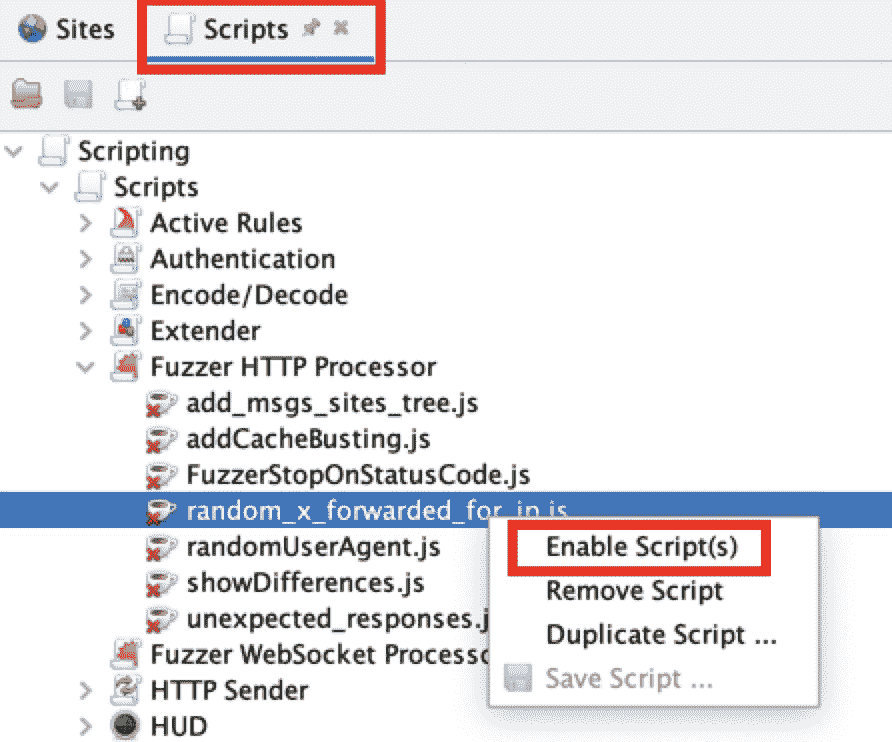

图 8.10 – 启用脚本

以下是脚本的代码，以防它从社区脚本中被删除：

```
 function processMessage(utils, message) {
     var random_ip = Math.floor(Math.random() * 254)+ "." + Math.floor(Math.random() * 254) + "." + Math.floor(Math.random() * 254) + "." + Math.floor(Math.random() * 254);
     message.getRequestHeader().setHeader("X-Forwarded-For", random_ip);
}
function processResult(utils, fuzzResult){
     return true;
}
function getRequiredParamsNames(){
     return [];
}
function getOptionalParamsNames(){
     return [];
}
```

1.  现在，右键点击我们刚才发送的最后一个请求，即我们添加了**X-Forwarded-For**头部的请求；该请求的来源应显示为**手动**。点击**打开**/**使用请求编辑器重新发送...**，请求将在**请求编辑器**窗口中打开。将密码设置为一个非常长的密码（300 个以上字符）；在这个请求中，我将**thezaplife**添加了 21 次作为密码，如*图 8.11*所示：


图 8.11 – 请求编辑器设置密码

1.  右键点击**历史记录**标签中的最后一个登录请求——它应该是我们添加了长密码的请求，请求的来源应显示为**手动**。选择**攻击**并点击**模糊...**，这将打开**Fuzzer**窗口。

1.  导航到**消息处理器**标签，点击**添加...**，这将打开**添加消息处理器**窗口。在**脚本**字段中，选择我们之前添加的脚本并点击**添加**，如*图 8.12*所示：

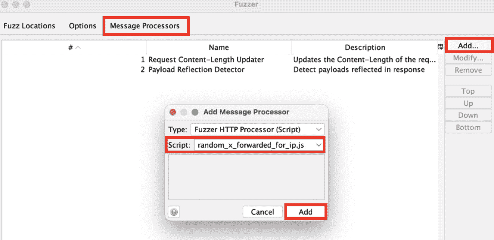

图 8.12 – 消息处理器

1.  转到**Fuzz Locations**选项卡。在这一步中，我们将进行用户名的暴力破解，所以选择用户名并点击**添加**。点击**添加**后，**有效负载**窗口将打开；再点击**添加**。

1.  当**添加有效负载**窗口出现时，选择**字符串**作为类型，并输入实验中提供的用户名列表。用户名列表可以通过点击实验主页上**候选用户名**的链接在访问实验之前查看。*图 8.13*展示了有效负载中的用户名列表。输入用户名后，点击**添加**，然后在**有效负载**窗口中点击**确定**。

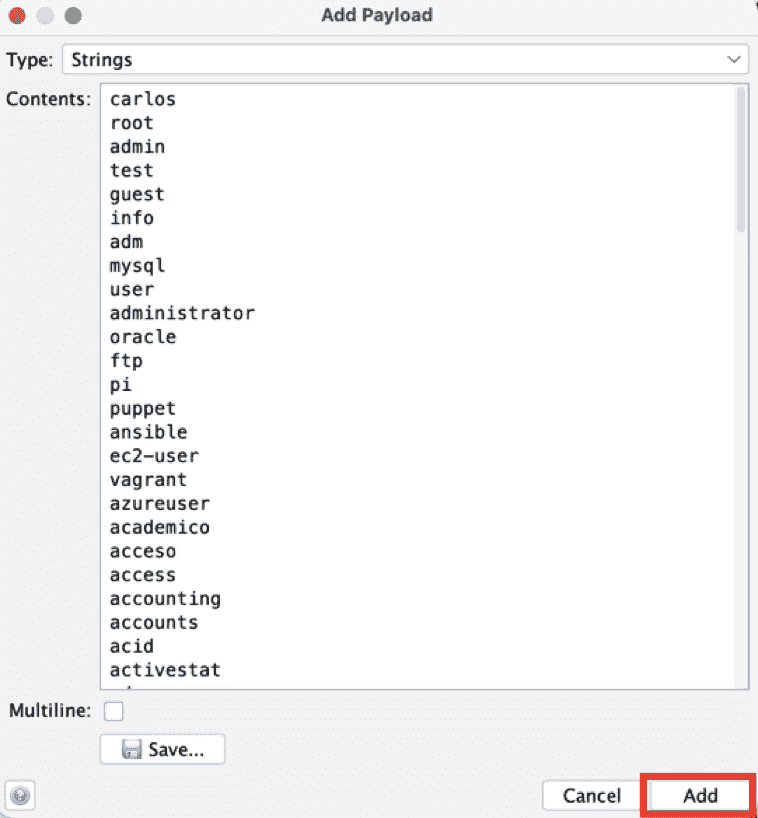

图 8.13 – 添加有效负载

1.  然后，点击**启动 Fuzzer**，如*图 8.14*所示：

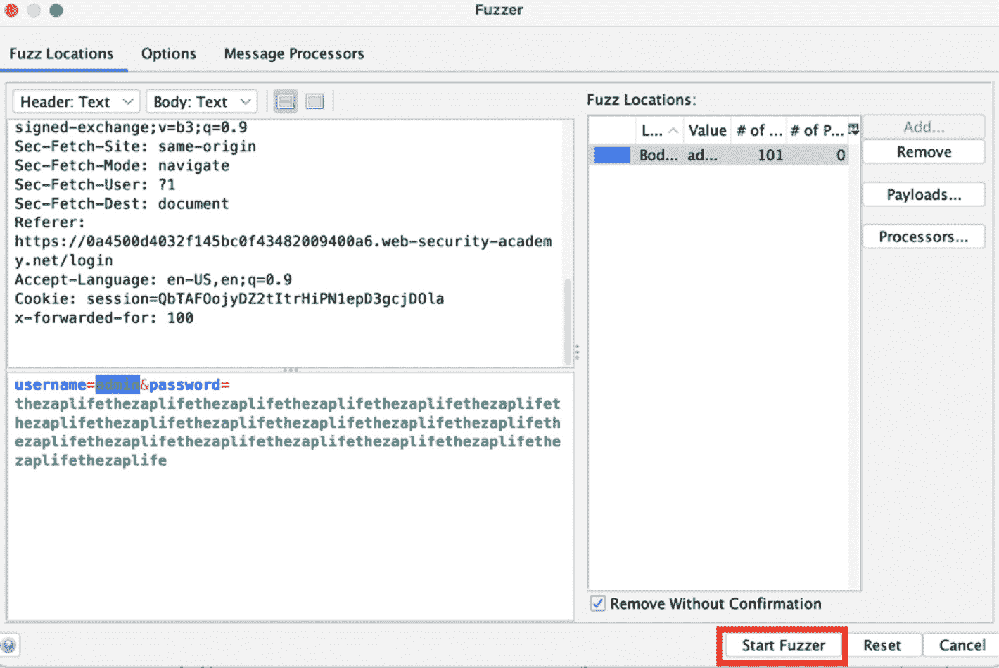

图 8.14 – 添加有效负载的 Fuzzer 启动

1.  拥有最长 RTT 时间的用户名就是正确的用户名。在我的案例中，最长 RTT 时间与用户名**activestat**相关，如*图 8.15*所示。

1.  记下五个具有最长 RTT 时间的用户名；如果你没有找到第一个用户名的密码，可以尝试其他用户名。


图 8.15 – 密码有效负载的 RTT 时间

1.  现在我们已经有了用户名，接下来我们需要进行密码的暴力破解。但首先，我们需要使用**请求编辑器**重新发送请求以更改用户名。右键点击**历史**选项卡中的最后一个登录**POST**请求，选择**打开**/**使用请求编辑器重新发送...**。

1.  一旦**请求编辑器**窗口打开，将用户名更改为具有最长 RTT 时间的用户名。在我的情况下，用户名将是**activestat**，如*图 8.16*所示。点击**发送**。


图 8.16 – activestat 的用户名

1.  在**历史**选项卡中找到请求，右键点击，悬停在**攻击**上，然后点击**Fuzz...**。

1.  转到**消息处理器**选项卡，点击**添加**，这将打开**添加消息处理器**窗口。

1.  当**添加消息处理器**窗口打开时，选择我们之前添加的脚本，在**脚本**字段中，点击**添加**，如*图 8.13*所示。

1.  转到**Fuzz Locations**选项卡，选择**password**，然后点击**添加**。当**有效负载**窗口打开时，再次点击**添加**。当**添加有效负载**窗口出现时，选择**字符串**作为类型，并输入实验中提供的密码列表。密码列表可以通过点击实验主页上**候选密码**的链接在访问实验之前查看。*图 8.17*展示了有效负载中的密码列表。输入密码后，点击**添加**，然后在**有效负载**窗口中点击**确定**。


图 8.17 – 候选密码负载

1.  然后，点击**开始模糊测试器**，如*图 8.19*所示：

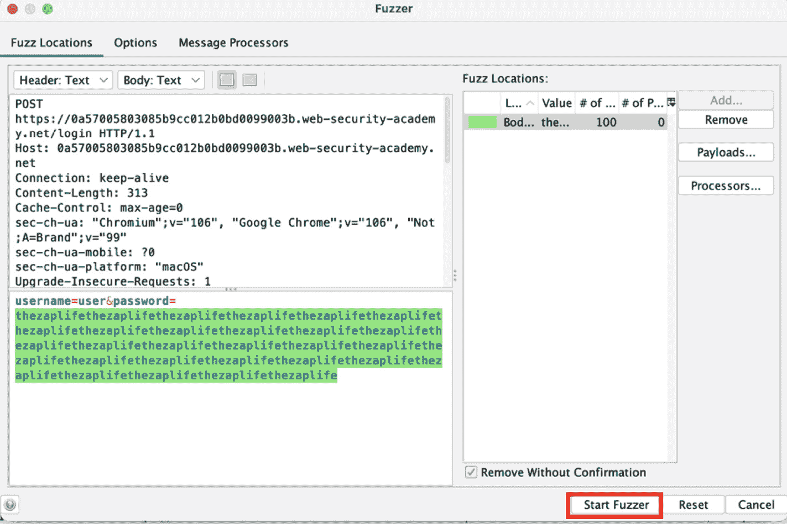

图 8.18 – 有效负载的开始模糊测试器

1.  在**模糊测试器**标签页中，通过点击**代码**栏的**代码**字样进行排序。正确的密码会显示为**302 Found**，如*图 8.20*所示。正确的密码会列在**有效负载**栏中，在我的情况下，它是**montana**：


图 8.19 – 正确密码的 302 Found

1.  现在我们已经知道了正确的用户名和密码，让我们尝试使用这些信息登录网页。如果登录成功，应用程序将显示你的用户名和电子邮件，如*图 8.21*所示：

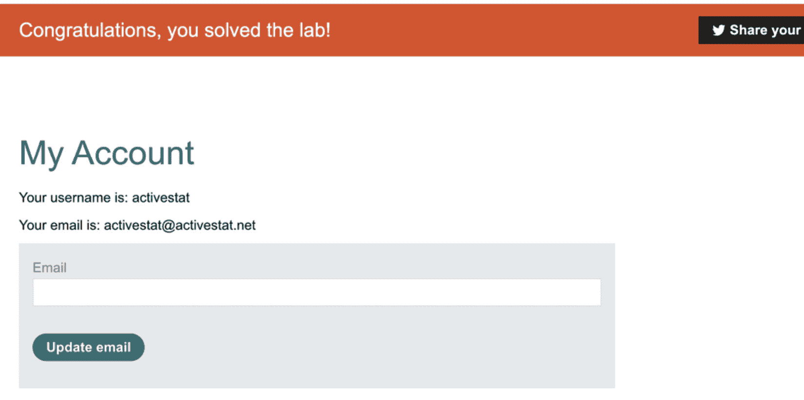

图 8.20 – 已解决实验的显示

## 它是如何工作的……

许多系统登录过程需要用户名和密码。如果你仔细观察，当猜测用户名时，如果找到了正确的用户名但输入了错误的密码，所需的时间比输入错误的用户名和错误的密码都要长。这使得即使不知道正确的密码，我们也能找到正确的用户名。然后，如果知道用户名，猜测密码会比同时猜测用户名和密码要容易得多。这种类型的过程定时攻击使得攻击者可以通过分析过程完成所需的时间来判断他们是否拥有有效的用户名，而不依赖于图形用户界面消息。

重要说明

同时对用户名和密码进行模糊攻击（即集群轰炸），也可以用来暴力破解登录。然而，如果可能，先枚举一个有效的用户名要比同时枚举用户名和密码更高效。

## 另见

对于其他类似的案例，请访问以下链接：

+   *测试 Cookies* *属性*：[`owasp.org/www-project-web-security-testing-guide/stable/4-Web_Application_Security_Testing/06-Session_Management_Testing/02-Testing_for_Cookies_Attributes`](https://owasp.org/www-project-web-security-testing-guide/stable/4-Web_Application_Security_Testing/06-Session_Management_Testing/02-Testing_for_Cookies_Attributes)

+   *测试会话* *超时*：[`owasp.org/www-project-web-security-testing-guide/stable/4-Web_Application_Security_Testing/06-Session_Management_Testing/07-Testing_Session_Timeout`](https://owasp.org/www-project-web-security-testing-guide/stable/4-Web_Application_Security_Testing/06-Session_Management_Testing/07-Testing_Session_Timeout)

# 测试绕过工作流

如果用户未按应用程序的业务逻辑要求正确/精确地完成特定阶段，则必须停止工作流程的所有操作并回滚或取消所有新活动。此实验假设了应用程序购买业务工作流程中事件顺序的固有缺陷。在本实验中，攻击者（你）将利用此缺陷，以零额外成本购买皮夹克。

## 准备工作

对于这个实验，你需要启动 PortSwigger 的*不足的工作流程验证*实验，并确保 ZAP 正在拦截实验应用程序和你的浏览器之间的流量。

## 如何操作...

在这个实验中，我们将演示如何通过添加商品到购物车而不增加价格来绕过商品购买工作流程。按照以下步骤绕过购买工作流程：

1.  在浏览器代理到 ZAP 后，访问该 URL 并登录到 PortSwigger Academy 网站以启动实验：

[`portswigger.net/web-security/logic-flaws/examples/lab-logic-flaws-insufficient-workflow-validation`](https://portswigger.net/web-security/logic-flaws/examples/lab-logic-flaws-insufficient-workflow-validation)

1.  在 ZAP 运行并拦截时，使用提供的用户名和密码登录实验应用程序：**wiener**和**peter**。

1.  转到应用主页，购买任何你*能够*用店铺信用支付的商品，例如*巴贝奇* *Web 喷雾*。

1.  查看代理**历史记录**标签，查找你下单时的订单：

**POST /cart/checkout**

此请求将你重定向到订单确认页面。

1.  打开 ZAP 的**GET /cart/order-confirmation?order-confirmation=true**请求，在请求编辑器中查看。见*图 8.22*：

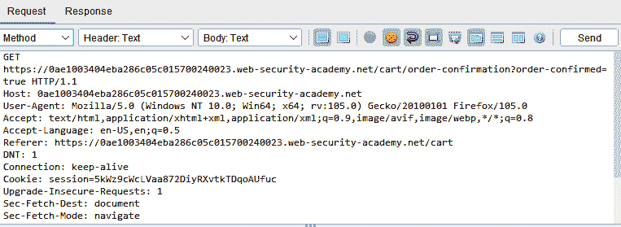

图 8.21 – 获取请求的巴贝奇 Web 喷雾

1.  接下来，将皮夹克添加到你的购物篮中。

1.  在相同的请求编辑器中，重新发送订单确认请求（如*图 8.21*所示），并观察订单完成，但费用没有从你的店铺信用中扣除。

1.  你的**历史记录**标签将显示成功的皮夹克订单请求。见*图 8.23*。

实验已解决。

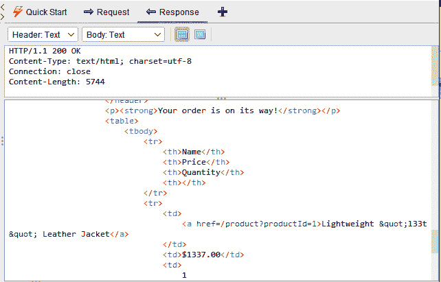

图 8.22 – 已购买皮夹克并完成实验

## 工作原理...

工作流缺陷包括任何使攻击者能够滥用系统或应用程序的缺陷，从而让他们能够避免（不执行）原定或构建的工作流。与业务逻辑工作流相关的漏洞是独特的；每个系统或应用程序都有其自己的工作流来完成某项任务或流程。因此，手动滥用案例必须根据特定于工作流的需求和用例仔细制定。如果交换发起一个操作，如果过程失败，该响应将被撤销并消除。应用程序的工作流必须包含控制机制，以确保用户的事务/操作按正确的顺序进行。

由于漏洞的特定性质是绕过已编程的逻辑，用例非常细致，并且需要手动审查以确定正确的需求，从而避免绕过工作流。

## 另见

+   *OWASP 滥用案例备忘单*：[`cheatsheetseries.owasp.org/cheatsheets/Abuse_Case_Cheat_Sheet.html`](https://cheatsheetseries.owasp.org/cheatsheets/Abuse_Case_Cheat_Sheet.html)

+   *测试目录遍历/文件* *包含*：[`owasp.org/www-project-web-security-testing-guide/latest/4-Web_Application_Security_Testing/05-Authorization_Testing/01-Testing_Directory_Traversal_File_Include`](https://owasp.org/www-project-web-security-testing-guide/latest/4-Web_Application_Security_Testing/05-Authorization_Testing/01-Testing_Directory_Traversal_File_Include)

+   *绕过授权测试* *架构*：[`owasp.org/www-project-web-security-testing-guide/v42/4-Web_Application_Security_Testing/05-Authorization_Testing/02-Testing_for_Bypassing_Authorization_Schema`](https://owasp.org/www-project-web-security-testing-guide/v42/4-Web_Application_Security_Testing/05-Authorization_Testing/02-Testing_for_Bypassing_Authorization_Schema)

+   *会话管理测试* *架构*： [`owasp.org/www-project-web-security-testing-guide/v42/4-Web_Application_Security_Testing/06-Session_Management_Testing/01-Testing_for_Session_Management_Schema`](https://owasp.org/www-project-web-security-testing-guide/v42/4-Web_Application_Security_Testing/06-Session_Management_Testing/01-Testing_for_Session_Management_Schema)

+   *测试业务逻辑数据* *验证*：[`owasp.org/www-project-web-security-testing-guide/latest/4-Web_Application_Security_Testing/10-Business_Logic_Testing/01-Test_Business_Logic_Data_Validation`](https://owasp.org/www-project-web-security-testing-guide/latest/4-Web_Application_Security_Testing/10-Business_Logic_Testing/01-Test_Business_Logic_Data_Validation)

+   *测试伪造* *请求的能力*：[`owasp.org/www-project-web-security-testing-guide/latest/4-Web_Application_Security_Testing/10-Business_Logic_Testing/02-Test_Ability_to_Forge_Requests`](https://owasp.org/www-project-web-security-testing-guide/latest/4-Web_Application_Security_Testing/10-Business_Logic_Testing/02-Test_Ability_to_Forge_Requests)

+   *测试完整性* *检查*: [`owasp.org/www-project-web-security-testing-guide/latest/4-Web_Application_Security_Testing/10-Business_Logic_Testing/03-Test_Integrity_Checks`](https://owasp.org/www-project-web-security-testing-guide/latest/4-Web_Application_Security_Testing/10-Business_Logic_Testing/03-Test_Integrity_Checks)

+   *测试进程* *时序*: [`owasp.org/www-project-web-security-testing-guide/latest/4-Web_Application_Security_Testing/10-Business_Logic_Testing/04-Test_for_Process_Timing`](https://owasp.org/www-project-web-security-testing-guide/latest/4-Web_Application_Security_Testing/10-Business_Logic_Testing/04-Test_for_Process_Timing)

+   *测试一个功能可以使用的次数* *限制*: [`owasp.org/www-project-web-security-testing-guide/latest/4-Web_Application_Security_Testing/10-Business_Logic_Testing/05-Test_Number_of_Times_a_Function_Can_Be_Used_Limits`](https://owasp.org/www-project-web-security-testing-guide/latest/4-Web_Application_Security_Testing/10-Business_Logic_Testing/05-Test_Number_of_Times_a_Function_Can_Be_Used_Limits)

+   *测试针对应用程序* *误用的防御*: [`owasp.org/www-project-web-security-testing-guide/latest/4-Web_Application_Security_Testing/10-Business_Logic_Testing/07-Test_Defenses_Against_Application_Misuse`](https://owasp.org/www-project-web-security-testing-guide/latest/4-Web_Application_Security_Testing/10-Business_Logic_Testing/07-Test_Defenses_Against_Application_Misuse)

+   *测试上传意外文件* *类型*: [`owasp.org/www-project-web-security-testing-guide/latest/4-Web_Application_Security_Testing/10-Business_Logic_Testing/08-Test_Upload_of_Unexpected_File_Types`](https://owasp.org/www-project-web-security-testing-guide/latest/4-Web_Application_Security_Testing/10-Business_Logic_Testing/08-Test_Upload_of_Unexpected_File_Types)

+   *测试上传恶意* *文件*: [`owasp.org/www-project-web-security-testing-guide/latest/4-Web_Application_Security_Testing/10-Business_Logic_Testing/09-Test_Upload_of_Malicious_Files`](https://owasp.org/www-project-web-security-testing-guide/latest/4-Web_Application_Security_Testing/10-Business_Logic_Testing/09-Test_Upload_of_Malicious_Files)

# 测试上传带有恶意有效载荷的意外文件类型

应用程序中的许多业务流程允许上传和修改通过文件上传提供的数据。业务流程必须检查这些文件，只接受特定的 *授权* 文件类型。业务逻辑负责确定哪些文件是 *授权* 的，并且它们是否特定于应用程序/系统。在这个案例中，我们将通过个人资料头像攻击一个可被利用的文件上传选项。由于某些文件扩展名被禁止，简单的防御将通过传统的混淆技术被绕过。

用户将上传一个基本的 PHP Web Shell，用于将 **/home/carlos/** 文件夹中的一个秘密文件内容提取出来以完成实验。

## 准备工作

对于这个实验，你需要启动 PortSwigger 的*Web shell 通过混淆文件扩展名上传*实验，并确保 ZAP 正在拦截实验应用与浏览器之间的流量。

## 如何操作……

在这个实验中，我们将利用文件上传选项上传一个文件，并使用它来窃取数据。按照以下步骤操作，了解如何完成文件上传和数据窃取：

1.  使用浏览器代理到 ZAP 后，导航到以下 URL 并登录到 PortSwigger Academy 网站以启动实验：

[`portswigger.net/web-security/file-upload/lab-file-upload-web-shell-upload-via-obfuscated-file-extension`](https://portswigger.net/web-security/file-upload/lab-file-upload-web-shell-upload-via-obfuscated-file-extension)

1.  使用用户名和密码（**wiener** 和 **peter**）登录，上传任何**.jpg**或**.png**图像作为头像，然后点击**返回我的帐户**返回帐户页面。参见*图 8.24*：

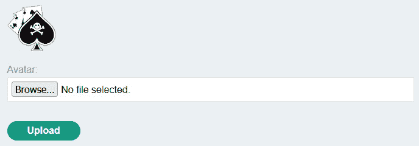

图 8.23 – 上传头像文件

1.  转到**历史记录**，并查找通过**GET**请求**/files/avatars/<YOUR-IMAGE>**检索到的上传图像。

1.  在请求编辑器中打开此请求。

1.  在你的机器上创建一个名为**exploit.php**的文件，包含一个脚本，用于获取 Carlos 的秘密内容——例如，**<?php echo** **file_get_contents('/home/carlos/secret'); ?>**。

1.  尝试使用这个脚本作为你的头像。如*图 8.25*所示，结果表明，你只能提交 JPG 和 PNG 文件。


图 8.24 – 上传 exploit.php 失败

1.  在 ZAP 的**历史记录**标签中，找到用于提交文件上传的**POST /my-account/avatar**请求。

1.  在请求编辑器中，打开**POST /my-account/avatar**请求，并查找与 PHP 文件相关的请求体部分。在**Content-Disposition**头中，将文件名参数的值更改为包含 URL 编码的空字节，然后是**.jpg**扩展名，**filename="exploit.php%00.jpg"**（参见*图 8.26*）：

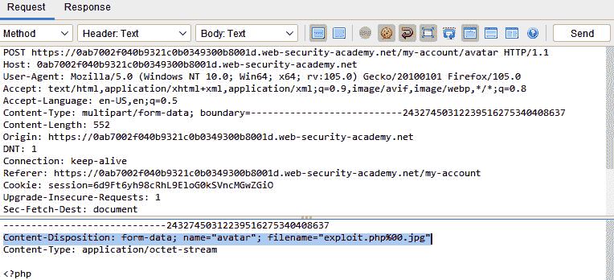

图 8.25 – 上传的文件请求体，exploit.php

1.  点击**发送**以发送请求；如你所见，文件已成功上传。

注意，在响应的消息中，上传的文件名和格式是**exploit.php**，如*图 8.27*所示，这表明空字节和**.jpg**扩展名已经被移除：


图 8.26 – 成功上传 exploit.php

1.  从**Sites**窗口中，打开**GET /files/avatars/<YOUR-IMAGE>**请求，并在请求编辑器中替换路径中的图片文件名为**exploit.php**，然后发送请求。观察到 Carlos 的秘密在响应中返回，如*图 8.28*所示：

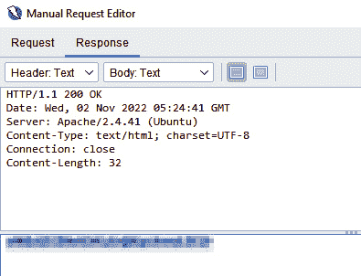

图 8.27 – 响应中包含 Carlos 的秘密（已模糊处理）

1.  提交秘密以解决实验室问题。

## 它是如何工作的...

由于上传过程会在文件缺少指定扩展名时立即拒绝该文件，我们不得不使用一种混淆技术来欺骗系统，让它认为我们上传的是**.jpg**文件。这与上传恶意文件有所不同，因为错误的文件格式通常不会被认为是*恶意的*，尽管它仍然可能对保存的数据造成危害。

在实验室示例中，应用程序只接受特定的文件格式，**.jpg**文件进行处理。由于文件验证的保障级别较低，程序没有检查上传文件的内容，或者在其他情况下，没有验证扩展名本身（高级别的文件验证）。这可能导致应用程序或服务器提供意外的系统或数据库结果，或者为攻击者提供利用的新方式。

## 另见

+   *敏感信息的文件扩展名处理测试*：[`owasp.org/www-project-web-security-testing-guide/stable/4-Web_Application_Security_Testing/02-Configuration_and_Deployment_Management_Testing/03-Test_File_Extensions_Handling_for_Sensitive_Information`](https://owasp.org/www-project-web-security-testing-guide/stable/4-Web_Application_Security_Testing/02-Configuration_and_Deployment_Management_Testing/03-Test_File_Extensions_Handling_for_Sensitive_Information)

+   *恶意文件上传测试*： [`owasp.org/www-project-web-security-testing-guide/stable/4-Web_Application_Security_Testing/10-Business_Logic_Testing/09-Test_Upload_of_Malicious_Files`](https://owasp.org/www-project-web-security-testing-guide/stable/4-Web_Application_Security_Testing/10-Business_Logic_Testing/09-Test_Upload_of_Malicious_Files)
